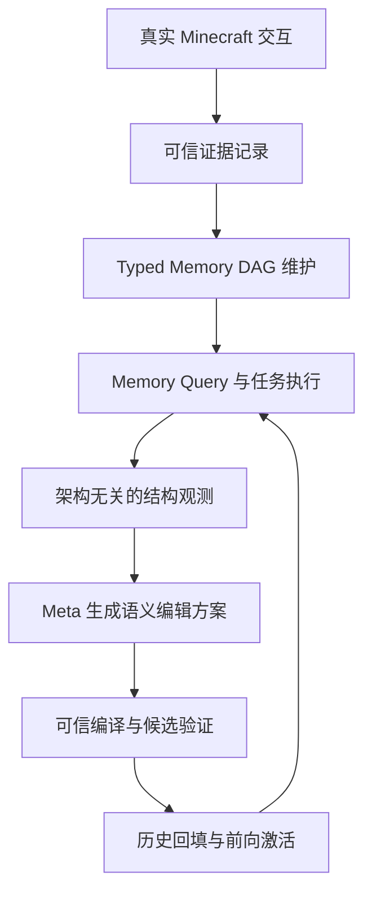

# SEM：面向持久化开放世界智能体的记忆语义进化方法

## 摘要

现有智能体记忆研究主要关注记忆内容的存储、历史经验的检索、技能的积累以及记忆操作策略的优化，但通常默认长期记忆的组织方式已经确定。在持续变化的开放世界环境中，任务结构、实体关系、资源状态、空间布局和行动规律会不断变化，固定的记忆分类和静态的记忆层级难以持续匹配智能体的长期需求。为解决这一问题，本文提出 SEM，一种面向持久化开放世界智能体的记忆语义进化方法。SEM 将长期记忆表示为具有类型、来源、维护模式、访问方式和转换规则的 Typed Memory DAG，并通过持久化证据底座、架构无关的记忆需求监测、Meta-Architect、可信结构编译、候选架构验证、历史证据回填和前向激活机制，使智能体能够自主发现记忆组织中的结构性问题，创建、拆分、合并和淘汰具有不同语义责任的记忆单元。SEM 不仅改变记忆内容，也改变长期记忆内部的语义组织方式，使智能体能够根据持续交互经验重新理解“应该拥有哪些记忆、这些记忆如何分工以及如何维护”。本文以长程 Minecraft Agent 为实验载体，围绕记忆语义表示、结构发现、结构生成、可信演化、历史重解释、长期任务效用、任务迁移和环境变化适应等方面设计系统实验，全面评估记忆语义进化对持久化开放世界智能体的影响。

**关键词：**持久化智能体；记忆语义进化；Typed Memory DAG；开放世界 Agent；Minecraft

## 一、研究定位与研究类型

本文属于智能体记忆架构方法、开放世界 Agent 系统和实证评估相结合的研究。研究目标不是单纯设计一个新的向量检索器，也不是简单增加一个经验数据库，而是构建一套能够持续理解、组织、验证和演化长期记忆语义结构的完整方法。

SEM 的研究对象是长期记忆的语义组织，包括记忆节点承担的语义责任、节点之间的来源和依赖关系、不同记忆模式的维护方式以及面向任务的访问接口。系统不仅回答“过去发生过什么”，还要逐步形成对以下问题的判断：

- 当前长期记忆中应该存在哪些类型的记忆；
- 不同记忆单元分别应该承担什么语义责任；
- 哪些经验应该被归入同一类记忆；
- 哪些混合记忆需要拆分；
- 哪些重复记忆需要合并；
- 哪些结构已经不再有效；
- 新出现的记忆需求如何从历史证据中重建。

本文的核心观点是：长期 Agent 的记忆不应只是不断增加的内容集合，而应当成为一种能够根据长期经验持续调整的语义组织系统。

## 二、研究背景与问题提出

开放世界 Agent 与传统一次性任务 Agent 的根本区别，在于其任务和环境不会在一次交互结束后完全重置。Agent 需要在持续运行过程中记住实体、位置、资源、行动结果、失败原因和可复用的解决方案，并将这些信息迁移到后续任务中。

现有方法主要通过以下方式提升长期能力：保存文本经验、建立向量记忆库、提炼可执行技能、总结失败原因、学习记忆操作策略，或者将经验内化到模型参数中。这些方法能够改善信息保留和经验复用，但大多数系统的记忆组织方式仍由人工预先确定。随着交互经验不断增长，固定组织可能出现以下问题：

1. 不同语义责任被混合到同一记忆单元中，导致检索冲突；
2. 一类记忆同时服务多个任务，难以维持清晰的数据边界；
3. 某些长期需求反复出现，但现有记忆结构没有对应的表达方式；
4. 多个节点保存高度重复的内容，导致维护和查询成本增加；
5. 新的记忆结构无法解释已有历史经验，只能从创建之后重新积累；
6. 记忆内容持续增长，但任务表现和环境适应能力并未同步提升。

这些现象说明，长期记忆的问题不仅是“记住得够不够多”，还包括“记忆应该如何组织”。因此，本文将研究重点放在记忆语义结构的自主进化上。

## 三、研究目标

本文拟构建一个完整的 SEM 系统，使持久化开放世界 Agent 具备以下能力：

1. 从真实环境交互中持续获得可追溯的记忆证据；
2. 用具有类型、来源和维护语义的结构表示长期经验；
3. 自动发现当前记忆组织中的结构性不足；
4. 生成新的记忆语义抽象和结构编辑方案；
5. 对记忆结构变化进行类型、依赖、来源和效果验证；
6. 从历史证据中重建和回填新的记忆结构；
7. 持续维护当前记忆视图并支持通用记忆查询；
8. 适应任务迁移、世界状态变化和环境规律变化；
9. 控制结构复杂度、演化成本和错误编辑风险；
10. 形成可追溯、可复现和可扩展的记忆语义进化实验体系。

## 四、研究问题

### （一）记忆语义表示问题

如何使用带类型、来源、维护模式、访问方式和转换规则的 Memory DAG 表示长期记忆，使记忆结构能够被验证、编译、维护和演化？

### （二）记忆结构需求发现问题

在不直接提供人工 ontology、目标节点名称或结构编辑建议的情况下，智能体如何从历史需求、记忆使用情况、失败事件和环境证据中发现结构性记忆需求？

### （三）记忆结构生成问题

智能体如何判断当前记忆节点需要被创建、拆分、合并或淘汰，并将这种判断转化为合法的架构编辑方案？

### （四）可信演化问题

如何保证新的记忆结构不会破坏类型约束、来源关系、数据依赖、维护一致性和证据完整性？

### （五）历史重解释问题

当智能体创建新的记忆节点时，如何利用已有历史证据重建新节点，使新的记忆结构能够解释过去的经验？

### （六）长期适应问题

记忆语义结构的持续演化能否提升长程任务完成率、跨任务迁移能力、失败恢复能力和环境变化适应能力？

### （七）稳定性与效率问题

如何在结构创新、长期收益、系统稳定性、存储成本、查询成本和模型调用成本之间取得平衡？

## 五、研究假设

### H1：记忆语义结构演化能够提升长期任务效用

在相同模型、规划器、执行器和环境条件下，允许记忆结构自主演化的 Agent，其长期任务成功率、任务进度和综合效用高于固定记忆结构。

### H2：语义重组比单纯记忆增长更有效

单纯增加记忆节点或累积更多内容不能完全替代语义结构重组。真正的创建、拆分、合并和淘汰能够产生额外的长期收益。

### H3：新的记忆抽象能够提高任务迁移能力

能够创建新语义抽象并从历史证据中回填的系统，在新任务、新区域和新任务组合上的迁移能力更强。

### H4：历史回填能够提升新结构的初始有效性

新记忆节点使用历史证据进行重建后，其初始可用性和后续任务收益高于只使用创建之后数据的结构。

### H5：架构无关观测能够支持自主结构发现

即使不提供人工目标结构和编辑提示，Meta-Architect 仍能够根据中性观测提出具有语义合理性的结构编辑。

### H6：可信编译和候选验证能够降低错误演化风险

Typed IR、来源兼容性检查、候选隔离和采纳门能够阻止非法、无来源或低效的记忆结构进入实际运行环境。

### H7：慢速结构演化能够提升系统稳定性

基于长期 exposure、持续性症状、最小停留时间和刷新条件的结构演化，相比任务级即时修改能够减少结构振荡、重复编辑和无效调用。

### H8：SEM 能够适应任务和环境变化

当任务分布、资源状态、空间布局或环境规律发生变化时，SEM 能够通过记忆结构调整保持更强的长期适应能力。

### H9：不同组织路径可以实现功能等价

不同初始记忆结构可以形成不同的节点布局和演化路径，但仍可能获得相近的功能覆盖和长期效用。

### H10：记忆语义收益独立于单一检索优化

在控制检索粒度、查询策略和记忆操作方式后，SEM 的结构演化仍能产生独立的长期收益。

## 六、SEM 方法架构

### （一）总体架构

SEM 由证据层、记忆结构层、演化控制层、语义推理层、可信执行层和评估层组成。



### （二）证据底座

SEM 将持久化证据划分为：

\[
J=J_{mem}\oplus J_{audit}
\]

`J_mem` 是允许用于未来记忆构建和重建的环境证据；`J_audit` 是评估、验证、统计和实验控制证据。`J_audit` 不得被写入 Memory DAG，避免实验标签和隐藏信息污染 Agent 的长期记忆。

每条证据至少包含时间、任务、世界状态、可见观察、行动、真实效果、结果状态、来源引用和完整性信息。

### （三）Typed Memory DAG

当前记忆架构表示为：

\[
A_k=(N_k,E_k)
\]

其中，(N_k) 是当前存在的 Memory Node 集合，(E_k) 是节点之间的来源、依赖和物化关系。

每个 Node 包含：

```text
node_id
purpose
scope
mode
schema
access
sources
transform
maintenance_contract
provenance
```

Memory Mode 包括：

- `APPEND`：保存持续追加的经验事件；
- `CURRENT`：表示某类实体或世界状态的当前状态；
- `AGGREGATE`：对历史证据进行统计、总结或关系聚合。

### （四）Memory Transform IR

记忆结构通过受约束的 Transform IR 表达。确定性操作包括：

```text
FILTER
PROJECT
GROUP_BY
DEDUP
UNION
AGGREGATE_STATS
```

受限语义操作包括：

```text
SEMANTIC_MAP
SEMANTIC_REDUCE
SEMANTIC_COMPOSE
```

所有转换必须满足类型合法、来源可追溯、操作有界、无循环递归、无任意外部 I/O 和无直接记忆写入等约束。

### （五）稳定 Memory ABI

Agent 不直接调用固定名称的 Memory Node，而是通过统一接口访问记忆：

```text
STATE_READ
MEMORY_ASK
NODE_DISCOVERY
```

Agent 只表达记忆意图，例如查询历史资源经验、实体状态、区域路径、失败原因和可复用行动模式，系统再根据当前架构完成 Node Discovery 和 Memory Query。

### （六）记忆结构编辑

SEM 支持四类结构编辑：

#### 1. CREATE_NODE

当现有结构无法表达持续性需求时，创建新的语义记忆节点，例如 RouteMemory、FailureRecoveryMemory、EntityStateMemory 和 ResourceTransitionMemory。

#### 2. RETIRE_NODE

当节点长期冗余、低效或不再承担有效语义责任时，将其退出当前架构。退出节点不代表删除历史证据。

#### 3. SPLIT_NODE

当一个节点承担多个不同语义责任并造成检索冲突或维护混乱时，将其拆分为多个子节点。

#### 4. MERGE_NODES

当两个节点承担高度重叠且互补的语义责任时，将其合并，以减少重复维护和查询成本。

每次结构演化产生一个完整语义假设：

\[
|\Delta_{semantic}A|=1
\]

### （七）架构无关监测

Monitor 负责判断系统是否积累了足够的长期证据，是否值得进行结构审查。它不直接告诉 Meta 应该执行哪种编辑，而是提供：

- Memory Opportunity；
- 记忆使用频率；
- 记忆命中和失败；
- 过期使用；
- 冲突检索；
- 查询成本；
- 未解决记忆意图；
- 字段分布；
- 节点关系；
- 历史演化记录。

记忆需求定义为：

\[
MemoryOpportunity=HistoricalDemand\land EligiblePriorEvidence
\]

只有当结构性问题在多个 exposure block 中持续出现，并满足支持度、停留时间和刷新条件后，才进入结构审查。

### （八）Meta-Architect

Meta-Architect 负责完成语义抽象和结构方案生成，可以解释症状、识别语义重叠、发现新抽象并提出结构编辑，也可以选择 `NO_EDIT`。

Meta 不得直接激活结构、写入记忆、修改验证规则、修改采纳政策、获取隐藏标签、访问独立审计集或生成任意代码。

### （九）可信编译与候选门控

完整流程为：

\[
(A_k,e)\rightarrow Compiler\rightarrow Verifier\rightarrow Candidate\ A'\rightarrow CleanMaterialize\rightarrow Gate\rightarrow Accept/Reject
\]

验证内容包括语法、类型、Schema、Transform、图结构、来源兼容性、可达性、维护契约、复杂度、证据追溯性和真实结构变化判定。

候选架构必须从同一历史证据切片重新构建，不得直接复制当前缓存或旧状态。

### （十）历史回填与前向激活

新节点创建后，系统首先从 `J_mem` 中回填历史证据，再开始在线维护。候选被接受后执行：

```text
discard temporary candidate state
clean rematerialize A'
atomic forward switch
start new architecture generation
record evolution ledger
```

## 七、实验设计

### （一）实验环境

实验使用持久化 Minecraft 世界，Agent 通过真实交互接口完成观察、规划和行动。任务之间保留合法世界状态，任务完成由环境状态和 effect receipt 共同验证。

### （二）任务类型

1. Resource Gathering：木材、石头、煤炭、铁矿及指定区域资源；
2. Craft and Technology Tree：工作台、工具、熔炉、冶炼、武器和护甲；
3. Navigation and Revisit：目标区域、历史位置、资源点和变化地形；
4. Combat and Survival：战斗、撤退、装备调整和失败恢复；
5. Building and Spatial Tasks：建筑、空间关系和材料放置；
6. Mixed Long-Horizon Tasks：采集、制作、探索、冶炼、升级和综合目标。

任务 manifest 应在正式实验前冻结，任务生成过程不能读取当前 Memory DAG、Meta 输出或期望编辑类型。

### （三）主要 Baseline

| Baseline | 说明 | 研究作用 |
|---|---|---|
| Fixed Memory | 记忆结构固定，不进行结构编辑 | 判断固定架构能力上限 |
| Rule-Based Evolution | 使用相同证据、监测和编辑约束，由确定性规则选择编辑 | 隔离 Meta 语义推理价值 |
| Full SEM | 使用完整证据、Typed DAG、Meta、编译、门控、回填和前向激活 | 主要方法 |
| Flat Memory | 平面经验记忆或简单向量检索 | 比较平面内容累积与语义组织 |
| Skill Library | 使用可复用技能库积累经验 | 比较技能积累与记忆语义进化 |
| Planning Reference | 强规划但没有可演化长期语义记忆 | 排除规划能力差异 |

所有主要 baseline 应使用相同模型、规划器、执行器、任务集、世界初始状态、预算和评价标准。

### （四）机制消融

1. `No-Create`：禁止创建新的 Memory Node；
2. `Create-Only`：只允许增加节点，不允许重组；
3. `No-Historical-Backfill`：新节点不能使用历史证据；
4. `No-Neutral-Monitor`：根据局部失败直接触发结构修改；
5. `No-Trusted-Gate`：取消候选结构的可信门控；
6. `No-Forward-Maintenance`：不进行完整的架构驱动维护；
7. `No-Context Adaptation`：关闭上下文相关记忆实例机制；
8. `No-Granularity Adaptation`：固定记忆粒度；
9. `No-Residency Adaptation`：关闭热点、温态和冷态记忆管理。

### （五）实验类型

| 实验 | 目标 |
|---|---|
| 记忆语义表示实验 | 验证 Typed DAG 是否能够表达真实 Minecraft 记忆需求 |
| 结构发现实验 | 验证系统能否从中性证据中发现结构需求 |
| 编辑能力实验 | 验证 CREATE、RETIRE、SPLIT、MERGE 的有效性 |
| 历史回填实验 | 验证新结构能否重建过去经验 |
| 可信性实验 | 验证非法结构、错误来源和污染证据能否被拦截 |
| 长期任务实验 | 比较不同记忆机制的长期任务效用 |
| 迁移实验 | 检验结构和经验能否迁移到新任务和新区域 |
| 环境漂移实验 | 检验系统面对世界变化的适应能力 |
| 稳定性实验 | 分析结构复杂度、编辑频率和结构振荡 |
| 成本实验 | 分析模型、查询、维护和候选验证成本 |

## 八、指标体系

### （一）任务能力指标

- Task Success Rate；
- Long-Horizon Success Rate；
- Task Progress；
- Recovery Success Rate；
- Transfer Success；
- Drift Adaptation Gain。

### （二）记忆使用指标

- Memory Query Success；
- Memory Hit Rate；
- Retrieval Miss Rate；
- Stale Retrieval Rate；
- Conflicting Retrieval Rate；
- Unresolved Intent Rate；
- Query Latency；
- Memory Call Count。

### （三）结构演化指标

- Node Count；
- Edge Count；
- Architecture Complexity；
- Edit Count；
- Accepted Edit Rate；
- Edit Type Distribution；
- Architecture Churn；
- Reversal Rate；
- Structural Diversity；
- Functional Coverage。

### （四）演化质量指标

- Evolution Delay；
- Sustained Target Effect；
- Historical Backfill Coverage；
- Post-Creation Utility Retention；
- Functional Convergence；
- Useful Novel Abstraction Rate。

### （五）可信性指标

- Evidence Grounding Rate；
- Provenance Completeness；
- `J_audit` Leakage Rate；
- Invalid Proposal Rejection Rate；
- Source Compatibility Failure Rate；
- Materialization Confluence；
- Candidate Isolation Integrity；
- Clean Rematerialization Success Rate。

### （六）资源成本指标

- LLM Token Cost；
- Meta Invocation Count；
- Meta Latency；
- Memory Maintenance Cost；
- Candidate Evaluation Cost；
- Storage Cost；
- Cost per Successful Task。

综合效用可表示为：

\[
U(A)=\alpha U_{task}+\beta U_{transfer}+\gamma U_{adaptation}-\lambda_1C_{runtime}-\lambda_2C_{architecture}-\lambda_3C_{evolution}
\]

## 九、实验结果的组织方式

结果章节应按科学问题组织，而不是按代码模块组织。

### 1. 整体长期能力

报告总体任务成功率、长程任务成功率、任务进度、恢复能力和综合效用，回答完整 SEM 是否能够改善持久化 Agent 的长期行为。

### 2. 记忆语义结构是否真正发生变化

展示节点数量、编辑类型、拓扑变化、节点职责变化和记忆需求与结构编辑之间的时间关系，回答性能变化是否来自记忆语义组织改变。

### 3. 新抽象与历史回填

展示新节点创建前后的历史覆盖、回填前后任务表现、首次使用时间和无回填消融结果。

### 4. 任务迁移与环境漂移

展示新任务组合、新区域、资源状态变化和任务规律变化后的性能恢复曲线。

### 5. 可信性和稳定性

展示非法候选拒绝、来源冲突、类型错误、审计信息泄漏、结构振荡和错误编辑影响。

### 6. 成本与收益平衡

展示 Meta 调用次数、结构编辑数量、查询延迟、编译验证成本、维护成本以及每项成功任务的平均成本。

## 十、结论

本文提出 SEM，一种面向持久化开放世界智能体的记忆语义进化方法。SEM 将长期记忆从静态内容集合扩展为可理解、可组织、可验证和可持续演化的语义结构。系统通过持久化证据、Typed Memory DAG、受限 Memory Transform、架构无关监测、Meta-Architect、可信编译、候选门控、历史回填和前向激活，形成从真实交互经验到记忆结构演化的完整闭环。

与只增加记忆内容、优化检索策略或积累技能库的方法不同，SEM 允许智能体在长期运行过程中重新划分记忆语义责任，创建新的记忆抽象，拆分混合语义，合并重复职责，淘汰低效结构，并利用历史证据使新结构具备可用的初始内容。

SEM 的核心意义不是构建更大的记忆库，而是使 Agent 获得更高层次的记忆能力：它不仅能够保存和调用过去经验，还能够逐步理解自己的记忆应该如何组织，并根据开放世界中的持续变化调整这种组织方式。

## 十一、创新与贡献

### 1. 提出记忆语义进化研究范式

将 Agent 自进化的对象从记忆内容和检索策略扩展到长期记忆的语义责任组织结构。

### 2. 提出完整的 Typed Memory DAG 架构

使用具有类型、来源、维护模式、访问方式和转换规则的 Memory DAG 表示可演化长期记忆。

### 3. 提出基于真实证据的结构自演化机制

使 Agent 能够根据长期交互经验自主发现记忆需求，并生成 CREATE、RETIRE、SPLIT 和 MERGE 等结构编辑。

### 4. 提出可信的记忆结构编译与采纳机制

通过 IR Verifier、Source Compatibility、Candidate Isolation、Clean Materialization 和 Forward Activation，保证结构变化具有合法性、可追溯性和可验证性。

### 5. 提出支持未来重解释的证据底座

通过 `J_mem/J_audit` 分离和 Historical Backfill，使未来出现的新记忆结构能够重新解释已有经验。

### 6. 提出面向开放世界 Agent 的长期记忆评估体系

同时评估任务效用、记忆使用、结构发现、长期迁移、环境适应、结构稳定性、证据完整性、演化成本和系统可信性。

### 7. 在长程 Minecraft Agent 中验证记忆语义进化

利用 Minecraft 的持久世界、多阶段任务、资源依赖、空间关系、行动失败和环境变化，验证 SEM 在真实开放世界长期交互中的实际价值。

## 十二、论文结构

1. 引言；
2. 研究背景与相关工作；
3. 记忆语义进化问题定义；
4. SEM 总体架构；
5. Typed Memory DAG 与记忆语义表示；
6. 证据驱动的记忆演化机制；
7. Meta-Architect 与可信候选验证；
8. 历史回填、持续维护与前向激活；
9. Minecraft 实验环境与任务体系；
10. Baseline、实验条件和评价指标；
11. 记忆结构演化结果；
12. 长期任务、迁移和环境适应结果；
13. 可信性、稳定性和成本分析；
14. 局限性；
15. 结论。
