# Self-Evolving Memory Architecture for Persistent Open-World Agents

> **长期主设计文档 / Living Design Document**  
> 当前版本：**v0.29**  
> 日期：**2026-08-17**  
> 当前研究环境：**Minecraft / Voyager / Mineflayer**  
> 当前状态：**Design-Freeze 后已通过 T0 deterministic contracts、T1 synthetic DAG integration、T2A Mineflayer integration harness、canonical T2B local-gate harness 与 T2B grounding/evidence harness；v0.29 将 Evidence Bundle 升级为 `t2b-evidence-v2`，除 gate/server/source/runtime provenance 外，强制固化实际 `server.properties`、`eula.txt` 与 persistent world `level.dat`。同时新增 repository-local `T3_UNLOCK.json` workflow guard：只有真实 T2B PASS bundle 在当前 checkout 上完整验证且 source-tree fingerprint 精确匹配，才允许生成/验证 unlock record；`--skip-repo-match` 只能用于查看 bundle，永远不能解锁 T3。当前 hosted environment 仍无 Mineflayer npm cache/global install、无本地 Minecraft server，因此真实 T2B=BLOCKED_BY_ENVIRONMENT；T3 self-evolution 继续 LOCKED。Evidence Bundle 与 T3 unlock 均只承担 integrity/reproducibility/workflow gating，不声称 remote-execution attestation；核心 Meta grammar 与论文 novelty 均不扩权。**

---

## 0. 文档用途与维护规则

本文件不是一次性方案说明，而是本研究方向的**唯一主设计文档（single living design document）**。后续关于架构、源码、实验、论文定位的讨论，不再重新散落建立独立方案，而是在本文件基础上增量修改。

维护规则：

1. **架构变化必须修改正文，而不是只在聊天中口头更新。**
2. 每一次重要优化必须在文末 `设计演化日志` 中记录：
   - 原方案；
   - 修改内容；
   - 修改原因；
   - 受到什么工作/系统思想启发；
   - 解决了什么问题；
   - 是否删除了旧机制。
3. 被否决的机制不直接从历史中消失，而是进入 `已明确删除/暂缓的设计`，防止后续重复走弯路。
4. 当前正文永远描述**最新有效架构**；历史方案只保留在演化日志。
5. 研究目标保持稳定：**Memory Architecture 本身是 Agent 可以自主修改的长期状态，而不是一个固定的人类工程模块。**
6. 采用 **MVP → Standard → Deluxe** 的分层实现策略：核心论文 claim 必须由 MVP 独立成立；Standard/Deluxe 只增强稳定性、效率、解释性与实验完整度，不能成为核心方法成立的隐性前提。
7. 被暂缓但具有明确价值的机制不再简单标记为“删除”，而要归入 `Standard/Deluxe Upgrade Backlog`；只有与研究边界冲突的机制才进入“明确不做”。

---

# Part I. 研究问题与核心定位

## 1. 最终研究问题

传统 Agent Memory 通常研究：

- 记住什么；
- 写什么；
- 检索什么；
- 如何压缩；
- 如何召回；
- 当前应该使用哪个已有 Memory。

本研究进一步提出：

> **一个长期存在于开放世界中的 Agent，能否根据自己的真实运行经验，自主发现当前 Memory Architecture 的结构性问题，并新增、删除、拆分、合并和重新组合长期记忆结构？**

核心问题可写为：

\[
\boxed{
\text{Can a persistent agent autonomously redesign the logical structure of its own long-term memory?}
}
\]

因此，我们不把 Memory Architecture 视为固定超参数，而将其定义为一个缓慢变化的 Agent state：

\[
\boxed{
A_0 \rightarrow A_1 \rightarrow A_2 \rightarrow \cdots
}
\]

其中 \(A_k\) 是第 \(k\) 代 Logical Memory Architecture。

---

## 2. 研究核心不是 Plugin Routing

早期方案曾退化为：

\[
\{World,Episodic,Semantic,Skill\}
\rightarrow
\text{选择一个 Working Set}
\]

该问题本质上属于 adaptive routing / memory selection：

\[
\text{Which existing memories should be used now?}
\]

而本项目最终研究的是：

\[
\boxed{
\text{What memory structures should exist at all?}
}
\]

因此，当前研究**不再以固定插件集合中的组合选择作为最终贡献**。

Routing 可以未来重新加入，但第一版核心必须直接支持：

\[
\boxed{
CREATE,
RETIRE,
SPLIT,
MERGE
}
\]

---

## 3. 当前方法一句话定义

> **A persistent Minecraft agent accumulates immutable evidence, observes structural pathologies in its current long-term memory system, lets a frozen Meta-Architect propose one constrained edit to a typed logical Memory DAG, validates the candidate prospectively on fresh normal tasks, and adopts the new architecture only if it improves the intended memory pathology without reducing overall task utility.**

中文概括：

> **证据持续积累，记忆组织可以进化；LLM 只负责提出结构语义变化，可信运行时负责合法性、编译、数据构建和选择。**

---

# Part II. 研究边界：什么能进化，什么不能进化

## 4. 三平面总体架构

系统不采用“LLM 可以改所有代码”的开放式自修改，而采用明确的权限边界：

\[
\boxed{
\text{Kernel Plane}
+
\text{Evolution Control Plane}
+
\text{Evolvable Memory Data Plane}
}
\]

其中：

- **Kernel Plane**：固定机制，保证系统正确；
- **Evolution Control Plane**：固定演化规则和评价标准；
- **Memory Data Plane**：唯一允许 Meta-LLM 修改的结构区域。

### 4.1 总体架构图

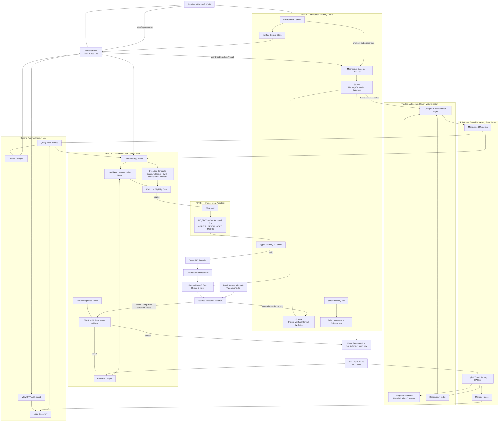

---

## 5. Kernel Plane：不可修改的可信机制

Kernel 的设计原则来自操作系统的核心思想：

\[
\boxed{
\text{Mechanism is fixed; policy/semantics live above it.}
}
\]

Kernel **不应该理解**“Episodic Memory”“Route Memory”“Failure Memory”这些语义类别。

Kernel 只认识：

- Evidence；
- Typed Memory Node；
- Schema type；
- source dependency；
- legal/illegal IR；
- role permission；
- verified state。

### 5.1 Kernel 内必须固定的内容

#### 5.1.1 Verified Current State

当前 Agent 的关键运行事实不能由 LLM 自报。

示例：

```text
current_goal
current_subgoal
inventory
position
health
equipment
verified_progress
```

只有 environment/verifier 可以提交。

核心原则：

\[
\boxed{
LLM\ completion\ claim \neq verified\ state\ update
}
\]

#### 5.1.2 Future-Reinterpretable Evidence Substrate（v0.9）

从 v0.9 开始，不再把所有环境/Verifier 信息笼统称为同一个可读 `Canonical Evidence Journal`。Evidence Plane 逻辑拆分为：

\[
\boxed{
J=J^{mem}\oplus J^{audit}
}
\]

其中：

- `J_mem`：**Memory-Grounded Canonical Evidence**，只保存 Agent 当时实际可观察或被明确授权可知的信息，可作为当前及未来任何 Memory Node 的 source；
- `J_audit`：Verifier / evaluator / control-plane 私有证据，只用于 scoring、验证与诊断，永远不能被 Memory DAG materialize。

核心权限：

\[
\boxed{
MaterializableEvidence=J^{mem}
}
\]

\[
\boxed{
J^{audit}\not\to MemoryDAG
}
\]

MVP Evidence 粒度采用：

\[
\boxed{
Decision\text{-}Boundary\ Core
+
Bounded\ Actuator/Tool\ Execution\ Trace
}
\]

即不保存所有 game tick，也不依赖当前 Memory ontology 做“重要性筛选”。对于一次长工具调用，Runtime 可保存固定采样或事件式的 agent-visible execution trace artifact，以避免只留下起点/终点而失去未来 abstraction 所需细节。

建议 EvidenceEvent：

```python
@dataclass(frozen=True, slots=True)
class EvidenceEvent:
    event_id: str
    sequence_id: int
    timestamp: float
    episode_id: str
    task_id: str | None
    event_type: str
    source_kind: str
    channel: EvidenceChannel
    payload: dict
    artifact_refs: tuple[str, ...] = ()
    causal_refs: tuple[str, ...] = ()
    confidence: float = 1.0
    provenance: dict = field(default_factory=dict)
```

MVP 保留 admitted grounded core；允许 lossless compression、content-addressed dedup 和 cold storage，但**不允许用当前架构生成的 semantic summary 替换后删除不可重建的 grounded evidence**。

因此：

\[
\boxed{
Evidence\ persists;\ Memory\ organization\ evolves.
}
\]

第一版仍不做复杂 bitemporal / historical world replay / counterfactual replay。后期 CREATE Node 对历史 `J_mem` 的读取属于 **historical backfill / materialization**，不是重放旧世界。

#### 5.1.3 Stable Memory ABI

Executor 不直接知道具体 Memory Node。

用户态最稳定入口：

```text
STATE_READ
MEMORY_ASK
```

Memory Runtime 内部再使用：

```text
NODE_DISCOVER
MEM_QUERY
```

Meta-Architect 只有：

```text
ARCH_INSPECT
ARCH_PROPOSE
```

Meta 没有 `ARCH_ACTIVATE`。

#### 5.1.4 IR Verifier

任何 Meta 产生的新 Logical Architecture 必须先验证：

- Node schema 是否合法；
- field type 是否属于允许集合；
- source Node 是否存在；
- transform 是否属于 trusted helper；
- DAG 是否无环；
- Node 数量是否超预算；
- 是否出现禁止访问 Control Plane 的 source；
- 是否只是 canonical no-op。

非法 candidate 不进入 Minecraft validation。

---

## 6. Evolution Control Plane：固定的“演化宪法”

这层不是 Agent 的普通长期 Memory。

它不进入 Memory IR，也不能被 `CREATE / RETIRE / SPLIT / MERGE` 修改。

### 6.1 包含的模块

```text
Telemetry Aggregator
Neutral Architecture Profiler
Architecture Observation Builder
Evolution Eligibility Gate
Evolution Ledger
Edit-Specific Candidate Validator
Acceptance Policy
Meta Context Builder
```

### 6.2 为什么必须独立

如果 Meta-Architect 能修改：

- 自己过去失败的 proposal；
- acceptance threshold；
- performance metric；
- validation task sampler；

系统会产生明显 self-confirmation。

因此：

\[
\boxed{
Meta\ has\ authority\ to\ propose,
not\ authority\ to\ define\ authority.
}
\]

### 6.3 Control Plane 信息流

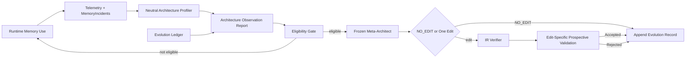

---

## 7. Evolvable Memory Data Plane

真正允许 Agent 自主修改的只有：

\[
\boxed{
A_k=(N_k,E_k)
}
\]

其中：

- \(N_k\)：Memory Nodes；
- \(E_k\)：Node 间由 `sources + transform` 隐式形成的依赖边。

它是一个：

\[
\boxed{
\text{Typed Memory DAG}
}
\]

而不是 Python 程序。

---

# Part III. Typed Memory DAG

## 8. 为什么需要 Memory IR

如果让 LLM 直接生成任意 Python：

```text
LLM → Python → Database
```

那么研究会退化成：

> LLM software engineering / harness rewriting。

同时带来：

- 不稳定；
- 不易复现；
- 安全边界模糊；
- code bug 与 architecture quality 混淆；
- 搜索空间无限。

因此采用类似“受限可验证中间表示”的思想：

\[
\boxed{
LLM\ intent
\rightarrow
Typed\ Logical\ IR
\rightarrow
Verifier
\rightarrow
Trusted\ Compiler
}
\]

这与 eBPF 的核心思想相似：允许表达受限逻辑，但程序先经过 verifier，再进入可信运行环境；我们借的是**受限表达 + load-time verification**，不是复制 eBPF 本身。

---

## 9. MemoryNode 最小定义

第一版 NodeSpec：

\[
\boxed{
N=(purpose,scope,mode,schema,access,sources,transform)
}
\]

推荐源码结构：

```python
@dataclass(frozen=True)
class MemoryNodeSpec:
    node_id: str
    purpose: str

    scope: str
    mode: str

    schema: tuple["FieldSpec", ...]
    access: frozenset[str]

    sources: tuple[str, ...]
    transform: str | None
```

---

## 10. Node 字段语义

### 10.1 `purpose`

自然语言描述该 Node 的长期职责。

例：

```text
Store reusable routes between previously visited locations.
```

它同时作为 Generic Node Discovery 的 semantic card。

### 10.2 `scope`

第一版只保留两种：

```text
WORLD
AGENT
```

避免过早引入复杂 namespace hierarchy。

### 10.3 `mode`

只允许：

```text
APPEND
CURRENT
AGGREGATE
```

含义：

- `APPEND`：历史记录型；
- `CURRENT`：keyed current-state 型；
- `AGGREGATE`：知识、统计、压缩型。

### 10.4 `schema`

第一版 Field Type Universe：

```text
TEXT
CATEGORY
BOOL
INT
FLOAT
ENTITY
POSITION
TIME
ACTION
OUTCOME
EVIDENCE_REF
MEMORY_REF
PROCEDURE
```

Meta-LLM 不可以自己定义底层新类型。

### 10.5 `access`

逻辑检索模式：

```text
SEMANTIC
ENTITY
SPATIAL
TEMPORAL
EXACT
```

LLM 不决定 HNSW、SQLite、R-tree 等物理实现。

### 10.6 `sources`

Node 的输入来源。

例如：

```yaml
sources:
  - StaticWorld
  - ExperienceMemory
```

### 10.7 `transform`

v0.7 不再让 Node 只能从四个 monolithic helper 中选一个，而使用受限的 **Memory Transform IR (MTIR)**。底层 operator 固定，但 Meta 可以组合：

```text
FILTER / PROJECT / GROUP_BY / DEDUP / UNION / AGGREGATE_STATS
SEMANTIC_MAP / SEMANTIC_REDUCE / SEMANTIC_COMPOSE
```

其中 semantic operator 可以携带 Meta 生成的 natural-language `objective`，但由无工具、无网络、schema-constrained 的 Trusted Semantic Executor 执行。禁止 arbitrary Python / SQL / callback。

---

## 11. Memory DAG 示例

### 11.1 Seed Architecture

初始架构：

\[
\boxed{
A_0=
\{World,Experience,Knowledge,Procedure\}
}
\]

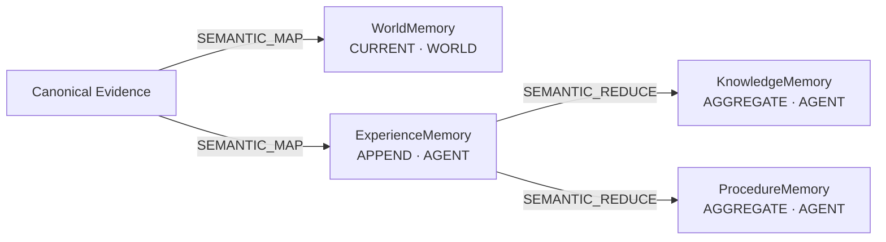

### 11.2 进化后的可能架构

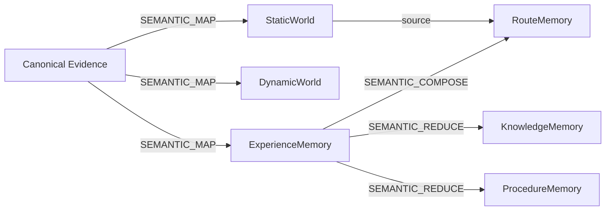

该架构并非我们预先硬编码的最终答案；它只是用于说明系统允许出现真正新的结构。

---

# Part IV. 四种结构编辑

## 12. Edit Grammar

第一版 Meta-Architect 只允许四种 Macro Edit：

\[
\boxed{
CREATE\_NODE
}
\]

\[
\boxed{
RETIRE\_NODE
}
\]

\[
\boxed{
SPLIT\_NODE
}
\]

\[
\boxed{
MERGE\_NODES
}
\]

并且：

\[
\boxed{
|\Delta A_k|=1
}
\]

每轮 evolution 只能进行一个结构 edit。

---

## 13. CREATE_NODE

作用：产生当前架构中原本不存在的新 Memory abstraction。

例：

```yaml
operation: CREATE_NODE

node:
  purpose: >
    Store reusable routes between previously visited locations.

  scope: WORLD
  mode: AGGREGATE

  schema:
    - {name: origin, type: POSITION}
    - {name: destination, type: POSITION}
    - {name: route, type: LIST[POSITION]}
    - {name: success_rate, type: FLOAT}

  access:
    - SEMANTIC
    - SPATIAL

  sources:
    - WorldMemory
    - ExperienceMemory

  transform:
    op: SEMANTIC_COMPOSE
    objective: >
      Derive reusable paths from grounded locations and successful navigation experiences without inventing unobserved waypoints.
```

CREATE 的关键不是“新名称”，而是形成新的：

- source pattern；
- schema；
- access pattern；
- derived representation。

---

## 14. RETIRE_NODE

作用：让某个长期独立价值不足的 Memory Node 退出当前架构。

注意：

\[
\boxed{
RETIRE(Node)\neq DELETE(Evidence)
}
\]

Canonical Evidence 永远保留。

旧 Node 的 materialized state 可以在新架构稳定后释放。

---

## 15. SPLIT_NODE

语义：一个 Node 内部出现长期结构异质性，需要分为多个职责不同的 Node。

示例：

\[
WorldMemory
\rightarrow
StaticWorld+DynamicWorld
\]

典型触发证据：

- dynamic objects stale rate 高；
- static landmarks stale rate 低；
- 全局 TTL 调整无法同时优化两类记录；
- 现有统一 schema/lifecycle 造成冲突。

在 Compiler 层可展开为：

```text
CREATE StaticWorld
CREATE DynamicWorld
RETIRE WorldMemory
```

---

## 16. MERGE_NODES

语义：两个 Node 长期高度冗余，独立存在不再值得其结构成本。

Compiler 层可展开：

```text
CREATE MergedNode
RETIRE NodeA
RETIRE NodeB
```

MERGE 不应该只因为两个 Node 经常一起被查询；共用可能表示互补，而不是冗余。

第一版是否 Merge 由 Meta 根据 Telemetry 判断，最后交 Candidate Validation 决定。

---

## 17. Edit 编译关系图

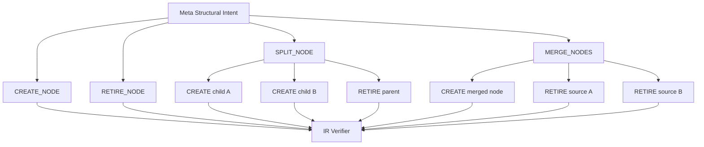

---

# Part IV-A. v0.2 源码级 IR 契约（当前实现基准）

> 本 Part 从 v0.2 开始作为 `memory_ir/` 的**规范性定义（normative specification）**。前面的 Part III–IV 解释设计思想；本 Part 决定源码必须如何实现。若后续聊天中的临时想法与本 Part 冲突，以最新版本的本 Part 为准。

## 17.1 v0.2 的实现目标

v0.2 不再继续增加宏观模块，而是把以下链条冻结到可以直接编码：

\[
\boxed{
FieldSpec
\rightarrow
SourceSpec
\rightarrow
MemoryNodeSpec
\rightarrow
MemoryArchitectureSpec
\rightarrow
ArchitectureEdit
\rightarrow
IRVerifier
\rightarrow
PhysicalCompiler
}
\]

设计目标只有五个：

1. **LLM 只表达逻辑结构，不写任意 Python。**
2. **所有候选架构都是有限、类型化、可静态检查的 DAG。**
3. **所有可演化 Node 必须从 memory-grounded `J_mem` 与当前 DAG 上游重建；`J_audit` 永远不可作为 source。**
4. **CREATE / RETIRE / SPLIT / MERGE 都有明确、可测试的语义。**
5. **候选构建不依赖 rollback、historical replay、counterfactual replay 或旧架构隐藏状态。**

### 17.1.1 源码契约总图

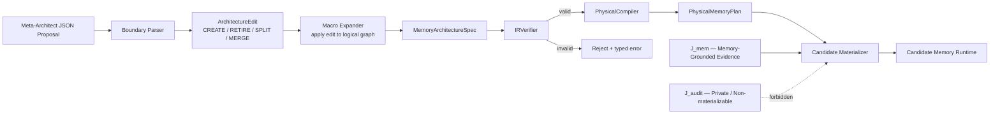

---

## 17.2 固定枚举：LLM 不得创造新的底层 primitive

第一版 IR 的底层 vocabulary 由可信代码冻结。

```python
from enum import StrEnum


class PrimitiveType(StrEnum):
    # execution-grounded atoms: Meta cannot extend this enum
    TEXT = "TEXT"
    CATEGORY = "CATEGORY"
    BOOL = "BOOL"
    INT = "INT"
    FLOAT = "FLOAT"
    ENTITY = "ENTITY"
    POSITION = "POSITION"
    TIME = "TIME"
    ACTION = "ACTION"
    OUTCOME = "OUTCOME"
    EVIDENCE_REF = "EVIDENCE_REF"
    MEMORY_REF = "MEMORY_REF"


class ContainerKind(StrEnum):
    SCALAR = "SCALAR"
    OPTIONAL = "OPTIONAL"
    LIST = "LIST"
    SET = "SET"


class MemoryScope(StrEnum):
    WORLD = "WORLD"
    AGENT = "AGENT"


class MemoryMode(StrEnum):
    APPEND = "APPEND"
    CURRENT = "CURRENT"
    AGGREGATE = "AGGREGATE"


class AccessMode(StrEnum):
    SEMANTIC = "SEMANTIC"
    ENTITY = "ENTITY"
    SPATIAL = "SPATIAL"
    TEMPORAL = "TEMPORAL"
    EXACT = "EXACT"


class OperatorKind(StrEnum):
    # deterministic structural algebra
    FILTER = "FILTER"
    PROJECT = "PROJECT"
    GROUP_BY = "GROUP_BY"
    DEDUP = "DEDUP"
    UNION = "UNION"
    AGGREGATE_STATS = "AGGREGATE_STATS"

    # bounded semantic operators executed by a trusted, tool-free helper runtime
    SEMANTIC_MAP = "SEMANTIC_MAP"
    SEMANTIC_REDUCE = "SEMANTIC_REDUCE"
    SEMANTIC_COMPOSE = "SEMANTIC_COMPOSE"


class SourceKind(StrEnum):
    EVIDENCE = "EVIDENCE"
    NODE = "NODE"
```

关键约束：

\[
\boxed{
MetaLLM\ cannot\ extend\ execution\ primitives
}
\]

如果未来确实需要新的底层 primitive，例如新的几何类型或新的 Trusted Helper，这属于**研究代码升级**，而不是 Agent runtime self-evolution。

---

## 17.3 `FieldSpec`

`FieldSpec` 描述逻辑 schema，而不是数据库列实现。

```python
from dataclasses import dataclass


@dataclass(frozen=True, slots=True)
class TypeSpec:
    base: PrimitiveType
    container: ContainerKind = ContainerKind.SCALAR


@dataclass(frozen=True, slots=True)
class FieldSpec:
    name: str
    dtype: TypeSpec
    required: bool = True
    description: str = ""
```

### 17.3.0 v0.7：Primitive 固定，但 schema composition 开放

从 v0.7 开始，不再把 `PROCEDURE` 之类高层概念作为底层 primitive。可复用过程表示为例如：

```text
LIST[ACTION]
```

路线可以表示为：

```text
LIST[POSITION]
```

Meta 可以自由组合字段名称、字段描述和这些固定类型构造器，从而创造新的 schema；但不能创造新的 executable base type。第一版容器只允许 `SCALAR / OPTIONAL / LIST / SET`，并禁止容器无限嵌套。

因此：

\[
\boxed{
PrimitiveVocabulary=Fixed,\qquad SchemaComposition=Open
}
\]

### 17.3.1 约束

字段名必须满足：

```text
^[a-z][a-z0-9_]{0,47}$
```

同一个 Node 中：

\[
\boxed{
field_i.name \neq field_j.name
}
\]

字段顺序不构成架构语义；Canonicalization 时按 `name` 排序。

`description` 只用于帮助 Meta-Architect / debug，不参与物理 backend 选择。

### 17.3.2 为什么没有 `vector_dim` / `index_type`

禁止：

```yaml
embedding_dim: 1024
index: hnsw
```

因为这些属于 Physical Plan。

逻辑 Node 只声明：

```yaml
access:
  - SEMANTIC
```

Compiler 再决定 embedding/index 实现。

---

## 17.3A v0.7 Memory Transform IR（MTIR）：Closed Primitive, Open Composition

### 17.3A.1 为什么替换四个固定 Helper

旧设计只有：

```text
EXTRACT / SUMMARIZE / AGGREGATE / PROCEDURALIZE
```

它很安全，但存在一个研究风险：如果每个 CREATE 都只能选择研究者预设好的高层 helper，那么所谓“开放式架构创造”可能仍然只是模板组合。

v0.7 改成：

\[
\boxed{
Closed\ Execution\ Primitive\ Set\ +\ Open\ Semantic\ Composition
}
\]

固定的是**执行机制**；开放的是**新的 Memory abstraction 如何由这些机制组合出来**。

### 17.3A.2 `TransformPlan`

概念接口：

```python
@dataclass(frozen=True, slots=True)
class SemanticObjective:
    text: str
    # fixed runtime validates length and strips any tool/code channel


@dataclass(frozen=True, slots=True)
class TransformOpSpec:
    op: OperatorKind
    inputs: tuple[str, ...]
    params: dict
    objective: SemanticObjective | None = None


@dataclass(frozen=True, slots=True)
class TransformPlan:
    ops: tuple[TransformOpSpec, ...]
    output_ref: str
```

MVP 限制：

```text
max operators per Node <= 6
max semantic operators per Node <= 2
max source fan-in <= 4
no loop / recursion
no external IO
no arbitrary tool call
no cross-node write side effect
```

### 17.3A.3 Deterministic operator

固定：

```text
FILTER
PROJECT
GROUP_BY
DEDUP
UNION
AGGREGATE_STATS
```

它们表达结构性数据组织，不需要 LLM。

### 17.3A.4 Semantic operator

固定执行类别：

```text
SEMANTIC_MAP      one/few inputs -> typed records
SEMANTIC_REDUCE   a group/history -> compressed typed records
SEMANTIC_COMPOSE  multiple heterogeneous sources -> new typed abstraction
```

Meta **不能实现 operator**，但可以定义该 operator 的语义目标。

例如新建 RouteMemory：

```yaml
purpose: Store reusable paths between known locations.
schema:
  - {name: origin, type: POSITION}
  - {name: destination, type: POSITION}
  - {name: path, type: LIST[POSITION]}
  - {name: hazards, type: SET[ENTITY]}
  - {name: success_rate, type: FLOAT}
sources:
  - WorldMemory
  - ExperienceMemory
transform:
  op: SEMANTIC_COMPOSE
  objective: >
    From grounded locations and successful navigation experiences,
    derive reusable paths between recurring origin-destination pairs;
    preserve observed hazards and do not invent unvisited waypoints.
```

这里 `RouteMemory`、字段集合、sources 与 objective 都不是 Runtime 预置模板。

### 17.3A.5 旧四 Helper 的兼容映射

旧 helper 不再是 primitive，只是便捷 macro：

```text
EXTRACT       ~= SEMANTIC_MAP
SUMMARIZE     ~= SEMANTIC_REDUCE
AGGREGATE     ~= GROUP_BY + AGGREGATE_STATS / SEMANTIC_REDUCE
PROCEDURALIZE ~= SEMANTIC_REDUCE or SEMANTIC_COMPOSE -> LIST[ACTION]
```

因此 v0.7 增强表达能力而不破坏旧 Seed 的语义。

### 17.3A.6 Verifier 与 Evaluator 的职责分离

静态 Verifier 可以证明：

\[
\boxed{
WellTyped\land Bounded\land PureEffect\land LegalDependency
}
\]

但不能证明：

> “这个 semantic objective 真的形成了一个有用的 RouteMemory。”

语义质量属于：

\[
\boxed{
ProspectiveCandidateEvaluation
}
\]

因此：

\[
\boxed{
Verifier\ proves\ operational\ safety;\ Evaluator\ tests\ semantic\ utility.
}
\]

这也是 v0.7 最重要的安全/表达能力边界。

---

## 17.4 受限 Selector：支持 SPLIT，但不变成编程语言

SPLIT 需要表达类似下面这种 **post-discovery typed selector**：

```text
entity_kind IN [ZOMBIE, SKELETON, CREEPER, DROPPED_ITEM]
```

注意：v0.5 不再允许 Seed 预先提供 `volatility = STATIC/DYNAMIC` 这类近似结构答案的字段；上述类别组合应由 Meta 根据中立 AOR 自己归纳。

但不能允许 arbitrary Python predicate。

第一版只允许**单层 AND predicate**：

```python
class PredicateOp(StrEnum):
    EQ = "EQ"
    NE = "NE"
    IN = "IN"
    LT = "LT"
    LE = "LE"
    GT = "GT"
    GE = "GE"


@dataclass(frozen=True, slots=True)
class PredicateAtom:
    field: str
    op: PredicateOp
    value: object


@dataclass(frozen=True, slots=True)
class RecordSelector:
    all_of: tuple[PredicateAtom, ...] = ()
```

语义：

\[
Selector(x)=\bigwedge_i atom_i(x)
\]

第一版不允许：

- 任意函数；
- 循环；
- regex code execution；
- 外部 I/O；
- LLM-generated predicate code。

这使 selector 可以静态检查，并保持 IR 非图灵完备。

---

## 17.5 `SourceSpec`

Node 的输入只能来自两个区域：

1. memory-grounded `J_mem`；
2. 当前 Logical Memory DAG 中的其他 Node。

`SourceKind.EVIDENCE` 在 v0.9 中**固定解析为 `J_mem`**；IR 根本不暴露 `J_audit` source。

```python
@dataclass(frozen=True, slots=True)
class SourceSpec:
    kind: SourceKind

    # kind == NODE 时必须填写；EVIDENCE 时必须为 None
    node_id: str | None = None

    # Evidence 源可以限制事件类别；空 tuple 表示全部合法 evidence
    event_types: tuple[str, ...] = ()
```

### 17.5.1 不允许的来源

Memory Node 不允许直接依赖：

```text
control://evolution-ledger
control://telemetry
kernel://verified-state-internals
filesystem://arbitrary-path
network://arbitrary-url
old_architecture_materialization
```

因此：

\[
\boxed{
EvolvableMemorySources
\subseteq
J^{mem} \cup ActiveMemoryNodes
}
\]

这保证 Meta-Architect 不能把 Control Plane 变成普通记忆来源，也不能偷偷依赖旧版本物化状态。

---

## 17.6 `MemoryNodeDraft` 与 `MemoryNodeSpec`

Meta-LLM 不负责生成稳定 ID。

因此区分：

- `MemoryNodeDraft`：Meta proposal 中的候选 Node；
- `MemoryNodeSpec`：可信 Compiler 分配 ID 后的正式 Node。

```python
@dataclass(frozen=True, slots=True)
class MemoryNodeDraft:
    label: str
    purpose: str

    scope: MemoryScope
    mode: MemoryMode

    schema: tuple[FieldSpec, ...]
    primary_key: tuple[str, ...]

    access: frozenset[AccessMode]

    sources: tuple[SourceSpec, ...]
    transform: "TransformPlan"

    # transform 输出后的记录过滤器；普通 CREATE 可为空
    selector: RecordSelector | None = None


@dataclass(frozen=True, slots=True)
class MemoryNodeSpec:
    node_id: str               # trusted runtime assigns
    label: str                 # display only
    purpose: str               # discovery semantics

    scope: MemoryScope
    mode: MemoryMode

    schema: tuple[FieldSpec, ...]
    primary_key: tuple[str, ...]

    access: frozenset[AccessMode]

    sources: tuple[SourceSpec, ...]
    transform: "TransformPlan"
    selector: RecordSelector | None = None
```

### 17.6.1 `node_id` 与 `label` 必须分离

例如：

```text
node_id = memn_01J...
label   = DynamicWorldMemory
```

Meta 把 label 改成 `MovingEntityStore` 不应被算作结构演化。

因此：

\[
\boxed{
Identity(Node)=node\_id,\ not\ label
}
\]

### 17.6.2 `purpose` 的作用

`purpose` 是 Node Discovery 的稳定语义卡片，例如：

```text
Store current locations and mutable states of moving world entities.
```

它不是 prompt 装饰，而是 Runtime 的 discovery signal，因此属于逻辑架构的一部分。

第一版不允许单独执行 `MODIFY_PURPOSE`。只有创建新 Node / Split / Merge 时才能形成新的 purpose，避免通过持续 prompt tuning 冒充 architecture evolution。

---

## 17.7 Mode 不变量

### APPEND

用途：历史经验、事件型长期记录。

```text
primary_key = ()
```

Kernel 为记录分配内部 `record_id`。

禁止对旧 record 原地覆盖。

### CURRENT

用途：同一实体/对象的当前 materialized state。

必须：

\[
\boxed{|primary\_key|\ge1}
\]

例如：

```yaml
primary_key: [entity]
```

同 key 新记录执行 trusted upsert。

### AGGREGATE

用途：知识、摘要、统计、复用结构。

允许：

```text
primary_key = ()
```

表示全局 aggregate；或：

```text
primary_key = (subject, relation)
```

表示 grouped aggregate。

---

## 17.8 Access 不变量

`access` 不是数据库索引配置，而是声明 Node 必须支持的逻辑查询能力。

Verifier 至少检查：

```text
SPATIAL  → schema 中存在 POSITION
ENTITY   → schema 中存在 ENTITY
TEMPORAL → schema 中存在 TIME
```

`SEMANTIC` 要求至少存在一个 `TEXT` 字段或 Compiler 可序列化的文本 card。

`EXACT` 无额外 schema 要求，但 CURRENT Node 通常可利用 primary key 实现。

### 17.8.1 Access → Physical Adapter

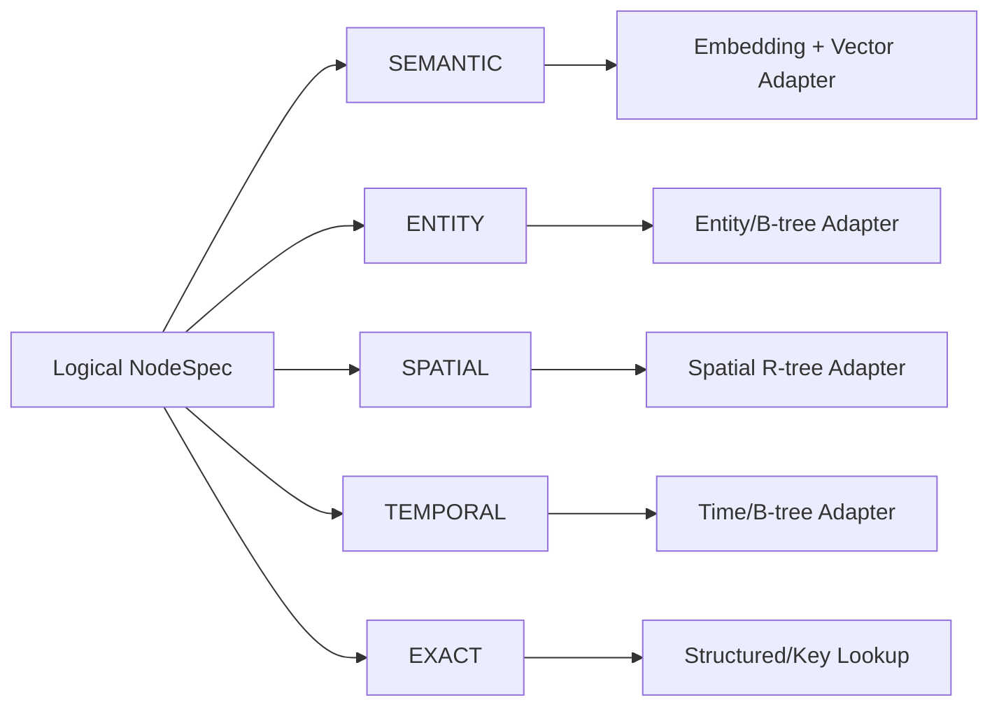

具体使用 FAISS、hnswlib、SQLite R-tree 或其他 backend，不属于 Logical IR 论文贡献；第一版参考实现可以替换，而不改变 architecture identity。

---

## 17.9 v0.7 Trusted Operator / Semantic Executor 精确契约

v0.7 起，四个旧 Helper 不再是唯一 runtime primitive；当前规范以 `OperatorKind + TransformPlan` 为准。

### 17.9.1 Deterministic Structural Operators

可信 Runtime 原生实现：

```text
FILTER
PROJECT
GROUP_BY
DEDUP
UNION
AGGREGATE_STATS
```

共同性质：

- pure / deterministic；
- 无网络、文件、工具调用；
- 输入输出均为 typed records；
- 只能读取声明过的 sources；
- 不允许跨 Node 任意写入；
- 资源上限由 Control Plane 给定。

### 17.9.2 `SEMANTIC_MAP`

语义：对单条或小批输入记录进行结构化语义映射。

典型用途：

- Evidence → WorldMemory；
- Evidence → ExperienceMemory；
- 将文本观察映射到目标 typed schema。

要求：

```text
bounded input records
fixed target schema
source_refs required
structured output only
```

### 17.9.3 `SEMANTIC_REDUCE`

语义：将一组/一段历史记录压缩成更高层 typed abstraction。

典型用途：

- Experience → Knowledge；
- Experience → Procedure (`LIST[ACTION]`)；
- 一组失败经验 → reusable failure condition。

### 17.9.4 `SEMANTIC_COMPOSE`

语义：组合多个异构 source，形成一个新的 typed abstraction。

典型用途：

- World + Experience → RouteMemory；
- World + Experience → HazardMemory；
- Experience + Knowledge → GoalDependencyMemory。

它是 v0.7 中 CREATE 新 abstraction 最重要的 semantic operator，但执行权仍然在 Trusted Semantic Executor，而不是 Meta-LLM。

### 17.9.5 旧四 Helper 只保留为 macro / compatibility alias

```text
EXTRACT       ~= SEMANTIC_MAP
SUMMARIZE     ~= SEMANTIC_REDUCE
AGGREGATE     ~= GROUP_BY + AGGREGATE_STATS / SEMANTIC_REDUCE
PROCEDURALIZE ~= SEMANTIC_REDUCE or SEMANTIC_COMPOSE -> LIST[ACTION]
```

因此后续新 proposal 不应依赖旧 helper 名称作为唯一表达方式。

### 17.9.6 Trusted Semantic Executor 不属于可进化区域

\[
\boxed{
Meta\ writes\ semantic\ contract;\ Runtime\ executes\ it.
}
\]

Semantic Executor 的 model、structured-output adapter、system safety prompt、resource limits 属于固定 Runtime 配置。

Meta 可以修改：

```text
semantic objective
input/source composition
target typed schema
bounded operator composition
```

Meta 不能修改：

```text
semantic executor code
model tool permissions
filesystem/network access
runtime safety prompt
output validator
```

---

## 17.10 Materialized Record 统一格式

不同 Node 的 payload schema 不同，但 Runtime envelope 固定：

```python
@dataclass(frozen=True, slots=True)
class MemoryRecord:
    record_id: str
    node_id: str
    architecture_generation: int

    payload: Mapping[str, object]

    # 只保留局部 provenance，不构造独立 lineage graph
    source_refs: tuple[str, ...]
```

v0.2 继续坚持我们之前的减法：

\[
\boxed{
LocalSourceRefs\ instead\ of\ DedicatedLineageGraph
}
\]

`source_refs` 必须非空，除非是明确的 trusted static seed record。

---

### 17.10A v0.8：Node 没有独立 write API；Compiler 生成维护契约

从 v0.8 开始，`MemoryNodeSpec` 的 `mode + primary_key + sources + TransformPlan` 不只描述“这个 Node 长什么样”，还必须足以让 Trusted Compiler 推导其持续维护语义。

因此 Logical IR **不新增任意 `write_policy` / callback / handler 字段**。Meta-Architect 不能生成：

```text
on_event(...)
update_node(...)
arbitrary trigger code
```

Compiler 生成内部 `MaterializationContract`：

```python
@dataclass(frozen=True, slots=True)
class MaterializationContract:
    node_id: str
    trigger: str                  # MVP 固定 ON_SOURCE_DELTA
    mode: MemoryMode
    key_fields: tuple[str, ...]
    strategy: str                 # APPEND_DELTA / KEYED_UPSERT / GROUP_RECOMPUTE
    upstream_ids: tuple[str, ...]
    max_semantic_input_records: int
    max_outputs_per_update: int
```

推导规则：

```text
APPEND    -> APPEND_DELTA
CURRENT   -> KEYED_UPSERT (requires primary_key)
AGGREGATE -> GROUP_RECOMPUTE / incremental aggregate according to operator algebra
```

新 evidence 进入 Canonical Journal 后，由 Runtime 根据 dependency graph 自动触发受影响 Node。对 downstream materialized view 的变化统一表示为：

```python
@dataclass(frozen=True, slots=True)
class ChangeSet:
    source_id: str
    adds: tuple[MemoryRecord, ...]
    removes: tuple[str, ...]      # materialized-record refs only
    source_seq: int
```

`removes` 只表示从当前 materialized view 撤销旧贡献，不删除 Canonical Evidence。

核心不变量：

\[
\boxed{
PersistentWriteAuthority=CanonicalEvidenceJournal
}
\]

\[
\boxed{
MemoryNode=DeclarativelyMaintainedView
}
\]

详细维护协议见 `Part XVII-D`。

---

## 17.11 `MemoryArchitectureSpec`

当前架构本质上只是一组 Node；DAG edge 从每个 Node 的 `sources` 自动推导。

```python
@dataclass(frozen=True, slots=True)
class MemoryArchitectureSpec:
    format_version: str
    architecture_id: str
    generation: int
    nodes: tuple[MemoryNodeSpec, ...]
```

运行时派生：

```python
Graph(A) = edges_from_node_sources(A.nodes)
```

不单独维护第二份 edge table，避免 source 与 topology 两份真相漂移。

### 17.11.1 全局架构硬限制

第一版：

```text
MIN_NODES = 2
MAX_NODES = 10
MAX_FIELDS_PER_NODE = 16
MAX_SOURCES_PER_NODE = 4
MAX_PRIMARY_KEY_FIELDS = 3
```

这些属于 Control Plane policy，不是 Meta 可修改参数。

### 17.11.2 DAG 不变量

所有 Node 必须满足：

\[
\boxed{acyclic(Graph(A))}
\]

并且每个 Node 必须最终可追溯到 Canonical Evidence：

\[
\boxed{
\forall N_i,\ exists\ path:\ Evidence\leadsto N_i
}
\]

从而保证当前架构不依赖不可重建的隐藏状态。

### 17.11.3 IR 对象关系图

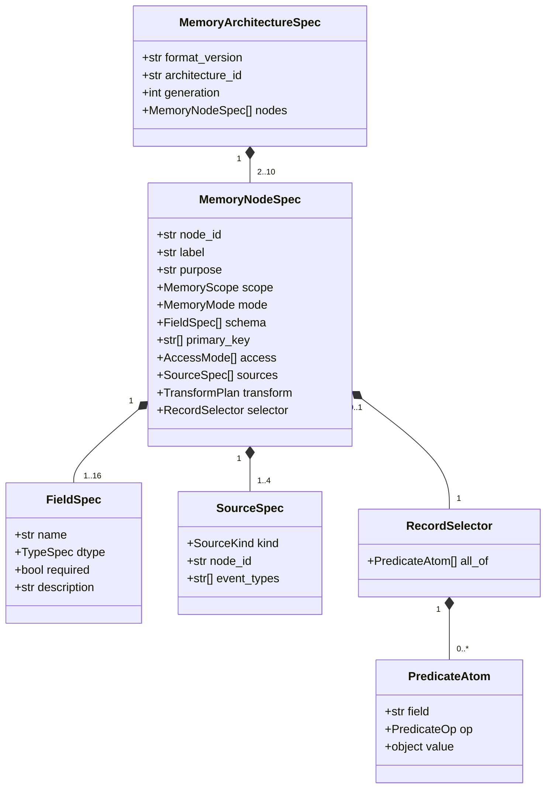

---

## 17.12 Canonicalization：什么不算架构变化

每个候选架构验证前执行：

```python
canonical = normalize(candidate)
hash_value = canonical_hash(canonical)
```

Normalization 至少执行：

1. Node 按 `node_id` 排序；
2. Field 按 `name` 排序；
3. Access set 排序；
4. SourceSpec 使用稳定顺序；
5. Selector atoms 使用稳定顺序；
6. 移除 display-only `label`；
7. 标准化 whitespace；
8. 展开默认值。

如果：

\[
Hash(A')=Hash(A_k)
\]

则：

```text
IR_NO_OP
```

直接拒绝。

注意 `purpose` 不被 canonicalization 删除，因为 Runtime Node Discovery 会使用它；它属于行为语义，而不是 display label。

---

## 17.13 四种 Edit 的源码级定义

Meta-Architect 每次 proposal 只能包含一个顶层 `ArchitectureEdit`。

```python
ArchitectureEdit = (
    CreateNodeEdit
    | RetireNodeEdit
    | SplitNodeEdit
    | MergeNodesEdit
)
```

Control Plane 不接受 edit list：

```text
[{...}, {...}]   # INVALID
```

而只接受：

```text
{ "operation": "SPLIT_NODE", ... }
```

这落实：

\[
\boxed{|\Delta A_k|=1}
\]

---

## 17.14 `CREATE_NODE` 精确定义

```python
@dataclass(frozen=True, slots=True)
class CreateNodeEdit:
    operation: Literal["CREATE_NODE"]
    node: MemoryNodeDraft
```

### 17.14.1 合法条件

CREATE 必须满足：

1. `node_id` 由 Compiler 分配，Meta 不提供；
2. 所有 `NODE` source 必须当前存在；
3. 新 Node 不得成为自己的祖先；
4. source 数量不超过 4；
5. Helper contract 合法；
6. Node schema/access/mode 合法；
7. Candidate 总 Node 数不超过 10；
8. Canonicalization 后不能与已有 Node 完全等价；
9. 新 Node 必须可从 Evidence → DAG 重建；
10. CREATE 不允许同时修改已有 Node。

### 17.14.2 CREATE 编译过程


### 17.14.3 一个有效例子：RouteMemory

```yaml
operation: CREATE_NODE
node:
  label: RouteMemory
  purpose: Store reusable routes between previously visited places.
  scope: WORLD
  mode: AGGREGATE

  schema:
    - {name: origin, type: POSITION, required: true}
    - {name: destination, type: POSITION, required: true}
    - {name: route, type: LIST[POSITION], required: true}
    - {name: success_rate, type: FLOAT, required: true}

  primary_key: [origin, destination]

  access: [SEMANTIC, SPATIAL, EXACT]

  sources:
    - {kind: NODE, node_id: mem_world}
    - {kind: NODE, node_id: mem_experience}

  transform:
    op: SEMANTIC_COMPOSE
  selector: null
```

---

## 17.15 `RETIRE_NODE` 精确定义

第一版 RETIRE 故意保守：**只允许 retire DAG leaf node**。

```python
@dataclass(frozen=True, slots=True)
class RetireNodeEdit:
    operation: Literal["RETIRE_NODE"]
    target_node_id: str
```

### 17.15.1 合法条件

目标必须：

```text
exists(target)
out_degree(target) == 0
node_count_after >= MIN_NODES
```

同时不能 retire Kernel/Control Plane 对象，因为它们根本不属于 `MemoryArchitectureSpec.nodes`。

### 17.15.2 为什么第一版只允许 leaf retire

如果允许任意非叶 Node 退役，就必须同时：

- 重写所有下游 source；
- 证明 schema compatibility；
- 处理 transform 语义变化。

这等价于在一次 RETIRE 里偷偷执行多个结构修改。

因此 v0.2 明确选择：

\[
\boxed{
Retire\ leaf\ first;\ keep\ causal\ attribution\ clean
}
\]

如果未来实验表明非叶 retirement 必不可少，再扩展为显式 replacement contract。

---

## 17.16 `SPLIT_NODE` 精确定义

v0.2 的 SPLIT 不是“创建两个随意的新 Node”。它被严格定义成：

> **对同一个 Node 的 record population 做二分，使两个子 Node 可以在后续获得独立 retrieval / physical tuning，但保持父 Node 的数据语义可重建。**

### 17.16.1 为什么子节点第一版必须保持父 schema

如果 SPLIT 同时改变：

- schema；
- sources；
- transform；
- mode；

那么一个 edit 实际包含多个创新变量，无法知道收益来自哪里。

因此 v0.2：

\[
\boxed{
Schema_{left}=Schema_{right}=Schema_{parent}
}

\[
\boxed{
Sources_{left}=Sources_{right}=Sources_{parent}
}

\[
\boxed{
Transform_{left}=Transform_{right}=Transform_{parent}
}

只允许改变：

- `purpose`；
- `access`；
- record partition。

### 17.16.2 SPLIT proposal

```python
@dataclass(frozen=True, slots=True)
class SplitChildDraft:
    label: str
    purpose: str
    access: frozenset[AccessMode]


@dataclass(frozen=True, slots=True)
class SplitNodeEdit:
    operation: Literal["SPLIT_NODE"]
    target_node_id: str

    partition: RecordSelector

    matched_child: SplitChildDraft
    remainder_child: SplitChildDraft
```

关键：Meta 只提供一个 `partition`。

Compiler 自动定义：

```text
matched_child.selector   = partition
remainder_child.selector = NOT(partition)
```

因此天然满足：

\[
P_{left}\cap P_{right}=\varnothing
\]

和：

\[
P_{left}\cup P_{right}=P_{parent}
\]

避免 LLM 自己写两个 selector 导致重叠或漏记录。

### 17.16.3 下游依赖如何处理

父 Node 的所有下游：

```text
Dependent.sources = [..., Parent, ...]
```

Compiler 自动改为：

```text
Dependent.sources = [..., MatchedChild, RemainderChild, ...]
```

因为两个 child 是父 population 的完整无损 partition。

这是一条 **compiler macro rule**，不是第二个 Meta edit。

### 17.16.4 SPLIT 图

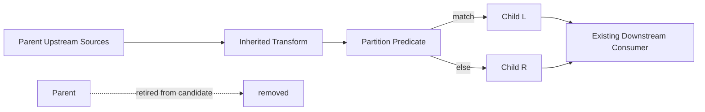

### 17.16.5 WorldMemory 示例

```yaml
operation: SPLIT_NODE
target_node_id: mem_world

partition:
  all_of:
    - {field: entity_kind, op: IN, value: [ZOMBIE, SKELETON, CREEPER, SPIDER, DROPPED_ITEM]}

matched_child:
  label: DynamicWorld
  purpose: Store rapidly changing world entities that require fresh state.
  access: [SEMANTIC, ENTITY, SPATIAL, TEMPORAL]

remainder_child:
  label: StableWorld
  purpose: Store relatively persistent world entities, resources, and landmarks.
  access: [SEMANTIC, ENTITY, SPATIAL, EXACT]
```

---

## 17.17 `MERGE_NODES` 精确定义

MERGE 第一版同样保守，只允许**结构兼容的 sibling nodes** 合并。

```python
@dataclass(frozen=True, slots=True)
class MergeNodesEdit:
    operation: Literal["MERGE_NODES"]
    left_node_id: str
    right_node_id: str

    merged_label: str
    merged_purpose: str
    merged_access: frozenset[AccessMode]
```

### 17.17.1 Merge Compatibility

必须满足：

```text
scope(left)     == scope(right)
mode(left)      == mode(right)
schema(left)    == schema(right)
primary_key(L)  == primary_key(R)
sources(left)   == sources(right)
transform(left) == transform(right)
```

并且第一版只接受：

```text
selectors_are_complementary(left, right) == True
```

典型场景：撤销一个后来证明没有必要的 SPLIT。

### 17.17.2 为什么不允许任意两个 Node Merge

任意 merge 会立即引入：

- schema union；
- heterogeneous source semantics；
- transform composition；
- downstream contract rewriting。

这会把 MERGE 变成一个近似任意程序变换。

因此 v0.2 的原则是：

\[
\boxed{
Prove\ useful\ structural\ evolution\ with\ a\ bounded\ merge\ first
}
\]

### 17.17.3 下游 rewiring

所有原先引用 `left` 或 `right` 的 downstream source 统一替换为 `merged`，重复引用去重。

### 17.17.4 MERGE 图

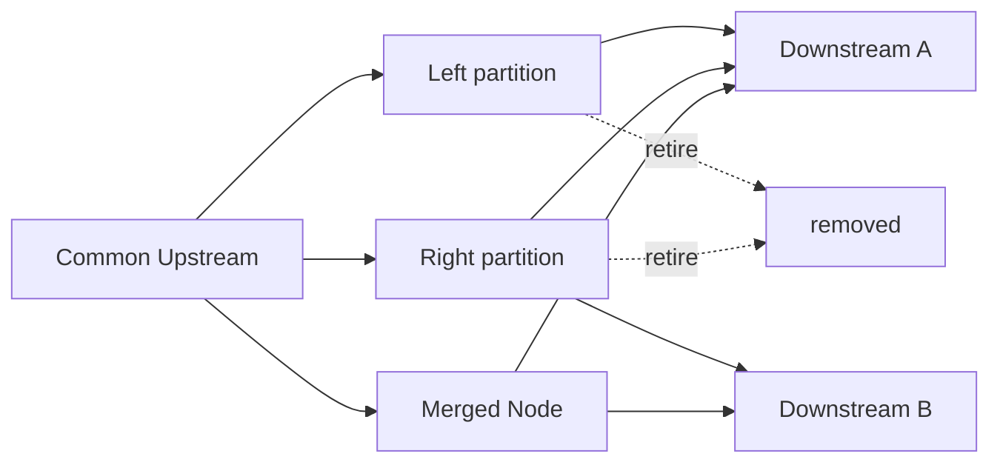

---

## 17.18 Meta Proposal Envelope

Meta-LLM 不直接输出裸 edit，而是输出固定 envelope：

```python
@dataclass(frozen=True, slots=True)
class ExpectedEffect:
    metric: str
    direction: Literal["UP", "DOWN", "NON_DECREASE", "NON_INCREASE"]
    target: str


@dataclass(frozen=True, slots=True)
class EvolutionProposal:
    symptom_refs: tuple[str, ...]
    hypothesis: str
    edit: ArchitectureEdit
    expected_effects: tuple[ExpectedEffect, ...]
    rationale: str
```

Acceptance Gate 不使用 Meta 自报 confidence。

Meta 不能提交：

```text
confidence = 0.98
please accept
```

作为通过依据。

---

## 17.19 IR Verifier：分层验证规则

Verifier 必须是普通确定性代码，不调用 Meta-LLM。

建议入口：

```python
class IRVerifier:
    def verify_architecture(
        self,
        architecture: MemoryArchitectureSpec,
    ) -> VerificationReport: ...

    def verify_edit(
        self,
        current: MemoryArchitectureSpec,
        edit: ArchitectureEdit,
    ) -> VerificationReport: ...
```

## 17.19.1 Layer 1 — Syntax / Boundary

检查：

- enum 合法；
- required fields；
- 字符串长度；
- schema 反序列化；
- proposal 只有一个 operation。

## 17.19.2 Layer 2 — Field / Node Type

检查：

- field 名唯一；
- primary key 指向已有 field；
- CURRENT 必须有 primary key；
- APPEND 不允许业务 primary key；
- access 与 schema 类型匹配；
- selector field 存在；
- selector value 与 field type 可比较。

## 17.19.3 Layer 3 — Transform Algebra / Effect Contract

v0.7 不再验证四个固定 `TransformKind`，而验证 `TransformPlan`：

- operator 必须属于固定 `OperatorKind`；
- operator 输入引用必须存在并满足类型要求；
- expression graph 必须无环且深度/节点数受限；
- deterministic operator 不得访问外部 I/O；
- semantic operator 只能调用 Trusted Semantic Executor，且该 executor **无工具、无网络、无持久写权限**；
- semantic operator 必须声明输出 schema/cardinality，并接受结构化输出校验；
- 每个 transform plan 有固定 token / record / group-size budget；
- transform 只能写入当前目标 Node，不能产生任意副作用。

Verifier 证明的是：

\[
\boxed{
TypeSafety + Boundedness + EffectSafety
}
\]

它**不负责证明** natural-language semantic objective 是否真的形成了好的 Memory；这由 Candidate Evaluation 决定。

## 17.19.4 Layer 4 — Graph

检查：

- source node 存在；
- 无 self-loop；
- DAG 无 cycle；
- 每个 Node 最终 reachable from Evidence；
- node/source 数不超过 Control Plane limit。

## 17.19.5 Layer 5 — Edit Semantic

不同 Macro 执行自己的专用规则：

```text
CREATE → no duplicate structural node
RETIRE → leaf only
SPLIT  → binary lossless partition macro
MERGE  → compatible complementary siblings only
```

## 17.19.6 Layer 6 — Canonical No-Op

如果候选 canonical hash 与当前一致：

```text
IR_NO_OP
```

无需进入 Candidate Materialization。

### 17.19.7 Verifier pipeline 图

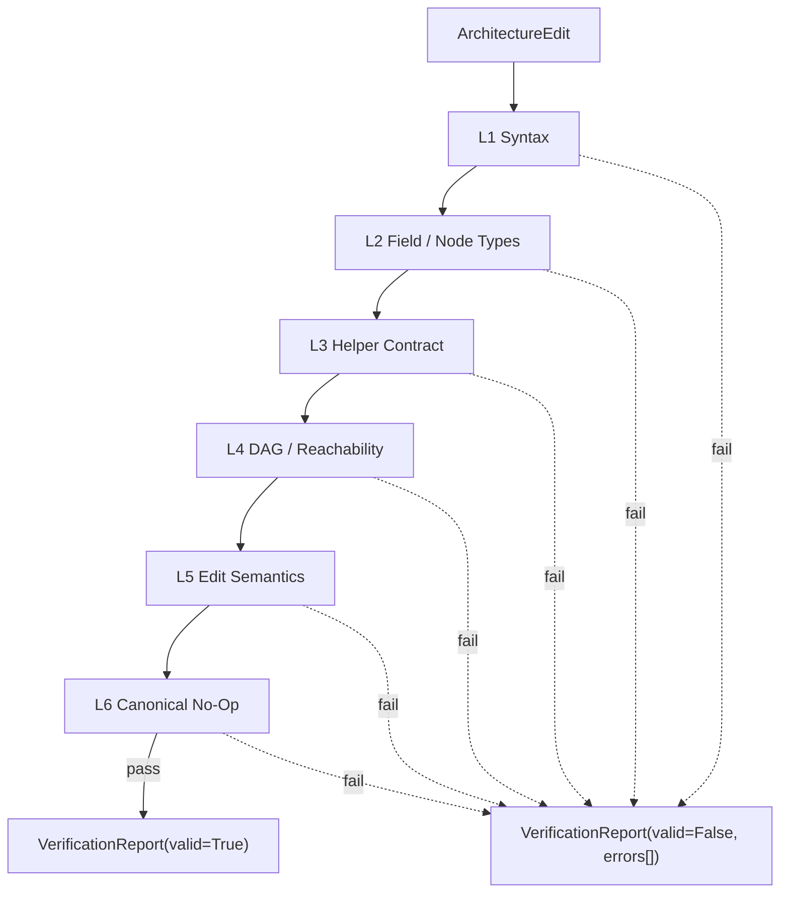

---

## 17.20 Typed Verifier Error Codes

第一版不返回模糊字符串，例如：

```text
"architecture invalid"
```

而返回稳定错误码。

建议：

| Code | 含义 |
|---|---|
| `IR001_UNKNOWN_ENUM` | 未知 Field/Mode/Access/Transform |
| `IR002_DUPLICATE_FIELD` | Node schema 字段重名 |
| `IR003_INVALID_FIELD_NAME` | 字段名非法 |
| `IR010_BAD_PRIMARY_KEY` | primary key 非法 |
| `IR011_CURRENT_WITHOUT_KEY` | CURRENT 缺少 key |
| `IR020_ACCESS_SCHEMA_MISMATCH` | access 与 schema 不兼容 |
| `IR030_BAD_SELECTOR_FIELD` | selector 使用不存在字段 |
| `IR031_BAD_SELECTOR_TYPE` | selector value 类型不匹配 |
| `IR040_UNKNOWN_SOURCE` | 引用不存在 Node |
| `IR041_CONTROL_PLANE_SOURCE` | 非法依赖 Control Plane |
| `IR050_HELPER_CONTRACT` | Transform helper 输入/输出约束不满足 |
| `IR060_CYCLE` | Candidate DAG 出现环 |
| `IR061_UNREACHABLE_FROM_EVIDENCE` | Node 无法从 Evidence 重建 |
| `IR070_NODE_LIMIT` | 超过 Node 上限 |
| `IR071_SOURCE_LIMIT` | source 过多 |
| `IR080_RETIRE_NON_LEAF` | 第一版禁止 retire 非叶 Node |
| `IR090_SPLIT_NOT_PARTITIONABLE` | SPLIT 不满足 v0.2 规则 |
| `IR100_MERGE_INCOMPATIBLE` | MERGE sibling 不兼容 |
| `IR110_NO_OP` | Canonical architecture 未变化 |

这些 code 会进入 Evolution Ledger，Meta 下一次能看到：

```text
Previous proposal rejected: IR100_MERGE_INCOMPATIBLE
```

而不是依靠自由文本猜原因。

---

## 17.21 Compiler：Logical IR 如何落到 Physical Memory

论文贡献在 Logical Architecture，但我们必须有一个固定 reference compiler 才能真正跑实验。

第一版建议：

### Structured record store

```text
SQLite
```

统一承载 typed records、CURRENT keyed state 与 AGGREGATE table。

### SEMANTIC

```text
Embedding Adapter + local vector index
```

具体向量库通过 adapter 隔离，不进入 architecture identity。

### ENTITY / TEMPORAL

优先使用结构化 B-tree/index。

### SPATIAL

使用 SQLite R-tree 或等价 spatial adapter。

因此：

\[
\boxed{
LogicalArchitecture\neq PhysicalBackend
}
\]

### 17.21.1 Mode lowering

| Logical Mode | Reference Physical Semantics |
|---|---|
| `APPEND` | append-only logical record table |
| `CURRENT` | primary-key upsert materialized table |
| `AGGREGATE` | grouped/materialized derived table |

### 17.21.2 Compiler 输出

```python
@dataclass(frozen=True, slots=True)
class PhysicalNodePlan:
    node_id: str
    table_name: str
    write_semantics: str
    query_adapters: tuple[str, ...]
    transform_runner: str


@dataclass(frozen=True, slots=True)
class PhysicalMemoryPlan:
    generation: int
    nodes: tuple[PhysicalNodePlan, ...]
    topological_order: tuple[str, ...]
```

---

## 17.22 Candidate Materialization：不用旧架构隐藏状态

候选架构构建（v0.9 compatibility：此处 Canonical Evidence 专指 `J_mem`）：

```text
Memory-Grounded J_mem
          ↓
Historical Backfill + Candidate DAG topological order
          ↓
run Trusted Helpers
          ↓
Candidate Materialized Memory
```

严格禁止：

```text
copy old SQLite tables as truth
reuse retired hidden node as source
restore snapshot
historical action replay
counterfactual world replay
```

旧架构可以提供**运行 telemetry**帮助 Meta 判断问题，但不能成为候选 Node 的数据 source。`J_audit` 也不能作为 source；它只允许进入 validation/scoring 路径。

### 17.22.1 Materialization 算法

概念伪代码：

```python
def materialize_candidate(arch, journal):
    store = empty_store()

    for node_id in topological_sort(arch):
        node = arch.get(node_id)
        inputs = resolve_sources(node.sources, journal, store)

        records = run_trusted_helper(
            kind=node.transform,
            inputs=inputs,
            target_schema=node.schema,
        )

        if node.selector is not None:
            records = filter_records(records, node.selector)

        validate_records(records, node.schema)
        write_by_mode(store, node, records)

    return store
```

这不是 historical/counterfactual replay：它只是在候选架构激活前，根据当前已有的 Canonical Evidence **重建候选 Memory Data Plane**。

---

## 17.23 Seed Architecture 的首个规范 YAML

> **v0.7 amendment:** Seed 保持四个合理的人类初始 Node，但 transform 表达从四个 monolithic helper 升级为 compositional `TransformPlan`；`PROCEDURE` 不再作为底层 primitive，而使用 `LIST[ACTION]`。下列 YAML 使用 `format_version: "0.7"`。

建议代码仓库保留 golden architecture：

```text
configs/architectures/seed_v0.yaml
```

示意：

```yaml
format_version: "0.7"
architecture_id: seed_v0
generation: 0

nodes:
  - node_id: mem_world
    label: WorldMemory
    purpose: Store current entities, locations, and mutable world state relevant to future tasks.
    scope: WORLD
    mode: CURRENT
    schema:
      - {name: entity, type: ENTITY, required: true}
      - {name: position, type: OPTIONAL[POSITION], required: false}
      - {name: state_text, type: TEXT, required: true}
      - {name: entity_kind, type: CATEGORY, required: true}
      - {name: observed_at, type: TIME, required: true}
    primary_key: [entity]
    access: [SEMANTIC, ENTITY, SPATIAL, TEMPORAL, EXACT]
    sources:
      - kind: EVIDENCE
        event_types: [WORLD_OBSERVATION, ENTITY_OBSERVATION]
    transform:
      op: SEMANTIC_MAP
      objective: >
        Convert grounded world observations into the target typed current-state record without inventing unobserved facts.
    selector: null

  - node_id: mem_experience
    label: ExperienceMemory
    purpose: Store task-relevant action and outcome episodes from the agent's own experience.
    scope: AGENT
    mode: APPEND
    schema:
      - {name: task, type: TEXT, required: true}
      - {name: context, type: TEXT, required: true}
      - {name: action, type: ACTION, required: true}
      - {name: outcome, type: OUTCOME, required: true}
      - {name: occurred_at, type: TIME, required: true}
    primary_key: []
    access: [SEMANTIC, TEMPORAL]
    sources:
      - kind: EVIDENCE
        event_types: [ACTION_RESULT, TASK_EVENT]
    transform:
      op: SEMANTIC_MAP
      objective: >
        Convert verified action/task evidence into one typed experience record.
    selector: null

  - node_id: mem_knowledge
    label: KnowledgeMemory
    purpose: Store reusable facts, rules, and regularities derived from accumulated experience.
    scope: AGENT
    mode: AGGREGATE
    schema:
      - {name: subject, type: TEXT, required: true}
      - {name: rule, type: TEXT, required: true}
      - {name: confidence, type: FLOAT, required: true}
    primary_key: [subject]
    access: [SEMANTIC, EXACT]
    sources:
      - {kind: NODE, node_id: mem_experience}
    transform:
      op: SEMANTIC_REDUCE
      objective: >
        Derive reusable task-independent regularities supported by repeated experience and retain uncertainty.
    selector: null

  - node_id: mem_procedure
    label: ProcedureMemory
    purpose: Store reusable action procedures distilled from successful experience.
    scope: AGENT
    mode: AGGREGATE
    schema:
      - {name: goal, type: TEXT, required: true}
      - {name: steps, type: LIST[ACTION], required: true}
      - {name: success_rate, type: FLOAT, required: true}
    primary_key: [goal]
    access: [SEMANTIC, EXACT]
    sources:
      - {kind: NODE, node_id: mem_experience}
    transform:
      op: SEMANTIC_REDUCE
      objective: >
        Distill successful repeated action sequences into reusable ordered steps for the same class of goal.
    selector: null
```

### 17.23.1 Seed DAG

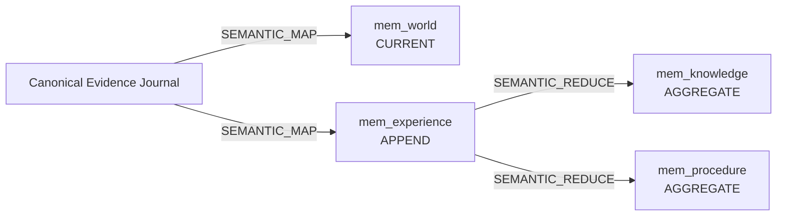

---

## 17.24 `ARCH_INSPECT` 给 Meta 看什么

Meta 不读 Python class，也不读 physical backend。

`ARCH_INSPECT` 返回精简 Logical Manifest：

```json
{
  "generation": 3,
  "nodes": [
    {
      "node_id": "mem_world",
      "label": "WorldMemory",
      "purpose": "...",
      "scope": "WORLD",
      "mode": "CURRENT",
      "fields": ["entity:ENTITY", "position:POSITION", "state_text:TEXT"],
      "access": ["SEMANTIC", "ENTITY", "SPATIAL"],
      "sources": ["EVIDENCE"],
      "transform": "EXTRACT"
    }
  ]
}
```

Meta 不能看到：

```text
SQLite table path
vector index internals
embedding cache
filesystem paths
Control Plane DB
acceptance thresholds write API
```

---

## 17.25 v0.2 `memory_ir/` 源码目录冻结

建议将原先较粗的：

```text
memory_ir/
├── schema.py
├── node_spec.py
└── compiler.py
```

细化成：

```text
memory_ir/
├── __init__.py
├── enums.py              # frozen primitive vocabulary
├── fields.py             # FieldSpec
├── predicate.py          # PredicateAtom / RecordSelector
├── sources.py            # SourceSpec
├── node.py               # MemoryNodeDraft / MemoryNodeSpec
├── architecture.py       # MemoryArchitectureSpec + graph helpers
├── edits.py              # CREATE / RETIRE / SPLIT / MERGE
├── proposal.py           # EvolutionProposal envelope
├── normalize.py          # canonical form + hash
├── verifier.py           # all deterministic checks
├── errors.py             # stable IR error codes
├── compiler.py           # logical → physical plan
└── serialization.py      # YAML/JSON boundary
```

相关 runtime：

```text
memory_runtime/
├── materializer.py
├── record.py
├── store.py
├── discovery.py
├── query.py
└── context_compiler.py
```

Trusted Helpers：

```text
helpers/
├── extract.py
├── summarize.py
├── aggregate.py
└── proceduralize.py
```

Control Plane：

```text
evolution/
├── telemetry.py
├── ledger.py
├── context_builder.py
├── meta_architect.py
├── candidate_builder.py
└── validator.py
```

---

## 17.26 v0.2 单元测试矩阵

在接 Minecraft 之前，IR 必须先在纯 Python 环境里过完这些测试。

## A. Field / Node tests

```text
test_duplicate_field_rejected
test_current_without_primary_key_rejected
test_append_with_business_key_rejected
test_spatial_without_position_rejected
test_entity_access_without_entity_rejected
test_selector_unknown_field_rejected
```

## B. Graph tests

```text
test_unknown_source_rejected
test_self_cycle_rejected
test_multi_node_cycle_rejected
test_unreachable_node_rejected
test_node_limit_rejected
```

## C. Helper tests

```text
test_extract_requires_evidence
test_proceduralize_requires_action_outcome
test_proceduralize_target_requires_procedure_field
```

## D. Edit tests

```text
test_create_allocates_trusted_id
test_create_cannot_modify_existing_node
test_retire_leaf_succeeds
test_retire_non_leaf_rejected
test_split_generates_complement_partition
test_split_rewires_downstream_to_both_children
test_merge_compatible_siblings_succeeds
test_merge_incompatible_schema_rejected
```

## E. Materialization tests

```text
test_seed_architecture_builds_from_empty_store_plus_journal
test_candidate_build_does_not_read_old_materialized_tables
test_split_candidate_record_union_equals_parent_population
test_merge_candidate_reconstructs_union
```

## F. Canonicalization tests

```text
test_label_rename_not_structural_change
test_field_order_does_not_change_hash
test_access_order_does_not_change_hash
test_real_split_changes_hash
```

### 17.26.1 测试金字塔

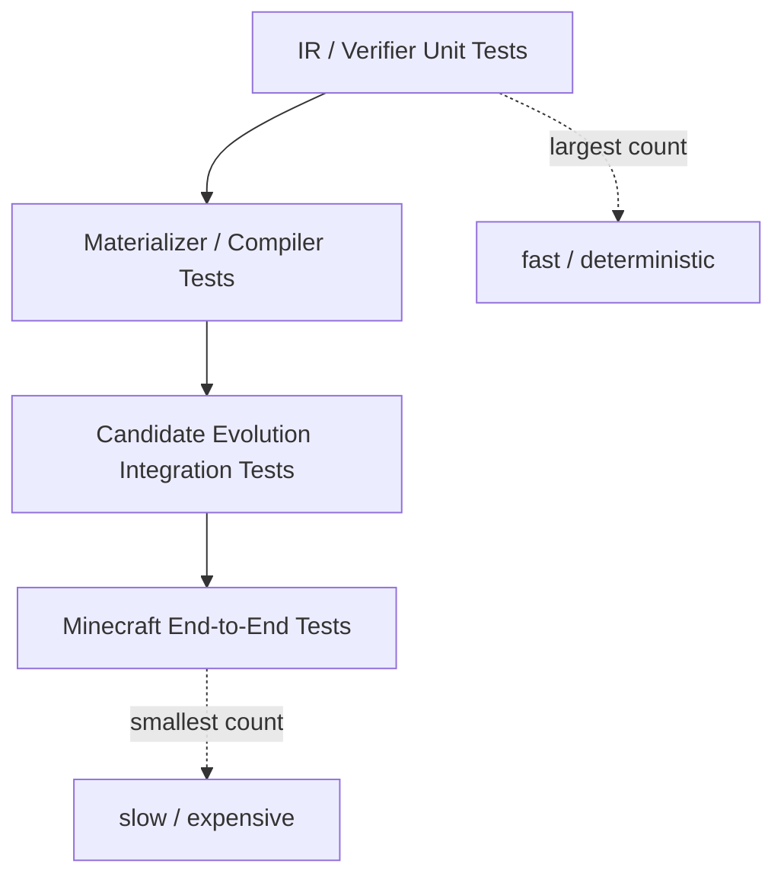

---

## 17.27 v0.2 代码实现顺序

不直接从 Meta-LLM 开始。

正确顺序：

```text
1. enums.py
2. fields.py / sources.py / predicate.py
3. node.py
4. architecture.py
5. serialization.py
6. errors.py
7. verifier.py
8. edits.py + macro expander
9. compiler.py
10. record.py / store.py
11. materializer.py
12. seed_v0.yaml
13. IR unit tests
14. seed materialization integration test
15. Node Discovery / query runtime
16. telemetry
17. Meta-Architect
18. candidate validation
19. Minecraft self-evolution
```

核心原因：

> 如果 IR / verifier / materializer 没有先冻结，Meta-LLM 越早接入，debug 时越无法区分“架构思想错”与“LLM 输出不稳定”。

---

## 17.28 v0.2 明确暂缓的 IR 能力

这一版**故意不支持**：

```text
MODIFY_NODE
ADD_FIELD
REMOVE_FIELD
ADD_EDGE
REMOVE_EDGE
N-way SPLIT
arbitrary MERGE
non-leaf RETIRE with replacement
custom Transform code
custom FieldType
recursive Node
runtime mutation of purpose
parametric/neural Memory Node
```

这些不是认为永远没价值，而是第一版不需要它们就能验证：

\[
\boxed{
LLM\ can\ autonomously\ create,\ retire,\ split,\ and\ merge\ long-term\ memory\ structures
}
\]

如果后续实验发现表达力不足，再基于实际失败证据扩展 IR，而不是提前把语言做成通用编程系统。

---

## 17.29 v0.2 源码级完成标准

只有同时满足以下条件，才算 `memory_ir/` 完成：

1. `seed_v0.yaml` 可无 LLM 参与地 parse + verify + compile；
2. Seed 可仅从 Canonical Evidence 完整 materialize；
3. 四种 edit 都有 deterministic macro semantics；
4. 所有非法 candidate 返回稳定 error code；
5. Meta 无法通过 edit 接触 Control Plane / Kernel；
6. SPLIT 后两个 child 的 record union 与父 population 一致；
7. MERGE 只接受 v0.2 compatible sibling；
8. RETIRE 非 leaf 会被拒绝；
9. Candidate 构建不读取旧 materialized state；
10. 所有核心 IR tests 通过后，才允许接入 Meta-Architect。

到这一点以后，我们才真正拥有一个可用于 self-evolution 实验的**受限 Memory Architecture substrate**。


# Part V. Runtime Memory 使用方式

## 18. 为什么 Runtime 不直接暴露具体 Node Tool

禁止这种设计：

```text
query_world_memory()
query_route_memory()
query_failure_memory()
...
```

否则 architecture CREATE 一个 Node，Executor tool space 就发生变化。

这会造成：

- prompt/tool explosion；
- Executor 依赖具体 architecture；
- CREATE 需要同时修改上层 prompt；
- 很难称为真正闭环 self-evolution。

因此固定：

\[
\boxed{
Executor\ only\ knows\ MEMORY\_ASK(intent)
}
\]

---

## 19. Node Discovery

当前所有 Node 暴露一个 Node Card：

```text
node_id
purpose
access
domain summary
```

`purpose` 被编码成 embedding。

查询：

```text
How can I return to the mine I visited earlier?
```

NodeDiscovery：

```text
RouteMemory        0.89
StaticWorld        0.76
ExperienceMemory   0.61
```

然后查询 Top-K Node。

### 19.1 Runtime 图

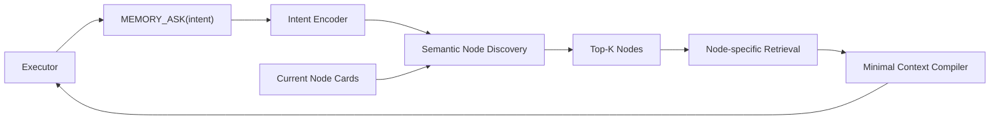

第一版可以完全使用 embedding + deterministic filters。

仅当 Top candidates 非常接近时，才可选用一个小型本地 LLM rerank；这不是核心机制。

---

# Part VI. Meta-Architect 与 Self-Evolution Loop

## 20. Meta-Architect 为什么固定

第一版必须：

\[
\boxed{
M_{meta}=fixed
}
\]

即：

- Meta model 固定；
- Meta system prompt 核心固定；
- Meta tool set 固定；
- Meta 不能改 acceptance policy；
- Meta 不能改 validator；
- Meta 不能改 benchmark。

这样才能将性能变化主要归因到：

\[
\boxed{
MemoryArchitectureEvolution
}
\]

而不是整个 harness 被同时修改。


---

### 20.1 v0.6：Meta-Architect 的不可替代职责不是“看阈值选按钮”

v0.6 进一步收紧 Meta-Architect 的职责边界。可信控制面继续负责所有可以确定性完成的工作：

```text
measure / profile / cluster / count / validate / compile / evaluate
```

Meta-Architect 只负责不能由固定指标直接定义的**语义架构推理（semantic architectural reasoning）**：

1. 从无标签 observations 中形成结构假设；
2. 判断多个统计现象是互补、冗余、异质还是尚不足以结构化；
3. 将多个 raw categories / exemplars 归纳为一个可解释的长期 Memory abstraction；
4. 对 CREATE 生成新的 `purpose + schema + sources + transform`；
5. 对 SPLIT 形成有语义意义且可由合法 selector 表达的 partition；
6. 在证据不足或现象更像参数/执行问题时选择 `NO_EDIT`。

因此：

\[
\boxed{
Deterministic\ System = Observe + Constrain + Verify + Select
}
\]

\[
\boxed{
MetaLLM = Interpret + Abstract + Synthesize
}
\]

这一区分不是预设“LLM 一定必要”。v0.6 会通过 `RuleBasedEvolver` 使用完全相同的 AOR、IR grammar 和 validation budget 与 Meta-LLM 做直接实验比较。

---

## 21. Telemetry Neutrality：观测必须有信息，但不能替 Meta 做架构推理

v0.5 对 Telemetry / Summary 做一次原则性修正。

v0.4 中曾使用类似：

```yaml
WorldMemory:
  by_entity_dynamics:
    STATIC:
      stale_use_rate: 0.02
    DYNAMIC:
      stale_use_rate: 0.41
```

这在工程上很方便，但在研究上存在明显风险：

> `STATIC / DYNAMIC` 这个分组本身已经接近 `SPLIT(WorldMemory)` 的答案。

如果这些语义组由研究者预先定义，那么最后 Meta-Architect 选择 `SPLIT`，并不能充分证明它自己发现了 Memory boundary。

因此 v0.5 正式加入：

\[
\boxed{
\textbf{Telemetry Neutrality Principle}
}
\]

其含义是：

> **Control Plane 负责暴露可审计的运行事实和自动发现的数据切片，但不得把这些事实预先解释成某种 Memory edit，更不得引入只为暗示正确结构而设计的人工语义标签。**

### 21.1 观测层与推理层必须分开

新的信息流：

\[
RuntimeTrace
\rightarrow
NeutralProfiler
\rightarrow
ArchitectureObservationReport
\rightarrow
MetaArchitect
\rightarrow
StructuralInterpretation
\rightarrow
Edit
\]

而不是：

\[
RuntimeTrace
\rightarrow
HumanDefinedStructuralGroups
\rightarrow
MetaArchitect
\rightarrow
ObviousEdit
\]

因此：

\[
\boxed{
Observation\neq Diagnosis\neq Edit
}
\]

### 21.2 Telemetry 可以使用的信息来源

MVP 只允许从下面几类**本来就存在于系统中的信息**构造观测：

1. 当前 Typed Memory IR；
2. Node schema 中已有字段；
3. `MEMORY_ASK / NodeDiscovery / MEM_QUERY` 运行 trace；
4. verifier-backed task outcome / current state；
5. Canonical Evidence provenance；
6. generic runtime statistics；
7. Evolution Ledger 中已经发生过的历史 edit 与结果。

允许的 generic runtime statistics 例如：

```text
query count
select count
hit / miss
retrieval rank
retrieval score
result count
record age at query
update count
query latency
token cost
stale/conflict incident
```

这些量描述 Memory Runtime 的行为，但不预先规定某个 Memory 应该拆成什么。

### 21.3 明确禁止的 Telemetry Hint

MVP / Standard 都禁止 Control Plane 直接输出：

```text
recommended_edit = SPLIT
split_pressure = 0.84
create_pressure = 0.73
this cluster is ROUTE_MEMORY_DEMAND
this subgroup is DYNAMIC_ENTITY
this node should be retired
```

也禁止为了某个预期结果专门增加人工标签，例如在 Seed `WorldMemory` 中预先加入：

```text
volatility = STATIC | DYNAMIC
```

如果这个字段存在的主要目的就是帮助后续 `World -> StaticWorld + DynamicWorld`，那么它构成 architecture-answer leakage。

核心规则：

\[
\boxed{
HumanStructuralHintCount=0
}
\]

### 21.4 `MemoryIncident`：仍然保留直接可验证的 Memory 病理事件

MVP 保留轻量事件对象：

```python
@dataclass(frozen=True)
class MemoryIncident:
    incident_id: str
    kind: str
    node_ids: tuple[str, ...]
    intent: str
    task_family: str
    evidence_refs: tuple[str, ...]
    verified_effect: str | None
```

固定 incident kinds：

```text
STALE_USE
RETRIEVAL_MISS
CONFLICTING_RETRIEVAL
EXCESSIVE_RETRIEVAL_COST
UNRESOLVED_MEMORY_INTENT
```

这些 labels 描述的是**直接观测到的 Memory failure mode**，不是结构原因。

例如：

```text
STALE_USE
```

只表示某次 retrieval 使用了已经被 verifier-backed state 证明过时的记录。

它并不意味着：

```text
SPLIT
```

因为 stale 仍可能由 threshold、update pipeline、retrieval policy 等问题造成。

因此继续保持：

\[
\boxed{
TaskFailure\not\Rightarrow MemoryFailure
}
\]

以及：

\[
\boxed{
MemoryIncident\not\Rightarrow StructuralEdit
}
\]

### 21.5 Schema-Driven Field Profiling：MVP 的核心中立分层机制

为了让 Meta 能发现 Node 内部异质性，但又不人工定义 `STATIC / DYNAMIC` 等结构答案，MVP 对**所有可 profile 的 schema 字段使用同一套固定规则**。

因此 v0.5 引入、并在 v0.7 继续保留为 `PrimitiveType` 的通用 primitive：

```text
CATEGORY
```

它只是表示有限离散值，不带任何 Memory 结构语义。

推荐 profiling 规则：

| Field Type | MVP Profiling |
|---|---|
| `BOOL` | 两个 value group |
| `CATEGORY` | top-K categories + OTHER |
| `INT/FLOAT/TIME` | fixed quantile bins |
| `TEXT` | 不做 value group；只可抽样 exemplar |
| `ENTITY` | 不按 entity ID 逐个 group，防高基数过拟合 |
| `POSITION` | 不在 MVP 人工划空间语义区域 |
| `ACTION/OUTCOME` | 只在其本身为合法低基数字段时 profile |
| refs / procedure | 不做 group-by |

对每个自动 group 只统计固定 metric registry，例如：

```text
support
select_rate
hit_rate
stale_use_rate
conflict_rate
avg_query_cost
avg_record_age
avg_update_count
```

Control Plane 不选择“哪个字段最应该看”；所有满足 profiling 规则的字段统一计算。

### 21.6 中立 WorldMemory 示例

Seed 不再含：

```text
volatility
```

而可以含一个正常的世界对象字段：

```text
entity_kind: CATEGORY
```

例如 profiler 可能得到：

```yaml
field_profiles:
  entity_kind:
    ZOMBIE:
      support: 94
      stale_use_rate: 0.43
      avg_update_count: 7.2
    SKELETON:
      support: 67
      stale_use_rate: 0.38
      avg_update_count: 6.4
    DROPPED_ITEM:
      support: 49
      stale_use_rate: 0.35
      avg_update_count: 5.8
    CHEST:
      support: 71
      stale_use_rate: 0.04
      avg_update_count: 0.3
    FURNACE:
      support: 55
      stale_use_rate: 0.03
      avg_update_count: 0.4
```

Control Plane **不会再增加**：

```text
ZOMBIE/SKELETON/DROPPED_ITEM -> DYNAMIC
CHEST/FURNACE -> STATIC
```

这一步必须由 Meta-Architect 根据：

- schema；
- field profile；
- incident exemplars；
- lower-level tuning history；

自己形成结构解释。

如果 Meta 最终提出：

```text
SPLIT WorldMemory
matched: entity_kind IN [ZOMBIE, SKELETON, CREEPER, SPIDER, DROPPED_ITEM, ...]
remainder: complement
```

那么“动态 vs 稳定”这个抽象是由 Meta 形成的，而不是 Summary Builder 提前提供的。

### 21.7 Incident Exemplars 必须自动采样

仅靠 aggregate statistic 可能过于贫乏，因此 Meta 可以看到少量代表性 MemoryIncident。

但这些例子不能由研究者手挑。

MVP 固定采样策略，例如：

```text
1. highest verified severity
2. embedding-diverse exemplars
3. fixed seeded tie-break
```

每个 node / incident kind 最多给固定数量的 exemplar。

目标是：

\[
\boxed{
Representative\ evidence
\quad without \quad
Researcher\ curation
}
\]

### 21.8 `unresolved_intent` 只允许无标签聚类

CREATE 需要知道是否反复出现当前架构无法自然处理的 Memory need。

因此仍允许对：

```text
UNRESOLVED_MEMORY_INTENT
```

做固定 embedding clustering。

但 Control Plane 只能输出：

```yaml
cluster_id: UI_04
support: 17
examples:
  - "return to the mine used earlier"
  - "go back to the previous cave"
  - "find the way back to base"
avg_top_relevance: 0.54
avg_nodes_combined: 2.6
```

禁止输出：

```text
semantic_label: ROUTE_NEED
suggested_memory: RouteMemory
```

`RouteMemory` 这个 abstraction 必须由 Meta 自己命名、定义 schema、选择 source 和 transform。

### 21.9 Pairwise Statistics 也保持 edit-agnostic

允许：

```text
co_select_rate
result_overlap
source_overlap
combined_query_cost
```

但不输出：

```text
merge_score
redundancy_label = TRUE
```

因为：

\[
HighCoUse\neq Merge
}
\]

两个 Node 频繁共用既可能代表冗余，也可能代表强互补。

---

## 22. Architecture Observation Report（AOR）：替代带暗示性的 Structural Summary

v0.5 将 Meta 的主要诊断输入从：

```text
StructuralSummary
```

正式改名为：

\[
\boxed{
ArchitectureObservationReport\;(AOR)
}
\]

原因不是改名本身，而是强调：

> Control Plane 提供的是 architecture **observation**，结构解释由 Meta 完成。

### 22.1 AOR 不允许出现 Edit Hint

AOR schema 中禁止：

```text
suggested_edit
structural_root_cause
split_candidate
merge_candidate
create_candidate
retire_candidate
edit_pressure
```

### 22.2 MVP AOR 结构

```yaml
report_id: AOR_A7_W12
architecture_version: A7

window:
  task_start: 181
  task_end: 200
  tasks_since_last_edit: 38

global:
  task_success: 0.61
  verified_progress: 0.74
  memory_requests: 428
  memory_incidents: 31
  avg_query_cost: 812

nodes:
  WorldMemory:
    schema_fields:
      - entity
      - entity_kind
      - position
      - state_text
      - observed_at

    select_rate: 0.71
    hit_rate: 0.82
    stale_use_rate: 0.19
    avg_query_cost: 290

    field_profiles:
      entity_kind:
        ZOMBIE:
          support: 94
          stale_use_rate: 0.43
          avg_update_count: 7.2
        SKELETON:
          support: 67
          stale_use_rate: 0.38
          avg_update_count: 6.4
        CHEST:
          support: 71
          stale_use_rate: 0.04
          avg_update_count: 0.3
        FURNACE:
          support: 55
          stale_use_rate: 0.03
          avg_update_count: 0.4

    incident_exemplars:
      - incident_id: INC_918
        kind: STALE_USE
        intent: "where is the zombie near the cave?"
        record_preview:
          entity_kind: ZOMBIE
          observed_at: "..."

pairs:
  - nodes: [WorldMemory, ExperienceMemory]
    co_select_rate: 0.43
    result_overlap: 0.18
    combined_query_cost: 701

unresolved_intent_clusters:
  - cluster_id: UI_04
    support: 17
    examples:
      - "return to the mine used earlier"
      - "go back to the previous cave"
    avg_top_relevance: 0.56
    avg_nodes_combined: 2.4

lower_level_history:
  - target: WorldMemory
    parameter: freshness_threshold
    result: residual_issue

recent_evolution:
  last_edit_type: CREATE_NODE
  tasks_since_activation: 38
```

注意：

- AOR 可以记录过去发生过哪类 edit，因为这是历史事实；
- AOR **不能**告诉 Meta 下一步应该使用哪类 edit；
- `lower_level_history` 可以告诉 Meta 参数调整是否成功，但不能把失败自动翻译为 `structural=true`。

### 22.3 AOR 的固定生成器

MVP 的 `ArchitectureObservationBuilder` 在实验开始前冻结。

它只允许执行：

```text
aggregate counters
schema-driven field profiling
deterministic incident sampling
fixed unresolved-intent clustering
pairwise generic statistics
ledger lookup
```

不同：

- world seed；
- task family；
- architecture version；
- candidate node name；

不能使用不同的人工 summary template。

因此：

\[
\boxed{
SameProfilerPolicyAcrossLifetime
}
\]

### 22.4 AOR 信息预算

为了避免 Meta 通过海量 raw traces 间接过拟合当前世界，AOR 有固定预算：

```text
max node profiles
max values per categorical field
max incident exemplars
max unresolved clusters
max examples per cluster
max relevant ledger records
```

这些预算由实验配置固定，而不是由 Meta 自己扩大。

---

## 23. Evolution Ledger：保存演化经验，但不成为可编辑 Meta-Memory

Ledger 继续保持 append-only Control Plane state：

```python
@dataclass
class EvolutionRecord:
    architecture_version: int
    observation_report_id: str
    decision: str
    hypothesis: str
    evidence_refs: tuple[str, ...]
    proposal: dict | None
    accepted: bool | None
    observed_effect: dict
```

Ledger 同时记录 `NO_EDIT`。

Meta 每次只读取与当前 Node / pair / unresolved cluster / incident pattern 相关的少量历史记录。

Meta 无权修改 Ledger。

### 23.1 为什么 Ledger 可以包含过去的 Edit 名称，而 AOR 不输出推荐 Edit

二者不是一回事。

过去：

```text
A5 曾经 SPLIT ExperienceMemory，结果被 reject
```

是 Agent 自己真实的 evolution history。

它可以帮助 Meta 避免重复犯错。

但当前 profiler 不能说：

```text
这次应该 SPLIT
```

因此：

\[
HistoricalActionKnowledge
\neq
CurrentEditHint
\]

---

## 24. Evolution Eligibility Gate：只判断“值不值得看”，不判断“应该怎么改”

v0.5 保留 v0.4 的三个权限分离：

\[
\boxed{
WhenToConsiderEvolution
\neq
WhatToEdit
\neq
WhetherToAdopt
}
\]

### 24.1 MVP Eligibility：使用 Architecture Exposure，而不是 wall-clock

v0.10 将原来含糊的 `minimum dwell window` 明确为**架构暴露量（Architecture Exposure）**。结构进化是慢时间尺度变量，不按秒数、游戏 tick 数或单纯 Evidence 条数触发。

系统同时维护四个逻辑时钟：

```text
Evidence Clock       : 每次 J_mem commit / maintenance delta
Task Clock           : 每个正常 task episode 完成
Evolution Epoch      : 累积一个 exposure block 后才检查一次 eligibility
Architecture Clock   : 只有 accepted structural edit 才 k -> k+1
```

对当前架构 \(A_k\) 定义：

\[
Exposure(A_k)=
(N_{episode},N_{memory\_opportunity},N_{distinct\_instance})
\]

MVP 的 `DwellReady` 至少要求：

\[
N_{episode}\ge E_{min}
\land
N_{memory\_opportunity}\ge Q_{min}
\]

其中阈值只表示“这个架构是否已经被真实使用够”，不能根据 SPLIT / CREATE / MERGE / RETIRE 分别设置。

只有同时满足：

```text
1. no candidate under validation
2. current architecture has passed post-activation settling
3. minimum ArchitectureExposure satisfied
4. enough memory interaction support
5. the same neutral observation persists across multiple exposure blocks
6. target architecture objects still valid
7. enough new exposure has accumulated since the previous NO_EDIT / rejection
```

才构造 Meta context。

形式化：

\[
Eligible_e=
NoCandidate_e
\land Settled_e
\land DwellReady_e
\land Support_e
\land Persistence_e
\land Refresh_e
\land TargetValid_e
\]

这里 \(e\) 是 Evolution Epoch，而不是环境 step。

`Persistence` 也不允许由单窗口异常直接成立。设最近 \(M\) 个 exposure blocks 中，中立 observation \(o\) 在至少 \(R\) 个 block 中以一致方向出现，并拥有足够总支持度：

\[
Persistent(o)=
\left(\sum_{j=e-M+1}^{e}\mathbf 1[o_j]\ge R\right)
\land Support(o)\ge S_{min}
\land DirectionConsistent(o)
\]

MVP 不要求它跨不同**任务语义类别**出现，因为某些合理结构（例如导航相关新 abstraction）本来就可能只服务一个任务族；但它必须跨多个独立 episode / instance 出现，不能由单个偶然轨迹决定。

Eligibility Gate **不能**拥有：

```text
SPLIT threshold
CREATE threshold
MERGE threshold
RETIRE threshold
```

它只能回答：

> 当前 Memory Runtime 是否存在足够持续、足够有支持度的问题，值得让 Meta 做一次结构检查？

### 24.2 Standard：Lower-Level Tuning First + Workload-Shift Guard

Standard 继续采用：

\[
Detect
\rightarrow
Tune
\rightarrow
ObserveResidual
\rightarrow
Meta
\]

但 residual 的含义仍然只是：

> lower-level fix 后问题仍持续。

不能直接变成：

> 因此一定需要 SPLIT / CREATE。

在时间尺度上，Standard 再增加两项：

1. **two-window observation**：同时维护 recent window 与 architecture-lifetime/reference window；
2. **workload-shift guard**：如果近期 task-mixture 与参考窗口发生明显变化，先标记 `TRANSITION`，要求问题在若干 post-shift exposure blocks 中继续存在，再允许结构编辑。

该 guard 不是阻止 Agent 适应长期任务变化，而是避免“刚进入一个短任务簇就立即改架构”。

Standard 还允许对刚被修改的 lineage 使用比全局更长的 cooldown，防止 SPLIT→MERGE→SPLIT 之类的短周期振荡。

### 24.3 Deluxe：允许主动获取更多中立证据与自适应慢时钟

Deluxe 可以让 Meta 通过固定 API 请求：

```text
PROFILE(node_id, field_ids, metric_ids)
GET_INCIDENT_EXAMPLES(node_id, kind)
GET_PAIR_STATS(node_a, node_b)
GET_INTENT_CLUSTER(cluster_id)
REQUEST_STRUCTURAL_PROBE(probe_spec)
```

但仍然禁止：

```text
run arbitrary Python
query hidden validation labels
request oracle structural annotations
modify profiler
```

Deluxe 可以进一步研究 adaptive multi-scale trigger：不同 Node/lineage 根据真实 opportunity density、structural residual 与 workload persistence 使用不同 observation horizon，但 trigger policy 本身仍属于固定 Control Plane，不由 Meta 随意修改。

---

## 25. Meta Decision Protocol：Meta 必须完成“语义抽象”这一步

Meta 的决策空间继续是：

\[
\boxed{
D_{meta}\in
\{NO\_EDIT,CREATE,RETIRE,SPLIT,MERGE\}
}
\]

其中真正 IR mutation 仍只有四种 edit。

### 25.1 v0.5 Meta 输入

```text
Current Architecture IR summary
Architecture Observation Report
Relevant Evolution Ledger records
Allowed Edit Grammar
IR constraints
Fixed metric registry
```

不再提供：

```text
human-labeled structural groups
suggested edit
edit-specific pressure score
oracle root cause
```

### 25.2 v0.5 Meta 输出

```python
@dataclass(frozen=True)
class EvolutionDecision:
    observation_report_id: str

    decision: str  # NO_EDIT | PROPOSE_EDIT
    no_edit_reason: str | None

    hypothesis: str
    evidence_refs: tuple[str, ...]

    edit_type: str | None
    edit_payload: dict | None

    expected_effects: dict
    minimality_justification: str
    alternatives_considered: tuple[str, ...]
```

`evidence_refs` 必须引用 AOR 中真实存在的：

```text
node metric IDs
field profile IDs
incident IDs
pair statistic IDs
intent cluster IDs
ledger record IDs
```

Meta 不允许只写：

> “I think splitting would be better.”

而必须形成：

\[
Observation
\rightarrow
StructuralHypothesis
\rightarrow
Edit
\]

### 25.3 Meta 才负责命名新的结构语义

这是 v0.5 特别重要的一条。

例如 Control Plane 只给：

```text
UI_04:
return to mine
return to cave
return to base
```

如果最终产生：

```text
RouteMemory
```

那么：

- `RouteMemory` 的名称；
- purpose；
- schema；
- sources；
- transform；

都应由 Meta 在 Typed IR 约束下提出。

同样，如果它从：

```text
ZOMBIE / SKELETON / DROPPED_ITEM stale high
CHEST / FURNACE stale low
```

抽象出：

```text
DynamicWorld vs StableWorld
```

这才是我们希望观察到的 architecture reasoning。

### 25.4 `NO_EDIT` 仍然是重要能力

当 AOR 只有：

- 少量随机 miss；
- task failure 但无 MemoryIncident；
- 某 field profile support 太低；
- unresolved cluster 不稳定；

Meta 应该输出：

```text
NO_EDIT
```

而不是为了产生 architecture trajectory 强行修改结构。

---

## 25.5 Self-Evolution Loop v0.10：Fast Runtime, Slow Structural Evolution

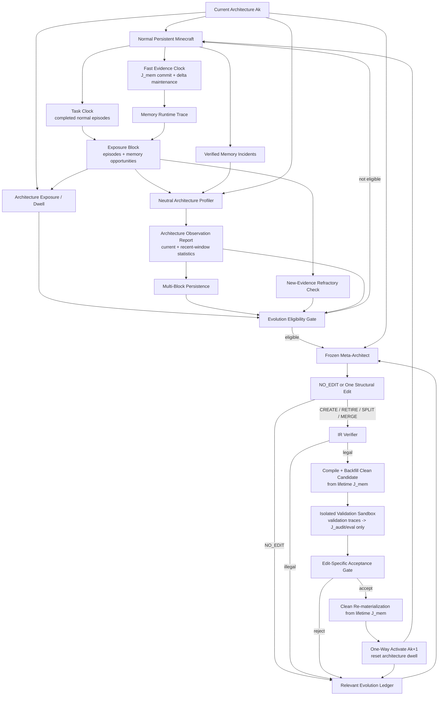

Candidate validation **不推进** Evidence/Task/Evolution clocks，也不向 `J_mem` 写入验证经验。MVP 在 candidate validation 期间暂停真实 lifetime progression，避免同时运行造成 cut / concurrency 语义复杂化。

核心权限边界：

\[
\boxed{
Profiler\ observes;
Meta\ abstracts;
Verifier\ constrains;
Evaluator\ selects.
}
\]

---

# Part VII. Forward-Only Evolution

## 26. 当前明确不采用 Rollback / Replay

当前版本明确删除：

```text
Runtime Rollback
Historical Replay
Counterfactual Replay
Dual Materialization
Hot Standby Old Architecture
AS-OF Architecture Query
```

原因：这些机制**不是 self-evolving memory 成立的必要条件**，但会显著增加：

- 工程复杂度；
- checkpoint 管理；
- world determinism 问题；
- 状态分叉；
- 论文叙事负担。

当前采用：

\[
\boxed{
\text{Forward-Only Evolution}
}
\]

即：

\[
A_0\rightarrow A_1\rightarrow A_2\rightarrow\cdots
\]

Candidate 没通过：丢弃。

Candidate 通过：成为下一代。

之后出现新的问题：

\[
A_k\rightarrow A_{k+1}
\]

继续修复，而不是回到旧版本。

---

## 27. Candidate Validation 不是 Rollback

`Candidate` 尚未成为 Active Architecture。

因此流程是：

```text
CURRENT Ak
   |
   +---- Candidate A'
            |
            +-- reject → discard
            |
            +-- accept → Ak+1
```

不是：

```text
Ak → A' → deploy → fail → rollback → Ak
```

---

# Part VIII. Seed Architecture

## 28. 为什么 Seed 不能太弱也不能太强

如果 Seed 故意很差：

> 从垃圾架构提升并不能证明 self-evolution 有真正价值。

如果 Seed 已经人工高度专门化：

> Agent没有足够结构空间可探索。

因此采用一个合理的主流粗粒度多 Memory 架构：

\[
\boxed{
World + Experience + Knowledge + Procedure
}
\]

---

## 29. WorldMemory

目标：外部世界状态。

示例字段：

```text
entity
entity_type
position
state
last_seen
confidence
```

模式：

```text
scope = WORLD
mode = CURRENT
access = ENTITY + SPATIAL + TEMPORAL
```

该 Seed 故意让静态和动态 world information 共存，但不是为了人为做差；这种粗粒度设计本身是合理初始方案，同时给长期运行留下结构细化空间。

---

## 30. ExperienceMemory

记录 Agent 历史 task/action/outcome。

```text
task
context
actions
outcome
time
```

```text
mode = APPEND
access = SEMANTIC + TEMPORAL
```

---

## 31. KnowledgeMemory

存储通过经验提炼出来的可复用 facts/rules。

```text
subject
relation
value
support
confidence
```

```text
mode = AGGREGATE
access = SEMANTIC + EXACT
```

---

## 32. ProcedureMemory

存储 reusable procedural knowledge / executable action procedures。

```text
name
preconditions
steps: LIST[ACTION]
outcome_stats
```

```text
mode = AGGREGATE
access = SEMANTIC
```

Voyager 原有 Skill Library 可以作为该 Node 的第一版 implementation donor。

---

# Part IX. Minecraft 执行基座与源码改造

## 33. 为什么选择 Voyager / Mineflayer

当前明确采用：

\[
\boxed{
\text{Voyager/Mineflayer = execution substrate}
}
\]

而不是直接从零实现 Minecraft Agent。

原因：

1. Voyager 已经提供成熟的 Minecraft LLM Agent 执行接口；
2. Mineflayer 负责真正的 Minecraft bot actuation；
3. Voyager 的 code-as-action / skill library 与长期 Agent 场景天然适配；
4. 我们可以固定动作接口，只替换 memory architecture，减少 planner/executor confound；
5. PEAM 在 Minecraft 中也选择复用 Voyager/Mineflayer action interface，同时改变 memory architecture，这进一步说明这一实验隔离方式是合理的。

研究原则：

\[
\boxed{
\text{Hold world/action interface fixed; vary the memory system.}
}
\]

---

## 34. 代码语言边界

建议：

\[
\boxed{
Python = Cognitive / Memory / Evolution Plane
}
\]

\[
\boxed{
Node.js / TypeScript = Minecraft Actuation Plane
}
\]

Minecraft Bridge 尽量保持 Voyager/Mineflayer 原接口稳定。

---

## 35. 源码架构图

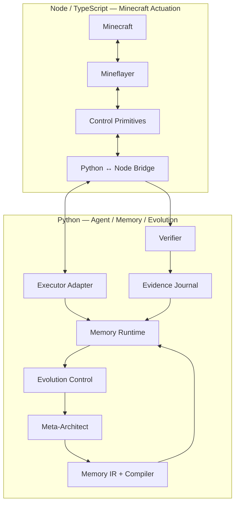

---

## 36. 推荐 Repository 结构

> v0.2 起，以 `Part IV-A §17.25` 的源码契约为准。这里给出完整仓库视图。

```text
evo-memory-mc/

├── mc_runtime/
│   ├── executor.py
│   ├── verifier.py
│   ├── mineflayer_bridge.py
│   ├── world_snapshot.py          # v0.16 evaluation-only current-checkpoint cloning
│   └── voyager_adapter.py
│
├── memory_kernel/
│   ├── abi.py
│   └── role_policy.py
│
├── evidence/
│   ├── event.py
│   ├── channel.py
│   ├── admission.py
│   ├── journal.py              # J_mem / J_audit append-oriented stores
│   ├── artifact_store.py       # content-addressed agent-visible artifacts
│   ├── provenance.py
│   └── evidence_index.py       # Standard+ generic backfill index
│
├── memory_ir/
│   ├── __init__.py
│   ├── enums.py
│   ├── fields.py
│   ├── predicate.py
│   ├── sources.py
│   ├── transform.py
│   ├── semantic_contract.py
│   ├── node.py
│   ├── architecture.py
│   ├── edits.py
│   ├── proposal.py
│   ├── normalize.py
│   ├── verifier.py
│   ├── errors.py
│   ├── compiler.py
│   └── serialization.py
│
├── memory_runtime/
│   ├── record.py
│   ├── change_set.py
│   ├── dependency_index.py
│   ├── backfill.py
│   ├── backfill_budget.py
│   ├── materialization_contract.py
│   ├── maintenance_engine.py
│   ├── materializer.py
│   ├── semantic_executor.py
│   ├── store.py
│   ├── discovery.py
│   ├── query.py
│   ├── resolution_view.py         # v0.19 Standard: node-local non-architectural views
│   ├── granularity_router.py      # v0.19 Standard: resolution selection only
│   ├── context_compiler.py
│   └── adapters/
│       ├── semantic.py
│       ├── entity.py
│       ├── spatial.py
│       ├── temporal.py
│       └── exact.py
│
├── operators/
│   ├── deterministic.py
│   ├── semantic.py
│   └── macros.py
│
├── evolution/
│   ├── telemetry.py
│   ├── incidents.py              # v0.4 direct MemoryIncident
│   ├── observation_report.py      # v0.5 neutral AOR
│   ├── exposure.py               # v0.10 ArchitectureExposure / ExposureBlock
│   ├── windows.py                # recent/reference observation windows
│   ├── eligibility.py            # v0.10 exposure + persistence gate
│   ├── refractory.py             # post-decision refresh / cooldown
│   ├── scheduler.py              # slow structural evolution clock
│   ├── ledger.py
│   ├── context_builder.py
│   ├── meta_architect.py
│   ├── decision.py               # NO_EDIT or one structural proposal
│   ├── candidate_builder.py
│   ├── validation_sandbox.py     # validation evidence isolated from J_mem
│   ├── acceptance.py             # edit-specific acceptance policy
│   └── validator.py              # fresh-task candidate evaluator
│
├── configs/
│   └── architectures/
│       └── seed_v0.yaml
│
├── llm/
│   ├── provider.py
│   ├── openai_compatible.py
│   └── roles.py
│
├── benchmarks/
│   ├── task_grammar/              # v0.15 architecture-blind gameplay goal grammar
│   ├── manifests/                 # pre-generated fixed neutral lifetime manifests + hashes
│   ├── adaptive_curriculum/       # Standard: gameplay-state/task-history only, no architecture channel
│   ├── validation_bank/           # pre-registered GateSpec partition
│   ├── edit_audit_bank/           # v0.16 disjoint held-out local-effect audit partition
│   ├── diagnostic/                # DIAGNOSTIC_ONLY edit/pathology stress suites
│   ├── leakage_audit.py           # primary-benchmark eligibility hard gates
│   ├── gather/
│   ├── craft/
│   ├── navigation/
│   ├── combat/
│   └── persistent/
│
├── experiments/
│   ├── fixed_seed/
│   ├── fixed_expert/
│   ├── self_evolve/
│   ├── benchmark_neutrality/      # matched manifests / adaptive robustness / diagnostic separation
│   ├── trajectory_attribution/    # v0.16 LTE / checkpoint-paired ELCE / gate-audit calibration
│   ├── granularity_control/       # v0.19 matched Fixed/Self + MultiResolution controls
│   └── ablations/
│
├── tests/
│   ├── memory_ir/
│   ├── materializer/
│   ├── edits/
│   └── integration/
│
└── analysis/
    ├── architecture_trajectory.py
    ├── natural_emergence.py       # v0.15 neutral-lifetime structural adaptation analysis
    ├── benchmark_neutrality.py    # leakage audit summaries / neutral-vs-diagnostic split
    ├── lifetime_attribution.py    # v0.16 matched lifetime paired deltas / LTE
    ├── edit_effect_audit.py       # v0.16 held-out paired checkpoint ELCE
    ├── trajectory_divergence.py   # v0.16 descriptive TDP, never main-effect adjustment
    ├── granularity_control.py     # v0.19 granularity-controlled structural gain
    ├── resolution_sensitivity.py  # v0.19 diagnostic only
    ├── paired_bootstrap.py        # Standard: clustered/hierarchical paired uncertainty
    ├── metrics.py
    └── plots.py
```

职责边界：

```text
memory_kernel/  = ABI / permission 等最小可信机制
memory_ir/      = 可演化逻辑架构的类型系统、验证与编译
memory_runtime/ = 当前 architecture 的物化、自动维护、检索与上下文服务
operators/      = 固定 MTIR execution primitives / compatibility macros
evolution/      = 固定演化控制面 + frozen Meta-Architect 调用
```

---

# Part X. LLM 部署原则

## 37. LLM Semantic; Runtime Deterministic

核心原则：

\[
\boxed{
\text{LLM handles semantics; deterministic code handles invariants.}
}
\]

LLM 适合：

- task planning；
- semantic query interpretation；
- summarization；
- architectural diagnosis；
- Node purpose/schema proposal。

代码负责：

- exact inventory；
- coordinates；
- timestamps；
- field validation；
- DAG validation；
- role permissions；
- token/cost accounting；
- node counts；
- activation；
- telemetry aggregation。

---

## 38. Provider 抽象

所有 LLM 通过统一 Provider：

```python
class LLMProvider(Protocol):
    async def complete(
        self,
        messages,
        response_schema=None,
        model_role=None,
        **kwargs,
    ) -> "LLMResponse": ...
```

这样可以自由切换本地 OpenAI-compatible inference server。

Meta-Architect 建议使用较强但低频模型；Memory Node Discovery 尽可能使用 embedding / deterministic runtime，避免频繁调用强模型。

具体本地模型型号不在本架构文档中冻结，因为模型迭代速度快；部署时单独根据最新开源模型重新评估。

---

# Part XI. 实验设计

## 39. 实验核心问题

实验不是回答：

> Router 准确率多高？

而是回答：

1. 固定 Memory Architecture 在长期正常任务中是否出现结构性瓶颈？
2. Agent 能否自主提出真正有用的 Memory Structural Edit？
3. 新结构是否提高 task utility / memory quality？
4. CREATE 是否真的产生人工 Seed 中不存在的新 abstraction？
5. SPLIT/MERGE 是否比只不断 CREATE 更有效？
6. Agent 的 architecture trajectory 是否具有可解释性？
7. 一个在 lifetime 后期才 CREATE 的新 Node，能否从 `J_mem` 重解释并利用 creation 之前的历史经验？

---

## 40. Minecraft 任务原则

**不为了论文人为制造怪异/对抗任务。**

主实验只使用正常 Minecraft 行为：

### 40.1 Resource Gathering

```text
Collect Logs
Mine Cobblestone
Collect Coal
Obtain Iron
```

### 40.2 Craft / Tech Tree

```text
Craft Crafting Table
Craft Wooden Pickaxe
Craft Stone Pickaxe
Craft Furnace
Craft Iron Pickaxe
```

### 40.3 Navigation / Revisit

```text
Return to Base
Return to Known Cave
Revisit Resource Location
Find Known Village
```

### 40.4 Combat / Survival

```text
Fight Zombie
Fight Skeleton
Survive Normal Threat During Exploration
Prepare and Survive Night
```

### 40.5 Simple Building

```text
Build Shelter
Build Storage / Workbench Station
```

### 40.6 Long-Horizon Mixed Tasks

```text
Obtain Furnace
Obtain Iron Pickaxe
Obtain Diamond
Build Shelter
Prepare and Survive Night
```

### 40.7 Illustrative Gameplay Dependency Chain — **不是主 Benchmark Manifest**

下面这条链只保留为开发期 smoke test / dependency sanity check：

```text
collect wood
→ craft table
→ collect stone
→ make furnace
→ collect iron
→ make iron pickaxe
→ explore
→ survive threat
→ obtain higher-tier resource
```

它用于检查执行器、tech-tree dependency 与长期状态是否能正常工作，**不能作为证明 Memory Architecture “自然演化” 的主 lifetime**。

特别是以下人工顺序：

```text
cave → combat → repeated revisit → return to base
```

如果由研究者为了观察 `RouteMemory / HazardMemory / SPLIT / MERGE` 而刻意安排，就属于 **Edit-Elicitation Leakage**。因此 v0.15 后，主实验任务流必须在看到任何 architecture-evolution 结果之前生成并冻结。

Minecraft 的长依赖仍然是研究优势，但“长依赖天然存在”与“研究者手工设计一个会触发目标 edit 的 curriculum”必须严格区分。

### 40.8 Neutral Gameplay Task Grammar

主 benchmark 只从一般 gameplay goal grammar 生成任务，不从 Memory ontology 生成任务：

```text
ACQUIRE(item, count)
CRAFT(item, count)
REACH(location_or_entity_description)
VISIT(grounded_known_location_ref)
INTERACT(target, action)
BUILD(structure_constraint)
SURVIVE(condition_or_duration)
MIXED(goal_sequence)
```

允许自然出现“回到之前建立的基地”等正常 persistent-world goal；但禁止 task generator 使用：

```text
remember a route
exercise RouteMemory
create a hazard memory
force a static/dynamic split
test MERGE
```

即：**goal 可以依赖真实游戏历史，但不能依赖预期 Memory representation。**

---

## 41. Benchmark 分层 — v0.15 三轨协议

### Tier 0 — Mechanics / Single-Family Smoke Tests

目的：确认 Seed Memory Runtime、Executor、Verifier 与 task APIs 工作正常。

任务：Gather / Craft / Navigate / Combat / Build 等单任务族。

这些结果不是 emergent architecture 的核心证据。

### Tier 1 — Neutral Fixed-Manifest Persistent Lifetime — **主实验**

这是主因果比较。

对每个预注册 world seed / curriculum seed，在运行任何方法之前生成：

\[
\mathcal M_s = G(s_{world},s_{curr},\mathcal G_{task})
\]

其中 `G` 只知道通用 Minecraft task grammar / world setup，不读取任何：

```text
Memory node names
A_k
AOR
Memory incidents
retrieval misses / stale-use statistics
edit history
candidate results
expected CREATE/SPLIT/MERGE/RETIRE
```

随后 `FixedSeed / RuleBasedEvolver / SelfEvolve / ablations` 在**相同 world seed、相同 initial snapshot、相同 manifest**上分别运行；每个方法内部 world 和 Memory 都跨任务持续存在。

Manifest 在运行前写入 hash，不允许看到结果后增删“更容易触发某个 edit”的任务。

### Tier 2 — Architecture-Blind Adaptive Curriculum — **生态鲁棒性实验**

作为 Standard robustness protocol，可以使用 Voyager-style capability-aware curriculum：根据 agent 的 verified gameplay state、已完成/失败任务和探索进度提出下一目标，但 curriculum **没有 architecture channel**。

形式上：

\[
T_{t+1}\sim \pi_{curr}(X^{game}_t,H^{task}_t;s_{curr})
\]

而不是：

\[
T_{t+1}\sim \pi_{curr}(X^{game}_t,A_k,AOR_t,Incident_t)
\]

由于不同方法可能导致不同 gameplay state，adaptive curriculum 的 realized task stream 也可能分叉，因此它用于 ecological robustness，而不是替代 Tier 1 的 matched-manifest 主比较。

### Tier D — Diagnostic Edit-Elicitation Stress Suite — **只做机制诊断**

允许构造更容易暴露某类结构问题的正常 Minecraft 场景，例如：

```text
repeated revisit demand
mixed freshness entity observations
over-split sibling redundancy
persistent low-value node
workload shift blocks
```

但这些任务必须明确标为 `DIAGNOSTIC_ONLY`，不能用于证明：

> “Agent 在自然 lifetime 中自主发现了某种 Memory abstraction。”

它只回答：

> 当对应 pathology 真实存在时，机制能否正确检测、编辑并验证？

主论文必须把 Tier 1/2 与 Tier D 分表报告。

---

## 42. Candidate Validation 任务 — v0.16 Pre-Proposal Dual-Spec + Paired Checkpoint Fork

Candidate 不能自己挑验证任务，Meta 也不能在提出 edit 后反向塑造自己的考试题；同时，**用于 Accept/Reject 的 GateSpec 不能再被论文重复当作独立的 edit-effect 科学证据**。

因此 v0.16 在 v0.15 pre-proposal neutrality 基础上进一步冻结：

\[
\boxed{
Eligibility
\rightarrow
Freeze(GateSpec,HeldOutAuditSpec)
\rightarrow
MetaProposal
}
\]

### 42.1 Pre-Registered Validation / Audit Bank

在正式实验前生成独立：

```text
ValidationBank
├── Gate partition
│   ├── Gather
│   ├── Craft
│   ├── Navigate / Visit
│   ├── Combat / Survival
│   ├── Build
│   └── Mixed
└── Held-Out Edit Audit partition
    ├── Gather
    ├── Craft
    ├── Navigate / Visit
    ├── Combat / Survival
    ├── Build
    └── Mixed
```

它与 lifetime manifests 使用不同 generator seeds / task instances，并在 test 前冻结；Gate 与 Audit partition 必须 disjoint。

### 42.2 Freeze Dual Specs Before Meta Proposal

当 Eligibility Gate 打开 structural review 时，Control Plane 先根据**已经存在的 neutral symptom evidence**生成：

\[
(V_t^{gate},Q_t^{audit})
=
SplitSelect(B_{val},SymptomSignature_t,\Theta_{selector})
\]

其中 `SymptomSignature_t` 来自 proposal 之前的 incident/AOR context，而不是来自：

```text
proposed node name
proposed semantic objective
edit rationale
candidate validation score
```

要求：

\[
V_t^{gate}\cap Q_t^{audit}=\varnothing
\]

且两者都在 Proposal 之前冻结。Meta 不看到具体 validation/audit task IDs。

### 42.3 Gate Evaluation — Paired Current-Checkpoint Fork

在真实 persistent lifetime 当前 checkpoint 上暂停 progression，创建 evaluation-only world snapshot，并 fork：

```text
same current checkpoint
        |
        +-- clean A_k from same J_mem cut
        |
        +-- clean A'  from same J_mem cut
```

两边使用完全相同的 `GateSpec`、evaluator config、seed strata 与 bounded prospective horizon。

这不是 replay Agent 的过去；两个 branch 都只从**当前 checkpoint 向未来**运行。validation traces 继续只进入 `J_eval ⊂ J_audit`，不进入 `J_mem`。

Candidate Gate 共享要求：

1. 解决 proposal 声称的 target symptom；
2. overall task utility 不显著下降；
3. architecture complexity 不能无意义增加。

### 42.4 Held-Out Edit Audit — Analysis Only

对 accepted edit 使用同一真实 checkpoint 与同一 `J_mem` evidence cut，再在 disjoint `HeldOutAuditSpec` 上进行：

\[
clean(A_k)\quad vs\quad clean(A')
\]

得到 `Held-Out ELCE`。

它：

```text
不参与 Accept/Reject
不反馈 Meta
不写回 J_mem
negative result 不触发 rollback
```

因此：

\[
\boxed{
GateEvidence\neq ScientificEditEffectEvidence
}
\]

v0.4 进一步采用 **edit-specific acceptance**：

| Edit | 额外必须验证的内容 |
|---|---|
| CREATE | 新 Node 在相关 fresh tasks 中真实被 discovery/query；目标需求改善；新增复杂度有净收益 |
| SPLIT | 两个 child 都有非平凡 support；目标 subgroup pathology 改善；无重复/缺口 |
| MERGE | retrieval/behavior coverage 保持；冗余与成本下降；互补语义未被破坏 |
| RETIRE | target 合法可退役；无 downstream break；任务 utility 保持且成本下降 |

详细规范见 **Part XVII-A / 80A.9 Edit-specific Candidate Acceptance**。

---

## 43. 核心 Baselines

### 43.1 `FixedSeed`

固定：

```text
World
Experience
Knowledge
Procedure
```

不允许任何结构进化。

### 43.2 `FixedExpert`

由我们根据对 Minecraft 的理解人工设计一个更强结构。

目的：回答：

> SelfEvolve 能否接近甚至超过人工 expert architecture？

### 43.3 `SelfEvolve` — Ours

从相同 Seed 开始，允许：

```text
CREATE
RETIRE
SPLIT
MERGE
```

### 43.4 `SelfEvolve w/o CREATE`

只能：

```text
RETIRE
SPLIT
MERGE
```

用于检验真正创造新 abstraction 的价值。

### 43.5 `SelfEvolve w/o SPLIT/MERGE`

只允许 CREATE / RETIRE。

用于检验“重构已有边界”与“只不断增加新 Node”的差异。

### 43.6 Optional Baselines

若实验资源允许，可以增加：

```text
Voyager original memory/skill behavior
No long-term memory
```

但不是主论文必须 baseline。

### 43.7 `RuleBasedEvolver` — v0.6 必须 baseline

这是专门回答：

> **AOR 已经有统计以后，几条 deterministic rules 是否足以替代 Meta-LLM？**

`RuleBasedEvolver` 必须与 `SelfEvolve` 使用完全相同的：

- Seed Architecture；
- Architecture Observation Report；
- IR grammar；
- Node / complexity budget；
- one-edit-per-round 约束；
- fresh prospective validation pool；
- acceptance policy。

区别只有：

\[
\boxed{MetaLLM \rightarrow DeterministicHeuristics}
\]

它不能使用人工 `RouteMemory / StaticWorld / DynamicWorld` 模板。

MVP 规则族：

```text
NO_EDIT:
    no stable eligible pattern

RETIRE:
    leaf node + persistently low use + low unique-success proxy + nontrivial cost

MERGE:
    compatible sibling pair + high result/source overlap + low independent contribution

SPLIT:
    categorical/numeric profile values admit a high-contrast two-way partition
    under minimum-support constraints

CREATE:
    persistent unresolved-intent cluster + low existing-node coverage
    + repeated multi-node composition
    -> create a generic derived node using existing typed fields/helpers
```

特别重要：RuleBased CREATE 只能使用**ontology-free generic template**，不能人工写：

```text
if cluster looks like navigation -> RouteMemory
```

否则 baseline 实际上使用了研究者的 domain ontology。

### 43.8 `LLM-TypeOnly` — Standard 诊断消融

为了判断 LLM 的收益来自“选对 edit type”还是“真正设计新 abstraction”，Standard 可加入：

```text
AOR
→ Meta chooses NO_EDIT / CREATE / RETIRE / SPLIT / MERGE
→ deterministic payload generator constructs the actual edit payload
```

与完整 SelfEvolve：

```text
AOR
→ Meta chooses edit type
→ Meta also synthesizes selector / purpose / schema / sources / transform
```

比较。

若 `LLM-TypeOnly ≈ Full Meta`，说明 LLM 主要只是 classifier；若 Full Meta 尤其在 CREATE 上显著更好，才支持“semantic architecture synthesis”这一主张。

### 43.9 `StrongMultiGranularity` — v0.19 Standard 强控制 baseline

为排除“SelfEvolve 的收益其实只是 FixedSeed retrieval resolution 太弱”这一替代解释，Standard 增加 matched 2×2 control：

```text
FixedSeed
SelfEvolve
FixedSeed + MultiResolution
SelfEvolve + MultiResolution
```

其中 `+ MultiResolution` 两个 arm 必须共享完全相同的：

- resolution-view generator；
- granularity router；
- retrieval top-k / token budget；
- semantic model与版本；
- cache / maintenance accounting。

核心 estimand：

\[
\boxed{
GCLG = J(SelfEvolve+MG)-J(FixedSeed+MG)
}
\]

其中 `MG` 表示 matched multi-granularity retrieval substrate。若 `GCLG>0` 且跨 Seed 稳定，说明 structural evolution 的收益不能仅由 granularity selection 解释。

该 baseline **不要求进入 Core-6 full-N**；按 v0.17 的 tiered budget 在 Standard subset 上运行即可。

### 43.10 `HandCodedRuleOracle` — 只作为诊断上界

可以在 Appendix 中人工编码：

```text
STATIC/DYNAMIC split
route-like intent -> RouteMemory
...
```

但它不是正式公平 baseline，因为它显式注入研究者对 Minecraft 的目标 ontology。

它回答的是另一个问题：

> **如果人类预先知道最终结构答案，规则系统最多能做到多好？**

### 43.11 v0.9 `Delayed Abstraction / Late CREATE` Evidence 对照

为了验证后期 CREATE 是否真的能够利用 creation 之前的 lifetime experience，MVP 增加一个 Evidence-substrate 对照组：

```text
FullGroundedEvidence      # ours: J_mem + historical backfill
SummaryOnlyEvidence       # 历史 grounded evidence 被当前 semantic summaries 取代
RecentWindowEvidence      # 只保留最近 N 个 interaction boundaries
NoHistoricalBackfill     # J_mem 仍在，但新 Node 只吸收 creation 后数据
```

另做一个 granularity 诊断：

```text
BoundaryOnlyEvidence
vs
BoundaryPlusActuatorTrace
```

它专门检查长 Mineflayer tool/action 内部轨迹是否会被单纯 LLM-turn logging 丢失。

公平性要求：这些组使用相同 Meta-Architect、Memory IR、AOR、candidate validation 和 task sequence，只改变 Evidence retention / backfill policy。

### 43.12 v0.10 Evolution Timescale / Trigger 对照

为了证明“慢结构时钟”不是纯粹为了降低 Meta 调用成本，而确实减少 premature evolution 与 architecture churn，MVP 增加：

```text
EveryTaskMeta             # 每个完成任务都允许 Meta 检查，近似无慢时间尺度
PeriodicMeta              # 固定每 B 个任务调用，不看结构证据是否持续
EvidenceAwareMultiScale   # ours: exposure + persistence + dwell + refresh
NoMinimumDwell            # 去掉 accepted edit 后最小暴露期
SingleWindowTrigger       # 只看最近一个 observation block
NoRefractory              # NO_EDIT / rejection 后可以立即用同一批证据再次调用
```

Standard 再增加：

```text
NoWorkloadShiftGuard
NoLineageHysteresis
```

公平性要求：

1. `RuleBasedEvolver` 与 `FullMeta` 使用完全相同的 trigger schedule；
2. 时间尺度参数只在 development worlds 上选择一次；
3. test 时不得按 edit type、task family、seed 单独调 dwell / persistence threshold；
4. candidate validation tasks 不计入任何 lifetime exposure；
5. validation traces 不进入 `J_mem`。

该实验重点观察 stability–responsiveness trade-off：太快会导致 churn，太慢则会延迟真正有益的结构适应。

---

## 44. 核心指标

### Task 层

```text
Task Success Rate
Verified Progress
Episode Length / Steps
```

### Runtime Memory 层

```text
Retrieval Hit Rate
Stale Use Rate
Retrieval Calls
Token Cost
Latency
```

### Architecture 层

```text
Node Count
Field Count
Accepted Edit Count
Edit Type Distribution
Candidate Acceptance Rate
Architecture Complexity
```

### Evidence Substrate 层（v0.9）

```text
Historical Backfill Coverage
Future Abstraction Recoverability
Backfill Utility Gain
EvidenceCore Bytes / Interaction
Raw Artifact Bytes / Interaction
Backfill Read Volume / Latency
```

### Evolution Timescale 层（v0.10）

```text
Meta Invocation Rate
Accepted Architecture Churn Rate
Inverse/Reversal Edit Rate
Evolution Delay
Sustained Target Effect Rate
Mean Architecture Dwell
NO_EDIT / Rejection Refresh Interval
```

定义：

\[
MetaInvocationRate=
\frac{N_{meta\_calls}}{N_{normal\_task\_episodes}}
\]

\[
ArchitectureChurnRate=
\frac{N_{accepted\_edits}}{N_{memory\text{-}relevant\ episodes}}
\]

\[
ReversalRate=
\frac{N_{near\text{-}inverse\ lineage\ edits}}{N_{accepted\_edits}}
\]

`EvolutionDelay` 从某个 neutral observation 首次满足 persistent-support 定义，到对应有益 structural edit 被接受之间的 exposure；它用于约束系统不能只靠无限增大 dwell 来获得“稳定”。

`SustainedTargetEffectRate` 统计 accepted edit 的目标改善是否在后续多个正常 exposure blocks 中仍保持，而不是只在 candidate validation 当下短暂有效。

定义：

\[
C(A)=\alpha N_{node}+\beta N_{field}+\gamma N_{edge}
\]

总体 utility：

\[
\boxed{
J(A)
=
U_{task}(A)
-\lambda_1C_{runtime}(A)
-\lambda_2C_{architecture}(A)
}
\]

第一版不追求复杂因果归因。

---

## 45. 最重要的论文 Figure

我们最终最希望得到这样的真实演化轨迹：

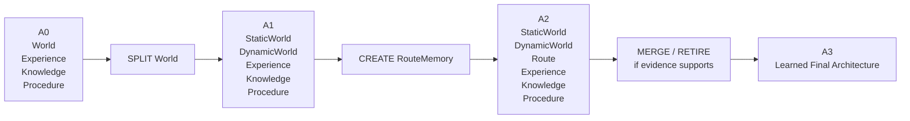

每个 transition 下显示：

```text
trigger symptom
Meta rationale
candidate result
metric change
```

这张 Figure 比 Router Accuracy 更能直接证明 self-evolving memory architecture。

---

# Part XII. 论文核心假设

## 46. Hypotheses

### H1 — Fixed Architecture Limitation

\[
\boxed{
\text{A fixed human-designed memory architecture becomes structurally suboptimal over a persistent open-world lifetime.}
}
\]

### H2 — Structural Evolution

\[
\boxed{
\text{Constrained structural edits improve the task-success / memory-cost frontier over the same fixed seed architecture.}
}
\]

### H3 — New Abstraction Creation

\[
\boxed{
\text{Allowing CREATE enables the agent to form useful memory abstractions not represented in the initial human-designed seed.}
}
\]

### H4 — Reorganization vs Growth

\[
\boxed{
\text{SPLIT/MERGE/RETIRE prevent architecture growth from degenerating into unbounded memory-node accumulation.}
}
\]

### H5 — Future Reinterpretability

\[
\boxed{
\text{Architecture-independent grounded evidence enables useful late-created memory abstractions to recover and exploit pre-creation experience.}
}
\]

该假设由 `Delayed Abstraction / Late CREATE`、Historical Backfill Coverage、Future Abstraction Recoverability 和 `NoHistoricalBackfill` 对照直接检验。

### H6 — Slow Structural Timescale

\[
\boxed{
\text{Exposure-aware, persistent-evidence structural scheduling reduces architecture churn and Meta cost without materially delaying beneficial adaptation.}
}
\]

该假设由 `EveryTaskMeta / PeriodicMeta / NoMinimumDwell / SingleWindowTrigger / NoRefractory` 等对照，以及 Architecture Churn、Evolution Delay、Sustained Target Effect Rate 共同检验。

### H7 — Seed Robustness and Functional Equifinality

\[
\boxed{
\text{Constrained memory-architecture evolution reduces dependence on reasonable human-designed seeds and can reach functionally comparable organizations from distinct initial partitions.}
}
\]

H7 **不要求最终 DAG 完全相同**。验证重点依次是：

1. 每个合理 Seed 上 SelfEvolve 都能相对其自身 FixedSeed 获得稳定收益；
2. 不同 Seed 的最终 task/memory utility 差距缩小或保持在可接受范围；
3. 不同最终 DAG 对同一组中立 memory demands 形成相似的 functional organization；
4. 如果结构仍明显不同但功能相近，则视为 **equifinality（异路同效）**，而不是失败。

该假设由 v0.11 的 matched multi-seed experiment、Functional Organization Signature、Seed Robustness Gain、Functional Convergence Ratio 与 Equifinality Rate 检验。

### H8 — Grammar Reachability and Practical Connectivity

\[
\boxed{
\text{The constrained four-edit grammar has broad relaxed reachability, while practical traps are expected to arise mainly from transient complexity and per-generation adoption constraints rather than raw syntactic incompleteness.}
}
\]

H8 不预设四操作“数学完备”。它要求分别测试：

1. IR-expressible target 是否 syntactically reachable；
2. reachability 是否被 node/complexity budget 阻断；
3. shortest legal path 是否过长；
4. 每一步必须独立通过 Candidate Acceptance 是否造成 local-acceptance valley；
5. 只有出现稳定 dependency-topology trap 时，`REWIRE_SOURCE` 才值得进入 Standard。

该假设由 v0.12 的 SyRR / BRR / EPL / TCO、small-DAG grammar suite、runtime topology-trap diagnostics，以及条件式 `Γ4 vs Γ4+REWIRE_SOURCE` 消融检验。

### H9 — Strategic-Valley Sparsity

\[
\boxed{
\text{After atomic semantic compilation, most practical architecture improvements remain single-semantic-edit addressable; robust pair-only strategic complementarities are sparse rather than the norm.}
}
\]

H9 由 v0.14 的 same-evidence-cut Strategic Valley Probe、`SingleEditRepresentable`、paired validation 与 superadditive synergy 检验。它不预设一定没有多步结构互补；只规定在测到之前不增加 multi-edit Runtime。

### H10 — Benchmark-Neutral Structural Emergence

\[
\boxed{
\text{Under architecture-blind, pre-registered natural Minecraft task streams, constrained self-evolution still yields sustained useful structural adaptations and improves lifetime utility without edit-targeted curriculum design.}
}
\]

H10 **不要求四种 edit 在每条 lifetime 都出现**。真正要验证的是：

1. neutral main lifetime 中 `SelfEvolve` 相对 matched `FixedSeed` 有稳定净收益；
2. 至少一部分独立 lifetime 自然产生被接受且长期有效的 structural edits；
3. useful CREATE / SPLIT / MERGE / RETIRE 的出现是实验结果，而不是 benchmark quota；
4. 若某类 edit 只在 `DIAGNOSTIC_ONLY` stress suite 出现，则只能证明机制 capability，不能声称其在自然 lifetime 中必然 emergent。

该假设由 v0.15 的 Fixed Neutral Manifest、Architecture-Blind Adaptive Curriculum、Edit-Elicitation Leakage Audit、Natural Structural Adaptation Coverage 与 neutral-vs-diagnostic 分离报告检验。

### H11 — Two-Level Persistent-World Attribution

\[
\boxed{
\text{Self-evolving memory yields a positive total lifetime effect from matched initial conditions, while accepted edits retain positive held-out checkpoint-local effects when architecture alone is intervened upon.}
}
\]

H11 明确区分两个 estimands：

1. `Lifetime Total Effect (LTE)`：允许方法导致的 world-state divergence 自然累积，衡量整个 SelfEvolve policy 的长期总收益；
2. `Edit-Local Conditional Effect (ELCE)`：在同一个当前 checkpoint、同一 `J_mem` cut 上 clean materialize `A_k / A'`，用 proposal-blind held-out paired forward forks 估计单个 accepted edit 的局部效应。

H11 不要求：

\[
LTE=\sum_e ELCE_e
\]

因为真实 lifetime 存在 nonlinear compounding、world-state mediation、edit timing 与 workload exposure。该假设由 v0.16 的 matched lifetime paired analysis、Held-Out Edit Audit、HPEF/GAG 与 Attribution Integrity hard gates 检验。

### H12 — Granularity-Orthogonal Structural Gain

\[
\boxed{
\text{Structural memory evolution retains positive lifetime benefit under a matched strong multi-resolution retrieval substrate, indicating that its gains are not reducible to retrieval granularity selection alone.}
}
\]

H12 是 **Standard secondary hypothesis**，不成为 MVP 核心方法成立的前提。它要求：

1. `FixedSeed + MultiResolution` 与 `SelfEvolve + MultiResolution` 共享完全相同的 resolution views、router authority、retrieval budget 与 maintenance accounting；
2. granularity runtime 不向 Meta 暴露新的 architecture edit vocabulary；
3. 若 strong multi-resolution retrieval 大幅缩小 SelfEvolve-vs-Fixed gap，必须如实报告，不能把 resolution gain 重新解释为 structural gain；
4. 若 controlled gap 仍稳定为正，则支持：

\[
\boxed{
StructureGain
ot\equiv GranularityGain
}
\]

该假设由 v0.19 的 Strong-Granularity Control、Granularity-Controlled Lifetime Gain 与 matched `Fixed/Self + MultiResolution` 对照检验。

---

# Part XIII. 与现有工作的边界

## 47. Voyager

Voyager 提供：

- Minecraft open-ended lifelong setting；
- automatic curriculum；
- executable skill library；
- iterative prompting / environment feedback；
- Mineflayer-based execution substrate。

本项目不把“skill library 会增长”视为 Memory Architecture self-evolution。

我们的研究对象是：

> **Memory system 的 logical organization 本身发生结构变化。**

v0.15 进一步只借 Voyager automatic curriculum 的“根据当前 gameplay state / exploration progress 提出下一目标”这一 architecture-blind 思路作为 **Standard ecological robustness protocol**。主因果实验仍使用预生成、matched 的 Fixed Neutral Manifest，因为 adaptive curriculum 会随不同 agent 的完成/失败历史产生不同 realized task streams。

---

## 48. StructAgent

StructAgent 的重要启发：

> Planner/Actor 输出只能提出 progress，只有 verifier-backed decisions 可以 commit progress。

因此我们将 `Verified Current State` 从可演化长期 Memory 中拿出来，放入固定 Kernel Plane。

这避免 LLM hallucination 直接改变 Agent 当前真实状态。

---

## 49. MAGE

MAGE 强调长程任务中的 execution-state dependency、state fragmentation 和错误污染问题，并把 memory 视为 execution-state management，而不仅是 similarity retrieval。

我们的吸收：

- 当前执行状态应和长期可演化 Memory 分开；
- Memory 不能只看 semantic similarity；
- 但第一版不复制 MAGE 的 tree/revise/rollback 机制。

---

## 49A. MemGAS：Multi-Granularity Retrieval 与 Structural Evolution 的正交边界

Xu et al., **From Single to Multi-Granularity: Toward Long-Term Memory Association and Selection of Conversational Agents**（arXiv:2505.19549）研究的是固定长期对话 Memory 在多种表示粒度下的关联、选择与检索。其核心 memory unit 同时包含 session / turn / summary / keyword 等 representation；新旧 memory 通过 GMM 建关联，query 时使用 entropy-based granularity router，随后以 PPR 检索并进行 LLM filtering。

本项目不把该工作理解为“Memory Architecture 自进化”，而把它作为一个关键反事实：

> retrieval 不佳可能来自 **representation resolution mismatch**，并不必然意味着长期 Memory semantic boundary 错误。

因此 v0.19 正式冻结：

\[
\boxed{
MemoryStructure
eq MemoryGranularity
}
\]

以及：

\[
\boxed{
ArchitectureEdge
eq RetrievalAssociationEdge
}
\]

MemGAS 中用于关联 memory units 的 retrieval graph 只属于 retrieval backend 语义；本项目 Memory DAG 的边表示 source/materialization dependency，二者不得混用。

本项目吸收：

- query-dependent granularity 是合理的 retrieval dimension；
- 同一长期 abstraction 可以有不同 resolution views；
- fixed single-granularity baseline 可能夸大“结构变化”的必要性。

本项目不直接吸收：

- conversational-specific `session / turn / summary / keyword` 作为 Minecraft ontology；
- GMM/PPR 作为 Architecture DAG；
- entropy router 作为默认不变机制；
- 让 Meta 把 resolution view 当作可进化 Memory Node。

论文链接：`https://arxiv.org/abs/2505.19549`。

---

## 50. RoboMemory / eMEM

RoboMemory 显式并行使用 Spatial / Temporal / Episodic / Semantic memories；eMEM 强调 embodied memory 同时需要 semantic / spatial / temporal access。

启发：

> Embodied Memory 天然异构，因此“一个固定统一 memory store”不是唯一合理组织形式。

这支持我们使用一个 Typed DAG，而不是一个单向量库。

---

## 51. WorldLines / ObsMem

WorldLines 强调 persistent dynamic world state，ObsMem 区分 historical evidence、structured world state 和 beliefs。

启发：

- Canonical Evidence 与 current materialized memory 需要分开；
- persistent world state 是 embodied lifelong agent 的核心问题；
- 外部世界 state 不能简单等同于 semantic text memories。

---

## 52. PEAM

PEAM 在 Minecraft 中将部分经验从 episodic retrieval 转为 parametric skills，并复用 Voyager 的 Mineflayer execution framework。

启发：

1. 固定 action interface、只改变 memory architecture 是合理实验隔离方式；
2. failure/correction 可以成为长期 memory transformation 的输入；
3. 但第一版暂不允许 Meta 修改 LoRA/learned parametric state，避免 irreducible state migration 问题。

---

## 53. MemEvolve

MemEvolve 已经提出 memory architecture meta-evolution，并将代表性 memory systems 统一到 encode/store/retrieve/manage 的模块化设计空间。

因此，我们不能把创新点仅写成：

> “LLM 会修改 Memory Architecture。”

我们的边界必须更加具体：

\[
\boxed{
\text{stateful persistent embodied agent}
+
\text{typed structural memory DAG}
+
\text{CREATE/RETIRE/SPLIT/MERGE}
+
\text{fixed trusted evolution boundary}
}
\]

---

## 54. EvolveMem

EvolveMem 让 LLM 根据 failure logs 修改完整 retrieval configuration，并包含 regression safeguard。

这说明：

- configuration-level self-evolution 已经不是空白；
- 仅仅自动改 top-k / fusion / retrieval 参数不足以构成我们的最终创新。

因此当前项目把低层 tuning 与真正 structural evolution 分开。

---

## 55. AutoMem

AutoMem 把 memory management 视为可学习认知技能，并让强 LLM 修改支撑 memory interaction 的 structure，包括 prompt / file schema / action vocabulary 等。

因此我们进一步收缩研究边界：

> 不做任意 scaffold/code rewriting，而是让 LLM 只操作一个非任意编程的 Typed Logical Memory IR。

这样可以把研究对象明确为：

\[
\boxed{
\text{memory architecture reasoning}
}
\]

而不是一般软件自修改。

---

## 56. HSI / Harness Self-Improvement

HSI 研究 task-specific harness 的持续演化，并保留 frozen outer anchor。

这给我们的直接启发是：

> self-evolution 不意味着所有层都必须可修改。

我们因此冻结：

```text
Kernel
Evolution Control Plane
Meta-Architect model/prompt/tool set
Validation policy
```

只允许 Long-Term Memory Logical Architecture 发生变化。

---

## 57. Linux VFS / cgroup / eBPF 思想

### VFS 启发

Linux VFS 提供统一 filesystem interface，让不同具体 filesystem 实现共存。

我们最初由此提出 Stable Memory ABI：

```text
Executor -> MEMORY_ASK
```

而不是让上层绑定具体 Memory Node。

### cgroup 启发

cgroup 的核心思想是资源控制与机制层统一管理。

我们吸收为：

- 资源预算由 trusted runtime 管；
- Meta 不直接决定系统硬资源限制。

第一版不会实现完整 memory-cgroup subsystem。

### eBPF 启发

eBPF 的核心启发是：

\[
\boxed{
\text{restricted expressive program + verifier}
}
\]

我们据此将“LLM自由写插件代码”改成：

\[
\boxed{
Typed\ Memory\ IR + IR\ Verifier
}
\]

---

## 58. Pi / Modern Harness 启发

Pi extensions 可以：

- runtime register tools；
- lifecycle event interception；
- dynamic active tools；
- ResourceLoader；
- tool prompt snippets / guidelines。

我们从中得到：

- minimal stable kernel；
- resource discovery；
- dynamic components；
- progressive disclosure；
- stable seam。

但我们最终**没有**把每个新 Memory Node 变成新的 LLM Tool，因为那会导致 tool surface 随 architecture 爆炸。

相反，我们保留一个固定：

```text
MEMORY_ASK
```

再在 Memory Runtime 内发现 Node。

---

# Part XIV. 已明确删除 / 暂缓的机制

## 59. 第一版明确不做

### 59.1 Learned Working-Set Router

原因：研究重点已经从 adaptive use 转为 structural evolution；否则贡献叙事混杂。

### 59.2 Memory Fault

原因：原本用于 hard working set miss；Working Set 删除后不再必要。

### 59.3 Dynamic Capability Subsystem

包括：

```text
Capability Registry
Capability Card
Capability Lease
Probation
Dormant lifecycle
Capability Versioning
```

原因：第一版 NodeCard + NodeDiscovery 已能解决新 Node zero-shot 发现。

### 59.4 Full Architecture Belief Registry

原因：避免 Meta-Memory 套 Meta-Memory。改用简单 Evolution Ledger。

### 59.5 Dedicated Memory Lineage Graph

第一版仅保留 local `source_refs`。

### 59.6 Full Architecture Identifiability Engine

不做复杂 partition distance / behavioral fingerprint；保留 canonical IR normalization + validation + complexity penalty。

### 59.7 Structural Probe Engine

不实现 virtual split / merge / information-gain probing 作为在线子系统。

### 59.8 Runtime Rollback

明确删除。

### 59.9 Historical / Counterfactual Replay

明确删除。

### 59.10 Arbitrary Python Plugin Generation

永久禁止作为第一版 IR execution route。

### 59.11 Parametric / Irreducible Memory Evolution

第一版不允许 Meta 修改 LoRA、learned model weights 等不可轻易从 Evidence 构建的 state。

---

# Part XV. 开发顺序

## 60. Phase 0 — Reproduce Execution Baseline

目标：

- 跑通 Voyager/Mineflayer；
- 固定基本 action interface；
- 确认 normal Minecraft tasks 可稳定执行。

不碰 evolution。

---

## 61. Phase 1 — Stable Evidence / Verifier Plane

实现：

```text
Verified Current State
Canonical Evidence Journal
```

确保：

- inventory-based verification；
- task progress 有明确 ground truth；
- LLM self-report 不直接 commit。

---

## 62. Phase 2 — Source-Level Typed Memory IR

严格按 v0.2 `Part IV-A` 实现：

```text
enums.py
fields.py
predicate.py
sources.py
node.py
architecture.py
serialization.py
errors.py
verifier.py
```

这一阶段不接 Minecraft、不接 Meta-LLM。

完成标准：

- `seed_v0.yaml` 能 parse；
- DAG / helper / mode / access rules 可确定性验证；
- 非法 IR 返回稳定 error code；
- canonical hash 可识别 label/order no-op。

---

## 63. Phase 3 — Trusted Helpers + Seed Materialization

实现固定 Helpers：

```text
EXTRACT
SUMMARIZE
AGGREGATE
PROCEDURALIZE
```

再实现：

```text
MemoryRecord
PhysicalMemoryPlan
Materializer
Structured Store
Query Adapters
```

要求仅凭：

```text
Canonical Evidence Journal + seed_v0.yaml
```

即可完整构建四个 Seed Node。

---

## 64. Phase 4 — Generic Seed Memory Runtime

实现：

```text
Node Discovery
MEMORY_ASK
MEM_QUERY
Context Compiler
```

接入 Voyager/Mineflayer executor，但 architecture 仍固定为 `A0`。

先验证：

- normal Minecraft tasks 能稳定读写 memory；
- fixed Seed 架构本身可以工作；
- telemetry 可以观测每个 Node。

---

## 65. Phase 5 — Structural Edit Compiler

依次实现 v0.2 四个 Macro：

```text
CREATE_NODE
RETIRE_NODE   # leaf only
SPLIT_NODE    # binary lossless partition
MERGE_NODES   # compatible siblings only
```

先使用人工 JSON/YAML proposal 做：

```text
parse → macro expand → verify → compile → candidate materialize
```

全部通过后才允许接 Meta-LLM。

---

## 66. Phase 6 — Telemetry + Evolution Ledger

实现必要 runtime metrics 和结构 summary。

确认系统能回答：

> “哪个 Node 出现了什么长期问题？”

---

## 67. Phase 7 — Meta-Architect

输入：

```text
Current Architecture
Architecture Observation Report
Relevant Ledger History
Allowed Edit Grammar
```

输出严格 JSON/YAML proposal。

每次最多一个 edit。

---

## 68. Phase 8 — Prospective Candidate Validation

实现独立 fresh validation task pool。

Candidate：

```text
verify
compile
materialize
run validation
accept/reject
```

接受后单向替换 Current Architecture。

---

## 69. Phase 9 — Persistent Self-Evolution Experiment

从同一个 A0 开始跑长 lifetime：

\[
A_0\rightarrow A_1\rightarrow A_2\rightarrow\cdots
\]

记录完整 architecture trajectory。

---

## 70. Phase 10 — Baselines / Ablations / Paper Figures

最终才跑：

```text
FixedSeed
FixedExpert
SelfEvolve
w/o CREATE
w/o SPLIT/MERGE
```

并生成 architecture evolution Figure。

---

# Part XVI. 设计演化日志

> 本节记录我们从最初研究设想到当前冻结架构的主要演化过程。后续每次修改都继续向下追加，不覆盖历史原因。

---

## Iteration 01 — 从“Memory 内容”转向“Memory Architecture”

### 原始问题

最初关注长期 Agent Memory：

```text
World / Spatial
Episodic
Semantic
Skill
```

主要讨论 Memory 存什么、如何调用。

### 变化

研究目标提升为：

\[
\boxed{
\text{Memory Architecture itself is adaptive state.}
}
\]

### 原因

固定 Memory architecture 仍然由人类预先决定；Agent只是在里面积累内容。

### 启发

长期 Agent / open-world 场景本身意味着任务分布、世界状态和经验不断变化；“存储内容会变，但结构永远固定”并不自然。

---

## Iteration 02 — Memory Regime / Working Set

### 变化

最初尝试将不同 Memory plugin 组合成：

\[
WorkingSet=(ActiveViews,Budget,Policy)
\]

### 原因

不同 Minecraft task phase 对不同 Memory 的需求明显不同。

### 启发

Linux working set/page-fault 思想，以及 tool/harness dynamic activation。

### 后续结论

虽然该问题有价值，但它主要属于：

\[
AdaptiveMemoryUse
\]

而不是我们最终想研究的：

\[
AdaptiveMemoryArchitecture
\]

因此后来从第一版核心删除。

---

## Iteration 03 — Task State 从 Plugin 中移除

### 变化

最初 TaskState 也属于 Memory plugin。

后来改成：

\[
\boxed{
Always-On Verified State
}
\]

### 原因

当前 inventory / progress / position 等事实不应该由长期 Memory retrieval 决定，更不能由 LLM self-report 作为 truth。

### 启发

StructAgent 的核心原则：planner/actor completion 是 proposal，只有 verifier-backed evidence 能 commit progress。

---

## Iteration 04 — Spatial Memory 升级为 World-State

### 原始方案

```text
SpatialMemory
```

主要保存地点。

### 变化

升级成：

```text
World / Entity State
```

因为 embodied world 中不仅需要 location，还需要：

- object state；
- entity state；
- chest contents；
- last observed state；
- mutable environment information。

### 启发

WorldLines/ObsMem 的 persistent world state，以及 RoboMemory/eMEM 对 embodied spatio-temporal memory 的强调。

---

## Iteration 05 — Append-Only “Truth” 改成 Evidence Journal

### 原始表述

曾称 Journal 为 single source of truth。

### 变化

修正为：

\[
\boxed{
Canonical\ Source\ of\ Historical\ Evidence
}
\]

### 原因

Observation 可能错误；Agent evidence 与世界绝对 truth 不相同。

### 结果

Verified Current State 与 Historical Evidence 分离。

---

## Iteration 06 — Paper 1 一度缩成 Working-Set Routing

### 变化

为了实验可控，一度冻结：

```text
Write / Update / Compression / Forget
```

只让：

```text
ActiveViews + Retrieval + Budget
```

变化。

### 原因

便于做因果隔离和 Go/No-Go 实验。

### 后续问题

这条路线越来越变成 routing paper，偏离最初“Agent 自己创造记忆结构”的核心愿景。

---

## Iteration 07 — 重新拉回 Full Self-Evolving Memory

### 变化

明确不再把 CREATE/SPLIT/MERGE 放到“第三篇以后”。

直接将最终研究目标定为：

\[
\boxed{
Self\text{-}Evolving\ Memory\ Architecture
}
\]

### 原因

如果只做现有插件组合选择，研究野心和原创问题被压掉。

### 外部竞争边界

MemEvolve 已经研究 memory meta-evolution；EvolveMem 已经研究 retrieval configuration self-evolution；AutoMem 已经会修改 memory scaffold。

因此我们必须把问题进一步具体化为：

> persistent embodied agent 中，受限 Typed Memory structure 本身的结构演化。

---

## Iteration 08 — 从任意 Code Rewrite 改成 Kernel / User Boundary

### 原始想法

Meta-LLM 可以新增/删除 Memory plugin，甚至生成新插件。

### 风险

如果允许 arbitrary Python：

- 系统稳定性差；
- LLM 工作量大；
- self-evolution 容易退化成 software engineering；
- 无法清楚定义搜索空间。

### 变化

引入：

\[
Kernel\ Plane
\]

与：

\[
LLM\ User\ Space
\]

### 启发

Linux kernel/user privilege boundary。

---

## Iteration 09 — Microkernel 化

### 变化

进一步规定 Kernel 不理解具体 Memory semantics。

Kernel 只负责：

```text
ABI
Evidence
Verifier
Authorization
IR legality
```

### 原因

如果 Kernel 本身知道 World/Episodic/Semantic/Skill，那么 Meta 的“新结构”仍被人类类型系统限制得太死。

### 设计原则

\[
\boxed{
Kernel = mechanism,
Memory IR = semantics
}
\]

---

## Iteration 10 — Memory DSL / IR

### 原始想法

Meta CREATE plugin。

### 变化

改成：

\[
\boxed{
Typed\ Logical\ Memory\ IR
}
\]

由 Meta 生成 declarative structure，Trusted Compiler 转成物理实现。

### 启发

Linux eBPF 的“受限表达 + verifier”思想，以及编译器 IR 对逻辑/物理实现的隔离。

### 结果

LLM 可以改变 architecture，却不能执行任意系统代码。

---

## Iteration 11 — Logical Architecture 与 Physical Architecture 分离

### 变化

Meta 决定：

```text
Node purpose
schema
access semantics
sources
```

不决定：

```text
SQLite
HNSW
efSearch
cache size
```

### 原因

低层数据库优化不需要大模型，且不属于语义 architecture reasoning。

### 启发

数据库 logical/physical plan separation、OS mechanism/policy separation。

---

## Iteration 12 — 自动调参 vs 结构演化分离

### 变化

TTL、top-k、cache、index 参数等低层问题先由 deterministic/autotuning 处理。

只有低层修复持续失败，才形成 Structural Summary 唤醒 Meta。

### 原因

避免 30B+ Meta-LLM 充当昂贵 DBA，也避免一次异常就过度结构反应。

---

## Iteration 13 — Structural Hypothesis / Probe 曾被引入

### 变化

一度设计：

```text
Symptom
→ Structural Hypothesis
→ Virtual Probe
→ Belief Update
→ Edit
```

### 启发

Bayesian-Agent 对 verified trajectory evidence、patch/split/retire 的 posterior-guided处理。

### 优点

减少 LLM 根据一次异常随意 SPLIT/CREATE。

### 后续决定

为了第一版可落地，复杂 Belief Registry 和 Virtual Probe Engine 被删；保留：

```text
Persistent structural issue
+ failed lower-level fixes
+ Meta reasoning
+ prospective candidate validation
```

即保留思想，但不保留完整系统。

---

## Iteration 14 — Architecture Identifiability 曾被扩展

### 问题

如何避免：

```text
WorldMemory → SuperWorldMemory
```

这种改名伪装成 evolution？

### 设计

曾设计多层：

```text
syntactic equivalence
capability equivalence
state partition distance
behavioral equivalence
```

### 后续减法

第一版只保留：

```text
Canonical IR normalization
Architecture complexity penalty
Candidate validation
```

因为已经足以防止明显 no-op，并避免构建一个过重的 identifiability subsystem。

---

## Iteration 15 — Capability Discovery / Progressive Disclosure

### 问题

新 CREATE 的 Memory 如何让 Executor 自动使用，而不人工修改 prompt？

### 初步方案

设计动态 Capability Registry、Capability Card、Lease、Probation、zero-shot adoption。

### 启发

Pi 的 dynamic tools / ResourceLoader / setActiveTools / promptSnippet，以及 modern harness progressive disclosure 思路。

### 最终减法

发现第一版不需要独立 Capability 层。

改为：

\[
\boxed{
NodeCard + Generic NodeDiscovery
}
\]

Executor 始终只使用：

```text
MEMORY_ASK
```

新 Node 的 `purpose` 自动进入 Node Discovery。

这样依然闭环，同时少掉大量机制。

---

## Iteration 16 — Temporal Replay / Counterfactual 曾被引入

### 原问题

Architecture 改变后，是否需要重新解释历史？如何防 future leakage？

### 一度设计

```text
bitemporal evidence
historical replay
counterfactual architecture replay
architecture rollback
```

### 用户偏好与重新评估

Self-evolution 并不要求 runtime rollback，也不要求 historical/counterfactual replay。

### 最终决定

全部从核心删除：

\[
\boxed{
Forward\text{-}Only\ Evolution
}
\]

Candidate 在 adoption 之前验证；通过以后单向成为下一代。

后来发现问题继续生成：

\[
A_{k+1}\rightarrow A_{k+2}
\]

而不是 rollback。

---

## Iteration 17 — Meta-State 与普通 Memory 分离

### 问题

如果 Meta 的历史判断、失败 proposal 也属于普通 Memory，那么 Meta 可以通过结构修改影响自己的评价依据，形成 self-reference。

### 变化

引入固定：

\[
\boxed{
Evolution\ Control\ Plane
}
\]

保存：

```text
Telemetry
Structural Summary
Evolution Ledger
Acceptance Policy
```

Meta 只读筛选后的 Evolution Context，不能修改这些状态。

### 启发

OS control-plane / trusted root，以及 HSI 的 frozen outer anchor。

---

## Iteration 18 — Minimal Sufficient Architecture Review

### 目的

完整推演以后开始做减法。

### 删除

```text
Working-Set Controller
Memory Fault
Capability subsystem
Capability Lease / Probation
Belief Registry
Virtual Structural Probe Engine
Dedicated lineage graph
Full identifiability engine
Rollback
Historical Replay
Counterfactual Replay
Parametric memory evolution
```

### 保留

```text
Canonical Evidence Journal
Verified State
Typed Memory DAG
Generic Node Discovery
CREATE / RETIRE / SPLIT / MERGE
Telemetry
Evolution Ledger
Frozen Meta-Architect
IR Verifier
Trusted Compiler
Fresh Candidate Validation
Forward-Only Activation
```

### 原因

这些已经是能够证明核心 claim 的**最小充分架构**。

---


## Iteration 19 — 从概念型 Typed DAG 到源码级 IR Contract（v0.2）

### 原方案

此前已经冻结：

```text
MemoryNode = purpose + scope + mode + schema + access + sources + transform
CREATE / RETIRE / SPLIT / MERGE
```

但仍然缺少真正落到源码时最容易出错的细节：

- Node ID 谁生成；
- SPLIT 怎样保证无损；
- 父 Node 退役后 downstream 怎么处理；
- MERGE 到底允许合并什么；
- selector 能否写任意程序；
- candidate 是否会偷偷依赖旧物化状态；
- IR 错误如何稳定反馈给 Meta。

### 修改

v0.2 增加规范性 `Part IV-A`，冻结：

1. 固定 enum vocabulary；
2. `FieldSpec / SourceSpec / RecordSelector / MemoryNodeDraft / MemoryNodeSpec`；
3. Node ID 由 trusted runtime 分配，label 不参与 identity；
4. Selector 限制为非图灵完备的 typed predicate；
5. 所有 Node 必须最终 reachable from Canonical Evidence；
6. SPLIT 限制为二分、同 schema / source / transform 的 lossless population partition；
7. remainder child 由 Compiler 自动取 complement，防止 overlap / gap；
8. SPLIT 自动把 downstream parent source 重写为两个 child；
9. MERGE 第一版只允许兼容 complementary siblings；
10. RETIRE 第一版只允许 leaf node；
11. Candidate 只能从 Canonical Evidence + candidate DAG 重建，禁止旧 materialization 作为 source；
12. IR Verifier 使用分层 deterministic checks 和稳定错误码；
13. 建立首个 `seed_v0.yaml` 与完整 IR unit-test matrix。

### 为什么这样改

核心原因是：**真正 self-evolving 的难点不是把四个 edit 名字写出来，而是保证 edit 在 forward-only 长期系统里具有确定、可重建、可验证的语义。**

如果 SPLIT 后 child 仍依赖已退役 parent，或者 MERGE 可以任意融合不同 schema/transform，那么所谓 Typed IR 很快会退化成隐式任意程序。

因此 v0.2 选择更窄但可证明正确的 edit semantics。

### 受到什么启发

- Linux/eBPF：受限表达必须配合 load-time verifier，而不是信任用户态提案；
- 编译器 IR：Logical semantics 与 Physical lowering 分离；
- 数据库 materialized view：logical source graph 应可由可信基础数据重建；
- 我们此前删除 rollback/replay 的决定：既然架构只能 forward evolution，就更需要 candidate architecture 不依赖旧版本隐藏状态。

### 解决的问题

现在 `memory_ir/` 已经有足够明确的源码 contract，可以在不接 Meta-LLM 的情况下独立实现、测试和冻结。


## Iteration 20 — 从“删模块”升级为 MVP / Standard / Deluxe 分层路线（v0.3）

### 原方案

Iteration 18–19 为了把项目压缩到可实现规模，采用了较强的 Minimal Sufficient Architecture 原则，大量非核心机制被直接从第一版删除，包括 Working-Set Controller、Memory Fault、Capability Registry、Structural Probe、完整 Architecture Identifiability、Capability Lease、丰富 Lineage 等。

这种做法成功阻止了研究范围膨胀，但存在一个新的风险：

> 某些机制被删除只是因为它们“不属于最小必要集”，并不代表它们没有研究价值。如果后续时间允许，完全放弃这些机制可能损失系统稳定性、规模化能力和实验说服力。

### 修改

v0.3 将所有设计模块重新分类为：

\[
MVP\ Core
\rightarrow
Standard\ Upgrade
\rightarrow
Deluxe\ Upgrade
\]

以及独立的：

\[
Out\ of\ Scope
\]

MVP 必须独立成立；Standard/Deluxe 均为可插拔、单调增强，不得成为核心 claim 的隐性依赖。

### 受到什么启发

1. **系统工程中的 feature staging / progressive hardening**：先冻结最小正确机制，再根据真实瓶颈增加优化，而不是在第一版预先实现所有高级机制。
2. **Linux 的机制与策略分层思想**：底层 ABI/IR 不因为高级 scheduler、budget policy 或 capability abstraction 的加入而改变。
3. **研究原型与完整系统之间的区别**：第一篇论文需要可归因的核心创新，而不是拥有最多模块；但完整 runtime 可以保留清晰升级路线。
4. 此前对 Working-Set、Capability Virtualization、Structural Probe 等机制的分析表明，它们解决的是**规模化和稳定性问题**，而不是“Memory Architecture 能否自进化”这一最基础问题。

### 为什么这样改

这样同时解决两个矛盾：

- 防止第一版系统过重；
- 防止为了做减法，把已经推演出价值的机制永久丢掉。

后续任何新想法必须先回答它属于哪一层，而不是直接修改主系统。

### 明确保持删除的内容

v0.3 没有恢复：

- runtime rollback；
- historical replay；
- counterfactual replay；
- arbitrary code generation；
- Meta-Architect self-modification；
- planner/executor/verifier 自进化。

这些属于研究边界问题，不属于“豪华版可选功能”。

### 结果

项目现在拥有两个同时成立的目标：

\[
\boxed{MVP:\ publishable\ minimal\ structural\ self\text{-}evolution}
\]

以及：

\[
\boxed{Deluxe:\ scalable\ self\text{-}evolving\ memory\ runtime}
\]

二者共享同一核心 IR 和 Evidence foundation，因此不会形成两套互相冲突的代码和论文路线。


## Iteration 21 — 从“Meta 看到 Summary 就改”升级为 Eligibility + NO_EDIT + Edit-Specific Validation（v0.4）

### 原方案

v0.3 已经完成 MVP / Standard / Deluxe 三档分层，但 Meta-Architect 的结构决策仍然略显粗：

```text
Telemetry
→ Structural Summary
→ Meta
→ CREATE / RETIRE / SPLIT / MERGE
→ Candidate Validation
```

这个流程存在三个潜在问题：

1. **Meta 一旦被唤醒就隐含被要求“改点什么”**，容易产生 architecture churn；
2. `stale / cost / miss / low usage` 等表面指标与四种 edit 的因果关系还没有严格区分；
3. Candidate Validation 仍然偏 generic，没有区分 CREATE、SPLIT、MERGE、RETIRE 各自“成功”应该满足什么结构条件。

### 修改

v0.4 正式拆分：

\[
\boxed{
WhenToEvolve
\neq
WhatToEdit
\neq
WhetherToAdopt
}
\]

具体加入：

1. `EvolutionEligibilityGate`：由 deterministic Control Plane 判断是否有足够持续证据值得唤醒 Meta；
2. `NO_EDIT`：加入 Meta 控制决策空间，但不作为第五种 IR edit；
3. `MemoryIncident`：只记录有直接运行证据的 stale/miss/conflict/cost 等 memory pathology，避免 task failure 自动归因 memory；
4. `StructuralSummary` 标准化：增加 node stats、bounded strata、pair overlap、unresolved intent clusters、recent evolution information；
5. 四种 edit 的结构解释正式冻结：
   - SPLIT = within-node incompatible heterogeneity；
   - CREATE = coherent uncovered reusable abstraction / repeated composition；
   - MERGE = redundant boundaries with low independent value；
   - RETIRE = persistently low independent value with no required dependency；
6. Candidate Validator 改成 edit-specific acceptance；
7. Standard 明确采用 `Detect → Tune → Residual → Meta`，避免参数问题误触结构进化；
8. Deluxe 保留 active structural probing / hypothesis competition 等高级路线。

### 为什么这样改

自进化系统最大的危险之一不是“不会改”，而是“**为了显示自己会进化而过度修改**”。如果 Meta 每次被唤醒都只能四选一，那么即使证据不足，它也会被迫产生 mutation。

因此 v0.4 认为：

\[
\boxed{
Knowing\ when\ not\ to\ evolve
\text{ is part of self-evolution competence.}
}
\]

另外，四种 edit 的目标不同：CREATE 需要证明新 abstraction 真被使用；SPLIT 需要证明 partition 的两个 child 都有实际支撑且目标 subgroup 改善；MERGE 的主要价值是 behavior/coverage preserved while cost decreases；RETIRE 则要求删除后无任务损失。因此一个 generic acceptance rule 不足以证明 edit 真有结构意义。

### 受到什么启发

1. **EvolveMem**：其公开方法使用 per-question failure logs 进行 root-cause diagnosis，再对 retrieval architecture 做 guarded adjustment；这强化了“failure evidence 应先被诊断，而不是直接映射到结构 edit”的思路。v0.4 借 diagnosis 思想，但继续坚持我们已经冻结的 **no runtime rollback** 边界。  
   https://arxiv.org/abs/2605.13941

2. **AutoMem**：通过完整长程 trajectory 审查并迭代修改 memory structure，说明 memory structural revision 必须由真实运行轨迹驱动，而不能只依赖离线手工规则。我们的区别是把可修改区域限制为 Typed Memory DAG，并显式加入 `NO_EDIT` 和 edit-specific candidate gate。  
   https://arxiv.org/abs/2607.01224

3. **MemEvolve**：把 memory architecture 组织为模块化 design space，进一步支持“architecture 应该是结构化对象，而非任意代码”的路线。  
   https://arxiv.org/abs/2512.18746

4. **HSI / frozen outer anchor 思想**：进一步支持 Meta 与 Acceptance Policy 分权；Meta 可以提出结构变化，但不能定义何时算成功。  
   https://arxiv.org/abs/2608.08466

5. 我们此前 Iteration 12–13 的经验：已经认识到 parameter problem 与 structural problem 需要分离、Structural Hypothesis 有价值，但当时一度设计得过重。v0.4 将这些思想压缩成 MVP 可实现的 eligibility + summary + no-edit，以及 Standard 的轻量 tuning/probe，而不恢复复杂 Belief Engine。

### 解决的问题

v0.4 后，self-evolution loop 不再是：

```text
symptom -> edit
```

而是：

```text
evidence
→ eligibility
→ semantic structural diagnosis
→ NO_EDIT or one typed edit
→ edit-specific prospective validation
```

这使得“Agent 会不会乱改架构”本身变成可测量问题，并新增：

```text
NoEditRate
ProposalAcceptanceRate
RealizedTargetEffectRate
EvolutionInterval
EditTypeDistribution
```

等过程指标。

### 对三档版本的影响

**MVP 新增但仍保持轻量：**

- deterministic Eligibility Gate；
- `NO_EDIT`；
- direct `MemoryIncident`；
- bounded stratified node statistics；
- edit-specific acceptance。

这些机制虽然新增，但都属于低成本 guard，不改变核心研究对象。

**Standard 强化：**

- Lower-Level Tuning First；
- structured residual；
- cheap prospective structural probe；
- node unique utility / redundancy；
- stronger failure attribution。

**Deluxe：**

- active probe selection；
- hypothesis competition；
- dynamic architecture governance；
- capability-aware utility。

### 对源码接口的影响

v0.4 未来实现时需要预留：

```text
EvolutionEligibilityGate
MemoryIncident
StructuralSummary
EvolutionDecision
EditSpecificAcceptancePolicy
```

但不改变 v0.2 已冻结的核心 `MemoryArchitectureSpec / ArchitectureEdit / IRVerifier / PhysicalCompiler`。

也就是说：

\[
\boxed{
v0.4\ strengthens\ control\ logic,
not\ the\ Memory\ IR\ primitive\ set.
}
\]


## Iteration 22 — 从“Structural Summary”升级为中立 Architecture Observation Report，消除结构答案泄漏（v0.5）

### 原方案

v0.4 已经将：

```text
When to evolve
What to edit
Whether to adopt
```

分别交给 Eligibility Gate、Meta-Architect 和 Candidate Evaluator，并加入 `NO_EDIT` 与 edit-specific acceptance。

但 v0.4 的 `Structural Summary` 仍可能包含类似：

```text
STATIC entities vs DYNAMIC entities
```

这样的研究者预先定义分组。

这会导致一个更隐蔽的问题：

\[
ResearcherDefinedSlice
\rightarrow
MetaChoosesObviousEdit
\]

即 Telemetry 虽然没有直接写 `SPLIT`，却已经把“应该沿什么结构边界拆分”告诉了 Meta。

### 修改

v0.5 做出以下调整：

1. `Structural Summary` 正式改为 **Architecture Observation Report (AOR)**；
2. 加入 **Telemetry Neutrality Principle**；
3. Control Plane 不再输出 `STATIC / DYNAMIC / ROUTE_NEED` 等只为结构诊断服务的人工 semantic labels；
4. Seed `WorldMemory` 删除 `volatility` 字段；
5. 新增通用 `CATEGORY` FieldType，并使用正常 world field `entity_kind`；
6. MVP 对所有合法字段统一执行 schema-driven profiling，而不是人工选择某个“正确分组字段”；
7. incident exemplars 使用固定自动采样，不允许研究者手挑；
8. unresolved intents 只输出无标签 cluster ID + examples，不自动命名为 `Route` 等 abstraction；
9. pairwise telemetry 只给 co-use / overlap 等事实，不输出 merge/redundancy score；
10. Eligibility Gate 只判断 support / persistence / dwell，不包含 edit-specific threshold；
11. Meta proposal 必须引用 AOR evidence IDs，自行完成 `observation -> structural hypothesis -> edit`；
12. Standard backlog 增加 **Automatic Slice Discovery**，但 slice 仍不能自带 Memory ontology 或 edit recommendation；
13. 新增 `AggregateOnly / NeutralProfiler / HandHintedUpperBound` 诊断实验，用于测量系统对人工 hint 的依赖。

### 为什么这样改

本项目的核心 claim 不只是：

> LLM 能从四个 edit 中选一个。

而是：

> **LLM 能根据长期运行证据，自主形成新的 Memory structural abstraction。**

如果 Telemetry schema 已经由研究者编码了未来的 Memory ontology，那么所谓“自我发现结构”会被高估。

因此 v0.5 把 feedback design 本身也纳入研究边界：

\[
\boxed{
Informative\ but\ EditAgnostic\ Observability
}
\]

### 受到什么启发

1. **EvolveMem**：其方法从 per-question failure logs 中做 root-cause diagnosis，说明 self-evolution 需要高质量 failure evidence；但我们的进一步要求是这些 evidence 不能预先编码我们的目标 Memory ontology。
2. **HSI**：其公开方法提出 feedback-fidelity bound，即 self-improvement 的上限受到反馈质量限制。这里进一步得到：反馈不仅要 fidelity 高，还要避免 researcher-authored structural leakage。
3. **AutoMem**：完整 trajectory 可以让强模型自己修改 memory scaffold，提示结构修改应尽量让模型看到真实 trajectory evidence，而不是只收到人工结论。
4. **Domino / automatic error-slice discovery**：自动从未预先标注的数据中发现 coherent failure slices，为 Standard 的中立自动 slicing 提供方法论启发。
5. **数据库/系统 observability**：通用 profiler 应暴露字段、计数和运行统计，而不是替上层 policy 决定系统设计。

### 解决的问题

v0.5 使我们可以更有力地回答 reviewer：

> “StaticWorld / DynamicWorld 或 RouteMemory 是不是研究者通过 telemetry schema 暗中告诉 Agent 的？”

主系统的回答变成：

- 没有 `STATIC/DYNAMIC` hint；
- 没有 `ROUTE_NEED` label；
- 没有 `split/create pressure`；
- profiler 使用跨 Node 一致的 schema-driven rules；
- abstraction naming、grouping、selector 和 edit type 均由 Meta 提出；
- candidate 最终由独立 fresh validation 选择。

因此 self-evolution 的“结构发现”部分比 v0.4 更可信。

## Iteration 23 — 明确 LLM 的语义架构职责，并加入 RuleBasedEvolver 对照（v0.6）

### 原方案

v0.5 已经解决 Architecture Observation Report 的结构答案泄漏问题：Control Plane 只给中立 observations，Meta 自己形成 abstraction。

但这仍留下 reviewer 很自然的质疑：

> “既然你已经给出了 field profiles、intent clusters、pairwise overlap 和 incidents，为什么还需要大模型？用几个 if-else 或 metric rules 不就可以了吗？”

如果不能回答这一点，Meta-Architect 很可能只是昂贵的结构分类器。

### 修改

v0.6 做出以下调整：

1. 明确不再声称“所有 structural edit 都必须依赖 LLM”；
2. 将 deterministic control 与 semantic architectural reasoning 严格分工；
3. 定义不同 Edit 的 `Semantic Load`：RETIRE 最低，MERGE/SPLIT 中等，CREATE 最高；
4. 将 **CREATE** 定位为检验 open-ended semantic abstraction synthesis 的关键操作；
5. 新增必须 baseline：`RuleBasedEvolver`；
6. RuleBasedEvolver 与 SelfEvolve 使用相同 AOR、IR、预算、validation，只替换 evolver；
7. RuleBased CREATE 禁止使用研究者编写的 domain ontology，只能使用 generic typed templates；
8. Standard 增加 `LLM-TypeOnly`，分离“edit classification”与“edit payload synthesis”；
9. Appendix 可增加 `HandCodedRuleOracle` 作为人工 ontology 上界，但不作为公平主 baseline；
10. 新增 Create-specific / semantic-synthesis 指标和实验假设。

### 为什么这样改

研究真正要证明的不是：

> LLM 比规则更擅长判断一个数字是否超过阈值。

而是：

> **面对相同的 architecture-agnostic evidence，LLM 能否形成规则系统未预定义的新 memory abstraction，并将其表达成合法 typed architecture。**

因此 v0.6 主动把 deterministic baseline 做强，而不是回避它。

### 受到什么启发

1. **EvolveMem** 使用 LLM-powered diagnosis 从 failure logs 识别 root cause 并调整 retrieval architecture，提示 LLM 的角色应是 diagnosis / architectural reasoning，而不是底层统计计算。
2. **AutoMem** 让强模型阅读长程 trajectories 并修改 memory scaffold，说明强模型的潜在价值在于跨长程行为进行结构重组，而非执行固定 metric rules。
3. **HSI** 明确提出 backbone capability bound：self-improvement 的上限受 frozen model 能力限制。这提示 Meta-Architect 的模型能力只有在任务确实需要语义结构合成时才应产生价值。
4. 我们此前的 Linux/eBPF 设计原则：能由 deterministic mechanism 完成的工作不应交给 LLM；LLM 应只位于受限但需要语义判断的 policy/synthesis 层。

### 解决的问题

v0.6 使论文可以直接做以下检验：

\[
RuleBasedEvolver
\quad vs \quad
LLMTypeOnly
\quad vs \quad
FullMetaArchitect
\]

如果 Full Meta 只在简单 RETIRE 上与规则相当，这是合理结果；真正重要的是它是否能在 CREATE、semantic SPLIT 等高语义负载结构变化上产生更高的 accepted useful abstraction rate。

因此 Meta-Architect 不再被定义为“所有进化的必要神经模块”，而被精确定位为：

\[
\boxed{
OpenEnded\ Semantic\ Architecture\ Synthesizer
}
\]


# Part XVII. 分层实现路线：MVP / Standard / Deluxe

> **v0.3 的核心变化：不再把“做减法”等同于永久删除。**  
> 当前系统采用三档递进实现：MVP 保证核心 scientific claim；Standard 提升论文完整度和系统稳定性；Deluxe 收纳此前被暂缓但确实有研究价值的高级机制。三档共享同一个 Kernel、Memory IR、Evidence Journal、Meta-Architect 边界和实验主线。

---

## 71. 为什么采用分层版本，而不是继续一刀切删除

前一轮 Minimal Sufficient Architecture Review 的目的，是防止系统演化成一个包含 routing、memory OS、rollback、meta-learning、复杂 attribution 等所有问题的大型工程。但其中有些机制虽然**不是核心 claim 的必要条件**，仍然可能明显提高：

- 长生命周期下的稳定性；
- 新 Memory Node 的利用效率；
- Meta-Architect 的诊断质量；
- 架构变化的可解释性；
- 消融实验说服力；
- 大规模 lifetime 时的计算效率。

因此 v0.3 不再使用简单二元判断：

\[
Keep \quad vs \quad Delete
\]

而改为四类：

\[
\boxed{
Core\ MVP
\;\rightarrow\;
Standard\ Upgrade
\;\rightarrow\;
Deluxe\ Upgrade
\;\; | \;\;
Out\ of\ Scope
}
\]

其中：

- **MVP**：缺少它，核心 Self-Evolving Memory Architecture claim 无法成立；
- **Standard**：不是概念必要条件，但如果时间允许，优先加入，因为它明显提高论文质量；
- **Deluxe**：适合更长周期、更大规模、更完整系统论文，但不应阻塞第一篇工作；
- **Out of Scope**：不是时间问题，而是与当前研究边界冲突，原则上不加入。

核心约束：

\[
\boxed{
Claim_{core}(MVP)=True
}
\]

并且：

\[
\boxed{
Standard,Deluxe
\text{ must be monotonic extensions of MVP}
}
\]

即高级版本只能增强，不能重新定义研究对象。

---

## 72. 三档系统的一句话定义

### 72.1 MVP — Minimal Self-Evolving Memory Architecture

目标：

> **证明 Agent 确实可以在持久开放世界中，自主改变“有哪些长期 Memory structure 以及它们如何组织”，而不是只在固定插件中检索或路由。**

最小链路：

\[
Evidence
\rightarrow
Current\ Memory\ DAG
\rightarrow
Neutral\ Observability
\rightarrow
ArchitectureObservationReport
\rightarrow
MetaArchitect
\rightarrow
One\ Structural\ Edit
\rightarrow
Candidate
\rightarrow
Forward\ Validation
\rightarrow
A_{k+1}
\]

只要这条链真实工作，核心方法成立。

### 72.2 Standard — Research-Grade Self-Evolving Memory Runtime

目标：

> 在不改变核心研究对象的前提下，提高结构诊断、候选选择、新结构利用和实验归因的可靠性。

增加的主要能力：

- 更系统的 Neutral Architecture Profiler / Automatic Slice Discovery；
- Lower-level tuning first；
- 轻量 Structural Hypothesis / Probe；
- Node utility / redundancy statistics；
- 更丰富的 architecture no-op / complexity checks；
- 更稳健的 Node discovery；
- 更完整的 architecture evolution metrics；
- generic Evidence index + hot/cold backfill acceleration；
- **offline Edit-Grammar Reachability Analyzer**：区分 syntactic / budgeted / adoption-feasible reachability；
- 若真实实验确认 topology trap，再启用受限 `REWIRE_SOURCE` 作为 Standard 可选升级，而不是默认扩大 MVP grammar。

这是**如果开发周期允许，最推荐的论文主版本**。

### 72.3 Deluxe — Full Lifelong Memory Runtime

目标：

> 研究当 lifetime、Memory Nodes 和任务分布进一步扩大后，系统如何保持开放式架构发现、动态资源分配、能力发现和长期结构治理。

增加：

- Capability virtualization；
- architecture-open Working-Set Controller；
- Memory Fault；
- capability progressive disclosure；
- capability probation / lifecycle；
- richer provenance / lineage；
- richer architecture identifiability；
- active structural probing；
- architecture garbage collection；
- 更强 resource/budget control；
- 可选 evidence retention / reconstructibility governance（不允许 private evidence 泄漏）；
- 若 Standard 的 `REWIRE_SOURCE` 仍不足，才研究 contract-preserving `SUBSTITUTE_NODE` / bounded subgraph replacement；不默认进入主论文。

Deluxe 更接近完整的 **Self-Evolving Memory Runtime / Memory OS**，但不作为第一版成功的前提。

---

## 73. 三档架构总览

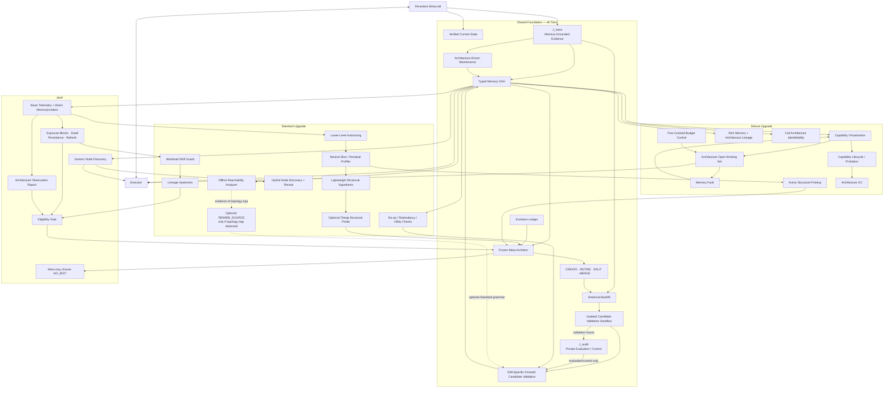

重要：图中的层级是**升级关系**，不是运行时 Ring 权限层级。

---

## 74. 模块分级总表

| 模块 | MVP | Standard | Deluxe | 当前判断 |
|---|---:|---:|---:|---|
| Memory-Grounded `J_mem` | ✓ | ✓ | ✓ | 可重解释的长期 Evidence substrate |
| Private `J_audit` Isolation | ✓ | ✓ | ✓ | 防 verifier/private ground-truth 泄漏 |
| Decision Boundary + Bounded Actuator Trace | ✓ | ✓ | ✓ | 保留 future abstraction 所需的 agent-visible 交互细节 |
| Historical CREATE Backfill | ✓ | ✓ | ✓ | late-created Node 利用 pre-creation experience |
| Verified Current State | ✓ | ✓ | ✓ | 核心基础 |
| Typed Memory DAG / IR | ✓ | ✓ | ✓ | 核心创新载体 |
| Compiler-Generated Materialization Contract | ✓ | ✓ | ✓ | 新 Node 无需人工 updater 的核心维护机制 |
| ChangeSet + DependencyIndex Maintenance | ✓ | ✓ | ✓ | 让 future evidence 自动沿当前 DAG 传播 |
| CREATE / RETIRE / SPLIT / MERGE | ✓ | ✓ | ✓ | 核心结构操作 |
| Frozen Meta-Architect | ✓ | ✓ | ✓ | 控制变量与安全边界 |
| Evolution Ledger | ✓ | ✓ | ✓ | 防止 Meta 无历史地重复决策 |
| Basic Telemetry | ✓ | ✓ | ✓ | 触发结构演化的最低观测能力 |
| Architecture Observation Report | ✓ | ✓ | ✓ | 中立、edit-agnostic 的 Meta 观测接口 |
| Direct MemoryIncident | ✓ | ✓ | ✓ | 只记录有直接证据的 memory pathology，避免 task failure 自动归因 memory |
| Evolution Eligibility Gate | ✓ | ✓ | ✓ | 防止每个窗口都强制结构进化 |
| Multi-Timescale Evolution Scheduler | ✓ | ✓ | ✓ | fast memory maintenance 与 slow structural evolution 分离 |
| ArchitectureExposure / MinimumDwell | ✓ | ✓ | ✓ | 按真实使用暴露量而非 wall-clock 判断架构年龄 |
| Multi-Block Persistence | ✓ | ✓ | ✓ | 单个短期 task cluster 不直接触发结构修改 |
| Post-Decision Refractory / Refresh | ✓ | ✓ | ✓ | NO_EDIT/rejection 后必须积累新证据才能再次调用 Meta |
| Candidate Validation Isolation | ✓ | ✓ | ✓ | fresh validation 不进入 J_mem、不推进 lifetime clock |
| Workload-Shift Guard | — | ✓ | ✓ | Standard 防短期分布切换造成误进化 |
| Lineage Hysteresis / Reversal Guard | — | ✓ | ✓ | Standard 抑制 SPLIT↔MERGE 等短周期振荡 |
| Meta `NO_EDIT` decision | ✓ | ✓ | ✓ | `NO_EDIT` 是控制决策，不是第五种 IR edit |
| Generic Node Discovery | ✓ | ✓ | ✓ | 新 Node CREATE 后必须可被 Runtime 使用 |
| Autonomous Maintenance of Created Nodes | ✓ | ✓ | ✓ | CREATE 后必须持续吸收 future evidence，而不是一次性静态 artifact |
| Edit-Specific Forward Candidate Validation | ✓ | ✓ | ✓ | CREATE/SPLIT/MERGE/RETIRE 使用不同结构成功条件 |
| Architecture complexity penalty | ✓ | ✓ | ✓ | 防 Node explosion |
| 一次只允许一个 structural edit | ✓ | ✓ | 可放宽 | MVP/Standard 强制，Deluxe 可研究 compound edit |
| Node 数量上限 | ✓ | ✓ | 可动态化 | 防开放搜索失控 |
| Physical autotuning | 简单/可选 | ✓ | ✓ | 避免参数问题误触结构进化 |
| Neutral Architecture Profiler | schema-driven | ✓ | ✓ | 避免研究者结构 hint |
| Automatic Slice Discovery | — | ✓ | ✓ | 自动发现 coherent failure slices，但不推荐 edit |
| Structural Hypothesis object | 文本字段即可 | ✓ | ✓ | 不必做 Belief DB |
| Cheap Structural Probe | — | 可选/推荐 | ✓ | 对 SPLIT/MERGE/CREATE 更可靠 |
| Node unique utility / redundancy | 粗统计 | ✓ | ✓ | 提高 RETIRE/MERGE 质量 |
| Canonical no-op detection | ✓ | ✓ | ✓ | 便宜，保留 |
| Full architecture identifiability | — | 离线分析 | ✓ | 不需要阻塞 runtime |
| Offline Edit-Grammar Reachability Analyzer | — | ✓ | ✓ | 区分 syntactic / budgeted / adoption-feasible connectivity；evaluation-only |
| `REWIRE_SOURCE` | ✗ | conditional / disabled | 可选 | 仅当 measured dependency-topology trap 存在时启用 |
| `SUBSTITUTE_NODE` | ✗ | ✗ | conditional | 仅研究 contract-preserving 1→1 replacement；不是默认能力 |
| Capability Registry | — | — | ✓ | 节点规模变大后再抽象 |
| Progressive capability disclosure | — | — | ✓ | 防 capability/tool surface 膨胀 |
| Working-Set Controller | — | 可做简单 top-k budget | ✓ | 非核心，规模大时有价值 |
| Memory Fault | — | — | ✓ | 只有 hard Working Set 存在时才有意义 |
| Capability probation / lease | — | — | ✓ | CREATE 很频繁时抑制结构膨胀 |
| Dedicated Memory Lineage Graph | — | source_refs | ✓ | MVP 使用 local source refs 即可 |
| Architecture Lineage Graph | Ledger chain | Ledger chain | 可图化 | forward-only 下不需要复杂图 DB |
| Architecture Garbage Collection | Meta RETIRE | Meta RETIRE | ✓ 自动候选 | Deluxe 自动治理 |
| Fine-grained capability security token | — | role allowlist | 可选 | 科研原型无需完整 Linux capability token |
| Resource/cost budget manager | 简单全局预算 | ✓ | ✓细粒度 | Deluxe 可 per-node/per-capability |
| Multi-edit architecture proposal | ✗ | ✗ | 可研究 | 首篇保持 edit attribution 清晰 |

---

## 75. 被删模块的重新归类

这一节专门防止后续误解：**“之前删掉”不等于“这个想法不好”。**

### 75.1 Working-Set Controller

此前删除原因：

- 会把论文重新带回 routing；
- 固定组合 classifier 与 CREATE 新 Node 不兼容；
- 对最小 self-evolution claim 不是必要条件。

当前重新归类：

\[
\boxed{Deluxe}
\]

Standard 如果出现明显 token / latency 问题，可以先加入一个**非学习型预算 Top-K Node Selector**；只有 Deluxe 才升级为 architecture-open learned set policy：

\[
score(x_t,N_i,stats_i)\rightarrow W_t
\]

它的意义是提高大规模 architecture 的运行效率，而不是定义 self-evolution。

### 75.2 Memory Fault

此前删除原因：没有 hard working set 时无意义。

当前：

\[
\boxed{Deluxe\ dependent\ feature}
\]

只有 Working-Set Controller 真正阻止某些 Node 默认加载时才加入：

\[
NeededNode\notin W_t
\Rightarrow MemoryFault
\]

因此它不单独排期。

### 75.3 Capability Registry / Capability Virtualization

此前删除原因：NodeCard 已足以让新 Node 被 zero-shot discovery，Capability 子系统会显著增加工程量。

当前：

\[
\boxed{Deluxe}
\]

当 Node 数量、Node 实现和上层 cognitive operations 开始解耦时，再从：

\[
Task\rightarrow NodeDiscovery
\]

升级为：

\[
Task\rightarrow CapabilityDiscovery\rightarrow ProviderNode
\]

Deluxe 中它解决的是**稳定认知接口与可变后端之间的虚拟化**问题。

### 75.4 Structural Hypothesis / Structural Probe

此前做减法时被大幅弱化，主要是避免形成复杂 Bayesian belief/probe engine。

当前重新区分：

- **MVP**：Meta proposal 中保留 `hypothesis` 文本字段；不做专门 belief system；
- **Standard**：加入轻量 hypothesis record 和 cheap probe，特别服务于 SPLIT / MERGE / CREATE；
- **Deluxe**：可以研究 active probe selection / information gain。

因此真正被删除的是：

\[
\cancel{Complex\ Bayesian\ Architecture\ Belief\ Engine}
\]

不是“结构假设”本身。

### 75.5 Architecture Identifiability

此前完整设计过 E0–E3 equivalence、partition distance、behavior fingerprint 等。

当前：

- MVP：Canonical normalization + complexity penalty；
- Standard：把 redundancy / unique utility / no-op evaluation 作为**离线分析和 candidate validation 指标**；
- Deluxe：若 architecture search 大幅扩展，再加入完整 functional-equivalence framework。

因此它是：

\[
\boxed{Standard\ analysis + Deluxe\ runtime}
\]

而不是完全删除。

### 75.6 Capability Probation / Lease

对少量 Node 的 MVP 没必要。

但如果 Deluxe 中 CREATE 频繁：

\[
NodeCount\uparrow
\]

则 probation / lease 可以防止一个新结构只因为短期偶然收益永久留存。

因此：

\[
\boxed{Deluxe}
\]

### 75.7 Rich Memory Lineage

MVP 只要求：

```text
source_refs
```

因为这已经能追踪 derived object 的直接来源。

Deluxe 可以进一步构造：

\[
Evidence\rightarrow Episode\rightarrow Knowledge\rightarrow Procedure
\]

的 lineage graph，用于长期 provenance、冲突解析、派生深度和高级分析。

因此：

\[
\boxed{MVP: local provenance\quad Deluxe: full lineage graph}
\]

### 75.8 Lower-Level Autotuner

这个模块值得从“被弱化”恢复到 **Standard 高优先级**。

原因：如果一个 stale/noise/cost 问题仅通过 threshold、TTL、top-k 等简单参数就可以解决，却让 Meta 做 SPLIT/CREATE，会造成：

\[
ParameterProblem\rightarrow FalseStructuralEvolution
\]

因此 Standard 推荐加入非常小的：

\[
Detect\rightarrow Tune\rightarrow IfResidualThenMeta
\]

不需要复杂 AutoML；几个 deterministic / bandit-style 参数调节器已经足够。

### 75.9 Node-Local Multi-Resolution Retrieval — v0.19 Standard 高优先级控制项

MemGAS 提醒我们：retrieval failure 可能不是 Node 的语义边界错误，而只是同一 Memory abstraction 的表示分辨率不合适。

因此 Standard 新增一个**不属于 Architecture Grammar**的控制层：

\[
\boxed{
MemoryNodeSpec
eq ResolutionView
}
\]

对于同一个 Node `N`，Runtime 可以提供若干受限 resolution views：

```text
N.base          # canonical materialized node representation
N.fine          # detail-preserving retrieval view
N.grouped       # mechanically grouped retrieval view
N.compressed    # bounded compressed retrieval view
```

这些 view 必须满足：

1. 不拥有独立 Node ID；
2. 不产生独立 NodeCard；
3. 不进入 Architecture DAG 的 source topology；
4. 不允许作为其他 Memory Node 的 persistent source；
5. 不允许 Meta `CREATE / SPLIT / MERGE / RETIRE` 它们；
6. provenance 必须回指同一 canonical Node / `J_mem` evidence；
7. 只改变 retrieval resolution，不改变长期 semantic responsibility。

因此：

\[
\boxed{
SPLIT
eq FineGraining\qquad MERGE
eq Coarsening
}
\]

Standard 的 query path 可扩展为：

```text
MEMORY_ASK(intent)
    -> NodeDiscovery                 # Which semantic memory?
    -> ResolutionSelection           # At what representation resolution?
    -> Retrieval
    -> ContextCompiler
```

MemGAS 的 entropy router 可作为 **Standard baseline**，但不直接成为本项目默认机制；Minecraft 不预设 `session / turn / summary / keyword` 四种 conversational granularity。

---

## 76. 明确不重新加入的机制

以下机制不是“没时间所以放 Deluxe”，而是当前研究边界已经明确排除。

### 76.1 Runtime Rollback

\[
\boxed{OUT\ OF\ SCOPE}
\]

采用：

\[
Candidate\rightarrow Validate\rightarrow OneWayAdopt
\]

后续问题继续：

\[
A_k\rightarrow A_{k+1}
\]

forward repair，不回旧版本。

### 76.2 Historical Replay / Counterfactual Replay

\[
\boxed{OUT\ OF\ SCOPE}
\]

理论分析价值存在，但会引入大量 checkpoint、determinism、branching 和 experiment infrastructure，且不是 self-evolving memory 成立条件。

论文消融通过独立 controlled runs 完成，不把 counterfactual engine 做成 Agent runtime。

### 76.3 Arbitrary Code Generation inside Memory IR

\[
\boxed{OUT\ OF\ SCOPE}
\]

Meta 不生成：

```text
Python / SQL / arbitrary callback / arbitrary tool code
```

只能操作 declarative Typed Memory IR 和 trusted transforms。

否则研究会退化为 general harness self-programming。

### 76.4 Meta-Architect Self-Modification

\[
\boxed{OUT\ OF\ SCOPE}
\]

Meta model、核心 prompt、acceptance policy、IR verifier、metrics、validation sampler 在一条 lifetime 内冻结。

本研究只让：

\[
LongTermMemoryArchitecture
\]

自进化，而不是让整个 evolution algorithm 自进化。

### 76.5 Planner / Executor / Verifier Architecture Evolution

\[
\boxed{OUT\ OF\ SCOPE}
\]

Action interface 和 cognitive harness 尽量固定，确保主要自变量是 Memory Architecture。

### 76.6 Irreducible Learned Memory State 作为第一阶段演化对象

第一篇工作不允许 Meta 自己 CREATE/merge LoRA、learned index model 等不可由 Evidence 重建的状态。

保持可演化对象主要是：

\[
\boxed{External\ Logical\ Memory\ Organization}
\]

以后另开工作研究 parametric memory evolution 更合适。

---

## 77. 三档版本共享的稳定扩展接口

为了避免 MVP 做完后升级 Standard/Deluxe 需要重写系统，v0.3 提前冻结下面这些**抽象接口**，但 MVP 只实现最简单版本。

### 77.1 `MemorySelector`

MVP：

\[
SemanticSimilarity(Intent,NodeCard)
\]

Standard：

\[
TypedFilter + SemanticRetrieval + SmallReranker
\]

Deluxe：

\[
CapabilityDiscovery + WorkingSetPolicy
\]

统一输出：

```text
SelectionResult[
    node_id,
    relevance,
    budget
]
```

因此 Runtime 上层接口不变。

### 77.2 `EvolutionTrigger`

MVP：简单阈值/窗口统计。

Standard：

\[
LowerLevelFixFailed + PersistentStructuralSymptom
\]

Deluxe：多源 residual + active diagnosis。

统一输出：

```text
ArchitectureObservationReport
```

Meta-Architect 永远只消费这个抽象。

### 77.3 `CandidateEvaluator`

MVP：fresh normal task validation。

Standard：加入 target-metric、complexity、unique utility、regression dimensions。

Deluxe：加入 richer structural generality / capability adoption / long-duration validation。

统一输出：

```text
CandidateEvaluationReport
```

### 77.4 `ProvenanceProvider`

MVP：直接 `source_refs`。

Deluxe：full lineage graph。

上层对象仍然使用统一 provenance interface。

### 77.5 `BudgetPolicy`

MVP：全局 token / top-k 上限。

Standard：per-query dynamic budget。

Deluxe：per-node / per-capability / exploration budget。

这样升级效率模块不会改变 IR 核心语义。

---

## 78. 分层开发与论文策略

### 78.1 如果时间非常紧：只完成 MVP

必须完成：

1. 4-node Seed；
2. Typed Memory DAG；
3. Canonical Evidence；
4. generic Node Discovery；
5. basic telemetry + direct MemoryIncident；
6. Architecture Observation Report + Evolution Eligibility Gate；
7. Frozen Meta-Architect + `NO_EDIT`；
8. CREATE / RETIRE / SPLIT / MERGE；
9. IR verifier；
10. candidate materialization；
11. edit-specific forward prospective validation；
12. architecture evolution trajectory；
13. FixedSeed / FixedExpert / SelfEvolve + 核心 edit ablations。

MVP 必须能独立回答：

> **Agent 是否真的能从合理的人类 seed 出发，自己形成不同的长期 Memory Architecture，并在正常 persistent Minecraft lifetime 中获得收益？**

### 78.2 时间正常：目标 Standard

在 MVP 之上优先加：

1. Physical Autotuner / Lower-Level-Tuning-First；
2. Neutral Architecture Profiler + Automatic Slice Discovery；
3. stronger memory/non-memory attribution + lower-level residual reporting；
4. cheap prospective structural probes；
5. node unique utility / redundancy；
6. hybrid Node Discovery；
7. richer evolution metrics（含 NoEditRate / RealizedTargetEffectRate / EvolutionInterval）；
8. stronger architecture complexity / no-op analysis；
9. NeutralProfiler / AggregateOnly / HandHintedUpperBound 诊断实验；
10. Eligibility / TuningFirst / Edit-Specific-Gate 消融；
11. 多个 seed 的 evolution convergence 实验。

这套最适合形成一篇方法和实验都比较完整的论文。

### 78.3 时间充足：再做 Deluxe

升级顺序建议：

\[
CapabilityVirtualization
\rightarrow
ArchitectureOpenWorkingSet
\rightarrow
MemoryFault
\rightarrow
CapabilityLifecycle
\rightarrow
RichLineage
\rightarrow
ActiveStructuralProbe
\rightarrow
ArchitectureGC
\]

而不是一次全部加入。

每增加一个 Deluxe 模块必须回答：

1. 它解决了 MVP/Standard 中哪个真实观察到的瓶颈？
2. 是否有独立 ablation？
3. 是否改善 task utility / cost / architecture quality？
4. 是否会稀释“memory architecture structural evolution”主线？

若第 4 点答案是“会”，则不加入主论文。

### 78.4 升级决策规则

模块从 backlog 晋升的条件：

\[
\boxed{
ObservedBottleneck
\land
ExpectedValue
\land
MeasurableAblation
\land
NoScopeDrift
}
\]

不要因为模块“理论漂亮”就升级。

### 78.5 三档对应的论文 claim 强度

**MVP claim**：

> Long-term memory architecture can itself be autonomously restructured through constrained structural edits.

**Standard claim**：

> Evidence-guided, constrained structural evolution improves the success–cost frontier over fixed and manually designed memory architectures.

**Deluxe claim**：

> A persistent agent can operate a scalable self-evolving memory runtime whose representations, access capabilities and runtime allocation policies jointly adapt over its lifetime.

第一篇论文不需要直接承担 Deluxe claim。

---

## 79. 三档实验范围

| 实验 | MVP | Standard | Deluxe |
|---|---:|---:|---:|
| Normal persistent Minecraft lifetime | ✓ | ✓ | ✓ |
| FixedSeed baseline | ✓ | ✓ | ✓ |
| FixedExpert baseline | ✓ | ✓ | ✓ |
| SelfEvolve | ✓ | ✓ | ✓ |
| RuleBasedEvolver | ✓ | ✓ | ✓ |
| LLM-TypeOnly | — | ✓ | ✓ |
| HandCodedRuleOracle | diagnostic | diagnostic | diagnostic |
| w/o CREATE | ✓ | ✓ | ✓ |
| w/o SPLIT/MERGE | ✓ | ✓ | ✓ |
| Architecture trajectory visualization | ✓ | ✓ | ✓ |
| StaticBuildOnly vs AutoMaintenance | ✓ | ✓ | ✓ |
| FullRecompute vs Delta/KeyedMaintenance | diagnostic | ✓ | ✓ |
| ManualUpdaterOracle | diagnostic | diagnostic | diagnostic |
| Maintenance AMR/MFL/MCE/PCUR | basic | ✓ | ✓ |
| Matched two-seed robustness | ✓ | ✓ | ✓ |
| 3–4 seed granularity/partition sweep | — | ✓ | ✓ |
| Broad valid-seed ensemble / basin analysis | — | — | ✓ |
| Functional Organization Signature / equifinality | basic | ✓ | ✓ |
| Autotuning vs structural evolution | — | ✓ | ✓ |
| Probe/no-probe ablation | — | ✓ | ✓ |
| NeutralProfiler vs AggregateOnly | ✓/diagnostic | ✓ | ✓ |
| NeutralProfiler vs HandHintedUpperBound | appendix | ✓ | ✓ |
| Single-field profile vs AutoSlice | — | ✓ | ✓ |
| Node utility / redundancy analysis | basic | ✓ | ✓ |
| Evolution proposal precision | basic | ✓ | ✓ |
| Structural convergence/divergence | diagnostic | ✓ | ✓ |
| Dynamic capability discovery | — | — | ✓ |
| Working-set efficiency | — | — | ✓ |
| Memory Fault recovery | — | — | ✓ |
| Capability adoption / probation | — | — | ✓ |
| Full lineage / long-lifetime governance | — | — | ✓ |

实验原则仍然保持：**主 benchmark 使用普通 Minecraft 行为，不依赖人为构造的异常 benchmark 才能触发 evolution。**

---

## 80. v0.3 之后的设计冻结方式

从现在开始，任何新想法先进入以下四个槽位之一：

```text
[MVP Core]
[Standard Upgrade]
[Deluxe Upgrade]
[Out of Scope]
```

不得直接把新模块塞进主架构。

每次讨论新机制时必须同时回答：

```text
1. 它解决什么真实问题？
2. 没有它 MVP claim 是否仍成立？
3. 它属于 Standard 还是 Deluxe？
4. 它需要修改哪些稳定接口？
5. 有没有独立实验可以证明其价值？
6. 会不会把研究问题从 Memory Architecture 漂移到一般 Agent/Harness Evolution？
```

这将成为后续持续优化的默认评审模板。

---

# Part XVII-A. v0.5 中立架构观测与自主结构发现协议

> **v0.5 的核心修正：Telemetry 必须足够有信息，让 Meta 能发现结构问题；但不能把正确的 SPLIT / CREATE / MERGE / RETIRE 答案提前编码进 Summary。** 这一 Part 冻结“观测中立性、结构发现责任和三档升级策略”。

---

## 80A.1 为什么 v0.4 还不够严格

v0.4 已经把三个权限分开：

\[
WhenToEvolve
\neq
WhatToEdit
\neq
WhetherToAdopt
\]

这是正确的。

但仍存在一个更隐蔽的问题：

> **即使 Telemetry 不直接输出 `SPLIT`，如果它提前把数据整理成“STATIC vs DYNAMIC”并告诉 Meta 两组 stale 差异，研究者实际上已经完成了最关键的结构发现。**

例如：

```yaml
WorldMemory:
  STATIC:
    stale_use_rate: 0.02
  DYNAMIC:
    stale_use_rate: 0.41
```

这里 Meta 真正剩下的工作几乎只剩：

```text
STATIC != DYNAMIC -> SPLIT
```

这会产生：

\[
\boxed{
ArchitectureAnswerLeakage
}
\]

因此 v0.5 的问题进一步变成：

> **系统应该告诉 Meta “发生了什么”，但不能提前告诉它“这些现象应该如何形成新的 Memory abstraction”。**

---

## 80A.2 核心原则：Profiler 不拥有 Memory ontology

Control Plane 中的 profiler 不能理解：

```text
RouteMemory
FailureMemory
StaticWorld
DynamicWorld
ResourceMemory
CombatMemory
```

这些是潜在的 Memory abstraction，应由 Meta 形成。

Profiler 只认识：

```text
node_id
field_id
field value / numeric bin
query / retrieval event
incident kind
cost
verified outcome
source/evidence overlap
intent embedding cluster
```

因此：

\[
\boxed{
Profiler\ has\ metrics,
not\ memory\ ontology.
}
\]

### 80A.2.1 信息责任边界

| 信息 | Control Plane | Meta-Architect |
|---|---:|---:|
| Node 当前 schema | 提供 | 读取 |
| 哪个类别 stale 高 | 自动统计原始类别 | 解释 |
| 哪些 unresolved intents 相似 | 自动无标签聚类 | 解释语义 |
| 两个 Node 经常共用 | 自动统计 | 判断互补/冗余 |
| “这是 Dynamic Entity” | 不生成 | 可以提出 |
| “这是 Route Need” | 不生成 | 可以提出 |
| 应该 SPLIT / CREATE / MERGE / RETIRE | 不决定 | 提案 |
| Candidate 是否接受 | 评估 | 无权决定 |

---

## 80A.3 中立性不等于“只给一个总平均数”

如果为了避免 leakage，只给：

```text
WorldMemory stale_use_rate = 0.19
```

Meta 又根本无法知道：

> 问题是否来自 Node 内某个稳定子群。

所以不能走到另一个极端：

\[
TooLittleInformation
\rightarrow
NoStructuralDiscovery
\]

v0.5 的解决办法不是隐藏信息，而是：

\[
\boxed{
Generic\ automatic\ slicing
instead\ of
researcher-defined\ semantic\ slicing
}
\]

也就是：

- 自动 profile 所有合法低基数字段；
- 自动 profile generic numeric runtime features；
- 自动抽样 incident exemplars；
- 自动聚类 unresolved intents；
- 自动计算 pairwise stats；
- **不手工指定哪一个 slice 是“正确结构边界”。**

---

## 80A.4 MVP：Schema-Driven Neutral Profiler

MVP 不需要复杂 learned detector。

只需要一个固定：

\[
\boxed{
SchemaDrivenNeutralProfiler
}
\]

### 80A.4.1 输入

```text
Current Memory IR
Memory runtime traces
Verified MemoryIncidents
Task/verified progress summary
Evolution Ledger
```

### 80A.4.2 输出

```text
Architecture Observation Report (AOR)
```

### 80A.4.3 自动 profiling 规则

对每个 Node：

```text
Node-level metrics
+ Field-level automatic profiles
+ Generic runtime-feature profiles
+ Incident exemplars
```

对 architecture：

```text
Pairwise co-use / overlap
+ Unresolved-intent clusters
+ Complexity
+ Recent evolution metadata
```

没有 edit-specific feature engineering。

### 80A.4.4 为什么增加 `CATEGORY`

v0.5 将通用 `CATEGORY` 恢复到 `FieldType`，因为：

- `TEXT` 适合语义内容；
- `CATEGORY` 适合有限离散值；
- 自动 profiling / selector 对 `CATEGORY` 更可验证；
- 它不是 Minecraft 特有类型，也不是某种结构答案。

例如：

```yaml
entity_kind: CATEGORY
```

可以是：

```text
ZOMBIE
SKELETON
CHEST
FURNACE
DROPPED_ITEM
...
```

但 Seed 不应包含：

```text
volatility: STATIC | DYNAMIC
```

因为后者已经人为定义了潜在 split ontology。

---

## 80A.5 SPLIT：Meta 必须自己发现 partition semantics

### 80A.5.1 Control Plane 能给什么

例如：

```yaml
WorldMemory:
  field_profiles:
    entity_kind:
      ZOMBIE:
        stale: 0.43
        update_count: 7.2
      SKELETON:
        stale: 0.38
        update_count: 6.4
      DROPPED_ITEM:
        stale: 0.35
        update_count: 5.8
      CHEST:
        stale: 0.04
        update_count: 0.3
      FURNACE:
        stale: 0.03
        update_count: 0.4
```

以及若干自动选取的 incident exemplars。

### 80A.5.2 Control Plane 不能给什么

禁止：

```text
slice_1_name = DYNAMIC
slice_2_name = STATIC
recommended_split_field = entity_kind
suggested_selector = entity_kind in [mob, dropped_item]
split_pressure = 0.82
```

### 80A.5.3 Meta 必须完成的 reasoning object

Meta 如果提出 SPLIT，必须自己输出：

```yaml
hypothesis: >
  Several entity kinds show repeatedly high update frequency and stale
  retrieval, while storage-like entities remain stable. They appear to
  require incompatible freshness behavior inside one current-state node.

partition:
  entity_kind IN [ZOMBIE, SKELETON, CREEPER, SPIDER, DROPPED_ITEM, ...]

matched_child:
  purpose: Store rapidly changing world entities.

remainder_child:
  purpose: Store relatively persistent world entities and landmarks.
```

也就是说：

\[
RawCategories
\rightarrow
MetaSemanticGrouping
\rightarrow
TypedSelector
\]

这个“SemanticGrouping”步骤不能被 Control Plane 代做。

### 80A.5.4 SPLIT 失败的合理情况

如果 AOR 显示 stale 高，但：

- 不同 schema categories 差异不稳定；
- incident examples 没有 coherent subgroup；
- lower-level tuning 尚未尝试；
- split predicate 无法用合法 schema field 表达；

则 Meta 应该：

```text
NO_EDIT
```

而不是硬拆。

---

## 80A.6 CREATE：Cluster 可以自动发现，但 abstraction 必须由 Meta 命名

### 80A.6.1 Control Plane 输出无标签 intent cluster

```yaml
cluster_id: UI_04
support: 17
examples:
  - "return to the mine used earlier"
  - "go back to the previous cave"
  - "find the way back to base"
avg_top_relevance: 0.54
avg_nodes_combined: 2.6
```

### 80A.6.2 禁止预先描述成

```text
route_need_cluster
navigation_memory_gap
create_route_memory_candidate
```

### 80A.6.3 Meta 自己完成 abstraction induction

Meta 可能判断：

> 这些请求共享“previously successful path between known locations”的长期结构，可以从 World + Experience 派生。

然后提出：

```text
CREATE RouteMemory
```

这才是：

\[
\boxed{
AbstractionInduction
}
\]

而不是人工 ontology expansion。

### 80A.6.4 如果 Meta 提出 `IronMemory`

Candidate complexity / fresh task validation 可以拒绝它，但 Control Plane 不应提前用人工语义规则禁止所有 item-specific node。

原因是：

> 我们希望通过 generality / utility 选择掉坏 abstraction，而不是把研究者对“好 Memory 类型”的全部先验直接写进规则。

MVP 仍可保留：

- Node count upper bound；
- architecture complexity penalty；
- trusted transform restriction；

这些是结构复杂度约束，不是 ontology hint。

---

## 80A.7 MERGE：Profiler 只给关系事实，不给“冗余”结论

Control Plane 可以提供：

```yaml
pair:
  node_a: KnowledgeMemory
  node_b: ProcedureMemory
  co_select_rate: 0.61
  result_overlap: 0.08
  source_overlap: 0.32
```

如果：

```text
co_select high
result_overlap low
```

Meta 应该有机会判断：

> 两者可能互补，而不是冗余。

如果另一个 pair 出现：

```text
co_select high
result_overlap high
schema compatible
maintenance cost high
```

Meta 才可能提出 MERGE。

因此禁止：

```text
is_redundant = true
merge_score
```

MVP 仍保持：

> MERGE 主要用于撤销此前过度 SPLIT 出来的 compatible sibling nodes。

这让第一版 attribution 更容易。

---

## 80A.8 RETIRE：低 usage 只是观测，不是结论

Control Plane 可以输出：

```text
select_count
unique_success_proxy
avg_query_cost
storage cost
number of downstream dependents
```

但不能输出：

```text
retire_candidate = true
```

一个低频 Node 可能：

- 很少用，但关键；
- 是某个 rare survival task 的唯一信息源；
- 是下游 derived node 的必要 source。

Meta 必须结合：

- low use；
- low unique value；
- dependency；
- maintenance cost；
- relevant ledger history；

自己提出 RETIRE hypothesis。

---

## 80A.9 Incident exemplar 的自动选择

人工挑三个“最像正确答案”的 case 同样会 leakage。

MVP 因此使用固定策略：

\[
Exemplars=
HighSeverity
\cup
EmbeddingDiverse
\cup
SeededTieBreak
\]

例如每个：

```text
node x incident_kind
```

最多返回 3–5 个案例。

研究者不在运行时选择：

> “把这几个 Zombie case 给 Meta 看。”

整个采样策略在 experiment configuration 中冻结。

---

## 80A.10 Validation 必须与 Observation 隔离

这是防止另一个形式的 leakage。

Meta 的 AOR 来自 lifetime observation window：

\[
D_{observe}
\]

Candidate adoption 使用新的 validation tasks：

\[
D_{validate}
\]

要求：

\[
\boxed{
D_{observe}\cap D_{validate}=\varnothing
}
\]

在实现意义上不一定是严格 dataset ID 集合，而是：

- candidate 不能读取 validation result 后再改同一个 proposal；
- validation task sampler 不向 Meta 暴露；
- AOR 不包含未来 candidate validation metrics；
- validation 用 fresh task episodes / seeds / instances。

因此：

\[
DiagnosisEvidence
\neq
SelectionEvidence
\]

---

## 80A.11 Standard：Automatic Slice Discovery，但仍然不能推荐 Edit

MVP 的单字段 profiling 可能无法发现：

```text
field A = x AND field B = y
```

这种多维 failure slice。

Standard 可以增加：

\[
\boxed{
AutomaticSliceDiscovery
}
\]

其思想可借鉴 error slice discovery：从高维运行样本中自动发现**表现显著偏差且内部 coherent 的 subset**，而不是人工提前定义 subgroup。

例如 Standard 输出：

```yaml
slice_id: SL_12
predicate_candidate:
  - entity_kind IN [ZOMBIE, SKELETON, CREEPER]
  - record_age_bin >= Q3
support: 83
metric_delta:
  stale_use_rate: +0.31
examples:
  - INC_091
  - INC_188
```

但不输出：

```text
semantic_name: DynamicWorld
recommended_edit: SPLIT
```

Meta 仍然负责判断：

- 这个 slice 是结构问题还是 parameter problem；
- 是否应该 SPLIT；
- child abstraction 应叫什么；
- split 的长期职责是什么。

Standard 的 slice discovery 可参考 Domino 一类自动 error-slice discovery 思路：其研究目标就是从未预先标注的高维样本中发现表现较差且 coherent 的 slices。这里借的是“自动发现 slice，而非人工指定 slice”的方法论，不直接照搬其模型。

### 80A.11.1 Standard 还增加 Lower-Level Residual

Standard AOR 可以附带：

```text
parameter adjustment attempted
before metric
after metric
residual metric
```

但仍不写：

```text
root_cause = structural
```

这一步让 Meta自己判断：

\[
ParameterFixFailed
\not\Rightarrow
SpecificStructuralEdit
\]

---

## 80A.12 Deluxe：Interactive Architecture Observability

Deluxe 不再只给一次静态 AOR，而允许 Meta 在固定预算内请求更多观测。

统一 API：

```text
PROFILE
GET_INCIDENT_EXAMPLES
GET_PAIR_STATS
GET_INTENT_CLUSTER
REQUEST_STRUCTURAL_PROBE
```

核心仍然是：

\[
\boxed{
Meta\ chooses\ what\ evidence\ to\ inspect;
TrustedService\ computes\ it.
}
\]

而不是：

```text
Meta writes analysis code
```

Deluxe 可以进一步增加：

- multi-dimensional slice discovery；
- active probe selection；
- node/capability utility trend；
- full architecture identifiability；
- capability-level observability；
- budgeted exploratory diagnostics。

但 Control Plane 依然不拥有 editable Memory ontology。

---

## 80A.13 三档观测机制总表

| 机制 | MVP | Standard | Deluxe |
|---|---:|---:|---:|
| Node aggregate metrics | ✓ | ✓ | ✓ |
| MemoryIncident | ✓ | ✓ | ✓ |
| Schema-driven single-field profile | ✓ | ✓ | ✓ |
| Generic runtime-feature profile | ✓ | ✓ | ✓ |
| Automatic incident exemplar sampling | ✓ | ✓ | ✓ |
| Unlabeled unresolved-intent clustering | ✓ | ✓ | ✓ |
| Pairwise co-use / result overlap | ✓ | ✓ | ✓ |
| Human structural labels | ✗ | ✗ | ✗ |
| Edit recommendation from profiler | ✗ | ✗ | ✗ |
| Lower-level tuning residual | optional | ✓ | ✓ |
| Automatic multi-field slice discovery | — | ✓ | ✓ |
| Slice semantic naming | Meta | Meta | Meta |
| Cheap structural probe | — | optional/✓ | ✓ |
| Interactive evidence request | — | limited | ✓ |
| Active probe selection | — | — | ✓ |
| Full capability observability | — | — | ✓ |

---

## 80A.14 新的 Meta 自主性实验

v0.5 增加一组专门用于回答 reviewer 质疑的实验。

### 80A.14.1 `AggregateOnly`

Meta 只看到 Node 总体指标，不看 field profile / exemplar / intent cluster。

目的：

> 判断完全粗粒度观测是否不足以支撑结构发现。

### 80A.14.2 `NeutralProfiler` — Ours

使用 v0.5 AOR：

- schema-driven profiles；
- automatic exemplars；
- unlabeled clusters；
- generic pair stats。

这是主方法。

### 80A.14.3 `HandHintedUpperBound` — 仅诊断性上界

仅作为 appendix / diagnostic upper bound，可以人工给类似：

```text
STATIC vs DYNAMIC
ROUTE-like demand
```

观察如果明确 hint 后 Meta 提案成功率能提高多少。

如果：

\[
NeutralProfiler
\approx
HandHintedUpperBound
\]

说明 Meta 能从中立 telemetry 中有效形成结构 abstraction。

如果差距极大，则说明当前“self-discovery”仍依赖过强人工提示。

这个 upper bound **绝不作为正式运行系统的一部分**。

### 80A.14.4 Standard `AutoSlice vs SingleField`

比较：

```text
MVP single-field profiling
vs
Standard automatic slice discovery
```

判断更高级的自动 slice mining 是否确实提升：

- useful edit proposal rate；
- realized target effect；
- fewer NO_EDIT caused by insufficient evidence；

而不是只增加复杂度。

---

## 80A.15 新的诊断质量指标

### Human Structural Hint Count

\[
\boxed{
HSHC=0
}
\]

主系统应 by construction 为 0。

### Evidence-Grounded Proposal Rate

\[
EGPR=
\frac{\#\ proposals\ with\ valid\ AOR\ evidence\ refs}
{\#\ all\ proposals}
\]

目标接近：

\[
1
\]

### Realized Target Effect Rate

延续 v0.4：

\[
RTER=
\frac{\#\ accepted\ edits\ whose\ declared\ target\ effect\ materialized}
{\#\ accepted\ edits}
\]

### Neutral-to-Hinted Gap

诊断实验：

\[
NHG=
Utility_{hinted}-Utility_{neutral}
\]

或用 proposal quality / realized effect 衡量。

它不作为主优化目标，只用于测量系统对人工 hint 的依赖程度。

---

## 80A.16 对 Seed Architecture 的直接修改

v0.5 明确修正 v0.2 Seed 中一个可能的 leakage field。

旧：

```yaml
- {name: volatility, type: TEXT, required: true}
```

删除。

新：

```yaml
- {name: entity_kind, type: CATEGORY, required: true}
```

原因：

- `entity_kind` 是正常 world representation 需要的信息；
- `volatility` 很容易直接编码未来 Static/Dynamic split；
- update frequency / age 等变化性应该由 runtime trace 自动统计，而不是作为预设 semantic label。

因此 v0.5 Seed WorldMemory 更像：

```yaml
schema:
  - {name: entity, type: ENTITY, required: true}
  - {name: entity_kind, type: CATEGORY, required: true}
  - {name: position, type: POSITION, required: false}
  - {name: state_text, type: TEXT, required: true}
  - {name: observed_at, type: TIME, required: true}
```

---

## 80A.17 对 SPLIT DSL 示例的修改

旧示例：

```text
volatility == STATIC
```

从 v0.5 起不再作为规范示例，因为它暗示 Seed 已经存在结构答案。

新的 post-discovery 示例：

```yaml
partition:
  all_of:
    - field: entity_kind
      op: IN
      value: [ZOMBIE, SKELETON, CREEPER, SPIDER, DROPPED_ITEM]
```

注意：

> 这些类别被组合到同一 child，是 Meta 根据 AOR 归纳出来的结果；Profiler 只分别提供原始类别统计。

---

## 80A.18 与已有 self-evolution 工作的关系

EvolveMem 的公开方法强调从 per-question failure logs 中做 root-cause diagnosis，再调整结构化 retrieval configuration；HSI 则明确指出 self-improvement 受 feedback fidelity 限制；AutoMem 使用完整 trajectory 让强模型修改 memory scaffold。

这些工作共同提示：

\[
\boxed{
EvolutionQuality\ is\ bounded\ by\ FeedbackQuality
}
\]

但我们的进一步要求是：

> **Feedback 既不能太弱，也不能把结构答案硬编码进去。**

因此 v0.5 把 feedback design 本身当成方法边界：

\[
\boxed{
Informative\ but\ EditAgnostic\ Observability
}
\]

Standard 引入 automatic slice discovery 的灵感则来自 error-slice discovery：自动找到 systematic underperforming subsets，比人工提前定义 failure groups 更符合我们希望的 autonomous structure discovery。

---

## 80A.19 v0.5 观测—推理边界图

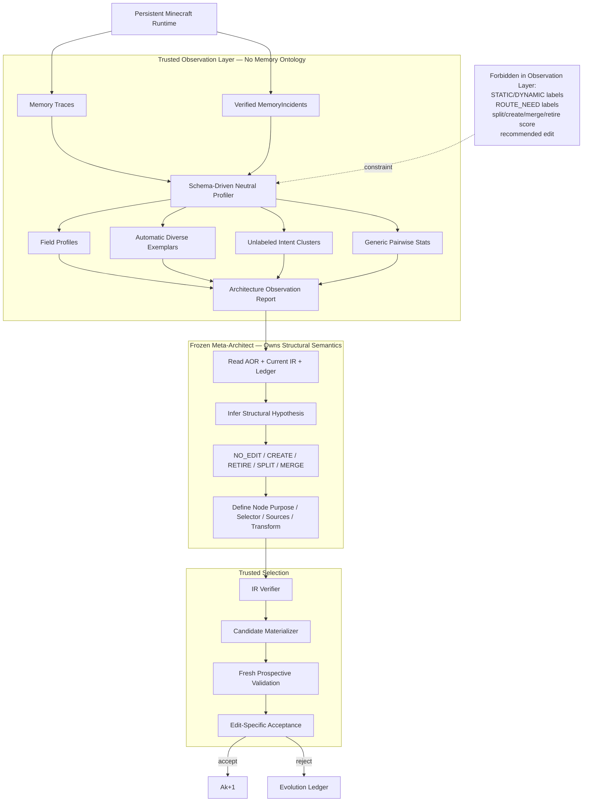

---

## 80A.20 v0.5 最终冻结原则

从这一版开始，任何新增 Telemetry / Summary feature 都必须回答：

```text
1. 这个 feature 是否本来就存在于 IR / runtime / verifier？
2. 是否对所有 Node / tasks 使用同一自动规则计算？
3. 它是否只描述观察，而没有暗示某种 edit？
4. 如果删除 feature 名称里的语义词，数值本身仍然成立吗？
5. 它是否会把我们预期的最终 Memory ontology 提前编码进去？
6. validation 是否使用与 observation 隔离的新任务？
```

只有全部通过，才能进入主 AOR。

核心总结：

\[
\boxed{
Do\ not\ teach\ the\ agent\ the\ target\ memory\ ontology
through\ telemetry.
}
\]

我们希望最终能够说：

> **The Meta-Architect was given architecture-agnostic runtime evidence, not researcher-authored structural labels, and had to induce the new memory abstraction itself.**

---

## Iteration 24 — 从固定 Helper 模板升级为 Closed-Primitive / Open-Composition MTIR（v0.7）

### 原方案

v0.2–v0.6 的 Node transform 由四个固定 high-level helper 表达：

```text
EXTRACT / SUMMARIZE / AGGREGATE / PROCEDURALIZE
```

该设计保证可验证性，但随着 v0.6 把 CREATE 定位为 open-ended semantic architecture synthesis，出现新的内部矛盾：**如果 semantic transform 本身也是研究者提前定义的四个模板，那么 Meta 所谓的“新 abstraction”仍可能只是在固定 helper space 内搜索。**

### 修改

v0.7 做出以下调整：

1. 引入 `Memory Transform IR (MTIR)`；
2. 固定底层 `OperatorKind`，但允许 Meta 组合 bounded TransformPlan；
3. 将 operator 分为 deterministic structural algebra 与 bounded semantic operators；
4. `SEMANTIC_MAP / SEMANTIC_REDUCE / SEMANTIC_COMPOSE` 允许 Meta 写 semantic objective，但由固定、无工具的 Trusted Semantic Executor 执行；
5. 四个旧 helper 降级成 macro，而非唯一 primitive；
6. 增加 `SCALAR / OPTIONAL / LIST / SET` 类型构造器；
7. 删除 `PROCEDURE` 这一高层人工 primitive，改用 `LIST[ACTION]`；
8. 明确 Verifier 只证明 type/effect/budget safety，semantic usefulness 由 Candidate Evaluation 负责；
9. 新增 `FixedMacroIR vs CompositionalMTIR` expressivity baseline 与 ANCR/STG 等指标。

### 受到什么启发

- **eBPF helper/verifier boundary**：底层执行能力可以固定且可验证，同时上层程序仍能通过组合产生大量行为；
- **relational / plan IR**：少量稳定 typed operators 可以组合成更丰富的逻辑计划；
- **v0.6 RuleBasedEvolver 结论**：既然 LLM 真正价值应体现在 semantic synthesis，就不能把所有 semantic transform 都预制成模板；
- **当前研究边界**：仍然不能允许任意 Python/SQL/tool generation，否则会漂移到一般 harness programming。

### 为什么这样改

目标不是追求“无限开放”，而是建立更准确的开放性：

\[
\boxed{
Open\ semantics\ and\ composition,\ closed\ execution\ authority
}
\]

这样既保留 CREATE 新 abstraction 的真正自由度，又保持可复现、可验证和可控搜索空间。

### 解决的问题

现在 reviewer 再问“你的 CREATE 是否只是在四个研究者定义好的 helper 中选模板”，可以直接通过设计和实验回答：

- executable operator 固定；
- node schema/source/semantic objective/transform composition 并不固定；
- `FixedMacroIR` 是显式 baseline；
- 如果 CompositionalMTIR 无收益，我们不会把额外表达能力当贡献；若有收益，则可量化证明开放 composition 的价值。


## Iteration 25 — 从“CREATE 后人工维护”风险升级为 Architecture-Driven Materialization（v0.8）

### 原问题

v0.7 已经解决“新 Memory abstraction 如何被定义”，但仍存在一个未闭合的 runtime 问题：

> Meta CREATE 新 Node 后，未来哪些 evidence 应该进入它、何时更新、如何刷新 aggregate？

如果研究者必须为每个新 Node 写：

```text
on_xxx_event -> update_new_memory
```

则系统只能自主生成静态 schema，不能自主维持长期结构；若把 event handler 本身开放给 Meta，又会重新退化为 arbitrary code generation。

### 修改

v0.8 将长期 Memory Node 明确定义为：

\[
\boxed{
Declaratively\ Maintained\ Typed\ Materialized\ View
}
\]

并冻结：

1. Canonical Evidence Journal 是唯一持久写入入口；
2. Memory Node 不提供直接 write API；
3. `NodeSpec + MTIR` 足以描述“算什么”，不再增加任意 `write_policy`；
4. Trusted Compiler 自动生成 `MaterializationContract`；
5. APPEND / CURRENT / AGGREGATE 同时承担更新语义；
6. Runtime 使用 `ChangeSet` 在 DAG 中传播 source changes；
7. deterministic operator 尽量做 delta maintenance；
8. semantic reduce/compose 对 affected key/group 做 bounded recompute；
9. CREATE Node activation 后自动订阅未来 source changes，不需要人工 updater；
10. 新增 AMR / MFL / MCE / PCUR 与 `StaticBuildOnly`、`FullRecompute` 等实验。

### 受到什么启发

- **Materialized view / incremental view maintenance**：逻辑视图由 runtime 随输入变化自动维护，而不是应用层为每个视图手写更新逻辑；
- **Apache Flink keyed state**：state 与 key/partition 对齐可以将更新限制到受影响部分；
- **Differential dataflow**：对输入变化传播差分而非始终重发整个集合；本项目只借“difference propagation”思想，不实现其复杂迭代/partial-time模型；
- **v0.7 MTIR**：既然 Node 已经有 declarative source/transform，维护语义应由同一声明自动推导，而不能在 Node 外另开隐藏代码路径。

### 为什么这样改

这次修改闭合了 self-evolving architecture 的一个重要漏洞：

\[
\boxed{
Autonomous\ Creation
+
Autonomous\ Maintenance
}
\]

如果只有前者，新 Node 只是一次性 artifact；只有两者同时成立，Architecture 才真正能够在 persistent lifetime 中继续运行。

### 明确没有重新加入的东西

v0.8 仍然不加入：

```text
runtime rollback
historical/counterfactual replay
Meta-generated event-handler code
direct LLM writes to persistent Memory Nodes
recursive/fixpoint Memory DAG
```

### 解决的问题

后续如果 Meta 自主 CREATE `RouteMemory / HazardMemory / FailureConditionMemory` 等此前不存在的 Node，只要 proposal 能通过现有 typed IR 和 MTIR contract，Runtime 就能：

```text
initial materialize
→ activate
→ consume future source deltas
→ keep the new Node maintained
```

而不需要研究者事先知道这个 ontology 并为它编写 updater。


# Part XVII-B. v0.6 Semantic Architecture Reasoning 与 Rule-Based 可替代性协议

> **v0.7 compatibility note:** 本 Part 关于 RuleBasedEvolver / semantic-load 的结论继续有效；其中出现的 `EXTRACT / AGGREGATE / PROCEDURALIZE` 等 helper 名称按 v0.7 解释为兼容 macro。公平 RuleBasedEvolver 与 Meta-Architect 在正式实验中应共享同一 `CompositionalMTIR`，除非实验明确标记为 `FixedMacroIR` expressivity ablation。

> **v0.6 的核心问题：AOR 已经完成中立统计后，哪些事情应该由 deterministic system 处理，哪些事情才真正需要 Meta-LLM？** 这一 Part 冻结 Meta-Architect 的最小语义职责，以及用于验证其必要性的公平 rule-based baseline。

---

## 80B.1 不预设“LLM 一定必要”

第一原则：

\[
\boxed{
Use\ deterministic\ mechanisms\ whenever\ the\ decision\ is\ already\ specified\ by\ measurable\ rules.
}
\]

因此本研究不声称：

```text
RETIRE must use LLM
MERGE must use LLM
SPLIT must use LLM
```

事实上：

- 一个完全无下游、长期零使用、高成本 Node 的 RETIRE 可以非常规则化；
- 一个刚刚 SPLIT 出来、后来表现高度重合的 sibling pair 的 MERGE 也可被 deterministic heuristic 近似；
- 某些单字段 metric contrast 极强的 SPLIT 也可能被统计方法发现。

如果 LLM 在这些地方没有明显优势，不构成方法失败。

真正需要验证的是：

\[
\boxed{
Can\ the\ model\ synthesize\ a\ useful\ memory\ abstraction\ that\ is\ not\ explicitly\ enumerated\ by\ the\ rules?
}
\]

---

## 80B.2 Deterministic System 与 Meta-LLM 的正式职责边界

### Deterministic / Trusted Side

负责：

```text
collect events
verify current state
profile fields
cluster unresolved intents
compute overlaps / costs / support
sample exemplars
apply lower-level tuning
check eligibility
verify IR legality
compile candidate
materialize candidate
evaluate fresh validation tasks
accept / reject
```

它拥有：

\[
\boxed{Measurement + Mechanism + Constraint + Selection}
\]

但不拥有 Memory ontology。

### Meta-Architect Side

只负责：

```text
interpret observations
form structural hypothesis
induce semantic grouping
choose NO_EDIT or structural intent
synthesize new node purpose
synthesize legal schema from primitive fields
choose source nodes
choose trusted transform
construct legal split semantics / selectors
explain expected effect with AOR evidence refs
```

它拥有：

\[
\boxed{Interpretation + Abstraction + Architectural Synthesis}
\]

### 总公式

\[
O_k = Observe(A_k,D_k)
\]

\[
\Delta A_k = Meta(A_k,O_k,L_k)
\]

其中 `Observe` 完全 deterministic；`Meta` 的输出仍受有限 IR grammar 约束；最终是否采用仍由 evaluator 决定。

---

## 80B.3 为什么“命名一个 Node”本身不算语义贡献

我们不能把：

```text
DerivedMemory_17 -> RouteMemory
```

当成 LLM 的核心能力。

真正的 abstraction synthesis 至少必须共同决定：

\[
\boxed{
N_{new}=(purpose,schema,sources,transform,access,mode)
}
\]

例如 Route-like cluster 的有意义 CREATE 需要从 observations 推出：

```text
purpose:
  reusable path between known locations

schema:
  origin
  destination
  route/procedure
  success/outcome evidence

sources:
  WorldMemory
  ExperienceMemory

transform:
  PROCEDURALIZE

access:
  SPATIAL + SEMANTIC
```

如果只换名称、而数据组织和 retrieval behavior 不变，应由 canonical/no-op 与 candidate validation 拒绝。

---

## 80B.4 Edit Semantic Load

不同 edit 对 semantic reasoning 的要求并不相同。

| Edit | 主要判断 | Semantic Load | v0.6 预期 |
|---|---|---:|---|
| `NO_EDIT` | 当前证据是否不足/非结构性 | 中 | LLM可提高保守性，但规则可近似 |
| `RETIRE` | Node 是否长期无独立价值 | 低 | 规则 baseline 应很强 |
| `MERGE` | 两个 boundary 是冗余还是互补 | 中 | 数值可筛候选，语义解释仍有价值 |
| `SPLIT` | 哪些 raw values 构成同一长期语义子群 | 中–高 | 简单 contrast 可规则化；复杂 grouping 需要语义 |
| `CREATE` | 当前缺少什么新的 reusable abstraction | **高** | Meta-LLM 核心验证点 |

因此论文不应只报告总体 edit accuracy，而要分 EditType 分析。

特别是：

\[
\boxed{
CREATE\ is\ the\ primary\ test\ of\ open\text{-}ended\ semantic\ architecture\ synthesis.
}
\]

---

## 80B.5 `RuleBasedEvolver` 的公平定义

### 80B.5.1 相同输入与相同预算

RuleBasedEvolver 与 SelfEvolve 必须共享：

```text
same AOR
same current IR
same Evolution Ledger facts
same edit grammar
same node-count bound
same complexity penalty
same one-edit-per-round rule
same candidate validation budget
same acceptance gate
```

唯一变化：

```text
Frozen Meta-LLM
        ↓
Deterministic Evolver Rules
```

### 80B.5.2 `NO_EDIT`

若无任何规则达到预注册 evidence 条件：

```text
NO_EDIT
```

### 80B.5.3 `RETIRE`

在 legal leaf nodes 中根据：

```text
low selection frequency
low unique-success proxy
low downstream dependence
high maintenance / retrieval cost
```

形成一个 deterministic score，选择最高候选。

注意 score 只用于 baseline；主系统 AOR 不输出 `retire_score` 给 Meta。

### 80B.5.4 `MERGE`

只考虑 IR-compatible sibling nodes：

```text
same/safely compatible scope
compatible schema
compatible mode / sources / transform
```

再根据：

```text
result overlap
source overlap
co-use
independent utility proxy
```

选择最高 redundancy candidate。

### 80B.5.5 `SPLIT`

RuleBasedEvolver 对所有 profiler 自动产生的合法 fields 搜索二分 partition。

对于 CATEGORY values，可把每个 value 表示成 generic metric vector：

\[
v_i=(stale_i,miss_i,cost_i,update_i,success_i,\ldots)
\]

使用固定 deterministic two-cluster / contrast rule 得到：

\[
V=V_1\cup V_2
\]

选择满足：

```text
minimum support
minimum metric separation
legal selector expressibility
```

的最高候选。

这使 RuleBasedEvolver 并不是故意做弱：对于明显的 `STATIC-like vs DYNAMIC-like` 数值分离，它有机会成功 SPLIT，即使它不知道这些语义名称。

### 80B.5.6 `CREATE`

这是规则 baseline 最难的一步。

触发条件可以来自：

```text
persistent unresolved-intent cluster
low top-node relevance
repeated multi-node retrieval/composition
sufficient support across tasks
```

但 RuleBasedEvolver **禁止**使用：

```text
route cluster -> RouteMemory
combat failures -> FailureMemory
resource requests -> ResourceMemory
```

这样的 Minecraft ontology 模板。

它只能创建 generic typed node，例如：

```yaml
purpose: >
  Store reusable information associated with unresolved intent cluster UI_04.

sources:
  - top_contributing_node_1
  - top_contributing_node_2

schema:
  - intent_signature: TEXT
  - reusable_content: TEXT
  - evidence_refs: EVIDENCE_REF

transform:
  SUMMARIZE or AGGREGATE
```

若 runtime artifact evidence 显示 cluster 明确围绕成功 action sequence，可允许固定规则选择 `PROCEDURALIZE`，但不能人工定义 route-specific schema。

这一区分正是实验要测试的：

> **generic structural templates 是否足以替代 semantic abstraction synthesis？**

---

## 80B.6 为什么不把 RuleBasedEvolver 做成“人工专家系统”作为主 baseline

如果我们写：

```python
if entity_kind in MOVING_ENTITIES:
    split DynamicWorld

if intent contains return/base/mine/cave:
    create RouteMemory
```

那么规则系统实际上拥有：

\[
HumanDesignedTargetOntology
\]

它回答的是：

> “一个提前知道 Minecraft memory design 的专家能否手工编码规则？”

而不是：

> “架构中立 observations 是否足以通过 generic rules 自主发现新结构？”

因此这种方法只能叫：

\[
\boxed{HandCodedRuleOracle}
\]

放在 diagnostic upper bound，而不是公平主 baseline。

---

## 80B.7 `LLM-TypeOnly`：隔离“选 Edit”与“设计 Edit”

Standard 增加一个非常关键的中间 baseline：

### Full Meta

\[
AOR
\rightarrow
Meta[EditType+Payload]
\rightarrow
Candidate
\]

### LLM-TypeOnly

\[
AOR
\rightarrow
Meta[EditType]
\rightarrow
DeterministicPayloadGenerator
\rightarrow
Candidate
\]

### RuleBased

\[
AOR
\rightarrow
Rules[EditType+GenericPayload]
\rightarrow
Candidate
\]

如果：

\[
FullMeta \approx LLMTypeOnly
\]

说明主要价值来自分类 edit type。

如果：

\[
FullMeta > LLMTypeOnly
\]

尤其在 CREATE / semantic SPLIT 上明显成立，才支持：

\[
\boxed{LLM\ contributes\ architecture\ synthesis,\ not\ merely\ edit\ classification.}
\]

---

## 80B.8 Semantic Architecture Synthesis 的输出约束

为了避免 LLM 的“语义能力”变成任意自由文本，Full Meta 仍必须输出：

```text
AOR evidence_refs
structural hypothesis
NO_EDIT or one EditType
legal typed payload
expected target effect
```

CREATE payload 必须显式给：

```text
purpose
scope
mode
schema
access
sources
transform
```

SPLIT 必须给：

```text
parent
legal selector
matched child purpose
remainder child purpose
```

所有内容继续经过 IR Verifier。

因此：

\[
\boxed{
Semantic\ freedom\ exists\ only\ inside\ a\ typed\ structural\ contract.
}
\]

---

## 80B.9 v0.6 新增指标

### Rule-to-Meta Utility Gap

\[
RMUG = J(A_{meta})-J(A_{rule})
\]

需要按 task family 和 EditType 分解，不能只报告总平均。

### CREATE Acceptance Rate

\[
CAR=
\frac{\#\ accepted\ CREATE}{\#\ proposed\ CREATE}
\]

### Useful Novel Abstraction Rate

对 accepted CREATE，要求：

```text
new node is actually selected/queried
claimed target symptom improves
architecture complexity increase is justified
utility survives fresh validation
```

定义：

\[
UNAR=
\frac{\#\ useful\ accepted\ novel\ nodes}
{\#\ CREATE\ proposals}
\]

MVP 不需要在线做完整 functional-equivalence analysis；canonical no-op + use/effect/complexity checks 即可。

### Semantic Synthesis Gain

Standard：

\[
SSG=J(FullMeta)-J(LLMTypeOnly)
\]

它专门测量 edit payload synthesis 的价值。

### Edit-wise Advantage

分别报告：

```text
NO_EDIT
CREATE
SPLIT
MERGE
RETIRE
```

的 proposal count、acceptance、realized target effect 和 cost。

预期不要求 Meta 在所有类型都获胜。

---

## 80B.10 三档实现策略

### MVP

保留最干净实验：

```text
AOR
├── RuleBasedEvolver baseline
└── Frozen Meta-Architect (Ours)

both -> same verifier -> same candidate evaluator
```

主论文至少比较：

```text
FixedSeed
FixedExpert
RuleBasedEvolver
SelfEvolve
SelfEvolve w/o CREATE
SelfEvolve w/o SPLIT/MERGE
```

### Standard

增加：

```text
LLM-TypeOnly
AutoSlice
Lower-Level Tuning First
RuleBased vs Meta edit-wise analysis
Multiple seed architectures
```

并重点计算 `SSG`。

### Deluxe

如果 Node / capability 数量扩大，可加入：

```text
SemanticNeedGate
cheap deterministic candidate generation
Meta rerank / synthesis only for high-semantic-load cases
active probe before high-risk semantic edits
```

最终形成真正的：

\[
\boxed{
Hybrid\ Evolver:
Mechanistic\ Fast\ Path + Semantic\ Meta\ Path
}
\]

但 Deluxe 优化不作为首篇论文前提。

---

## 80B.11 公平实验协议

为了让 RuleBased vs Meta 的比较有意义，必须冻结：

1. 完全相同的 lifetime task stream / task distribution；
2. 完全相同的 AOR schema 和 observation budget；
3. RuleBased 不能获得 Meta 看不到的 aggregate labels；
4. Meta 不能获得 RuleBased 没有的 validation metrics；
5. 同一 evolution round 最多生成一个 candidate；
6. 同一 Node / architecture complexity budget；
7. 同一 fresh candidate-validation budget；
8. 同一 Executor / verifier / retrieval backend；
9. 所有 Rule thresholds 在 evaluation 前冻结，不按 test world 人工调；
10. `HandCodedRuleOracle` 与公平 RuleBased 分开报告。

否则比较会混入额外 search budget 或 human ontology。

---

## 80B.12 正常 Minecraft 中的 **诊断解释模板**（v0.15 重分类）

以下 Case A–D **不再作为主 lifetime 的人工 curriculum blueprint**。它们有两种合法用途：

1. 如果在 Tier 1/2 architecture-blind lifetime 中自然出现，用于 post-hoc 解释 edit semantic load；
2. 在 Tier D `DIAGNOSTIC_ONLY` stress suite 中有意识复现，用于机制 sanity check。

禁止为了“确保论文里四种 edit 都出现”而把这些 case 手工排进主任务流。主实验中 edit type distribution 是 outcome，不是 quota。

### Case A — Low Semantic Load: RETIRE

某 Node 长期几乎不使用、无下游、成本持续存在。

预期：

```text
RuleBased ≈ Meta
```

这是健康结果。

### Case B — Medium Semantic Load: SPLIT

WorldMemory 中多个原始 `entity_kind` 呈现不同 freshness/update patterns。

RuleBased 可以通过 metric clustering 找 partition；Meta 则可以形成长期 coherent child purposes。

比较：

```text
partition quality
fresh validation
child discoverability
longer-term use
```

### Case C — High Semantic Load: CREATE

正常的 revisit / return / prior-successful-path requests 持续形成一个无标签 unresolved-intent cluster，同时需要 World + Experience 临时组合。

RuleBased 只能产生 generic cluster memory；Meta 有机会形成 Route-like structured abstraction。

这是 v0.6 最重要的 qualitative + quantitative case。

### Case D — Complementarity vs Redundancy: MERGE

Knowledge + Procedure 可能高 co-use 但低 result overlap；一个过度 SPLIT 的 sibling pair 可能高 overlap 且独立价值低。

RuleBased 与 Meta 都必须在相同 AOR 下区分：

```text
used together because complementary
vs
used together because redundant
```

---

## 80B.13 v0.6 架构图：同一 Observation 下直接比较 Rules 与 Meta

```mermaid
flowchart TB

    RUN["Persistent Minecraft Lifetime"]
    PROF["Neutral Profiler"]
    AOR["Architecture Observation Report<br/>same for every evolver"]

    RUN --> PROF --> AOR

    subgraph RULE["Baseline — Ontology-Free RuleBasedEvolver"]
        RNO["NO_EDIT rules"]
        RS["metric-contrast SPLIT"]
        RM["redundancy MERGE"]
        RR["low-value RETIRE"]
        RC["generic-template CREATE"]
    end

    subgraph META["Ours — Frozen Meta-Architect"]
        INT["Interpret observations"]
        ABS["Induce semantic abstraction"]
        SYN["Synthesize typed edit payload"]
        DEC["NO_EDIT / CREATE / RETIRE / SPLIT / MERGE"]
        INT --> ABS --> SYN --> DEC
    end

    AOR --> RNO
    AOR --> RS
    AOR --> RM
    AOR --> RR
    AOR --> RC
    AOR --> INT

    RNO --> RPROP["At most one Rule Candidate"]
    RS --> RPROP
    RM --> RPROP
    RR --> RPROP
    RC --> RPROP

    DEC --> MPROP["At most one Meta Candidate"]

    subgraph SHARED["Shared Trusted Pipeline"]
        VERIFY["Same IR Verifier"]
        BUILD["Same Materializer"]
        VAL["Same Fresh Validation Budget"]
        GATE["Same Edit-Specific Acceptance"]
        VERIFY --> BUILD --> VAL --> GATE
    end

    RPROP --> VERIFY
    MPROP --> VERIFY

    GATE --> RES["Compare utility, target effect,<br/>complexity and edit-wise outcomes"]
```

---

## 80B.14 v0.6 与已有工作的关系

- **EvolveMem** 的公开方法使用 LLM-powered diagnosis 读取 per-question failure logs 并提出 retrieval-configuration adjustments，说明 LLM 可承担 root-cause / architecture reasoning；但这并不自动证明 LLM 相对 generic rules 的必要性，因此 v0.6 明确加入 RuleBasedEvolver。
- **AutoMem** 使用强 LLM 回顾完整长程 trajectory 并迭代修改 memory structure，进一步支持“强模型可能在结构重组中有价值”；v0.6 将这种价值缩窄为可实验检验的 semantic synthesis，而不把所有 bookkeeping 交给模型。
- **HSI** 将 frozen LLM 用于 harness/evolver 层级改写，同时指出 self-improvement 存在 backbone capability bound。v0.6 因此预期：只有高语义负载结构设计才应该显著受 Meta backbone 能力影响；低语义负载 edit 不应浪费强模型。

我们从这些工作得到的不是“LLM 必须存在”的先验，而是一个需要实验回答的问题：

\[
\boxed{
When\ does\ semantic\ model\ capability\ add\ value\ beyond\ architecture\ statistics\ and\ fixed\ rules?
}
\]

---

## 80B.15 v0.6 最终冻结原则

1. AOR 不输出 edit recommendation；
2. deterministic system 处理所有可明确形式化的统计、约束和验证；
3. Meta-LLM 的核心贡献必须落在 semantic grouping / abstraction synthesis，而不是 thresholding；
4. 不要求 LLM 在低 semantic-load edit 上优于 rules；
5. CREATE 是检验 open-ended abstraction synthesis 的首要操作；
6. RuleBasedEvolver 是 MVP 必须 baseline；
7. RuleBased 与 Meta 必须使用相同 observation 和 validation budget；
8. Hand-coded domain ontology 只能作为 diagnostic oracle；
9. `LLM-TypeOnly` 用于区分 edit classification 与 payload synthesis；
10. 如果 Full Meta 无法稳定超过 RuleBased/TypeOnly 在高语义负载任务上的表现，就不能声称 LLM 实现了真正的 open-ended architecture synthesis。

核心总结：

\[
\boxed{
Do\ not\ use\ an\ LLM\ to\ do\ what\ rules\ can\ already\ specify.
}
\]

\[
\boxed{
Use\ the\ Meta\text{-}LLM\ where\ the\ missing\ object\ is\ the\ abstraction\ itself.
}
\]

---


# Part XVII-C. v0.7 IR Expressivity vs Verifiability：Closed Primitive, Open Semantic Composition

> **v0.7 核心问题：如果所有高层 transform/type 都是研究者预设，CREATE 是否仍只是模板搜索？** 本 Part 将开放性放在 schema、semantic objective、source composition 与 topology 上，而不是允许 Meta 生成任意 executable code。

---

## 80C.1 两种错误极端

### 极端 A：过度封闭

```text
Meta -> choose one of 4 helper templates -> choose fields -> done
```

优点是安全，缺点是容易被质疑：

> “新 Memory abstraction 的空间其实早被研究者定义完了。”

### 极端 B：过度开放

```text
Meta -> generate Python / SQL / tools / arbitrary callback
```

这又会把问题变成 general harness self-programming，并混入安全、bug、代码搜索与软件工程能力。

v0.7 选择中间区域：

\[
\boxed{
ExecutionLanguage=Closed,\qquad SemanticArchitectureSpace=Open
}
\]

---

## 80C.2 四层表达边界

```mermaid
flowchart TB
    subgraph P0["Layer 0 — Frozen Grounding Primitives"]
        TYPES["Primitive Types + Container Constructors"]
        ACCESS["Access Modes"]
        OPS["Trusted Operator Runtime"]
        EFFECT["No IO · No Tool · Bounded Effects"]
    end

    subgraph P1["Layer 1 — Meta-Composable Transform Algebra"]
        STRUCT["FILTER · PROJECT · GROUP_BY · DEDUP · UNION · AGG_STATS"]
        SEM["SEMANTIC_MAP · SEMANTIC_REDUCE · SEMANTIC_COMPOSE"]
        PLAN["Bounded TransformPlan"]
        STRUCT --> PLAN
        SEM --> PLAN
    end

    subgraph P2["Layer 2 — Open Memory Semantics"]
        PURPOSE["Meta-defined purpose"]
        SCHEMA["Meta-defined typed schema"]
        OBJ["Meta-defined semantic objective"]
        SOURCE["Meta-selected source composition"]
    end

    subgraph P3["Layer 3 — Open Logical Architecture"]
        DAG["CREATE · SPLIT · MERGE · RETIRE
Typed Memory DAG"]
    end

    P0 --> P1 --> P2 --> P3
    VER["IR Verifier"] --> P1
    VER --> P3
    EVAL["Forward Candidate Evaluator"] --> P2
    EVAL --> P3
```

关键点：**Meta 不创造机器执行 opcode，但可以创造新的认知结构。**

---

## 80C.3 什么叫“新的 Memory abstraction”

新 abstraction 不是新名字。至少应在以下维度中形成新的组合：

\[
\boxed{
AbstractionSignature(N)=
(Schema,SourcePattern,TransformPlan,Access,Mode,Purpose)
}
\]

例如 `RouteMemory` 的开放性来自：

- 新的职责语义；
- World + Experience 的 source composition；
- `POSITION, LIST[POSITION], SET[ENTITY], FLOAT` 的 schema；
- `SEMANTIC_COMPOSE` 的新 semantic objective；
- spatial + semantic access。

即便没有发明新的底层 type/opcode，它仍然是新的 memory representation。

---

## 80C.4 为什么 primitive 必须固定

固定 primitive 并不等于固定 architecture。它负责给研究建立可比较的执行语义：

```text
POSITION always means grounded coordinate
ACTION always refers to executable/recorded action
SEMANTIC_COMPOSE always runs inside the same bounded semantic executor
LIST always has the same container semantics
```

若 Meta 连这些含义都能重写，不同 architecture 之间的实验变量会变得不可控。

因此：

\[
\boxed{
StableMechanism\neq FixedMemoryOntology
}
\]

---

## 80C.5 Semantic Executor 的最小契约

`SEMANTIC_*` operator 由可信 runtime 执行。Meta 只能提供 objective/contract，不获得任意工具权限。

输入：

```text
Bounded typed records
Target output schema
Semantic objective
Optional deterministic grouping context
```

执行环境：

```text
fixed local/open-weight model or fixed configured model
structured-output only
no shell
no network
no Minecraft action
no memory writes except returned target records
fixed token / record budget
```

输出：

```text
typed candidate records + source_refs
```

这允许语义开放，同时把副作用面限制到几乎为零。

---

## 80C.6 MVP / Standard / Deluxe 表达能力

| 能力 | MVP v0.7 | Standard | Deluxe |
|---|---|---|---|
| Fixed primitive atoms | ✓ | ✓ | ✓ |
| SCALAR/OPTIONAL/LIST/SET | ✓ | ✓ | ✓ |
| RECORD / MAP compound type | — | 可加 | ✓ |
| deterministic transform algebra | ✓ | ✓ | ✓ |
| SEMANTIC_MAP / REDUCE / COMPOSE | ✓ | ✓ | ✓ |
| TransformPlan max-depth/ops | 强限制 | 放宽 | budget-driven |
| JOIN_REF / WINDOW / temporal operators | — | ✓ | ✓ |
| Meta-defined semantic objective | ✓ | ✓ | ✓ |
| arbitrary code transform | ✗ | ✗ | ✗ |
| runtime-installed new trusted operator | ✗ | admin/code upgrade | extension registry |
| Meta itself installs executable operator | ✗ | ✗ | ✗ |

Deluxe 可以有 `OperatorExtensionRegistry`，但新增 executable operator 仍是系统/admin 升级，不是 Agent 在 lifetime 内写代码。

---

## 80C.7 CREATE 成为 Transform Synthesis 的核心位置

MVP/Standard 中：

- `RETIRE`：不需要新 transform；
- `MERGE`：优先使用 compatibility + UNION/aggregate；
- `SPLIT`：优先保持 parent transform，仅改变 selector/boundary；
- `CREATE`：允许生成新的 schema + source composition + bounded TransformPlan。

因此 CREATE 仍是最高 semantic load：

\[
\boxed{
CREATE=AbstractionSynthesis+TransformSynthesis
}
\]

这和 v0.6 的“CREATE 最能证明 LLM 不是 if-else”结论一致，并进一步把该能力落实到 IR。

---

## 80C.8 防止 semantic objective 退化成隐藏代码

Meta objective 是自然语言语义契约，不是 executable language。Control Plane 强制：

```text
objective length limit
no tool declarations
no filesystem/network namespace
no code execution channel
fixed input bindings
fixed target schema
fixed output cardinality/budget
source_refs required
```

即使 objective 写得很复杂，它最多影响 helper 返回的 typed records，不能改变系统权限。

---

## 80C.9 Candidate validation 必须检查 transform 是否“真被利用”

对 CREATE，除了 v0.6 的 adoption/effect checks，再增加：

```text
TransformInvocationCount
TransformOutputValidity
TransformOutputUseRate
SourceGroundingRate
```

其中：

\[
GroundingRate=
\frac{DerivedRecordsWithValidSourceRefs}{AllDerivedRecords}

\]

必须接近 1。

如果 Meta 生成了很漂亮的 semantic objective，但没有稳定产出可利用 record，则 candidate 不应被接受。

---

## 80C.10 新增 IR Expressivity Baselines

### `FixedMacroIR`

使用 v0.6 旧式四类高层 macro：

```text
EXTRACT / SUMMARIZE / AGGREGATE / PROCEDURALIZE
```

允许同一个 Meta、AOR 和 Candidate Evaluator，但不能自定义 bounded semantic composition。

### `CompositionalMTIR` — Ours

使用 v0.7：

```text
fixed operator set + Meta-defined TransformPlan + semantic objective
```

### `HandDesignedTransformUpperBound` — diagnostic

研究者可为已知 Minecraft memory structures 写最佳 transform contract，只作为诊断上界，不作为公平主 baseline。

核心比较：

\[
\boxed{
FixedMacroIR\ vs\ CompositionalMTIR
}
\]

它回答：**开放 transform composition 是否真的带来超出模板选择的收益？**

---

## 80C.11 新增指标

### Accepted Novel Composition Rate

\[
ANCR=
\frac{AcceptedCreatesWithNovelCanonicalTransformSignature}{AcceptedCreates}

\]

其中“novel”只表示 operator/schema/source signature 没有出现在 Seed 或预定义 macro 库中，不声称等于人类意义上的绝对新概念。

### Semantic Transform Gain

\[
STG=J(CompositionalMTIR)-J(FixedMacroIR)
\]

### IR Safety Rejection Rate

记录 Meta 生成的 TransformPlan 因 type/effect/budget 违规而被 verifier 拒绝的比例。

### Transform Complexity

```text
operator_count
semantic_operator_count
max_depth
source_fan_in
```

用于验证性能收益不是单纯来自无限增加 transform 复杂度。

---

## 80C.12 Standard 推荐的 Normal Minecraft 新 abstraction 场景

不把这些结构硬编码进运行时，只作为分析期可能观察到的自然案例：

```text
RouteMemory
HazardMemory / HazardMap
ResourceYieldMemory
FailureConditionMemory
LandmarkTransitionMemory
GoalDependencyMemory
```

它们要求的 schema/source/transform 组合不同，可以测试 Meta 是否只是反复 CREATE 同一种“summary memory”。

---

## 80C.13 与系统/IR思想的关系

本设计只借用以下抽象思想，不复制具体系统：

- eBPF：程序通过有限 ISA/可信 helper 与 verifier 获得受控扩展能力；
- relational/plan IR：固定底层操作语义可以组合成更丰富逻辑计划；
- typed structured-output LLM：把开放语义放在受限输入/输出契约中，而不是赋予任意副作用。

重要的是：本项目不是把 Memory 当查询优化器，而是借这种 **fixed execution substrate + compositional logical plan** 的边界来承载 Memory Architecture evolution。

---

## 80C.14 v0.7 最终冻结原则

1. **不再把 EXTRACT/SUMMARIZE/AGGREGATE/PROCEDURALIZE 当作唯一 high-level primitive；它们降级为 macro。**
2. MVP 引入小型 compositional MTIR。
3. primitive/operator opcode 由可信 runtime 固定。
4. Meta 可以生成新的 schema、source composition、semantic objective 和 bounded TransformPlan。
5. `PROCEDURE` 从底层 primitive 中删除，使用 `LIST[ACTION]` 等组合类型表达。
6. Verifier 只保证类型/资源/副作用安全，不证明语义正确。
7. semantic utility 由 forward Candidate Evaluation 判断。
8. arbitrary Python/SQL/tool code 继续 Out of Scope。
9. `FixedMacroIR` 进入 Standard/MVP-compatible expressivity baseline。
10. CREATE 是验证开放式 abstraction + transform synthesis 的主要 edit。

---

# Part XVII-D. v0.8 Architecture-Driven Memory Maintenance：Single-Write Evidence, Declarative Materialization

> **v0.9 compatibility note:** 本 Part 中出现的 `Canonical Evidence Journal` 从 v0.9 起专指可 materialize 的 `J_mem`；private `J_audit` 不进入 DependencyIndex、ChangeSet maintenance 或任何 Memory Node source。

> **v0.8 核心问题：Meta-Architect CREATE 一个新 Memory Node 以后，未来的新 Evidence 到来时，谁决定这个 Node 应该被写入、更新、聚合或刷新？**
>
> 如果每创建一个 Node 都需要研究者再手写 `on_xxx_event -> update_new_memory()`，那么架构虽然“能被创建”，却不能被 Agent 自主维持；如果允许 Meta 直接生成事件处理代码，又会重新退化成 arbitrary harness programming。

v0.8 的答案是：

\[
\boxed{
\textbf{Single-Write Evidence Plane + Declarative Materialized Memory DAG}
}
\]

即：

\[
\boxed{
\text{Canonical Evidence Journal is writable; Memory Nodes are maintained views.}
}
\]

Memory Node 不拥有独立的任意写接口。Node 在 Logical IR 中声明 `sources + selector + TransformPlan + mode + primary_key`；Trusted Compiler 将这些逻辑语义编译成固定的 `MaterializationContract`。之后所有新 evidence 只需进入 Journal，Runtime 根据 DAG 自动传播变化。

这一设计借鉴的是数据库/streaming system 中“声明视图、运行时维护视图”的机制思想，而不是把 Memory 退化成 SQL：Materialize 的 materialized view 会随输入变化持续更新；Flink 的 keyed state 将状态与输入 key 对齐；differential dataflow 则说明“传播输入差分而不是每次重算整个集合”是通用的增量维护思想。我们的 Memory Runtime 只借这些**机制原则**，语义对象仍是 Agent 的 typed/semantic Memory Node。 

---

## 80D.1 为什么“CREATE 能定义 Node”仍然不够

v0.7 已经允许 Meta CREATE：

```text
new purpose
new schema
new sources
new TransformPlan
new semantic objective
```

但如果新 Node 只在创建时构建一次：

```text
CREATE RouteMemory
→ build from current history
→ later evidence arrives
→ RouteMemory no longer updates
```

那么它会迅速变成 stale artifact。

另一种错误做法是研究者追加：

```python
if navigation_succeeded:
    route_memory.update(...)
```

这样实际上：

\[
\boxed{
MemoryArchitectureCreation=Autonomous,
\quad
MemoryMaintenance=HumanCoded
}
\]

self-evolution 仍然是不完整的。

因此必须让：

\[
\boxed{
NodeDefinition
\Rightarrow
FutureMaintenanceSemantics
}
\]

而不是 Node CREATE 后再追加隐藏代码。

---

## 80D.2 核心原则：只有 Evidence Journal 接受持久写入

MVP 正式冻结：

\[
\boxed{
\textbf{No direct persistent write to evolvable Memory Nodes.}
}
\]

合法持久输入只有：

```text
Environment / Verifier / bounded trusted observation adapters
                     ↓
             Canonical Evidence Journal
```

然后：

```text
Journal change
→ root memory projection
→ upstream Node delta
→ downstream Node delta
→ materialized memory views
```

所以执行层不会出现：

```text
Executor -> RouteMemory.write(...)
Meta -> KnowledgeMemory.insert(...)
Planner -> ProcedureMemory.patch(...)
```

这三种都禁止。

如果 Executor 产生反思文本，它若要成为长期输入，也必须先通过一个固定的 proposal/observation channel 进入 Journal，并带明确 provenance/status；不能绕过 Journal 直接成为“真记忆”。MVP 可先不开放主动 note write，只使用环境 observation、action、outcome、verification 等已有 evidence。

核心口号：

\[
\boxed{
SingleWriteEvidence,
\quad
MultiViewMemory
}
\]

---

## 80D.3 Memory Node 是什么：长期维护的 typed materialized view

从 v0.8 开始，对 Runtime 而言：

\[
\boxed{
N_i = MaterializedView(Source_i, Transform_i, Mode_i)
}
\]

它不是一个拥有自己任意更新代码的“插件数据库”。

一个 Node 的现有 IR 已经提供：

```text
purpose
schema
primary_key
sources
selector
TransformPlan
mode
access
```

这些足以让 Compiler 推导其维护方式。

因此 v0.8 **不新增 Meta 可任意填写的 `write_policy` 字段**。

这是有意为之：

> 如果 Meta 可以自由写 `write_policy`，它事实上又获得了一种隐式 event-programming language。

正确方式是：

\[
\boxed{
LogicalNodeSpec
\xrightarrow{TrustedCompiler}
MaterializationContract
}
\]

---

## 80D.4 `MaterializationContract`：Compiler 生成，不由 Meta 编写

概念结构：

```python
@dataclass(frozen=True, slots=True)
class MaterializationContract:
    node_id: str

    # fixed for MVP
    trigger: str = "ON_SOURCE_DELTA"

    mode: MemoryMode
    key_fields: tuple[str, ...]

    # compiler-selected, not Meta-selected
    strategy: "MaintenanceStrategy"

    # bounded semantic execution
    max_semantic_input_records: int
    max_outputs_per_update: int

    # dependency/runtime metadata
    upstream_ids: tuple[str, ...]
```

MVP strategy 只有三类：

```text
APPEND_DELTA
KEYED_UPSERT
GROUP_RECOMPUTE
```

Meta 不直接选择 strategy。

Compiler 根据：

```text
MemoryMode
primary_key
TransformPlan operators
source topology
```

确定具体 maintenance strategy。

因此：

\[
\boxed{
Meta\not\to MaintenanceCode
}
\]

而是：

\[
Meta\to LogicalSemantics\to Compiler\to MaintenanceContract
\]

---

## 80D.5 三种 `MemoryMode` 终于同时定义“存储语义”和“更新语义”

### 80D.5.1 APPEND

适合：

```text
ExperienceMemory
historical observation records
failure episodes
```

语义：

\[
\boxed{
NewEligibleSource\Rightarrow NewImmutableRecord
}
\]

Runtime 不覆写旧 record。

为避免 Journal/event 重试造成重复，Compiler 生成 deterministic materialization identity，例如：

\[
record\_id
=
hash(node\_id,transform\_signature,source\_refs)
\]

因此同一 source contribution 重复到达时可以 idempotent 去重。

---

### 80D.5.2 CURRENT

适合：

```text
current entity location
current container state
current known resource state
```

要求：

\[
|primary\_key|\ge1
\]

例如：

```yaml
primary_key: [entity]
```

语义：

\[
\boxed{
NewValue(key)\Rightarrow ReplaceCurrentView(key)
}
\]

这里“replace”只发生于 materialized view：

\[
\boxed{
ReplaceCurrentMemory\neq DeleteHistoricalEvidence
}
\]

旧 evidence 仍在 Journal；CURRENT Node 只是对最新合法 source delta 的当前投影。

MVP 不做复杂 event-time/bitemporal semantics；顺序使用 trusted Journal commit sequence / runtime source ordering。该序列只用于在线维护一致性，不提供 historical replay API。

---

### 80D.5.3 AGGREGATE

适合：

```text
KnowledgeMemory
ProcedureMemory
RouteMemory
HazardMemory
resource-yield statistics
```

`primary_key` 在这里同时承担 aggregate group identity。

例如：

```yaml
RouteMemory:
  primary_key: [origin, destination]
```

则：

\[
\boxed{
NewRelevantExperience(origin,destination)
\Rightarrow
RecomputeOnlyThatGroup
}
\]

而不是重新计算整个 RouteMemory。

如果 `primary_key=()`，则表示 global aggregate；MVP 允许，但 Compiler 会施加更严格的输入上限，因为任何 source change 都可能污染整个 aggregate。

---

## 80D.6 Source subscription 不允许手写事件处理器

Root Node 可以直接依赖：

```text
SourceKind.EVIDENCE
```

并使用：

```text
event_types
+ TransformPlan中的 FILTER
```

决定哪些 Evidence 进入它的逻辑输入。

例如 ExperienceMemory 可以声明：

```yaml
sources:
  - kind: EVIDENCE
    event_types:
      - action_result
      - task_result
```

然后 TransformPlan 将这些通用 evidence 映射为 Experience schema。

新 Node 若直接从 Evidence 构建，也采用相同机制；Meta 不得到：

```text
register_event_callback()
on_navigation_success()
on_zombie_killed()
```

等 event-handler API。

对于 Derived Node：

```text
SourceKind.NODE
```

Runtime 自动订阅上游 Node 的变化。

因此 SourceSpec 同时是：

\[
\boxed{
LogicalDependency + MaintenanceSubscription
}
\]

---

## 80D.7 统一变化协议：`ChangeSet`

Journal 本身 append-only，但 materialized views 需要表达：

- 新增；
- CURRENT 替换旧值；
- aggregate 重算后旧 derived record 失效。

因此 Runtime 内部使用统一变化对象：

```python
@dataclass(frozen=True, slots=True)
class ChangeSet:
    source_id: str
    adds: tuple[MemoryRecord, ...]
    removes: tuple[MemoryRecordRef, ...]
    source_seq: int
```

注意：

```text
removes
```

表示：

> 从某个**materialized view** 中撤掉旧贡献。

它绝不等价于从 Canonical Evidence 删除历史。

CURRENT upsert 可以规范化为：

```text
REMOVE old-current
ADD new-current
```

AGGREGATE group 重算可以规范化为：

```text
REMOVE old-group-output
ADD new-group-output
```

这样所有下游 Node 都只需要理解同一种变化接口。

这种“传播差分而不是每次传播整个集合”的机制受到 incremental/differential dataflow 的启发，但 MVP 不实现复杂 partial-time / iterative differential runtime；只采用单向 acyclic Memory DAG 上的 bounded change propagation。

---

## 80D.8 在线维护主流程

```mermaid
flowchart LR
    ENV["Minecraft / Verifier"]
    J["Canonical Evidence Journal"]
    IDX["Dependency Index"]
    R["Affected Root Nodes"]
    T["Execute Typed TransformPlan"]
    M["Apply Mode Semantics"]
    D["Emit ChangeSet"]
    DOWN["Affected Downstream Nodes"]
    STORE["Materialized Memory Store"]

    ENV -->|append evidence| J
    J --> R
    IDX --> R
    R --> T --> M --> STORE
    M --> D --> DOWN
    DOWN --> T
```

运行时算法概念上为：

```text
1. append EvidenceEvent to Journal
2. identify root nodes whose SourceSpec may consume it
3. execute bounded TransformPlan
4. apply APPEND / CURRENT / AGGREGATE semantics
5. emit ChangeSet
6. use DependencyIndex to find affected downstream nodes
7. process downstream in topological order
8. stop when no new ChangeSet remains
```

因为 Logical Memory Graph 必须为 DAG：

\[
\boxed{
NoRecursiveMaintenance
}
\]

MVP 不需要 fixpoint engine。

---

## 80D.9 `DependencyIndex` 是可信 Runtime 元数据，不属于 Memory Architecture semantic surface

Compiler 根据 DAG 构造：

```text
upstream -> downstream nodes
source event types -> root nodes
node -> topological rank
```

例如：

```text
Evidence(action_result)
    ↓
ExperienceMemory
    ├──> KnowledgeMemory
    ├──> ProcedureMemory
    └──> RouteMemory
```

一次 navigation outcome 到来时，无需：

```text
scan every memory node
```

而只激活 dependency cone。

这属于 Physical/Runtime Plan，不计入 architecture identity。

---

## 80D.10 Deterministic operators 与 Semantic operators 的维护方式不同

### Deterministic chain

例如：

```text
FILTER -> PROJECT -> GROUP_BY -> AGGREGATE_STATS
```

Compiler 尽量使用：

\[
\boxed{
IncrementalDeltaMaintenance
}
\]

只更新受影响 key/group。

### `SEMANTIC_MAP`

可以对新 source delta 独立执行：

```text
new evidence batch
→ semantic map
→ typed output
```

因此通常也是 delta-local。

### `SEMANTIC_REDUCE / SEMANTIC_COMPOSE`

它们可能依赖一组历史 source records，不能假设语义输出可简单相加。

MVP 使用保守但正确的：

\[
\boxed{
AffectedGroupDirty\Rightarrow BoundedGroupRecompute
}
\]

例如 RouteMemory 的 `(base,mine)` 有新成功/失败经验：

```text
only group (base,mine) dirty
→ collect bounded supporting records
→ rerun SEMANTIC_COMPOSE
→ replace derived group record
```

而不是：

```text
re-run semantic compose over all lifetime experience
```

也不是让 Meta 编写增量 update rule。

---

## 80D.11 MVP 为什么选择“bounded group recompute”，而不是追求所有 semantic operator 真增量化

因为：

\[
SemanticCompose(X\cup\{x\})
\]

通常不能可靠地写成：

\[
SemanticCompose(X)+f(x)
\]

如果为了效率让 LLM再产生一个“增量更新函数”，就重新打开 arbitrary logic surface。

MVP 更重视：

```text
correct semantics
bounded cost
architecture autonomy
```

因此：

- deterministic operator：真正 incremental；
- semantic map：delta-local；
- semantic reduce/compose：affected-key bounded recompute。

Standard/Deluxe 再根据真实瓶颈优化 semantic maintenance。

---

## 80D.12 `primary_key` 从 schema 细节升级为维护边界

v0.8 后：

\[
\boxed{
primary\_key
=
identity\\lookup\\maintenance\ partition
}
\]

例如：

### WorldMemory

```yaml
mode: CURRENT
primary_key: [entity]
```

新 zombie state 只影响该 `entity`。

### KnowledgeMemory

```yaml
mode: AGGREGATE
primary_key: [subject, relation]
```

新经验只使相关 knowledge group dirty。

### RouteMemory

```yaml
mode: AGGREGATE
primary_key: [origin, destination]
```

新路线经验只更新对应 origin-destination pair。

因此 Meta CREATE 新 Node 时，选择 schema/primary key 本身就是 architecture design 的一部分；但具体如何执行 incremental state management 仍由 Runtime 决定。

---

## 80D.13 新 Node CREATE 后的完整生命周期

以 Meta 自主 CREATE `RouteMemory` 为例：

```mermaid
flowchart TB
    AOR["AOR: unresolved intent clusters + cross-node composition evidence"]
    META["Meta-Architect"]
    SPEC["CREATE RouteMemory<br/>schema + sources + primary_key + MTIR objective"]
    VERIFY["IR Verifier"]
    COMPILE["Compiler"]
    CONTRACT["Generated MaterializationContract"]
    BUILD["Build candidate from accumulated Canonical Evidence"]
    VAL["Fresh Prospective Validation"]
    ACT["One-Way Activate"]
    NEW["Future Evidence"]
    AUTO["Automatic DAG Maintenance"]
    ROUTE["RouteMemory stays current"]

    AOR --> META --> SPEC --> VERIFY --> COMPILE --> CONTRACT --> BUILD --> VAL
    VAL -->|accept| ACT
    NEW --> AUTO
    CONTRACT --> AUTO
    ACT --> AUTO --> ROUTE
```

最关键的是：

```text
CREATE RouteMemory
```

后没有：

```text
researcher writes RouteMemoryUpdater
```

这一步。

---

## 80D.14 Candidate 初次构建与“历史 replay”严格区分

v0.8 继续保持：

```text
NO historical replay runtime
NO counterfactual replay
NO rollback
```

但 Candidate CREATE 时必须基于 Agent **当前已经积累的 Canonical Evidence** 构建当前候选 materialization，否则新 Node 会丢失先前经验。

这称为：

\[
\boxed{
CandidateInitialMaterialization
}
\]

不是 historical replay API。

流程：

```text
current Journal head
→ build candidate DAG current state
→ fresh prospective validation
→ if accepted, build/catch candidate to latest Journal head
→ one-way activate
→ future source deltas maintain it
```

第一篇 MVP 可以简单采用：接受后从当前 Journal 重新完成一次 candidate materialization，再 atomic switch；不需要 dual-serving old/new architecture，也不需要 rollback state。

---

## 80D.15 RETIRE 后发生什么

`RETIRE_NODE` 一旦 Candidate 被接受：

```text
1. retired node disappears from current Logical DAG
2. DependencyIndex removes its subscriptions
3. future evidence no longer maintains it
4. materialized node state may be released
5. Canonical Evidence remains unchanged
6. Evolution Ledger keeps architecture transition metadata
```

所以：

\[
\boxed{
RetireMemoryView\neq ForgetEvidence
}
\]

如果 downstream 仍依赖该 Node，IR Verifier 必须在 Candidate 阶段拒绝或要求 SPLIT/MERGE macro 已完成合法 rewiring。

---

## 80D.16 Semantic output 不能成为“无来源自由写”

所有 Semantic operator 输出继续要求：

```text
structured typed output
source_refs != empty
bounded input set
bounded output count
```

Runtime 自动把实际输入 support refs 附着到输出 envelope；Meta 的 semantic objective 不能自己伪造 provenance。

MVP：

```text
record-level source_refs
schema validation
bounded semantic execution
```

Standard 建议进一步增加：

```text
field-level grounding checks
unsupported grounded-entity rejection
semantic factuality sampling
```

例如一个 `LIST[POSITION]` 路线若包含来源轨迹从未出现的 waypoint，可由 Standard `GroundingGuard` 标记/拒绝。

Deluxe 才考虑 richer lineage graph。

---

## 80D.17 Write / Maintenance 权限矩阵

| 操作 | Executor | Memory Runtime | Meta-Architect | Compiler | Journal/Verifier |
|---|---:|---:|---:|---:|---:|
| Append grounded Evidence | ✗ / proposal only | ✗ | ✗ | ✗ | ✓ |
| Direct insert into Memory Node | ✗ | ✗ | ✗ | ✗ | ✗ |
| Define Node sources/schema | ✗ | ✗ | proposal ✓ | validate/compile | ✗ |
| Define semantic objective | ✗ | ✗ | proposal ✓ | constrain | ✗ |
| Select physical maintenance strategy | ✗ | ✗ | ✗ | ✓ | ✗ |
| Apply APPEND/CURRENT/AGGREGATE update | ✗ | ✓ | ✗ | contract only | ✗ |
| Propagate ChangeSet | ✗ | ✓ | ✗ | dependency plan | ✗ |
| Modify canonical history | ✗ | ✗ | ✗ | ✗ | ✗ |

因此：

\[
\boxed{
Meta\not\to write(memory)
}

Meta 只能：

\[
\boxed{
Meta\to define(memory\ organization)
}

---

## 80D.18 MVP / Standard / Deluxe 分层

### MVP — Declarative Auto-Maintenance

必须有：

```text
Single-write Evidence Journal
compiler-generated MaterializationContract
DependencyIndex
ChangeSet propagation
APPEND_DELTA
KEYED_UPSERT
GROUP_RECOMPUTE
bounded semantic group recompute
idempotent record identity
```

目标：任何合法 CREATE Node 在 activation 后都能**无需人工 updater**继续吸收未来 evidence。

### Standard — Efficient and Grounded Maintenance

增加：

```text
operator-level incrementalization analysis
per-key dirty tracking
semantic support-set selection
GroundingGuard
field-level provenance checks
maintenance cost autotuning
staleness/freshness telemetry
```

可根据 operator algebra 自动判定：

```text
DELTA_SAFE
GROUP_RECOMPUTE_REQUIRED
FULL_RECOMPUTE_REQUIRED
```

若发现 FULL_RECOMPUTE 成本过大，可在 Candidate Evaluation 中直接形成 architecture/runtime cost penalty，而不是默默无限计算。

### Deluxe — Scalable Lifelong Materialization Runtime

可增加：

```text
shared arrangements/indexes across Nodes
incremental semantic cache
fine-grained resource scheduling
capability-aware maintenance priority
lazy vs eager materialization
cold/dormant node maintenance policies
full lineage-aware invalidation
architecture GC integration
```

但仍保持：

\[
\boxed{
Meta\not\to arbitrary\ event\ handler/code
}

---

## 80D.19 新增维护相关 Telemetry

MVP 建议加入少量直接指标：

```text
node_update_count
update_lag
maintenance_latency
maintenance_llm_calls
records_added
records_replaced
```

Standard 再加：

```text
dirty_group_size
recompute_input_size
incremental_hit_rate
maintenance_token_cost
maintenance_cost_per_evidence
stale_due_to_maintenance_lag
```

这些指标既服务 Runtime，也会进入中立 AOR，但仍不能输出：

```text
this node should split
this node should retire
```

---

## 80D.20 新增核心指标

### Autonomous Maintenance Rate (AMR)

定义所有已接受、并且未来确实出现相关 source update 的 CREATE Node：

\[
\boxed{
AMR=
\frac{N_{created\ nodes\ correctly\ maintained\ without\ manual\ updater}}
{N_{accepted\ created\ nodes\ requiring\ future\ maintenance}}
}
\]

目标：

\[
AMR\rightarrow1
\]

### Maintenance Freshness Lag (MFL)

\[
\boxed{
MFL = t_{materialized}-t_{source\ commit}
}
\]

关注平均值和 P95。

### Maintenance Cost per Evidence (MCE)

\[
\boxed{
MCE=
\frac{Total\ maintenance\ cost}
{N_{new\ evidence\ events}}
}
\]

成本可拆为：

```text
latency
token cost
semantic executor calls
CPU/storage work
```

### Post-Creation Utility Retention (PCUR)

用于检查新 Memory 不是“刚 CREATE 时有用，之后因为不会更新而逐渐失效”。

可按后续任务窗口测：

\[
PCUR(h)=
\frac{Utility(NewNode,\ after\ h\ tasks)}
{Utility(NewNode,\ initial\ post\ activation)}
\]

该指标主要用于 Standard analysis，不必作为 Runtime gate。

---

## 80D.21 新增实验 / Ablation

### `StaticBuildOnly`

Candidate CREATE 时构建新 Node，但 activation 后不自动接收 future source changes。

比较：

\[
StaticBuildOnly
\quad vs\quad
ArchitectureDrivenMaintenance
\]

如果 lifetime 足够长，预期 StaticBuildOnly 的新 Node 会逐渐 stale，能证明“CREATE + 自动持续维护”是完整 self-evolution 的必要组成。

### `FullRecompute`

语义与 Ours 相同，但每次 source change 都重算整个 affected Node。

比较：

\[
FullRecompute
\quad vs\quad
Delta/KeyedMaintenance
\]

主要测效率，不作为 self-evolution 核心 baseline。

### `ManualUpdaterOracle`（Diagnostic）

对少数人工可识别的最终 Node（例如 RouteMemory）手写专用 updater，作为维护效果诊断上界。

它不能作为公平 self-evolution baseline，因为它提前知道最终 ontology；但可以回答：

> generic declarative maintenance 与 domain-specific hand-coded updater 的性能差距有多大？

### `NoSemanticGroupRecompute`

对 `SEMANTIC_REDUCE/COMPOSE` 仅把新 record append 到旧 summary，不重新综合 group。

用于检验：对高层 Memory，仅“追加新事实”是否足够，还是需要受控的重新综合。

---

## 80D.22 维护机制与 RuleBasedEvolver 的公平性

RuleBasedEvolver 与 Meta-Architect 必须共享**同一个 Materialization Runtime**。

即：

```text
RuleBased proposal
        \
         -> Same IR Verifier
         -> Same Compiler
         -> Same MaterializationContract
         -> Same Maintenance Engine
         -> Same Candidate Evaluator
        /
Meta proposal
```

否则如果 Meta 创建的 Node 得到更强 updater，而 RuleBased Node 只能静态构建，会严重破坏 v0.6 的公平性。

所以：

\[
\boxed{
EvolverChoice\perp MaintenanceMechanism
}
\]

实验中只改变 architecture proposal source。

---

## 80D.23 维护机制不能成为新的 Memory ontology 泄漏通道

禁止研究者写：

```text
if entity moves -> DynamicWorld
if navigation succeeds -> RouteMemory
if combat fails -> FailureMemory
```

Generic Runtime 只知道：

```text
source changed
which Node declared dependency on that source
which key/group is affected
which TransformPlan must execute
```

它不知道：

```text
Route
Hazard
FailureCondition
StaticWorld
```

这些仍然属于 Meta 创建的 semantic abstraction。

因此 v0.5 的中立性原则继续成立：

\[
\boxed{
MaintenanceRuntime\ is\ ontology\ agnostic
}
\]

---

## 80D.24 与 MTIR 的接口关系

v0.7 MTIR 回答：

> 一个 Node 的内容如何由 source 计算出来？

v0.8 Materialization Contract 回答：

> source 发生变化时，Runtime 如何知道该重新计算哪一部分？

二者关系：

```mermaid
flowchart LR
    META["Meta Logical Design"]
    NODE["NodeSpec<br/>schema · sources · key · mode"]
    MTIR["TransformPlan / MTIR"]
    COMP["Trusted Compiler"]
    MC["MaterializationContract"]
    RT["Maintenance Engine"]
    VIEW["Continuously Maintained Memory View"]

    META --> NODE
    META --> MTIR
    NODE --> COMP
    MTIR --> COMP
    COMP --> MC --> RT --> VIEW
```

所以：

\[
\boxed{
MTIR=WhatToCompute,
\quad
MaterializationContract=HowToMaintainItSafely
}
\]

---

## 80D.25 源码结构影响

在现有 `memory_runtime/` 下新增：

```text
memory_runtime/
├── record.py
├── change_set.py
├── dependency_index.py
├── materialization_contract.py
├── maintenance_engine.py
├── materializer.py
├── semantic_executor.py
├── store.py
├── discovery.py
├── query.py
└── context_compiler.py
```

`memory_ir/compiler.py` 新职责：

```text
Logical NodeSpec
→ physical access plan
→ MaterializationContract
→ dependency metadata
```

新增测试：

```text
tests/materializer/
├── test_append_delta.py
├── test_current_upsert.py
├── test_aggregate_group_recompute.py
├── test_downstream_change_propagation.py
├── test_idempotent_event_processing.py
├── test_retired_node_unsubscribed.py
├── test_created_node_future_maintenance.py
└── test_semantic_group_recompute_bounds.py
```

---

## 80D.26 完整运行架构图（v0.8）

```mermaid
flowchart TB
    ENV["Persistent Minecraft"]
    VER["Environment Verifier"]
    J["Canonical Evidence Journal<br/>ONLY persistent write plane"]

    ENV --> VER --> J

    subgraph ARCH["Evolvable Logical Memory Architecture"]
        DAG["Typed Memory DAG"]
        NODE["NodeSpec<br/>purpose · schema · key · mode · sources"]
        MTIR["Bounded Compositional MTIR"]
        DAG --> NODE
        NODE --> MTIR
    end

    subgraph COMP["Trusted Compiler"]
        VERIFY["IR Verifier"]
        MPC["MaterializationContract Compiler"]
        DEP["Dependency Index"]
        VERIFY --> MPC --> DEP
    end

    ARCH --> VERIFY

    subgraph MAINT["Architecture-Driven Maintenance Runtime"]
        ROOT["Evidence / Node Source Delta"]
        TRANS["Execute TransformPlan"]
        MODE["APPEND / CURRENT / AGGREGATE Semantics"]
        CHANGE["ChangeSet add/remove"]
        DOWN["Propagate to affected downstream"]
        STORE["Materialized Memory Store"]

        ROOT --> TRANS --> MODE
        MODE --> STORE
        MODE --> CHANGE --> DOWN --> TRANS
    end

    J --> ROOT
    DEP --> ROOT
    MPC --> MODE

    subgraph USE["Generic Memory Use"]
        ASK["MEMORY_ASK"]
        DISC["Node Discovery"]
        QUERY["Query"]
        ASK --> DISC --> QUERY
    end

    DAG --> DISC
    STORE --> QUERY

    subgraph EVO["Fixed Evolution Control"]
        AOR["Neutral AOR"]
        META["Frozen Meta-Architect"]
        EDIT["NO_EDIT / CREATE / RETIRE / SPLIT / MERGE"]
        CAND["Candidate Validation"]
        AOR --> META --> EDIT --> CAND
    end

    QUERY --> AOR
    MAINT --> AOR
    EDIT --> VERIFY
    CAND -->|accept| DAG
```

---

## 80D.27 v0.8 最终冻结原则

1. **Canonical Evidence Journal 是唯一长期持久写入口。**
2. **Evolvable Memory Node 是 materialized view，不拥有任意 write callback。**
3. **NodeSpec 必须足以推导未来维护语义；CREATE 后禁止人工追加 updater。**
4. **Meta 定义逻辑结构，不定义维护代码。**
5. **Compiler 从 `mode + primary_key + sources + MTIR` 生成 MaterializationContract。**
6. **APPEND / CURRENT / AGGREGATE 同时定义数据组织和更新语义。**
7. **Runtime 使用 bounded ChangeSet 沿 DAG 单向传播；MVP 不需要 recursive/fixpoint engine。**
8. **Deterministic operators 优先增量维护；semantic reduce/compose 使用 affected-group bounded recompute。**
9. **Retiring a memory view never deletes canonical evidence。**
10. **Initial candidate materialization 不是 historical/counterfactual replay API。**
11. **RuleBasedEvolver 与 Meta-Architect 共享相同 Maintenance Runtime。**
12. **Maintenance Runtime 不理解 Route/Hazard/Static/Dynamic 等 ontology。**
13. **MVP 应达到 Autonomous Maintenance Rate 接近 1：新创建 Node 能持续吸收未来 evidence，无人工 updater。**
14. **Deluxe 可优化维护效率，但永远不恢复 Meta arbitrary event-handler/code generation。**

---

# Part XVII-E. v0.9 Future-Reinterpretable Evidence Substrate：Evidence Sufficiency vs Storage/Noise

> **v0.9 核心问题：如果未来第 100 个任务才 CREATE 一个此前从未存在的 Memory abstraction，那么系统是否仍然保留了足够的历史证据，让这个新 Node 能从过去经验中被重新构建？**
>
> v0.8 已解决“新 Node 创建后如何自动维护未来数据”；v0.9 解决它的对偶问题：**新 Node 创建时，过去的数据是否仍然可被重新解释。**

---

## 80E.1 问题定义：Architecture Openness 依赖 Evidence Openness

如果当前架构只保存它今天认为重要的摘要：

```text
Current architecture
    ↓
select what seems useful now
    ↓
semantic compression
    ↓
discard the rest
```

那么未来即使允许 Meta-Architect 创建任意新 Node，也可能没有历史原料。

例如 Agent 前 100 个任务没有 `RouteMemory`，只保存：

```text
Task succeeded.
Reached mine.
Returned to base.
```

第 101 个任务才发现：

```text
CREATE RouteMemory
```

但如果历史中的：

```text
origin
intermediate positions
navigation actions
hazards
outcome
```

已经被摘要掉，则：

\[
\boxed{
Architecture\ Expressivity\;>\;Evidence\ Recoverability
}
\]

此时 CREATE 只能面向未来，无法真正利用 lifetime 已积累经验。

因此 v0.9 增加一个基础原则：

\[
\boxed{
Future\ Architecture\ Freedom
\le
Historical\ Evidence\ Recoverability
}
\]

换句话说：

> **如果底层 Evidence 只服务于当前 ontology，那么上层 Memory Architecture 不可能真正开放式进化。**

---

## 80E.2 Evidence 不是 Memory

v0.9 正式区分：

\[
\boxed{
Evidence\ Substrate
\neq
Memory\ Organization
}
\]

### Evidence 的职责

回答：

> 当时实际发生/观察/执行了什么？

强调：

- grounded；
- provenance-preserving；
- architecture-agnostic；
- future-reinterpretable。

### Memory 的职责

回答：

> 当前 Architecture 希望如何组织、抽象、检索这些经验？

因此：

\[
Evidence
\rightarrow
A_0 Memory
\]

未来仍可：

\[
Same\ Evidence
\rightarrow
A_k Memory
\]

而不是：

\[
A_0 Memory
\rightarrow
A_k Memory
\]

必须依赖旧 architecture 的压缩结果。

---

## 80E.3 v0.9 核心原则：Semantic Compression 不能替代 Canonical Evidence

允许：

```text
lossless compression
serialization compression
content-addressed deduplication
cold storage
generic indexing
```

但 MVP 不允许：

```text
raw evidence
→ LLM summary
→ delete original grounded evidence
```

即：

\[
\boxed{
StorageCompression\neq SemanticCompression
}
\]

以及：

\[
\boxed{
DerivedSummary\not\equiv CanonicalEvidence
}
\]

`KnowledgeMemory / ProcedureMemory / RouteMemory` 中的摘要、规则、路线都可以被 RETIRE、重算或替换；但它们不能成为历史 Evidence 的唯一残留版本。

---

## 80E.4 两个 Evidence 权限通道：Memory-Grounded vs Private Audit

v0.8 的 `Canonical Evidence Journal` 仍有一个潜在风险：如果 verifier 拥有 Agent 不可见的 ground truth，而这些信息也进入可 materialize Journal，则未来 Memory 可能获得不公平的信息泄漏。

v0.9 将 Evidence Plane 逻辑拆分为：

\[
\boxed{
J=J^{mem}\oplus J^{audit}
}
\]

其中：

### `J_mem` — Memory-Grounded Evidence Journal

允许作为任何当前/未来 Memory Node 的 source。

只包含：

1. Agent 实际观察到的信息；
2. Agent 实际执行的 action / tool call；
3. action 返回给 Agent 的结果；
4. 明确允许暴露给 Agent 的 verified current-state fields；
5. Agent 可访问的 task/subgoal feedback；
6. 对上述对象的 provenance / timestamp / refs。

### `J_audit` — Private Verifier / Evaluation Journal

只供：

- benchmark scoring；
- verifier correctness；
- control-plane telemetry；
- offline diagnosis。

不得成为：

```text
SourceKind.EVIDENCE
```

的 materialization source。

因此：

\[
\boxed{
MaterializableEvidence=J^{mem}
}
\]

并且：

\[
\boxed{
J^{audit}\not\to MemoryDAG
}
\]

---

## 80E.5 Evidence Plane 权限图

```mermaid
flowchart TB
    ENV["Minecraft Environment"]
    AGENT["Executor / Agent-visible Runtime"]
    VER["Environment Verifier"]

    ENV --> OBS["Agent-visible Observation / Tool Result"]
    OBS --> AGENT

    ENV --> VER

    subgraph EP["Trusted Evidence Plane"]
        ADMIT["Mechanical Evidence Admission"]
        JMEM["J_mem<br/>Memory-Grounded Canonical Evidence"]
        JAUD["J_audit<br/>Verifier / Evaluation Private Evidence"]
        ART["Content-addressed Raw Artifact Store"]

        ADMIT --> JMEM
        ADMIT --> JAUD
        JMEM --> ART
    end

    OBS --> ADMIT
    AGENT -->|action intent / command / result refs| ADMIT
    VER -->|memory-authorized verified fields| ADMIT
    VER -->|private ground truth / scoring| JAUD

    subgraph MDAG["Current / Future Typed Memory DAG"]
        N1["Existing Nodes"]
        N2["Future CREATE Nodes"]
    end

    JMEM --> N1
    JMEM --> N2

    JAUD -. forbidden .-> BLOCK["IR / Permission Gate"]
    BLOCK -. no materialization .-> MDAG
```

核心安全不变量：

\[
\boxed{
No\ architecture\ version\ may\ gain\ observational\ privilege
through\ memory\ evolution.
}
\]

---

## 80E.6 Evidence Admission：不保存所有 game tick，也不做 ontology-driven 筛选

“保留历史证据”不等于：

```text
20/60 Hz engine tick forever
entire Minecraft world state forever
all unloaded chunks forever
```

这既昂贵，也会泄漏 Agent 没观察到的信息。

MVP 使用**mechanical interaction-boundary admission + bounded actuator/tool trace capture**，不是 semantic importance filtering。

至少记录以下边界：

```text
1. Agent decision / reasoning boundary
2. issued Minecraft action or tool call
3. action/tool completion result
4. agent-visible observation returned after action
5. memory-authorized verified state delta
6. task/subgoal feedback visible to agent
7. externally surfaced environment event delivered to agent
8. bounded actuator/tool execution trace artifact
   - fixed-rate or fixed-displacement pose samples when movement occurs
   - event-driven inventory/health/entity interaction deltas
   - executed code/tool artifact ref
```

不依赖：

```text
"route-important"
"combat-important"
"future-memory-worthy"
```

等人工 ontology。

因此 admission policy 是：

\[
\boxed{
MechanismDriven,
not\ OntologyDriven
}
\]

---

## 80E.7 Canonical `EvidenceEvent` v0.9

建议将原来的最小 EvidenceEvent 扩展为：

```python
@dataclass(frozen=True, slots=True)
class EvidenceEvent:
    event_id: str
    sequence_id: int

    timestamp: float
    episode_id: str
    task_id: str | None

    event_type: str
    source_kind: str

    # only MEMORY_GROUNDED events may feed Memory DAG
    channel: EvidenceChannel

    # compact grounded structured representation
    payload: dict

    # exact agent-visible material when preserving it is useful
    artifact_refs: tuple[str, ...] = ()

    # links to action/observation/result chains
    causal_refs: tuple[str, ...] = ()

    confidence: float = 1.0
    provenance: dict = field(default_factory=dict)
```

固定：

```python
class EvidenceChannel(StrEnum):
    MEMORY_GROUNDED = "MEMORY_GROUNDED"
    VERIFIER_PRIVATE = "VERIFIER_PRIVATE"
    CONTROL_PRIVATE = "CONTROL_PRIVATE"
```

只有：

```text
MEMORY_GROUNDED
```

可以进入 `SourceKind.EVIDENCE`。

> **v0.9 compatibility:** `SourceKind.EVIDENCE` 永远解析到 `J_mem`。IR 不提供引用 `J_audit` 的 source kind；任何 verifier/control-private record 在 source resolution 阶段直接拒绝。

---

## 80E.8 Structured Core + Raw Artifact Reference，而不是二选一

只保存 raw observation：

- 后期检索成本高；
- 重复解析昂贵；
- provenance 不够清晰。

只保存当前 schema 的 structured fields：

- 容易丢失未来 abstraction 需要的细节。

因此 v0.9 使用双层：

\[
\boxed{
EvidenceCore + ArtifactRefs
}
\]

### Evidence Core

保留通用 grounded metadata：

```text
time
episode/task id
action identity
observation identity
entity/item references
position if observed
action outcome
verified visible state delta
provenance
```

### Raw Artifact Store

保留必要的 agent-visible 原始对象，例如：

```text
serialized Mineflayer observation
full tool response
executed action/code artifact
trajectory fragment
structured inventory snapshot exposed to the agent
```

Journal 只存 content hash / artifact ref。

这样：

\[
Journal\ metadata\ stays\ compact
\]

同时：

\[
Future\ semantic\ reinterpretation\ remains\ possible
\]

---

## 80E.9 什么叫“Raw”？必须是 Agent 当时真正获得的输入

特别禁止把以下内容因为“以后可能有用”而偷偷放进 Raw Artifact：

```text
unobserved blocks
unloaded chunk state
hidden entity state
benchmark oracle plan
future task labels
private verifier ground truth
```

因此 Raw Artifact 的定义不是：

> 环境里真实存在的一切。

而是：

> **该 Agent 在当时权限下实际可获得的原始交互证据。**

形式上：

\[
\boxed{
RawArtifact_t\subseteq ObservableInformation_t
}
\]

这使 future reinterpretation 不等于 future cheating。

---

## 80E.10 Candidate 创建时的 Historical Backfill

v0.8 已定义：Candidate 从 Canonical Evidence + Candidate DAG materialize。

v0.9 把 CREATE 分成两个阶段：

### Phase A — Historical Bootstrap / Backfill

Candidate 创建时：

\[
M'_{t}
=
F_{NodeSpec}(J^{mem}_{1:t})
\]

即用 creation 之前的历史 memory-grounded evidence 构建新 Node 的初始状态。

### Phase B — Online Maintenance

激活后：

\[
J^{mem}_{t+1}
\rightarrow
\Delta
\rightarrow
M'_{t+1}
\]

由 v0.8 `MaterializationContract` 持续维护。

因此完整生命周期：

```text
CREATE proposal
→ historical backfill
→ candidate validation
→ activate
→ incremental maintenance
```

---

## 80E.11 Historical Backfill 不是 Historical Replay

必须严格区分：

\[
\boxed{
HistoricalBackfill\neq HistoricalReplay
}
\]

Backfill 做的是：

```text
read persisted evidence
→ run declarative MTIR
→ build a memory view
```

它不会：

```text
rewind Minecraft world
re-execute old actions
branch old trajectories
simulate counterfactual decisions
restore old architecture
```

因此 v0.9 **没有重新引入**此前明确排除的 replay/counterfactual infrastructure。

它只是 materialized-view construction over historical evidence。

---

## 80E.12 为什么 Future CREATE 应允许直接读取 `J_mem`

如果未来 Node 只能从当前 Memory Nodes 构建：

\[
CurrentNodes\rightarrow NewNode
\]

则当前架构中过去已经丢掉的维度无法恢复。

因此 CREATE 必须允许：

```text
SourceKind.EVIDENCE
```

作为合法 source。

即：

\[
\boxed{
FutureNode
\leftarrow
J^{mem}
}
\]

或者：

\[
FutureNode
\leftarrow
J^{mem}+ExistingNodes
\]

这也是为什么 Canonical Evidence 必须独立于任一 architecture generation。

---

## 80E.13 Evidence 的最低“未来可重解释”契约

MVP 对 `J_mem` 强制以下不变量。

### E1 — Observation Fidelity

Memory evidence 不得包含 Agent 当时不可获得的信息。

\[
J^{mem}_t\subseteq Observable_t
\]

### E2 — Architecture Independence

Evidence admission 不得依赖当前 Node ontology。

禁止：

```text
if RouteMemory exists:
    save navigation details
else:
    discard them
```

### E3 — Grounded Event Preservation

已经 admitted 的 Evidence Core 不被 semantic summary 替代。

### E4 — Provenance Preservation

任何 structured core / derived annotation 都能追到 agent-visible source/artifact。

### E5 — Future Backfill Readability

新的合法 Node 可以从 creation 之前的 `J_mem` 读取历史输入。

### E6 — Physical Compression Only at Core

MVP 允许 lossless physical compression/dedup，不允许对不可重建 core 做 lossy semantic deletion。

### E7 — Private Evidence Isolation

`J_audit` 永远不能成为 Memory DAG source。

---

## 80E.14 Evidence 粒度：MVP 的明确选择

第一篇工作不研究“全世界长期原始感知数据如何无限存储”。

MVP 冻结为：

\[
\boxed{
DecisionBoundary\ Evidence
+
Bounded\ Actuator/Tool\ Trace
}
\]

即保存与 Agent 真实交互周期对应的 observation/action/result，并对一次长 Mineflayer action/tool 调用保留机械采样或事件式的 bounded execution trace，而不是游戏内部所有 tick。

原因：

1. 它对应 Agent 实际有机会使用的信息；
2. 与 Planner/Executor decision step 对齐；
3. 比 tick-level logging 小得多；
4. 未来 Route/Failure/Hazard/Resource 等 abstraction 仍有较丰富历史原料；
5. 实验可复现。

如果 future abstraction 需要 Agent 从未观察过的信息，则它本来就不应该能够从 Memory 中恢复。

---

## 80E.15 MVP / Standard / Deluxe 的 Evidence 保留策略

### MVP — Full Decision-Boundary Grounded Evidence

保留：

```text
all admitted EvidenceCore for the experiment lifetime
agent-visible artifacts whenever the core is only a projection
bounded actuator/tool execution traces
lossless compression allowed
content hash / dedup allowed
```

不做 adaptive semantic deletion。

这是最适合第一篇论文的版本，因为优先保证：

\[
ScientificCleanliness + FutureRecoverability
\]

而不是极限 storage efficiency。

### Standard — Hot/Cold Evidence Tiering + Generic Index

增加：

```text
hot recent evidence
cold historical evidence
content-addressed artifact store
time/entity/item/action/position indexes
background lossless compaction
```

关键：

\[
Hot\rightarrow Cold
\neq
Delete
\]

Cold evidence 在 CREATE backfill 时仍然可读。

### Deluxe — Evidence Retention Optimizer

只有真正出现 lifetime storage bottleneck 后再研究：

- redundant artifact eviction；
- reconstructibility-aware retention；
- evidence value estimation；
- multi-resolution artifact storage；
- privacy-aware retention policy。

但默认仍保留：

\[
EvidenceCore
\]

不能因为当前 architecture 觉得“没用”就删除未来不可重建的 grounded evidence。

---

## 80E.16 为什么不在 MVP 做“智能 Evidence Forgetting”

这类机制理论上有价值，但与当前论文主问题存在张力。

如果 Agent 自己决定：

```text
this evidence will never matter
→ delete
```

那么未来新 abstraction 的搜索空间会受到过去 retention decisions 影响。

这会把研究问题扩展成：

\[
\boxed{
Joint\ Evolution\ of\ MemoryArchitecture\ and\ EvidenceRetentionPolicy
}
\]

这是一个独立且很大的问题。

第一篇工作不承担。

因此：

\[
\boxed{
MVP:\ Evolve\ MemoryOrganization,
not\ EvidenceExistence
}
\]

---

## 80E.17 Evidence Index 不能重新泄漏 ontology

Standard 为 backfill 效率可以建立 index，但 index 只能基于通用 grounded fields：

```text
time
episode/task id
event_type
action type
entity/item refs
position
outcome
artifact type
```

禁止建立研究者手工 ontology index：

```text
route_related = true
dynamic_world_event = true
hazard_candidate = true
future_skill_event = true
```

因此：

\[
\boxed{
EvidenceIndex\ is\ retrieval\ acceleration,
not\ semantic\ answer\ injection.
}
\]

---

## 80E.18 Derived Annotation 是否可以进入 Evidence Plane？

第一版采用保守规则：

### Grounded fields

可进入 `J_mem` core。

### LLM-generated interpretation

例如：

```text
"this looked like a dangerous corridor"
"this trajectory is probably reusable"
```

不能升级成与 grounded evidence 同等地位的 canonical fact。

如需保存，可以记录为：

```text
DERIVED_ANNOTATION
source_refs=[...]
model_id=...
```

并满足：

\[
\boxed{
DerivedAnnotation\ cannot\ replace\ GroundedSource
}
\]

MVP 新 Node 的 candidate validation 必须能追踪其关键结果到底来自 grounded evidence 还是 model-derived annotations。

---

## 80E.19 Evidence Schema 也不能成为新的固定 Memory Ontology

`EvidenceEvent.payload` 应保留机械/环境 grounding，而不是直接写：

```text
memory_type = route
memory_type = skill
memory_type = semantic_fact
```

允许：

```text
action_kind
entity_kind
item_id
position
inventory_delta
execution_status
visible observation
```

因为这些来自环境/执行接口。

所以：

\[
\boxed{
EvidenceSchema\ describes\ interactions;
MemorySchema\ describes\ abstractions.
}
\]

二者必须保持层级区别。

---

## 80E.20 Future-Reinterpretability 图

```mermaid
flowchart LR
    T0["Early Lifetime"]
    J["J_mem<br/>Architecture-independent grounded evidence"]

    A0["A0<br/>World · Experience · Knowledge · Procedure"]
    T1["Later Lifetime"]
    META["Meta discovers new abstraction"]
    CREATE["CREATE RouteMemory"]
    BF["Historical Backfill<br/>read pre-creation J_mem"]
    ROUTE["RouteMemory at creation time<br/>contains relevant old + current experience"]
    FUT["Future Evidence Deltas"]
    MAINT["v0.8 Incremental Maintenance"]

    T0 --> J
    J --> A0
    T1 --> META --> CREATE --> BF
    J --> BF --> ROUTE
    FUT --> J
    J --> MAINT --> ROUTE
```

核心意义：

> RouteMemory 不需要在 Task 1 就存在，Task 1 的 grounded evidence 仍然可以在 Task 101 被新的 architecture 重新解释。

---

## 80E.21 新增关键实验：Delayed Abstraction / Late CREATE

这是 v0.9 最重要的实验之一。

### 实验逻辑

先让 Agent 在没有目标新 Node 的情况下积累长期经验：

```text
navigation
resource gathering
combat
return-to-base
cave revisit
mixed tasks
```

经过一段 lifetime 后才允许 Meta：

```text
CREATE new abstraction
```

然后检查新 Node 是否能利用**创建之前**的历史证据。

### 对照

#### `FullGroundedEvidence` — Ours

保留完整 decision-boundary grounded evidence，可 backfill。

#### `SummaryOnlyEvidence`

历史 evidence 被当前架构的 semantic summaries 取代。

#### `RecentWindowEvidence`

只保留最近 N 个 interaction boundaries。

#### `NoHistoricalBackfill`

Evidence 仍在，但 CREATE Node 只从 creation 之后的新 evidence 开始学习。

这四组可以直接回答：

> **Future architecture evolution 是否真正依赖可重新解释的 persistent evidence substrate？**

---

## 80E.22 Historical Backfill Coverage（HBC）

对于可由 simulator / instrumentation 离线获得 relevant-event oracle 的实验任务，定义：

\[
\boxed{
HBC
=
\frac{
Relevant\ PreCreation\ Evidence\ Represented\ in\ NewNode
}{
Relevant\ PreCreation\ Observable\ Evidence
}
}
\]

注意分母只计算：

\[
ObservableEvidence
\]

而不是隐藏世界 ground truth。

例如 RouteMemory 可以离线判断创建前哪些 successful navigation episodes 与当前 route pairs 相关，再看新 Node backfill 后是否覆盖。

---

## 80E.23 Backfill Utility Gain（BFG）

定义：

\[
\boxed{
BFG
=
J(CREATE+HistoricalBackfill)
-
J(CREATE+FutureOnly)
}
\]

如果：

\[
BFG>0
\]

说明过去积累的 experience 在新 architecture 出现后真的被重新利用。

源码与论文表格建议统一使用 `backfill_utility_gain`；正文需要缩写时使用 `BFG`。

---

## 80E.24 Future Abstraction Recoverability（FAR）

定义一个更一般的结构指标：

\[
\boxed{
FAR
=
\frac{
AcceptedLateCreateNodesWithUsefulHistoricalBackfill
}{
AcceptedLateCreateNodes
}
}
\]

这里 `useful` 要求：

1. creation 前证据确实贡献了 materialized records；
2. 这些 records 在 fresh task 中被检索/使用；
3. 移除 pre-creation backfill 后 utility 可测下降或 target metric 变差。

它比单纯“Node 能不能 build”更严格。

---

## 80E.25 Evidence Storage / Efficiency 指标

同时记录成本，避免“什么都存”没有代价分析。

至少包括：

```text
EvidenceCore bytes / interaction
RawArtifact bytes / interaction
Cold-storage ratio
Backfill scan/read volume
Backfill latency
Artifact dedup ratio
```

总体可以写：

\[
C_{evidence}
=
Storage
+
BackfillIO
+
BackfillCompute
\]

但 v0.9 不把它并入核心 acceptance objective；它首先作为 system cost report。

---

## 80E.26 Evidence Sufficiency 不应由当前 Meta 自报

禁止：

```text
Meta says:
"we probably stored enough evidence"
```

Evidence sufficiency 只能通过：

- late CREATE backfill；
- observable oracle coverage；
- downstream utility；
- historical source usage；
- evidence ablation；

进行验证。

因此：

\[
\boxed{
EvidenceSufficiency\ is\ empirical,
not\ self-reported.
}
\]

---

## 80E.27 Candidate Backfill Budget

完整 lifetime 以后直接扫描全部 `J_mem` 在 MVP 可以接受，但接口应预留 budget：

```python
@dataclass(frozen=True)
class BackfillBudget:
    max_events: int | None
    max_artifact_bytes: int | None
    max_semantic_calls: int
    max_wall_time_s: float | None
```

MVP：

```text
max_events = None or large fixed experimental cap
```

优先完整 backfill。

Standard：

```text
generic evidence index
→ candidate source predicate
→ bounded historical scan
```

Deluxe 再研究 adaptive retrieval/backfill planning。

Meta 不能自己取消 budget。

---

## 80E.28 Evidence Retention 与 Node RETIRE 的关系

必须继续保持：

\[
\boxed{
RETIRE(Node)\neq Delete(Evidence)
}
\]

例如：

```text
CREATE RouteMemory
→ later RETIRE RouteMemory
```

不删除构成它的历史 navigation evidence。

以后如果又出现新的结构需求：

```text
CREATE TravelRiskMemory
```

仍然可以重新解释相同历史经验。

因此 Evidence 是 architecture lineage 之外的长期 substrate。

---

## 80E.29 Evidence 生命周期与 Architecture 生命周期

```mermaid
flowchart TB
    E1["Grounded Evidence e1"]
    E2["Grounded Evidence e2"]
    E3["Grounded Evidence e3"]

    J["Persistent J_mem"]

    A0["Architecture A0"]
    A1["Architecture A1"]
    A2["Architecture A2"]

    M0["Materialization under A0"]
    M1["Materialization under A1"]
    M2["Materialization under A2"]

    E1 --> J
    E2 --> J
    E3 --> J

    J --> M0
    J --> M1
    J --> M2

    A0 --> M0
    A1 --> M1
    A2 --> M2

    A0 --> A1 --> A2
```

注意：

```text
A0 materialization
```

可以被释放；

但：

```text
J_mem
```

不随着 A0 RETIRE 而消失。

---

## 80E.30 Evidence Substrate 与 v0.8 Maintenance 的完整闭环

v0.8 解决未来：

\[
NewEvidence\rightarrow ExistingNewNode
\]

v0.9 解决过去：

\[
OldEvidence\rightarrow NewlyCreatedNode
\]

二者结合：

\[
\boxed{
PastBackfill
+
FutureIncrementalMaintenance
=
PersistentNewMemoryStructure
}
\]

完整链路：

```text
Past grounded evidence accumulates
        ↓
Meta later discovers a new abstraction
        ↓
CREATE NodeSpec + MTIR
        ↓
Historical Backfill from J_mem
        ↓
Prospective Candidate Validation
        ↓
One-way activation
        ↓
Future ChangeSet maintenance
```

这样 self-evolving architecture 才真正跨越 Node creation time。

---

## 80E.31 MVP / Standard / Deluxe 模块归类更新

| Evidence 模块 | MVP | Standard | Deluxe | 判断 |
|---|---:|---:|---:|---|
| Memory-grounded `J_mem` | ✓ | ✓ | ✓ | 核心 substrate |
| Private `J_audit` 隔离 | ✓ | ✓ | ✓ | 防 hidden-state leakage |
| Decision-boundary admission | ✓ | ✓ | ✓ | MVP 粒度 |
| EvidenceCore | ✓ | ✓ | ✓ | 永久 grounded core |
| Raw Artifact Refs | ✓ | ✓ | ✓ | future reinterpretability |
| Lossless compression | ✓ | ✓ | ✓ | 纯物理优化 |
| Historical CREATE backfill | ✓ | ✓ | ✓ | 开放式未来 CREATE 必需 |
| Generic evidence index | 简单/无 | ✓ | ✓ | backfill 加速 |
| Hot/cold storage | — | ✓ | ✓ | lifetime scale |
| Adaptive artifact retention | — | — | 可研究 | 不阻塞首篇 |
| Semantic evidence forgetting | ✗ | ✗ | 独立研究问题 | 当前不做 |
| Verifier-private evidence as Memory source | ✗ | ✗ | ✗ | 永久禁止 |

---

## 80E.32 源码规划更新

新增：

```text
evidence/
├── event.py
├── channel.py
├── admission.py
├── journal.py
├── artifact_store.py
├── provenance.py
└── evidence_index.py          # Standard

memory_runtime/
├── backfill.py
├── backfill_budget.py
└── ...
```

关键边界：

```text
EvidenceAdmission
    ↓
J_mem / J_audit
```

与：

```text
MemoryIR
    ↓
Materialization / Backfill
```

必须是不同模块。

不能让 `MemoryNodeSpec` 决定“Journal 以后保存什么”。

---

## 80E.33 新增单元 / 集成测试

### Permission

```text
test_audit_evidence_cannot_be_memory_source
test_private_verifier_fields_not_in_jmem
test_memory_grounded_channel_is_materializable
```

### Retention

```text
test_semantic_summary_does_not_replace_core_event
test_retire_node_does_not_delete_source_evidence
test_lossless_artifact_dedup_preserves_reference
```

### Backfill

```text
test_late_create_reads_precreation_evidence
test_backfill_builds_candidate_before_activation
test_backfill_does_not_execute_world_actions
test_future_deltas_continue_after_backfill
```

### Architecture independence

```text
test_evidence_admission_same_under_different_memory_architectures
test_seed_node_removal_does_not_change_journal_admission
test_new_node_can_source_evidence_not_preserved_in_old_materialization
```

---

## 80E.34 更新后的 Evidence → Evolution 总架构图

```mermaid
flowchart TB
    ENV["Persistent Minecraft"]
    EXEC["Executor"]
    VER["Verifier"]

    ENV --> EXEC
    EXEC --> ENV
    ENV --> VER

    subgraph EVID["Trusted Evidence Substrate"]
        ADMIT["Mechanical Decision-Boundary Admission"]
        JMEM["J_mem<br/>Grounded · Architecture-independent"]
        JAUD["J_audit<br/>Private Evaluation / Control"]
        ART["Raw Artifact Store<br/>content-addressed / lossless"]
        IDX["Generic Evidence Index<br/>Standard+"]

        ADMIT --> JMEM
        ADMIT --> JAUD
        JMEM --> ART
        JMEM --> IDX
    end

    EXEC -->|agent-visible action/result| ADMIT
    VER -->|authorized visible facts| ADMIT
    VER -->|private truth| JAUD

    subgraph MEM["Evolvable Typed Memory DAG Ak"]
        NODES["Materialized Memory Nodes"]
    end

    JMEM -->|initial / existing materialization| NODES

    subgraph EVO["Structural Evolution"]
        AOR["Neutral AOR"]
        META["Frozen Meta-Architect"]
        PROP["NO_EDIT or One Structural Edit"]
        IRV["IR Verifier"]
        BF["Historical Backfill"]
        VAL["Fresh Prospective Validation"]
        ACT["One-Way Activate Ak+1"]

        AOR --> META --> PROP --> IRV --> BF --> VAL --> ACT
    end

    NODES --> AOR
    JMEM --> BF
    JAUD -->|scoring only| VAL
    ACT --> NODES

    JMEM -->|future evidence ChangeSets| MAINT["v0.8 Maintenance Engine"]
    MAINT --> NODES
```

图中必须注意：

- `J_audit → VAL` 可以用于 benchmark score；
- `J_audit → BF / NODES` **不存在**；
- 这就是 evaluation privilege 与 memory privilege 的隔离。

---

## 80E.35 v0.9 最终冻结原则

当前冻结：

\[
\boxed{
Evidence\ should\ preserve\ future\ reinterpretability,
not\ current\ ontology.
}
\]

\[
\boxed{
Memory\ can\ forget/reorganize;
Canonical\ grounded\ evidence\ does\ not\ semantically\ disappear.
}
\]

\[
\boxed{
HistoricalBackfill\neq Replay
}
\]

\[
\boxed{
J^{audit}\not\to Memory
}
\]

以及完整的长期结构：

\[
\boxed{
GroundedEvidence
\rightarrow
LateArchitectureSynthesis
\rightarrow
HistoricalBackfill
\rightarrow
ForwardValidation
\rightarrow
FutureIncrementalMaintenance
}
\]

这使系统拥有真正的时间开放性：

> **Agent 不需要在经验发生时就知道未来应该拥有什么 Memory；只需要保证当时的 grounded evidence 没被当前 ontology 过早抹掉。**

---

# Part XVII-F. v0.10 Multi-Timescale Evolution Scheduling：Fast Memory, Slow Architecture

> **v0.10 核心问题：Memory content 与 materialized view 可以每个 Evidence event 都更新，但 Memory Architecture 本身到底应该多久允许改变一次？**
>
> 如果结构编辑过快，系统会把 task-local fluctuation 当成 lifelong structural pressure；如果过慢，又会错过真正持续的任务分布与 Memory 需求变化。v0.10 将结构演化正式定义为一个**慢时间尺度控制过程**。

---

## 80F.1 为什么 Architecture 必须是慢变量

系统中至少存在三种变化速度：

1. **Evidence / state change**：Minecraft interaction 后立即发生；
2. **Memory materialization change**：Evidence commit 后应快速增量维护；
3. **Memory architecture change**：只有积累足够结构证据后才发生。

因此：

\[
\boxed{
\Delta t_{maintenance}
\ll
\Delta t_{observation}
\ll
\Delta t_{architecture}
}
\]

如果把三者混在一个时间尺度上：

```text
one bad retrieval
→ call Meta
→ SPLIT
→ next task distribution changes
→ MERGE
→ another task
→ CREATE
```

系统会表现为 architecture churn，而不是 lifelong adaptation。

v0.10 的核心原则：

\[
\boxed{
Fast
ightarrow Maintain;
Medium
ightarrow Observe;
Slow
ightarrow Evolve
}
\]

---

## 80F.2 四个逻辑时钟

### 80F.2.1 Evidence Clock

每次：

```text
J_mem commit
ChangeSet propagation
materialized-view update
```

推进一次。

它服务于**内容正确性与 freshness**，从不直接触发 structural edit。

### 80F.2.2 Task Clock

每完成一个正常 persistent-world task episode 推进一步。

它用于：

- task utility；
- memory opportunity counting；
- episode-level incident aggregation；
- exposure block 构造。

### 80F.2.3 Evolution Epoch

若干真实 task exposure 被聚合成一个 `ExposureBlock` 后，才允许 Control Plane 做一次 eligibility evaluation。

不是每个 epoch 都调用 Meta；只是每个 epoch **最多检查一次是否值得调用 Meta**。

### 80F.2.4 Architecture Generation

只有：

\[
CandidateAccepted=1
\]

时才：

\[
k\rightarrow k+1
\]

`NO_EDIT`、illegal proposal、candidate rejection 都不会增加 architecture generation。

### 四时钟关系图

```mermaid
flowchart LR
    E["Evidence events<br/>fast"] --> M["Incremental memory maintenance"]
    M --> T["Completed normal tasks"]
    T --> B["ExposureBlock"]
    B --> P["AOR persistence update"]
    P --> G{"Eligibility?"}
    G -->|no| B2["collect more exposure"]
    G -->|yes| META["Meta review"]
    META -->|NO_EDIT / reject| B2
    META -->|accepted edit| K["Architecture generation k→k+1"]
    K --> D["reset dwell / settling"]
    D --> B2
```

---

## 80F.3 ArchitectureExposure：不用 wall-clock 定义“架构年龄”

一个 Minecraft task 可能只有几十步，也可能包含很长 Mineflayer execution；单纯“运行了 30 分钟”没有结构意义。

同样，Evidence 数量也会因 actuator sampling rate 大幅不同。

因此定义：

\[
\boxed{
Exposure(A_k)=
(N_{episode},N_{memoryOpportunity},N_{distinctInstance})
}
\]

其中：

- `N_episode`：在当前 architecture 下完成的正常 lifetime episodes；
- `N_memoryOpportunity`：实际发生 memory query / retrieval / directly verified memory incident 的机会数量；
- `N_distinctInstance`：不同 task/environment instances，而不是重复同一条轨迹。

MVP 不把它压成一个人为加权总分，而直接使用 component-wise lower bounds：

\[
DwellReady(A_k)=
N_{episode}\ge E_{min}
\land
N_{memoryOpportunity}\ge Q_{min}
\]

`N_distinctInstance` 进入 support/persistence 检查，避免一个 episode 内反复出现同一错误就被当作大量独立证据。

---

## 80F.4 ExposureBlock：时间窗口的最小单位

AOR 可以持续更新，但 eligibility 不直接看无限增长的全历史统计。

把连续正常 lifetime experience 切成：

\[
B_1,B_2,\dots,B_e
\]

每个 `ExposureBlock` 由固定数量的 completed episodes 构成，并附带该 block 内：

```text
memory opportunities
MemoryIncidents
AOR metric slices
unresolved intent examples
node/pair statistics
normal task outcomes
```

为什么以 completed task 为 block anchor：

- 比 wall-clock 可比；
- 比 raw evidence count 不受 logging granularity 影响；
- task success / utility 天然是 episode-level；
- 与 persistent Minecraft benchmark 直接对齐。

如果某个 block memory opportunity 太少：

> 可以更新普通日志，但不能仅凭这个 block 让 structural observation 达到 sufficient support。

---

## 80F.5 Persistence：单窗口问题不等于结构问题

设中立 observation `o` 在最近 `M` 个 blocks 中是否达到 generic deviation/support 条件为：

\[
z_j(o)\in\{0,1\}
\]

MVP 定义：

\[
\boxed{
Persistent(o)=
\sum_{j=e-M+1}^{e}z_j(o)\ge R
\land
Support(o)\ge S_{min}
\land
DirectionConsistent(o)
}
\]

关键不是具体 `M,R` 数字，而是原则：

\[
\boxed{
OneWindowAnomaly
\not\Rightarrow
StructuralPressure
}
\]

例如某一次 cave task 导致导航查询突然大量上升，不应该立即 CREATE 新导航 Node。

如果同类 unresolved demand 在多个独立 episodes / instances 中持续出现，才进入 Meta context。

---

## 80F.6 MinimumDwell：accepted edit 后必须先“活一段时间”

每次：

\[
A_k\rightarrow A_{k+1}
\]

后，`ArchitectureExposure` 归零。

新架构先进入：

```text
SETTLING
↓
OBSERVING
↓
ELIGIBLE
```

### SETTLING

允许：

- normal task execution；
- J_mem ingestion；
- auto-maintenance；
- Node discovery；
- AOR collection。

不允许：

- 新 structural proposal。

原因是新 Node 刚创建时需要：

- 被真实 discovery；
- 被真实 query；
- 吸收 future evidence；
- 暴露真实 maintenance cost；
- 形成足够 post-activation outcome。

如果刚 CREATE 后 1–2 个任务就再次修改，上一轮 edit 根本还没有被充分观察。

---

## 80F.7 `NO_EDIT` / Reject 后不需要重新完整 Dwell，但必须 Refresh

如果 Meta 选择：

```text
NO_EDIT
```

或者 candidate 被 reject，当前 architecture 并没有改变。

因此不应该把 `ArchitectureExposure` 清零。

但也不能：

```text
same AOR
→ Meta says NO_EDIT
→ next minute same AOR
→ call Meta again
→ same proposal
```

所以加入：

\[
\boxed{EvidenceRefresh}
\]

MVP 规则：

> 至少形成一个新的 ExposureBlock，且带来新的 observation evidence，才能再次调用 Meta。

因此：

```text
Accepted edit  -> full MinimumDwell reset
NO_EDIT/reject -> short Refractory + new-evidence requirement
```

这两个概念不能混。

---

## 80F.8 同一个 proposal 不应该在没有新证据时反复出现

Evolution Ledger 保存 proposal 的 canonical signature，例如：

```text
edit_type
source node lineage
new-node schema signature
source signature
transform signature
```

如果新一次 Meta proposal 与刚被拒绝 proposal canonical-equivalent，而相关 AOR evidence 没有实质变化：

\[
\boxed{RejectAsStaleProposal}
\]

这不是永久禁止同一想法。

未来新 evidence 足够多后，它仍然可以重新提出。

---

## 80F.9 MVP 的 Evolution Eligibility

最终 MVP：

\[
\boxed{
Eligible_e=
NoCandidate
\land
Settled
\land
DwellReady
\land
Support
\land
Persistence
\land
Refresh
\land
TargetValid
}
\]

它只回答：

> **现在是否值得做一次 architectural review？**

仍然不能回答：

> 应该 CREATE / SPLIT / MERGE / RETIRE 哪个？

因此 v0.5 的 telemetry neutrality 不被破坏。

---

## 80F.10 为什么 MVP 不使用 task-family-specific dwell

很容易写出：

```text
navigation: 5 tasks -> evolve
combat: 10 tasks -> evolve
crafting: 8 tasks -> evolve
```

但这会再次把研究者 ontology 编码进 Control Plane。

MVP 必须统一：

```text
same exposure definition
same dwell rule
same persistence rule
same Meta budget
```

应用于所有正常 task families。

真正的语义差异交给 Meta 从 AOR 中解释。

---

## 80F.11 Standard：Two-Window + Workload Shift Guard

MVP 的 multi-block persistence 已经能过滤大量短期噪声，但长期 Agent 仍可能经历真实 distribution shift。

Standard 同时维护：

\[
W_{recent}
\]

和：

\[
W_{reference}
\]

其中：

- recent：最近若干 ExposureBlocks；
- reference：当前 architecture 更长时间的正常使用分布。

Control Plane 可以比较 generic task/context mixture：

\[
D_{shift}=D(p_{recent},p_{reference})
\]

具体可使用 Jensen-Shannon divergence 或其他固定 distribution-distance；这属于 workload telemetry，不包含 Memory ontology。

如果：

\[
D_{shift}>\tau_{shift}
\]

则进入：

```text
TRANSITION
```

状态。

第一 个 shifted block 不直接 structural evolve；要求目标 observation 在若干 post-shift blocks 中继续存在。

这既避免 transient drift，又允许 persistent drift 最终推动 architecture adaptation。

---

## 80F.12 Standard：Lineage Hysteresis 防止结构振荡

即使没有 runtime rollback，也可能出现：

\[
SPLIT(A\rightarrow B,C)
\]

随后：

\[
MERGE(B,C\rightarrow D)
\]

又再次：

\[
SPLIT(D)
\]

它们都是 forward edits，但如果周期很短，说明 system 在同一结构边界附近振荡。

Standard 为 affected lineage 增加 hysteresis：

1. 对刚改过的 lineage 使用更长 local cooldown；
2. near-inverse edit 必须看到更多 post-edit evidence；
3. 需要证明上一轮 predicted effect 没有持续，而不是仅因为当前窗口又有轻微反向变化。

注意：

\[
\boxed{
Hysteresis\neq Rollback
}
\]

系统仍然只会创建：

\[
A_{k+1}
\]

不会切换回物理旧版本。

---

## 80F.13 Standard：Global Dwell 与 Lineage Dwell 分离

MVP 使用一个 global MinimumDwell，最容易解释和做实验归因。

Standard 可以优化：

```text
global settling = relatively short
lineage-local cooldown = longer for recently changed nodes
```

这样：

- `WorldMemory` 刚 SPLIT 后，不能立刻再动它；
- 但如果 `ProcedureMemory` 出现完全独立且持续的问题，不必等待同样长时间。

仍然保持：

\[
|\Delta A_k|=1
\]

一次只评估一个 structural edit。

---

## 80F.14 Deluxe：Adaptive Structural Clock

当 lifetime、Node 数量、Memory opportunity density 大幅扩大时，可以让：

\[
Horizon_i=f(opportunity_i,residual_i,history_i)
\]

不同 Node/lineage 使用不同 observation horizon。

Deluxe 可研究：

- sequential evidence accumulation；
- change-point-aware trigger；
- hierarchical node-local clocks；
- adaptive Meta invocation budget；
- structural residual hazard model。

但：

\[
\boxed{
Meta\text{-}Architect
\neq TriggerPolicyOwner
}
\]

trigger mechanism 仍属于 fixed Control Plane。

---

## 80F.15 Candidate Validation 必须完全退出 lifetime clock

v0.10 增加一个非常重要的实验隔离规则。

设在真实 lifetime exposure cut：

\[
c_k
\]

Meta 产生 candidate：

\[
A'
\]

Candidate 首先只从：

\[
J^{mem}_{\le c_k}
\]

backfill。

然后进入独立 validation sandbox：

```text
Candidate A'
+ frozen/copy of grounded lifetime evidence
+ fresh validation tasks
```

Validation 产生：

```text
validation observations
candidate-only temporary materialization deltas
scores
incidents
```

全部进入：

\[
J^{eval}\subseteq J^{audit}
\]

永远不进入：

\[
J^{mem}
\]

### 为什么

否则会出现：

> Agent 从未在真实 lifetime 中经历 validation world，但 accepted candidate 却把 validation 经验带回正式 Memory。

这是 evaluation leakage。

因此：

\[
\boxed{
ValidationExperience
\not\subset
AgentLifetimeExperience
}
\]

---

## 80F.16 Accepted candidate 必须 clean activate

验证期间 Candidate 可以为了测试 maintenance 正确性而临时吸收 validation evidence。

但是通过以后**不能直接把这份 warmed candidate state 挂到正式 Agent 上**。

MVP 采用：

```text
A' validated successfully
↓
discard validation-temporary materialization
↓
clean rematerialize A' from lifetime J_mem only
↓
activate Ak+1
```

所以：

\[
\boxed{
AcceptedArchitectureState
=F_{A'}(J^{mem}_{lifetime})
}
\]

而不是：

\[
F_{A'}(J^{mem}_{lifetime}\cup J^{eval})
\]

正式语义是：**禁止把 validation experience 并入正式 lifetime evidence/state。**

为了避免不必要 concurrency，MVP 在 candidate validation 期间暂停真实 persistent-lifetime progression；Standard 以后如果需要异步 validation，再引入明确 evidence cut / catch-up rematerialization。

---

## 80F.17 Timescale 参数如何选择，避免手工调答案

定义时间尺度超参数：

\[
\Theta_{time}=
(B,E_{min},Q_{min},M,R,S_{min},RefreshMin)
\]

规则：

1. 只在 development worlds / development task sequences 上选择；
2. 一次冻结后用于所有 test seeds；
3. `RuleBasedEvolver` 与 `FullMeta` 完全共享；
4. 不按 CREATE/SPLIT/MERGE/RETIRE 分开调；
5. 不按 navigation/combat/crafting 等任务族分开调；
6. 主论文提供 sensitivity analysis，避免结论依赖一个偶然阈值。

因此：

\[
\boxed{
TimescalePolicy
\text{ cannot encode the desired final architecture}
}
\]

---

## 80F.18 MVP / Standard / Deluxe 时间尺度分层

| 能力 | MVP | Standard | Deluxe |
|---|---|---|---|
| Evidence-level maintenance | 每 event | 每 event | 每 event |
| AOR accumulation | task/block | multi-window | multi-scale |
| Evolution check | ExposureBlock boundary | Exposure + shift-aware | adaptive |
| MinimumDwell | global | global + lineage local | adaptive node/lineage |
| Persistence | R-of-M blocks | two-window + post-shift | sequential/adaptive |
| NO_EDIT/reject refractory | new block required | evidence-change aware | adaptive |
| Workload shift detector | — | ✓ | ✓ |
| Hysteresis | implicit global dwell | lineage reversal guard | richer governance |
| Candidate validation | isolated, synchronous | isolated, possibly staged | scalable/parallel |
| Validation evidence -> J_mem | 永远禁止 | 永远禁止 | 永远禁止 |

---

## 80F.19 v0.10 状态机

```mermaid
stateDiagram-v2
    [*] --> SETTLING: activate Ak
    SETTLING --> OBSERVING: minimum settling exposure
    OBSERVING --> OBSERVING: collect blocks / not persistent
    OBSERVING --> META_REVIEW: eligible
    META_REVIEW --> REFRACTORY: NO_EDIT
    META_REVIEW --> CANDIDATE: legal proposal
    CANDIDATE --> REFRACTORY: reject
    CANDIDATE --> SETTLING: accept Ak+1
    REFRACTORY --> OBSERVING: new exposure block / evidence refresh
```

没有：

```text
ROLLBACK
RESTORE_OLD_ARCH
REPLAY_HISTORY
```

---

## 80F.20 v0.10 关键指标

### Meta Invocation Rate

\[
MIR=\frac{N_{MetaCalls}}{N_{NormalEpisodes}}
\]

### Architecture Churn Rate

\[
ACR=\frac{N_{AcceptedEdits}}{N_{MemoryRelevantEpisodes}}
\]

### Reversal Rate

\[
RR=\frac{N_{NearInverseLineageEdits}}{N_{AcceptedEdits}}
\]

### Evolution Delay

从 observation 第一次满足 persistent definition 到对应 beneficial edit 被接受的 exposure 距离。

### Sustained Target Effect Rate

\[
STER=
\frac{N_{AcceptedEditsWithSustainedTargetGain}}
{N_{AcceptedEdits}}
\]

它防止我们只看 candidate validation 一次性的短期改善。

---

## 80F.21 Stability–Responsiveness Frontier

结构 scheduler 不是越保守越好。

极端情况：

```text
MinimumDwell = infinite
```

当然可以获得：

```text
churn = 0
```

但也失去了 self-evolution。

因此必须联合观察：

\[
\boxed{
Stability
\text{ vs }
Responsiveness
}
\]

即：

```text
lower churn
lower Meta cost
higher sustained-effect precision
```

同时不能显著恶化：

```text
Evolution Delay
Task Utility
Ability to adapt to persistent workload change
```

---

## 80F.22 v0.10 实验假设

新增：

\[
\boxed{
H_6:
ExposureAwareSlowEvolution
>
PerTaskOrSingleWindowEvolution
}
\]

这里的 `>` 不是单纯 task-success，而是更好的：

\[
TaskUtility
-
\lambda_c ArchitectureChurn
-
\lambda_m MetaCost
-
\lambda_d EvolutionDelay
\]

实验仍然分别报告原始指标，复合目标只用于概念说明。

---

## 80F.23 v0.10 源码规划影响

`evolution/` 新增：

```text
exposure.py
windows.py
scheduler.py
refractory.py
validation_sandbox.py
```

建议核心对象：

```python
@dataclass(frozen=True)
class ArchitectureExposure:
    completed_episodes: int
    memory_opportunities: int
    distinct_instances: int
    exposure_blocks: int


@dataclass(frozen=True)
class EvolutionClockState:
    architecture_version: int
    activated_at_block: int
    last_meta_review_block: int | None
    last_decision: str | None
    candidate_in_flight: bool


@dataclass(frozen=True)
class TriggerDecision:
    eligible: bool
    reasons: tuple[str, ...]
    supporting_observation_ids: tuple[str, ...]
```

Control Plane 负责这些状态；Meta 只读取结果，不能修改计数器。

---

## 80F.24 v0.10 冻结结论

1. **Memory content/update 是快变量，Memory Architecture 是慢变量。**
2. **MVP 使用 ArchitectureExposure，不用 wall-clock 作为 MinimumDwell。**
3. **单个 observation block 永远不足以直接构成 structural evolution evidence。**
4. **accepted edit 重置 full dwell；NO_EDIT/reject 只进入短 refractory，并要求新 evidence refresh。**
5. **MVP 使用 global dwell；Standard 才加入 workload-shift guard 与 lineage hysteresis。**
6. **candidate validation 不计入真实 lifetime clock。**
7. **validation traces 永远不进入 J_mem。**
8. **accepted candidate 必须从真实 lifetime J_mem clean rematerialize 后再激活。**
9. **RuleBased 与 Meta 使用相同 trigger/timescale policy。**
10. **所有 timescale hyperparameters 必须在 development data 上冻结，不得按 edit/task/seed 注入人工结构答案。**
11. **稳定性与响应速度必须同时测量，不能用无限 dwell 人为消灭 churn。**
12. **仍然不引入 rollback、historical replay 或 counterfactual replay。**

---

# Part XVII-G. v0.11 Seed-Robust Functional Evolution：Seed Dependence, Path Dependence, Equifinality

> **v0.11 核心问题：如果 Agent 从不同但都合理的人类初始 Memory Architecture 出发，最终的改进究竟来自真实 lifetime experience，还是仅仅沿着初始 Seed 做局部修补？**
>
> 本 Part 不要求不同运行最终生成完全相同的 Node 名称或 DAG。真正需要验证的是：**Self-Evolution 是否对合理 Seed 具有鲁棒收益，以及不同路径是否会形成相似的功能组织（functional organization）或相近的 success–cost frontier。**

---

## 80G.1 为什么单 Seed 成功还不够

当前默认 Seed：

```text
WorldMemory
ExperienceMemory
KnowledgeMemory
ProcedureMemory
```

本身是一个合理的人类设计，但它天然带有一种 ontology prior：

- current world state 被聚在一起；
- historical experience 被聚在一起；
- declarative knowledge 与 reusable action pattern 被分开。

如果系统最后得到：

```text
StaticWorld
DynamicWorld
Experience
Knowledge
Procedure
Route
```

仅看这一条 trajectory，仍存在一种替代解释：

> **Meta 可能只是在原始 `World/Experience/Knowledge/Procedure` 框架周围做局部 patch，而不是从经验中真正发现 Memory organization。**

因此需要区分：

\[
\boxed{
ExperienceDrivenEvolution
}
\]

与：

\[
\boxed{
SeedLocalPatching
}
\]

v0.11 将 Seed robustness 提升为 **MVP 最小可信度检查 + Standard 系统实验**。

---

## 80G.2 不把“同一最终 DAG”定义为成功

最容易犯的错误是要求：

\[
A_T^{(1)}=A_T^{(2)}=A_T^{(3)}
\]

这过强，而且会偷偷把研究者认为的某张 DAG 当成唯一正确答案。

在开放 Memory Architecture 中，完全可能存在：

\[
A_T^{(1)}\neq A_T^{(2)}
\]

但：

\[
U(A_T^{(1)})\approx U(A_T^{(2)})
\]

并且二者对同一组 memory demands 形成接近的功能分工。

因此 v0.11 正式采用三个层次：

```text
Level 1: Performance / Behavioral Convergence
Level 2: Functional-Organization Convergence
Level 3: Structural Convergence
```

重要性排序：

\[
\boxed{
Performance
\;\&\;
FunctionalOrganization
>
ExactStructure
}
\]

---

## 80G.3 Level 1 — Performance / Behavioral Convergence

最弱但必要的问题：

> 不同 Seed 经历同类 persistent lifetime 后，SelfEvolve 是否都能获得收益？

对 Seed \(s\)：

\[
RG_s
=
J(A_{T,self}^{(s)})
-
J(A_{T,fixed}^{(s)})
\]

其中：

- `Fixed`：同一个 Seed、相同 runtime，但关闭 structural evolution；
- `Self`：允许 v0.11 完整 self-evolution。

核心不是所有 Seed 最终绝对分数完全相同，而是：

\[
\boxed{
RG_s>0
\quad
\text{for most reasonable seeds}
}
\]

并检查最终 utility dispersion 是否减少。

---

## 80G.4 Level 2 — Functional-Organization Convergence

这是 v0.11 最重要的新定义。

不能通过 Node 名字比较：

```text
RouteMemory == NavigationMemory ?
KnowledgeMemory == StableFacts ?
```

因为名称是自由语义表达。

我们改为问：

> **同一组中立 Memory demand，在不同 Architecture 中是否被组织成相似的内部功能边界？**

### 80G.4.1 Neutral Memory-Demand Probe Set

建立只用于 evaluation 的：

\[
\mathcal Q_{eval}=\{q_1,\dots,q_m\}
\]

来源：

- held-out normal Minecraft tasks；
- held-out memory intents；
- grounded query instances；
- 不按潜在 Memory ontology 人工命名。

例如可以包含自然 query：

```text
where did I last see ...
what happened when I tried ...
how did I previously complete ...
what is currently known about ...
how can I return to ...
```

但 evaluation pipeline 不给这些 query 标注：

```text
ROUTE
EPISODIC
SEMANTIC
PROCEDURE
```

避免再次引入 ontology leakage。

### 80G.4.2 Provider Distribution

对架构 \(A\) 和需求 \(q\)，记录 Generic MemorySelector 的 normalized provider weight：

\[
p_A(n\mid q)
\]

其中 \(n\in N_A\)。

不同 Architecture 的 Node 集不同，因此不能直接比较：

\[
p_A(n\mid q)
\quad vs\quad
p_B(n\mid q)
\]

### 80G.4.3 Node-Label-Invariant Demand Affinity Matrix

定义：

\[
K_A(i,j)
=
\sum_{n\in N_A}
 p_A(n\mid q_i)
 p_A(n\mid q_j)
\]

含义：

> 如果两个需求经常由相同内部 Node/Node mixture 服务，则它们在当前 Architecture 中具有高 provider affinity。

这个矩阵：

- 不要求两个架构 Node 数相同；
- 不要求 Node 名称相同；
- 对 Node permutation 不敏感；
- 描述的是“哪些需求被组织在一起”。

称为：

\[
\boxed{
Functional\ Organization\ Signature\ (FOS)
}
\]

两个架构的功能组织距离：

\[
D_F(A,B)
=
\frac{1}{m^2}
\left\|K_A-K_B\right\|_1
\]

MVP 可以用硬 Top-k selection 转成 normalized binary weights；Standard 再使用 selector relevance / contribution weight。

> **FOS 永远只用于离线 evaluation，不能进入 AOR、Meta context、EvolutionTrigger 或 Candidate Acceptance。**

否则系统会获得一个隐含“向其他 Seed 收敛”的目标。

---

## 80G.5 Level 3 — Structural Convergence

结构收敛只作为更强的 diagnostic，而不是核心成功条件。

定义 canonical structural signature 时首先忽略：

```text
node_id
free-form node name
field ordering
```

主要比较：

```text
scope
mode
field type multiset / typed schema shape
access modes
source topology
MTIR operator signature
in-degree / out-degree
materialization semantics
```

Standard 可以通过最优 node matching 近似：

\[
D_S(A,B)
\]

Deluxe 再加入 purpose-semantic embedding 作为附加分析，但不能让自由文本名称主导 structural distance。

核心关系：

\[
D_S(A,B)\text{ large}
\not\Rightarrow
D_F(A,B)\text{ large}
\]

---

## 80G.6 Equifinality：异路同效是允许且有意义的结果

如果：

\[
|J(A)-J(B)|\le\epsilon_U
\]

且：

\[
D_F(A,B)\le\epsilon_F
\]

但：

\[
D_S(A,B)>\epsilon_S
\]

则定义为一个：

\[
\boxed{
Equifinal\ Pair
}
\]

即：

> 两个 Agent 通过不同内部 DAG 实现近似相同的 Memory 功能组织与外部 utility。

这不是“没有收敛”，而是表明 Architecture landscape 存在多种可行组织。

统计：

\[
EquifinalityRate
=
\frac{\#EquifinalPairs}{\#FinalSeedPairs}
\]

---

## 80G.7 v0.11 Seed Qualification Contract

不能随便构造一个明显很差的 Seed，再说 SelfEvolve 能修好它。

所有进入正式 seed-robustness 实验的 Seed 必须满足固定资格条件。

### 80G.7.1 共同权限

所有 Seed 必须共享：

```text
same J_mem
same J_audit isolation
same Stable ABI
same FieldType universe
same MTIR operator authority
same access backend availability
same Meta model/prompt
same AOR
same EvolutionScheduler
same CandidateEvaluator
same node budget
```

### 80G.7.2 无目标 ontology 泄漏

Seed 禁止预置：

```text
RouteMemory
HazardMemory
FailureConditionMemory
StaticWorld
DynamicWorld
```

等我们希望系统可能自主发现的 domain-specific abstraction。

### 80G.7.3 必须是合理可用架构

每个 Seed 在 structural evolution 关闭时必须：

- 能完成基本 Gather/Craft/Navigate/Survival；
- MemorySelector 能合法使用所有 Node；
- 没有故意断掉必要数据源；
- 通过统一 qualification suite；
- 初始 complexity / field budget 完整报告。

不要求初始 utility 完全相同，但不能人为制造 crippled seed。

### 80G.7.4 Seed-specific tuning 禁止

禁止：

```text
Seed A dwell = 5 blocks
Seed B dwell = 12 blocks
Seed A CREATE threshold = ...
```

所有 timescale / acceptance / node-budget 参数共享。

---

## 80G.8 MVP：Matched Two-Seed Robustness

为了避免把 MVP 实验量扩张太大，v0.11 只把**两个 matched reasonable seeds**升级为 MVP。

### Seed-C — Cognitive Partition（当前默认）

```text
WorldMemory          CURRENT
ExperienceMemory     APPEND
KnowledgeMemory      AGGREGATE
ProcedureMemory      AGGREGATE
```

### Seed-X — Cross-Axis Partition（候选）

```text
SpatialContext       CURRENT
EntityContext        CURRENT
EventHistory         APPEND
PatternMemory        AGGREGATE
```

设计目的不是让 Seed-X 更差，而是形成不同 boundary prior：

```text
Seed-C:
World kept together
Knowledge vs Procedure separated

Seed-X:
World split by spatial/entity axis
Knowledge + reusable patterns initially consolidated
```

两个 Seed 都是一般性 embodied-memory 组织，不预置 `Route/Static/Dynamic/Hazard` 等答案。

**v0.18 已完成两个 Seed 的 exact YAML / Qualification Contract 冻结，详见 Part XVII-N。** 当前不再使用“相近”作为正式标准，而是区分：

- exact matched authority / gross-capacity hard gates；
- architecture-neutral coverage obligations；
- organization-induced mode/source/cost differences；
- no-cripple qualification，而非强行匹配 Fixed-C / Fixed-X 初始分数。

MVP 不要求它们最终变成同一张图，只要求：

1. 两个 Seed 上 SelfEvolve 相对各自 FixedSeed 均有稳定收益；
2. 最终 utility 不严重依赖 Seed；
3. FOS 至少不显示完全相反的功能组织；
4. trajectory 是可解释的。

---

## 80G.9 Standard：Coarse / Balanced / Fine Seed Sweep

Standard 扩展为 3–4 个 Seed，覆盖不同初始粒度：

```text
Coarse Seed      ~ 3 nodes
Balanced-C       = 4 nodes
Balanced-X       = 4 nodes
Fine Seed        ~ 5–6 nodes
```

但所有 Seed 仍必须通过 Qualification Contract。

研究问题：

### 从 coarse seed 出发

系统是否主要通过：

\[
SPLIT+CREATE
\]

逐渐形成更细结构？

### 从 fine seed 出发

系统是否主要通过：

\[
MERGE+RETIRE
\]

消除过度分割？

### 从不同 balanced seed 出发

是否出现：

\[
\text{不同 edit path}
\rightarrow
\text{相似 functional organization}
\]

这会让四类 edit 的作用第一次形成很自然的双向实验。

---

## 80G.10 Deluxe：Seed Ensemble 与 Architecture Basin Analysis

Deluxe 可以进一步研究：

\[
A_0\sim \mathcal S_{valid}
\]

即从一组由固定 Seed Grammar 生成、并通过 qualification 的有效架构中采样多个起点。

目标不是搜索最佳 Seed，而是估计：

- 哪些初始结构进入相似 final basin；
- 哪些 seed bias 长期残留；
- 哪些结构修改经常重复出现；
- 哪些有用 abstraction 跨 seed independently emerge。

这里可以使用：

\[
\boxed{
Architecture\ Basin\ of\ Attraction
}
\]

作为离线分析概念。

**它不是 Runtime 组件。**

---

## 80G.11 Path Dependence 的三个来源必须分开

观察到不同 final architecture 时，不能全部归因给 Seed。

至少存在：

\[
PathDependence
=
SeedEffect
+
WorldEffect
+
MetaStochasticity
\]

### Seed Effect

不同初始 Memory boundary。

### World Effect

Minecraft exploration/action 使后续可观察 Evidence 不同。

### Meta Stochasticity

同一 AOR 可能产生不同合法 proposal。

因此实验至少需要：

```text
Architecture Seed
× World/Task Seed
× Meta Sampling Seed
```

的重复设计。

MVP 可以做最小 repeats；Standard 应用 factorial / mixed-effects analysis 分解主要变异来源。

---

## 80G.12 “同一个 lifetime”如何公平定义

因为 Memory Architecture 会影响行为，所以两个 Agent 不可能长期获得字节级完全一致的 J_mem。

不能假装：

\[
J^{mem,(1)}_{1:T}=J^{mem,(2)}_{1:T}
\]

Primary ecological experiment 应固定的是外生条件：

```text
same Minecraft world initialization where possible
same task schedule / task sampler
same task budget
same executor backbone
same tool/action interface
same evolution settings
same validation distribution
```

Agent 实际走出的路径、观察和 Evidence 可以不同——这正是 embodied closed-loop system 的组成部分。

为了最终可比性，再使用独立的 shared held-out：

```text
Task Evaluation Set
Memory-Demand Probe Set Q_eval
```

比较 final architectures。

---

## 80G.13 Seed Robustness Metrics

### 80G.13.1 Per-Seed Recovery Gain

\[
RG_s
=
J(A_{T,self}^{(s)})
-
J(A_{T,fixed}^{(s)})
\]

回答：

> Self-Evolution 是否只对默认 Seed 有效？

### 80G.13.2 Cross-Seed Improvement Consistency

\[
CSIC
=
\frac{\#\{s:RG_s>0\}}{|\mathcal S|}
\]

理想：

\[
CSIC\rightarrow1
\]

### 80G.13.3 Seed Robustness Gain

令固定架构跨 Seed 的最终 utility 方差：

\[
V_{fixed}=Var_s[J(A_{T,fixed}^{(s)})]
\]

SelfEvolve 的方差：

\[
V_{evo}=Var_s[J(A_{T,self}^{(s)})]
\]

定义：

\[
SRG
=
1-
\frac{V_{evo}}{V_{fixed}+\epsilon}
\]

正值表示 self-evolution 减少 seed sensitivity。

### 80G.13.4 Functional Convergence Ratio

平均 pairwise FOS distance：

\[
\bar D_F^0
=
Mean_{i<j}D_F(A_0^{(i)},A_0^{(j)})
\]

\[
\bar D_F^T
=
Mean_{i<j}D_F(A_T^{(i)},A_T^{(j)})
\]

定义：

\[
FCR
=
1-
\frac{\bar D_F^T}{\bar D_F^0+\epsilon}
\]

解释：

```text
FCR > 0 : functional organization converges
FCR ≈ 0 : seed imprint remains
FCR < 0 : final functional organizations diverge more
```

### 80G.13.5 Structural Convergence Ratio（Diagnostic）

类似定义：

\[
SCR
=
1-
\frac{\bar D_S^T}{\bar D_S^0+\epsilon}
\]

但 SCR 不作为核心 claim。

### 80G.13.6 Equifinality Rate

按 80G.6 的 threshold criterion 统计。

### 80G.13.7 Edit Path Diversity

记录：

```text
edit type
semantic target signature
accepted/rejected
architecture generation
```

Standard 离线计算 path distance，观察：

> final function 类似时，是否通过不同 evolution path 到达。

---

## 80G.14 结果应该如何解释

### Case A — Functional convergence + utility convergence

最强结果：

\[
DifferentSeeds
\rightarrow
DifferentPaths
\rightarrow
SimilarFunctionalOrganization
\]

说明 experience 对结构组织具有稳定驱动力。

### Case B — Structural divergence + functional convergence

同样是好结果：

\[
D_S\ high,
\quad
D_F\ low,
\quad
D_U\ low
\]

解释为 equifinality。

### Case C — 所有 Seed 都提升，但 final organization 仍不同

说明：

- self-evolution 有鲁棒效益；
- architecture landscape 具有明显 path dependence；
- 不应声称 convergence。

仍然可以支持核心论文 claim。

### Case D — 只有默认 Seed 提升

这是重要失败信号。

可能意味着：

```text
Meta prompt overfits seed ontology
Edit grammar too local
IR cannot escape starting boundaries
Telemetry is seed-specific
Candidate validation favors current organization
```

此时必须降低论文 claim，并优先检查 Edit Reachability。

---

## 80G.15 Architecture Reachability：Seed Dependence 暴露出的下一层问题

设有效 architecture 构成状态空间：

\[
\mathcal A_{valid}
\]

四种合法 edit 构成有向边：

\[
A_i\xrightarrow{\Delta}A_j
\]

于是得到抽象 edit graph：

\[
\mathcal G_{arch}
=
(\mathcal A_{valid},\mathcal E_{edit})
\]

如果某个有用组织从某个 Seed 根本无法通过：

```text
CREATE
RETIRE
SPLIT
MERGE
```

有限序列到达，那么 seed dependence 不是 Meta reasoning 失败，而是：

\[
\boxed{
EditGrammarReachabilityFailure
}
\]

v0.11 **不立即增加第五种 edit**，但把该问题提升为下一轮重点。

可能的未来升级槽位：

```text
Standard/Deluxe candidate:
REWIRE_SOURCE / SUBSTITUTE_NODE
```

只有当真实 seed experiments 或 bounded reachability analysis 证明当前四操作形成明显结构陷阱时才考虑。

禁止因为“理论上更自由”就提前加入。

---

## 80G.16 不允许使用“Expert Architecture Distance”作为优化目标

禁止：

\[
Reward
=
-D(A,A_{expert})
\]

禁止把：

```text
RouteMemory appeared
Static/Dynamic split appeared
looks like our expected diagram
```

作为 Candidate Acceptance 条件。

Expert Architecture 只可以作为：

- FixedExpert performance baseline；
- post-hoc qualitative reference。

系统本身永远不知道：

\[
A_{expert}
\]

---

## 80G.17 Multi-Seed Experiment Architecture

```mermaid
flowchart TB
    TASKS["Matched Persistent Minecraft Task Distribution"]
    WORLD["Matched World / Task Seeds"]

    S1["Seed-C\nWorld · Experience\nKnowledge · Procedure"]
    S2["Seed-X\nSpatial · Entity\nEvent · Pattern"]
    S3["Standard: Coarse / Fine Seeds"]

    TASKS --> S1
    TASKS --> S2
    TASKS --> S3
    WORLD --> S1
    WORLD --> S2
    WORLD --> S3

    S1 --> E1["Same Self-Evolution Runtime"]
    S2 --> E2["Same Self-Evolution Runtime"]
    S3 --> E3["Same Self-Evolution Runtime"]

    E1 --> A1["Final A_T^(1)"]
    E2 --> A2["Final A_T^(2)"]
    E3 --> A3["Final A_T^(3)"]

    Q["Held-Out Neutral Memory-Demand Probes Q_eval"] --> FOS["Offline Functional Organization Signature"]
    A1 --> FOS
    A2 --> FOS
    A3 --> FOS

    A1 --> UTIL["Shared Held-Out Task Utility"]
    A2 --> UTIL
    A3 --> UTIL

    FOS --> ANALYZE["Functional Convergence / Equifinality"]
    UTIL --> ANALYZE

    ANALYZE --> REPORT["Seed Robustness Report\nRG · CSIC · SRG · FCR · Equifinality"]
```

重要：`FOS / convergence` 分析完全位于运行后侧。

没有：

```text
FOS -> Meta
FOS -> Candidate Gate
other seed trajectory -> current run
```

---

## 80G.18 三层版本规划

### MVP

新增最小必要可信度检查：

```text
2 matched reasonable seeds
per-seed Fixed vs SelfEvolve
basic FOS
per-seed Recovery Gain
cross-seed utility dispersion
qualitative trajectory comparison
```

核心目的：排除“只在唯一默认 Seed 上有效”。

### Standard

加入：

```text
3–4 seed coarse/balanced/fine sweep
multiple world/meta random seeds
full FOS distance
functional convergence ratio
structural diagnostic distance
edit-path diversity
equifinality analysis
mixed-effects / variance decomposition
```

这是论文主实验最推荐版本。

### Deluxe

加入：

```text
valid seed grammar / seed ensemble
architecture basin analysis
large-scale path diversity
cross-lifetime seed robustness
conditional multi-candidate selection if seed traps are observed
```

Deluxe 仍不需要 runtime rollback。

---

## 80G.19 源码/实验预留接口

v0.11 主要是 evaluation protocol，不新增核心 runtime dependency。

未来建议：

```text
experiments/
├── seed_robustness/
│   ├── seed_c.yaml
│   ├── seed_x.yaml
│   ├── coarse_seed.yaml        # Standard
│   ├── fine_seed.yaml          # Standard
│   ├── run_matrix.py
│   └── qualification.py
│
analysis/
├── functional_signature.py
├── architecture_distance.py
├── seed_robustness.py
├── path_diversity.py
└── equifinality.py
```

这些模块：

\[
\boxed{
EvaluationOnly
}
\]

不能被 `evolution/` runtime import 作为决策依据。

建议通过 package boundary / dependency test 强制：

```text
analysis/*  -> may import runtime logs
runtime/*   -> MUST NOT import analysis/seed_robustness
```

---

## 80G.20 v0.11 冻结结论

1. **单 Seed 成功不足以证明 experience-driven architecture discovery。**
2. **MVP 至少增加两个 matched reasonable seeds，而不是把 multi-seed 全部推迟到 Standard。**
3. **不同 Seed 最终不需要得到完全相同 DAG。**
4. **核心收敛顺序是 performance → functional organization → exact structure。**
5. **FOS 使用中立 held-out demand probes，并对 Node identity/permutation 不敏感。**
6. **FOS、结构距离和其他 Seed trajectory 只允许离线 evaluation，永不进入 Meta/AOR/acceptance。**
7. **Equifinality 是允许且有意义的 outcome。**
8. **每个 Seed 必须先通过统一 qualification，不能故意构造弱 baseline。**
9. **Seed-specific thresholds/timescale/acceptance tuning 禁止。**
10. **Primary experiment 固定外生 task/world conditions，而不要求 closed-loop Agent 产生完全相同 J_mem。**
11. **必须分解 Seed Effect、World Effect 与 Meta Stochasticity。**
12. **如果强 seed dependence 出现，先检查 Edit Grammar reachability，而不是马上扩大 LLM 权限。**
13. **v0.11 不新增在线 convergence controller，不把 expert architecture 作为优化目标。**
14. **仍然保持 forward-only、no rollback、no historical/counterfactual replay。**

---

## Iteration 26 — 从“持续维护未来 Evidence”升级为“支持未来未知 abstraction 的可重解释 Evidence Substrate”（v0.9）

### 原问题

v0.8 已解决 accepted CREATE Node 在 activation 后如何自动吸收未来 evidence，但仍默认 Historical Journal 足够完整。

这个默认不一定成立。如果 Evidence 在早期就被当前 Memory architecture 的 summaries/fields 强烈压缩，那么未来 CREATE 可能面对：

```text
architecture can express it
but history can no longer support it
```

另外，如果 verifier 私有 ground truth 直接进入 Canonical Journal，则 future backfill 又可能产生 hidden-information leakage。

### 修改

v0.9 做出以下冻结：

1. Evidence 与 Memory ontology 正式分离；
2. `Canonical Evidence Journal` 细化为可 materialize 的 `J_mem` 与 private `J_audit`；
3. 只允许 `J_mem` 成为 Memory DAG source；
4. Evidence admission 采用 decision/action/observation boundary，不采用 ontology-driven importance filter；
5. 使用 `EvidenceCore + RawArtifactRefs`，兼顾通用结构与未来重解释；
6. MVP 不允许 semantic compression 替代 grounded core；
7. CREATE 增加 historical backfill 阶段；
8. 明确 historical backfill 只是 evidence materialization，不是 historical/counterfactual replay；
9. MVP 保留完整 decision-boundary evidence，Standard 再做 hot/cold/index，Deluxe 才研究 retention optimization；
10. 新增 Late CREATE / SummaryOnly / RecentWindow / NoBackfill 实验，以及 HBC、Backfill Utility、FAR 等指标。

### 受到什么启发

- **Event-sourced / append-oriented system thinking**：把长期可追溯输入与当前 materialized views 分离；
- **database/materialized-view thinking**：旧输入可以支持后来定义的新 view；
- **data-lake / raw+structured dual representation 思想**：结构化 metadata 负责通用访问，原始 artifact 负责未来尚未知的重新解释；
- **v0.5 telemetry neutrality**：同样的原则扩展到 Evidence——不能让当前 ontology 决定什么历史值得留下；
- **v0.8 architecture-driven maintenance**：既然未来输入可以自动维护，新 Node 的 creation 也必须有与之对称的 historical bootstrap。

### 为什么这样改

因为真正的 lifelong structural evolution 不能只做到：

```text
future changes adapt to new architecture
```

还必须做到：

```text
past experience can be reinterpreted by a new architecture
```

否则 Agent 的 Memory Architecture 虽然结构上能进化，历史知识却被旧 ontology 锁死。

### 明确仍然不做

v0.9 没有恢复：

```text
historical world replay
counterfactual replay
architecture rollback
full engine-tick logging
hidden-world-state logging into memory
semantic evidence deletion policy
```

### 解决的问题

现在系统的时间闭环完整为：

\[
\boxed{
Past\ Evidence\ Reinterpretation
+
Future\ Evidence\ Maintenance
}
\]

因此新 abstraction 可以在生命周期后期被发明，同时利用它诞生前和诞生后的经验，而不需要研究者提前知道这个 abstraction 会出现。


## Iteration 27 — 从“有 Eligibility Gate”升级为“Fast Memory / Slow Architecture 的多时间尺度演化协议”（v0.10）

### 原方案

v0.4 已引入 `MinimumDwell + Persistence + NO_EDIT`，但 `minimum dwell window` 仍是概念级表达：

- 按 task 数？
- 按 Evidence 数？
- 按 wall-clock？
- candidate reject 后是否重新完整 dwell？
- workload 短期变化是否立即允许再次修改？
- validation task 是否算 Agent lifetime experience？

这些都没有冻结。

### 暴露的问题

如果按每个 task 或每个短窗口调用 Meta，系统容易：

\[
TaskLocalFluctuation
\rightarrow
FalseStructuralPressure
\rightarrow
ArchitectureChurn
\]

反过来，如果为了稳定把 cooldown 人为设得很长，又可能变成几乎不会 self-evolve 的系统。

此外，fresh candidate validation 还存在隐藏的数据污染风险：如果 validation traces 写回 `J_mem`，accepted architecture 会带着 Agent 在真实 lifetime 中从未经历过的验证世界经验。

### 修改

v0.10：

1. 正式建立 Evidence / Task / Evolution Epoch / Architecture Generation 四个逻辑时钟；
2. 用 `ArchitectureExposure` 而非 wall-clock 定义架构年龄；
3. 用 `ExposureBlock` 作为 eligibility 的观察单位；
4. persistent symptom 要跨多个 blocks / independent instances；
5. accepted edit 后进入 full MinimumDwell；
6. NO_EDIT/rejection 进入短 refractory，只在新 evidence 到来后再检查；
7. Standard 增加 workload-shift guard 与 lineage hysteresis；
8. candidate validation 完全隔离出 Agent lifetime clock；
9. validation traces 只进入 `J_eval ⊂ J_audit`；
10. accepted candidate 必须 clean rematerialize from `J_mem`；
11. 新增 EveryTaskMeta / PeriodicMeta / NoDwell / SingleWindow / NoRefractory 等消融；
12. 新增 Architecture Churn、Evolution Delay、Reversal Rate、Sustained Target Effect 等指标。

### 受到什么启发

- **控制系统的多时间尺度思想**：快速状态更新与慢速结构/参数调整应分离，否则快噪声会驱动慢变量振荡；
- **hysteresis / refractory 机制**：在有噪声的离散决策系统里，进入与退出条件不应对同一微小波动无限敏感；
- **在线系统 staged adaptation**：新结构需要真实使用暴露期，不能刚上线就依据极少样本再次改造；
- **实验隔离原则**：用于选择模型/架构的 validation experience 不能成为正式 Agent 的训练/记忆经验。

### 为什么这样改

v0.10 让“lifelong”第一次不仅是数据持续积累，而且体现在 architecture 的时间尺度上：

\[
\boxed{
Architecture\text{ changes rarely, from persistent evidence, while memory content changes continuously.}
}
\]
它同时提升：

- 稳定性；
- edit attribution；
- Meta 调用效率；
- 实验公平性；
- 对 workload drift 的可解释响应。

### 明确没有加入

仍然没有：

- runtime rollback；
- historical replay；
- counterfactual replay；
- validation experience 写回 lifetime evidence；
- task-family-specific structural trigger；
- Meta 自己修改 trigger policy。

### 结果

当前完整 lifetime loop 变成：

\[
EvidenceFastLoop
\rightarrow
MemoryMaintenance
\rightarrow
ExposureBlocks
\rightarrow
PersistentAOR
\rightarrow
SlowMetaReview
\rightarrow
CandidateSandbox
\rightarrow
CleanForwardActivation
\]

至此，Evidence 的过去可重解释性、Node 的未来自动维护性，以及 Architecture 的慢时间尺度稳定性已经形成完整闭环。

---

## Iteration 28 — 从“单 Seed 演化轨迹”升级为“Seed-Robust Functional Evolution / Equifinality”协议（v0.11）

### 原方案

此前主实验长期以一个合理 Seed：

```text
World / Experience / Knowledge / Procedure
```

作为唯一结构起点。Standard backlog 虽然写过 `multiple seeds / architecture convergence`，但没有定义：

- 什么叫合理 Seed；
- 什么叫“收敛”；
- Node 名称不同怎么比较；
- 不同最终 DAG 是否一定是失败；
- Seed effect 如何和 world/meta randomness 分开；
- Seed robustness 是否应进入 MVP。

### 暴露的问题

单 Seed 结果可能被解释为：

\[
SeedPrior
\rightarrow
LocalPatchTrajectory
\]

尤其当前 edit grammar 是局部、一次一个结构 edit，更容易存在 path dependence。

另一方面，如果把“最终必须和 Expert DAG 一样”作为成功标准，又会重新引入 architecture-answer leakage。

### 修改

v0.11：

1. 将 matched two-seed robustness 提升到 MVP；
2. Standard 扩展 coarse/balanced/fine 3–4 seed sweep；
3. Deluxe 才研究 valid-seed ensemble / basin；
4. 正式区分 Performance / Functional-Organization / Structural 三层 convergence；
5. 引入 Node-label-invariant Functional Organization Signature；
6. 定义 Equifinality：结构不同但 utility 与 functional organization 接近；
7. 冻结 Seed Qualification Contract；
8. 禁止 seed-specific thresholds/tuning；
9. 用 per-seed FixedSeed 作为配对 baseline；
10. 新增 RG、CSIC、SRG、FCR、SCR、Equifinality Rate、Edit Path Diversity；
11. 强制 FOS/seed comparison 为 evaluation-only，不反馈 Runtime；
12. 明确 closed-loop lifetime 只匹配外生 task/world conditions，不假设产生完全相同 J_mem；
13. 将 Edit Grammar Reachability 提升为下一轮问题。

### 受到什么启发

- **鲁棒性实验设计**：方法如果只在单一初始化上成立，难以区分算法能力与 initialization prior；
- **多稳态 / equifinality 思想**：复杂自组织系统可能通过不同内部结构实现近似功能，不应预设唯一最终形态；
- **表示比较中的 permutation invariance**：内部单元名称不同不能直接作为结构差异，比较应尽量基于功能关系；
- **因子实验思想**：Seed、World 与 Meta stochasticity 是不同变异来源，不能混为一个“随机性”。

### 为什么这样改

因为本项目真正想证明的是：

> **Memory Architecture 的长期变化受到 experience 的系统性驱动，而不是只依赖人类初始 ontology。**

该结论不能从单一 Seed trajectory 自动推出。

### 解决的问题

v0.11 让论文能够区分四种完全不同的结果：

```text
1. 真正 functional convergence
2. equifinality
3. robust gain but strong path dependence
4. seed-local success / edit-space trap
```

因此不会为了“看起来收敛”而隐藏真实架构多样性。

### 明确没有增加的机制

v0.11 没有加入：

```text
online convergence target
expert-architecture reward
cross-seed information sharing
runtime architecture matching
rollback
branching replay
new structural edit
```

Seed robustness 目前主要是**评价协议强化**，不是新的在线控制机制。

---


# Part XVII-H. v0.12 Edit-Grammar Reachability：Theoretical Completeness, Practical Connectivity, and Topology Refactoring

> **v0.12 核心问题：当前 `CREATE / RETIRE / SPLIT / MERGE` 四种结构编辑，是否真的足以让不同合理 Seed 逃离自身局部结构，并到达有价值的 Memory DAG？如果不够，缺的是“理论可达性”，还是“预算、局部 acceptance 与路径长度”造成的实践不可达？**
>
> v0.11 暴露了 Seed / path dependence。v0.12 不立即增加第五种 edit，而先把 Architecture Evolution 明确建模为一个**受约束图变换系统**，区分“语法上能到”“预算下能到”“逐代接受规则下真的能走到”三件不同的事。

---

## 80H.1 为什么不能看到 path dependence 就立刻加入更多 Edit

一个直觉做法是：

```text
CREATE / RETIRE / SPLIT / MERGE 不够灵活
        ↓
加 REWIRE_SOURCE
        ↓
加 SUBSTITUTE_NODE
        ↓
加 MODIFY_SCHEMA
        ↓
加 REPLACE_SUBGRAPH
```

这条路线非常危险，因为最后会重新退化为：

> **Meta-LLM writes arbitrary architecture patches.**

这样会破坏此前已经冻结的：

- 一次一个 structural edit；
- edit attribution；
- bounded search space；
- deterministic verifier；
- 论文主变量是 Memory Architecture，而不是 general software rewriting。

因此 v0.12 使用新的升级规则：

> **Do not add an edit because it is expressive; add it only if the current grammar exhibits a measured reachability bottleneck.**

---

## 80H.2 Architecture Evolution 作为图变换系统

当前 Logical Memory Architecture：

\[
A=(N,E)
\]

其中 Node 携带 typed schema / mode / access / sources / MTIR，Edge 由 source dependency 导出。

定义核心 Edit Grammar：

\[
\Gamma_4=\{C,R,S,M\}
\]

其中：

```text
C = CREATE_NODE
R = RETIRE_NODE
S = SPLIT_NODE
M = MERGE_NODES
```

若一个 edit 通过：

- IR parsing；
- type check；
- DAG check；
- edit-specific invariants；
- source/security check；

则记为：

\[
A_i \xrightarrow[e]{\Gamma_4} A_{i+1}
\]

这和传统 typed graph-rewrite / graph-transformation 的思路相似：用受约束 rewrite rules 定义合法图状态之间的变换；本项目不采用完整 Double-Pushout formalism，只借“明确合法状态 + 明确 rewrite rule + 明确 gluing/deletion constraints”的方法论。

---

## 80H.3 必须区分四种“可达”

v0.12 明确：讨论 reachability 时，不能只说“能 / 不能”。

### 80H.3.1 IR Expressibility

首先目标架构本身必须能被当前 Typed Memory IR / MTIR 表达：

\[
B\in\mathcal A_{IR}
\]

若某个目标需要：

- arbitrary Python；
- cycle；
- private `J_audit` source；
- parametric learned state；
- 当前不存在且不允许的 primitive；

则问题是：

\[
IRExpressibilityFailure
\]

不是 Edit Grammar failure。

这部分已由 v0.7 管理。

### 80H.3.2 Syntactic Reachability

定义：

\[
A\leadsto_{syn}^{\Gamma}B
\]

当且仅当存在有限 edit sequence：

\[
A=A_0\rightarrow A_1\rightarrow\cdots\rightarrow A_m\cong B
\]

且每一步都通过 IR Verifier。

这里：

- 不考虑 node budget；
- 不考虑 candidate utility；
- 不考虑时间尺度；
- 不考虑 Meta 是否真的能找到路径。

它只回答：

> **Grammar 从形式上有没有路？**

### 80H.3.3 Budgeted Reachability

实际系统还有：

\[
C(A_i)\le B_{arch}
\]

以及：

```text
max node count
max edges
max MTIR operators
source fan-in
backfill budget
```

因此定义：

\[
A\leadsto_{budget}^{\Gamma}B
\]

要求路径中每个中间状态都满足 architecture resource constraints。

有些目标：

\[
A\leadsto_{syn}B
\]

但是：

\[
A\not\leadsto_{budget}B
\]

因为需要临时保留 old + new 两套结构。

### 80H.3.4 Adoption-Feasible Reachability

这是我们真正 Runtime 最关心的一层。

当前系统每个 generation 都要求：

\[
Accept(A_{i+1}\mid A_i)=1
\]

因此：

\[
A\leadsto_{adopt}^{\Gamma}B
\]

仅当存在一条路径，使每个中间 candidate 都能独立通过 edit-specific prospective validation。

这通常严格小于：

\[
Reach_{adopt}
\subseteq
Reach_{budget}
\subseteq
Reach_{syn}
\subseteq
\mathcal A_{IR}
\]

因此完整系统 freedom 可写为：

\[
\boxed{
Reach_{system}
=
IRExpressible
\cap
GrammarReachable
\cap
BudgetFeasible
\cap
AdoptionFeasible
}
\]

这成为 v0.12 的核心分析框架。

---

## 80H.4 一个重要结论：四种 Edit 在“放松条件”下比想象中更强

v0.12 给出一个**构造性 reachability proposition**，但不把它包装成已形式证明的 theorem。

### Proposition — Fresh-ID DAG Replacement Reachability

设：

1. \(A\) 与 \(B\) 都是有限合法 Memory DAG；
2. \(B\) 完全可由当前 IR / MTIR 表达；
3. 每个根 Node 最终都可以从 `J_mem` 构建；
4. CREATE 可以创建任意合法 NodeSpec，只要它的 source 已存在；
5. 允许 fresh node IDs；
6. 暂时忽略 node budget、complexity penalty 与 per-step acceptance；
7. RETIRE 只允许 leaf 也没有问题。

则存在仅使用：

\[
\boxed{CREATE+RETIRE}
\]

的有限序列，把 \(A\) 变换为与 \(B\) 同构的架构。

### 构造

第一阶段，按 \(B\) 的 topological order：

```text
CREATE B_root_1
CREATE B_root_2
CREATE B_mid_1
...
CREATE B_leaf_k
```

因为 target ancestors 已经先创建，所以每个 target Node 的 source 都合法。

此时系统临时拥有：

\[
A\cup B
\]

第二阶段，对旧 \(A\) 按 reverse topological order：

```text
RETIRE old leaves
RETIRE newly exposed old leaves
...
RETIRE old roots
```

最终只剩：

\[
B
\]

### 含义

这说明：

\[
\boxed{
SPLIT/MERGE
\text{ are not required for relaxed graph reachability; they are semantic path-shortening macros.}
}
\]

这也意味着：

> **不能仅因为“我能想象 REWIRE_SOURCE”就说四操作在理论上不完整。**

真正的问题主要发生在：

- transient duplication；
- node budget；
- local acceptance；
- path length；
- Meta search difficulty。

---

## 80H.5 理论可达 ≠ 实际可走：Transient Redundancy Barrier

上述构造的最大问题是中间状态可能变成：

\[
|N_{intermediate}|\approx |N_A|+|N_B|
\]

例如：

```text
OldWorld
OldExperience
OldKnowledge
OldProcedure
+
NewSpatial
NewEntity
NewEvent
NewPattern
```

如果 MVP 设：

\[
|N|\le 10
\]

那么大的 subgraph refactor 可能直接撞上 node cap。

定义最小 transient bridge overhead：

\[
BO(A\rightarrow B)
=
\min_{\pi}
\left[
\max_{A_i\in\pi}C(A_i)
-
\max(C(A),C(B))
\right]
\]

其中 \(\pi\) 是合法变换路径。

如果：

\[
BO>B_{bridge}
\]

则出现：

\[
\boxed{BudgetedReachabilityTrap}
\]

---

## 80H.6 比 Node Budget 更危险：Local Acceptance Valley

即使 node budget 足够，也可能出现：

```text
A
↓ CREATE replacement component X
A + X
```

但 X 在 downstream 尚未迁移前：

- 没有独立 query utility；
- 与 A 中旧 Node 重复；
- 增加 architecture complexity；

于是：

\[
J(A+X)<J(A)
\]

Candidate Gate 直接拒绝。

可是若允许完成后续迁移：

\[
A
\rightarrow
A+X
\rightarrow
A'
\rightarrow
B
\]

最终可能：

\[
J(B)>J(A)
\]

这就是：

\[
\boxed{
Local\text{-}Acceptance\text{ Valley
}
\]

注意它与 rollback / replay 无关。

它来自：

\[
\boxed{
EveryGenerationMustBeLocallyAcceptable
}
\]

这一规则。

这会成为 v0.12 后下一轮需要继续研究的重点。

---

## 80H.7 四种 Core Edit 实际覆盖哪些变换轴

当前 grammar 并非四个“随便的操作”，它们分别直接覆盖三类结构轴。

### Axis A — Existence

```text
CREATE
RETIRE
```

回答：

> 什么长期 Memory structure 应该存在？

### Axis B — Partition

```text
SPLIT
```

回答：

> 一个现有 abstraction 是否把异质 population 错放在同一个边界内？

### Axis C — Consolidation

```text
MERGE
```

回答：

> 两个 abstraction 的独立边界是否多余？

### 当前缺少直接 primitive 的 Axis D — Dependency Topology

回答：

> 一个仍然有价值的 Node 是否依赖了错误的 upstream sources？

当前仍能间接实现：

```text
CREATE replacement node
→ migrate downstream by additional structural changes
→ RETIRE old node
```

但没有一个直接：

```text
change source edge while keeping node contract stable
```

的 edit。

因此 v0.12 得出的是：

\[
\boxed{
DependencyTopology
\text{ is indirectly expressible but not directly editable.}
}
\]

这比简单说“grammar 不完整”更准确。

---

## 80H.8 Transformation Coverage Table

| Desired Architecture Change | Core \(\Gamma_4\) | Direct / Indirect | 主要风险 |
|---|---|---|---|
| 新增可独立服务的 abstraction | CREATE | Direct | node explosion |
| 删除 leaf abstraction | RETIRE | Direct | unique utility estimation |
| 删除 non-leaf abstraction | CREATE / downstream migration / RETIRE | Indirect | long path |
| 一 Node 分成两个 population | SPLIT | Direct | partition validity |
| compatible siblings 合并 | MERGE | Direct | complementarity vs redundancy |
| 修改 upstream source edge | CREATE replacement + migration | Indirect | topology trap |
| 改一个 non-leaf Node 的 transform | CREATE replacement + migration | Indirect | acceptance valley |
| 改 schema 但保持大体职责 | CREATE replacement + migration | Indirect | downstream compatibility |
| 大范围 N→M subgraph refactor | repeated CREATE/RETIRE/SPLIT/MERGE | Indirect | bridge overhead + valley |
| 构造 cycle | ✗ | Intentionally unreachable | violates DAG invariant |
| 引用 J_audit / control state | ✗ | Intentionally unreachable | information leakage |
| 任意 Python / arbitrary tool | ✗ | Intentionally unreachable | scope/safety violation |
| CREATE LoRA / irreducible parametric state | ✗ MVP | Intentionally out of scope | separate research problem |

这张表以后应进入论文 Appendix 或系统设计附录。

---

## 80H.9 为什么暂时不把 `SUBSTITUTE_NODE` 加进 MVP

`SUBSTITUTE_NODE` 看起来很方便：

```text
old node
→ atomic replacement
→ new node
```

但如果它允许同时修改：

```text
schema
sources
transform
access
mode
purpose
```

它实际上接近：

\[
\boxed{GenericModifyNode}
\]

那么：

- CREATE/SPLIT/MERGE 的 attribution 被削弱；
- 一个 edit 可以隐藏多个结构变化；
- Meta search space 急剧扩大；
- candidate failure 很难解释；
- reviewer 很容易把系统重新理解成 constrained code/config rewriting。

因此：

\[
\boxed{SUBSTITUTE\_NODE\notin MVP}
\]

且 v0.12 不把它直接升到 Standard 默认功能。

---

## 80H.10 Standard 的首选可选升级：`REWIRE_SOURCE`

如果后续 reachability audit 证明真正 bottleneck 主要来自 Dependency Topology，而不是 schema/representation，那么最小额外操作应该是：

\[
\boxed{REWIRE\_SOURCE}
\]

而不是泛化 `SUBSTITUTE_NODE`。

### 受限语义

```yaml
operation: REWIRE_SOURCE

target_node: KnowledgeMemory

replace_source:
  old: ExperienceMemory
  new: ConsolidatedEventMemory
```

MVP/Standard 规划中的严格限制：

1. Node count 不变；
2. target node 的 schema 不变；
3. `mode` 不变；
4. `primary_key` 不变；
5. access contract 不变；
6. source contract 必须 type-compatible；
7. 不能指向自身或 descendant；
8. 仍必须保持 DAG；
9. `J_audit` 仍不可引用；
10. 一次只能替换/增加/移除有限数量 source edge；
11. candidate 仍从 `J_mem` clean materialize；
12. 仍经过 edit-specific prospective validation。

其目的不是创建新 abstraction，而是：

\[
\boxed{
TopologyRefactorWithStableConsumerContract
}
\]

### Acceptance

要求至少：

\[
TargetPathology\downarrow
\]

且：

\[
TaskUtility\ge baseline-\epsilon
\]

并且：

\[
OutputContractPreserved=1
\]

### 当前状态

\[
\boxed{
Standard\text{-}Optional,
DisabledByDefault
}
\]

只有当后续实验满足：

```text
Observed topology traps
+ measurable path shortening
+ independent ablation
+ no scope drift
```

才真正启用。

---

## 80H.11 `SUBSTITUTE_NODE` 的位置：Deluxe 候选，而不是第二个立即加入的 Edit

如果未来发现：

- 只改 source 不够；
- 大量有价值的变化需要同时改变 source + transform；
- 使用 core grammar 会持续产生 acceptance valley；

才考虑：

```text
SUBSTITUTE_NODE(old, replacement)
```

但 Deluxe 中也必须 contract-preserving：

\[
ExternalOutputContract(old)
=
ExternalOutputContract(new)
\]

它最多允许改变：

```text
internal sources
bounded TransformPlan
implementation topology
```

不允许借 SUBSTITUTE 一次同时完成：

```text
split + create + merge + capability change + schema rewrite
```

否则它就失去独立语义。

---

## 80H.12 不新增 `MODIFY_SCHEMA` / `ADD_EDGE` / `REMOVE_EDGE` 到 MVP

v0.12 继续拒绝把底层 graph manipulation primitive 直接暴露给 Meta：

```text
ADD_EDGE
REMOVE_EDGE
DROP_FIELD
ADD_FIELD
MODIFY_SCHEMA
```

原因：

这些操作过于低级，容易让 Meta 的 proposal 退化成 schema/graph patch engineering。

当前保持：

\[
\boxed{
Meta\text{ proposes semantic macro edits; Compiler lowers to graph mutations.}
}
\]

例如 SPLIT 可以内部改多个 edge，但 Meta 看到的仍然是一个有语义的 SPLIT。

---

## 80H.13 Reachability Analyzer：只做离线分析，不进入 Runtime

v0.12 规划：

```text
analysis/
└── grammar_reachability.py
```

它不参与：

- AOR；
- Meta prompt；
- Eligibility Gate；
- Candidate acceptance；
- runtime edit selection。

它只用于回答：

> **我们的 grammar 本身是否把某些合理架构变换堵死？**

因此：

\[
\boxed{ReachabilityAnalysis=EvaluationOnly}
\]

和 v0.11 的 FOS 一样，禁止 feedback leakage。

---

## 80H.14 小规模 Exhaustive / Bounded Search Suite

为了不依赖 Minecraft 最终结果才能发现 grammar flaw，Standard 增加一个纯 IR transformation testbed。

### State space

构造小型 canonical DAG：

```text
2–6 nodes
bounded schemas
bounded source fan-in
abstract Node contracts
no Minecraft-specific labels
```

### Transform pairs

生成：

\[
(A_{src},A_{target})
\]

覆盖：

```text
add abstraction
remove abstraction
partition
consolidation
source topology change
schema-preserving replacement
small subgraph refactor
```

### Search

对小图使用：

```text
BFS / uniform-cost search
+ canonical architecture hash
```

求：

\[
ShortestLegalEditPath
\]

不需要大型 learned planner。

这部分主要是 grammar engineering test，而不是主算法。

---

## 80H.15 三个 Reachability 指标

### 80H.15.1 Syntactic Reachability Rate — `SyRR`

\[
SyRR
=
\frac{
\#\text{target pairs reachable by legal edit sequence}
}{
\#\text{IR-expressible target pairs}
}
\]

用于测：

\[
\Gamma
\]

的形式覆盖。

### 80H.15.2 Budgeted Reachability Rate — `BRR`

\[
BRR
=
\frac{
\#\text{pairs reachable without exceeding architecture budget}
}{
\#\text{IR-expressible target pairs}
}
\]

直接暴露 transient bridge problem。

### 80H.15.3 Edit Path Length — `EPL`

\[
EPL(A,B)
=
\min_{\pi:A\leadsto B}|\pi|
\]

比较：

```text
Γ4
vs
Γ4 + REWIRE_SOURCE
```

是否真正缩短路径。

---

## 80H.16 Transient Complexity Overhead — `TCO`

定义：

\[
TCO(A,B)
=
\min_{\pi}
\left[
\max_{A_i\in\pi}C(A_i)
-
\max(C(A),C(B))
\right]
\]

它回答：

> 为了从 A 走到 B，最少需要多大“桥接结构”开销？

如果加入 `REWIRE_SOURCE` 后：

\[
TCO_{rewire}\ll TCO_{core}
\]

且真实 lifetime 也受益，才说明该 edit 有充分价值。

---

## 80H.17 Runtime 中的 Reachability Trap 诊断

纯 IR testbed 不足以说明真实 Agent 会遇到问题，因此 Standard 还记录**但不反馈给 Meta**的离线诊断：

```text
illegal proposal reason
repeated desired source mismatch
repeated create→reject due transient redundancy
node-budget rejection
multi-generation incomplete refactor
```

定义 exploratory 指标：

### Topology Trap Rate — `TTR`

\[
TTR
=
\frac{
\#\text{structural episodes diagnosed offline as dependency-topology blocked}
}{
\#\text{structural evolution episodes}
}
\]

它不是 MVP headline metric，而是决定是否升级 grammar 的工程证据。

### Bridge-Rejection Rate — `BRjR`

\[
BRjR
=
\frac{
\#\text{candidate rejections caused mainly by temporary duplication/bridge complexity}
}{
\#\text{structural candidate rejections}
}
\]

这为下一轮研究 Local-Acceptance Valley 提供直接数据。

---

## 80H.18 Standard Grammar Ablation

只有在 development + reachability suite 已显示 topology bottleneck 后，才运行：

```text
CoreGrammar
Γ4 = CREATE / RETIRE / SPLIT / MERGE

vs

CorePlusRewire
Γ5 = Γ4 + REWIRE_SOURCE
```

必须共享：

```text
same Meta model
same prompt except edit schema
same AOR
same Evidence
same scheduler
same node budget
same validation pool
same acceptance rules
```

比较：

- task utility；
- SyRR / BRR；
- EPL / TCO；
- accepted edit count；
- architecture churn；
- topology-trap rate；
- Meta token cost；
- seed robustness。

若：

\[
J(\Gamma_5)\approx J(\Gamma_4)
\]

则 REWIRE 不进入主论文。

---

## 80H.19 Grammar Expansion Gain — `GEG`

定义 offline grammar gain：

\[
GEG_{budget}
=
BRR(\Gamma_{new})-BRR(\Gamma_4)
\]

以及 runtime gain：

\[
GEG_{utility}
=
J(\Gamma_{new})-J(\Gamma_4)
\]

只有同时满足：

\[
GEG_{budget}>0
\]

和真实：

\[
GEG_{utility}>0
\]

才有理由说新 edit 不只是“让搜索空间看起来更大”。

---

## 80H.20 v0.12 对 MVP / Standard / Deluxe 的最终分级

### MVP

仍然只允许：

\[
\boxed{
CREATE,
RETIRE,
SPLIT,
MERGE
}
\]

理由：

1. relaxed syntactic reachability 已经很强；
2. 四操作语义清晰；
3. edit attribution 最好；
4. 足够验证核心 self-evolution claim；
5. 目前没有真实证据证明 topology edit 必不可少。

### Standard

必须增加：

```text
offline ReachabilityAnalyzer
small-DAG grammar test suite
SyRR / BRR / EPL / TCO
runtime topology-trap diagnostics
```

并预留但默认关闭：

\[
\boxed{REWIRE\_SOURCE}
\]

只有测到真实 bottleneck 才打开。

### Deluxe

在必要时研究：

```text
contract-preserving SUBSTITUTE_NODE
bounded subgraph replacement
compound semantic refactor
```

但这些永远不是默认核心 claim 的前提。

---

## 80H.21 新的总体“开放性”分解

经过 v0.7–v0.12，现在系统所谓“开放式 Memory Architecture Evolution”不再是一个模糊词。

它至少由五个独立维度决定：

\[
\boxed{
ArchitectureFreedom
=
f(
EvidenceRecoverability,
IRExpressivity,
GrammarReachability,
BudgetConnectivity,
AdoptionConnectivity
)
}
\]

对应：

```text
v0.9  → EvidenceRecoverability
v0.7  → IRExpressivity
v0.12 → GrammarReachability / BudgetConnectivity
v0.10 → temporal eligibility
下一轮 → AdoptionConnectivity / local acceptance landscape
```

这使“open-ended”第一次可以被拆解和实验，而不是只作为宣传词。

---

## 80H.22 Reachability 架构图

```mermaid
flowchart LR
    A["Current Architecture A"]
    IR["IR-Expressible<br/>Target Region"]

    SYN["Syntactic Reachability<br/>legal edit sequence"]
    BUD["Budgeted Reachability<br/>all intermediate states within budget"]
    ADOPT["Adoption-Feasible Reachability<br/>every generation accepted"]
    TARGET["Reachable Improved Architecture B"]

    A --> SYN --> BUD --> ADOPT --> TARGET
    IR --> SYN

    G4["MVP Grammar Γ4<br/>CREATE · RETIRE · SPLIT · MERGE"] --> SYN

    TRAP1["Transient Duplication<br/>Bridge Overhead"] -. blocks .-> BUD
    TRAP2["Local Acceptance Valley"] -. blocks .-> ADOPT

    OFF["Offline Reachability Analyzer"] --> SYN
    OFF --> BUD

    RW["Standard Optional<br/>REWIRE_SOURCE"] -. only if measured topology trap .-> SYN
    RW -. shorten paths .-> BUD
```

关键点：

> `Reachability Analyzer` 只分析系统，不参与在线选 edit。

---

## 80H.23 对 Seed Robustness 的重新解释

v0.11 中若不同 Seed 最终表现差异很大，v0.12 要先区分：

### Case 1 — Meta reasoning failure

目标在 grammar 中低成本可达，但 Meta 没找到。

### Case 2 — Grammar path-length failure

目标可达，但需要太多 edit：

\[
EPL\gg1
\]

### Case 3 — Budget trap

\[
A\leadsto_{syn}B
\]

但：

\[
A\not\leadsto_{budget}B
\]

### Case 4 — Adoption trap

\[
A\leadsto_{budget}B
\]

但中间 candidate 不能通过局部 acceptance。

### Case 5 — 真正不同的 functional optimum / equifinality

不同 Seed 不是“没逃出来”，而是到达不同但同样好的功能组织。

只有把这五类分开，才能正确解释 path dependence。

---

## 80H.24 与 Architecture Identifiability 的关系

v0.3 曾把 full architecture identifiability 放到 Deluxe。

v0.12 不重新引入完整 E0–E3 runtime equivalence system。

Reachability Analyzer 只需要：

```text
canonical architecture hash
node contract normalization
edge/source normalization
fresh-id / node-label canonicalization for small graph search
```

用于避免 BFS 把纯 rename 当新状态。

这属于：

\[
\boxed{offline canonicalization}
\]

而不是重新做一个复杂 online e-graph/equivalence engine。

`egg` / equality saturation 提供的启发是：在 rewrite-driven search 中，canonical/equivalence-aware representation 能避免大量重复状态；本项目只借这一方法论，不将 e-graph 放入 Agent Runtime。

---

## 80H.25 v0.12 源码规划变化

暂不实现，但规划新增：

```text
analysis/
├── functional_signature.py
├── architecture_distance.py
├── seed_robustness.py
├── path_diversity.py
├── equifinality.py
├── grammar_reachability.py
├── edit_path_search.py
├── bridge_overhead.py
└── reachability_report.py

experiments/
└── grammar_suite/
    ├── dag_generator.py
    ├── transform_pairs.py
    ├── core_grammar.yaml
    └── rewire_grammar.yaml
```

如果 Standard 真的启用：

```text
memory_ir/edits.py
    + RewireSourceEdit

memory_ir/verifier.py
    + verify_rewire_source()
```

但 MVP code path 不依赖它。

---

## 80H.26 新实验矩阵

| 实验 | MVP | Standard | Deluxe |
|---|---:|---:|---:|
| Core Γ4 lifetime evolution | ✓ | ✓ | ✓ |
| Small-DAG syntactic reachability suite | — | ✓ | ✓ |
| Budgeted reachability suite | — | ✓ | ✓ |
| SyRR / BRR / EPL / TCO | — | ✓ | ✓ |
| Runtime topology-trap diagnosis | basic logs | ✓ | ✓ |
| Γ4 vs Γ4+REWIRE_SOURCE | — | conditional | ✓ |
| contract-preserving SUBSTITUTE | — | — | conditional |
| general MODIFY_NODE | ✗ | ✗ | ✗ |
| arbitrary graph/code rewrite | ✗ | ✗ | ✗ |

---

## 80H.27 新研究假设 H8

\[
\boxed{
H_8:
\text{The constrained four-edit grammar provides broad relaxed reachability, while most practical connectivity failures arise from transient complexity and local per-generation acceptance rather than raw syntactic incompleteness.}
}
\]

Standard 若启用 `REWIRE_SOURCE`，进一步检验：

\[
\boxed{
H_{8b}:
\text{A narrowly scoped topology edit improves budgeted/path-efficient connectivity only when dependency-topology traps are empirically present.}
}
\]

H8 的目的不是证明四操作“数学完备”，而是验证：

> **我们是否真的需要扩大 grammar，还是当前 bottleneck 其实在 candidate acceptance / search policy。**

---

## 80H.28 v0.12 冻结结论

1. **MVP 继续只保留 CREATE / RETIRE / SPLIT / MERGE。**
2. **不因为 v0.11 path dependence 就立即扩大 grammar。**
3. **在 relaxed assumptions 下，CREATE+RETIRE 已能构造性实现任意有限 IR-expressible DAG replacement。**
4. **SPLIT/MERGE 主要是语义清晰、路径更短的 macro，而不是理论 reachability 的唯一来源。**
5. **真正需要区分 syntactic / budgeted / adoption-feasible reachability。**
6. **现阶段最可疑的缺口是 Dependency Topology：间接可改，但没有直接 edit。**
7. **Standard 预留 `REWIRE_SOURCE`，但 disabled by default。**
8. **只有测到 topology trap + path shortening + runtime utility gain，才启用 REWIRE。**
9. **`SUBSTITUTE_NODE` 仍只放 Deluxe candidate，不进入 Standard 默认 grammar。**
10. **不暴露 ADD_EDGE / REMOVE_EDGE / MODIFY_SCHEMA 等低级 graph patch 给 Meta。**
11. **Reachability Analyzer / FOS 一样只用于离线 evaluation，不反馈 Agent。**
12. **Seed dependence 必须先区分 reasoning failure、grammar failure、budget trap、adoption trap 与 genuine equifinality。**
13. **下一轮重点转向 Adoption Connectivity / Local-Acceptance Valley。**

---

## Iteration 29 — 从“可能缺少第五种 Edit”升级为“Reachability 分层 + Evidence-Driven Grammar Expansion”（v0.12）

### 原方案

v0.11 暴露了一个直接担忧：

> `CREATE / RETIRE / SPLIT / MERGE` 语义较保守，不同 Seed 是否会被困在无法逃逸的 architecture basin？

当时把：

```text
REWIRE_SOURCE
SUBSTITUTE_NODE
```

列为下一轮候选。

### 发现的问题

如果不分析 reachability 就直接加 edit，会把：

```text
理论不可达
预算不可达
路径太长
局部 acceptance 卡住
Meta 没找到路径
```

五种完全不同的问题混在一起。

结果可能是：

> 真正问题在 Candidate Gate，却错误地通过扩大 Meta 权限解决。

### 修改

v0.12：

1. 将 Architecture Evolution 明确成受约束 graph-transition system；
2. 定义 IR-expressible / syntactic / budgeted / adoption-feasible 四层可达性；
3. 给出 CREATE+RETIRE 的 relaxed constructive replacement argument；
4. 将 SPLIT/MERGE 重新解释为 semantic path-shortening macros；
5. 定义 Transient Redundancy Barrier 与 Local-Acceptance Valley；
6. 明确当前直接缺失的是 dependency-topology edit axis；
7. MVP 保持 Γ4 不变；
8. Standard 新增 offline ReachabilityAnalyzer；
9. `REWIRE_SOURCE` 仅成为 disabled-by-default Standard optional edit；
10. `SUBSTITUTE_NODE` 降到 Deluxe candidate；
11. 新增 SyRR / BRR / EPL / TCO / TTR / BRjR / GEG；
12. 增加 Γ4 vs Γ4+REWIRE 的 conditional ablation；
13. 下一轮转向 per-generation acceptance 是否造成 architecture valley trap。

### 受到什么启发

- **Typed graph transformation / graph rewriting**：先定义合法图状态和受约束 rewrite，而不是给 LLM 任意 mutation primitive；
- **compiler rewrite/search**：一个 rewrite set 是否好，不只看“能表达”，还看路径长度、重复状态与中间代价；
- **e-graph / equality-saturation 方法论**：rewrite search 中 canonicalization/equivalence-aware representation 可以避免大量纯语法重复，本项目只在离线小图分析中借鉴；
- **系统 feature staging**：先测 bottleneck，再扩大 mutation authority，而不是为了 completeness 预先加满所有操作。

### 为什么这样改

因为我们现在真正需要的是：

\[
\boxed{
MinimalMutationAuthority
+
SufficientPracticalConnectivity
}
\]

而不是：

\[
MaximumEditExpressivity
\]

这能同时保护：

- scientific attribution；
- verifier 简洁性；
- Meta search tractability；
- seed-robust interpretation；
- 后续 Standard/Deluxe 的明确升级依据。

### 明确没有加入

v0.12 没有把以下操作加入 MVP：

```text
REWIRE_SOURCE
SUBSTITUTE_NODE
MODIFY_NODE
ADD_EDGE
REMOVE_EDGE
MODIFY_SCHEMA
REPLACE_SUBGRAPH
```

其中只有 `REWIRE_SOURCE` 被提升为 **Standard optional / disabled-by-default**。

### 结果

v0.12 后，我们不再问：

> “四个 edit 多不多？”

而是问：

> **“对于 IR 可表达的有价值结构，当前 grammar 在语法、预算和逐代 acceptance 三层分别能走多远？”**

这为下一轮 `Adoption Connectivity / Local-Acceptance Valley` 提供了精确问题定义。

---


# Part XVII-I. v0.13 Composability-Aware Evolution：Materialization Confluence, Context Separation, Structural Compatibility, and Atomic Semantic Refactor

> **v0.13 核心问题：如果 Memory Architecture 可以在 lifetime 中动态变化，Runtime 如何保证这种变化不会因为增量维护历史、依赖替换、上下文隔离或多步构造而产生不可解释的状态污染？同时，如何解决 v0.12 的 Local-Acceptance Valley，而不重新引入 rollback / historical replay / arbitrary graph patching？**
>
> 本轮主要受 Shi, Zhang, Cui, *A Programming Paradigm for Spatiotemporal Composability*（Peking University + DeepSeek-AI, 2026）启发。该工作把动态组合拆成 temporal composability 与 spatial composability，并通过 revertible effects、reactive coeffects、统一 context、component/fiber lifecycle 与 confluence 建立动态组合的形式基础。**本项目只吸收其“组合边界 / context isolation / dependency contract / history-independent realization”思想，不采用 Cordis 的完整 effect runtime、HMR 或通用插件框架。**

---

## 80I.1 与 Cordis 的边界：Composition Safety ≠ Evolution Policy

Cordis 解决的是：

\[
\boxed{
How\ can\ dynamically\ changing\ components\ be\ composed\ safely?
}
\]

本项目解决的是：

\[
\boxed{
What\ long\text{-}term\ memory\ structures\ should\ an\ agent\ have,
\ and\ how\ should\ they\ evolve?
}
\]

因此两者只在 Runtime 层发生交叉：

```text
Meta-Architect
    decides what memory organization should become
                ↓
Typed Architecture Compiler / Runtime
    decides whether that organization can be safely realized
```

v0.13 冻结：

\[
\boxed{
EvolutionPolicy\ \perp\ CompositionSafety
}
\]

Meta 负责提出语义结构假设；trusted runtime 负责 typing、dependency compatibility、materialization、isolation 与 validation。

**不允许把 Cordis 的“可动态卸载组件”误读为“Agent lifetime 可以回滚”。**

---

## 80I.2 第一项吸收：Memory Materialization Confluence

v0.8 已经定义：

\[
J^{mem}
\rightarrow
Typed\ Memory\ DAG
\rightarrow
Auto\text{-}Maintained\ Materialized\ Views
\]

但此前主要从工程角度假设：增量维护后的状态应该和 clean rebuild 一致。

v0.13 将其升级为正式 correctness target：

\[
\boxed{
IncrementalMaintain(A,J^{mem}_{1:t})
\equiv_{obs}
CleanMaterialize(A,J^{mem}_{1:t})
}
\]

记为：

\[
\boxed{
Memory\ Materialization\ Confluence\;(MMC)
}
\]

它表示：对于**相同 ArchitectureSpec 与相同 Evidence cut**，稳定后的 Memory state 不应依赖：

- Evidence 被分成多少 batch 到达；
- ChangeSet 的合法 chunking；
- 中间做过多少次局部 group recompute；
- candidate 是由 backfill 构建还是由历史增量维护逐步达到。

### 80I.2.1 为什么是 observational equivalence，而不是 byte equality

对于纯 deterministic operator：

```text
FILTER / PROJECT / GROUP_BY / DEDUP / UNION / AGGREGATE_STATS
```

要求 canonical normalized state 精确相等：

\[
Normalize(M_{inc})=Normalize(M_{clean})
\]

对于：

```text
SEMANTIC_MAP / SEMANTIC_REDUCE / SEMANTIC_COMPOSE
```

MVP 使用固定：

```text
model identity
model revision
prompt / semantic-objective version
decoding configuration
structured output schema
input ordering
```

并将每次 semantic derivation 绑定到：

\[
DerivationKey
=
H(
ArchitectureVersion,
NodeSpec,
TransformPlan,
SourceEvidenceRefs,
ModelConfig
)
\]

从而在同一实验运行/同一 materialization lineage 中重用相同 derivation artifact，避免 clean-build 与 incremental path 因重复 LLM 调用产生无意义差异。

因此 v0.13 的 confluence 目标不是声称“任意随机 LLM 调用数学上完全确定”，而是：

> **相同 grounded inputs 与相同 transform contract 必须解析为同一个受版本控制的 semantic derivation artifact；Runtime history 不能自行改变其语义结果。**

### 80I.2.2 MMC 的测试位置

MMC **不进入 Meta prompt，也不是新的 evolution reward**。

它是：

```text
IR / materializer correctness invariant
+ property/integration test
+ candidate build audit
```

MVP 测试：

```text
same A + same J_mem
    ├── full clean build
    ├── 1-event deltas
    ├── random legal batches
    └── keyed/group recompute sequence
                ↓
      compare normalized final state
```

若失败，归类为 Runtime correctness bug，而不是 Meta architecture failure。

---

## 80I.3 第二项吸收：Memory Abstraction 与 Contextual Instance 分离

Cordis 的 coeffect isolation 说明：

> 同一个 logical dependency 可以在不同 derived context 中解析到不同 binding；不必因为 binding 不同就发明不同 component type。

映射到 Memory：

\[
\boxed{
MemoryNodeSpec\neq MemoryInstance
}
\]

其中：

\[
MemoryNodeSpec
=
\text{logical memory abstraction}
\]

而：

\[
MemoryInstance
=
MemoryNodeSpec\times RuntimeContext
\]

例如：

```text
WorldMemory                     # abstraction
WorldMemory@context_1           # instance
WorldMemory@context_2           # instance
```

### 80I.3.1 为什么这对 SPLIT 很重要

如果两组 records 相互冲突，存在两种不同解释：

#### Structural heterogeneity

\[
OneAbstraction
\rightarrow
TwoAbstractions
\]

应触发：

\[
SPLIT
\]

#### Contextual heterogeneity

\[
OneAbstraction
\times
TwoContexts
\]

应触发：

\[
ContextualInstantiation/Isolation
\]

如果不区分，会产生：

\[
\boxed{
False\ Structural\ Evolution
}
\]

即把 scope / context separation 问题误诊成 Memory ontology 问题。

### 80I.3.2 v0.13 分级决定

**MVP 不增加完整 Context Runtime。**

原因：当前核心 claim 可在单 persistent world / 固定实验 context 下成立，完整 context hierarchy 会扩大论文问题。

v0.19 在 v0.13 三分法上进一步冻结诊断上的四分法：

\[
\boxed{
ParameterProblem
}
\]

\[
\boxed{
GranularityProblem
}
\]

\[
\boxed{
ContextProblem
}
\]

\[
\boxed{
StructuralProblem
}
\]

对应：

```text
ParameterProblem   -> low-level tuning / no structural edit
GranularityProblem -> Standard node-local resolution selection / no structural edit
ContextProblem     -> Standard contextual instance / isolation
StructuralProblem  -> CREATE / RETIRE / SPLIT / MERGE
```

因此：

\[
\boxed{
GranularityMismatch
ot\Rightarrow StructuralMismatch
}
\]

尤其禁止把“同一个 Node 对某类 query 太粗/太细”直接解释成 `SPLIT` 证据。`SPLIT` 必须继续表示 semantic responsibility / population boundary 的持久异质性，而不是同一 abstraction 的不同表示精度。

Standard 预留：

```text
ContextKey
ContextualMemoryInstance
InstanceBindingTable
ContextIsolationPolicy
```

但 Context key 必须来自 verifier-authorized grounded context fields，不能由研究者写死成“route / hazard / combat”之类语义答案。

---

## 80I.4 第三项吸收：Structural Source Compatibility

v0.12 已发现 Dependency Topology 是当前 grammar 最值得关注的结构轴。

Cordis Discussion 中的 interface drift / key collision 提醒我们：

> “source exists” 不等于 “source satisfies consumer”。

因此 v0.13 将 source legality 从：

```text
source node exists
+ no cycle
```

加强为：

\[
\boxed{
ProviderOutput\ \succeq\ ConsumerRequirement
}
\]

即 structural subsumption / structural compatibility。

### 80I.4.1 `RequiredSourceContract`

Compiler 根据 TransformPlan 的显式 bindings 推导：

```text
required fields
required field types
required cardinality / container shape
required access semantics where statically known
```

例如：

```yaml
transform:
  op: GROUP_BY
  key: destination
  value: outcome
```

则至少推导：

```text
requires:
  destination: <compatible type>
  outcome: <compatible type>
```

若 provider schema 不满足：

\[
Compatible(source,requirement)=false
\]

则 IR Verifier 直接拒绝。

对于 `SEMANTIC_*`，Verifier 只检查其显式 input bindings / schema contract；“这些字段语义上够不够完成 objective”仍由 CandidateEvaluator 判断，避免 Verifier 假装证明语义正确性。

### 80I.4.2 适用范围

该检查作用于：

- CREATE 新 Node 的 sources；
- SPLIT/MERGE lowering 后 downstream binding；
- historical backfill source resolution；
- future standalone REWIRE（若 Standard 最终启用）。

因此 Source Compatibility 升级为：

\[
\boxed{
MVP\ IR\ Verifier\ invariant
}
\]

而不是等待 Standard 的 REWIRE 才加入。

---

## 80I.5 第四项吸收：Atomic Semantic Refactor

v0.12 的 Local-Acceptance Valley 有两种本质不同的来源，必须分开。

### 80I.5.1 Construction Valley

一个**单一语义 edit** 在物理构造时需要多个低级步骤：

例如：

\[
SPLIT(WorldMemory)
\]

实现层可能需要：

```text
CREATE child A
CREATE child B
REWIRE downstream consumers
RETIRE parent
```

如果把这四步当四个 Architecture Generations，则第一步可能由于冗余而被拒绝：

\[
J(A+childA)<J(A)
\]

但这并不是 Meta 的语义假设错了，而只是**构造过程不该暴露给逐代 acceptance**。

### 80I.5.2 Strategic Valley

另一些情况真正需要两个不同语义假设：

```text
CREATE X
then later CREATE Y / MERGE Z
```

其中第一项独立存在时确实没有 utility，只有组合完成才有收益。

这是更难的：

\[
\boxed{
Strategic\ Multi\text{-}Edit\ Valley
}
\]

v0.13 **只解决第一类 Construction Valley，不声称解决所有 architecture local minima。**

---

## 80I.6 从“一个 primitive edit”改成“一个 semantic edit”

此前原则：

\[
|\Delta A_k|=1
\]

容易被理解成：

> 每一代只能发生一个低级 graph mutation。

v0.13 改写为：

\[
\boxed{
|\Delta_{semantic}A_k|=1
}
\]

即：

> **每个 Evolution Generation 只允许一个可解释的 semantic architecture hypothesis。**

Meta-visible grammar 仍然只有：

\[
\Gamma_4^{semantic}
=
\{
CREATE,RETIRE,SPLIT,MERGE
\}
\]

但 trusted Compiler 可以把一个 semantic edit lowering 为有限、不可由 Meta 任意编辑的 construction plan。

---

## 80I.7 最小实现：Spec-Level Atomicity，而不是 Runtime Transaction

v0.13 不引入 transaction manager，也不让 Candidate 真的逐步经历中间架构。

核心编译接口变成：

\[
\boxed{
CompileSemanticEdit(A_k,P)
\rightarrow
(A',Plan_{audit})
}
\]

其中：

- `P`：一个 Meta semantic proposal；
- `A'`：最终 candidate ArchitectureSpec；
- `Plan_audit`：Compiler 生成的内部 lowering trace，仅用于 verifier / audit / debugging。

例如：

```text
Meta proposal:
SPLIT WorldMemory into child specs S1 and S2

Compiler audit plan:
1. create S1
2. create S2
3. internal rebind downstream dependencies
4. retire WorldMemory

Runtime-visible candidate:
A' only
```

**中间 A+S1、A+S1+S2 从不：**

- materialize；
- 运行 validation；
- 占用正式 architecture generation；
- 写入 Evolution Ledger 作为 accepted generation；
- 进入 lifetime clock。

因此：

\[
TransientConstructionCost
\not\Rightarrow
TransientArchitectureState
\]

这是 v0.13 解决 Construction Valley 的核心。

---

## 80I.8 Internal REWIRE 与 Meta-visible REWIRE 必须分开

v0.12 将 `REWIRE_SOURCE` 预留为 Standard optional edit。

v0.13 进一步区分：

### A. Compiler-internal `REBIND_SOURCE`

这是 lowering primitive：

```text
not visible to Meta
not selectable as an evolution hypothesis
only generated by trusted Compiler
must pass SourceCompatibility
must preserve DAG legality
```

它可以成为 SPLIT/MERGE 的必要实现步骤。

### B. Standalone semantic `REWIRE_SOURCE`

它表达的是：

> Node abstraction 本身不变，但 dependency topology 本身需要重构。

这个仍然保持：

\[
\boxed{
Standard\ Optional\ /
Disabled\ by\ Default
}
\]

只有真实实验出现 topology-only trap，并证明 standalone rewire 带来 utility，才升级为 Meta-visible edit。

因此 v0.13 **没有偷偷扩大 Meta authority**。

---

## 80I.8.1 v0.13 Atomic Semantic Refactor 总图

```mermaid
flowchart TD
    AK["Active Architecture A_k"] --> AOR["Neutral AOR + Eligibility"]
    AOR --> META["Frozen Meta-Architect"]
    META --> SEM["One Semantic Edit<br/>CREATE / RETIRE / SPLIT / MERGE"]
    SEM --> COMP["Trusted Architecture Compiler"]
    COMP --> PLAN["Bounded Internal Lowering Plan<br/>CREATE / REBIND / RETIRE ..."]
    COMP --> APRIME["Final Candidate Spec A'"]
    PLAN -. audit only .-> VER["IR + Source Compatibility Verifier"]
    APRIME --> VER
    VER --> BACK["Backfill / Clean Materialize from J_mem cut"]
    BACK --> CTX["Isolated CandidateArchitectureContext"]
    CTX --> EVAL["Prospective Validation on J_eval"]
    EVAL -->|reject| DROP["Dispose candidate-local derived state"]
    EVAL -->|accept| CLEAN["Discard validation state + clean rematerialize from real J_mem"]
    CLEAN --> NEXT["Activate A_{k+1}"]

    JMEM["Persistent J_mem<br/>never rolled back"] --> BACK
    JMEM --> CLEAN
```

关键点：`Plan` 是 Compiler 的 audit/lowering trace，不是一串正式 architecture generations；只有 `A'` 进入 materialization 与 candidate evaluation。

---

## 80I.9 Atomic Candidate Context 与 Forward-Only Lifetime

v0.10 已有 Validation Sandbox。

v0.13 将其语义进一步澄清为：

\[
\boxed{
CandidateArchitectureContext
}
\]

它内部拥有：

```text
candidate ArchitectureSpec A'
candidate materialized memories
candidate indexes / caches
candidate J_eval-derived temporary state
```

但只读：

```text
real lifetime J_mem cut
fixed verifier
fixed evaluator
fixed runtime primitives
```

Candidate reject：

\[
Dispose(CandidateContext)
\]

Candidate accept：

```text
discard candidate validation state
↓
clean materialize A' from real lifetime J_mem
↓
activate A_{k+1}
```

这里的 “dispose” 只是删除 candidate-local derived state。

明确不是：

```text
rollback Minecraft
rollback J_mem
rollback real actions
rollback architecture history
```

因此继续保持：

\[
\boxed{
A_0\rightarrow A_1\rightarrow A_2\rightarrow\cdots
}
\]

---

## 80I.10 从 Cordis 的 System Boundary 得到的明确边界

v0.13 将状态分成：

### Persistent Lifetime Boundary

不可撤销：

```text
real Minecraft actions
agent-observed lifetime evidence
J_mem
verified historical events
accepted architecture lineage
```

### Disposable Candidate Boundary

可以丢弃 / 重建：

```text
candidate materialized views
candidate index
candidate cache
validation-only J_eval state
compiler temporary artifacts
```

所以：

\[
\boxed{
DisposableDerivedState
\neq
RollbackOfLifetimeHistory
}
\]

这为 Forward-Only 原则提供了更强的系统解释。

---

## 80I.11 v0.13 对 Reachability 的修正

v0.12 的 reachability 分析仍然成立，但现在必须说明：

> Reachability graph 的边应以 **semantic edit** 为单位，而不是以 Compiler lowering primitive 为单位。

因此：

\[
A_i
\xrightarrow{SPLIT}
A_{i+1}
\]

是一条 semantic edge，即使 Compiler audit plan 内部包含：

```text
CREATE + CREATE + REBIND + RETIRE
```

### 直接后果

v0.12 的：

\[
Transient\ Redundancy\ Barrier
\]

需要再拆成：

1. **Construction Transient Barrier**：只是 lowering 中间态造成；v0.13 用 spec-level atomicity 消除。
2. **Strategic Bridge Barrier**：需要多个不同 semantic edits 才能跨越；仍然存在。

因此新的关系：

\[
Reach_{semantic-adopt}
\supseteq
Reach_{primitive-adopt}
\]

但并不保证：

\[
Reach_{semantic-adopt}
=
Reach_{budget}
\]

真正的 Strategic Valley 留到后续研究。

---

## 80I.12 新增实验与诊断

### 80I.12.1 Atomic vs Primitive-Staged Construction

诊断对照：

```text
PrimitiveStaged
    each lowering primitive treated as a candidate generation

AtomicSemanticRefactor  <- ours
    validate only final A'
```

只在可控 synthetic/small-DAG refactor suite 上比较，避免故意让主系统使用错误实现。

测：

\[
ConstructionValleyEscapeRate
\]

\[
RefactorAcceptanceRate
\]

\[
SemanticGenerationCount
\]

\[
TransientArchitectureOverhead
\]

### 80I.12.2 Materialization Confluence Test

对相同：

\[
(A,J^{mem}_{1:t})
\]

随机生成合法 evidence batching / delta order，比较最终 normalized state。

指标：

\[
\boxed{
MCR = Materialization\ Confluence\ Rate
}
\]

理想：

\[
MCR\rightarrow1
\]

### 80I.12.3 Source Compatibility Rejection Test

人为生成 type-compatible / type-incompatible / missing-field / wrong-container / cycle-inducing candidate source bindings，检查 verifier 是否：

```text
accept valid structural subsumption
reject incompatible binding
```

这属于 correctness test，不是 headline benchmark。

### 80I.12.4 Context-vs-Split Standard Ablation

Standard 才做：

```text
StructuralOnly
vs
ContextAwareInstanceIsolation
```

观察是否减少：

```text
unnecessary SPLIT
node proliferation
churn
cross-context stale use
```

---

## 80I.13 新增指标

### Materialization Confluence Rate

\[
MCR
=
\frac{
\#\text{equivalent final materializations}
}{
\#\text{same-input path comparisons}
}
\]

### Construction Valley Escape Rate

\[
CVER
=
\frac{
\#\text{beneficial semantic refactors accepted atomically but blocked under primitive staging}
}{
\#\text{beneficial semantic refactors with multi-primitive lowering}
}
\]

### False Structural Split Rate（Standard）

\[
FSSR
=
\frac{
\#\text{splits later explained by context isolation}
}{
\#\text{accepted splits}
}
\]

只作为 diagnostic，不能用 hindsight 自动惩罚 Meta。

### Source Compatibility Reject Accuracy

在 verifier unit suite 上测 compatibility contract，不进入 Minecraft task score。

---

## 80I.14 MVP / Standard / Deluxe 分级

### MVP

必须加入：

```text
Memory Materialization Confluence as correctness target
Structural Source Compatibility in IR Verifier
Semantic-edit atomic candidate compilation
Compiler-internal REBIND_SOURCE for lowering
CandidateContext remains isolated from lifetime history
```

注意：这些主要是**正确性边界**，不是新的 autonomous intelligence module。

### Standard

加入：

```text
MemoryNodeSpec vs ContextualMemoryInstance
ContextKey / InstanceBinding
ContextProblem diagnostics
context-aware isolation ablation
standalone semantic REWIRE_SOURCE only if measured topology trap
```

### Deluxe

才考虑：

```text
hierarchical context tree
richer context interception / scoped access
multi-context memory federation
bounded multi-semantic-edit planning
strategic valley crossing
```

Deluxe 仍不自动包含 runtime rollback / historical replay。

---

## 80I.15 对 v0.12 `REWIRE_SOURCE` 结论的修订

v0.12 说：

> `REWIRE_SOURCE` 是 Standard optional / disabled-by-default。

v0.13 保留这句话，但增加限定：

```text
Meta-visible standalone REWIRE_SOURCE
    remains Standard optional

Compiler-internal REBIND_SOURCE
    becomes an implementation primitive for atomic SPLIT/MERGE lowering
```

两者必须在论文和源码命名上明确分开，避免 reviewer 误认为 Meta 实际拥有更多 mutation authority。

---

## 80I.16 v0.13 冻结结论

1. **Cordis 被定位为 systems/formal inspiration，不是 Memory baseline。**
2. **不引入完整 revertible-effect runtime、HMR 或通用 plugin framework。**
3. **Forward-Only lifetime 不变；candidate disposal 不等于 history rollback。**
4. **MVP 增加 Memory Materialization Confluence 作为 Runtime correctness target。**
5. **MVP 强化 Source Compatibility：provider output 必须 structurally satisfy consumer requirement。**
6. **每代限制从“一次一个 primitive graph mutation”改成“一次一个 semantic architecture hypothesis”。**
7. **SPLIT/MERGE 可以由 trusted Compiler 原子 lowering 为多个 internal construction steps。**
8. **Runtime 只 materialize 最终 candidate `A'`，不 materialize lowering intermediate architectures。**
9. **Compiler-internal `REBIND_SOURCE` 不等于 Meta-visible `REWIRE_SOURCE`。**
10. **v0.13 解决 Construction Valley，但不声称解决真正需要多个语义 edit 的 Strategic Valley。**
11. **MemoryNodeSpec vs ContextualMemoryInstance 的概念边界正式冻结，但完整 Context Runtime 放 Standard。**
12. **下一轮优先研究 Strategic Adoption Valley：是否真的需要 bounded multi-semantic refactor，还是 Atomic Semantic Refactor 已解决主要实践瓶颈。**

---

## Iteration 30 — 从“逐 primitive adoption”升级为“Composability-Aware Atomic Semantic Refactor”（v0.13）

### 原方案

v0.12 将：

```text
CREATE
RETIRE
SPLIT
MERGE
```

视为 semantic edit grammar，但在讨论 reachability / local acceptance valley 时，仍隐含把某些 implementation step 当成潜在 architecture intermediate state；同时 `REWIRE_SOURCE` 被预留为可能的第五种 Meta-visible edit。

### 新输入

阅读 Shi, Zhang, Cui, **A Programming Paradigm for Spatiotemporal Composability** 后，确认其中四类思想与本项目直接相关：

1. 动态组合必须区分 effect recovery 与 dependency coordination；
2. context isolation 可以让同一个 logical dependency 在不同 context 中解析到不同 binding；
3. component 与其运行实例 fiber 分离，并有明确 lifecycle；
4. confluence 追求动态历史最终与 from-scratch composition 的稳定结果一致。

论文同时明确：self-evolving agent harnesses 是其重要未来应用方向，而不是已经完成的 agent-memory 方法。

### 发现的问题

当前设计还存在四个隐含缺口：

1. 增量 Memory maintenance 缺少正式 history-independence correctness target；
2. context heterogeneity 可能被误诊为 structural SPLIT；
3. source replacement 只检查存在性/基础 typing，不足以表达 consumer contract；
4. 一个 semantic SPLIT/MERGE 的低级构造步骤可能被逐代 acceptance 错误阻塞。

### 修改

v0.13：

1. 新增 Memory Materialization Confluence；
2. 冻结 MemoryNodeSpec vs ContextualMemoryInstance 区分；
3. 将 Structural Source Compatibility 加入 MVP IR Verifier；
4. 将 `|ΔA|=1` 精确改写为 `|Δ_semantic A|=1`；
5. 引入 Spec-Level Atomic Semantic Refactor；
6. Compiler 可以生成 bounded internal lowering plan；
7. 中间 lowering graph 不 materialize、不 validation、不进入 lifetime；
8. 区分 compiler-internal `REBIND_SOURCE` 与 future standalone semantic `REWIRE_SOURCE`；
9. CandidateContext 只允许丢弃 derived local state，真实 `J_mem` 与 Minecraft history 保持 forward-only；
10. 将 local acceptance valley 细分为 Construction Valley 与 Strategic Valley。

### 受到什么启发

- **Revertible effects**：启发我们明确“什么属于可丢弃 derived candidate state，什么已经跨出 lifetime boundary”；本项目不采用 Meta-generated inverse code。
- **Reactive coeffects**：启发 Source/Dependency contract 与 dependency-change coordination；本项目用 Typed DAG + Compiler/Verifier 实现，不复制 Cordis IoC runtime。
- **Context isolation**：启发 ContextProblem 与 StructuralProblem 分离，以及 abstraction vs instance 边界。
- **Confluence**：启发 `IncrementalMaintain ≡ CleanMaterialize` 的 correctness target。
- **Declarative component loader**：启发从 semantic desired structure 编译最终 candidate spec，而不是让低级构造步骤变成公开 evolution generations。

### 为什么这样改

因为它同时实现：

\[
\boxed{
MinimalMetaAuthority
+
StrongerCompositionCorrectness
+
BetterAdoptionConnectivity
}
\]

而不需要：

```text
rollback manager
historical replay
transactional Minecraft state
arbitrary Python component generation
full Cordis runtime
new Meta-visible graph micro-ops
```

### 结果

v0.13 后，一次 evolution 的真正单位成为：

\[
\boxed{
One\ Semantic\ Architecture\ Hypothesis
}
\]

其实现可以被 trusted Compiler 原子地降低为最终 ArchitectureSpec。

这解决了“一个合理 SPLIT 因为中间 CREATE 暂时冗余而被拒绝”的错误 valley，同时保留真正的多语义 Strategic Valley 作为后续开放研究问题。

---


# Part XVII-J. v0.14 Strategic Adoption Valley Falsification：先证明“需要多步”再扩权

> **v0.14 核心问题：在 v0.13 已经用 Atomic Semantic Refactor 消除 Construction Valley 之后，是否还存在真正必须由两个不同 semantic edits 协同才能获得收益的 Strategic Adoption Valley？如果没有，就保持单语义编辑；如果存在，也必须先离线、同证据切片地测出来，再决定是否升级 Runtime。**

---

## 80J.1 为什么这一轮不直接加入 2-step planner

最容易犯的错误是看到：

\[
A \rightarrow A_1 \rightarrow A_2
\]

最终：

\[
J(A_2)>J(A)
\]

就立即得出：

> Runtime 需要 two-step architecture planning。

这个结论太快，因为所谓“多步收益”至少可能来自五类完全不同的原因：

1. **Construction Valley**：一个 semantic edit 的低级 lowering 被错误拆成多代；v0.13 已解决。
2. **Delayed Utility**：第一个 Node 只是尚未积累足够未来 evidence；这不是结构协同。
3. **Threshold Aggregation**：两个彼此独立的小收益单独低于 acceptance threshold，合在一起越过阈值；这不是 semantic complementarity。
4. **Evaluation Noise**：single candidate 因 validation sampling / semantic executor 随机性偶然低估。
5. **True Strategic Valley**：两个不同 semantic edits 之间存在真实互补关系，任何一个单独存在都不足，但组合在同一 evidence cut 上已经显著有益。

因此 v0.14 的原则是：

\[
\boxed{
Measure\ Strategic\ Complementarity\ Before\ Granting\ MultiEdit\ Authority
}
\]

---

## 80J.2 Strategic Valley 的严格定义

固定一个真实 lifetime checkpoint：

\[
\Xi_t = (A_k,J^{mem}_{\le t},AOR_t,\Theta_{eval})
\]

其中：

- \(A_k\)：当前 active architecture；
- \(J^{mem}_{\le t}\)：同一个真实 evidence cut；
- \(AOR_t\)：该 checkpoint 的 neutral observation；
- \(\Theta_{eval}\)：冻结的 evaluator / validation sampler / complexity penalty。

令两个不同 semantic edits 为：

\[
p,q\in\Gamma_4^{semantic}
\]

编译得到：

\[
A_p=Compile(A_k,p)
\]

\[
A_q=Compile(A_k,q)
\]

以及 spec-level 组合后的最终架构：

\[
A_{pq}=Compile(Compile(A_k,p),q)
\]

注意：这里的 \(A_p\) 只是离线 diagnostic spec，不会成为真实 architecture generation。

### 只有同时满足以下条件，才称为 True Strategic Valley

#### 条件 1：两个单项都不是可接受改进

\[
Accept(A_p\mid A_k)=0
\]

且：

\[
Accept(A_q\mid A_k)=0
\]

#### 条件 2：组合后的最终 candidate 可接受

\[
Accept(A_{pq}\mid A_k)=1
\]

#### 条件 3：组合不能被当前一个 semantic edit 等价表达

如果存在：

\[
r\in\Gamma_4^{semantic}
\]

使得：

\[
Compile(A_k,r)\equiv_{arch}A_{pq}
\]

则这仍然只是 v0.13 应处理的 **single-semantic refactor**，不能算 Strategic Valley。

因此要求：

\[
\boxed{SingleEditRepresentable(A_{pq}\mid A_k)=False}
\]

这里的 representability 由 trusted offline grammar analyzer 判断，不由 Meta 自报。

#### 条件 4：收益在同一个 evidence cut 上已经存在

所有 single / pair candidates 必须使用完全相同：

\[
J^{mem}_{\le t}
\]

不能让第一步 candidate 在未来多活几十个任务再看第二步。

否则测到的是：

\[
FutureEvidenceAccumulation
\]

而不是：

\[
StructuralComplementarity
\]

#### 条件 5：组合收益必须具有非加性互补

定义：

\[
\Delta J_p = J(A_p)-J(A_k)
\]

\[
\Delta J_q = J(A_q)-J(A_k)
\]

\[
\Delta J_{pq}=J(A_{pq})-J(A_k)
\]

战略互补量：

\[
\boxed{
Syn(p,q)=\Delta J_{pq}-(\Delta J_p+\Delta J_q)
}
\]

要求：

\[
Syn(p,q)>\tau_{syn}
\]

这样可以排除：

> 两个完全独立、只是恰好一起超过 acceptance threshold 的小修补。

\(\tau_{syn}\) 必须在 development worlds 预注册并做 sensitivity analysis，不能看 test 结果后调整。

---

## 80J.3 三类“假 Strategic Valley”必须单独标记

### 80J.3.1 Delayed-Utility Case

例如：

```text
CREATE RouteMemory
```

当前历史中可用于 route abstraction 的 evidence 很少，因此：

\[
\Delta J_{create}\approx0
\]

未来经历大量导航后才：

\[
\Delta J_{create}>0
\]

这说明的是：

\[
EvidenceSupport_t\ insufficient
\]

不是：

\[
CREATE(RouteMemory)\ needs\ another\ semantic\ edit
\]

所以 Strategic Valley Probe **禁止使用 future evidence progression**。

---

### 80J.3.2 Independent-Batch Threshold Case

两个互不相关的 edits：

```text
RETIRE low-value node X
CREATE useful node Y
```

如果：

\[
\Delta J_X>0,\quad \Delta J_Y>0
\]

但都略低于 acceptance margin，而：

\[
\Delta J_{XY}\approx\Delta J_X+\Delta J_Y
\]

最终恰好越过阈值，则属于：

\[
\boxed{ThresholdBatchingArtifact}
\]

不应该因此开放 multi-edit Meta authority。

---

### 80J.3.3 Validation-Noise Case

如果同一个 single edit 在 paired validation resamples 中一会通过、一会失败，而 pair 只在某一组 sample 上显得优越，则标记：

\[
\boxed{EvaluationUncertainty}
\]

而不是 Strategic Valley。

因此所有 valley candidate 必须经过**配对 validation resampling**：single 和 pair 使用相同任务样本、相同 evaluator config、相同 semantic derivation contract。

---

## 80J.4 Offline Strategic Valley Probe

v0.14 新增的不是 Runtime planner，而是一个 **evaluation-only probe**。

### Step 1：选择真实 checkpoint

只在下列 checkpoint 运行：

```text
persistent structural symptom exists
AND
single-edit proposal was rejected / NO_EDIT residual remains
AND
architecture has sufficient exposure
```

普通每个 task 不跑。

### Step 2：生成小型 single-edit candidate set

冻结 Meta-Architect，以 diagnostic mode 生成一个小型、多样但有界的 candidate set：

\[
\mathcal P_1=\{p_1,\dots,p_K\}
\]

关键约束：

- Meta 不看到 validation result；
- 不告诉 Meta “请找两步组合”；
- 不提供其他 Seed 最终结构；
- proposal 仍必须属于 \(\Gamma_4^{semantic}\)；
- RuleBasedEvolver 可生成自己的对照 candidate set。

### Step 3：全部 single candidate 同切片评估

对每个：

\[
A_i=Compile(A_k,p_i)
\]

使用同一个：

\[
J^{mem}_{\le t}
\]

clean materialize，并记录：

```text
legal / illegal
accepted / rejected
ΔJ
edit-specific effect
complexity
```

### Step 4：只对合法但 rejected 的 candidate 做第二层 spec probe

对一个 rejected candidate \(A_i\)：

1. 仅在离线分析中把它作为 hypothetical spec；
2. 从同一个 \(J^{mem}_{\le t}\) materialize；
3. 重新生成该 hypothetical architecture 的 neutral AOR；
4. 在**不告诉 Meta 第一项失败原因/分数**的条件下，让冻结 Meta 提出一个第二 semantic edit \(q_j\)；
5. 编译最终：

\[
A_{ij}=Compile(A_i,q_j)
\]

Runtime 从未采用 \(A_i\)。

### Step 5：只评估最终 pair candidate

最终：

\[
A_k\quad vs\quad A_i\quad vs\quad A_j\quad vs\quad A_{ij}
\]

在 paired validation task set 上比较。

### Step 6：按 v0.14 定义分类

结果只能进入以下类别：

```text
NO_VALLEY
CONSTRUCTION_EQUIVALENT
DELAYED_UTILITY
THRESHOLD_BATCHING
EVALUATION_UNCERTAINTY
TRUE_STRATEGIC_VALLEY
UNRESOLVED
```

不能把所有 pair gain 都报成 Strategic Valley。


### 80J.4.1 Strategic Valley Probe 总图

```mermaid
flowchart TD
    CK["Frozen Real-Lifetime Checkpoint<br/>A_k + J_mem cut + AOR"] --> SGEN["Generate bounded single semantic proposals<br/>evaluation only"]
    SGEN --> SCOMP["Compile + Clean Materialize Singles"]
    SCOMP --> SEVAL["Paired Single-Candidate Validation"]
    SEVAL -->|accepted| ONE["EMSD = 1<br/>No strategic valley"]
    SEVAL -->|legal but rejected| HYP["Hypothetical Candidate Spec<br/>never activated"]
    HYP --> HAOR["Recompute neutral AOR<br/>same J_mem cut"]
    HAOR --> QGEN["Generate second semantic proposal<br/>without seeing first score"]
    QGEN --> PCOMP["Compile Final Pair Spec A_ij"]
    PCOMP --> PEVAL["Paired Final-Candidate Validation"]
    PEVAL --> CLASS["False-Valley Classifier"]
    CLASS --> C1["Construction Equivalent"]
    CLASS --> C2["Delayed Utility"]
    CLASS --> C3["Threshold Batching"]
    CLASS --> C4["Evaluation Uncertainty"]
    CLASS --> C5["True Strategic Valley"]
    C5 --> GATE["Cross-seed / cross-lifetime robustness gate"]
    GATE -->|not robust| KEEP["Keep single-edit Runtime"]
    GATE -->|robust| FUTURE["Only then consider<br/>BoundedCompoundRefactor depth=2"]

    CK -. "never rewind" .-> LIFE["Real lifetime remains forward-only"]
```

该图是 **analysis/evaluation pipeline**，不是在线 Agent control loop。

---

## 80J.5 这不是 Historical Counterfactual Replay

Strategic Valley Probe 不会：

```text
rewind Minecraft
re-run past actions
branch the real lifetime
change J_mem history
activate rejected architectures
```

它只在冻结的：

\[
(A_k,J^{mem}_{\le t})
\]

上构造若干**ArchitectureSpec candidates**，并使用现有 candidate validation sandbox 做 prospective evaluation。

因此：

\[
\boxed{
OfflineCompoundArchitectureProbe
\neq
HistoricalCounterfactualReplay
}
\]

真实 lifetime 仍然：

\[
A_0\rightarrow A_1\rightarrow A_2\rightarrow\cdots
\]

---

## 80J.6 新增指标

### 80J.6.1 Strategic Valley Incidence

\[
\boxed{
SVI=
\frac{
\#\text{probed checkpoints containing at least one true strategic valley}
}{
\#\text{eligible probed checkpoints}
}
}
\]

### 80J.6.2 Strategic Complementarity Gain

对每个 true pair：

\[
SCG(p,q)=\Delta J_{pq}-\max(\Delta J_p,\Delta J_q)
\]

汇总报告 mean / median / distribution，不只报 best case。

### 80J.6.3 Superadditive Synergy

\[
SSY(p,q)=\Delta J_{pq}-(\Delta J_p+\Delta J_q)
\]

这是区分真正 complementarity 与 independent batching 的关键量。

### 80J.6.4 Estimated Minimal Semantic Depth

在 depth-2 probe 范围内：

```text
EMSD = 1
    a single semantic edit is sufficient

EMSD = 2
    no sampled single edit works, but a robust true pair works

EMSD = UNRESOLVED
    depth-2 probe also finds nothing
```

**不得把 `UNRESOLVED` 写成 “需要 3 步”。**

### 80J.6.5 False-Valley Composition

分别报告：

```text
ConstructionEquivalentRate
DelayedUtilityRate
ThresholdBatchingRate
EvaluationUncertaintyRate
TrueStrategicRate
```

这样可以知道“多步看起来有效”到底主要是什么原因。

---

## 80J.7 H9：Strategic-Valley Sparsity Hypothesis

新增：

\[
\boxed{
H_9:
\text{After atomic semantic compilation, most practical architecture improvements in a persistent open-world lifetime remain single-semantic-edit addressable; robust pair-only strategic complementarities are sparse rather than the norm.}
}
\]

这是一个**可被实验推翻的保守假设**。

如果结果支持 H9，我们得到的是一个很有价值的负结论：

> 不需要更复杂的 multi-edit planner，也能实现主要的 lifelong structural adaptation。

如果结果推翻 H9，才有证据扩大 grammar/control authority。

---

## 80J.8 Runtime 升级门槛：只有测到 Robust Strategic Valley 才开放

v0.14 不实现 multi-edit runtime。

未来只有同时观察到以下现象，才允许进入升级讨论：

1. true strategic valley 在**多个独立 lifetime / world / seed**重复出现；
2. pair gain 在 paired validation resampling 下稳定；
3. `SingleEditRepresentable=False`；
4. `SSY > τ_syn`，不是 threshold batching；
5. pair utility 在 final complexity penalty 后仍为正；
6. 现有 four-edit grammar + atomic compiler 无法用一个 semantic hypothesis表达。

只有那时才考虑：

\[
\boxed{
BoundedCompoundRefactor
}
\]

而不是 generic multi-step planning。

---

## 80J.9 如果未来升级，最小权限边界已经预先冻结

若 H9 被推翻，优先候选不是 beam search，而是：

```text
BoundedCompoundRefactor:
    max_semantic_edits = 2
    one joint rationale
    one frozen evidence cut
    each sub-edit must be legal under existing grammar
    no arbitrary graph patch
    no nested compound proposal
    validate final ArchitectureSpec only
    one accepted ArchitectureGeneration
```

并继续禁止：

```text
runtime rollback
historical replay
open-ended edit sequence
Meta-generated Python graph migration
beam search over lifetime
```

这个接口只是**预留升级边界**，v0.14 不进入 MVP/Standard Runtime。

---

## 80J.10 新增诊断实验

### Experiment SV-1：Single vs Pair Diagnostic Search

在 selected real lifetime checkpoints：

```text
BestSingleSemantic
vs
BestDepth2CompoundDiagnostic
```

比较：

```text
ΔJ
acceptance
complexity
SSY
edit types
```

### Experiment SV-2：False-Valley Classification

统计所有“pair 看起来更好”的 case 中，真正属于：

```text
construction-equivalent
future-evidence delayed utility
threshold batching
validation noise
true strategic complementarity
```

各占多少。

### Experiment SV-3：Seed Robustness of Strategic Valleys

在 Seed-C / Seed-X 的 matched lifetime 上比较：

\[
SVI_C,\quad SVI_X
\]

避免某一个 Seed 的局部陷阱被误写成系统普遍需要 multi-edit。

### Experiment SV-4：Rule-vs-Meta Strategic Depth

比较：

```text
RuleBased candidate pairs
Meta candidate pairs
```

如果只有 Meta 能发现有意义的 pair synergy，这可以作为 semantic reasoning 的另一个诊断，但不进入核心 claim，除非现象稳定。

---

## 80J.11 源码/实验规划影响

v0.14 **不增加 Runtime 文件**。

只在 evaluation / analysis 侧预留：

```text
analysis/
├── strategic_valley.py
├── semantic_depth.py
├── complementarity.py
└── false_valley_classifier.py

experiments/
└── strategic_valley/
    ├── checkpoint_sampler.py
    ├── single_candidate_probe.py
    ├── pair_candidate_probe.py
    └── paired_validation.py
```

必须保持依赖方向：

```text
analysis/strategic_valley.py
        ↓ reads
runtime outputs / candidate specs

runtime/*
        ✗ must never import
analysis/strategic_valley.py
```

Strategic Valley analysis 永远不能成为隐含 online objective。

---

## 80J.12 MVP / Standard / Deluxe 决策

### MVP

保持 v0.13 不变：

```text
one semantic edit per generation
CREATE / RETIRE / SPLIT / MERGE
atomic compiler lowering
no multi-edit planner
```

主实验中**不需要 Strategic Valley Probe 才能运行系统**。

### Standard

加入：

```text
offline Strategic Valley Probe
paired validation resampling
false-valley classification
Seed-C / Seed-X valley comparison
```

它仍然只是 evaluation protocol。

### Deluxe / Conditional Upgrade

只有 H9 被稳定推翻后才考虑：

```text
max-depth-2 BoundedCompoundRefactor
```

不是默认功能。

---

## 80J.13 v0.14 冻结结论

1. **v0.14 不新增 multi-edit Runtime。**
2. **Strategic Valley 必须与 Construction Valley、Delayed Utility、Threshold Batching 和 Evaluation Noise 分开。**
3. **true valley 必须在同一个 frozen `J_mem` evidence cut 上成立。**
4. **两个单项都 rejected、pair accepted 只是必要条件，不是充分条件；还必须 single-edit不可表达且具有 superadditive synergy。**
5. **Strategic Valley Probe 只做离线 candidate-spec analysis，不回放历史，不修改 lifetime。**
6. **MVP 继续保持一个 semantic edit / generation。**
7. **Standard 只增加 falsification/diagnostic protocol，不增加 Meta authority。**
8. **只有多个 independent lifetimes 上出现 robust pair-only complementarity，才允许讨论 `BoundedCompoundRefactor(max_depth=2)`。**
9. **即使未来升级，也仍然是一代一个 joint strategic hypothesis，而不是开放式 graph search。**
10. **下一轮优先审查 Benchmark / Curriculum Neutrality：正常 Minecraft lifetime 是否会自然产生四类结构压力，还是实验任务本身在暗示应该 CREATE/SPLIT/MERGE/RETIRE。**

---

## Iteration 31 — 从“假设需要多步”改为“Strategic Valley Falsification First”（v0.14）

### 原方案

v0.13 已区分 Construction Valley 与 Strategic Valley，并将后者留作：

> 是否需要 bounded multi-semantic refactor？

但如果直接设计 two-step planner，会在尚未证明问题存在前扩大 Meta authority 与搜索空间。

### 发现的问题

“pair 最终更好”存在严重混淆：

```text
implementation construction
future evidence accumulation
acceptance threshold batching
validation stochasticity
true semantic complementarity
```

如果不分开，任何普通累积收益都可能被误写成 architecture local minimum。

### 修改

v0.14：

1. 定义冻结 checkpoint \(\Xi_t\)；
2. 给出 True Strategic Valley 的五个必要条件；
3. 强制 single / pair 使用同一个 `J_mem` cut；
4. 新增 `SingleEditRepresentable` 检查；
5. 新增 superadditive synergy \(Syn(p,q)\)；
6. 将 delayed utility / threshold batching / validation noise 单独分类；
7. 增加 evaluation-only depth-2 Strategic Valley Probe；
8. 新增 SVI / SCG / SSY / EMSD；
9. 新增 H9 Strategic-Valley Sparsity Hypothesis；
10. 明确只有 H9 被稳定推翻，才讨论 max-depth-2 `BoundedCompoundRefactor`。

### 为什么这样改

因为这是更强的研究纪律：

\[
\boxed{
Do\ Not\ Add\ Search\ Capability\ Before\ Measuring\ The\ Search\ Failure
}
\]

它既保护第一篇论文的最小性，也把“single edit 是否足够”本身变成可验证命题。

### 结果

v0.14 之后，当前系统默认结论仍然是：

\[
\boxed{
One\ Semantic\ Edit\ Per\ Architecture\ Generation
}
\]

而 multi-edit 只成为一个**被数据触发的 conditional upgrade path**，不是设计默认值。


# Part XVII-K. v0.15 Benchmark / Curriculum Neutrality：让任务产生需求，而不是让 benchmark 预写 Memory 答案

> **v0.15 核心问题：如果研究者提前设计“反复回基地、反复走旧路线、交替静态/动态实体、先过度 SPLIT 再制造冗余”等任务阶段，那么后续出现 Route-like CREATE、Static/Dynamic SPLIT、MERGE、RETIRE 可能只是 curriculum elicitation。主论文必须证明：在不让 task generator 看到 Memory Architecture、AOR、edit history 或预期 ontology 的正常 Minecraft lifetime 中，结构演化仍然发生并带来持续收益。**

---

## 80K.1 为什么“正常 Minecraft 任务”仍可能泄题

任务本身看起来正常，不代表 benchmark 就中立。

例如以下每个任务单独都非常自然：

```text
return to base
revisit the same cave
fight skeletons in several locations
observe chests and moving mobs
```

但如果研究者因为希望得到某个结论而组织成：

```text
20 repeated revisit tasks
→ CREATE RouteMemory

20 mixed static/dynamic entity observations
→ SPLIT WorldMemory

construct redundant sibling nodes
→ MERGE
```

那么：

\[
\boxed{
NaturalTaskVocabulary
\not\Rightarrow
NeutralTaskDistribution
}
\]

真正要控制的是 **task-generation policy 与 architecture hypothesis 之间的信息通道**。

因此 v0.15 把 benchmark neutrality 定义为：

\[
\boxed{
TaskDemand\ may\ shape\ MemoryNeeds,
\quad
ResearcherExpectedEdit\ must\ not\ shape\ MainTaskStream
}
\]

任务当然应该产生真实 Memory demand；否则根本无法研究 Memory。禁止的是研究者在知道目标结构答案后，反向编排 demand 来保证那个答案出现。

---

## 80K.2 三种 benchmark role 必须永久分离

### Role A — Discovery Lifetime：Primary Evidence

目标：

> 在 architecture-blind 的自然 persistent gameplay 中，SelfEvolve 是否仍会发现有用结构？

采用：

\[
\boxed{
PreRegistered\ Fixed\ Neutral\ Manifest
}
\]

这是主表、主 H1/H2/H3/H4/H10 证据来源。

### Role B — Ecological Lifetime：Robustness Evidence

目标：

> 如果任务像真实 open-ended agent 一样随 gameplay capability 改变，结论是否仍成立？

采用：

\[
\boxed{
ArchitectureBlind\ Adaptive\ Curriculum
}
\]

它可以看：

```text
verified inventory / equipment
world-visible state
task success/failure history
exploration progress
tech-tree progress
```

但不能看：

```text
A_k
NodeSpec
AOR
MemoryIncident
retrieval statistics
edit proposal / acceptance
expected Memory ontology
```

### Role D — Diagnostic Stress Suite：Mechanism Evidence

目标：

> 某类 structural pathology 一旦出现，我们的 detector/edit/compiler/evaluator 是否能处理？

这里可以有针对性地制造：

```text
high stale-use contrast
persistent unresolved intent
redundancy
over-splitting
workload shift
low-independent-value node
```

但必须标记：

\[
\boxed{DIAGNOSTIC\_ONLY}
\]

它不能替代 Role A。

---

## 80K.3 主实验的 Architecture-Blindness Contract

定义所有 architecture-side information：

\[
Z_t^{arch}=
\{
A_k,
AOR_t,
Incident_t,
RetrievalTelemetry_t,
EvolutionLedger_t,
Proposal_t,
CandidateScore_t
\}
\]

定义 task generator 合法可见的 gameplay information：

\[
X_t^{game}=
\{
VerifiedGameplayState_t,
EnvironmentVisibleState_t,
TaskHistory_t,
ExplorationProgress_t
\}
\]

### Fixed Manifest 主实验

在 Agent 运行前：

\[
\boxed{
\mathcal M_s=G(s_{world},s_{curr},\mathcal G_{task})
}
\]

一旦 manifest 生成并 hash：

\[
\boxed{
\mathcal M_s\perp Z_t^{arch}
}
\]

是 construction-level guarantee，而不是统计近似。

### Adaptive Curriculum Standard 实验

要求：

\[
\boxed{
P(T_{t+1}|X_t^{game},Z_t^{arch})
=
P(T_{t+1}|X_t^{game})
}
\]

通过 API 权限实现：curriculum process 根本拿不到 architecture/control-plane 对象。

也就是说，不是靠 prompt 写一句：

> “please ignore memory architecture”。

而是：

```text
CurriculumInputSchema
    contains gameplay state
    contains task history
    DOES NOT CONTAIN architecture state
```

---

## 80K.4 Neutral Task Grammar：开放 gameplay 语义，但关闭 Memory ontology

Task grammar 可以表达：

```text
ACQUIRE(item, count)
CRAFT(item, count)
REACH(target_description)
VISIT(grounded_location_ref)
INTERACT(target, action)
BUILD(constraints)
SURVIVE(condition)
MIXED(subgoals)
```

这些是 environment/task semantics。

Task generator **不得拥有**：

```text
MemoryType.ROUTE
MemoryType.HAZARD
EditType.SPLIT
expected_static_dynamic_partition
expected_node_count
architecture_complexity_target
```

### 为什么 `VISIT(grounded_location_ref)` 合法

因为：

> “回到之前建立的基地”

是 Minecraft 世界中的正常任务需求。

不合法的是：

> “为了测试 RouteMemory，请连续回基地 10 次。”

所以 v0.15 不是要让 benchmark 对 Memory demand 无感，而是要求：

\[
\boxed{
GameplayNeed\ is\ allowed;
RepresentationHint\ is\ forbidden.
}
\]

---

## 80K.5 Fixed Neutral Manifest 如何生成

### 80K.5.1 生成时间必须早于 evolution result

每个 test manifest 必须在运行任何：

```text
FixedSeed
RuleBasedEvolver
SelfEvolve
ablation
```

之前生成并冻结。

记录：

```yaml
manifest_id:
world_seed:
curriculum_seed:
task_grammar_version:
generator_version:
task_count:
task_specs:
manifest_hash:
created_before_test_run: true
```

### 80K.5.2 相同方法比较使用 matched manifest

对 manifest \(\mathcal M_s\)：

```text
FixedSeed          -> M_s
RuleBasedEvolver   -> M_s
SelfEvolve         -> M_s
w/o CREATE         -> M_s
w/o SPLIT/MERGE    -> M_s
```

每个 method 从相同 Minecraft world seed / initial snapshot 独立开始；method 内部不在 task 之间 reset world 或 Memory。

因此主比较控制：

\[
TaskStream,
WorldInitialization,
Executor,
Verifier,
LLM,
Budget
\]

主要变化只来自 Memory Architecture policy。

### 80K.5.3 不按 Edit Type 做 task quota

禁止：

```text
20% tasks for CREATE
20% tasks for SPLIT
20% tasks for MERGE
20% tasks for RETIRE
```

也禁止：

```text
if no MERGE appeared by task 80:
    insert redundant-memory workload
```

主 benchmark 中：

\[
\boxed{
EditTypeDistribution\ is\ an\ outcome,
not\ a\ design\ target.
}
\]

### 80K.5.4 不做 post-hoc world cherry-picking

World seeds 必须：

- 预注册；或
- 在运行前由固定 RNG 随机抽取。

不能看到：

> 某个 seed 特别容易产生 RouteMemory。

以后只报告那个 seed。

所有满足预注册基础有效性条件的 test worlds 都进入最终统计。

### 80K.5.5 人工清洗只允许“架构盲”的可执行性修复

如果 generated task 存在：

```text
语法损坏
Minecraft 版本不存在物品
明显无法验证的 goal
environment API bug
```

可以在 test 前进行人工清洗。

但清洗者不能看到任何 evolution run result，并记录：

```text
removed_task_id
reason_code
before_test_run = true
```

不能因为：

> “这个任务不会产生足够 navigation demand。”

而删除或新增任务。

### 80K.5.6 Dynamic World 中使用 Symbolic History Reference，而不是 post-hoc 改题

Fixed Manifest 不要求任务提前写死绝对坐标。对于依赖历史的正常任务，可以预先声明 symbolic reference：

```text
VISIT(location_created_by_task_12)
USE(storage_built_by_task_18)
RETURN_TO(site_discovered_by_task_27)
```

运行时由 Verifier 将该 symbol 解析到**该方法自己此前真实建立/发现的 gameplay object**。解析器只读取 verified task/world history，不读取 Memory Node 或 architecture telemetry。

因此不同方法可能把“基地”建在不同坐标，但收到的是同一个 task semantics：

\[
\boxed{
SameManifestGoal
eq SamePhysicalCoordinate
}
\]

如果某个 history reference 因此前失败而不存在，按照 test 前冻结的规则处理：

```text
allow normal prerequisite recovery inside the task
OR
record BLOCKED_BY_PRIOR_PROGRESS
```

禁止临时换成“更适合当前 architecture”的新任务。

这一点把 benchmark neutrality 与 persistent-world realism 同时保留下来，但后续仍需要单独处理不同方法 world trajectory 分叉带来的 statistical attribution 问题。

---

## 80K.6 为什么 Fixed Manifest 是主实验，而 Adaptive Curriculum 只是第二轨

Voyager 的 automatic curriculum 会根据当前 agent state、完成/失败任务和 exploration progress 提出新目标，这非常适合 open-ended exploration；但正因为它会适应 agent progress，不同方法可能收到不同的后续任务流。

所以：

### Fixed Manifest 优点

\[
\boxed{
Stronger\ Pairing + Cleaner\ Causal\ Comparison
}
\]

### Architecture-Blind Adaptive Curriculum 优点

\[
\boxed{
Higher\ Ecological\ Validity + OpenEnded\ Responsiveness
}
\]

两者不是谁替代谁，而是：

```text
Tier 1 Fixed Manifest
    answers causal method comparison

Tier 2 Adaptive Curriculum
    answers open-world robustness
```

如果两者都支持 SelfEvolve：结论最强。

如果只在 adaptive 有效：需要检查 task-distribution confound。

如果只在 fixed 有效：需要检查方法是否依赖预生成 workload structure。

---

## 80K.7 Edit-Elicitation Leakage Audit：不做软分数，做 Hard Gates

v0.15 不设计一个容易被“平均掉”的总分，而设置 primary-benchmark eligibility hard gates。

### Gate E1 — Architecture Access

```text
TaskGeneratorArchitectureSignalAccessCount == 0
```

不能读取：

```text
A_k / AOR / Node names / incidents / retrieval telemetry / edit history
```

### Gate E2 — Edit-Conditioned Task Generation

```text
EditConditionedTaskCount == 0
```

禁止 task generator 接收：

```text
CREATE / SPLIT / MERGE / RETIRE
expected abstraction
expected structural pathology
```

### Gate E3 — Post-Hoc Manifest Mutation

```text
PostHocManifestMutationCount == 0
```

看到 test result 后不能增删任务。

### Gate E4 — World Selection

```text
PostHocWorldSelectionCount == 0
```

### Gate E5 — Method Pairing

同一 paired experiment：

```text
ManifestHash(FixedSeed)
=
ManifestHash(SelfEvolve)
=
ManifestHash(RuleBased)
```

### Gate E6 — Diagnostic Contamination

```text
DiagnosticTaskFractionInPrimary == 0
```

所有 targeted stress task 必须在独立 experiment ID 下运行。

### Gate E7 — Runtime Label Exposure

离线可以有：

```text
gather / craft / navigation / combat / mixed
```

用于统计分层。

但这些 family labels 不应作为 AOR semantic hints 或 Meta target labels，除非它们原本就是用户 task text 的自然组成。

### Gate E8 — Candidate-Exam Shaping

`ValidationSpec` 必须在 Meta proposal 前冻结。

```text
ProposalDependentValidationTaskCount == 0
```

### Gate E9 — Workload-Shift Stress Separation

Standard 中人为构造 workload shift 以测试 guard 的实验必须标：

```text
DIAGNOSTIC_ONLY
```

不能混入主 lifetime 后再声称“系统自然适应了分布漂移”。

### Primary Benchmark Eligibility

\[
\boxed{
EligiblePrimaryBenchmark
=
\bigwedge_{i=1}^{9}E_i
}
\]

任一 hard gate 失败，该 run 不能进入主 H10 结果。

---

## 80K.8 Candidate Validation 也必须防止“自己出题自己考试”

Candidate acceptance 本来就需要检查 target symptom，因此完全随机 validation 不合理。

但如果 Meta 提出：

```text
CREATE RouteMemory
```

以后 evaluator 才临时人工加入：

```text
return-to-base x 20
```

同样会产生 post-proposal leakage。

因此 v0.15 增加：

\[
\boxed{
Eligibility
\rightarrow
FreezeValidationSpec
\rightarrow
MetaProposal
\rightarrow
Compile
\rightarrow
PairedValidation
}
\]

而不是：

\[
MetaProposal
\rightarrow
HumanChoosesConvenientTasks
\rightarrow
Validation
\]

### Target Slice 的合法来源

只允许：

```text
pre-existing MemoryIncident evidence refs
pre-proposal task contexts
pre-proposal unresolved intents
pre-proposal generic telemetry slice
```

Control Plane 将其映射到预注册 ValidationBank 中的近邻/兼容 tasks。

### Broad Regression Slice

不管 proposal 是什么，都额外抽固定比例：

```text
Gather
Craft
Visit / Navigate
Combat / Survival
Build
Mixed
```

用于防止 candidate 在一个狭窄 slice 上过拟合。

---

## 80K.9 “自然出现”到底怎么定义

一个 edit 只有满足以下条件才计入 **Natural Structural Adaptation**：

1. 发生在 Tier 1 Fixed Neutral Manifest 或 Tier 2 architecture-blind adaptive lifetime；
2. 触发前没有 edit-targeted task injection；
3. proposal 由正常 AOR / lifetime evidence 产生；
4. candidate 通过 pre-proposal frozen validation protocol；
5. accept 后在后续真实 lifetime 中持续保持 target effect，而不是只在 candidate sandbox 有效。

因此：

\[
\boxed{
NaturalEdit
\neq
AcceptedEdit\ in\ any\ benchmark
}
\]

Tier D stress suite 中的 accepted edit 是：

\[
DiagnosticCapabilityEvidence
\neq
NaturalEmergenceEvidence
\]

---

## 80K.10 旧 Case A–D 与其他 targeted experiments 的重新定位

### v0.6 Case A–D

```text
RETIRE low-value
SPLIT heterogeneous node
CREATE unresolved semantic demand
MERGE redundant boundary
```

保留，但从“正常 lifetime 应该安排这些 case”改为：

> **如果 neutral lifetime 自然出现，则作为 post-hoc mechanism interpretation；如需主动构造，只能进入 Tier D。**

### v0.10 Workload-Shift Guard

人为 recent/reference distribution shift 是 guard diagnostic，不进入主 natural-emergence evidence。

### v0.9 Delayed Abstraction / Late CREATE

为了证明 historical backfill capability，可以设计明确 delayed-abstraction diagnostic；但“late CREATE 能重建过去”与“自然 lifetime 必然会 CREATE RouteMemory”是两个不同 claim。

### v0.12 Grammar Stress Suite

small-DAG reachability 本来就是 offline formal/diagnostic suite，不属于 natural Minecraft evidence。

### v0.14 Strategic Valley Probe

同样是 evaluation-only，不能反向塑造主 task stream。

---

## 80K.11 v0.15 新增实验

### Experiment BN-1 — Matched Fixed Neutral Lifetimes — **主实验**

对多个预注册：

\[
(world\ seed, curriculum\ seed, manifest)
\]

运行：

```text
FixedSeed
FixedExpert
RuleBasedEvolver
SelfEvolve
SelfEvolve w/o CREATE
SelfEvolve w/o SPLIT/MERGE
```

主报告：

```text
lifetime task utility
memory cost
architecture trajectory
accepted edits
sustained target effects
natural CREATE abstractions
```

不要求每种 edit 出现。

### Experiment BN-2 — Architecture-Blind Adaptive Curriculum Robustness

冻结一个 curriculum model/prompt/policy，只输入 gameplay state + task history。

比较：

```text
FixedSeed
RuleBasedEvolver
SelfEvolve
```

重点不是逐 task pairing，而是跨 world/seed 的 aggregate robustness。

### Experiment BN-3 — Natural vs Diagnostic Separation

同一个机制分别在：

```text
Neutral Lifetime
Diagnostic Stress Suite
```

统计：

```text
which edit types appear naturally
which edit types only appear under targeted stress
which natural edits remain sustained
```

如果某 edit 只在 stress suite 出现，论文写：

> mechanism supports the edit under controlled pathology

而不是：

> the edit naturally emerges in lifelong play

### Experiment BN-4 — Leakage Sensitivity Oracle — Appendix Optional

可选地构造一个**明确不公平**的：

```text
EditHintedCurriculumOracle
```

故意给 curriculum 目标 edit / expected abstraction，观察 accepted-edit count 是否显著增加。

它不是 baseline，只用于展示：

> 为什么 edit-targeted curriculum 会夸大 self-evolution evidence。

如果实验资源紧张，BN-4 可以不做。

---

## 80K.12 新增指标

### 80K.12.1 Neutral Lifetime Gain

对 manifest \(s\)：

\[
\boxed{
NLG_s
=
J(SelfEvolve;\mathcal M_s)
-
J(FixedSeed;\mathcal M_s)
}
\]

跨 manifest 报告 mean / median / confidence interval。

### 80K.12.2 Natural Structural Adaptation Coverage

\[
\boxed{
NSAC=
\frac{
\#\text{neutral lifetimes with at least one sustained useful accepted edit}
}{
\#\text{neutral lifetimes}
}
}
\]

它回答：

> 在不喂答案的情况下，结构演化是否真的有机会自然发生？

### 80K.12.3 Sustained Natural Edit Fraction

\[
\boxed{
SNEF=
\frac{
\#\text{natural accepted edits with sustained target effect}
}{
\#\text{natural accepted edits}
}
}
\]

### 80K.12.4 Neutral Novel Abstraction Rate

只对 neutral lifetime 的 accepted CREATE：

\[
NNAR=
\frac{
\#\text{accepted CREATEs with novel canonical transform/signature}
}{
\#\text{accepted CREATEs}
}
\]

这里“novel”仍然只相对 Seed/template library，不宣称绝对概念新颖。

### 80K.12.5 Edit Type Distribution — Descriptive Only

报告：

```text
CREATE / SPLIT / MERGE / RETIRE / NO_EDIT
```

但**不给“edit diversity 越高越好”的 reward**。

如果某个合理 neutral lifetime 完全不需要 MERGE，这是合法结果。

### 80K.12.6 Leakage Audit Counters

主实验必须全部满足：

```text
ArchitectureSignalAccessCount = 0
EditConditionedTaskCount = 0
PostHocManifestMutationCount = 0
PostHocWorldSelectionCount = 0
DiagnosticTaskFractionInPrimary = 0
ProposalDependentValidationTaskCount = 0
ManifestHashMismatchCount = 0
```

这些是 protocol integrity counters，不是 performance metric。

---

## 80K.13 H10：Benchmark-Neutral Structural Emergence Hypothesis

正式新增：

\[
\boxed{
H_{10}:
\text{Useful memory-architecture evolution persists under architecture-blind natural task streams, rather than depending on edit-targeted curriculum construction.}
}
\]

### 支持 H10 的最低证据

至少需要：

1. 多个 matched Fixed Neutral Manifests 上 \(NLG>0\)；
2. `NSAC` 非平凡且不是单一 lucky seed；
3. natural edits 的 `SNEF` 较高；
4. useful CREATE 至少有部分在 neutral stream 中出现，而不是全部依赖 stress suite；
5. 所有 leakage hard gates 通过。

### H10 不要求

```text
每条 lifetime 都 evolve
每种 edit 都出现
最终都出现 RouteMemory
最终 DAG 收敛到 Expert
```

如果系统在一个本来已经合适的 Seed / workload 下选择：

```text
NO_EDIT
```

也可能是正确行为。

---

## 80K.14 Benchmark Neutrality 总图

```mermaid
flowchart TB
    TG["Neutral Task Grammar"] --> GEN["Pre-Run Manifest Generator"]
    W["Pre-Registered World Seed"] --> GEN
    CS["Curriculum RNG Seed"] --> GEN
    GEN --> HASH["Frozen Manifest + Hash"]

    HASH --> F1["FixedSeed"]
    HASH --> F2["RuleBasedEvolver"]
    HASH --> F3["SelfEvolve"]
    HASH --> F4["Ablations"]

    ARCH["A_k / AOR / Incidents / Edit History"] -. "NO CHANNEL" .-> GEN

    GAME["Verified Gameplay State + Task History"] --> ADAPT["Architecture-Blind Adaptive Curriculum<br/>Standard robustness only"]
    ARCH -. "NO CHANNEL" .-> ADAPT

    DIAG["Edit/Pathology-Targeted Stress Tasks"] --> DLAB["DIAGNOSTIC_ONLY"]
    DLAB -. "must not enter" .-> HASH

    ELIG["Eligibility Gate"] --> VFREEZE["Freeze ValidationSpec<br/>from pre-proposal symptom signature"]
    VB["Pre-Registered ValidationBank"] --> VFREEZE
    VFREEZE --> META["Meta Proposal"]
    META --> CAND["Candidate"]
    VFREEZE --> PEVAL["Paired Current-vs-Candidate Validation"]
    CAND --> PEVAL
```

图中最重要的两条虚线含义是：

\[
\boxed{
ArchitectureState\not\rightarrow TaskGenerator
}
\]

以及：

\[
\boxed{
DiagnosticStress\not\rightarrow PrimaryManifest
}
\]

---

## 80K.15 Source / Experiment 影响

新增规划：

```text
benchmarks/
├── task_grammar/
├── manifests/
│   ├── generate.py
│   ├── schema.py
│   └── hash_manifest.py
├── adaptive_curriculum/
│   ├── policy.py
│   └── input_schema.py
├── validation_bank/
│   ├── generate.py
│   └── preproposal_selector.py
├── diagnostic/
│   ├── split_stress.py
│   ├── create_stress.py
│   ├── merge_stress.py
│   ├── retire_stress.py
│   └── workload_shift.py
└── leakage_audit.py

experiments/benchmark_neutrality/
├── fixed_manifest_matrix.py
├── adaptive_curriculum_matrix.py
├── natural_vs_diagnostic.py
└── integrity_check.py

analysis/
├── natural_emergence.py
└── benchmark_neutrality.py
```

依赖边界：

```text
benchmarks/task_grammar
        ├── may read generic Minecraft/task schema
        └── must NOT import evolution/* or memory_ir/architecture state

benchmarks/adaptive_curriculum
        ├── may read verified gameplay/task-history DTO
        └── must NOT import AOR / incidents / ledger / candidate results
```

最好在 CI 中做 import-boundary test，而不是只靠文档约定。

---

## 80K.16 MVP / Standard / Deluxe

### MVP

必须有：

```text
Fixed Neutral Manifest primary benchmark
manifest hash + pre-registration record
matched task streams across methods
Edit-Elicitation Leakage hard gates
separate DIAGNOSTIC_ONLY suite
pre-proposal frozen ValidationSpec
```

这不是额外智能能力，而是核心实验有效性要求。

### Standard

增加：

```text
Architecture-Blind Adaptive Curriculum
multiple manifest generators / broader task grammar
natural-vs-diagnostic emergence analysis
curriculum/world-seed robustness
CI import firewall for curriculum
```

### Deluxe

可研究：

```text
neutral curriculum ensembles
cross-environment task generators
agent-generated goals behind an architecture-information firewall
multi-world ecological lifetime
```

但不能因为进入 Deluxe 就允许 curriculum 读取“什么 edit 还没出现”。

---

## 80K.17 v0.15 冻结结论

1. **人工 `wood→...→return base` 顺序降级为 smoke/development example，不再是主 persistent benchmark。**
2. **主实验采用 pre-generated, pre-registered, architecture-blind Fixed Neutral Manifest。**
3. **Voyager-style adaptive curriculum 只作为 Standard ecological robustness protocol，并通过 input schema 禁止访问 architecture state。**
4. **Targeted edit/pathology tasks 单独进入 `DIAGNOSTIC_ONLY` stress suite，不能支持 natural-emergence 主张。**
5. **主 benchmark 不设 CREATE/SPLIT/MERGE/RETIRE quota；edit distribution 是结果。**
6. **world seeds / task manifests 在 test 前冻结，禁止看到结果后 cherry-pick 或补任务。**
7. **Candidate ValidationSpec 在 Meta proposal 之前从 pre-existing symptom signature 冻结，避免 candidate 自己塑造考试题。**
8. **新增 Edit-Elicitation Leakage hard gates，不使用可被平均掩盖的软总分。**
9. **新增 H10、NLG、NSAC、SNEF、NNAR，专门衡量 neutral lifetime 中的真实结构适应。**
10. **v0.15 不增加任何 Meta authority / Runtime edit capability；本轮强化的是 experimental validity。**
11. **下一轮优先审查 Persistent-World Trajectory Divergence / Statistical Attribution：即使所有方法拿到同一 manifest，早期行为差异会让 world state 后续分叉，应该如何区分“lifelong cumulative benefit”与“某次 architecture edit 的局部因果收益”。**

---

## Iteration 32 — 从“正常任务就算中立”升级为“Architecture-Blind Benchmark Contract”（v0.15）

### 原方案

此前主 benchmark 使用正常 Minecraft task families，并给出一条 illustrative persistent sequence：

```text
wood → craft → stone → furnace → iron → cave → combat → return base
```

同时为了说明四种 edit，文档列出了 Route-like CREATE、freshness SPLIT、redundancy MERGE、low-value RETIRE 等正常案例。

### 发现的问题

这些任务单独看都正常，但 researcher-curated sequence 可能把：

```text
expected semantic abstraction
expected structural pathology
expected edit type
```

编码进 workload distribution。

于是：

\[
UsefulEditObserved
\]

无法干净地区分：

\[
NaturalNeedDiscovery
\]

与：

\[
BenchmarkElicitation
\]

另外，proposal 产生后再人工选择“最适合证明它”的 candidate-validation tasks，也存在第二条 elicitation channel。

### 修改

v0.15：

1. 将手工 persistent sequence 降级为 smoke test；
2. 建立 Fixed Neutral Manifest 主实验；
3. 用 architecture-blind adaptive curriculum 做 Standard robustness；
4. 将所有 edit-targeted 场景隔离为 `DIAGNOSTIC_ONLY`；
5. 定义 `Z_arch` / `X_game` 与 task-generator information firewall；
6. 引入 manifest pre-generation / hash / world-seed pre-registration；
7. 禁止 edit quota、post-hoc task patching 与 world cherry-picking；
8. Candidate ValidationSpec 提前到 Meta proposal 前冻结；
9. 新增 Edit-Elicitation Leakage 9 个 hard gates；
10. 新增 H10、NLG、NSAC、SNEF、NNAR；
11. 将 v0.6 Case A–D 重分类为 neutral post-hoc interpretation 或 diagnostic stress templates。

### 为什么这样改

因为本项目最核心的证据不是：

> “我们能设计一个场景，让 Meta 产生四种 edit。”

而应该是：

\[
\boxed{
Normal\ Demand
\rightarrow
Observed\ Structural\ Pressure
\rightarrow
Autonomous\ Architecture\ Adaptation
}
\]

不能变成：

\[
\boxed{
Expected\ Architecture
\rightarrow
HandCrafted\ Demand
\rightarrow
Expected\ Edit
}
\]

### 受到什么启发

- **Voyager automatic curriculum**：任务可根据 gameplay state / exploration progress 自适应，但其目标是 open-ended discovery，而不是 Memory edit elicitation；v0.15 将这种 capability-aware 思路放到 architecture-blind Standard robustness 轨道。
- **MineDojo open-ended task setting**：广泛、自由语言的 Minecraft gameplay goals 支持从一般 task distribution 取样，而不必围绕某个 Memory ontology 手工造题。
- **实验设计中的 pre-registration / matched condition 原则**：先冻结 workload，再比较方法，防止 outcome-guided benchmark curation。

### 结果

v0.15 后，论文可以更严格地说：

> 结构 edit 是否出现，是 Agent 与自然 workload 长期交互后的 outcome；受控 stress suite 只证明机制能力，不再被混写成 emergent behavior。

这使 H3 “New Abstraction Creation” 与 H10 “Benchmark-Neutral Structural Emergence” 的证据边界第一次真正分开。

---

# Part XVII-L. v0.16 Persistent-World Trajectory Divergence / Statistical Attribution：区分长期总效应与局部 Edit 因果效应

> **v0.16 核心问题：即使 `FixedSeed / RuleBasedEvolver / SelfEvolve` 使用完全相同的 world seed 与 Fixed Neutral Manifest，Agent 的早期行为仍会改变 inventory、位置、基地、资源分布、死亡历史与世界方块状态，从而使后续任务运行在不同 world states 上。这个 divergence 既不能被简单当作“噪声消除”，也不能被未经区分地当作某一次 architecture edit 的直接因果证据。主论文必须明确回答两个不同问题：整个 Self-Evolution policy 带来了多少累计 lifetime benefit？某一次 accepted structural edit 在相同 checkpoint 上本身带来了多少局部 causal benefit？**

---

## 80L.1 Persistent embodied evaluation 中真正的问题是什么

设主实验中两个方法从相同初始条件开始：

\[
S_0^{SE}=S_0^{Fixed}
\]

且使用相同 manifest：

\[
\mathcal M^{SE}=\mathcal M^{Fixed}
\]

但是执行若干任务以后：

\[
A_t^{SE}\neq A_t^{Fixed}
\]

会导致：

\[
Action_t^{SE}\neq Action_t^{Fixed}
\]

进一步：

\[
WorldState_{t+1}^{SE}\neq WorldState_{t+1}^{Fixed}
\]

于是后续任务即使语义相同，也发生在不同真实环境状态中。

例如：

```text
SelfEvolve:
  task 12 找到铁矿
  task 13 没有死亡
  task 14 在 cave entrance 建好临时储物点
  task 20 已经有 iron pickaxe

FixedSeed:
  task 12 未找到铁矿
  task 13 死亡一次
  task 14 丢失部分 inventory
  task 20 仍缺 iron pickaxe
```

因此：

\[
Y_{20}^{SE}-Y_{20}^{Fixed}
\]

不再只是“task 20 当下 Memory query 好不好”的差异。

它还包含：

\[
\boxed{
EarlyMemoryAdvantage
\rightarrow BetterActions
\rightarrow BetterWorldState
\rightarrow EasierFutureTasks
}
\]

这正是 persistent open-world agent 的累计性质。

因此 v0.16 的第一个原则是：

\[
\boxed{
TrajectoryDivergence\ is\ a\ mediator\ of\ LifetimeEffect,
not\ automatically\ a\ nuisance\ variable.
}
\]

主实验不应该为了“公平”而在每个任务后把两个 Agent 的世界状态强行同步。

---

## 80L.2 两个必须永久分开的 estimands

v0.16 不再试图用一个单一数字同时回答 lifelong benefit 与 edit causality。

正式区分：

\[
\boxed{
Estimand\ A:\ Lifetime\ Total\ Effect
}
\]

和：

\[
\boxed{
Estimand\ B:\ Edit\text{-}Local\ Conditional\ Causal\ Effect
}
\]

### 80L.2.1 Estimand A — Lifetime Total Effect（LTE）

问题：

> 如果从同一个初始世界与同一个 architecture-blind task manifest 开始，整个 `SelfEvolve` 方法被使用一整段 lifetime，而不是 `FixedSeed`，最终对 Agent 的长期效用有什么总影响？

它**故意包含**所有 downstream world-state mediation：

```text
memory organization
→ retrieval/context quality
→ planning/action
→ resource acquisition / survival / navigation
→ changed world state
→ future task feasibility
→ future utility
```

定义 matched replicate：

\[
u=(s_{world},s_{manifest},s_{exec})
\]

每个方法得到同一个初始 world clone：

\[
E_0(u)
\]

但从第一步以后允许各自自然演化。

对方法 \(m\) 的完整 lifetime trajectory 记为：

\[
\tau_u(m)
\]

定义累计效用：

\[
CLU_u(m)
=
\sum_{t=1}^{T}
\omega_t
\Big(
U_{task,t}
-\lambda_c C_{runtime,t}
-\lambda_m C_{memory,t}
\Big)
\]

MVP 可以先令：

\[
\omega_t=1/T
\]

避免人为强调早期或后期。

然后 paired lifetime effect：

\[
\boxed{
\Delta^{life}_u
=
CLU_u(SelfEvolve)-CLU_u(FixedSeed)
}
\]

主总体 estimand：

\[
\boxed{
LTE
=
\mathbb E_u[\Delta^{life}_u]
}
\]

这里 world-state divergence **被保留在效应中**。

### 80L.2.2 Estimand B — Edit-Local Conditional Causal Effect（ELCE）

问题：

> 在某一个真实 architecture review checkpoint 上，如果只把当前架构 \(A_k\) 换成 candidate \(A'\)，其他 pre-edit 条件保持相同，这个 edit 本身是否改善了未来短窗口行为？

固定真实 checkpoint：

\[
C_e=
(
S_e,
J^{mem}_{\le e},
VerifiedState_e,
ValidationContext_e
)
\]

这里：

- \(S_e\)：当前 Minecraft world/player snapshot；
- \(J^{mem}_{\le e}\)：同一个真实 lifetime evidence cut；
- `VerifiedState`：同一 inventory / health / position / progress；
- task/evaluator configuration 完全相同。

从该 checkpoint fork 两个**只向未来运行的 evaluation branches**：

\[
C_e^{control}\gets A_k
\]

\[
C_e^{treat}\gets A'
\]

两边都从同一 \(J^{mem}\) clean materialize：

\[
M_k=F_{A_k}(J^{mem}_{\le e})
\]

\[
M'=F_{A'}(J^{mem}_{\le e})
\]

然后跑完全相同的 pre-frozen audit workload：

\[
Q_e^{audit}
\]

定义 edit-level paired effect：

\[
\boxed{
\Delta_e^{edit}
=
U(\tau_e^{A'})-U(\tau_e^{A_k})
}
\]

若有多个 paired rollout seeds：

\[
\boxed{
ELCE_e
=
\mathbb E_r[\Delta_{e,r}^{edit}\mid C_e]
}
\]

这个量只声称：

> **在这个实际发生的 checkpoint 上，应用这个被提出的 candidate edit，相对于继续使用当前 architecture 的短期 forward causal effect。**

它不等于整个 evolution policy 的长期 causal effect。

---

## 80L.3 为什么主 Lifetime Effect 不能强行“状态对齐”

一个常见但错误的修补方式是：

```text
每个 task 结束后
→ 把 SelfEvolve 和 FixedSeed inventory / position / world blocks 调回一样
→ 再比较下一个 task
```

这会删除：

\[
Method
\rightarrow WorldState_t
\rightarrow FutureOutcome
\]

这条真实因果路径。

如果更好的 Memory 让 Agent：

- 少死亡；
- 更早获得铁；
- 保留更多资源；
- 选择更好基地；
- 建立更高效的交通路径；

这些 downstream differences 就是 lifelong agent capability 的组成部分。

因此主实验新增 hard rule：

\[
\boxed{
NoCrossMethodStateResynchronization
}
\]

即主 persistent lifetime 中：

```text
禁止为了比较方便而重置某个方法的 post-treatment world state
禁止将 inventory 人为匹配到 baseline
禁止把死亡记录抹掉
禁止把资源/建筑复制给另一方法
禁止按后续世界状态重新筛选只剩“双方都能做”的任务
```

后两项尤其重要。

### 80L.3.1 `BLOCKED_BY_PRIOR_PROGRESS` 不是 missing data

若同一个 manifest 中某个任务要求：

```text
USE(storage_built_by_task_18)
```

而某方法因为 task 18 失败，storage 不存在：

```text
BLOCKED_BY_PRIOR_PROGRESS
```

这不是一个应该丢掉的 observation。

它是：

\[
\boxed{
EarlierFailure\rightarrow LaterInfeasibility
}
\]

的真实 lifetime consequence。

因此主统计中：

```text
BLOCKED_BY_PRIOR_PROGRESS
```

必须按预注册 scoring policy 计入该方法结果，不能：

```text
丢掉这个 task
只比较双方都执行成功启动的 task
```

否则产生 survivorship bias。

只有**方法无关的 benchmark/system failure**，例如：

```text
corrupted world save
server crash affecting both paired runs
manifest generation bug
```

才允许按预注册规则将整个 matched replicate 标记：

```text
BENCHMARK_INVALID
```

而不是只删除较差方法的一条 task。

---

## 80L.4 主实验的 Matched Initial Conditions Contract

v0.15 已冻结 matched Fixed Neutral Manifest。

v0.16 进一步把初始 experimental unit 固定为：

\[
\boxed{
u=(WorldSeed,ManifestID,ExecutionSeed)
}
\]

对每个 unit：

```text
Initial World Clone
├── FixedSeed
├── RuleBasedEvolver
├── SelfEvolve
└── Ablations
```

要求初始：

```text
world save digest identical
player spawn identical
inventory identical
gamerules identical
manifest hash identical
model/evaluator frozen according to method contract
execution seed stratum matched where simulator permits
```

之后：

\[
\boxed{
No\ state\ synchronization\ after\ t=0
}
\]

所以 pairing 的目标不是：

> 让所有方法走同一条轨迹。

而是：

> 让所有方法从相同 exogenous starting condition 起跑。

---

## 80L.5 Common Randomness：只能降低外生噪声，不能伪造同轨迹

在模拟环境中，可以尽量匹配：

```text
world seed
manifest seed
server/execution RNG seed
validation rollout seed
```

作为 paired design / common-randomness variance reduction。

但 Minecraft 中不同 action path 可能改变：

```text
chunk loading order
mob interaction timing
RNG call consumption
combat timing
```

因此不能声称：

\[
RNGSeed_{same}
\Rightarrow
ExactSameRandomEventsAfterDivergence
\]

v0.16 只要求：

\[
\boxed{
MatchedExogenousSeedStrata
}
\]

而不要求 impossible 的“逐事件随机数锁步”。

如果后续 runtime 能显式控制 named exogenous event streams，可在 Standard 中引入更强 Common Random Numbers；MVP 不把它作为核心前提。

---

## 80L.6 Candidate Gate 与论文因果证据必须再分一层

这里存在一个容易被忽视的 selection problem。

当前 Candidate Acceptance 本身会使用：

\[
V_e^{gate}
\]

选择：

\[
Accept\ or\ Reject
\]

如果论文随后仍然拿同一批 validation tasks 说：

> “accepted edit 的 causal effect 是正的。”

这是明显的 evaluation double-dipping。

因为 accepted edit 本来就是根据这批数据筛出来的。

因此 v0.16 正式把 candidate evaluation 拆成：

\[
\boxed{
GateSpec
}
\]

和：

\[
\boxed{
HeldOutEditAuditSpec
}
\]

### 80L.6.1 在 Meta Proposal 之前同时冻结两份 disjoint specs

Eligibility Gate 打开以后、Meta proposal 之前：

\[
(V_e^{gate},Q_e^{audit})
=
SplitSelect(
B_{val},
SymptomSignature_e,
Seed_e
)
\]

满足：

\[
V_e^{gate}\cap Q_e^{audit}=\varnothing
\]

并且两者均：

```text
proposal-blind
node-name-blind
edit-type-blind
architecture-label-blind
```

Meta 不看到具体 task IDs。

### 80L.6.2 GateSpec

只用于 Runtime 决策：

\[
A_k\ vs\ A'
\rightarrow Accept/Reject
\]

它属于方法本身。

### 80L.6.3 Held-Out Edit Audit

对 accepted candidate，在正式 lifetime activation 前或独立 audit phase 中：

```text
same real checkpoint snapshot
same J_mem cut
clean A_k materialization
clean A' materialization
same held-out audit tasks
same audit seed strata
```

得到：

\[
ELCE_e^{audit}
\]

该结果：

```text
不影响 Accept/Reject
不写入 J_mem
不反馈 Meta
不进入 Evolution Ledger 的 decision evidence
```

它只用于 paper analysis。

因此：

\[
\boxed{
GateEvidence\neq ScientificEditEffectEvidence
}
\]

这是 v0.16 的重要实验边界。

---

## 80L.7 Paired Checkpoint Fork：局部 Edit 因果估计的核心机制

### 80L.7.1 Snapshot 时刻

在 candidate proposal/validation 期间，真实 persistent lifetime 暂停。

记录：

```python
@dataclass(frozen=True, slots=True)
class EvaluationCheckpoint:
    checkpoint_id: str
    world_snapshot_ref: str
    player_state_digest: str
    evidence_head: str
    architecture_version: int
    verified_state_digest: str
    manifest_position: int
```

注意：

\[
world\_snapshot\_ref
\]

是 evaluation-only snapshot，不进入 `J_mem` semantic evidence。

### 80L.7.2 两个 forward branches

```text
EvaluationCheckpoint C_e
        |
        +-- Control Fork
        |      Architecture = A_k
        |      clean materialize from J_mem[e]
        |
        +-- Candidate Fork
               Architecture = A'
               clean materialize from J_mem[e]
```

两条 branch 都只**向未来**执行。

没有：

```text
rewind agent lifetime
replay old actions
change accepted architecture history
write branch experience into J_mem
```

所以：

\[
\boxed{
CurrentCheckpointFork
\neq
HistoricalReplay
}
\]

且：

\[
\boxed{
EvaluationForkDisposal
\neq
RuntimeRollback
}
\]

### 80L.7.3 为什么当前架构也要 clean materialize

不能让：

```text
A_k branch = warmed production memory
A' branch = clean candidate rebuild
```

因为这样 treatment 同时包含：

```text
Architecture Difference
+
Materialization History Difference
```

v0.13 已冻结 Materialization Confluence，因此 local audit 应比较：

\[
F_{A_k}(J_e)
\]

和：

\[
F_{A'}(J_e)
\]

从而更接近：

\[
\boxed{
ArchitectureSpec\ is\ the\ only\ intended\ intervention
}
\]

如果 clean \(A_k\) 与 live \(A_k\) 不 observationally equivalent，应先判定：

```text
MMC_FAILURE
```

而不是继续做 candidate effect claim。

---

## 80L.8 Local effect 的时间 horizon

单次 architecture edit 的因果效果不应该用无限长 horizon 评价。

因为 horizon 越长：

\[
Edit
\rightarrow Actions
\rightarrow WorldDivergence
\rightarrow MoreWorldDivergence
\rightarrow \cdots
\]

最后又变成整个 lifetime policy effect。

因此定义预注册：

\[
H_{edit}
\]

例如以：

```text
validation tasks count
or bounded interaction budget
```

定义，不按 wall-clock。

MVP：

\[
\boxed{
Short\ bounded\ prospective\ horizon
}
\]

用于回答：

> Edit 是否解决当前 structural symptom 并产生即时/近端 utility gain？

而真正长期 sustainability 仍由真实 lifetime 的：

```text
SustainedTargetEffectRate
PCUR
post-activation utility trace
```

观察。

注意：

\[
PostActivationBeforeAfterDifference
\]

只是 descriptive association，不是局部 causal estimand。

因为真实 world/time/workload 已经继续变化。

---

## 80L.9 三层 evidence：不能互相冒充

v0.16 将所有性能证据永久分成三层。

### Layer 1 — Lifetime Total Effect

来源：

```text
matched initial world clones
same Fixed Neutral Manifest
full persistent independent trajectories
```

回答：

> SelfEvolve 作为完整 lifelong method 值不值得？

### Layer 2 — Held-Out Edit-Local Causal Audit

来源：

```text
same current checkpoint
same J_mem cut
A_k vs A'
held-out paired forward forks
```

回答：

> 某个 accepted edit 本身在当时是否带来局部 causal benefit？

### Layer 3 — Real-Lifetime Post-Activation Trace

来源：

```text
activation 后真实 lifetime telemetry
```

回答：

> Edit 的目标效果是否在实际后续环境中保持？

它用于：

```text
sustained effect
failure analysis
architecture trajectory explanation
```

但不单独声称 causal effect。

总结：

\[
\boxed{
LifetimeTotalEffect
\neq
LocalEditEffect
\neq
PostEditAssociation
}
\]

---

## 80L.10 Trajectory Divergence 只做描述，不作为主效应 adjustment covariate

为了理解两种方法什么时候开始分叉，v0.16 增加：

\[
\boxed{
TrajectoryDivergenceProfile\;(TDP_t)
}
\]

不默认压成一个人工权重总分，而是报告向量：

\[
TDP_t=
(
D_{progress},
D_{inventory},
D_{position},
D_{worldmutation},
D_{death/survival}
)
\]

示例：

```text
progress gap
inventory-set / resource-count divergence
same-dimension position distance
world mutation digest/count difference
death-count / health-state divergence
```

用途：

> 展示 cumulative benefit 从什么时候开始通过 world state 逐渐放大。

但明确：

\[
\boxed{
TDP\ is\ descriptive,
not\ a\ post-treatment\ control\ variable\ in\ the\ primary\ LTE\ model.
}
\]

因为 world state 本身就是方法作用后的中介状态。

v0.16 MVP 不尝试做：

```text
“控制住 task 20 的 inventory 后 SelfEvolve 还有多少收益”
```

这种 post-treatment adjustment。

如果未来真要做 direct/mediated effect decomposition，那属于独立 causal-analysis 研究，不是第一篇核心。

---

## 80L.11 统计单位：Task 不是独立样本

同一 lifetime 的：

```text
task_1
...
task_50
```

共享：

```text
world history
inventory
memory history
architecture lineage
agent stochasticity
```

因此不能把 50 个 task 当成：

\[
N=50
\]

个独立实验样本。

主因果比较的基本 replicate 是：

\[
\boxed{
One\ complete\ matched\ lifetime\ unit
}
\]

即：

\[
u=(world\ seed,manifest,execution\ seed)
\]

### 80L.11.1 Primary paired analysis

每个 matched unit 先计算：

\[
\Delta_u^{life}
\]

再跨 independent units 汇总。

推荐报告：

```text
mean paired delta
median paired delta
IQM of paired deltas
95% bootstrap CI
probability of improvement
paired-delta distribution / performance profile
```

MVP 不依赖单个 p-value 宣称成功。

### 80L.11.2 Hierarchical / clustered resampling

如果一个 world seed 下有多个 manifest/execution seeds：

```text
world seed
  ├── manifest A / exec 1
  ├── manifest A / exec 2
  └── manifest B / exec 1
```

Standard 使用：

\[
\boxed{
Clustered\ /\ hierarchical\ paired\ bootstrap
}
\]

优先 resample 顶层 world units，再在 cluster 内 resample subordinate seeds。

不能把所有 task-level datapoints flatten 后 bootstrap。

### 80L.11.3 Edit-level analysis

多个 edit 可能来自同一 lifetime，所以：

```text
edit 1
edit 2
edit 3
```

也不是完全独立。

汇总 `ELCE` 时至少按 lifetime cluster 报 CI；Standard 再按 edit type / Seed 分层。

---

## 80L.12 v0.16 新增核心指标

### 80L.12.1 Cumulative Lifetime Utility（CLU）

\[
CLU_u(m)
=
\sum_t\omega_t
(U_{task,t}-\lambda_cC_t-\lambda_mM_t)
\]

用于完整 persistent trajectory。

### 80L.12.2 Lifetime Total Effect（LTE）

\[
\boxed{
LTE
=
\mathbb E_u[
CLU_u(SelfEvolve)-CLU_u(FixedSeed)
]
}
\]

主结果必须附 interval/distribution，而不是只有一个平均数。

### 80L.12.3 Lifetime Probability of Improvement（LPI）

\[
\boxed{
LPI
=
P(\Delta_u^{life}>0)
}
\]

回答：

> 在随机抽取一个预注册 lifetime unit 时，SelfEvolve 比 matched FixedSeed 更好的概率有多大？

### 80L.12.4 Edit-Local Conditional Effect（ELCE）

\[
\boxed{
ELCE_e
=
\mathbb E_r[U(A';C_e,r)-U(A_k;C_e,r)]
}
\]

必须使用 held-out audit spec 时，论文里才标：

```text
Held-Out ELCE
```

GateSpec 上的 effect 只能标：

```text
Gate Delta
```

### 80L.12.5 Held-Out Positive Edit Fraction（HPEF）

\[
\boxed{
HPEF=
\frac{
\#\{accepted\ edits:\ ELCE_e^{audit}>0\}
}{
\#\ accepted\ edits\ audited
}
}
\]

更严格版本可要求 lower confidence bound > 0，但 MVP 可以先报告 paired distribution，不把这个阈值硬编码进 Runtime。

### 80L.12.6 Gate-to-Audit Generalization Gap（GAG）

\[
\boxed{
GAG_e
=
\Delta_e^{gate}-ELCE_e^{audit}
}
\]

若长期：

\[
GAG\gg0
\]

说明 Candidate Gate 可能过拟合自己使用的 validation bank。

这是 Candidate Evaluation 本身的重要校准指标。

### 80L.12.7 Trajectory Divergence Profile（TDP）

按 task boundary 输出 divergence vector，不作为优化目标。

### 80L.12.8 Blocked-Task Consequence Rate（BTCR）

\[
BTCR_m
=
\frac{
N_{BLOCKED\_BY\_PRIOR\_PROGRESS}
}{N_{manifest\ tasks}}
\]

它可以揭示：

> 某方法早期失败是否持续压缩后续 reachable task space。

---

## 80L.13 v0.16 新增实验

### Experiment AT-1 — Matched Persistent Lifetime Total Effect — **主归因实验**

对预注册 units：

\[
u=(world\ seed,manifest,execution\ seed)
\]

从相同 initial world image clone：

```text
FixedSeed
RuleBasedEvolver
SelfEvolve
Ablations
```

以后绝不 resync。

报告：

```text
CLU
LTE paired deltas
LPI
IQM / CI
BTCR
TDP curves
architecture trajectory
```

这个实验回答：

> 整个 self-evolution policy 的长期总收益。

### Experiment AT-2 — Held-Out Paired Checkpoint Edit Audit — **局部 causal 实验**

对每一个 accepted edit：

```text
real checkpoint C_e
        |
        +-- clean A_k
        |
        +-- clean A'
```

运行 disjoint held-out audit spec。

报告：

```text
ELCE by edit
HPEF
edit-type distribution of ELCE
lifetime-clustered CI
```

它回答：

> accepted edit 是否不仅过了 Gate，而且在未参与 acceptance 的相同 checkpoint forward evaluation 中仍然有效。

### Experiment AT-3 — Gate vs Held-Out Audit Calibration

比较：

\[
\Delta^{gate}_e
\]

与：

\[
ELCE_e^{audit}
\]

观察：

```text
sign agreement
rank agreement
GAG
false-positive accepted edits
```

用于校准 Candidate Gate，而不是增加 Runtime 权限。

### Experiment AT-4 — Persistent vs State-Matched Interpretation — Diagnostic Optional

只作 appendix/diagnostic：

```text
full persistent LTE
vs
short checkpoint-local ELCE
```

不要求两者数值一致。

如果：

```text
small local effects
→ large lifetime effects
```

可能说明小优势通过 persistent world state 长期累积。

如果：

```text
positive local effect
→ no lifetime gain
```

可能说明：

```text
edit 太晚
触发太稀少
cost 太高
后续 workload 不需要该 abstraction
```

但 v0.16 不做 formal mediation decomposition。

---

## 80L.14 新增 Attribution Integrity Hard Gates

主论文运行新增：

```text
InitialWorldDigestMismatchCount = 0
ManifestMismatchCount = 0
CrossMethodStateResyncCount = 0
MethodCausedBlockedTaskDropCount = 0
TaskLevelIIDInferenceCount = 0
GateAuditOverlapCount = 0
ProposalDependentAuditSelectionCount = 0
AuditWritebackToJmemCount = 0
AuditFeedbackToMetaCount = 0
LocalControlNotCleanMaterializedCount = 0
```

解释：

### `InitialWorldDigestMismatchCount`

paired methods 起点必须相同。

### `CrossMethodStateResyncCount`

主 lifetime 中绝不人为匹配 post-treatment state。

### `MethodCausedBlockedTaskDropCount`

不能因为一个方法前面失败导致 task blocked 就把该 task 从统计中删掉。

### `TaskLevelIIDInferenceCount`

禁止把同一 lifetime 的 tasks 当成 independent replicates 做主显著性推断。

### `GateAuditOverlapCount`

Acceptance tasks 与 scientific local-effect audit tasks 必须 disjoint。

### `AuditWritebackToJmemCount`

所有 paired edit audit traces 仍然只属于：

\[
J^{audit}
\]

或外部 evaluation store。

---

## 80L.15 与 Candidate Acceptance 的关系

v0.16 不把 held-out audit 变成第二个 acceptance gate。

Runtime 仍然：

\[
V_e^{gate}\rightarrow Accept/Reject
\]

如果 accepted：

```text
held-out audit
→ analysis only
→ 无论 audit 结果如何，都不能 retroactively rollback 已作出的决策
```

为什么？

如果 Audit 又决定：

```text
negative → rollback
```

那么它实际上成为了隐藏第二 acceptance set，并重新打开：

```text
runtime rollback
post-hoc acceptance
```

这与 Forward-Only 原则冲突。

正确做法是：

- audit negative：记录 Candidate Gate false positive；
- 真正 lifetime 后续若持续不好：未来 AOR 可积累新证据，再进行一次新的 forward evolution；
- 不回滚历史 generation。

因此：

\[
\boxed{
Audit\ measures\ the\ decision;
Audit\ does\ not\ rewrite\ the\ decision.
}
\]

---

## 80L.16 因果 DAG：哪些路径属于主效应

可以把完整 SelfEvolve method 简化成：

```mermaid
flowchart LR
    M["Method Assignment\nSelfEvolve vs Fixed"] --> A["Memory Architecture\nTrajectory"]
    A --> R["Retrieval / Context / Planning"]
    R --> X["Actions"]
    X --> W["Persistent World State"]
    W --> Y["Future Task Outcomes"]
    X --> Y
    A --> C["Runtime / Token / Latency Cost"]
    C --> Y
```

主 `LTE` 包含：

```text
M → A → R → X → Y
M → A → R → X → W → Y
M → A → C → Y
```

所以不能把 \(W\) 当普通 baseline covariate 强行控制掉。

局部 `ELCE` 则通过 checkpoint intervention 固定 pre-edit：

```mermaid
flowchart LR
    S["Same Checkpoint C_e"] --> C1["Clean A_k"]
    S --> C2["Clean A'"]
    C1 --> T1["Same Held-Out Audit Spec"]
    C2 --> T2["Same Held-Out Audit Spec"]
    T1 --> Y1["Control Outcome"]
    T2 --> Y2["Candidate Outcome"]
    Y1 --> D["Paired Delta"]
    Y2 --> D
```

---

## 80L.17 论文报告时必须使用不同语言

### 对主 lifetime table

可以写：

> SelfEvolve improves cumulative lifetime utility relative to matched FixedSeed runs from identical initial worlds and task manifests.

这里是 method-level total effect。

### 对 held-out paired edit audit

可以写：

> At accepted edit checkpoints, the candidate architecture improves held-out forward utility relative to the pre-edit architecture when both are rematerialized from the same evidence cut and evaluated from the same world snapshot.

这里是 checkpoint-conditional edit effect。

### 不能写

```text
“task 30 后 SelfEvolve 比 FixedSeed 多 5 个铁，因此 task 30 的 CREATE 造成了 5 个铁差异”
```

因为真实 lifetime 中这已经混合了多个早期 path-dependent effects。

同样不能写：

```text
“accepted edit 在 GateSpec 上赢了，因此它具有独立科学验证过的 causal gain”
```

除非 held-out audit 也支持。

---

## 80L.18 MVP / Standard / Deluxe

### MVP

必须：

```text
Matched initial world clones
Fixed Neutral Manifest pairing
No post-treatment state resynchronization
Lifetime-level paired statistics
BLOCKED_BY_PRIOR_PROGRESS retained as outcome
Pre-proposal disjoint GateSpec / AuditSpec
EvaluationCheckpoint snapshot
clean A_k vs clean A' paired forward audit
held-out ELCE
TDP descriptive logging
Attribution Integrity Hard Gates
```

MVP 不需要复杂 causal modeling。

### Standard

增加：

```text
hierarchical/clustered paired bootstrap
multiple execution RNG strata
IQM + probability of improvement + performance profiles
edit-type-stratified ELCE
candidate-gate calibration curves
optional stronger common-random-number streams
state-divergence onset analysis
```

### Deluxe

如果研究目标以后扩展，可探索：

```text
formal mediation analysis
policy-level longitudinal causal decomposition
counterfactual world models
adaptive audit budgeting
multi-context paired forks
```

这些都不是第一篇核心。

特别继续禁止：

```text
using post-treatment world state as a main-model control merely to make trajectories look matched
historical replay as normal runtime
rollback based on held-out audit
```

---

## 80L.19 H11 — Two-Level Persistent-World Attribution

正式新增：

\[
\boxed{
H_{11}:
\text{Self-evolving memory yields a positive total lifetime effect from matched initial conditions, while accepted edits retain positive held-out checkpoint-local effects when architecture alone is intervened upon.}
}
\]

H11 有两个互补部分。

### H11-A — Lifetime total benefit

\[
LTE>0
\]

并且 improvement 不是由单一 world/seed 驱动。

### H11-B — Local accepted-edit validity

accepted edits 的：

\[
HPEF
\]

应显著高于随机/无效 edit 对照，并且 Gate-to-Audit Generalization Gap 不应系统性巨大。

H11 **不要求**：

\[
LTE=\sum_e ELCE_e
\]

因为真实 lifetime 中存在：

```text
nonlinear compounding
world-state mediation
edit timing
multiple-edit interaction
future workload exposure
```

所以两个 estimand 本来就不应该被简单相加。

---

## 80L.20 为什么这比“每个任务都重置世界”更适合我们的论文

如果所有 task 都 reset：

\[
S_t\leftarrow S_{canonical}
\]

那么可以得到更干净的单任务比较，但会删除本项目最核心的研究对象之一：

\[
\boxed{
Persistent\ Open\text{-}World\ Lifetime
}
\]

Self-evolving Memory Architecture 的价值本来就在于：

```text
过去经验
→ 新 memory organization
→ 改变未来决策
→ 改变未来世界状态
→ 再产生不同经验
```

如果每题重置：

\[
Past\ Consequence\rightarrow0
\]

研究就退化为 static task benchmark。

因此 v0.16 的解决方案不是消灭 path dependence，而是：

\[
\boxed{
Preserve\ path\ dependence\ for\ lifetime\ utility,
control\ it\ only\ when\ estimating\ a\ local\ edit\ effect.
}
\]

---

## 80L.21 v0.16 冻结结论

1. **同一 manifest 下的 post-treatment world divergence 是 lifelong total effect 的中介，不是默认应该消除的 nuisance。**
2. **主实验从相同 initial world clones 起跑，此后禁止跨方法 state resynchronization。**
3. **主效应单位是完整 matched lifetime，不把同一 lifetime 中几十个 tasks 当独立样本。**
4. **新增 `CLU / LTE / LPI / BTCR / TDP`，用于长期累计效应与 divergence 描述。**
5. **局部 edit causal effect 通过同一当前 checkpoint 的 paired forward forks 估计，而不是用真实 lifetime 前后差。**
6. **`CurrentCheckpointFork` 是从当前状态向未来的 evaluation branch，不是 Historical Replay，也不进入真实 lifetime。**
7. **control 与 candidate 两边都必须从同一 `J_mem` clean materialize；否则混入 materialization-history treatment。**
8. **Candidate Gate 与 scientific edit audit 使用 proposal 前冻结的 disjoint task/seed specs，避免 acceptance double-dipping。**
9. **held-out audit 只测量、不修改 Accept/Reject；negative audit 不触发 rollback。**
10. **新增 `ELCE / HPEF / GAG`，验证 accepted edits 是否能泛化到 acceptance 之外的 paired audit。**
11. **Trajectory Divergence Profile 仅用于解释，不作为主 LTE 模型的 post-treatment adjustment covariate。**
12. **新增 H11 Two-Level Persistent-World Attribution。**
13. **v0.16 不引入复杂 causal model、historical counterfactual replay、runtime rollback 或 state-reset main benchmark。**
14. **下一轮优先审查 `Evaluation Budget / Statistical Power / Cost Control`：在 expensive Minecraft + LLM setting 下，world×manifest×execution seeds、paired edit audits、multi-seed architectures 到底需要多少 run 才能支撑主结论，又如何避免实验预算失控。**

---


# Part XVII-M. v0.17 Evaluation Budget / Statistical Power / Cost Control：把“跑多少实验”变成预注册设计，而不是事后补 Seed

> **v0.17 核心问题：当前实验已经同时包含 persistent Minecraft lifetime、双 Seed architecture、RuleBased baseline、Candidate Gate、held-out edit audit、diagnostic suite 与多种 ablation。如果不提前冻结统计单位、样本量规则、run allocation 和停止规则，实验成本会迅速爆炸；更危险的是，研究者可能在看到 test outcome 后再决定“多跑几个 seed”，形成隐性的 optional stopping 与结果导向预算。**
>
> 本轮目标不是追求一个万能的固定样本数，而是建立：
>
> \[
> \boxed{
> Dev\ Calibration
> \rightarrow
> Frozen\ Confirmatory\ N
> \rightarrow
> Tiered\ Secondary\ Budget
> }
> \]
>
> 并明确：**test budget 是实验协议的一部分，不由 test result 动态决定。**

---

## 80M.1 为什么 Evaluation Budget 也是有效性问题

在当前系统里，一个“run”已经不是一次普通 benchmark episode，而可能包含：

```text
persistent normal-task lifetime
+ Meta invocations
+ candidate backfill
+ current/candidate Gate forks
+ clean activation
+ held-out paired edit audits
```

再乘上：

```text
world seeds
× manifest seeds
× execution seeds
× Seed-C / Seed-X
× methods
× ablations
```

如果没有治理，最容易发生两个错误。

### 错误 A：把 task 数量当样本量

一个 60-task lifetime 不是：

\[
N=60
\]

而仍然只是一个高度相关的纵向实验单位。

v0.16 已冻结：

\[
\boxed{
Unit_{primary}=One\ Matched\ Persistent\ Lifetime
}
\]

v0.17 继续沿用，不因为样本昂贵就把 task flatten 成 IID。

### 错误 B：看完结果以后再补 Seed

例如：

```text
先跑 8 个 world
↓
效果显著 → 停
效果不显著 → 再补 8 个
```

如果普通 fixed-sample CI / bootstrap 仍按一次固定设计解释，就形成隐性 optional stopping。

因此：

\[
\boxed{
TestOutcome\not\rightarrow TestSampleSize
}
\]

MVP 不使用 outcome-adaptive stopping。

---

## 80M.2 Primary Matched Unit：一次环境单元内跑完整 Core Matrix

定义一个 confirmatory environment unit：

\[
u=(s_{world},s_{manifest},s_{exec})
\]

其中：

- `world_seed` 唯一决定该 unit 的初始 Minecraft 世界；
- `manifest_seed` 选择一个 pre-generated architecture-blind Fixed Neutral Manifest；
- `execution_seed` 冻结 Agent/LLM 可控随机源；
- 不同 confirmatory units 默认使用不同 `world_seed`，从而把 unit-level independence 放在最清楚的位置。

每个 unit 都从同一 initial world snapshot 克隆出多个 method arms。

### MVP Confirmatory Core-6

每个 \(u\) 固定运行：

| Seed Architecture | Fixed | RuleBased | Full Meta |
|---|---:|---:|---:|
| Seed-C | `Fixed-C` | `Rule-C` | `Self-C` |
| Seed-X | `Fixed-X` | `Rule-X` | `Self-X` |

因此：

\[
\boxed{
RunsPerPrimaryUnit=6
}
\]

为什么不是把 Seed-C 与 Seed-X 分成两套独立实验？

因为把两个 seed architecture 都放在同一个环境 unit 内，可以直接形成 seed-robust paired estimand，并减少 world difficulty 对 seed comparison 的污染。

---

## 80M.3 Primary Estimand：直接把“Seed Robustness”编码进 paired difference

对每个 unit 定义：

\[
D_u^C
=
CLU(Self_C,u)-CLU(Fixed_C,u)
\]

\[
D_u^X
=
CLU(Self_X,u)-CLU(Fixed_X,u)
\]

主效应不是分别做两个 independent significance tests，而是：

\[
\boxed{
D_u^{SR}
=
\frac{D_u^C+D_u^X}{2}
}
\]

于是主 estimand：

\[
\boxed{
LTE_{SR}=\mathbb E_u[D_u^{SR}]
}
\]

它直接回答：

> **Across two qualified but structurally different human seeds, does self-evolution improve lifetime utility relative to keeping each seed fixed?**

Seed-C / Seed-X 的单独 LTE 仍报告，但作为 component analysis，而不是再人为制造两个 primary tests。

---

## 80M.4 RuleBasedEvolver 的位置：Core Baseline，但不是样本量“补显著”工具

同一 unit 中还有：

\[
R_u^C
=
CLU(Self_C,u)-CLU(Rule_C,u)
\]

\[
R_u^X
=
CLU(Self_X,u)-CLU(Rule_X,u)
\]

定义：

\[
\boxed{
D_u^{MetaRule}
=
\frac{R_u^C+R_u^X}{2}
}
\]

它是关键 secondary estimand，回答：

> open-ended semantic architecture synthesis 是否超过共享同一 AOR / IR / scheduler / validator 的 generic rule-based evolution？

但 v0.17 不预设：

\[
SelfEvolve>RuleBased
\]

必须成立。

如果最终：

\[
SelfEvolve\approx RuleBased
\]

这是一条真实研究结论，而不是“继续加 Seed 直到 Meta 显著”。

---

## 80M.5 Confirmatory Hypothesis Hierarchy：避免把所有表格都当 Primary

MVP 只冻结一个 primary family。

### Primary Claim

\[
H_{primary}:
LTE_{SR}>0
\]

对应：

\[
SelfEvolve\ vs\ PerSeedFixed
\]

这是论文最核心的问题。

### Key Secondary

只有 primary evidence 成立后，才把：

\[
D^{MetaRule}
\]

作为 key secondary confirmatory comparison 解读。

这形成一个预注册 hierarchy：

```text
Primary:
SelfEvolve vs matched Fixed seeds
        ↓
Key secondary:
SelfEvolve vs RuleBasedEvolver
        ↓
Supportive / explanatory:
seed-specific effects, ablations, diagnostics, FOS, edit-type analyses
```

目的不是追求形式上的多重检验技巧，而是防止：

> 一篇论文里几十个表格最后挑一个最好看的当“主结果”。

---

## 80M.6 Development Pilot 与 Test 必须永久分开

样本量不允许从 confirmatory test outcome 估计。

所以 v0.17 固定两类环境池：

```text
DEV_WORLD_POOL
TEST_WORLD_POOL
```

二者在：

```text
world seeds
manifest seeds
reserve seeds
```

上完全 disjoint。

### Development calibration minimum

在正式 test 前至少使用：

\[
\boxed{N_{pilot}=8}
\]

个独立 dev units。

Pilot 的必跑 arms 为：

```text
Fixed-C
Self-C
Fixed-X
Self-X
```

即至少：

\[
8\times4=32
\]

个 dev lifetimes。

RuleBased 在 dev pilot 中可只跑一个预注册子集用于：

- runtime / Gate cost 估计；
- Meta-vs-rule effect variance 的粗略估计；

但不用于决定 primary N。

Pilot 世界永远不能回流进 test result。

---

## 80M.7 不冻结“魔法数字 N=20”，冻结 Sample-Size Rule

真正合理的 test 样本量取决于：

\[
Var(D_u^{SR})
\]

而该量在系统实现前无法可靠知道。

因此 v0.17 冻结的是：

\[
\boxed{
N_{test}
=
\max(
N_{floor},
N_{power},
N_{precision}
)
}
\]

并设置：

\[
\boxed{
N_{floor}=12
}
\]

\[
\boxed{
N_{cap}=32
}
\]

这里的 12/32 是**预算治理边界**，不是声称 12 个 seed 一定具有充分 power。

如果 dev calibration 推出：

\[
N_{required}>32
\]

则不能在 test 阶段偷偷扩到 40/50 并继续原来的 confirmatory 解释。

应该在 test 开始前做二选一：

1. 调整 benchmark / utility normalization / validation cost，并重新做 dev calibration；
2. 接受当前研究预算无法精确识别预设 SESOI，并在论文中报告 underpowered / inconclusive risk。

---

## 80M.8 `N_power`：基于 paired lifetime difference，而不是 task-level variance

在 DEV pool 中得到：

\[
D_1^{SR},\dots,D_{N_{pilot}}^{SR}
\]

先冻结一个 smallest effect size of interest：

\[
\delta_*>0
\]

注意：

\[
\boxed{
\delta_*\neq PilotObservedMean
}
\]

它必须在查看 pilot treatment effect 之前，由 `CLU` 的业务/任务意义定义。

如果最终将 `CLU` 归一化到一个固定 bounded utility scale，v0.17 推荐把：

\[
\delta_*=0.05
\]

作为**开发期默认候选**，即 5 个百分点 lifetime utility；但只有在 `CLU` normalization 正式冻结后才能成为最终 preregistered SESOI。

### 规划方法

MVP 使用 paired planning：

1. 估计 DEV paired-difference dispersion；
2. 以 \(\delta_*\) 平移 dev residual distribution；
3. Monte-Carlo / bootstrap 模拟不同 \(N\) 下的 paired CI procedure；
4. 取满足：

\[
Power(N,\delta_*)\ge0.90
\]

的最小 N，记为：

\[
N_{power}
\]

不把普通独立双样本公式直接套在两个 lifelong methods 上。

---

## 80M.9 `N_precision`：不仅问“显不显著”，还要求 CI 足够窄

仅做 power planning 可能出现：

> 对较大 effect 有 power，但 effect size estimate 本身仍非常宽。

所以另定义目标 CI half-width：

\[
w_*
\]

寻找最小：

\[
N_{precision}
\]

使 dev simulation 中至少 90% 的重复实验满足：

\[
HalfWidth(CI_{95\%})\le w_*
\]

如果 `CLU` 最终归一化到固定 bounded scale，v0.17 暂定：

\[
w_*=0.05
\]

作为默认设计候选，同样必须在正式 pilot effect 被查看前冻结。

最终：

\[
\boxed{
N_{test}=\min(N_{cap},\max(12,N_{power},N_{precision}))
}
\]

如果被 `N_cap` 截断，必须在结果中明确报告规划 power / precision 不足，而不是把 32 写成“足够样本量”。

---

## 80M.10 Confirmatory test 禁止普通 optional stopping

正式 TEST pool 开始以后：

```text
禁止查看累计 LTE 后决定是否继续
禁止因为 p/CI 接近阈值临时补 world
禁止看到某一 Seed-X 表现差就替换 Seed-X
禁止增加 execution seeds 来“稳定结果”
```

可以实时查看的只有：

```text
infrastructure health
runtime cost
GPU/server failures
manifest integrity
hash mismatch
logging completeness
```

而不能查看用于研究结论的 accumulated treatment outcome。

因此：

\[
\boxed{
ConfirmatoryN=FrozenBeforeTest
}
\]

如果未来真的需要 anytime-valid sequential evaluation，应作为 Standard/Deluxe 独立统计升级，而不是偷偷在 fixed-sample protocol 上 peeking。

---

## 80M.11 Reserve Units：只替换 Infrastructure Failure，不替换 Agent Failure

正式 test 前一次性生成：

\[
N_{test}+N_{reserve}
\]

个 hashed environment manifests。

推荐：

\[
\boxed{
N_{reserve}=\lceil0.2N_{test}\rceil
}
\]

Reserve unit 只能在预注册 infrastructure failure code 下启用，例如：

```text
Minecraft server corruption
snapshot load failure
LLM server outage / invalid response stream
logging pipeline corruption
code crash unrelated to agent decision
```

而以下全部是**真实 outcome**，不能换 unit：

```text
agent dies
agent gets lost
agent exhausts resources
agent fails task
architecture candidate is rejected
no structural edit happens
```

因此：

\[
\boxed{
BadAgentOutcome\neq InvalidRun
}
\]

如果可恢复的 infrastructure fault 发生，优先从同一 pre-run snapshot、同一 seed 完整重跑该 arm；只有 unit 本身不可恢复时才使用 reserve unit。

---

## 80M.12 Main Table 与 Expensive Ablation 不再全因子展开

如果把全部 ablation 都做：

\[
2\ seeds
\times
6+\ methods
\times
N_{test}
\]

成本会迅速失控。

v0.17 规定：

\[
\boxed{
FullN\ is\ reserved\ for\ load\text{-}bearing\ core\ comparisons.
}
\]

### Full-N Core

```text
Fixed-C
Rule-C
Self-C
Fixed-X
Rule-X
Self-X
```

### Half-N Load-Bearing Ablation Subset

定义：

\[
\boxed{
N_{abl}=\max(8,\lceil N_{test}/2\rceil)
}
\]

由 preregistered hash 从 TEST units 中选择，不根据 outcome 选择。

优先只运行最直接对应核心机制的 ablation：

```text
SelfEvolve w/o CREATE
NoHistoricalBackfill / recent-only evidence
EveryTaskMeta or NoMinimumDwell
StaticBuildOnly / no autonomous future maintenance
```

这些结果定位为：

\[
\boxed{
SupportiveMechanismEvidence
}
\]

报告 paired effect + CI，不因为 half-N 不显著就补样本。

其余：

```text
w/o SPLIT/MERGE
NoSemanticGroupRecompute
NoRefractory
NoWorkloadShiftGuard
NoLineageHysteresis
```

优先进入 targeted diagnostic / Standard appendix，而不是继续乘完整 lifetime grid。

---

## 80M.13 External Baselines：没有 Full-N 就不要做“显著超越 SOTA”的强 claim

以下 baseline 仍然重要：

```text
FixedExpert
Voyager original
NoMemory
```

但它们与核心 causal decomposition 不同。

v0.17 分两档：

### Final-paper recommended

如果实现稳定且成本允许：

```text
FixedExpert
Voyager
```

使用同一个 \(N_{test}\) 与 matched neutral manifests。

### Budget-constrained MVP

可以只在：

\[
N_{ext}=\max(8,\lceil N_{test}/2\rceil)
\]

个 preregistered units 上运行，作为 reference baseline。

但此时论文只能说：

> reference comparison / observed effect

不能把它包装成一个充分 powered 的“显著优于 Voyager”主结论。

---

## 80M.14 Standard Seed Sweep：不能把 Coarse/Fine 也乘上所有 baseline

v0.11 规划的：

```text
Coarse Seed
Balanced-C
Balanced-X
Fine Seed
```

仍然保留。

但 Standard seed sweep 只要求对新增 seed 跑：

```text
Fixed(seed)
SelfEvolve(seed)
```

不再自动复制：

```text
RuleBased
all ablations
all external baselines
```

定义：

\[
N_{seed}=\max(8,\lceil N_{test}/2\rceil)
\]

用于：

- seed-sensitivity extension；
- path diversity；
- functional equifinality；

如果某个新 seed 出现异常，再进入预先定义的 diagnostic follow-up，而不是立即扩全矩阵。

---

## 80M.15 Held-Out Edit Audit：不能每个 accepted edit 都无限加倍跑

Gate validation 是 runtime method 的组成部分，因此：

\[
\boxed{
EveryCandidate\ must\ pay\ GateCost
}
\]

不能为了论文省钱而跳过。

但是 v0.16 的 HeldOutAudit 是 scientific evaluation，不需要对所有 ablation/method 的每个 accepted edit 全量展开。

v0.17 冻结：

### Audit Population

只从 confirmatory：

```text
Self-C
Self-X
```

产生的 accepted edits 中采样。

每个 accepted checkpoint 在 proposal 前已经冻结自己的 `HeldOutAuditSpec`，并保存 current-world snapshot / evidence cut ref。

### Audit Sampling

为每个 accepted edit 预先定义：

\[
AuditPriority
=
H(unit,seed,architectureGeneration,auditSalt)
\]

在完整 confirmatory run 结束后，从所有 accepted edits 中选择最低 hash priority 的：

\[
\boxed{
K_{audit}=\min(N_{accepted},2N_{test})
}
\]

个 edits。

这个 selection：

- 不看 Gate gain；
- 不看 edit type；
- 不看 future lifetime success；
- 不看 held-out outcome；

因此近似形成 accepted-edit population 的 outcome-blind sample。

如果：

\[
N_{accepted}\le2N_{test}
\]

则全部 audit。

这样 HPEF/ELCE 不会因为“只挑最漂亮的 CREATE”被污染。

---

## 80M.16 Cost 不能只记美元：双预算账本

本项目很多模型计划本地部署，因此：

\[
DollarCost
\]

不是稳定、可比较的唯一成本单位。

v0.17 规定至少同时记录两个账本。

### A. Episode-Equivalent Budget (`EEB`)

\[
EEB
=
E_{normal}
+
E_{gate}
+
E_{audit}
+
E_{diagnostic}
\]

其中每个 current/candidate paired fork 两边的 task episodes 都实际计数。

定义 validation inflation：

\[
\boxed{
VIR
=
\frac{E_{gate}+E_{audit}}{E_{normal}}
}
\]

回答：

> 为了允许结构演化和科学审计，我们额外付出了多少 simulation episode？

### B. LLM Token / Invocation Ledger

至少按角色拆分：

```text
Planner / Executor reasoning
Meta-Architect
Semantic Executor
Candidate validation
RuleBased = 0 Meta tokens
```

记录：

\[
Tokens_{in},
Tokens_{out},
N_{calls},
Latency
\]

不允许把 Meta cost 淹没在一个总 token 数中。

如果使用本地模型，再额外记录：

```text
GPU-hours
peak VRAM
wall-clock
```

但它们是 engineering cost，不替代 EEB / token ledger。

---

## 80M.17 Run Order：Matched 不是“先把 Self 全跑完，再跑 Fixed”

即使 seed / manifest 完全匹配，如果运行顺序是：

```text
Day 1-3: all Fixed
Day 4-6: all SelfEvolve
```

也可能混入：

- model server state；
- Minecraft server performance；
- library/runtime update；
- hardware thermal / load drift；
- external API/model version drift。

因此 confirmatory 采用：

\[
\boxed{
RandomizedInterleavedBlockExecution
}
\]

每个 environment unit 的 six arms 使用预生成 permutation；跨 units 用 balanced ordering / Latin-style rotation，使每个 method 不长期固定占据同一运行时段。

同时冻结：

```text
model checkpoint/revision
prompt hash
runtime commit
Minecraft version
Mineflayer version
benchmark manifest hash
IR schema version
```

一旦 TEST 开始，以上任何 substantive change 都需要新 experiment version，而不能和旧 runs 混表。

---

## 80M.18 Staged Evaluation Funnel

```mermaid
flowchart TD
    A[Stage 0\nDeterministic correctness tests] --> B[Stage 1\nShort smoke / integration worlds]
    B --> C[Stage 2\nDEV calibration\n8 matched units]
    C --> D[Freeze CLU / SESOI / N_test / manifests / prompts / hashes]
    D --> E[Stage 3\nConfirmatory Core-6\nN_test matched units]
    E --> F[Stage 4\nHeld-out edit audits\noutcome-blind sampled accepted edits]
    E --> G[Stage 5\nHalf-N load-bearing ablations]
    E --> H[Stage 6\nExternal/reference baselines]
    G --> I[Stage 7\nDiagnostic stress suites]
    H --> I
    I --> J[Standard-only extensions\nCoarse/Fine seeds, strategic-valley probes, reachability suite]
```

关键规则：

\[
\boxed{
LaterStages\ cannot\ rescue\ a\ failed\ PrimaryClaim.
}
\]

例如主 Core-6 对 `LTE_SR` 没有清晰 evidence，不能跑一个 edit-targeted diagnostic suite 后说：

> “看，系统还是有效。”

两者 claim 不同。

---

## 80M.19 Minimal Publishable Budget 的数量级

如果 dev calibration 最终得到：

\[
N_{test}=16
\]

则 Core-6 主实验为：

\[
16\times6=96
\]

个完整 persistent lifetimes。

再假设：

\[
N_{abl}=8
\]

且跑 4 个 load-bearing ablations，则增加：

\[
8\times4=32
\]

个 lifetime runs。

如果两个 reference baselines 在 half-N 跑：

\[
8\times2=16
\]

则不算 Gate/Audit fork，已经约：

\[
\boxed{144\ full\ lifetime\ runs}
\]

这说明一个重要事实：

> **真正昂贵的是 full persistent lifetime grid，而不是多写几个表格。**

所以 v0.17 明确反对把所有 Standard/Deluxe idea 都全量乘到主 test 上。

注意：`N_test=16` 这里只是 budget illustration；正式 N 仍由 80M.7–80M.9 的 preregistered dev-calibration rule 决定。

---

## 80M.20 新增 Budget Integrity Hard Gates

正式 test result 要进入主表，必须满足：

```text
TEST_N_FROZEN_BEFORE_OUTCOME = true
DEV_TEST_WORLD_OVERLAP = 0
POSTHOC_TEST_SEED_ADDITION = 0
OUTCOME_BASED_UNIT_REPLACEMENT = 0
AGENT_FAILURE_RELABELED_AS_INFRA = 0
PRIMARY_UNIT_FLATTENING_TO_TASKS = 0
MANIFEST_HASH_MISMATCH = 0
MODEL_REVISION_MIXING = 0
PROMPT_HASH_MIXING = 0
RUNTIME_VERSION_MIXING = 0
AUDIT_OUTCOME_BASED_SELECTION = 0
```

任何关键项失败：

\[
\boxed{
RunSet\notin ConfirmatoryMainTable
}
\]

可以保留为 exploratory appendix，但必须重新标记 experiment version。

---

## 80M.21 结果报告：Effect Distribution 优先于“一个 p 值”

Primary 至少报告：

```text
mean paired LTE_SR
median paired LTE_SR
95% paired bootstrap CI
Probability(SelfEvolve > Fixed)
paired-difference distribution
per-seed component effects (C / X)
```

Standard 增加：

```text
IQM
performance profile
clustered bootstrap（若后续一个 world 下出现多个 execution replicates）
```

但不允许把：

```text
mean
median
IQM
best-seed result
best-task-family result
```

全部当成独立 confirmatory tests。

主 estimand 始终是预先冻结的：

\[
LTE_{SR}
\]

---

## 80M.22 源码 / 实验结构影响

新增 evaluation-only 规划：

```text
experiments/
└── evaluation_budget/
    ├── dev_calibration.py
    ├── sample_size_plan.py
    ├── confirmatory_matrix.py
    ├── reserve_units.py
    ├── run_order.py
    ├── audit_sampler.py
    └── budget_manifest.yaml

analysis/
├── power_planning.py
├── precision_planning.py
├── cost_ledger.py
├── budget_integrity.py
└── confirmatory_report.py
```

Runtime 禁止 import 这些模块。

`budget_manifest.yaml` 至少冻结：

```yaml
experiment_version: v0.17
primary_estimand: seed_robust_lifetime_effect
pilot_units: 8
n_floor: 12
n_cap: 32
power_target: 0.90
ci_level: 0.95
reserve_fraction: 0.20
core_arms:
  - fixed_c
  - rule_c
  - self_c
  - fixed_x
  - rule_x
  - self_x
heldout_audit_cap: "min(total_accepted_edits, 2 * n_test)"
```

`delta_star` / `precision_half_width` 在 `CLU` normalization 冻结后、第一次读取 DEV treatment effect 之前写入同一 manifest。

---

## 80M.23 MVP / Standard / Deluxe 分层

### MVP

```text
DEV / TEST split
8-unit dev calibration
paired Core-6 matrix
frozen N_test rule
12 <= N_test <= 32 governance band
no outcome-adaptive stopping
reserve units for infrastructure only
half-N load-bearing ablations
outcome-blind held-out audit sampling
EEB + token ledger
Budget Integrity Hard Gates
```

### Standard

```text
full-N FixedExpert / Voyager if affordable
Coarse/Fine seed extension
IQM / performance profiles
clustered bootstrap for replicated world blocks
formal dev Monte-Carlo power curves
resource-aware run scheduler
pre-registered cost sensitivity
```

### Deluxe

```text
anytime-valid sequential design / confidence sequences
adaptive allocation with valid inference
multi-fidelity surrogate screening
formal value-of-information allocation
large seed-architecture basin study
```

Deluxe 统计机制不能成为第一篇论文成立的前提。

---

## 80M.24 v0.17 冻结结论

1. **Primary statistical unit 继续是完整 matched persistent lifetime，不把 task flatten 成 IID。**
2. **每个 confirmatory environment unit 固定运行 Seed-C / Seed-X 下的 Fixed、RuleBased、SelfEvolve，共 Core-6。**
3. **主 paired estimand 直接平均 Seed-C/X 的 Self-vs-Fixed 差，形成 `LTE_SR`，避免两个 seed 各自成为独立 primary test。**
4. **DEV 与 TEST world/manifest pools 完全隔离。**
5. **样本量不冻结成魔法数字，冻结为 `max(N_floor, N_power, N_precision)` 的 dev-calibrated rule；治理边界为 12–32 test units。**
6. **power / precision 只使用 DEV paired lifetime differences；test outcome 不决定继续加 seed。**
7. **正式 TEST 禁止普通 optional stopping；如果未来需要 sequential inference，只能作为显式统计升级。**
8. **Reserve units 只替换 infrastructure-invalid runs；Agent 自身失败永远属于 outcome。**
9. **Full-N 预算只给 load-bearing core；ablation、external baseline、Standard seed sweep 使用 preregistered tiered subsets，不能靠补样本追显著。**
10. **Gate validation 每个 candidate 必须支付；HeldOutAudit 只从 primary Self-C/X accepted edits 中 outcome-blind hash sampling，cap 为 `2*N_test`。**
11. **成本必须同时报告 Episode-Equivalent Budget 与 LLM role-wise token/invocation ledger。**
12. **confirmatory arms 使用 randomized interleaved block order，并冻结 model/prompt/runtime/manifest hashes。**
13. **新增 Budget Integrity Hard Gates；违反 test-N freeze、post-hoc seed addition 或 outcome-based replacement 的结果不得进入主 confirmatory table。**
14. **下一轮优先冻结 Seed-C / Seed-X 的 exact YAML Qualification Contract：确保两个 Seed 真的是不同组织方式、同等 evidence authority，而不是一个被偷偷设计得更容易进化。**

---

## Iteration 33 — 从“matched manifest”升级为“两层因果归因”（v0.16）

### 原问题

v0.15 已经保证：

```text
same initial world seed
same fixed neutral manifest
no curriculum leakage
```

但 persistent world 会因为方法自己的 action history 产生 divergence。

如果不区分，容易出现两种错误：

1. 为了“公平”强行同步 world state，删除真实 lifelong benefit；
2. 把后期世界状态差异直接归因给最近一次 architecture edit。

### v0.16 修改

建立两个 estimands：

\[
Lifetime\ Total\ Effect
\]

与：

\[
Edit\text{-}Local\ Conditional\ Causal\ Effect
\]

并增加：

```text
Matched Initial Conditions Contract
No State Resynchronization
BLOCKED_BY_PRIOR_PROGRESS retained
Paired Checkpoint Fork
clean control/candidate rematerialization
proposal-blind disjoint GateSpec/AuditSpec
held-out Edit Audit
lifetime-level paired inference
Trajectory Divergence Profile
Attribution Integrity Hard Gates
```

### 关键认识

\[
\boxed{
PathDependence\ is\ not\ itself\ a\ validity\ failure.
}
\]

对于 lifelong agent：

\[
BetterMemory
\rightarrow BetterWorldState
\rightarrow BetterFuture
\]

本来就是我们想测的总收益。

真正需要 state matching 的场景是：

> 为某个具体 architecture edit 建立局部 intervention comparison。

### 受到的外部方法论启发

- RL evaluation literature 强调随机种子、环境随机性、指标与统计不确定性会显著影响算法比较；v0.16 将 paired lifetime 作为基本统计单元，而不是把 task observations 当 IID。
- Agarwal et al. 的 reliable RL evaluation 工作强调 interval estimates、robust aggregate metrics 与 performance distributions；Standard 规划 IQM、probability of improvement 与 clustered bootstrap。
- common-random-number 方法启发 matched exogenous seed strata，但 Minecraft action divergence 会打破严格 RNG 锁步，因此 MVP 不宣称 exact common-random-event coupling。
- longitudinal/dynamic treatment literature提醒 treatment 会影响后续 state/outcome；本项目因为能直接 clone 当前 simulator checkpoint，所以 edit-local causal effect优先采用 controlled forward intervention，而不是复杂 observational adjustment。

### 没有加入的机制

```text
post-treatment state matching in main lifetime
historical counterfactual replay
rollback after negative audit
formal mediation model
full causal world model
```

### 研究收益

v0.16 后，论文可以同时严谨回答：

> **Does self-evolution make the whole lifelong agent better?**

和：

> **When the system accepts a structural edit, does that edit itself improve behavior from the state in which it was made?**

而不再把这两个不同问题混成一个指标。


## Iteration 34 — 从“多跑几个 Seed”升级为“预注册、paired、分层预算的 Confirmatory Design”（v0.17）

### 原问题

v0.16 已经明确：

```text
main lifetime = total effect
held-out checkpoint fork = local edit effect
```

但实际实验矩阵继续扩展后，成本会由：

```text
world × manifest × execution × seed architecture × methods × audits × ablations
```

快速爆炸。

如果没有预先冻结预算，很容易出现：

1. 把 task 数量误当独立样本；
2. test outcome 不理想时不断加 world seed；
3. 只对漂亮 accepted edit 做 held-out audit；
4. 所有 Standard/Deluxe ablation 全量乘主 test；
5. infrastructure failure 与 agent failure 混淆；
6. method 分批运行造成时间/版本漂移。

### v0.17 修改

建立：

```text
DEV calibration pool
TEST confirmatory pool
Core-6 matched matrix
Seed-robust paired primary estimand LTE_SR
sample-size planning rule
precision planning rule
fixed test N
reserve units
half-N ablation tier
held-out audit hash sampler
EEB/token cost ledger
randomized interleaved execution
Budget Integrity Hard Gates
```

### 最重要的统计设计变化

不再说：

> “我们打算跑 20 个 seed。”

而是说：

\[
N_{test}
=
\max(N_{floor},N_{power},N_{precision})
\]

其中 dispersion 只来自 disjoint DEV worlds，且：

\[
12\le N_{test}\le32
\]

是预算治理带，不是数学保证。

### 最重要的实验矩阵变化

每个 independent environment unit 都同时运行：

```text
Fixed-C / Rule-C / Self-C
Fixed-X / Rule-X / Self-X
```

并定义：

\[
D_u^{SR}
=
\frac12[(Self_C-Fixed_C)+(Self_X-Fixed_X)]
\]

因此 seed robustness 被直接纳入主 paired estimand，而不是依赖两个独立 p 值。

### Cost Control 的核心原则

\[
\boxed{
FullN\ for\ CoreClaim;
TieredN\ for\ MechanismExplanation.
}
\]

不再把：

```text
all seeds
× all baselines
× all ablations
```

做成一个完整 factorial grid。

### 没有加入的机制

```text
outcome-adaptive test stopping
post-hoc seed addition
multi-armed adaptive allocation
confidence-sequence runtime
Bayesian stopping rule
surrogate benchmark replacing real lifetime
```

这些最多属于 Deluxe statistical tooling。

### 研究收益

v0.17 后，论文的实验计划可以在开跑前回答：

> **What is the primary estimand, how many independent lifetimes are planned, why that number, which runs are confirmatory, which are only explanatory, and what happens when a run crashes?**

这使“实验成本”从工程临时决策变成可审计的 research protocol。


# Part XVII-N. v0.18 Exact Matched Seed Qualification Contract：不同初始组织，不同的不是“能力权限”

> **v0.18 核心问题：v0.11–v0.17 已经把 Seed-C / Seed-X 纳入主 Core-6，但此前两个 Seed 仍停留在概念级。若 Seed-X 比 Seed-C 多一个 evidence channel、更大的 MTIR authority、更宽 query surface，或者反过来某个 Seed 被故意做得难用，那么所谓 seed robustness 实际测到的是“不同初始能力”，而不是“不同初始 memory organization”。因此 v0.18 将双 Seed 冻结到 exact IR contract，并明确：要匹配的是 authority / coverage / budget surface，不是强行匹配初始 performance。**

核心原则：

\[
\boxed{
DifferentInitialOrganization
\;\land\;
MatchedAuthoritySurface
}
\]

而不是：

\[
\boxed{
DifferentSeedName
\Rightarrow
FairSeedExperiment
}
\]

---

## 80N.1 先区分三个容易混淆的概念

### 80N.1.1 Authority Equivalence

Seed 能调用/访问/表达什么：

\[
\mathcal C_{auth}(A)
=
(
EvidenceAuthority,
TypeAuthority,
OperatorAuthority,
QueryAuthority,
EditAuthority,
BudgetAuthority
)
\]

v0.18 要求：

\[
\boxed{
\mathcal C_{auth}(Seed\text{-}C)
=
\mathcal C_{auth}(Seed\text{-}X)
}
\]

这是**硬匹配条件**。

### 80N.1.2 Representation / Organization Difference

Seed 把同一类 lifetime evidence 怎么组织：

```text
which fields co-reside
which abstractions share one Node
which Nodes depend on which Nodes
which information is CURRENT vs AGGREGATE
which semantics are separated vs consolidated
```

这些恰恰是我们希望操纵的 treatment：

\[
\boxed{
Organization(Seed\text{-}C)
\neq
Organization(Seed\text{-}X)
}
\]

### 80N.1.3 Realized Performance / Cost

即使 authority 完全相同，不同 organization 仍可能导致：

```text
retrieval cost不同
maintenance cost不同
初始 task utility不同
某些 query 更方便
某些 abstraction 更容易被复用
```

这不是自动 confound，而是 initial architecture treatment 的实际后果。

因此 v0.18 明确：

\[
\boxed{
MatchedAuthority
\neq
ForcedEqualPerformance
}
\]

禁止为了让两个 Seed 的初始分数“看起来一样”而反复改 schema / prompt / threshold。

主 Core-6 已通过：

\[
Self_s-Fixed_s
\]

在每个 Seed 内先做 paired difference，再跨 Seed 聚合，因此 Seed 本身的固定难度不会直接被误认为 self-evolution gain。

---

## 80N.2 v0.18 冻结的 Seed Treatment Boundary

两个 Seed **允许不同**的只有：

```text
Node semantic boundary
field grouping
source topology induced by that grouping
mode/scope distribution induced by that grouping
Node purpose / schema naming needed to express that organization
actual initial materialization produced by the Seed
```

两个 Seed **必须相同**：

```text
J_mem
J_audit prohibition
Evidence Admission
Stable Memory ABI
FieldType universe
MTIR operator registry
per-Node / per-Architecture transform bounds
Node / field / edge budgets
Meta-visible edit grammar
Candidate Compiler / Verifier
AOR
Evolution Scheduler
Acceptance Policy
Node Discovery algorithm
retrieval backend
query Top-K / token budget
semantic model / decoding config
maintenance runtime
historical backfill authority
candidate validation protocol
```

因此实验真正操纵的是：

\[
\boxed{
InitialPartitionPrior
}
\]

而不是：

\[
ModelPower,
EvidencePower,
ToolPower,
BudgetPower
\]

---

## 80N.3 Exact Seed-C v0.18

Seed-C 继承此前默认 Cognitive Partition，但现在作为 confirmatory experiment 的 canonical contract 正式冻结。

```yaml
seed_contract_version: "0.18"
architecture_id: seed_c_v018
generation: 0

nodes:
  - node_id: mem_world
    label: WorldMemory
    purpose: >
      Store current grounded entities, locations, and mutable world state
      that may be relevant to later tasks.
    scope: WORLD
    mode: CURRENT
    schema:
      - {name: entity, type: ENTITY, required: true}
      - {name: position, type: "OPTIONAL[POSITION]", required: false}
      - {name: state_text, type: TEXT, required: true}
      - {name: entity_kind, type: CATEGORY, required: true}
      - {name: observed_at, type: TIME, required: true}
    primary_key: [entity]
    access: [SEMANTIC, ENTITY, SPATIAL, TEMPORAL, EXACT]
    sources:
      - kind: EVIDENCE
        event_types: [WORLD_OBSERVATION, ENTITY_OBSERVATION]
    transform:
      op: SEMANTIC_MAP
      objective: >
        Convert grounded world observations into the target typed current-state
        record without inventing unobserved facts.
    selector: null

  - node_id: mem_experience
    label: ExperienceMemory
    purpose: >
      Store task-relevant action and outcome episodes from the agent's own
      grounded experience.
    scope: AGENT
    mode: APPEND
    schema:
      - {name: task, type: TEXT, required: true}
      - {name: context, type: TEXT, required: true}
      - {name: action, type: ACTION, required: true}
      - {name: outcome, type: OUTCOME, required: true}
      - {name: occurred_at, type: TIME, required: true}
    primary_key: []
    access: [SEMANTIC, TEMPORAL]
    sources:
      - kind: EVIDENCE
        event_types: [ACTION_RESULT, TASK_EVENT]
    transform:
      op: SEMANTIC_MAP
      objective: >
        Convert verified action/task evidence into one typed experience record.
    selector: null

  - node_id: mem_knowledge
    label: KnowledgeMemory
    purpose: >
      Store reusable regularities supported by accumulated grounded experience.
    scope: AGENT
    mode: AGGREGATE
    schema:
      - {name: subject, type: TEXT, required: true}
      - {name: rule, type: TEXT, required: true}
      - {name: confidence, type: FLOAT, required: true}
    primary_key: [subject]
    access: [SEMANTIC, EXACT]
    sources:
      - {kind: NODE, node_id: mem_experience}
    transform:
      op: SEMANTIC_REDUCE
      objective: >
        Derive reusable task-independent regularities supported by repeated
        experience and retain uncertainty.
    selector: null

  - node_id: mem_procedure
    label: ProcedureMemory
    purpose: >
      Store reusable ordered action patterns supported by successful experience.
    scope: AGENT
    mode: AGGREGATE
    schema:
      - {name: goal, type: TEXT, required: true}
      - {name: steps, type: "LIST[ACTION]", required: true}
      - {name: success_rate, type: FLOAT, required: true}
    primary_key: [goal]
    access: [SEMANTIC, EXACT]
    sources:
      - {kind: NODE, node_id: mem_experience}
    transform:
      op: SEMANTIC_REDUCE
      objective: >
        Distill successful repeated action sequences into reusable ordered
        steps for the same class of goal.
    selector: null
```

Seed-C 的组织偏置是：

\[
\boxed{
WorldAttributesTogether
+
ReusableRegularity/ActionPatternSeparated
}
\]

---

## 80N.4 Exact Seed-X v0.18

Seed-X 不再只是概念上的 `Spatial / Entity / Event / ConsolidatedPattern`，而冻结为下面的 Cross-Axis Partition。

```yaml
seed_contract_version: "0.18"
architecture_id: seed_x_v018
generation: 0

nodes:
  - node_id: mem_spatial
    label: SpatialContext
    purpose: >
      Maintain current grounded positions of observed world referents for
      later spatial and temporal lookup.
    scope: WORLD
    mode: CURRENT
    schema:
      - {name: entity, type: ENTITY, required: true}
      - {name: position, type: "OPTIONAL[POSITION]", required: false}
      - {name: observed_at, type: TIME, required: true}
    primary_key: [entity]
    access: [SEMANTIC, SPATIAL, TEMPORAL, EXACT]
    sources:
      - kind: EVIDENCE
        event_types: [WORLD_OBSERVATION, ENTITY_OBSERVATION]
    transform:
      op: SEMANTIC_MAP
      objective: >
        Extract only grounded referent identity, location, and observation time
        from world evidence; do not invent unobserved positions.
    selector: null

  - node_id: mem_entity
    label: EntityContext
    purpose: >
      Maintain current grounded descriptive state of observed world referents.
    scope: WORLD
    mode: CURRENT
    schema:
      - {name: entity, type: ENTITY, required: true}
      - {name: state_text, type: TEXT, required: true}
      - {name: entity_kind, type: CATEGORY, required: true}
    primary_key: [entity]
    access: [SEMANTIC, ENTITY, EXACT]
    sources:
      - kind: EVIDENCE
        event_types: [WORLD_OBSERVATION, ENTITY_OBSERVATION]
    transform:
      op: SEMANTIC_MAP
      objective: >
        Extract only grounded referent identity, descriptive state, and kind
        from world evidence; do not invent unobserved state.
    selector: null

  - node_id: mem_event
    label: EventHistory
    purpose: >
      Store task-relevant grounded action and outcome events from the agent's
      own lifetime.
    scope: AGENT
    mode: APPEND
    schema:
      - {name: task, type: TEXT, required: true}
      - {name: context, type: TEXT, required: true}
      - {name: action, type: ACTION, required: true}
      - {name: outcome, type: OUTCOME, required: true}
      - {name: occurred_at, type: TIME, required: true}
    primary_key: []
    access: [SEMANTIC, TEMPORAL]
    sources:
      - kind: EVIDENCE
        event_types: [ACTION_RESULT, TASK_EVENT]
    transform:
      op: SEMANTIC_MAP
      objective: >
        Convert verified action/task evidence into one typed event-history record.
    selector: null

  - node_id: mem_pattern
    label: PatternMemory
    purpose: >
      Store reusable regularities and action patterns derived from accumulated
      grounded event history.
    scope: AGENT
    mode: AGGREGATE
    schema:
      - {name: pattern_key, type: TEXT, required: true}
      - {name: pattern_form, type: CATEGORY, required: true}
      - {name: statement, type: "OPTIONAL[TEXT]", required: false}
      - {name: actions, type: "LIST[ACTION]", required: false}
      - {name: support, type: FLOAT, required: true}
    primary_key: [pattern_key]
    access: [SEMANTIC, EXACT]
    sources:
      - {kind: NODE, node_id: mem_event}
    transform:
      op: SEMANTIC_REDUCE
      objective: >
        Derive reusable regularities or ordered action patterns supported by
        repeated event history. Populate only grounded fields that are supported
        by the source events, leave non-applicable optional fields absent, and
        retain empirical support without inventing steps or rules.
    selector: null
```

Seed-X 的组织偏置是：

\[
\boxed{
WorldSpatial/EntitySeparated
+
ReusablePatternsTogether
}
\]

这里 `pattern_form` 不预定义：

```text
KNOWLEDGE
PROCEDURE
ROUTE
HAZARD
STATIC
DYNAMIC
```

等固定 ontology label；它只是一个通用 CATEGORY 槽位，具体值必须由 grounded history 和 transform 产生。

---

## 80N.5 两个 Seed 的 Exact Structural Accounting

| Contract item | Seed-C | Seed-X | v0.18 judgment |
|---|---:|---:|---|
| Node count | 4 | 4 | exact match |
| Schema field slots | 16 | 16 | exact match |
| Logical source edges | 4 | 4 | exact match |
| Nodes with one transform plan | 4 | 4 | exact match |
| Primary-key field slots | 3 | 3 | exact match |
| `SEMANTIC` access slots | 4 | 4 | exact match |
| `EXACT` access slots | 3 | 3 | exact match |
| `TEMPORAL` access slots | 2 | 2 | exact match |
| `ENTITY` access slots | 1 | 1 | exact match |
| `SPATIAL` access slots | 1 | 1 | exact match |
| Total access declarations | 11 | 11 | exact match |
| Leaf Nodes under current DAG | 3 | 3 | exact match |
| Non-leaf aggregation hub | `ExperienceMemory` | `EventHistory` | symmetric role |
| Canonical evidence channel union | same | same | hard gate |
| `J_audit` access | forbidden | forbidden | hard gate |
| Global FieldType universe | same | same | hard gate |
| Global MTIR operator authority | same | same | hard gate |
| Architecture/edit budgets | same | same | hard gate |

### 80N.5.1 哪些 structural counts **不要求相同**

例如：

```text
CURRENT node count
AGGREGATE node count
WORLD/AGENT scope count
node-level operator-kind mix
source out-degree distribution
initial record count
```

这些正是 organization treatment 的一部分。

如果把它们也强制匹配，两个 Seed 会被匹配成几乎相同的图，失去 seed-robustness 实验意义。

因此 v0.18 的边界是：

\[
\boxed{
MatchAuthorityAndGrossCapacity;
DoNotEraseOrganizationTreatment.
}
\]

---

## 80N.6 Canonical Evidence Authority 必须完全相同

定义整个 Seed architecture 可合法读取的 canonical evidence authority：

\[
EA(A)
=
\bigcup_{n\in N_A}
ReadableEvidenceTypes(n)
\]

要求：

\[
\boxed{
EA(Seed\text{-}C)=EA(Seed\text{-}X)
}
\]

当前两者均只来自：

```text
WORLD_OBSERVATION
ENTITY_OBSERVATION
ACTION_RESULT
TASK_EVENT
```

以及它们通过现有 Node 形成的合法 derived dependency。

禁止：

```text
Seed-X receives NAVIGATION_TRACE but Seed-C does not
Seed-C reads verifier-only hazard state
one Seed gets raw actuator trace while the other only gets summary
one Seed can source J_mem directly during CREATE while the other cannot
```

### 80N.6.1 “两个 Node 都读同一 World Evidence”不等于额外 evidence authority

Seed-X 中：

```text
J_mem -> SpatialContext
J_mem -> EntityContext
```

只是同一 grounded evidence 的两个 materialized projections。

它没有获得：

\[
AdditionalInformation
\]

但可能产生：

\[
AdditionalMaintenanceCost
\]

后者属于 Seed organization 的真实代价，应该测量和报告，而不是通过给另一个 Seed 偷加信息来“平衡”。

---

## 80N.7 Initial Information Coverage Obligation

Authority 相同还不够：一个 Seed 也可能合法地把大量信息丢掉，形成 crippled seed。

因此定义 architecture-neutral coverage obligation set：

```text
WORLD_ENTITY_IDENTITY
WORLD_POSITION
WORLD_DESCRIPTIVE_STATE
WORLD_ENTITY_KIND
WORLD_OBSERVATION_TIME

EVENT_TASK
EVENT_CONTEXT
EVENT_ACTION
EVENT_OUTCOME
EVENT_TIME

REUSABLE_STATEMENT
REUSABLE_ORDERED_ACTION_PATTERN
UNCERTAINTY_OR_EMPIRICAL_SUPPORT
```

注意这些只是**信息能力义务**，不是目标 Memory ontology。

Seed-C 映射：

```text
WorldMemory        -> world obligations
ExperienceMemory   -> event obligations
KnowledgeMemory    -> reusable statement + confidence
ProcedureMemory    -> ordered action pattern + success rate
```

Seed-X 映射：

```text
SpatialContext + EntityContext
                   -> jointly satisfy world obligations
EventHistory       -> event obligations
PatternMemory      -> statement/actions/support in one broad abstraction
```

因此：

\[
\boxed{
CoverageObligations_C
=
CoverageObligations_X
}
\]

但它们满足义务的**组织方式不同**。

### 80N.7.1 不要求 record-by-record equivalence

禁止把 qualification 变成：

> “Seed-X 必须输出和 Seed-C 一模一样的 Memory records。”

否则 Seed-X 只是在伪装成 Seed-C。

我们只验证：

```text
required grounded information remains representable
required query classes can be served
no required information class is structurally impossible
```

---

## 80N.8 Query / Discovery Authority 精确匹配

两个 Seed 必须共用：

```text
MEMORY_ASK(intent)
Node Discovery model
same embedding model
same Top-K
same retrieval backend
same per-call token budget
same total context budget
same exact/entity/spatial/temporal adapters
same reranking policy
same fallback policy
```

禁止：

```text
Seed-C uses hand router
Seed-X uses semantic discovery
Seed-X gets higher Top-K because it has two world Nodes
Seed-C gets extra exact lookup because its Node is broader
```

由于两者恰好都有：

\[
AccessMultiplicity
=
\{
SEMANTIC:4,
EXACT:3,
TEMPORAL:2,
ENTITY:1,
SPATIAL:1
\}
\]

所以 query-surface capacity 可以做到非常干净的 exact match。

---

## 80N.9 Edit-Opportunity Symmetry：防止某个 Seed 天生更容易“表演”某种 Edit

我们不要求两个 Seed 最终出现相同 edit distribution。

但在设计时至少要求它们不是单向偏置。

### 80N.9.1 Mirror Boundary Structure

Seed-C：

```text
World = one broad boundary
Knowledge / Procedure = two fine boundaries
```

Seed-X：

```text
Spatial / Entity = two fine boundaries
Pattern = one broad boundary
```

因此存在自然镜像：

```text
Seed-C -> Seed-X-like
    SPLIT(World)
    MERGE(Knowledge, Procedure)

Seed-X -> Seed-C-like
    MERGE(Spatial, Entity)
    SPLIT(Pattern)
```

这不是 runtime target，只是 offline qualification sanity check。

### 80N.9.2 CREATE headroom

两者：

```text
initial nodes = 4
same node budget B_node
```

所以：

\[
CREATEHeadroom_C=CREATEHeadroom_X
\]

### 80N.9.3 RETIRE opportunity

在当前 DAG 中均有 3 个 leaf Node：

```text
Seed-C:
World / Knowledge / Procedure

Seed-X:
Spatial / Entity / Pattern
```

所以 MVP leaf-only RETIRE 不会天然偏向某一 Seed。

### 80N.9.4 Reachability mirror audit

在 offline ReachabilityAnalyzer 中冻结两个 diagnostic targets：

```text
Target-X-like from Seed-C
Target-C-like from Seed-X
```

要求在 Γ4 relaxed grammar 下均存在 bounded legal path；预期 canonical semantic depth 都为 2。

若一个方向需要 2 edits，另一个方向需要 7 edits，则该 Seed pair 需要重新审查。

但：

\[
ReachabilityAudit
\not\rightarrow
RuntimeMeta
\]

---

## 80N.10 Hidden Ontology Hint Audit

所有 Seed YAML 的以下字段必须扫描：

```text
label
purpose
schema field names
selector
semantic objective
CATEGORY fixed value set
source alias
```

禁止显式编码我们可能希望后续自主发现的答案，例如：

```text
RouteMemory
ReturnPathMemory
HazardMemory
FailureConditionMemory
StaticWorld
DynamicWorld
volatility = STATIC | DYNAMIC
safe_route
high_risk_entity
recommended_split_group
```

尤其禁止 Seed-X 通过：

```text
PatternMemory.pattern_form = [KNOWLEDGE, PROCEDURE]
```

提前把它应该自己形成的内部 separation 写死。

`pattern_form` 只提供通用 CATEGORY type，不冻结语义值集合。

定义：

\[
\boxed{
HumanTargetOntologyHintCount=0
}

作为 hard gate。

---

## 80N.11 Seed Qualification 不再使用 DEV / TEST pool

v0.17 只有：

```text
DEV
TEST
```

v0.18 增加更前置的：

```text
SEED_QUAL
DEV
TEST
```

三者严格 disjoint。

```mermaid
flowchart LR
    Q["SEED_QUAL\nseed design / capability qualification"] --> F["Freeze Seed-C/X YAML + hashes"]
    F --> D["DEV\npower / precision / engineering calibration"]
    D --> T["TEST\nconfirmatory Core-6"]

    T -. forbidden .-> Q
    D -. cannot redesign frozen seed based on treatment effect .-> Q
```

### 80N.11.1 SEED_QUAL 可以做什么

```text
IR legality
coverage obligation checks
basic memory query probes
basic Gather/Craft/Navigate/Survival smoke tasks
evolution-disabled fixed-seed runs
materialization/query/maintenance cost diagnostics
mirror reachability audit
ontology leakage audit
```

### 80N.11.2 SEED_QUAL 不能做什么

```text
estimate final SelfEvolve treatment effect
select the Seed pair that gives largest evolution gain
try many Seed-X variants and keep the one with best Self-X result
reuse qualification worlds in DEV or TEST
```

---

## 80N.12 No-Cripple Qualification：公平不等于初始分数相等

最危险的做法之一是：

> 不断改 Seed-X，直到 `Fixed-X` 和 `Fixed-C` 分数完全一样。

这会形成 outcome-based seed tuning。

v0.18 改为 **minimum competence / no-cripple gate**。

### Hard functional gates

两 Seed 都必须：

```text
IRVerifier pass
MaterializationConfluence pass
all CoverageObligations pass
all declared access modes executable
no undeclared J_audit access
no fatal query adapter mismatch
basic qualification suite has nonzero competence in every required family
```

### Relative no-cripple gate

可引入只在 SEED_QUAL 使用的 `NoMemory` lower-bound：

\[
J(FixedSeed_s)
\ge
J(NoMemory)-\epsilon_{cripple}
\]

其中：

\[
\epsilon_{cripple}
\]

必须在查看任何 SelfEvolve-vs-Fixed treatment effect 前冻结。

其目的不是证明两个 Seed performance equivalent，而只是排除：

> 某个 Seed 比没有长期 Memory 还系统性差很多。

### Initial performance gap 的正确处理

定义：

\[
IPG
=
J(Fixed\text{-}C)-J(Fixed\text{-}X)
\]

`IPG`：

```text
必须报告
不作为调 Seed 到零的目标
不进入 Meta
不用于挑选最终 Seed pair
```

因为主 estimand 已经是：

\[
(Self_C-Fixed_C)
\quad\text{和}\quad
(Self_X-Fixed_X)
\]

---

## 80N.13 Realized Cost Parity：报告与限制 catastrophic asymmetry，但不“调平”

不同 organization 会产生真实 cost difference。

因此 SEED_QUAL 记录：

```text
clean-materialization LLM calls
maintenance LLM calls / evidence
maintenance latency
stored record count
memory bytes
retrieval latency
retrieval token payload
Node discovery calls
semantic operator calls
```

定义 Seed Cost Ratio：

\[
SCR_{cost}(m)
=
\frac{Cost_m(Seed\text{-}X)+\epsilon}
{Cost_m(Seed\text{-}C)+\epsilon}
\]

原则：

```text
small/moderate differences -> report as treatment consequence
catastrophic differences   -> Seed design review
```

具体 catastrophic margin 在 SEED_QUAL preregistration 中冻结，禁止看到 TEST 后再调整。

v0.18 推荐首先使用宽的工程 sanity band，而不是为了“统计相等”过拟合 Seed：

\[
0.5
\le
SCR_{cost}(m)
\le
2.0
\]

作为 **catastrophic-asymmetry review trigger**，不是“等价性结论”。

任何更严格 margin 必须在实际实现后基于系统单位定义预注册。

---

## 80N.14 Seed Qualification Report Schema

每次冻结 Seed contract 前必须生成：

```yaml
seed_pair_id: balanced_c_x_v018
qualification_pool_hash: ...
seed_c_hash: ...
seed_x_hash: ...

hard_contract:
  node_count_equal: true
  field_slot_count_equal: true
  edge_count_equal: true
  access_multiplicity_equal: true
  evidence_authority_equal: true
  operator_authority_equal: true
  query_authority_equal: true
  edit_authority_equal: true
  budget_authority_equal: true
  j_audit_access_count: 0
  human_target_ontology_hint_count: 0

coverage:
  seed_c_missing: []
  seed_x_missing: []

edit_opportunity:
  create_headroom_equal: true
  retire_leaf_count: {seed_c: 3, seed_x: 3}
  mirror_c_to_x_depth: 2
  mirror_x_to_c_depth: 2

no_cripple:
  seed_c_pass: true
  seed_x_pass: true

cost_diagnostics:
  materialization_ratio_x_over_c: ...
  maintenance_ratio_x_over_c: ...
  retrieval_ratio_x_over_c: ...

frozen_for_dev_and_test: true
```

任何 Hard Contract 项失败：

\[
\boxed{
SeedPairNotQualified
}
\]

不得进入 DEV / TEST。

---

## 80N.15 Seed Freeze / Change-Control Protocol

一旦：

```text
SeedPairQualified
```

立即冻结：

```text
seed_c_v018.yaml hash
seed_x_v018.yaml hash
qualification_contract hash
shared runtime config hash
```

之后：

### DEV 中发现普通 performance 差异

不能改 Seed。

### DEV 中发现 Seed-X 比 Seed-C 便宜/贵

报告；除非触发预注册 catastrophic gate，否则不能改 Seed。

### DEV 中发现真正的 contract bug

例如：

```text
Seed-X accidentally reads extra evidence type
one access adapter is impossible
coverage obligation structurally missing
```

可以修，但必须：

\[
ExperimentVersion\uparrow
\]

重新跑 SEED_QUAL，旧 DEV 不再用于新版本的 confirmatory planning。

### TEST 开始后

禁止任何 Seed contract 修改。

---

## 80N.16 为什么不要求两个 Seed 使用完全相同的 mode / source topology？

因为这会消掉研究对象。

Seed-C 的核心就是：

```text
one CURRENT world abstraction
+ two AGGREGATE reusable abstractions
```

Seed-X 的核心就是：

```text
two CURRENT world abstractions
+ one broad AGGREGATE reusable abstraction
```

如果强制 mode count、scope count、fan-out pattern 也完全一样，就只能靠改名字制造“两个 Seed”。

因此我们要控制的是：

\[
\boxed{
Authority,
GrossCapacity,
EvidenceCoverage,
QuerySurface,
Budget
}
\]

而 treatment 就是：

\[
\boxed{
BoundaryPlacement
+
DependencyOrganization
}
\]

---

## 80N.17 对 v0.11 FOS / Seed Robustness 的强化

v0.11 的结论现在可以写得更严格：

之前：

\[
DifferentReasonableSeeds
\]

v0.18 后变成：

\[
\boxed{
DifferentQualifiedMatchedAuthoritySeeds
}
\]

所以如果：

\[
RG_C>0,
\qquad RG_X>0
\]

并且：

\[
FCR>0
\]

或出现 functional equifinality，解释会更有力：

> 结果不能简单归因于某个 Seed 拥有更多 evidence、更多 operator、更多 query budget 或更大的 node budget。

---

## 80N.18 对 RuleBased baseline 的公平性要求

Rule-C 与 Rule-X 必须：

```text
读取各自 Seed 的同一类 neutral AOR
使用相同 generic rule set
使用相同 edit grammar
使用相同 thresholds
使用相同 scheduler
使用相同 candidate gate
```

禁止：

```text
if seed == C: prefer SPLIT(World)
if seed == X: prefer MERGE(Spatial,Entity)
```

即使我们离线知道这两个 edit 是 mirror sanity path，也绝不能写进 RuleBasedEvolver。

---

## 80N.19 对 Meta Prompt 的公平性要求

Meta Prompt 中不得出现：

```text
Seed-C is coarse in world and fine in procedures
Seed-X is the opposite
try to converge toward the other seed
expected mirror path
```

Meta 只看到当前 architecture 本身和 AOR。

因此：

\[
\boxed{
SeedQualificationKnowledge
\not\rightarrow
MetaContext
}
\]

Seed-C / Seed-X 名称也只是 experiment metadata；Runtime Meta context 使用 architecture/node cards，不读取 researcher 的 seed-role description。

---

## 80N.20 v0.18 Hard Qualification Gates

进入 Core-6 之前必须全部为零/真：

```text
AuthorityMismatchCount = 0
EvidenceAuthorityMismatchCount = 0
QueryAuthorityMismatchCount = 0
BudgetAuthorityMismatchCount = 0
CoverageObligationMissingCount = 0
JAuditLeakCount = 0
HumanTargetOntologyHintCount = 0
SeedSpecificSchedulerOverrideCount = 0
SeedSpecificAcceptanceOverrideCount = 0
SeedSpecificRuleOverrideCount = 0
PostQualificationSeedMutationCount = 0
QualificationPoolReuseInDevTestCount = 0
```

以及：

```text
NodeCount: C = X = 4
FieldSlots: C = X = 16
LogicalEdges: C = X = 4
AccessDeclarations: C = X = 11
LeafRetireCandidates: C = X = 3
MirrorReachabilityDepth: C->X-like = X->C-like = 2
```

---

## 80N.21 MVP / Standard / Deluxe

### MVP

```text
Exact Seed-C v0.18
Exact Seed-X v0.18
SEED_QUAL pool
Authority Signature equality
Coverage Obligations
Query/access multiplicity equality
No-Cripple Gate
Ontology Hint Audit
Mirror Edit-Opportunity Audit
Seed YAML/config hashes
Core-6 uses frozen pair
```

### Standard

增加：

```text
Coarse Seed exact contract
Fine Seed exact contract
3–4 Seed qualification matrix
cost-normalized diagnostic analysis
seed × world × meta-sampling variance decomposition
ID-blind/offline Node-label sensitivity audit
larger neutral query-probe bank
```

Standard 的 Coarse/Fine seed 也必须满足同一个 authority contract，不能因为 Node 数不同就给它们更大的 total architecture budget。

### Deluxe

```text
sample valid seeds from a neutral seed grammar
formal capability-signature equivalence classes
architecture-basin analysis over qualified seed ensembles
seed-design robustness across environments
```

但 Deluxe 不能成为第一篇论文 core claim 的前提。

---

## 80N.22 新增指标

### Authority Match Indicator

\[
AMI=
\mathbf 1[
\mathcal C_{auth}(C)=\mathcal C_{auth}(X)
]
\]

MVP 要求：

\[
\boxed{AMI=1}
\]

### Coverage Satisfaction Rate

\[
CSR_s
=
\frac{\#SatisfiedCoverageObligations_s}
{\#CoverageObligations}
\]

要求：

\[
\boxed{CSR_C=CSR_X=1}
\]

### Initial Performance Gap

\[
IPG=J(Fixed_C)-J(Fixed_X)
\]

只报告，不优化到 0。

### Mirror Reachability Asymmetry

\[
MRA
=
|MED(C\rightarrow X^*)-MED(X\rightarrow C^*)|
\]

设计目标：

\[
\boxed{MRA=0}
\]

对当前 exact pair，预期：

\[
MED=2,
\qquad MRA=0
\]

### Seed Cost Ratio

前述：

\[
SCR_{cost}(m)
=
\frac{Cost_m(X)+\epsilon}{Cost_m(C)+\epsilon}
\]

用于透明报告与 catastrophic-asymmetry review，不作为调平目标。

---

## 80N.23 新增实验 / 分析文件规划

```text
configs/
└── architectures/
    ├── seed_c_v018.yaml
    ├── seed_x_v018.yaml
    └── matched_seed_contract_v018.yaml

experiments/
└── seed_robustness/
    ├── qualification.py
    ├── qualification_bank.py
    ├── coverage_probe.py
    ├── ontology_hint_audit.py
    ├── authority_signature.py
    ├── cost_diagnostics.py
    └── run_matrix.py

analysis/
├── seed_qualification.py
├── mirror_reachability.py
└── seed_cost_parity.py
```

依赖边界继续保持：

```text
analysis/*              -> may read frozen runtime logs/configs
experiments/seed_*      -> may invoke runtime for qualification
runtime/*               -> MUST NOT import seed qualification analysis
Meta context builder    -> MUST NOT read seed-role metadata
```

---

## 80N.24 v0.18 冻结结论

1. **Seed-C / Seed-X 不再是概念草图，而是 exact canonical IR contracts。**
2. **两个 Seed 精确匹配 Node count=4、field slots=16、logical edges=4、primary-key slots=3、access declaration vector 与全部 global authority surface。**
3. **Seed-C 的处理是“World 合并、Knowledge/Procedure 分开”；Seed-X 是“Spatial/Entity 分开、Pattern 合并”，形成镜像 boundary prior。**
4. **同 evidence authority、同 MTIR authority、同 query authority、同 edit/budget authority是 hard gates；不同实际 cost / performance 是 organization treatment 的结果，不强制调平。**
5. **引入 architecture-neutral Coverage Obligations，保证两个 Seed 都能表达 world state、event history、reusable statement 和 ordered action pattern。**
6. **Seed-X 的 `PatternMemory` 不固定 `KNOWLEDGE/PROCEDURE/ROUTE/HAZARD` 等类别值，HumanTargetOntologyHintCount 必须为 0。**
7. **CREATE headroom、MVP leaf-RETIRE candidate 数和 C↔X-like mirror reachability 均做离线对称性审计。**
8. **新增独立 `SEED_QUAL` pool；Seed pair 先 qualification + hash freeze，再进入 DEV sample-size planning，最后进入 TEST。**
9. **Seed qualification 采用 No-Cripple Gate，不要求 Fixed-C / Fixed-X 初始 utility 相等；Initial Performance Gap 必须报告但禁止拿来调 Seed。**
10. **RuleBasedEvolver / Meta 都不得读取 researcher 的 mirror-path / seed-role 描述；SeedQualificationKnowledge 永不进入 Runtime Meta context。**
11. **TEST 开始后 Seed contract 不可修改；真正 contract bug 只能通过新 experiment version 重跑资格流程。**
12. **Core-6 因此从“两个 reasonable seeds”升级为“两个不同组织但 matched-authority、coverage-qualified、pre-frozen seeds”。**

---

## Iteration 35 — 从“reasonable multi-seed”升级为“Matched-Authority Exact Seed Pair”（v0.18）

### 原问题

v0.11 已经认识到：

```text
single human seed success
!=
experience-driven architecture discovery
```

所以引入 Seed-C / Seed-X。

但只写：

```text
same node count
similar field budget
same evidence access
```

还不够。

一个 reviewer 完全可以问：

> Seed-X 是否其实多读了 evidence？
> 是否有更方便的 access mode？
> 是否某个 Seed 天生就少一个合法 RETIRE target？
> 是否你把 Seed-X 调到恰好让 SelfEvolve 增益最大？

### v0.18 修改

冻结：

```text
Exact Seed-C YAML
Exact Seed-X YAML
Matched Authority Signature
16-field / 4-edge / 11-access exact accounting
Coverage Obligation Set
Mirror Edit-Opportunity Audit
Ontology Hint Audit
No-Cripple Gate
SEED_QUAL -> DEV -> TEST separation
Seed hash + change-control protocol
```

### 最重要的认识

公平 Seed 实验不是：

\[
Fixed_C=Fixed_X
\]

而是：

\[
\boxed{
SameAuthority
+
DifferentOrganization
+
IndependentPerSeedBaseline
}
\]

初始 performance difference 本身就是 architecture prior 的结果；只要两个 Seed 都是非 crippled、能力权限相同，就不应该人为调平。

### 最重要的结构对称性

\[
Seed\text{-}C:
Coarse(World)+Fine(ReusablePatterns)
\]

\[
Seed\text{-}X:
Fine(World)+Coarse(ReusablePatterns)
\]

因此：

\[
C\xrightarrow{SPLIT+MERGE}X\text{-like}
\]

和：

\[
X\xrightarrow{MERGE+SPLIT}C\text{-like}
\]

均有自然两步 mirror path，但这个 path 只用于 offline qualification，绝不作为 Runtime target。

### 没有加入的机制

```text
seed-specific Meta prompt
seed-specific scheduler
seed-specific acceptance threshold
performance matching by repeated seed redesign
expert-target reward
runtime cross-seed comparison
```

### 研究收益

v0.18 后，如果两个 Seed 上都出现 positive recovery gain，我们可以更有底气地说：

> **the benefit of self-evolution is not an artifact of a privileged initial ontology, evidence channel, query budget, or edit authority.**


# Part XVII-O. v0.19 Granularity-Orthogonal Memory Architecture：把“表示分辨率”从“结构自进化”中剥离

> **v0.19 核心问题：如果一个 Memory Node 检索效果差，究竟是这个 Node 的 semantic responsibility / population boundary 错了，还是同一个 abstraction 只是以错误的表示粒度被检索？MemGAS 说明 fixed single-granularity retrieval 本身就可能造成信息不完整或噪声过多。如果不把这两类问题分开，本项目可能把普通 granularity mismatch 误报成 SPLIT / CREATE 的结构收益。v0.19 因此不扩大 Meta 权限，而是增加一个正交的 granularity control axis。**

---

## 80O.1 MemGAS 给我们的真正问题，不是“多建几个 Memory Node”

MemGAS 针对长期对话记忆使用多粒度 representation：同一 session 同时构造 session-level、turn-level、summary-level、keyword-level memory units；它进一步建立跨粒度 association，并针对 query 自适应选择 granularity。

对本项目真正有价值的不是这四个具体粒度，而是：

\[
\boxed{
OneSemanticMemory\ can\ admit\ MultipleRetrievalResolutions
}
\]

因此必须把两个轴正交化：

### Structural axis

回答：

> **What semantic memory abstractions should exist?**

由：

```text
CREATE
RETIRE
SPLIT
MERGE
```

控制。

### Granularity axis

回答：

> **At what representational resolution should an existing abstraction be retrieved?**

由 fixed Runtime 的 resolution-selection 机制控制。

所以：

\[
\boxed{
MemoryStructure\neq MemoryGranularity
}
\]

这不是措辞差异，而是因果 attribution 边界。

---

## 80O.2 SPLIT/MERGE 与 Fine/Coarse-Graining 的正式区分

### Structural SPLIT

例如：

\[
ExperienceMemory
\rightarrow
NavigationExperience+CombatExperience
\]

这里改变的是：

```text
semantic responsibility
population boundary
maintenance semantics
source/dependency organization
```

属于：

\[
\boxed{StructuralEvolution}
\]

### Fine-graining

例如同一个 Experience abstraction：

```text
coarse synopsis
    -> grouped episodes
        -> grounded event records
```

改变的是 detail level，而不是 semantic responsibility。

属于：

\[
\boxed{RepresentationResolution}
\]

因此正式冻结：

\[
\boxed{
SPLIT\neq FineGraining
}
\]

以及：

\[
\boxed{
MERGE\neq Coarsening
}
\]

如果一个 Node 的 coarse retrieval 丢细节，而 fine retrieval 能解决问题，则不能把这一现象单独作为 `SPLIT` 的结构证据。

---

## 80O.3 四层问题分类

v0.19 后，下层问题到真正 structural review 的概念顺序变成：

```text
Parameter Problem
        ↓
Granularity Problem
        ↓
Context Problem
        ↓
Structural Problem
```

不是说 Runtime 必须串行跑完四套复杂 optimizer，而是要求诊断语言不能混淆四类原因。

### ParameterProblem

```text
top-k too small
threshold too strict
TTL mismatch
retrieval budget mismatch
```

### GranularityProblem

```text
same semantic Node is too detailed for this query
same semantic Node is too compressed for this query
single fixed resolution creates noise/incompleteness trade-off
```

### ContextProblem

```text
same abstraction should resolve to separate contextual instance/binding
```

### StructuralProblem

```text
semantic responsibility itself is missing, redundant, heterogeneous, or wrongly partitioned
```

所以：

\[
\boxed{
ParameterProblem\lor GranularityProblem\lor ContextProblem
\not\Rightarrow
StructuralEdit
}
\]

---

## 80O.4 `ResolutionView`：Standard 中的非架构对象

Standard 可为每一个 active Node `N` 建立：

\[
\mathcal R(N)=\{V_N^{(0)},V_N^{(1)},\ldots,V_N^{(r)}\}
\]

其中：

\[
V_N^{(0)}=CanonicalMaterialization(N)
\]

其他 view 只是从同一个 canonical Node / grounded evidence 派生出的 retrieval representation。

### Hard boundary

一个 `ResolutionView`：

```text
has no independent NodeSpec
has no independent node_id
has no NodeCard
has no Meta-visible purpose
has no architecture source edge
cannot become a persistent source of another Node
cannot be CREATE/RETIRE/SPLIT/MERGE target
cannot change J_mem
```

因此它不属于：

\[
A_k=(N_k,E_k)
\]

它属于：

\[
\boxed{RetrievalRuntime(A_k)}
\]

这条边界是避免“粒度 view 偷偷长成新 Architecture”的关键。

---

## 80O.5 Resolution mechanism 要 mechanical / ontology-free

不能把 MemGAS 的：

```text
SESSION
TURN
SUMMARY
KEYWORD
```

原样搬到 Minecraft。

它们是 conversational domain 的自然分段，不是通用 embodied-memory primitive。

Standard 如果实现 multi-resolution，优先采用中性 mechanics，例如：

```text
BASE        # canonical representation
DETAIL      # more provenance/detail preserving
GROUPED     # mechanically grouped records
COMPRESSED  # bounded compressed representation
```

名称最终可以继续收敛，关键不是名字，而是：

\[
\boxed{
ResolutionVocabulary\ must\ not\ encode\ semantic\ target\ ontology
}
\]

特别禁止预定义：

```text
ROUTE_VIEW
HAZARD_VIEW
COMBAT_SUMMARY
PROCEDURE_DETAIL
```

因为这些已经越过 resolution axis，开始把 semantic architecture answer 写入 Runtime。

---

## 80O.6 Granularity Router 只回答 `AtWhatResolution`

标准 query path：

```text
MEMORY_ASK(intent)
      ↓
NodeDiscovery
      ↓
Candidate Nodes
      ↓
ResolutionSelection
      ↓
Node-local Retrieval
      ↓
ContextCompiler
```

明确：

\[
\boxed{
NodeDiscovery=WhichMemory
}
\]

\[
\boxed{
GranularityRouter=AtWhatResolution
}
\]

两者不能合并成一个 opaque router，否则：

> “选哪个 Node” 与 “同一 Node 用什么 resolution” 又无法归因。

### v0.19 对 entropy router 的决定

MemGAS 使用 query-to-memory relevance distribution 的 entropy 来做 granularity weighting。这个思想适合当作 Standard baseline，但本项目不直接冻结：

\[
LowEntropy\Rightarrow CorrectResolution
\]

因为 Minecraft 中不同 Node / resolution 的 cardinality、embedding density 与 temporal/spatial distribution 可能明显不同，未经 calibration 的 entropy 未必可直接横向比较。

所以：

```text
EntropyGranularityRouter = Standard baseline
not Runtime invariant
```

---

## 80O.7 Retrieval Association Graph 绝不等于 Memory Architecture DAG

MemGAS 的 association 连接：

> 哪些 memory units 在 retrieval 上相关。

本项目 Architecture DAG edge 连接：

> 哪个 logical Memory Node 是哪个 Node 的 materialization source / dependency。

二者分别记为：

\[
E_{assoc}
\]

与：

\[
E_{arch}
\]

正式冻结：

\[
\boxed{
E_{assoc}\neq E_{arch}
}
\]

如果 Standard 未来加入 retrieval association index，它只能位于：

```text
memory_runtime / retrieval backend
```

不得被：

```text
IR Verifier
ReachabilityAnalyzer
Meta Edit Grammar
SourceCompatibility
```

解释成 Architecture edge。

---

## 80O.8 为什么这反而保护我们的创新点

Reviewer 很可能提出替代解释：

> FixedSeed 之所以差，不是因为 Memory Architecture 固定，而是因为它只用一种 retrieval resolution。

如果没有 strong granularity control，我们很难排除：

\[
ObservedSelfEvolutionGain
=
GranularityGain
\]

所以 v0.19 引入：

\[
\boxed{
StrongGranularityControl
}
\]

而不是把 granularity 也交给 Meta evolution。

---

## 80O.9 Standard 2×2 Granularity-Controlled Experiment

对同一 Seed / same matched lifetime subset：

```text
                 Fixed Resolution       Multi-Resolution
Fixed Arch       Fixed                  Fixed+MG
Self-Evolve      Self                   Self+MG
```

两条最重要的量：

### Base structural gain

\[
G_{base}=J(Self)-J(Fixed)
\]

### Granularity-controlled structural gain

\[
\boxed{
GCLG=J(Self+MG)-J(Fixed+MG)
}
\]

如果：

\[
GCLG>0
\]

并且在 Seed-C / Seed-X 上方向一致，则说明：

> 强 multi-resolution retrieval 不能完全替代 architecture evolution。

如果：

\[
GCLG\approx0
\]

则必须承认：

> 当前任务分布下，大部分所谓 structural advantage 可以被 resolution control 解释。

这不是实验失败后要隐藏的结果，而是对研究边界的重要诊断。

---

## 80O.10 Granularity Explanation / Retention 只做描述，不作为 acceptance signal

可以离线报告：

\[
GSR=
\frac{GCLG}{G_{base}+\epsilon}
\]

称为：

\[
\boxed{Granularity\text{-}Controlled\ Structural\ Retention}
\]

解释：

```text
GSR ≈ 1 : structural gain largely survives strong granularity control
GSR ≈ 0 : original gain largely explained by resolution weakness
GSR < 0 : strong interaction / instability; do not force simple interpretation
```

但：

\[
\boxed{
GSR\not\rightarrow Meta/AOR/Acceptance
}
\]

它是 evaluation-only statistic。

---

## 80O.11 Resolution Sensitivity：区分 Granularity Rescue 与 Structural Residual

Standard diagnostic 可以在同一 Node / query 上比较不同 resolution view。

如果某次 memory failure 在不改变 `A_k` 的情况下，仅调整 resolution 就稳定消失，记为：

\[
\boxed{GranularityRescue}
\]

如果所有允许的 resolution views 都无法解决，并且症状跨 exposure blocks 持续，则称：

\[
\boxed{StructuralResidualAfterGranularityControl}
\]

这可以形成两个诊断指标：

### Granularity Rescue Rate

\[
GRR=
\frac{N_{granularity\ rescued\ incidents}}
{N_{incidents\ audited\ across\ resolutions}}
\]

### Structural Residual Rate

\[
SRR_g=
\frac{N_{persistent\ residual\ incidents}}
{N_{incidents\ audited\ across\ resolutions}}
\]

这些指标只在 Standard analysis 中使用，不要求 MVP 在线尝试所有 resolution 后才允许 Meta review。

---

## 80O.12 为什么不把 Granularity 放进 Meta Edit Grammar

一个看起来诱人的方案是：

```text
CREATE_RESOLUTION
DROP_RESOLUTION
SPLIT_RESOLUTION
MERGE_RESOLUTION
```

v0.19 明确拒绝。

原因：

1. 会让核心问题从“哪些 semantic Memory structures 应该存在”膨胀成 representation/search policy evolution；
2. edit attribution 变差；
3. 与 retrieval tuning / hierarchical summarization literature 发生不必要重叠；
4. Meta 很容易通过增加大量 resolution variants 获得复杂度套利；
5. 会让 `SPLIT` 的 semantic diagnosis 不再唯一。

因此第一篇论文坚持：

\[
\boxed{
SemanticArchitecture\ Evolves;
ResolutionMechanism\ Is\ Controlled
}
\]

---

## 80O.13 MVP / Standard / Deluxe 分层

### MVP

不新增 multi-resolution Runtime。

只正式冻结：

```text
MemoryStructure != MemoryGranularity
SPLIT != FineGraining
MERGE != Coarsening
AssociationGraph != ArchitectureDAG
```

所以 MVP complexity 不增加。

### Standard

增加：

```text
Node-local ResolutionView
GranularityRouter
EntropyRouter baseline
Fixed/Self + MultiResolution matched control
GRR / SRR_g / GCLG / GSR
```

并保证两种 architecture methods 拥有相同 granularity authority。

### Deluxe

只有如果 Standard 明确证明 adaptive resolution lifecycle 本身成为长期瓶颈，才研究：

```text
adaptive resolution budgeting
learned resolution policies
multi-context multi-resolution federation
```

但即使 Deluxe，也优先保持 resolution policy 与 semantic Node evolution 分层，而不是直接把 resolution 变成第四类 Memory ontology。

---

## 80O.14 与现有 Context separation 的关系

v0.13 已区分：

\[
MemoryNodeSpec\neq ContextualMemoryInstance
\]

v0.19 再增加：

\[
MemoryNodeSpec\neq ResolutionView
\]

所以一个 logical Node 可以概念上形成二维 runtime instance：

\[
\boxed{
RuntimeMemoryView
=
NodeSpec\times Context\times Resolution
}
\]

但只有：

\[
NodeSpec
\]

属于 evolvable Architecture。

`Context` 和 `Resolution` 都是 fixed Runtime/control dimensions（第一篇中 Standard 才实现）。

这给我们一个很清楚的分层：

```text
Semantic axis   -> architecture evolution
Context axis    -> instance isolation
Resolution axis -> retrieval representation
```

### 80O.14.1 三轴分层图

```mermaid
flowchart LR
    J["Canonical J_mem"] --> NS["Evolvable NodeSpec\nSemantic axis"]
    NS --> MI["Contextual Instance\nContext axis"]
    MI --> RV["Resolution Views\nResolution axis"]

    META["Meta-Architect"] -->|CREATE / RETIRE / SPLIT / MERGE| NS
    CTX["Fixed Context Runtime\nStandard"] --> MI
    GR["Fixed Granularity Router\nStandard"] --> RV

    Q["MEMORY_ASK"] --> ND["NodeDiscovery\nWhich memory?"]
    ND --> GR
    RV --> RET["Retrieval"]
    RET --> CC["ContextCompiler"]

    RV -. "not an Architecture Node" .-> X["No NodeCard / No DAG source edge / No Meta edit"]
```

这张图冻结了三种 authority：Meta 只改 semantic axis；Context Runtime 只管理 instance binding；Granularity Router 只选 resolution。

---

## 80O.15 与 Materialization 的关系

ResolutionView 不能破坏 v0.13 的：

\[
IncrementalMaintain(A,J)\equiv CleanMaterialize(A,J)
\]

更精确地说，对固定：

```text
Architecture A
Evidence cut J
ResolutionSpec R
```

应满足：

\[
\boxed{
ResolveView(IncrementalMaintain(A,J),R)
\equiv_{obs}
ResolveView(CleanMaterialize(A,J),R)
}
\]

如果 compressed/grouped view 使用 semantic operators，则继续复用 `SemanticDerivationCache` / provenance contract 保证可重建性。

---

## 80O.16 对 Seed-C / Seed-X 公平性的影响

v0.18 已冻结两个 Seed 的 authority surface。

若 Standard 开启 MultiResolution，则必须对两个 Seed 同时增加**相同 resolution authority**，不能出现：

```text
Seed-C supports 4 views
Seed-X supports 2 views
```

或者：

```text
SelfEvolve gets adaptive router
FixedSeed gets fixed resolution
```

合法比较必须是：

\[
GranularityAuthority_C
=
GranularityAuthority_X
\]

以及：

\[
GranularityAuthority_{Fixed}
=
GranularityAuthority_{Self}
\]

否则 seed/method robustness 被 granularity authority 污染。

---

## 80O.17 对 MemoryOpportunity 下一轮问题的影响

v0.18 下一步原本就是定义 architecture-independent `MemoryOpportunity`。

v0.19 进一步说明：

\[
\boxed{
MemoryOpportunity
\neq
RetrievalCall
\neq
GranularitySelection
}
\]

否则：

```text
architecture / router
    -> different retrieval behavior
    -> different opportunity count
    -> different evolution clock
```

会造成隐藏 bias。

因此下一轮仍然应继续冻结 architecture-independent MemoryOpportunity Contract，而且 detector 必须位于 Node discovery / resolution selection 之前。

---

## 80O.18 v0.19 Hard Boundaries

正式冻结：

```text
1. Meta grammar remains CREATE / RETIRE / SPLIT / MERGE.
2. Granularity is not a Meta-visible edit axis.
3. SPLIT cannot be justified solely by “need more detail”.
4. MERGE cannot be justified solely by “need more compression”.
5. ResolutionView is not a Memory Node.
6. ResolutionView cannot source downstream persistent Nodes.
7. Retrieval association edges are not Architecture DAG edges.
8. Minecraft does not inherit session/turn/summary/keyword ontology.
9. Entropy router is a baseline, not a theorem or invariant.
10. StrongMultiGranularity must be matched across Fixed/Self and Seed-C/X.
11. Granularity-control metrics remain evaluation-only.
12. MVP adds no new granularity runtime dependency.
```

---

## 80O.19 v0.19 新增源码/实验规划

Standard 预留：

```text
memory_runtime/
├── resolution_view.py
└── granularity_router.py

experiments/granularity_control/
├── run_matrix.py
├── resolution_config.py
├── entropy_router_baseline.py
└── matched_control.py

analysis/
├── granularity_control.py
└── resolution_sensitivity.py
```

注意：

```text
memory_ir/
```

**不新增 granularity edit type。**

---

## 80O.20 v0.19 冻结结论

\[
\boxed{
MemoryStructure\neq MemoryGranularity
}
\]

\[
\boxed{
SemanticArchitecture\ Evolves;
ResolutionMechanism\ Is\ Controlled
}
\]

\[
\boxed{
SPLIT/MERGE\ operate\ on\ semantic\ boundaries,
not\ representation\ resolution
}
\]

最重要的实验含义是：

> **我们不通过把 granularity 也塞进 self-evolution 来扩大方法，而是用强 multi-granularity retrieval 作为竞争性解释和控制变量，反过来检验 structural evolution 是否真的有独立价值。**

---

## Iteration 36 — 从“检索表现差可能触发结构变化”升级为“Granularity-Orthogonal Structural Evolution”（v0.19）

### 原方案

此前已经区分：

```text
ParameterProblem
ContextProblem
StructuralProblem
```

但没有明确表示粒度这一独立维度。一个 Node 对 query 太粗或太细时，容易被误解释成 `SPLIT` / `CREATE` 的结构证据。

### 外部启发

Xu et al., **From Single to Multi-Granularity: Toward Long-Term Memory Association and Selection of Conversational Agents**（MemGAS，arXiv:2505.19549）。该工作说明长期 Memory 的 single-granularity segmentation/retrieval 会出现 information completeness 与 noise 的 trade-off，并通过 multi-granularity association 和 adaptive granularity selection 改善检索。

### v0.19 修改

1. 正式冻结 `MemoryStructure != MemoryGranularity`；
2. 将 diagnosis taxonomy 扩为 Parameter / Granularity / Context / Structure；
3. 正式定义 `SPLIT != FineGraining`、`MERGE != Coarsening`；
4. Standard 预留 Node-local `ResolutionView`，但它不是 Architecture Node；
5. Node discovery 与 granularity selection 分开；
6. retrieval association graph 与 Architecture DAG 分开；
7. entropy router 只作为 Standard baseline；
8. 新增 matched `Fixed/Self × Fixed/MultiResolution` StrongGranularityControl；
9. 新增 GCLG / GSR / GRR / SRR_g；
10. H12 用强 granularity control 检验 structural gain 是否仍存在；
11. 不给 Meta 增加任何 granularity edit authority；
12. 下一轮继续 architecture-independent MemoryOpportunity Contract，并要求 detector 位于 resolution selection 之前。

### 删除/拒绝

继续拒绝：

```text
Meta-generated granularity hierarchy
CREATE_RESOLUTION / DROP_RESOLUTION
session/turn/summary/keyword as Minecraft ontology
association graph as architecture graph
resolution views as downstream persistent sources
```

### 研究收益

v0.19 后，论文可以更精确地区分：

> **multi-granularity memory improves how an existing memory is represented and retrieved; self-evolving memory architecture changes which semantic memory abstractions exist in the first place.**

这个边界既减少 false structural evolution，也给核心 claim 增加了一个强竞争性 baseline。


# Part XVII-P. v0.20 Memory-OS / Self-Evolving-Memory Landscape Audit：从“architecture”泛称收紧到 Live Semantic Topology

> 本 Part 不是继续扩大 Runtime，而是一次 **novelty-boundary / related-work architecture audit**。截至 2026-08-17，`self-evolving memory`、`memory architecture evolution`、`memory OS` 已经形成多条并行研究线。若仍把本项目概括成“让 memory architecture 自己 evolve”，会与 MemEvolve、EvolveMem、MemOS/MSCE 等工作发生不必要的表述重叠。v0.20 因此重新定义 evolution unit，而不改变 v0.19 已冻结的核心 grammar。

## 80P.1 为什么必须重做 novelty boundary

2025–2026 的相关工作已经从“固定 memory + 内容更新”快速扩展到：

1. OS-inspired hierarchical residency / lifecycle；
2. heterogeneous memory representation scheduling；
3. episodic utility learning；
4. learnable/evolvable memory operations；
5. retrieval infrastructure AutoResearch；
6. memory-to-skill / asset crystallization；
7. whole memory-system provider / program meta-evolution。

因此下面这句话已经**不能单独承担 novelty**：

\[
\boxed{\text{We evolve the memory architecture.}}
\]

v0.20 将本项目收紧为：

\[
\boxed{
\textbf{Online, grounded, typed, within-system evolution of the live semantic topology of persistent long-term memory.}
}
\]

更具体地：

> **在固定可信 Kernel / Control Plane / Memory ABI 内，persistent agent 根据长期 grounded experience，自主改变同时存在的长期记忆抽象之间的 semantic responsibility partition，通过 `CREATE / RETIRE / SPLIT / MERGE` 形成新的逻辑 Memory DAG；canonical evidence 不随结构改变而丢失。**

这里的“architecture unit”不是整个 Python provider、retrieval config、memory-operation skill、LoRA 权重、存储层级或 skill library。

---

## 80P.2 两套正交 taxonomy：Runtime Axis 与 Evolution Level 不能混淆

### A. Runtime Memory Axes

吸收 MemoryOS、MemOS、MemGAS、Cordis 等工作后，运行中的一个 memory representation 应至少被概念性分解为：

\[
\boxed{
RuntimeMemory
=
SemanticStructure
\times
Context
\times
Granularity
\times
Residency
\times
Representation
}
\]

其中：

1. **SemanticStructure**：这是什么长期记忆语义职责、与其他记忆职责怎样分工；
2. **Context**：同一 abstraction 在哪个 world/session/realm/tenant 上实例化；
3. **Granularity**：同一 abstraction 以多细/多粗 resolution 被读取；
4. **Residency**：hot/warm/cold/archive 等驻留与保留层级；
5. **Representation**：plaintext/structured record、activation/KV、parametric/LoRA 等物理或计算表示。

v0.20 冻结：

\[
\boxed{
ContextualInstantiation\neq StructuralEvolution
}
\]

\[
\boxed{
GranularityChange\neq StructuralEvolution
}
\]

\[
\boxed{
ResidencyMigration\neq StructuralEvolution
}
\]

\[
\boxed{
RepresentationMigration\neq StructuralEvolution
}
\]

只有：

\[
\boxed{
SemanticResponsibilityBoundaryChange
}
\]

才进入核心 `A_k` 的结构演化。

### B. Evolution Levels

与上面的“运行轴”不同，另一套 taxonomy 回答的是：**一个 self-evolving memory 方法到底在改变什么？**

\[
\boxed{
L_0 \rightarrow L_1 \rightarrow L_2 \rightarrow L_3 \rightarrow L_4 \rightarrow L_5 \rightarrow L_6
}
\]

- **L0 Content Evolution**：记忆内容、摘要、事实、profile、episode 的增删改/整合；
- **L1 Utility / Selection Evolution**：对已有 memories 学习价值、置信度、Q-value、priority 或 selection utility；
- **L2 Memory-Operation Policy Evolution**：学习/生成“怎样 extract / consolidate / prune / store / retrieve”的 memory skills 或操作策略；
- **L3 Retrieval-Infrastructure Evolution**：改变 fusion、scoring、budget、query decomposition、verification、answer policy 等 retrieval stack；
- **L4 Capability / Skill / Asset Evolution**：由 experience crystallize 出 callable skills、tools、experts 或其他能力资产；
- **L5 Whole-Memory-System Program Evolution**：生成/替换整个 memory provider / system implementation；
- **L6 Live Semantic-Organization Evolution**：在一个持续运行、固定可信 ABI 的 memory system 内，改变同时存在的 semantic memory abstractions 以及它们的 responsibility partition / logical topology。

本项目核心研究层级冻结为：

\[
\boxed{L_6}
\]

但**层级编号不是“先进程度排名”**。例如 L5 whole-program synthesis 的动作空间比本项目更宽；这里编号只用于区分 evolution unit。

---

## 80P.3 MemoryOS：固定三层 Storage Hierarchy，不是 Semantic Architecture Evolution

`Memory OS of AI Agent (MemoryOS, arXiv:2506.06326)` 的核心是固定：

\[
STM \rightarrow MTM \rightarrow LPM
\]

并提供 Storage / Updating / Retrieval / Generation；STM→MTM 使用 FIFO，MTM→长期人格记忆使用 segment/page organization 与动态更新。

对本项目的主要价值：

1. 将 `Residency / Retention Hierarchy` 从 Semantic Structure 中剥离；
2. segment/page 可以作为 node-local storage backend；
3. heat/recency/access statistics 可以用于 storage tuning，但不能未经校正进入 Architecture Scheduler。

正式边界：

\[
\boxed{
StorageHierarchyEvolution\neq SemanticTopologyEvolution
}
\]

以及：

\[
Architecture \rightarrow RetrievalBehavior \rightarrow VisitCount
\]

意味着若直接用访问热度驱动 `N_memoryOpportunity` 或结构 Eligibility，会形成 architecture-dependent clock；因此 MemoryOS-style heat 只能作为低层 residency/cache signal，不能成为 v0.20 Core structural trigger。

---

## 80P.4 MemOS 1.x/2.x：Memory Resource OS 很重要，但其主要 evolution unit 仍不是我们的 Node Topology

`MemOS: An Operating System for Memory-Augmented Generation` 及后续 `A Memory OS for AI System` 将 memory 作为 first-class manageable resource，并统一 plaintext、activation、parametric 三类 memory；MemCube 封装 content + provenance/version/governance metadata，并支持 composition/migration/fusion。

截至 2026 的官方代码又进一步支持 textual/tree/preference/skill/KV-cache/LoRA parametric memory、scheduler、version management、vector/graph backends。

这对本项目直接冻结两条边界：

\[
\boxed{
MemoryRepresentationSubstrate\neq SemanticMemoryStructure
}
\]

以及：

\[
\boxed{
MemoryPayload\neq RuntimeControlMetadata
}
\]

因此未来即使某个 `ProcedureMemory` 从 structured plaintext materialization 迁移到 KV/activation 或 LoRA representation，只要其 semantic responsibility 没变，都不是 `CREATE/SPLIT/MERGE/RETIRE`。

### MemOS local-plugin 2.0 / Reflect2Evolve

当前官方 local plugin 固定四个 cooperating layers：

\[
L1\ Trace \rightarrow L2\ Policy \rightarrow L3\ WorldModel \rightarrow Skill
\]

其 self-evolution 是：grounded trace 获得 reflection-weighted value，跨 traces 诱导 policy / world model，高价值 pattern crystallize 成 callable skill；推理时按 Skill→trace/episode→world-model 检索。

这属于 **L0/L1/L4** 的组合：内容/价值演化 + skill crystallization；`L1/L2/L3/Skill` 这些结构类别本身仍由系统预定义。

因此不要把“MemOS 已经叫 self-evolving memory”误读成“它已经自主 CREATE/SPLIT/MERGE memory semantic types”。截至本次审计，从官方论文/README 能确认的是固定层级中的经验治理和 skill evolution；没有证据支持它执行本项目意义上的 live semantic-node topology rewrite。

---

## 80P.5 MSCE：Memory→Skill 的 evidence-grounded co-evolution，是强邻近工作但不是 L6

`From Memory to Skills: Evidence-Grounded Co-Evolution Governance for Long-Horizon LLM Agents (MSCE, arXiv:2607.16621)` 进一步形式化：

- grounded step traces；
- reusable procedural policies；
- declarative environmental cognition；
- positive-gain policy → callable Skill；
- skill 保留 evidence links、applicability boundaries、verification rules、reliability；
- reflection-weighted value backfilling。

它对本项目最重要的启发不是增加 Skill，而是：

\[
\boxed{
DerivedCapabilityMustRetainEvidenceLineage
}
\]

这与我们的 canonical `J_mem` / provenance 非常一致。

但当前项目第一篇论文仍不把 skill crystallization 纳入核心 evolution grammar；否则会从“memory semantic organization”扩成 general agent capability evolution。

---

## 80P.6 MemRL：学习 episodic utility，不是结构变化

`MemRL (arXiv:2601.03192)` 在冻结 LLM 下，对 episodic memory 做两阶段 retrieval：semantic relevance 先筛选，再利用由环境反馈持续学习的 Q-value / utility 选择。

其核心 evolution unit 是：

\[
\boxed{MemoryUtility}
\]

而不是：

\[
\boxed{MemorySemanticType}
\]

因此归入 **L1 Utility / Selection Evolution**。

对本项目的价值：未来 RuleBased / Standard retrieval baseline 可以考虑 utility-aware selection；但 utility update 不能被误记为 structural edit，也不能直接决定 slow architecture clock。

---

## 80P.7 AgeMem：把 memory operation 学成 Agent Action，属于 L2

`Agentic Memory / AgeMem (arXiv:2601.01885)` 把 LTM/STM 操作统一暴露为 agent tool actions，让策略学习何时 store / retrieve / update / summarize / discard，并通过 progressive RL / step-wise GRPO 学习管理行为。

它回答：

> **Agent 应该什么时候、怎样操作已有 memory substrate？**

本项目回答：

> **长期运行后，这个 substrate 里面应该存在怎样的 semantic responsibility partition？**

因此：

\[
\boxed{
OperationPolicyEvolution\neq SemanticTopologyEvolution
}
\]

---

## 80P.8 MemSkill：目前最强的 “how to remember” 对照之一

`MemSkill (arXiv:2602.02474)` 将 extract / consolidate / prune 等 memory operation 重写为 learnable/evolvable skills：Controller 选 skills，Executor 执行，Designer 对 hard cases 提炼/修改/创建新的 memory skills。

这与我们的差异可以浓缩成：

\[
\boxed{
MemSkill:\ evolve\ how\ to\ remember
}
\]

\[
\boxed{
Ours:\ evolve\ what\ semantic\ memory\ structures\ exist
}
\]

MemSkill 因此是 **L2 Memory-Operation Evolution** 的代表，也是 Standard 中非常有价值的强竞争 baseline；它可以检验很多“结构问题”是否其实只需更好的 consolidation/pruning strategy。

---

## 80P.9 MemMA：in-situ memory repair，不是 topology rewrite

`MemMA (arXiv:2603.18718)` 用 Meta-Thinker / Memory Manager / Query Reasoner 协调 construction–retrieval–utilization memory cycle，并通过 probe QA 验证当前 memory，把失败转成 repair actions 后再 finalize memory。

它非常接近我们的：

\[
Observe \rightarrow Diagnose \rightarrow Validate \rightarrow Repair
\]

但 repair target 主要是 memory construction/content，而非 MemoryNode topology。

因此它更适合作为：

- L0/L2 memory-cycle governance related work；
- candidate validation / repair-loop 的方法学参照；
- 非结构性问题应优先 repair 的反例。

---

## 80P.10 EvolveMem：名字最容易与我们混淆，但 evolution target 是 Retrieval Infrastructure

`EvolveMem: Self-Evolving Memory Architecture via AutoResearch (arXiv:2605.13941)` 明确批评“memory 内容变、retrieval infrastructure 固定”，把 fusion weights、context budgets、answer styles、category overrides 等 retrieval configuration 暴露成 structured action space，并做：

\[
Evaluate\rightarrow Diagnose\rightarrow Propose\rightarrow Guard
\]

还能探索 query decomposition / verification 等新的 retrieval dimensions。

所以必须正式冻结：

\[
\boxed{
RetrievalArchitectureEvolution\neq SemanticMemoryOrganizationEvolution
}
\]

EvolveMem 属于 **L3**。

它是我们的**强竞争性解释**：若 Fixed Architecture 仅靠 retrieval AutoResearch 就能得到和 SelfEvolve 相同收益，则原先所谓的 structural pressure 可能被高估。

因此 Standard 实验应增加：

\[
\boxed{
FixedSemanticArchitecture + RetrievalAutoResearch
}
\]

并与：

\[
\boxed{
SelfEvolve + MatchedRetrievalAuthority
}
\]

比较；但 EvolveMem 的 revert-on-regression 不进入我们的 persistent lifetime，因为 v0.20 仍坚持 forward-only accepted architecture lineage。

---

## 80P.11 MemOS/MSCE、Mem²Evolve、EvoAgentBench：能力演化层不能误算成 Memory Topology

`Mem²Evolve (arXiv:2604.10923)` 用 Experience Memory 指导 tools / expert agents 等 Asset creation，并让 experience 与 asset capability co-evolve，属于 **L4 capability/asset evolution**。

`EvoAgentBench (arXiv:2607.05202)` 则明确把 self-evolution 评估聚焦到 trace-grounded reusable Abilities 的 transfer；它特别适合检验“经验是否转成可复用 procedure”，但不是 semantic-memory topology benchmark。

这些工作提醒本项目：

\[
\boxed{
Skill/Tool/AbilityEvolution\neq MemoryArchitectureEvolution
}
\]

否则第一篇论文会从一个可审计窄问题膨胀成 general self-evolving agent。

---

## 80P.12 TMEM：Parametric Memory 再次证明 Representation Axis 必须独立

`TMEM: Scaling Self-Evolving Agents via Parametric Memory (arXiv:2606.04536)` 同时保留 explicit memory，并在 rollout 中把 distilled supervision 写入 fast LoRA weights `\Delta_t`。

它属于 Representation / Parametric Adaptation，证明：

\[
\boxed{
Explicit\leftrightarrow Parametric
}

可以是非常强的 self-evolution，却仍然不等价于 semantic topology 重构。

因此 v0.20 正式将 `Representation` 提升为与 Context/Granularity/Residency 并列的 orthogonal runtime axis。

---

## 80P.13 EverMemOS / EverOS：Self-Organizing Memory OS，但 memory kinds / strategies 仍是系统预设

`EverMemOS (arXiv:2601.02163)` 使用 engram-inspired lifecycle：episodic trace → MemCell → MemScene semantic consolidation → reconstructive recollection，并维护 atomic facts、foresight、profile 等结构。

当前 EverOS runtime 文档进一步列出固定 business memory kinds（episode、atomic_fact、foresight、profile、agent_case、agent_skill、knowledge_document、knowledge_topic）以及 Offline Memory Engine strategies；这些 strategies 可以异步 consolidation、skill clustering、episode reflection。

这是一种强 **self-organizing content / hierarchy runtime**，但目前公开实现中 memory-kind set 与 strategy set 是预定义的。

因此：

\[
\boxed{
SelfOrganizingWithinFixedKinds\neq SelfRedefiningKinds
}
\]

EverOS 很适合作为 Standard 的 **fixed rich-memory system** 对照，尤其可用于检验人工预定义多类 memory 是否已经足以覆盖 Minecraft lifelong pressure。

---

## 80P.14 PhyAgentOS：对我们最大的价值是 Runtime / Verifier，而不是 memory novelty

`PhyAgentOS (arXiv:2607.16636)` 是 embodied-agent operating system：Session-Centered Runtime、State-as-a-File、SessionVerifier、persistent verified experience、scheduling/safety/benchmarking 都是系统级服务。

它的 memory 是 verified outcomes → knowledge/lessons 的固定 consolidation；最重要的重合点其实是：

- verifier 与 planner 分离；
- execution termination ≠ semantic task completion；
- evidence-grounded acceptance；
- session 作为可审计运行单元；
- state/materialization 可 inspect/version。

这些支持而不是威胁我们的 Kernel / `J_mem` / `J_audit` / Verifier 分层。

---

## 80P.15 DCPM 等固定认知层级：强 ontology baseline，不是自定义 memory-type evolution

`Memory Beyond Recall: A Dual-Process Cognitive Memory System for Self-Evolving LLM Agents (DCPM, arXiv:2606.09483)` 预设从 raw inputs / atomic facts 到 belief trajectory / identity / schema / intention / cross-domain pattern 的 cognitive hierarchy，并用 synchronous writer + asynchronous abstraction engine 维护。

这种方法证明：一个设计良好的固定多层 semantic ontology 本身可以很强。

因此对我们的真正挑战不是“它也叫 self-evolving”，而是：

> **SelfEvolve 是否能在不接受这些人工 ontology hints 的情况下，达到或超过 strong FixedExpert / rich fixed hierarchy？**

这进一步支持 `FixedExpert` 必须保留为核心强 baseline。

---

## 80P.16 MemEvolve：当前最直接的 novelty competitor，必须单独正面比较

`MemEvolve: Meta-Evolution of Agent Memory Systems (arXiv:2512.18746; ICML 2026)` 是当前审计里与本项目最接近的工作。

它明确提出：

\[
\boxed{
\text{joint evolution of experiential knowledge and memory architecture}
}
\]

并提供 EvolveLab，把代表性 memory systems 统一到：

\[
Encode / Store / Retrieve / Manage
\]

模块化空间。

官方实现的 meta-evolution 每轮大致执行：

1. 当前 base memory system 跑一批 tasks，收集 trajectories/logs；
2. LLM 分析 bottlenecks；
3. 生成多个新的 memory-system candidates；
4. `create` 阶段生成 production-ready **Python provider classes/configurations**；
5. base + candidates 在同一 task batch tournament；
6. top candidates 在额外 tasks finals；
7. winner 成为下一轮 base。

其官方 EvolveLab 已包含多个 human-designed baseline memory providers，并报告 `LightweightMemory`、`CerebraFusionMemory` 等由 MemEvolve 产生的 evolved systems。

### MemEvolve 与本项目的真正区别

不能再说“它不 evolve architecture”。它确实 evolve 了 memory-system architecture/program。

真正差别必须写成 architecture unit：

\[
\boxed{
MemEvolve:\ WholeMemorySystemProgram / Provider
}
\]

vs.

\[
\boxed{
Ours:\ ConcurrentLiveSemanticNodeTopology\ inside\ one\ stable\ MemoryABI
}
\]

具体差异：

| 维度 | MemEvolve | 本项目 |
|---|---|---|
| Evolution unit | 整个 memory provider / implementation | 一个运行中 Memory DAG 内 semantic node / boundary |
| 动作空间 | LLM 生成新的 Python provider code/config | typed `CREATE/RETIRE/SPLIT/MERGE` + bounded MTIR |
| 系统边界 | provider 可整体替换 | Kernel / ABI / Control Plane 固定，仅 Data Plane semantic structure evolve |
| 生命周期 | benchmark task batches + tournament generations | 单一 persistent embodied lifetime 中 slow architecture generations |
| 历史载体 | provider-specific accumulated memory / logs | architecture-independent canonical `J_mem` |
| 候选验证 | candidate systems tournament/finals | same-checkpoint candidate spec + pre-frozen Gate/Audit；accept 后 clean rematerialize |
| 安全性 | generated executable code + code validation | Meta 不生成 arbitrary executable code；typed verifier/closed operator authority |
| 结构语义 | whole-system algorithm/program may change | semantic responsibility partition between coexisting logical memories changes |
| 目标 | 搜索更优 memory system program | 研究 agent 是否会重构“自己需要哪些长期 memory abstractions” |

因此 v0.20 禁止把本项目定位成“MemEvolve 的第一个版本”或简单说“我们比它更安全”。核心 scientific question 不同：

> **MemEvolve asks which memory-system program should implement learning from experience. We ask how a persistent agent should repartition the semantic responsibilities of its already-running long-term memory system as experience accumulates.**

### Reviewer 风险：Is this just MemEvolve with a smaller action space?

必须从三个层面回答：

1. **State continuity**：本项目不以 whole-provider replacement 作为研究对象，semantic nodes 在一个稳定 ABI 中 coexist/evolve；
2. **Causal unit**：`ELCE` 可以在相同 checkpoint 只 intervention 一个 semantic topology hypothesis；whole-program changes 往往同时改变 extraction/retrieval/storage/management，归因更宽；
3. **Identifiability / safety**：限制 grammar 不是单纯弱化，而是为了让“哪种 semantic abstraction boundary 在长期经验下应该改变”成为可验证对象。

但同时必须承认：MemEvolve 的 action space 更宽，可能获得更高 raw task performance。因此它适合作为 **whole-system upper-bound / external comparator**，不能因其不受约束就简单排除。

---

## 80P.17 2026 Landscape 总表：谁在 evolve 什么

| 系统 | 主要 evolution target | Level | 是否改变 live semantic MemoryNode topology | 对本项目角色 |
|---|---|---:|---|---|
| MemoryOS | content + residency / hierarchy updates | L0 | 否 | storage-tier inspiration / fixed hierarchy baseline |
| MemOS core | heterogeneous representation/scheduling/lifecycle | orthogonal axes | 否 | resource-runtime inspiration |
| MemOS Reflect2Evolve | traces→policies→world model→skills + value | L0/L1/L4 | 未见 | strong skill-evolution related work |
| MSCE | evidence-grounded policy/skill crystallization | L4 | 否 | provenance/skill governance inspiration |
| MemRL | episodic Q-value / utility | L1 | 否 | utility-aware retrieval baseline |
| AgeMem | learned store/retrieve/update/summarize/discard policy | L2 | 否 | operation-policy baseline |
| MemSkill | evolvable memory operation skills | L2 | 否 | strong `how-to-remember` baseline |
| MemMA | construction/retrieval coordination + memory repair | L0/L2 | 否 | repair-loop baseline/inspiration |
| EvolveMem | retrieval infrastructure/configuration | L3 | 否 | strong retrieval-evolution baseline |
| Mem²Evolve | experience↔tools/experts/assets | L4 | 否 | capability-evolution boundary |
| TMEM | explicit↔parametric fast-weight adaptation | representation axis | 否 | representation control |
| EverMemOS/EverOS | self-organizing fixed memory kinds + consolidation/skills | L0/L4 | 未见 | rich fixed-memory / OS comparator |
| PhyAgentOS | embodied runtime + verified memory/lessons | system runtime | 否 | verifier/runtime inspiration |
| DCPM | fixed cognitive hierarchy + asynchronous abstraction | L0 | 否 | rich human-ontology baseline |
| **MemEvolve** | **whole memory-system provider/program** | **L5** | provider replacement，不是 concurrent node topology | **closest direct competitor** |
| **Ours** | **live semantic responsibility partition / typed Memory DAG** | **L6** | **是，核心对象** | target contribution |

> “未见”表示本次基于公开论文/官方仓库没有找到该能力的直接证据；不能把“没找到”写成“绝对不存在”。

---

## 80P.18 v0.20 后论文 claim 必须怎么改

### 不再使用的主 claim

不要把下面任一句当主 novelty：

> “First self-evolving memory system.”

> “First self-evolving memory architecture.”

> “Memory architecture can evolve automatically.”

2026 landscape 已不支持这种宽泛首创表述。

### 推荐主问题

\[
\boxed{
\textbf{Can a persistent open-world agent autonomously repartition the semantic responsibilities of its own long-term memory while the system remains live?}
}
\]

或者论文标题/摘要层面使用：

> **Constrained Online Semantic-Topology Evolution for Persistent Agent Memory**

核心贡献表述：

> Existing self-evolving memory systems primarily adapt memory contents and utilities, memory-operation policies, retrieval infrastructure, reusable skills/assets, or entire memory-system programs. We study a different level of adaptation: **live semantic organization inside a persistent memory system**. Under a fixed trusted kernel and stable memory ABI, the agent can create, retire, split, and merge logical memory structures while canonical grounded evidence persists independently of the current organization.

原 slogan：

\[
\text{The agent learns not only what to remember, but what kinds of memory it should have.}
\]

仍可作为 intuition，但不再作为 novelty-definition；更严格版本改为：

\[
\boxed{
\textbf{The agent learns how to repartition the semantic responsibilities of its persistent long-term memory.}
}
\]

---

## 80P.19 Baseline / Comparator 更新：不能只和 FixedSeed 比

v0.20 后，相关-work 风险要求至少分四层 comparator：

### MVP 必须保留

1. `FixedSeed-C / FixedSeed-X`；
2. `FixedExpert`；
3. `RuleBasedEvolver`；
4. `SelfEvolve`。

### Standard 强竞争 comparator

5. `Fixed + StrongMultiGranularity`（v0.19）；
6. `Fixed + RetrievalAutoResearch`（EvolveMem-like）；
7. `Fixed + MemoryOperationSkillEvolver`（MemSkill-like）；
8. `RichFixedHierarchy`（EverMemOS / DCPM / MemoryOS-family principle，需 architecture-neutral 地适配 Minecraft）。

### Whole-system evolution comparator

9. `WholeProviderMetaEvolution`（MemEvolve-like）放在 **Standard/Deluxe external comparator**：
   - 共享相同 task/evaluation budget；
   - provider 必须通过独立 sandbox；
   - generated Python 不进入本项目核心 Runtime；
   - 报告 task utility，也报告 code-generation cost、failure rate、provider churn 与 attribution breadth；
   - 若无法对 Minecraft 完整公平适配，必须明确标为 external / cross-benchmark comparator，而不能伪装成同条件 baseline。

### 为什么要分层

这样可以依次排除四个竞争性解释：

\[
\boxed{
SelfEvolveGain
\neq
GranularityOnly
}
\]

\[
\boxed{
SelfEvolveGain
\neq
RetrievalTuningOnly
}
\]

\[
\boxed{
SelfEvolveGain
\neq
MemoryOperationSkillOnly
}
\]

并把最宽的：

\[
\boxed{
WholeProgramEvolution
}

作为能力上界/不同 abstraction level 的比较，而不是混成同一 scientific estimand。

---

## 80P.20 对 v0.19 Runtime 的影响：几乎没有——这是好事

本轮没有因为 related work 激增而增加：

- 新 Meta edit；
- arbitrary Python generation；
- skill evolution；
- LoRA online update；
- general retrieval AutoResearch；
- storage tier evolution；
- multi-provider tournament；
- historical rollback。

核心仍为：

\[
\Gamma_4=\{CREATE,RETIRE,SPLIT,MERGE\}
\]

变化主要是**概念边界与实验对照**。

v0.20 正式补充：

\[
\boxed{
RuntimeMemory
=
SemanticStructure\times Context\times Granularity\times Residency\times Representation
}
\]

其中只允许：

\[
\boxed{SemanticStructure}
\]

进入核心 Architecture Evolution。

---

## 80P.21 新增 Related-Work Threat Audit

每次新增 self-evolving-memory 工作，先问六个问题：

1. **Evolution Unit**：content / utility / operation / retrieval / skill / provider / semantic node？
2. **Temporal Regime**：offline AutoResearch、task-batch generations，还是 live persistent lifetime？
3. **Authority Surface**：配置、自然语言 skill、arbitrary code，还是 typed grammar？
4. **Evidence Continuity**：architecture change 后历史是否有 architecture-independent canonical substrate？
5. **Selection Regime**：benchmark tournament、RL reward、human feedback，还是 neutral exposure + pre-frozen candidate gate？
6. **Structural Semantics**：有没有真的改变同时存在的 memory abstractions / responsibility boundaries？

只有第 6 条为真，才与本项目核心 semantic-topology claim 直接重叠；其余是邻近但不同的 evolution level。

---

## 80P.22 Iteration 37 — 从“Self-Evolving Memory Architecture”宽泛定位收紧到“Live Semantic Responsibility Topology” （v0.20）

### 触发原因

2026 related work 已经出现：

- EvolveMem：retrieval infrastructure AutoResearch；
- MemSkill：memory-operation skills evolution；
- MemOS / MSCE：memory→skill co-evolution；
- MemEvolve：whole memory-system provider/program meta-evolution；
- EverMemOS / MemoryOS / DCPM：越来越强的固定 hierarchical / self-organizing memory OS。

继续使用“我们首次让 memory architecture evolve”的表述会造成 novelty overclaim。

### 本轮修改

1. 新增 Runtime 五轴：Semantic Structure / Context / Granularity / Residency / Representation；
2. 新增 Evolution-Level L0–L6 taxonomy；
3. 将 MemEvolve 定位为 closest direct competitor，不再错误地把它归入普通 fixed architecture work；
4. 将 EvolveMem、MemSkill、MemRL、AgeMem、MemOS/MSCE、Mem²Evolve、TMEM、EverMemOS、PhyAgentOS 分别放回正确 evolution unit；
5. 冻结 `ResidencyMigration != StructuralEvolution`、`RepresentationMigration != StructuralEvolution`；
6. 主 novelty 改为 **live semantic-responsibility topology evolution inside a stable persistent Memory ABI**；
7. Standard 增加 RetrievalAutoResearch / MemoryOperationSkillEvolver / RichFixedHierarchy comparators，WholeProviderMetaEvolution 作为更宽 action-space external comparator；
8. 不改变 Γ4，不引入 arbitrary generated code。

### 收敛后的核心区别

\[
\boxed{
\textbf{MemEvolve changes the memory-system program; our agent changes the semantic organization living inside a stable memory system.}
}
\]

以及：

\[
\boxed{
\textbf{The scientific object is not “self-improvement” in general, but the evolution of semantic responsibility boundaries under persistent grounded experience.}
}
\]


# Part XVII-Q. v0.21 Architecture-Independent Memory Opportunity Contract：把 Evolution Clock 放到 Memory 实现之前

> 本 Part 解决 v0.10 `ArchitectureExposure=(N_episode,N_memoryOpportunity,N_distinctInstance)` 中最后一个没有精确定义的量：`MemoryOpportunity`。如果它由 `MEMORY_ASK`、Node retrieval、命中率、Granularity Router、residency heat 或 memory-operation policy 推导，那么当前 Seed / retrieval backend / granularity backend 会反过来改变 Meta 何时获得 evolution eligibility，造成隐藏的 `Architecture -> EvolutionClock` 偏差。v0.21 因此把 Opportunity detector 固定在所有 Memory implementation 之前，并把它定义为一个机械的、grounded 的 exposure unit。

## 80Q.1 问题：Retrieval Call 不是 Memory Opportunity

最容易实现但错误的定义是：

\[
N_{memoryOpportunity}=\#MEMORY\_ASK
\]

因为：

\[
Architecture
\rightarrow
NodeDiscovery/RetrievalBehavior
\rightarrow
MEMORY\_ASKCount
\rightarrow
EvolutionEligibility
\]

同样，以下量也都不能充当 architecture exposure clock：

- retrieval hit / miss；
- returned context length；
- ResolutionView / granularity choice；
- cache/residency/heat/access count；
- memory utility/Q value；
- memory-operation skill choice；
- edit history；
- Candidate Gate / Held-Out Audit result。

它们都是 Memory implementation 已经介入之后的变量。

因此冻结：

\[
\boxed{
MemoryOpportunity\neq RetrievalCall\neq RetrievalSuccess\neq MemoryUse
}
\]

## 80Q.2 核心定义：Historical Demand × Eligible Prior Evidence

在合法 decision boundary \(b\)，定义：

\[
\boxed{
MemoryOpportunity_b
=
HistoricalDemand_b
\land
EligiblePriorEvidence_b
}
\]

其中：

### HistoricalDemand

当前合法决策是否**客观依赖过去已经发生的 interaction / state / artifact / outcome**，而不是仅凭当前 verified state 就能充分定义。

### EligiblePriorEvidence

在 decision boundary 之前的 canonical：

\[
J^{mem}_{<b}
\]

中，是否确实存在至少一个 grounded witness，能够潜在支持该历史依赖。

因此：

\[
HistoricalDemand=1,
\quad
EligiblePriorEvidence=0
\]

时：

\[
\boxed{MemoryOpportunity=0}
\]

例如任务需要记住一个 Agent 从未见过的位置，不应因为“理论上记忆有帮助”就给 ArchitectureExposure 加一次机会。

Opportunity 衡量的是：

> **这里是否存在一个真实、已被 Agent 观察过的历史信息需求，使长期 Memory 有机会发挥作用？**

它不要求 Agent 实际发起 retrieval，更不要求 retrieval 成功。

## 80Q.3 Pre-Memory Opportunity Snapshot

每个合法 decision boundary 先构造 architecture-independent snapshot：

\[
\boxed{
P_b=
(T_b,
X^{ver}_b,
H^{task}_{<b},
J^{mem}_{<b})
}
\]

其中：

- \(T_b\)：architecture-blind TaskContract / 当前合法 task state；
- \(X^{ver}_b\)：Environment Verifier 提供的 Verified Current State；
- \(H^{task}_{<b}\)：task lineage / prior task outcomes，不包含 Memory implementation telemetry；
- \(J^{mem}_{<b}\)：canonical grounded evidence，只允许读取 architecture-neutral primitive fields / evidence metadata。

固定 detector：

\[
\boxed{
D_{opp}(P_b)
\rightarrow
(O_b,
OpportunityKey_b,
AuditWitness_b)
}
\]

执行顺序严格是：

```text
Task / Verified State / Grounded History
                ↓
       Pre-Memory Snapshot P_b
                ↓
        Opportunity Detector
                ↓
      architecture exposure clock
                ↓
      Node Discovery / MEMORY_ASK
                ↓
 Retrieval / Granularity / Residency / Utility
                ↓
          Planner decision
```

即：

\[
\boxed{
OpportunityDetection
<
NodeDiscovery
<
Retrieval
}
\]

这里的 `<` 表示 causal / information ordering，而不是 wall-clock 性能要求。

## 80Q.4 Input Firewall

### Detector 允许读取

```text
TaskContract
VerifiedCurrentState
TaskHistory / TaskLineage
Canonical J_mem evidence metadata
Canonical J_mem primitive grounded fields
Verifier-known persistent object/location/artifact references
Frozen architecture-neutral context signature
```

### Detector 禁止读取

```text
A_k
Node ID / Node Name / Node Purpose
NodeDiscovery result
Planner-generated MEMORY_ASK
Retrieved records / scores / hit-miss
Returned memory context
ResolutionView / GranularityRouter output
Residency / cache / access-count / heat
MemRL-style utility/Q value
MemSkill/AutoMem-style memory-operation choice
EvolveMem-style retrieval configuration
Candidate Architecture
Edit type / edit history / Evolution Ledger semantic content
Gate result / HeldOutAudit result
```

工程上的独立性定义为**软件接口独立**：

\[
\boxed{
D_{opp}
\perp_{interface}
\{A_k,
R_{retrieval},
G_{resolution},
R_{residency},
U_{memory},
\Pi_{memoryOp},
H_{edit}\}
\mid P_b
}
\]

这不是声称真实 persistent trajectories 在统计上与 architecture treatment 独立。方法早期行为不同可以改变以后真实 world state，从而产生不同的真实 opportunity；v0.16 已将这种 divergence 定义为 lifetime treatment mediation。

## 80Q.5 MVP Mechanical Witness Classes

MVP detector 不使用 LLM，也不预测 Memory ontology。只允许四类**关系型** grounded witness：

### 1. Persistent Reference Witness

当前 TaskContract / verified task state 指向此前真实创建、发现、访问或交互过的 referent / artifact / prior task output。

例如合法关系是：

```text
current_goal references prior_artifact_id
current_goal references previously_verified_location_ref
```

而不是：

```text
this looks like a RouteMemory opportunity
```

### 2. Repeated Grounded Context Witness

architecture-neutral TaskContract signature + primitive verified-state/context signature 曾经出现，并且先前存在 grounded outcome。

### 3. Retry / Recovery Witness

当前 task lineage 是先前 failed / interrupted / partial goal 的合法 retry/recovery，且过去存在 grounded execution evidence。

### 4. Delayed Dependency Witness

当前合法步骤依赖先前 verified task outcome / artifact / persistent state transition。

这四种 witness 只证明：

> 历史 evidence 在当前 decision boundary 具有潜在决策价值。

它们不证明应该 CREATE 哪种 Memory。

## 80Q.6 Witness Reason 只能进入 J_audit

这是避免 ontology leakage 的关键。

内部 detector 可以记录：

```text
PERSISTENT_REFERENCE
REPEATED_GROUNDED_CONTEXT
RETRY_RECOVERY
DELAYED_DEPENDENCY
```

但这些 reason codes：

\[
\boxed{AuditWitness\subset J^{audit}}
\]

不能：

- 写入 `J_mem`；
- 进入 Node source；
- 进入 Meta prompt；
- 进入 AOR semantic fields；
- 成为 CREATE/SPLIT/MERGE/RETIRE hint。

Scheduler / AOR 只获得：

\[
N_{memoryOpportunity},
\quad
N_{distinctMemoryOpportunity},
\quad
ExposureBlockCount
\]

而不是获得“为什么这是一个 opportunity”的 ontology-adjacent 标签。

冻结 hard gate：

```text
OpportunityReasonCodeExposedToMetaCount = 0
```

## 80Q.7 Opportunity Deduplication：不能每一步重复计数

一个持续 20 个 action steps 的“回到此前目标对象”需求，如果每个 decision boundary 都加 1，会人为把 exposure 放大 20 倍。

因此定义：

\[
\boxed{
OpportunityKey_b=
H(
TaskLineage,
GroundedAnchorSet,
RelationCode,
FrozenContextSignature
)
}
\]

相同 active key 在同一连续 phase 中只计一次。

合法 reset 只能来自机械事件：

- task / subtask phase 合法切换；
- grounded anchor set 发生变化；
- prior opportunity 已完成/失效并出现新的合法依赖；
- 新 task lineage；
- ExposureBlock transition。

禁止：

```text
LLM says "this is a new problem"
Meta asks to reset opportunity
retrieval miss triggers another opportunity count
```

因此：

\[
\boxed{
OnePersistentNeed\not\Rightarrow ManyOpportunityTicks
}
\]

## 80Q.8 Distinct Memory Opportunity

v0.10 的 `N_distinctInstance` 从 v0.21 起更精确改名为：

\[
\boxed{N_{distinctOpp}}
\]

Distinctness 只能由：

- grounded anchor identity / anchor set；
- task lineage；
- frozen architecture-neutral context signature；
- mechanical relation code；

决定。

禁止使用：

- Node ID；
- retrieved memory ID；
- query embedding cluster；
- current architecture structure。

最终：

\[
\boxed{
ArchitectureExposure(A_k)
=
(N_{episode},N_{opp},N_{distinctOpp})
}
\]

## 80Q.9 Opportunity 与 Incident 必须分离

\[
\boxed{
Opportunity=Exposure
}
\]

\[
\boxed{
Incident=ObservedFailureOrCostSymptom
}
\]

可能出现：

```text
Opportunity = 1, Incident = 0
```

说明 Memory 有机会发挥作用且没有暴露故障。

也可能：

```text
Opportunity = 1, Incident = 1
```

说明同一次真实 exposure 暴露了 stale-use / miss / conflict / excessive cost 等问题。

如果出现：

```text
Opportunity = 0, Incident = 1
```

不允许 retroactively 把 Opportunity 改成 1；应该记录：

```text
OPPORTUNITY_INCIDENT_INCONSISTENCY
```

进入 audit，检查 detector 或 incident attribution 是否错误。

因此：

\[
\boxed{
Incident\not\Rightarrow Opportunity
}
\]

## 80Q.10 Candidate / Audit / Diagnostic 都不能推进真实 Architecture Clock

以下所有 evaluation-only activity：

```text
Candidate Gate rollouts
Held-Out Edit Audit
Strategic-Valley pair probe
Seed Qualification
Smoke/debug episodes
Diagnostic-only edit-elicitation tasks
Offline reachability analysis
```

均不得推进真实 lifetime：

\[
N_{episode},N_{opp},N_{distinctOpp}
\]

冻结：

```text
ValidationOpportunityClockAdvanceCount = 0
HeldOutAuditOpportunityClockAdvanceCount = 0
```

只有真实 architecture-blind lifetime task stream 可以产生 ArchitectureExposure。

## 80Q.11 Architecture Independence 的正确检验

不能要求：

\[
OpportunitySequence(SelfEvolve)
=
OpportunitySequence(Fixed)
\]

因为 v0.16 已明确：方法改变行为，行为改变世界，世界又会改变未来真实 exposure；这是 lifetime total effect 的一部分。

真正必须满足的是：

\[
\boxed{
SamePreMemorySnapshot
\Rightarrow
SameOpportunityDetectorOutput
}
\]

因此 SEED_QUAL / unit test 中，对同一 frozen \(P_b\) 分别注入以下 mock runtime：

```text
Seed-C
Seed-X
FixedExpert
SelfEvolve current A_k
StrongMultiGranularity backend
alternate retrieval backend
alternate residency/cache backend
alternate memory-utility backend
```

要求：

\[
D_{opp}(P_b)
\]

完全一致。

定义：

\[
\boxed{
OCAR
=
\frac{\#SameSnapshotPairsWithSameOpportunityOutput}
{\#SameSnapshotPairs}}
}
\]

MVP hard target：

\[
\boxed{OCAR=1}
\]

## 80Q.12 Opportunity Coverage Audit

Architecture independence 不意味着 detector 一定有足够 recall。

因此在独立 `SEED_QUAL` 样本上，由研究者只依据 TaskContract + grounded history 对一批 decision boundaries 做 blinded audit，检查：

- detector 是否漏掉明显的 prior-evidence demand；
- 是否把 purely-current-state decision 错标为 opportunity；
- dedup 是否过度/不足。

这用于冻结 detector correctness，不用于训练 Meta，也不进入 TEST outcome-adaptive tuning。

指标：

\[
\boxed{ODR=OpportunityDuplicationRate}
\]

以及描述性：

\[
\boxed{
OER_m=
\frac{N_{opp,m}}{N_{episode,m}}
}
\]

`OER` 只用于描述不同方法实际 lifetime 中遇到多少真实 history-dependent exposure；由于它可以是 post-treatment mediator，**禁止用 OER 对 LTE 做 post-treatment normalization**。

## 80Q.13 Opportunity Integrity Hard Gates

正式 TEST 前必须全部满足：

```text
OpportunityArchitectureInputAccessCount       = 0
OpportunityNodeInputAccessCount               = 0
OpportunityRetrievalOutputAccessCount         = 0
OpportunityGranularityInputAccessCount        = 0
OpportunityResidencyInputAccessCount          = 0
OpportunityUtilityInputAccessCount            = 0
OpportunityMemorySkillInputAccessCount        = 0
OpportunityEditHistoryInputAccessCount        = 0
ValidationOpportunityClockAdvanceCount        = 0
HeldOutAuditOpportunityClockAdvanceCount      = 0
SameSnapshotOpportunityMismatchCount          = 0
OpportunityReasonCodeExposedToMetaCount       = 0
```

任何一项关键 gate 非零：

\[
\boxed{
SchedulerFairnessClaim=INVALID
}
\]

直到工程问题修复并重新 qualification。

## 80Q.14 Source / Repository Contract

v0.21 预留：

```text
evidence/
└── opportunity_snapshot.py

benchmarks/task_grammar/
└── opportunity_contract.py

evolution/
├── opportunity.py
├── exposure.py
└── scheduler.py

analysis/
├── opportunity_independence.py
└── opportunity_exposure_profile.py

tests/
├── test_opportunity_input_firewall.py
├── test_opportunity_architecture_invariance.py
├── test_opportunity_dedup.py
└── test_validation_does_not_advance_opportunity_clock.py
```

仍然不进入编码阶段；此处只冻结接口边界。

## 80Q.15 v0.21 最终 Scheduler Contract

Architecture Clock 的完整因果顺序现在是：

```text
Normal Architecture-Blind Lifetime
           ↓
Verified Decision Boundary
           ↓
Pre-Memory Snapshot
           ↓
Mechanical Opportunity Detector
           ↓
Episode / Opportunity / Distinct-Opportunity Exposure
           ↓
Memory Runtime executes normally
           ↓
Architecture-neutral incidents / telemetry
           ↓
ExposureBlock Aggregation
           ↓
Persistence + MinimumDwell + Refresh
           ↓
Eligibility Gate
           ↓
Freeze GateSpec + HeldOutAuditSpec
           ↓
Meta may propose one semantic edit
```

因此：

\[
\boxed{
Architecture
\not\rightarrow
OpportunityDetector
\rightarrow
ArchitectureEligibility
}
\]

更准确地说，当前 architecture 可以通过真实行为改变未来环境和任务历史，从而**间接**改变未来真实 opportunity；但它不能通过自己的 Node / query / retrieval implementation **直接修改 clock definition**。

这就是 v0.21 要冻结的公平性边界：

\[
\boxed{
\textbf{Memory implementations may change outcomes, but they may not redefine what counts as exposure.}
}
\]

```mermaid
flowchart TD
    A[Architecture-blind TaskContract] --> P[Pre-Memory Snapshot]
    V[Verified Current State] --> P
    H[Grounded Task History + J_mem] --> P
    P --> O[Mechanical Opportunity Detector]
    O --> X[ArchitectureExposure Clock]
    X --> D[Node Discovery / MEMORY_ASK]
    D --> R[Retrieval / Resolution / Residency / Utility]
    R --> B[Planner / Executor Behavior]
    B --> W[Future Real World State]
    W --> A2[Future Task / Verified Snapshot]
    A2 --> P2[Future Pre-Memory Snapshot]

    K[Current A_k / Node Names] -. forbidden .-> O
    Q[Retrieval Outputs] -. forbidden .-> O
    G[Granularity / Heat / Utility / MemorySkill] -. forbidden .-> O
    E[Edit History / Candidate Audit] -. forbidden .-> O
```

这张图表达两种不同的 dependence：当前 Memory implementation **不能直接进入** Opportunity Detector；但它可以通过真实行为与世界状态改变未来真实 snapshot，因此未来 opportunity distribution 仍可以成为 lifelong treatment mediation，而不是被强行“校正掉”。

## 80Q.16 Iteration 38 — Architecture-Independent Memory Opportunity + Reference Registry（v0.21）

### 触发原因

1. v0.10 已使用 `N_memoryOpportunity` 控制 slow Architecture Clock，但未精确定义；
2. v0.18 的 Seed-C/X fairness 要求 clock 不能依赖 Seed-specific query behavior；
3. v0.19/v0.20 又引入 Granularity / Residency / Utility / MemorySkill / RetrievalAutoResearch 等竞争实现，进一步暴露“实现层信号污染 exposure clock”的风险；
4. 到 v0.20 已引用大量 2025–2026 memory/self-evolution work，但 citation metadata 分散在多个 iteration 中，用户要求建立长期 Reference Registry，避免后续重复检索。

### 本轮修改

1. 将 `MemoryOpportunity` 精确定义为 `HistoricalDemand ∧ EligiblePriorEvidence`；
2. 引入 `PreMemoryOpportunitySnapshot` 与 architecture-independent input firewall；
3. MVP 只保留四类关系型 mechanical witness；
4. witness reason codes 仅进入 `J_audit`，Meta/AOR 只获得 aggregate counts；
5. 引入 `OpportunityKey` 防止连续决策重复计时；
6. 将 `N_distinctInstance` 收紧为 `N_distinctOpp`；
7. 明确 opportunity 与 incident 分离；
8. Candidate/Audit/Diagnostic 不推进真实 Architecture Clock；
9. 新增 same-snapshot architecture-invariance test、OCAR/ODR/OER 与 12 项 hard gates；
10. 将 Part XX 升级为长期维护的 Reference Registry，并加入 verification status / design-absorption / non-absorption / first-version 字段。

### 冻结结论

\[
\boxed{
MemoryOpportunity
\text{ is a property of grounded historical demand before memory implementation, not a property of retrieval behavior.}
}
\]

v0.21 仍不增加任何 Meta-visible edit、Memory type、retrieval mechanism 或 planner authority。


# Part XVII-R. v0.22 Design-Freeze / Minimal-Method Audit：从二十一轮设计收敛到可实现的最小论文闭环

> **本 Part 是 v0.22 起第一篇论文 MVP 的规范性 Design-Freeze。** v0.1–v0.21 中仍保留大量设计推演、Standard/Deluxe 候选与历史分支，便于解释为什么当前方案这样设计；但若旧章节与本 Part 对“第一篇论文必须实现什么”发生冲突，以本 Part 的 Core/Standard/Deluxe/Drop 分类为准。v0.22 的目标不是提出新机制，而是删除多余 adaptation loop、合并重复 control components、收紧论文主假设，并把系统压缩到一套可以开始编码、可以做因果归因、可以被 reviewer 复述清楚的最小闭环。

## 80R.1 Design-Freeze 的判定问题

经过 v0.1–v0.21，项目已经回答了大量“如果以后遇到 X 怎么办”的问题。继续沿这一方式扩张，会出现两个风险：

1. 第一篇论文同时适配 context、granularity、residency、representation、retrieval policy、operation skill、working set、whole-provider evolution，导致核心 scientific object 不再可识别；
2. Runtime 中存在多个同时在线 adaptation loop，最终性能提升无法归因到底来自 semantic topology、retrieval tuning、granularity selection 还是 lower-level memory policy。

因此 v0.22 只保留能回答下面唯一主问题的机制：

\[
\boxed{
\textbf{Can a persistent agent improve lifelong behavior by autonomously repartitioning the semantic responsibilities of its long-term memory under a fixed trusted runtime?}
}
\]

第一篇论文不试图同时回答：

```text
如何自动学习最佳 retrieval policy？
如何自动学习最佳 granularity？
如何自动决定 hot/warm/cold residency？
如何把 memory 变成 LoRA/KV cache？
如何让整个 memory provider 自重写？
如何让 Meta-Architect 自己进化？
```

这些都属于与 semantic responsibility topology 正交或更宽的研究问题。

---

## 80R.2 第一篇论文唯一的 Evolvable Variable

最终冻结：

\[
\boxed{
A_k=(N_k,E_k)
}
\]

是第一篇论文中唯一允许由 Meta-Architect 改变的长期结构变量，其中：

- `N_k`：同时存在的 semantic MemoryNodeSpec；
- `E_k`：Node 之间的 declarative source/materialization dependency；
- Node 的存在、删除以及 semantic responsibility boundary 可以变化；
- Kernel、Evidence authority、Memory ABI、IR verifier、MTIR operator set、Evolution Monitor、candidate acceptance policy 不随 lifetime 自我修改。

Meta-visible edit grammar 继续严格固定为：

\[
\boxed{
\Gamma_4=\{CREATE,RETIRE,SPLIT,MERGE\}
}
\]

并且：

\[
\boxed{
|\Delta_{semantic}A_k|=1
}
\]

即一个 accepted ArchitectureGeneration 只表达一个 coherent semantic architecture hypothesis。

以下变化全部**不算** Structural Evolution：

\[
\boxed{
ContextualInstantiation,
GranularityChange,
ResidencyMigration,
RepresentationMigration,
RetrievalTuning,
MemoryOperationSkillUpdate
\neq
SemanticStructuralEdit
}
\]

第一篇论文原则上不在线实现这些正交 adaptation loop。

---

## 80R.3 最小 Runtime：六个组件，不再按历史章节继续拆大模块

v0.22 将此前几十个组件压缩为六个论文级 Runtime components。

### Core-1. Grounded Memory Kernel

职责只包括：

```text
Environment Verifier
Verified Current State
Mechanical Evidence Admission
J_mem / J_audit authority separation
Stable Memory ABI
```

核心不变量：

\[
\boxed{
LLMClaim\neq VerifiedStateUpdate
}
\]

\[
\boxed{
J^{audit}\not\rightarrow MemoryMaterialization
}
\]

\[
\boxed{
CanonicalEvidencePersistsIndependentOfCurrentArchitecture
}
\]

不在 Kernel 中放 human semantic memory ontology。

### Core-2. Declarative Evolvable Memory Data Plane

包含：

```text
Typed Memory DAG
MemoryNodeSpec
SourceSpec
Bounded MTIR
MaterializationContract
Historical Backfill
Incremental Maintenance
Generic Node Discovery
MEMORY_ASK
```

核心关系：

\[
N_i=MaterializedView(Source_i,Transform_i)
\]

Memory Node 没有独立任意写入口。持久写入只发生在 canonical `J_mem`；active Nodes 是从证据派生并持续维护的逻辑视图。

### Core-3. Deterministic Evolution Monitor

将旧文档中的：

```text
Telemetry Aggregator
Pre-Memory Opportunity Counter
Evolution Scheduler
Eligibility Gate
部分 refresh/refractory bookkeeping
```

合并为一个 fixed deterministic **Evolution Monitor**。

它只回答：

> 当前 architecture 是否已经经历了足够多、足够独立、足够持续的 memory-relevant exposure，使得一次 structural review 具有资格？

输入：

```text
architecture-independent PreMemoryOpportunitySnapshot
neutral incidents / query outcome telemetry
ArchitectureExposure
last accepted generation / dwell state
```

输出只有：

```text
NOT_ELIGIBLE
ELIGIBLE + Neutral AOR
```

它不推荐 edit，不预测 memory type，不执行 lower-level online autotuning。

MVP 最小 eligibility 条件冻结为：

\[
Eligible=
DwellReady
\land ExposureReady
\land PersistentNeutralSymptom
\land RefreshReady
\]

其中：

\[
ArchitectureExposure=(N_{episode},N_{opp},N_{distinctOpp})
\]

`MemoryOpportunity` 继续遵守 v0.21：

\[
MemoryOpportunity=HistoricalDemand\land EligiblePriorEvidence
\]

且必须在 Node discovery/retrieval 之前机械判定。

### Core-4. Frozen Meta-Architect

Meta 只读取：

```text
Current ArchitectureSpec
Neutral AOR
bounded Evolution Ledger summary
```

只能输出：

```text
NO_EDIT
or
one CREATE / RETIRE / SPLIT / MERGE SemanticEditProposal
```

Meta 没有：

```text
ARCH_ACTIVATE
arbitrary Python execution
direct memory write
policy/verifier mutation
benchmark label access
other-seed target architecture access
held-out audit access
```

### Core-5. Trusted Refactor Compiler + Candidate Gate

把旧文档中的：

```text
Candidate Builder
Atomic Semantic Refactor
Structural Source Compatibility
IR Verifier
Validation Sandbox
Acceptance Policy
```

收敛成一个可信候选管线：

\[
(A_k,e^{sem})
\xrightarrow{TrustedCompiler}
A'
\xrightarrow{Verifier}
Candidate
\xrightarrow{GateSpec}
Accept/Reject
\]

Compiler 内部允许 bounded graph micro-ops，例如 `ADD_NODE / INTERNAL_REBIND / REMOVE_NODE`，但它们既不暴露给 Meta，也不成为 ArchitectureGeneration。

必须满足：

\[
WellTyped\land Bounded\land Acyclic\land PureEffect\land SourceCompatible
\]

候选从同一个 real lifetime `J_mem` cut clean materialize；candidate validation trace 只进入 `J_eval\subset J_audit`，不污染真实 lifetime evidence，也不推进真实 Architecture Clock。

### Core-6. Forward Activation + Minimal Evolution Ledger

Reject：

```text
candidate state disposed
current A_k unchanged
short fixed refresh requirement
```

Accept：

```text
discard temporary candidate materialization
clean rematerialize A' from lifetime J_mem
atomic forward switch
A_k -> A_{k+1}
start MinimumDwell
append one ledger entry
```

明确继续禁止：

\[
\boxed{
RuntimeRollback,
HistoricalReplay,
CounterfactualReplay,
HotStandbyArchitecture,
AS\_OF
}
\]

Evolution Ledger 只需 append-only generation chain，不实现独立 architecture lineage graph database。

---

## 80R.4 Core 中明确删除的第二 Adaptation Loop

第一篇论文为了 scientific identifiability，以下机制即使在早期版本中曾被认为“可能有帮助”，也不进入 Core Runtime：

```text
Lower-Level Online Autotuner
Adaptive Granularity Router
Contextual Memory Instance Manager
Residency Heat Scheduler
Representation Migration
Learned Working-Set Controller
Memory-Operation Skill Evolver
Retrieval AutoResearch
Whole-Provider Meta-Evolution
```

特别冻结：

\[
\boxed{
ParameterProblem\rightarrow DiagnoseOnly\quad\text{in Core}
}
\]

而不是：

\[
ParameterProblem\rightarrow OnlineAutotuner
\]

第一篇论文中的 retrieval/query parameters 在 experiment version 内固定。这样当 SelfEvolve 优于 Fixed 时，不能把收益解释成另一个在线 tuner 的副作用。

Parameter / Granularity / Context / Structure 四层 taxonomy 仍保留用于**诊断边界和 related work**，但 MVP 只对最后一层开放 adaptation authority。

---

## 80R.5 全机制 Design-Freeze 分类表

下表是 v0.1–v0.21 的规范性归档。`CORE-R` = 第一篇论文 Runtime 必须实现；`CORE-E` = 第一篇论文科学评价必须实现；`STANDARD` = 强控制/扩展实验；`DELUXE` = 后续论文或只有证据触发才实现；`DROP/OOS` = 当前研究明确不实现。

| Mechanism / Contract | Freeze Tier | v0.22 决策 |
|---|---|---|
| Environment Verifier / Verified Current State | `CORE-R` | 保留，负责 grounded completion 与 state authority |
| `J_mem / J_audit` split | `CORE-R` | 保留，杜绝 evaluation/control evidence 反向污染 Memory |
| Decision-boundary EvidenceCore + bounded actuator trace | `CORE-R` | 保留；不做 all-tick logging |
| RawArtifactRefs / provenance | `CORE-R` | 保留最小 source refs；不建复杂 lineage DB |
| Stable `MEMORY_ASK` ABI + Node Discovery | `CORE-R` | 保留；不能依赖固定 Node 名称 |
| Typed Memory DAG | `CORE-R` | 核心 architecture object |
| Bounded MTIR | `CORE-R` | 固定 operator authority，开放 semantic composition |
| Arbitrary Meta-generated Python transform | `DROP/OOS` | 明确禁止 |
| Single-write canonical evidence | `CORE-R` | 保留 |
| Architecture-driven materialized views | `CORE-R` | 保留 |
| Historical Backfill from `J_mem` | `CORE-R` | 保留；late CREATE 的关键 |
| Incremental maintenance | `CORE-R` | 保留 |
| Materialization Confluence | `CORE-R correctness` | 必做 contract test，不要求每 task 运行昂贵 audit |
| Structural Source Compatibility | `CORE-R correctness` | compiler/verifier hard gate |
| Neutral AOR | `CORE-R` | 保留，但只在 eligible review 时生成完整报告 |
| Architecture-independent Opportunity Detector | `CORE-R` | 保留，位于 retrieval 之前 |
| Telemetry Aggregator | `MERGED` | 并入 Evolution Monitor |
| Evolution Scheduler | `MERGED` | 并入 Evolution Monitor |
| Eligibility Gate | `MERGED` | 并入 Evolution Monitor |
| ExposureBlocks / persistence / MinimumDwell | `CORE-R` | 作为 Monitor 内部状态，不再当独立子系统讲 |
| Refractory / refresh | `CORE-R minimal` | 只保留固定简单规则，不做 adaptive policy |
| Workload-Shift Guard | `STANDARD` | 只有 task-mixture transition 造成误触发时启用 |
| Lineage Hysteresis | `STANDARD` | 如 SPLIT↔MERGE 振荡明显再启用 |
| Lower-Level Autotuner | `STANDARD/FUTURE`, not Paper-1 | 第一篇关闭在线调参，避免 confounding |
| Automatic Slice Discovery | `STANDARD` | neutral failure slicing；不推荐 edit |
| Cheap Structural Probe | `STANDARD` | 只在结构可识别性不足时使用 |
| Full Architecture Identifiability Engine | `DELUXE` | 不阻塞 runtime |
| Frozen Meta-Architect | `CORE-R` | 保留 |
| `NO_EDIT` | `CORE-R` | 必须保留，防强制进化 |
| `CREATE` | `CORE-R` | open semantic abstraction synthesis 核心 |
| `RETIRE` | `CORE-R` | bounded leaf-first first-paper rule |
| `SPLIT` | `CORE-R` | semantic boundary refinement |
| `MERGE` | `CORE-R` | semantic boundary consolidation |
| Meta-visible `REWIRE_SOURCE` | `STANDARD conditional` | 只有 measured topology-only trap 才打开 |
| `SUBSTITUTE_NODE` | `DELUXE conditional` | 当前不实现 |
| Multi-semantic compound edit | `DELUXE conditional` | 只有 robust Strategic Valley 才考虑 depth-2 |
| Atomic semantic edit compilation | `CORE-R` | 保留；内部 micro-ops 不成为 generation |
| Candidate isolated materialization | `CORE-R` | 保留 |
| Proposal-blind frozen `GateSpec` | `CORE-R` | acceptance 防 convenient-task leakage |
| Disjoint `HeldOutAuditSpec` | `CORE-E` | 科学审计，不参与 Runtime acceptance |
| Candidate temporary-state disposal | `CORE-R` | 保留 |
| Clean rematerialization on accept | `CORE-R` | 保留 |
| Runtime rollback | `DROP/OOS` | 永久不进第一篇 |
| Historical / counterfactual replay | `DROP/OOS` | 永久不进第一篇；checkpoint forward fork 不是 replay |
| Hot standby old architecture / AS_OF | `DROP/OOS` | 不实现 |
| Meta self-modification / recursive meta-memory evolution | `DROP/OOS` | 明确禁止 |
| Matched Seed-C / Seed-X | `CORE-E` | 第一篇 seed robustness 主设计 |
| Exact Seed Qualification (`SEED_QUAL`) | `CORE-E` | 必做，冻结 matched authority |
| Fixed-C/X | `CORE-E` | 主 baseline |
| RuleBased-C/X | `CORE-E` | 必须，隔离 LLM semantic synthesis 的价值 |
| SelfEvolve-C/X | `CORE-E` | 主方法 |
| Architecture-blind Fixed Neutral Manifest | `CORE-E` | 主 confirmatory workload |
| Architecture-blind Adaptive Curriculum | `STANDARD` | ecological robustness，不做主 causal table |
| Edit-targeted Stress Suite | `STANDARD diagnostic` | 只能证明 mechanism capability |
| Diagnostic Case A–D | `STANDARD diagnostic` | post-hoc interpretation / stress only |
| Lifetime Total Effect (`LTE`) | `CORE-E` | 主 outcome |
| Held-out edit-local effect (`ELCE`) | `CORE-E sampled` | 对 accepted edits 做 outcome-blind sample audit |
| Trajectory Divergence Profile | `STANDARD analysis` | 解释 mediator，不用于 primary adjustment |
| DEV-calibrated / TEST-frozen `N_test` | `CORE-E` | 保留 |
| Core-6 paired design | `CORE-E` | 保留 |
| No-CREATE ablation | `CORE-E half-N` | 核心 mechanism ablation |
| CREATE-only / no reorganization ablation | `CORE-E half-N` | 检验 growth vs reorganization |
| NoHistoricalBackfill | `CORE-E half-N` | 检验 future reinterpretability |
| EveryTaskMeta or NoDwell | `CORE-E half-N` | 检验 slow-timescale necessity |
| FOS / Functional Equifinality | `STANDARD analysis` | 有价值，但不是主方法成立前提 |
| small-DAG Reachability Audit | `STANDARD analysis` | 检查 Γ4，不进 runtime |
| Strategic Valley Probe | `STANDARD analysis` | evaluation-only；不自动升级 runtime |
| Node-local Multi-Resolution | `STANDARD strong control` | matched granularity control |
| Entropy Granularity Router | `STANDARD baseline` | 不作为系统公理 |
| Contextual Memory Instances | `STANDARD/FUTURE` | 第一篇只保留概念边界 |
| Residency tiers / Heat | `BOUNDARY ONLY` | 不在线实现；MemoryOS related-work/control axis |
| Representation migration / parametric memory | `BOUNDARY ONLY/DELUXE` | 第一篇不在线实现 |
| Retrieval AutoResearch comparator | `STANDARD strong comparator` | 排除 retrieval-only explanation |
| MemoryOperationSkillEvolver comparator | `STANDARD strong comparator` | 排除 how-to-remember explanation |
| RichFixedHierarchy comparator | `STANDARD strong comparator` | 排除 expert ontology already-sufficient explanation |
| WholeProviderMetaEvolution | `DELUXE/external comparator` | 工程昂贵，不能替代核心实验 |
| Learned Working-Set Controller | `DELUXE` | 只有 Node 数规模化后需要 |
| Capability Virtualization / Lease | `DELUXE` | 非第一篇问题 |
| Dedicated Memory Lineage Graph | `DELUXE` | Core 只保留 local provenance |
| Full Context/Granularity/Residency/Representation co-evolution | `DROP/OOS Paper-1` | 与 semantic topology evolution 解耦 |
| Human-hinted Structural Summary / ontology labels | `DROP/OOS` | 继续禁止 |
| Architecture-aware benchmark generation | `DROP/OOS` | 继续禁止 |
| Exact convergence to human target DAG as success | `DROP/OOS` | 继续禁止，功能与效用优先 |

---

## 80R.6 第一篇论文的最小 Method 闭环

如果正文 Method 超过下面六节，优先把额外内容移到 Appendix / Evaluation。

### Method 3.1 — Stable Memory Kernel and Evidence Substrate

定义：

\[
J=J^{mem}\oplus J^{audit}
\]

介绍 Verified State、Evidence admission、Stable Memory ABI。

### Method 3.2 — Declarative Semantic Memory Architecture

定义：

\[
A_k=(N_k,E_k)
\]

介绍 NodeSpec、typed DAG、MTIR、materialized views、backfill、incremental maintenance。

### Method 3.3 — Architecture-Independent Evolution Monitor

介绍：

\[
MemoryOpportunity=HistoricalDemand\land EligiblePriorEvidence
\]

以及 exposure / persistence / dwell 如何打开 structural review，而不根据 retrieval implementation 改变时钟。

### Method 3.4 — Semantic Architecture Proposal

介绍 Frozen Meta、Neutral AOR、`NO_EDIT` 与：

\[
\Gamma_4=\{CREATE,RETIRE,SPLIT,MERGE\}
\]

一次 generation 一个 semantic hypothesis。

### Method 3.5 — Trusted Candidate Compilation and Adoption

介绍 Source Compatibility、atomic lowering、clean candidate materialization、proposal-blind GateSpec、accept/reject。

### Method 3.6 — Forward Persistent Evolution

介绍 clean rematerialization、atomic activation、MinimumDwell、Evolution Ledger 与 Forward-Only。

`Seed qualification / benchmark neutrality / LTE / ELCE / statistics` 放 Evaluation，不再混进 Method Runtime 图。

---

## 80R.7 最终 End-to-End Runtime State Machine

```mermaid
stateDiagram-v2
    [*] --> RUNNING

    RUNNING --> PRE_MEMORY_CHECK: new decision boundary
    PRE_MEMORY_CHECK --> MEMORY_USE: detect opportunity from pre-memory snapshot
    MEMORY_USE --> EXECUTE: MEMORY_ASK / Node discovery if planner requests memory
    EXECUTE --> EVIDENCE_COMMIT: environment/tool execution
    EVIDENCE_COMMIT --> MAINTAIN: admit grounded J_mem + update verified state
    MAINTAIN --> MONITOR: incrementally maintain active materialized nodes

    MONITOR --> RUNNING: review not eligible
    MONITOR --> REVIEW_READY: exposure + persistence + dwell + refresh satisfied

    REVIEW_READY --> FREEZE_GATE: freeze proposal-blind GateSpec
    FREEZE_GATE --> META_REVIEW: emit neutral AOR
    META_REVIEW --> RUNNING: NO_EDIT
    META_REVIEW --> COMPILE: one CREATE / RETIRE / SPLIT / MERGE

    COMPILE --> RUNNING: verifier/compiler reject
    COMPILE --> CANDIDATE: valid final ArchitectureSpec A'
    CANDIDATE --> GATE_EVAL: clean materialize from same J_mem cut
    GATE_EVAL --> RUNNING: reject + dispose candidate
    GATE_EVAL --> CLEAN_ACTIVATE: accept
    CLEAN_ACTIVATE --> DWELL: rematerialize from lifetime J_mem + atomic forward switch
    DWELL --> RUNNING: continue lifetime under A_{k+1}
```

### 该图中不存在的箭头

```text
Meta -> Activate
Meta -> J_mem write
Candidate -> real J_mem
Audit -> Meta
Audit -> Acceptance
Retrieval result -> Opportunity definition
Rejected candidate -> rollback world
Accepted edit -> historical replay
```

这些“没有的箭头”与存在的箭头同样属于方法定义。

---

## 80R.8 Core Proof-Obligation Checklist

进入大规模 Minecraft experiment 之前，以下 obligation 必须全部通过自动化测试或静态检查。

### PO-K1 — Authority Separation

\[
J^{audit}\not\rightarrow MaterializableSource
\]

且 Planner/Meta 不能直接提交 verified facts。

### PO-E1 — Evidence Grounding

每个 `J_mem` entry 必须能追溯到允许的 environment/tool observation 或 trusted state transition，而不是 LLM 自述。

### PO-IR1 — Typed Architecture Safety

所有 active/candidate architecture：

\[
WellTyped\land Acyclic\land Bounded\land LegalDependency
\]

### PO-SC1 — Structural Source Compatibility

\[
ProviderOutput\succeq ConsumerRequirement
\]

### PO-MC1 — Materialization Confluence

同一 `A`、同一 ordered `J_mem` cut：

\[
IncrementalMaintain(A,J)\equiv_{obs}CleanMaterialize(A,J)
\]

### PO-Q1 — Stable Query ABI

Planner 的 memory request 不依赖 Seed-specific Node 名称；Node discovery 对所有 qualified seeds 使用相同 authority。

### PO-O1 — Opportunity Invariance

同一个 `PreMemoryOpportunitySnapshot` 在 Seed-C、Seed-X、Fixed、RuleBased、SelfEvolve 下产生相同 detector output。

### PO-A1 — AOR Neutrality

AOR 不出现：

```text
expected edit
human target node
STATIC/DYNAMIC ontology hint
seed identity hint
benchmark family hint
```

### PO-P1 — Single Semantic Edit

每个 candidate proposal 只能对应一个 `CREATE / RETIRE / SPLIT / MERGE` semantic hypothesis；compiler internal rewiring 不计为第二个 generation。

### PO-C1 — Meta Authority Boundary

Meta 只能 propose，不能 activate、mutate verifier、modify acceptance policy 或直接写 data plane。

### PO-V1 — Candidate Isolation

Candidate validation：

```text
no J_mem write
no real Architecture Clock advance
no real world mutation leakage
```

### PO-F1 — Forward Activation

Accepted architecture 必须从 lifetime `J_mem` clean rematerialize 后一次性前向切换；Reject 不恢复/改写历史。

### PO-SEED1 — Matched Seed Authority

Seed-C/X 必须通过 v0.18 exact authority / coverage / hint / no-cripple qualification 并冻结 hash。

### PO-BENCH1 — Benchmark Neutrality

主 manifest 在 method run 前冻结，task generator 看不到 architecture state/edit history，`DIAGNOSTIC_ONLY` 不混入主自然 emergence claim。

### PO-EVAL1 — Scientific Separation

`GateSpec` 与 sampled `HeldOutAuditSpec` 不重叠；Audit 结果永不反馈 Runtime。

任何一个 Core proof obligation 失败，都优先修 Runtime/experiment contract；不允许通过修改 Meta prompt “让它学会避开 bug”。

---

## 80R.9 H1–H12 的论文级压缩

H1–H12 继续保留在 Part XII，作为完整设计账本与 secondary hypothesis pool；**但第一篇正文不再把 12 条都列成并列主假设。**

正文只冻结四个 Primary Claims。

### P1 — Seed-Robust Lifetime Benefit

合并 H1/H2/H7/H10：

\[
\boxed{
SelfEvolve\;improves\;lifetime\;utility\;over\;its\;matched\;FixedSeed\;across\;Seed\text{-}C/X\;under\;architecture\text{-}blind\;workloads.
}
\]

主证据：`LTE_SR`、LPI、Core-6。

### P2 — Semantic Reorganization Matters

合并 H3/H4/H5：

\[
\boxed{
Useful\;gain\;requires\;semantic\;abstraction\;creation/repartitioning,\;not\;only\;unbounded\;node\;accumulation,\;and\;late\;abstractions\;benefit\;from\;grounded\;historical\;backfill.
}
\]

主证据：No-CREATE、CREATE-only/no-reorganization、NoBackfill 三个 half-N mechanism controls；自然 edit traces 只作为解释证据。

### P3 — Slow Structural Timescale Is Necessary

对应 H6：

\[
\boxed{
Exposure/persistence/dwell\;gating\;reduces\;churn\;and\;Meta\;cost\;without\;erasing\;useful\;adaptation.
}
\]

主证据：EveryTaskMeta 或 NoDwell half-N control + churn/delay/cost。

### P4 — Accepted Edits Have Held-Out Local Value

对应 H11-B：

\[
\boxed{
Accepted\;semantic\;edits\;retain\;positive\;effect\;on\;proposal\text{-}blind\;held\text{-}out\;checkpoint\;audits.
}
\]

主证据：sampled ELCE / HPEF / GAG。

### Secondary / Appendix Hypotheses

- H8 Grammar Reachability → Standard offline diagnostic；
- H9 Strategic-Valley Sparsity → Standard offline diagnostic；
- H12 Granularity-Orthogonal Gain → Standard strong control；
- H11-A Lifetime total benefit 已被 P1 吸收；
- detailed equifinality/FOS → Standard analysis，不要求正文证明 final DAG convergence。

这样第一篇论文的 scientific narrative 不再被 12 个独立 claim 稀释。

---

## 80R.10 第一篇论文最小实验矩阵冻结

### Confirmatory Core-6 — Full `N_test`

每个 matched environment unit：

```text
Fixed-C
RuleBased-C
SelfEvolve-C
Fixed-X
RuleBased-X
SelfEvolve-X
```

主 estimand：

\[
LTE_{SR}
=
E_u\left[
\frac{(Self_C-Fixed_C)+(Self_X-Fixed_X)}{2}
\right]
\]

### Core mechanism controls — Half-N

只冻结四个：

```text
w/o CREATE
CREATE-only / w/o SPLIT+MERGE+RETIRE reorganization
NoHistoricalBackfill
EveryTaskMeta OR NoMinimumDwell
```

不要在第一轮主实验同时跑十几个旧版本 ablation。

### Sampled Held-Out Edit Audit

沿用 v0.17：对 accepted edits 做 outcome-blind priority sampling，控制 audit budget，不对每个 edit 无限 fork。

### Standard strong controls — 论文资源允许再做

优先顺序：

```text
1. Fixed + StrongMultiGranularity
2. RichFixedHierarchy
3. Fixed + RetrievalAutoResearch
4. Fixed + MemoryOperationSkillEvolver
5. WholeProviderMetaEvolution (external, expensive)
```

### Diagnostic / Appendix

```text
Edit-targeted stress suite
small-DAG reachability
Strategic Valley depth-2 probe
FOS/equifinality
automatic slice discovery
architecture-blind adaptive curriculum
```

它们不能替代 Core-6 主结论。

---

## 80R.11 Minimal Repository Freeze

第一篇论文开工时优先建立以下最小代码边界；历史文档中的其他模块只有出现明确需求才新增。

```text
evo-memory-mc/
├── mc_runtime/
│   ├── adapter.py
│   ├── verifier.py
│   └── checkpoint.py
│
├── evidence/
│   ├── types.py
│   ├── admission.py
│   ├── journal.py
│   └── provenance.py
│
├── memory_ir/
│   ├── types.py
│   ├── node.py
│   ├── architecture.py
│   ├── transform.py
│   ├── edits.py
│   ├── source_contract.py
│   ├── verifier.py
│   └── compiler.py
│
├── memory_runtime/
│   ├── materialize.py
│   ├── maintain.py
│   ├── semantic_derivation_cache.py
│   ├── node_discovery.py
│   └── query.py
│
├── evolution/
│   ├── opportunity.py
│   ├── monitor.py
│   ├── aor.py
│   ├── meta_architect.py
│   ├── candidate_gate.py
│   └── ledger.py
│
├── benchmarks/
│   ├── manifest.py
│   ├── symbolic_refs.py
│   └── seed_contracts/
│
├── experiments/
│   ├── runner.py
│   ├── core6.py
│   └── edit_audit.py
│
└── analysis/
    ├── lifetime_effect.py
    ├── edit_effect.py
    ├── seed_robustness.py
    └── budget_integrity.py
```

第一阶段**不创建**：

```text
context_runtime/
granularity_runtime/
residency_manager/
representation_migration/
working_set/
capability_virtualization/
whole_provider_evolver/
rollback/
replay/
```

---

## 80R.12 Implementation Gate：设计已经具备开工条件

v0.22 后，不再要求“再讨论几轮看是否还有大改”作为编码前置条件。新的开工条件是可测试 contract，而不是继续文档膨胀。

### Gate T0 — Pure deterministic contract tests

必须先实现并通过：

```text
Seed-C/X exact YAML parse + hash
IR well-typed / acyclic / bounded verification
Source compatibility
CREATE/RETIRE/SPLIT/MERGE compile legality
Materialization confluence on synthetic J_mem
J_audit source rejection
Opportunity same-snapshot invariance
AOR forbidden-hint tests
```

### Gate T1 — Synthetic small-DAG integration

不接 Minecraft，验证：

```text
backfill
incremental maintenance
candidate compile
candidate clean materialization
accept/reject
forward generation switch
```

### Gate T2 — Fixed-Architecture Minecraft smoke

先让 Seed-C / Seed-X 在 Mineflayer persistent world 中完成 architecture-blind smoke tasks，确认 evidence/query/materialization 可用。

### Gate T3 — Self-Evolution smoke

只在 DEV world 打开 Monitor + Meta + Candidate Gate；不做正式统计。

### Gate T4 — SEED_QUAL / DEV freeze

Seed contracts 通过资格审计，代码/prompt/model/runtime hash 冻结后，才进入 power-planning DEV。

### Gate T5 — Confirmatory TEST

严格按 v0.17 的 frozen sample-size / Core-6 / run-order / reserve protocol 执行。

因此 v0.22 的结论是：

\[
\boxed{
\textbf{Architecture design is frozen enough to begin implementation.}
}
\]

后续设计改变必须由以下任一证据触发：

1. proof obligation 无法实现；
2. T0/T1 出现 contract contradiction；
3. DEV 出现系统性 failure mode；
4. Standard diagnostic 证明当前 Γ4 / scheduler / runtime 存在真实不足；
5. 新 related work 实质覆盖当前 novelty object。

否则默认不再扩大 Core。

---

## 80R.13 Reference Traceability Freeze

v0.22 **没有新增外部来源**，因此 Part XX 不新增 Stable Reference ID；但所有 Core 设计都必须可追溯到现有 Registry，而不是依赖聊天记忆。

主要 traceability：

| Core decision | Registry support / contrast |
|---|---|
| Persistent Minecraft / architecture-blind embodied execution | `REF-EX-001`, `REF-EX-011`, `REF-EX-012` |
| Verified execution boundary | `REF-EX-004`, `REF-EX-010` |
| Typed open program under closed verifier | `REF-SYS-003`, `REF-SYS-005` |
| Declarative materialization / incremental maintenance | `REF-SYS-006`, `REF-SYS-007`, `REF-SYS-008` |
| Candidate composability / confluence / source compatibility | `REF-SYS-001`, `REF-SYS-009` |
| Granularity is not semantic structure | `REF-MEM-001` |
| Residency / representation are not semantic structure | `REF-MOS-001`, `REF-MOS-002`, `REF-MOS-003` |
| Operation/retrieval/whole-provider evolution novelty boundary | `REF-EVO-003`, `REF-EVO-006`, `REF-EVO-013` |
| Persistent-lifetime statistical reporting | `REF-EVAL-001`, `REF-EVAL-002`, `REF-EVAL-003`, `REF-EVAL-004` |

从 v0.22 起，**代码中的 design decision document / paper draft citation key 优先使用 Stable Reference ID**，最终写论文时再由 Registry 统一导出 BibTeX citation key。

---

## 80R.14 Iteration 39 — Design-Freeze / Minimal-Method Audit（v0.22）

本轮没有增加新的 Memory type、Meta tool、edit operator 或 online adaptation loop，而是完成以下减法：

1. 将第一篇论文唯一 evolvable variable 收紧为 stable Memory ABI 内的 live semantic responsibility topology `A_k=(N_k,E_k)`；
2. 将历史多个 control components 合并成六个论文级 Runtime components；
3. 将 Telemetry/Scheduler/Eligibility 收敛为 deterministic Evolution Monitor；
4. 将在线 Lower-Level Autotuner 从 Core 删除，第一篇固定 retrieval/query parameters；
5. Context / Granularity / Residency / Representation 保留为正交边界，不在 Paper-1 在线自适应；
6. 完成 `CORE-R / CORE-E / STANDARD / DELUXE / DROP-OOS` 全机制分类；
7. 将 H1–H12 压缩为正文四个 Primary Claims，原假设继续保留为研究账本；
8. 冻结 Core-6 + 四个 half-N mechanism controls + sampled held-out edit audit 的最小实验矩阵；
9. 输出最终 end-to-end Runtime state machine；
10. 冻结 15 项 Core proof obligations；
11. 冻结最小 repository tree 与 T0–T5 implementation gates；
12. Part XX Reference Registry 继续作为唯一 citation source，本轮无新文献，因此不新增 Stable ID，只增加 core-decision traceability。

v0.22 的重要状态变化是：

\[
\boxed{
\textbf{Research design phase -> Implementation-ready design freeze}
}
\]

这不是说以后不能修改设计，而是以后任何新增机制必须由实现/DEV/新文献证据触发，而不是由“理论上也许有用”触发。


# Part XVII-S. v0.23 T0 Deterministic Contract Implementation：第一次让设计规范接受真实代码检验

> **v0.23 不增加任何新的 Agent capability。** 本轮是 v0.22 Design-Freeze 后第一次正式实现 Gate T0：把 Seed contract、Evidence authority、Memory IR、Verifier、Source Compatibility、Atomic Edit Compiler、Materialization-Confluence skeleton、Architecture-Independent Opportunity Detector 与 AOR Neutrality Linter 写成真实 Python，并用 deterministic tests 检查此前二十余轮设计是否存在无法执行的规范矛盾。任何本轮发现的矛盾优先做最小 contract patch，而不是扩展 Runtime 权限。

## 80S.1 T0 实际代码位置

当前 reference implementation 位于：

```text
/mnt/data/evo-memory-mc/
```

当前已建立的最小 tree：

```text
evo-memory-mc/
├── evidence/
│   ├── types.py
│   └── journal.py
├── memory_ir/
│   ├── types.py
│   ├── transform.py
│   ├── node.py
│   ├── architecture.py
│   ├── serialization.py
│   ├── normalize.py
│   ├── errors.py
│   ├── source_contract.py
│   ├── verifier.py
│   ├── edits.py
│   └── compiler.py
├── memory_runtime/
│   ├── materialize.py
│   └── maintain.py
├── evolution/
│   ├── opportunity.py
│   └── aor.py
├── benchmarks/seed_contracts/
│   ├── seed_c_v018.yaml
│   ├── seed_x_v018.yaml
│   ├── matched_seed_contract_v023.yaml
│   └── qualification.py
└── tests/
    ├── test_t0_contracts.py
    └── test_t0_verifier_matrix.py
```

当前没有创建 v0.22 明确禁止在 Paper-1 Core 中提前实现的：

```text
context_runtime/
granularity_runtime/
residency_manager/
representation_migration/
rollback/
replay/
whole_provider_evolver/
```

因此：

\[
\boxed{T0\ implementation\ did\ not\ expand\ the\ frozen\ scientific\ object.}
\]

---

## 80S.2 T0-P1：Exact Seed YAML 的两个真实规范矛盾

第一次用标准 YAML parser 读取 v0.18 exact Seed 后，立即暴露两个此前仅靠 Markdown 视觉检查无法发现的问题。

### 问题 1：flow-style YAML 中带 `[]` 的 type expression 未加引号

此前 canonical block 中存在：

```yaml
- {name: position, type: OPTIONAL[POSITION], required: false}
- {name: steps, type: LIST[ACTION], required: true}
```

严格 YAML 会把 `[` 解释成 flow collection token，因此该文本并不是可执行 YAML。

v0.23 的 executable contract 修正为：

```yaml
- {name: position, type: "OPTIONAL[POSITION]", required: false}
- {name: steps, type: "LIST[ACTION]", required: true}
```

这只是 serialization patch，不改变 Logical IR。

### 问题 2：Seed-X 的 `OPTIONAL[LIST[ACTION]]` 与单层 `TypeSpec` 冲突

v0.7 的 frozen type contract 是：

\[
TypeSpec=(PrimitiveType,ContainerKind)
\]

只允许一层 `SCALAR / OPTIONAL / LIST / SET`，并明确不开放递归容器；但 v0.18 Seed-X 的 `PatternMemory.actions` 写成：

```text
OPTIONAL[LIST[ACTION]]
```

这是一个真正的 specification contradiction。

v0.23 采用**最小修复**，不把 TypeSpec 扩展成 recursive type language：

```yaml
- {name: actions, type: "LIST[ACTION]", required: false}
```

即：

\[
\boxed{FieldPresenceOptionality=required:false}
\]

而：

\[
\boxed{ValueShape=LIST[ACTION]}
\]

这样保持 Seed-X 的语义能力与 16-field accounting 不变，同时不扩大底层 type authority。

该 patch 记为：

```text
T0-P1: executable seed-contract normalization
```

Seed 的研究角色仍然沿用 `seed_c_v018 / seed_x_v018`；但真正 executable matched contract 从 v0.23 起由：

```text
matched_seed_contract_v023.yaml
```

记录 canonical hash 与 hard-match surface。

---

## 80S.3 Seed executable hashes 与 matched-authority contract

当前 canonical hash：

```text
Seed-C:
eb3d9ce8d298654ce70b82bce6ce4751b5fbb2e80d0f889d0305a70e35d6c7bf

Seed-X:
e84166ae0a36428838c9cdb3c8ad04848151bfbf0a29ea981ccfd88afec97dd5
```

`matched_seed_contract_v023.yaml` 将以下项目作为 exact hard match：

```text
node_count
field_slots
logical_source_edges
primary_key_slots
access_multiplicity
evidence_event_types
```

并继续共享同一全局：

```text
PrimitiveType registry
OperatorKind registry
CREATE / RETIRE / SPLIT / MERGE grammar
Verifier policy
Evidence authority
Query authority
Architecture budget
```

### 一个实现后才变得清楚的细节：same authority 不等于 same operator usage

Seed-C 初始 transform usage：

```text
SEMANTIC_MAP    ×2
SEMANTIC_REDUCE ×2
```

Seed-X：

```text
SEMANTIC_MAP    ×3
SEMANTIC_REDUCE ×1
```

这**不是** authority mismatch。两者的 `OperatorKind` 可用集合完全相同；不同 usage 是 initial organization 本身的一部分。

因此冻结：

\[
\boxed{SameOperatorAuthority\neq SameInstantiatedOperatorHistogram}
\]

不能为了“看起来更公平”而强行把两个 Seed 的 transform histogram 调平。

---

## 80S.4 当前 T0 已实现的 IR / Verifier contract

当前 Python reference verifier 已实现：

```text
fixed PrimitiveType / ContainerKind / Mode / Scope / Access / Operator enums
field-name syntax + duplicate-field rejection
CURRENT requires primary key
APPEND forbids business primary key
primary-key field existence / budget
SPATIAL -> POSITION
ENTITY -> ENTITY
TEMPORAL -> TIME
node / field / source / semantic-op / transform-op bounds
NODE source existence
self-loop + multi-node DAG cycle rejection
Evidence-root reachability
J_audit source rejection
selector field existence
explicit Structural Source Compatibility
```

Structural Source Compatibility 采用 v0.13 的边界：

\[
ProviderOutput\succeq ConsumerRequirement
\]

当前 T0 不让 verifier 从自然语言 `SEMANTIC_* objective` 中猜输入语义。只有 TransformPlan 显式声明 `SourceRequirement` 时才做静态字段/类型 subsumption；未显式声明的 semantic sufficiency 仍交给 Candidate Evaluation。

这保持：

\[
\boxed{Verifier\ proves\ operational\ compatibility,\ not\ semantic\ usefulness.}
\]

---

## 80S.5 Atomic Edit Compiler 已落地

当前 trusted compiler 已实现四种 Meta-visible edit：

```text
CREATE_NODE
RETIRE_NODE
SPLIT_NODE
MERGE_NODES
```

关键实现边界：

- CREATE 的 `node_id` 由 trusted compiler 生成；
- RETIRE 继续 leaf-only；
- SPLIT 继承 parent schema / sources / transform / mode，只改变 purpose/access/selector；
- SPLIT 的 remainder selector 由 compiler 自动取 complement；
- downstream source rewiring 是 compiler-internal lowering，不是第二个 Meta edit；
- MERGE 只接受 structurally compatible + complementary siblings；
- candidate 生成后再次通过 whole-architecture verifier；
- canonical hash 未改变时返回 `IR110_NO_OP`。

因此代码层已经真正落实：

\[
\boxed{|\Delta_{semantic}A_k|=1}
\]

而不是把 graph micro-op 当成 architecture generation。

---

## 80S.6 `J_mem / J_audit` authority 已变成代码边界

Evidence event 现在显式携带：

```text
EvidenceChannel.MEMORY
EvidenceChannel.AUDIT
```

Memory IR 的 Evidence source 默认只能请求：

```text
MEMORY
```

若 NodeSpec 显式试图声明：

```text
channel: AUDIT
```

Verifier 返回：

```text
IR041_CONTROL_PLANE_SOURCE
```

Materializer 同时只读取 `memory_eligible()` evidence，因此即使 `J_audit` event 已进入同一个测试 Journal，它也不能通过 backfill 泄漏进 materialized Memory。

---

## 80S.7 Materialization Confluence：T0 已有独立 online path，但仍是 reference implementation

为了避免下面这种无意义测试：

```text
online maintenance = 每次偷偷 clean rebuild
clean rebuild       = clean rebuild
=> 当然相等
```

v0.23 已实现一条和 clean backfill 不同的 online maintenance path：

```text
Evidence -> APPEND/CURRENT
    使用 admitted evidence delta

changed upstream -> downstream NODE consumer
    conservative recompute from current upstream materialization

AGGREGATE / complex path
    correctness-first recompute
```

然后与：

```text
materialize_clean(A, lifetime J_mem)
```

比较 observational snapshot。

当前 synthetic confluence test 已同时验证：

```text
online result == clean result
J_audit cannot affect either result
CURRENT keyed update reaches same terminal state
NODE downstream rematerialization remains consistent
```

但必须明确：

\[
\boxed{T0\ confluence\ is\ a\ correctness\ skeleton,\ not\ the\ final\ optimized\ delta\ engine.}
\]

T1 仍需增加：

```text
randomized synthetic journals
APPEND delta
CURRENT keyed delta
AGGREGATE affected-group recompute
multiple downstream depths
ChangeSet-style equivalence tests
```

---

## 80S.8 Architecture-Independent Opportunity Detector 已落地为接口约束

当前 detector 的 public signature 是：

```python
detect_memory_opportunity(snapshot)
```

它根本不接受：

```text
Architecture
Node
retrieval result
granularity
residency
utility
edit history
```

当前 snapshot 只包含 architecture-independent：

```text
TaskContractView
verified context signature
prior grounded evidence
exposure block
```

并机械识别 v0.21 四类 witness：

```text
PERSISTENT_REFERENCE
REPEATED_GROUNDED_CONTEXT
RETRY_RECOVERY
DELAYED_DEPENDENCY
```

reason code 被明确标记为 audit-only，public exposure 可使用的只有：

```text
is_opportunity
opportunity_key
```

当前 test 还检查 detector function signature 中不存在 `architecture` 参数，使 independence 不只停留在论文文字上。

---

## 80S.9 AOR Neutrality Linter 已落地

当前 deterministic linter 明确拒绝：

```text
suggested_edit
structural_root_cause
split_candidate
merge_candidate
create_candidate
retire_candidate
edit_pressure
recommended_split_field
suggested_selector
merge_score
redundancy_label
opportunity_reason(_code)
```

以及明显的 semantic answer hint，例如：

```text
RouteMemory
HazardMemory
StaticWorld
DynamicWorld
```

它允许 raw schema-driven profile，例如：

```text
entity_kind.ZOMBIE.support
entity_kind.ZOMBIE.stale_use_rate
```

因此继续贯彻：

\[
\boxed{Profiler\ has\ measurements;\ Meta\ owns\ abstraction.}
\]

---

## 80S.10 T0 deterministic test status

截至 v0.23，真实执行：

```text
pytest
=> 23 passed
```

并完成：

```text
python -m compileall
=> pass
```

覆盖至少：

```text
Seed-C/X YAML parse + canonical hash
matched Seed hard-authority surface
duplicate field
CURRENT / APPEND key invariants
SPATIAL / ENTITY access-schema invariants
selector unknown field
unknown source
source fan-in bound
transform op bound
semantic op bound
cycle rejection
J_audit source rejection
structural source compatibility
CREATE legality
leaf RETIRE legality
non-leaf RETIRE rejection
SPLIT complement + lowering
MERGE compatible siblings
materialization confluence skeleton
AOR forbidden-hint lint
Opportunity same-snapshot determinism
Opportunity API architecture independence
label rename excluded from structural hash
```

因此 v0.23 将 Gate 状态更新为：

\[
\boxed{T0\ deterministic\ contract\ gate=PASSED}
\]

但这个 `PASSED` 只指 Part XVII-R 中定义的 deterministic contract gate，不代表 Minecraft / Meta / Candidate Gate 已完成。

---

## 80S.11 T0 明确未实现 / 不应误报为已完成的部分

当前仍未实现：

```text
real LLM Semantic Executor
GROUP_BY execution
AGGREGATE_STATS execution
optimized GROUP_RECOMPUTE / ChangeSet engine
Node Discovery / Query backend
Evolution Monitor full windows/dwell logic
Meta-Architect
Candidate Gate
Evolution Ledger
Minecraft / Mineflayer
SEED_QUAL
DEV / TEST
```

T0 的 `CopyFieldsSemanticExecutor` 只是 deterministic test/reference stub：

\[
\boxed{StubSemanticExecutor\neq PaperSemanticExecutor}
\]

不能用当前 T0 性能做任何 task-level claim。

---

## 80S.12 v0.23 后的实施状态：进入 T1，而不是重新打开 Architecture Design

T0 没有发现必须扩展 Γ4、增加 rollback、增加 recursive type、增加 generic graph patch 的证据。

唯一发现的 specification contradictions 都通过 serialization/type-normalization 小 patch 修复。

因此当前结论是：

\[
\boxed{
T0\ passed
\Rightarrow
Proceed\ to\ T1\ Synthetic\ Small\text{-}DAG\ Integration
}
\]

T1 的目标冻结为：

```text
1. 完整 deterministic structural operators：FILTER / PROJECT / GROUP_BY / DEDUP / UNION / AGGREGATE_STATS
2. ChangeSet + DependencyIndex
3. APPEND_DELTA / KEYED_UPSERT / GROUP_RECOMPUTE
4. randomized materialization-confluence property tests
5. historical backfill from J_mem
6. candidate clean materialization
7. accept/reject + forward generation switch（无 Minecraft）
8. compiler/source-compatibility across deeper DAGs
```

只有 T1 出现 contract contradiction，才允许重新修改 Core design。

---

## 80S.13 Reference Registry maintenance

v0.23 没有引入新的论文/系统/外部源码，因此：

```text
Stable Reference ID count remains 48
```

Part XX 继续是唯一长期 Reference Registry；本轮新增的是**实现证据**而不是外部参考文献。

以后若 T1/T2 因某个系统实现问题新增参考论文或官方文档，必须在同一版本登记 Part XX。

---

## 80S.14 Iteration 40 — T0 Deterministic Contract Implementation（v0.23）

本轮完成：

1. 正式创建 `evo-memory-mc/` 最小代码仓；
2. 从 v0.18 文档提取 Seed-C / Seed-X exact YAML；
3. 首次通过真实 parser 发现 invalid flow-YAML 与 nested `OPTIONAL[LIST[ACTION]]` 两个规范矛盾；
4. 以 T0-P1 最小 patch 修正，不扩大 TypeSpec；
5. 冻结 executable Seed canonical hashes 与 `matched_seed_contract_v023.yaml`；
6. 实现 Evidence MEMORY/AUDIT authority；
7. 实现 typed Memory IR、DAG、canonical hash；
8. 实现 IR Verifier 与 explicit Structural Source Compatibility；
9. 实现 trusted CREATE / RETIRE / SPLIT / MERGE compiler；
10. 实现 clean materializer 与 correctness-first incremental reference maintainer；
11. 实现 architecture-independent Opportunity Detector；
12. 实现 AOR neutrality linter；
13. 建立 23 个 T0 deterministic tests，全部通过；
14. Python compileall 通过；
15. 未新增 Meta tool / edit / rollback / context / granularity / residency / representation adaptation；
16. Gate 状态从 `Implementation-Ready` 更新为 `T0 PASSED -> T1`。


# Part XVII-T. v0.24 T1 Synthetic Small-DAG Integration：ChangeSet、DependencyIndex 与 Forward Generation Switch 落地

> **v0.24 不重新打开 Architecture Design。** 本轮严格执行 v0.22 冻结的 Gate T1：不接 Minecraft、不接真实 Meta、不接真实 Semantic Executor，只验证 synthetic small-DAG 上的 historical backfill、incremental maintenance、candidate compile / clean materialization、accept/reject 与 forward generation switch。T1 只有在 executable contract 与既有规范冲突时才允许做最小 patch；不得借实现便利扩大 Meta authority、edit grammar 或 rollback/replay surface。

## 80T.1 T1 Gate 的原始目标与本轮状态

v0.22 冻结的 T1 目标为：

```text
backfill
incremental maintenance
candidate compile
candidate clean materialization
accept/reject
forward generation switch
```

v0.23 又把 synthetic integration 细化为：

```text
FILTER / PROJECT / GROUP_BY / DEDUP / UNION / AGGREGATE_STATS
ChangeSet + DependencyIndex
APPEND_DELTA / KEYED_UPSERT / GROUP_RECOMPUTE
randomized materialization confluence
historical backfill from J_mem
candidate clean materialization
accept/reject + forward generation switch
compiler/source compatibility across deeper DAGs
```

截至 v0.24，以上 deterministic / synthetic scope 已全部实现并通过测试：

\[
\boxed{T1\ Synthetic\ Small\text{-}DAG\ Integration=PASSED}
\]

但 `PASSED` 仍然只代表 T1 Gate，不代表真实 Minecraft、真实 Semantic Executor、Meta、Evolution Monitor 或科学 Candidate Gate 已完成。

---

## 80T.2 新增 closed deterministic MTIR executor

T0 只真正执行了 `FILTER / PROJECT / DEDUP / UNION` 的简单路径，并把 `GROUP_BY / AGGREGATE_STATS` 留到 T1。v0.24 新增：

```text
memory_runtime/operators.py
```

并冻结以下 executable operator contract。

### 80T.2.1 `FILTER`

```text
{field, value}
```

默认：

```text
predicate = EQ
```

也允许：

```text
EQ / NE / IN / NOT_IN
```

它仍然是 pure deterministic predicate，不增加 arbitrary code / regex / callback。

### 80T.2.2 `PROJECT`

```text
{fields: [field_1, field_2, ...]}
```

只保留声明字段。

### 80T.2.3 `DEDUP`

```text
{keys: [field_1, ...]}
```

若 `keys=()`，则使用 canonical payload equality。重复 payload 的 provenance refs 在 Runtime 内合并；它不删除 Canonical Evidence。

### 80T.2.4 `UNION`

Logical Source fan-in 已经由 Runtime 将多个 source records 组成 bag-union，因此显式 `UNION` 在 closed MTIR 中是 pure identity marker：

\[
\boxed{UNION=Declared\ Bag\ FanIn}
\]

若需要集合去重，必须显式跟随 `DEDUP`，不能让 `UNION` 偷偷改变 duplicate semantics。

### 80T.2.5 `GROUP_BY`

v0.7 只冻结 operator 名称，没有完全冻结 executable parameter syntax。T1 采用最小 contract：

```yaml
op: GROUP_BY
keys: [group_key_1, group_key_2]
```

单 key shorthand：

```yaml
op: GROUP_BY
key: group_key
```

`GROUP_BY` 产生的是 TransformPlan 内部 `GroupedRows`，不是 persistent schema、Memory Node 或新的 architecture object：

\[
\boxed{GroupedRows\notin A_k}
\]

并且 terminal `GROUP_BY` 不合法；它必须在同一 TransformPlan 内被 aggregate consumer 消耗。

### 80T.2.6 `AGGREGATE_STATS`

T1 冻结：

```yaml
op: AGGREGATE_STATS
stats:
  - {out: count, fn: COUNT}
  - {out: total, fn: SUM, field: value}
  - {out: mean_value, fn: MEAN, field: value}
  - {out: min_value, fn: MIN, field: value}
  - {out: max_value, fn: MAX, field: value}
  - {out: success_rate, fn: BOOL_RATE, field: success}
```

`out` 必须属于 target Node schema；非 `COUNT` 聚合必须声明 `field`。该 syntax 只用于 deterministic statistics，不开放 SQL / UDF / Python aggregation。

---

## 80T.3 T1-P1：APPEND monotonic-source invariant

真实 ChangeSet 实现暴露出一个此前文档层没有写死的矛盾。

APPEND 的语义是：

\[
\boxed{NewEligibleSource\Rightarrow NewImmutableRecord}
\]

但 CURRENT / AGGREGATE upstream 都可能发出：

```text
REMOVE old materialized contribution
ADD new contribution
```

如果一个 APPEND Node 直接订阅 CURRENT / AGGREGATE：

```text
CURRENT/AGGREGATE
       ↓ remove old
APPEND
```

Runtime 只有两个错误选择：

1. 忽略 remove，则 incremental state 与 clean materialization 不一致；
2. 从 APPEND view 删除旧 derived record，则 APPEND 不再是 immutable historical view。

因此 T1 冻结：

\[
\boxed{
APPENDSource
\subseteq
J^{mem}\cup APPENDOnlyUpstream
}
\]

即：

```text
APPEND may source:
- J_mem Evidence
- APPEND upstream Node

APPEND may not source:
- CURRENT upstream Node
- AGGREGATE upstream Node
```

Verifier 新增：

```text
IR053_APPEND_MUTABLE_SOURCE
```

同时，APPEND 的 TransformPlan 必须 delta-local；T1 Core 允许：

```text
FILTER
PROJECT
UNION
SEMANTIC_MAP
```

不允许直接在 APPEND 上使用需要历史 retraction / replacement 的：

```text
GROUP_BY
AGGREGATE_STATS
DEDUP
SEMANTIC_REDUCE
SEMANTIC_COMPOSE
```

对应：

```text
IR052_APPEND_NON_DELTA_TRANSFORM
```

这不是削弱 architecture autonomy，而是把原本已经声明的 APPEND immutable semantic 变成 verifier-enforced monotonicity contract。

---

## 80T.4 T1-P2：CURRENT clean materialization 的严格顺序语义

T1 confluence test 发现，如果 CURRENT Node 有：

```text
FILTER(active == true)
PROJECT(...)
```

历史为：

```text
z1 active=true  -> current record exists
z1 active=true  -> current record updated
z1 active=false -> current record should disappear
```

错误的 clean backfill：

```text
all historical rows
→ FILTER
→ choose last surviving output by key
```

会保留第二条 `active=true` 历史值，因为最新 `active=false` 先被 FILTER 掉了。

而在线 KEYED_UPSERT 的正确语义是：

```text
latest source value for z1 = active=false
→ FILTER
→ no current record
```

因此 v0.24 冻结 evidence-rooted CURRENT 的 clean semantics：

\[
\boxed{
LatestCommittedSourceValue(key)
\rightarrow TransformPlan
\rightarrow CurrentView
}
\]

而不是：

\[
Transform(AllHistory)
\rightarrow LastSurvivingOutput
\]

只要 source primary key 能从 grounded source payload 机械获取，clean backfill 先按 trusted Journal sequence collapse 到最新 source value，再执行 transform/filter。

这使：

\[
\boxed{
OnlineKeyedUpsert
\equiv_{obs}
CleanCurrentBackfill
}
\]

---

## 80T.5 Stable materialized record identity 与 Evidence ID idempotence

T0 使用 sequential record id 只能验证 payload snapshot；T1 的 ChangeSet 需要真实稳定 identity。

现在 materialized record id 由可信 Runtime deterministic 生成，绑定：

```text
node_id
TransformPlan signature
canonical payload
source_refs
```

即概念上：

\[
record\_id=H(node,transform,payload,source\_refs)
\]

同一合法 source contribution 重试不会生成第二个 APPEND record。

`EvidenceJournal` 同时增加 `evidence_id` idempotence：

```text
same evidence_id + same content
→ return existing committed event
→ no second maintenance propagation
```

如果：

```text
same evidence_id + different content
```

则直接拒绝：

\[
\boxed{EvidenceIDCollision\Rightarrow Error}
\]

这避免 Canonical Evidence identity 被静默重定义。

---

## 80T.6 `ChangeSet` 已成为真实统一传播协议

T1 新增：

```text
memory_runtime/changes.py
```

真实结构：

```python
MemoryRecordRef(
    record_id,
    node_id,
    payload,
    source_refs,
)

ChangeSet(
    source_id,
    adds,
    removes,
    source_seq,
)
```

`removes` 仍然只表示：

> 某个 materialized contribution 从当前 view 中失效。

它从不删除：

\[
J^{mem}
\]

CURRENT update 被规范成：

```text
REMOVE old current record
ADD new current record
```

aggregate dirty-group replacement 被规范成：

```text
REMOVE old group output
ADD new group output
```

因此 downstream Runtime 只需要消费一个变化接口。

---

## 80T.7 `DependencyIndex` 已落为可信 Physical Plan

T1 新增：

```text
memory_runtime/dependency.py
```

Compiler/Runtime 根据 Architecture DAG 生成：

```text
source event type -> root nodes
wildcard evidence source -> root nodes
upstream node -> downstream nodes
node -> topological rank
```

并提供：

```text
roots_for_event(event_type)
affected_closure(root_nodes)
dependents(node_id)
```

因此一次新 Evidence 不再扫描所有 Node；只处理 dependency cone。

`DependencyIndex` 继续满足：

\[
\boxed{DependencyIndex\notin ArchitectureIdentity}
\]

它是 trusted physical/runtime metadata，不是 Meta-visible semantic topology。

---

## 80T.8 Compiler-owned `MaterializationContract` 已实现

T1 新增：

```text
memory_runtime/contracts.py
```

并冻结三种 strategy：

```text
APPEND      -> APPEND_DELTA
CURRENT     -> KEYED_UPSERT
AGGREGATE   -> GROUP_RECOMPUTE
```

`MaterializationContract` 至少包含：

```text
node_id
trigger = ON_SOURCE_DELTA
mode
key_fields
strategy
upstream_ids
semantic execution bounds
group_local flag
```

Meta 不得到 strategy selection 权限：

\[
\boxed{
Meta\rightarrow LogicalNodeSpec
\rightarrow TrustedCompiler
\rightarrow MaterializationContract
}
\]

---

## 80T.9 三种 maintenance strategy 的 T1 实际语义

### `APPEND_DELTA`

只执行新 Evidence / 新 APPEND upstream `adds`：

```text
new delta
→ TransformPlan
→ stable record ids
→ append unseen records
→ ChangeSet(adds only)
```

如果运行时收到 upstream `removes`，说明 verifier contract 被破坏，Runtime fail-closed。

### `KEYED_UPSERT`

对于 evidence-rooted CURRENT 且 source payload 可机械解析 primary key：

```text
new source row
→ dirty key
→ remove old current output for key
→ TransformPlan
→ add new output or none
```

这支持 filter-driven retraction。

对于更复杂 NODE-source CURRENT，T1 采用 correctness-first affected-node full recompute + ChangeSet diff；不将其冒充成已经完成的最优增量化。

### `GROUP_RECOMPUTE`

如果满足：

```text
mode == AGGREGATE
primary_key != ()
GROUP_BY keys == primary_key
all operators deterministic
```

Compiler 将：

```text
group_local = true
```

上游 adds/removes 中只要能机械提取 primary-key group：

```text
changed source rows
→ dirty group keys
→ collect current supporting rows for only those groups
→ rerun TransformPlan for dirty groups
→ replace only affected outputs
```

如果无法安全推导 group，T1 fallback 为 affected-node full recompute。

因此目前的规则是：

\[
\boxed{
CorrectnessFirst;
GroupLocalWhenProvable;
FullAffectedNodeOtherwise
}
\]

而不是为了“看起来增量”引入不可靠 semantic group guess。

---

## 80T.10 removal propagation 已通过 CURRENT → AGGREGATE 测试

T1 特别加入：

```text
CURRENT Entity state
      ↓
AGGREGATE Group stats
```

如果一个 entity：

```text
group x -> group y
```

CURRENT ChangeSet 同时产生：

```text
REMOVE old(group=x)
ADD new(group=y)
```

下游 aggregate 必须标记两个 group dirty：

\[
\boxed{DirtyGroups=\{x,y\}}
\]

然后：

```text
recompute x
recompute y
```

T1 test 已验证最终 online state 与 clean state 一致。

---

## 80T.11 Randomized Materialization Confluence 不再只靠手工样例

v0.24 新增 randomized prefix test：

```text
12 deterministic random seeds
× 40 sequential evidence events
× every prefix compare
IncrementalMaintain vs CleanMaterialize
```

覆盖 multi-source：

```text
Evidence A -> APPEND A --\
                         UNION -> DEDUP -> GROUP_BY -> AGGREGATE_STATS
Evidence B -> APPEND B --/
```

另外执行非 pytest 的 stress：

```text
100 random seeds × 100 evidence events
periodic incremental-vs-clean comparison
=> pass
```

因此 T1 的 MMC 测试已经从 single hand-written case 升级为 property-style randomized execution。

但第一篇论文中仍应把：

\[
MemoryMaterializationConfluence
\]

称为 Runtime invariant / property test，而不是宣称已经证明 Cordis 式一般 confluence theorem。

---

## 80T.12 Historical Backfill 与 Candidate clean materialization 已落地

T1 新增：

```text
ForwardMemoryRuntime.prepare_candidate(A')
```

流程：

```text
current J_mem head
→ verify candidate A'
→ clean materialize A' from lifetime J_mem
→ build candidate-local DependencyIndex
→ build candidate-local MaterializationContracts
→ return disposable CandidateMaterialization
```

它不写回：

```text
active store
J_mem
ArchitectureGeneration
```

因此仍然：

\[
\boxed{CandidateBackfill\neq HistoricalReplay}
\]

---

## 80T.13 Reject / Accept / Forward Generation Switch 已实现

T1 的 synthetic gate 只是 injected deterministic callback，不是论文最终 Candidate Gate；它用于验证 activation mechanics。

### Reject

```text
candidate
→ gate = false
→ candidate discarded
→ active architecture unchanged
→ active materialization unchanged
```

### Accept

即使 Candidate 在 validation 后到 activation 前 Journal 又增加了 Evidence，也不直接 promote candidate temp store。

而是：

```text
candidate prepared at Journal head h
real runtime receives h+1 ... h+n
candidate accepted
↓
clean materialize candidate architecture from latest J_mem head
↓
construct fresh IncrementalMaintainer / DependencyIndex / contracts
↓
atomic active-generation switch
```

因此：

\[
\boxed{
TemporaryCandidateState
\not\rightarrow
ActiveMaterialization
}
\]

以及：

\[
\boxed{
AcceptedGeneration=k+1
}
\]

一次 accepted semantic edit 只增加一次 generation。

T1 test 甚至故意篡改 candidate temporary store 后再 accept，最终 active state 仍来自 latest `J_mem` 的 clean rematerialization，证明 activation 不信任 candidate temp materialization。

---

## 80T.14 T1 Source Compatibility / deeper DAG regression

T0 已实现显式：

\[
ProviderOutput\succeq ConsumerRequirement
\]

T1 把它放入更深的 derived DAG / CREATE candidate 流程中回归测试。

新增 candidate derived Node 使用：

```text
mem_stats
   ↓ required {group:CATEGORY, count:INT}
CountView
```

合法 contract 可 compile/backfill；若 deeper derived Node 声明不存在或类型错误的 field requirement，则继续：

```text
IR042_SOURCE_CONTRACT
```

不能因为已经进入 runtime integration 就绕过 static source compatibility。

---

## 80T.15 T1 测试状态

截至 v0.24，真实执行：

```text
pytest -q
=> 33 passed
```

分布：

```text
T0 contracts       12
T0 verifier matrix 11
T1 integration     10
```

并且：

```text
python -m compileall -q .
=> pass
```

额外 randomized stress：

```text
100 random seeds × 100 events
=> pass
```

T1 tests 覆盖：

```text
complete deterministic MTIR
APPEND_DELTA
CURRENT KEYED_UPSERT
filter-driven CURRENT retraction
GROUP_RECOMPUTE
CURRENT removal -> multi-group dirty propagation
ChangeSet add/remove
DependencyIndex closure
MaterializationContract strategy
Evidence-id idempotence
randomized prefix confluence
historical backfill
candidate disposable state
reject no-op
accept clean catch-up
forward generation switch
source compatibility in deeper DAG
APPEND monotonic-source verifier rule
```

因此 Gate 更新为：

\[
\boxed{T0=PASSED,\quad T1=PASSED,\quad Next=T2}
\]

---

## 80T.16 T1 仍未完成的部分

v0.24 **不允许**把 synthetic Runtime 说成完整系统。

仍未实现：

```text
real LLM Semantic Executor
semantic mixed-plan execution
semantic REDUCE/COMPOSE affected-group routing
Node Discovery
MEMORY_ASK query backend
Evolution Monitor windows / dwell / persistence
Frozen Meta-Architect
scientific GateSpec / HeldOutAudit Candidate Gate
Evolution Ledger
Mineflayer / Minecraft
SEED_QUAL
DEV / TEST
```

特别是：

\[
\boxed{CopyFieldsSemanticExecutor\neq PaperSemanticExecutor}
\]

T1 只证明 declarative maintenance mechanics 可以在 synthetic deterministic environment 中闭合。

---

## 80T.17 T1 后进入 T2，不重新扩大 Core

v0.24 没有发现需要：

```text
new Meta edit
standalone REWIRE
compound edit
rollback
historical replay
recursive type system
arbitrary updater code
```

才能完成 T1 的证据。

所以：

\[
\boxed{
T1Passed
\Rightarrow
ProceedToT2FixedArchitectureMinecraftSmoke
}
\]

T2 的任务仍按 v0.22：

> Seed-C / Seed-X 在 Mineflayer persistent world 中跑 architecture-blind smoke tasks，先验证 evidence / query / materialization 的固定架构闭环。

在 T2 之前需要实现的最小新增 runtime 只应服务 Fixed Architecture smoke：

```text
Mineflayer environment adapter
Verifier-grounded Evidence admission
Node Discovery / MEMORY_ASK minimal query backend
real or controlled Semantic Executor path required by Seed-C/X
persistent J_mem + existing T1 materialization runtime
```

**不在 T2 打开 Meta / self-evolution。** Meta、Evolution Monitor、Candidate Gate 保持到 T3。

---

## 80T.18 Reference Registry maintenance

v0.24 没有引入新的论文、系统或外部实现来源：

```text
Stable Reference ID count remains 48
```

本轮只把既有 v0.8 / v0.13 materialization contracts 变成 executable code，因此 Part XX 不新增引用。后续 T2 若使用 Mineflayer / Minecraft / embedding/query backend / structured-output provider 的新官方资料，必须在同一版本登记到 Part XX。

---

## 80T.19 Iteration 41 — T1 Synthetic Small-DAG Integration（v0.24）

本轮完成：

1. 实现 closed deterministic MTIR executor；
2. 冻结 `GROUP_BY / AGGREGATE_STATS` exact executable syntax；
3. 新增 T1-P1 APPEND monotonic-source invariant 与 `IR052/IR053` verifier errors；
4. 新增 T1-P2 CURRENT latest-source-before-transform clean semantics；
5. 实现 stable materialized record IDs；
6. 实现 EvidenceJournal evidence-id idempotence / collision guard；
7. 实现 `MemoryRecordRef / ChangeSet`；
8. 实现 `DependencyIndex`；
9. 实现 compiler-owned `MaterializationContract`；
10. 实现真实 `APPEND_DELTA / KEYED_UPSERT / GROUP_RECOMPUTE`；
11. 支持 CURRENT removes 向 downstream aggregate 多 dirty-group 传播；
12. 将 MMC 扩展为 randomized prefix property tests，并通过 100×100 stress；
13. 实现 historical candidate clean backfill；
14. 实现 reject no-op 与 accepted candidate latest-head clean catch-up；
15. 实现 atomic forward generation switch；
16. deeper-DAG source compatibility regression 通过；
17. pytest 从 23 增加到 33，全部通过；
18. Python compileall 通过；
19. 未新增 Meta authority / edit / rollback / replay；
20. Gate 状态更新为 `T0 PASSED + T1 PASSED -> T2 Fixed-Architecture Minecraft smoke`。


# Part XVII-U. v0.25 T2A Mineflayer Integration Harness：固定架构接入真实执行基座，但不虚报 Live T2

> **v0.25 的目标不是打开 Self-Evolution。** 本轮只完成 T2 的可执行接入层：Mineflayer transport、architecture-blind grounded evidence admission、Seed-C/X fixed runtime、generic Node Discovery / `MEMORY_ASK` reference backend，以及可替换的 tool-free Semantic Executor adapter。由于当前实现环境没有真实 persistent Minecraft server，完整 T2 gate 不得标为 PASSED。

## 80U.1 T2 被拆成 T2A / T2B，而不是用 mock 代替真实 world

正式冻结：

\[
\boxed{
T2 = T2A_{integration} + T2B_{live\ persistent\ world}
}
\]

其中：

```text
T2A — Integration Harness
Mineflayer JSONL bridge
→ grounded admission
→ J_mem/J_audit authority
→ fixed Seed-C/X
→ materialization
→ Node Discovery / MEMORY_ASK
```

以及：

```text
T2B — Live Minecraft Smoke
real Minecraft server
→ real Mineflayer spawn / observations
→ persistent world across smoke tasks
→ both Seed-C and Seed-X
→ evidence/query/materialization work end-to-end
```

因此：

\[
\boxed{
ReplayOrFakeBridgePass \not\Rightarrow T2Pass
}
\]

v0.25 当前状态：

\[
\boxed{
T2A=PASSED,\qquad T2B=PENDING
}
\]

---

## 80U.2 Mineflayer transport 必须 architecture-blind

Node.js bridge 的输入/状态禁止包含：

```text
Seed-C / Seed-X identity
MemoryArchitectureSpec
MemoryNodeSpec
node_id / node label
retrieval score / hit / miss
ArchitectureExposure
Meta proposal / edit history
candidate generation
```

Bridge 只负责：

```text
connect
self/world snapshot
bounded entity observation
transport explicit task event
transport explicit verifier-approved action result
health/death/kick/end audit telemetry
```

所以正式边界是：

\[
\boxed{
MineflayerBridge = ExecutionTransport,
\quad not\ MemoryInterpreter
}
\]

这保证：

\[
Architecture \not\rightarrow EvidenceAdmissionSurface
\]

---

## 80U.3 当前官方 Mineflayer compatibility pin

v0.25 实现依据 `REF-EX-011` 官方仓库重新核验：

```text
mineflayer = 4.37.1
Node.js >= 22
```

Bridge package 固定：

```json
{
  "engines": {"node": ">=22"},
  "dependencies": {"mineflayer": "4.37.1"}
}
```

官方 README 当前声明 Mineflayer 支持 Minecraft 1.8–1.21.11；T2B 实际 server version 必须在 experiment manifest 中再次冻结，不能依赖“auto guess”作为 confirmatory run 的隐式版本控制。

---

## 80U.4 Mechanical Evidence Admission：Bridge event 不是直接 Memory write

当前链路：

```text
Mineflayer event
↓
BridgeEnvelope
↓
MineflayerEvidenceAdmission
↓
EvidenceEvent(channel=MEMORY/AUDIT)
↓
EvidenceJournal
↓
Materialization Runtime
```

Admission 本身没有 Architecture 参数。

### Memory-eligible

```text
self_snapshot / spawn_snapshot
→ WORLD_OBSERVATION

entity_observation
→ ENTITY_OBSERVATION

explicit task_event
→ TASK_EVENT

verified action_result
→ ACTION_RESULT
```

### Audit-only

```text
health
death
bridge_status
error
kicked
end
unverified action_result
```

尤其冻结：

\[
\boxed{
ExecutorClaim(verified=false)\Rightarrow J_{audit}
}
\]

而不是：

\[
LLM/DriverClaim\Rightarrow J_{mem}
\]

这使 v0.9 的 `LLM claim != verified state update` 第一次进入 Minecraft bridge 层的代码接口。

---

## 80U.5 T2 Smoke Executor 与 Paper Semantic Executor 严格分离

为了验证 transport/admission/materialization，而不在 T2A 偷偷手写一套 semantic ontology reasoner，新增：

```text
GroundedRootSmokeExecutor
```

它只允许：

```text
SEMANTIC_MAP over already-normalized grounded evidence
```

并且：

```text
SEMANTIC_REDUCE / SEMANTIC_COMPOSE
→ emit no record in smoke executor
```

所以：

\[
\boxed{
GroundedRootSmokeExecutor \neq PaperSemanticExecutor
}
\]

它存在的唯一用途是证明：

```text
Minecraft observation
→ canonical grounded evidence
→ Seed CURRENT / APPEND roots
→ maintained memory
→ generic retrieval
```

能够闭环。

同时已经实现：

```text
OpenAICompatibleSemanticExecutor
```

作为后续真实 tool-free structured semantic executor 的 transport adapter，但 v0.25 没有配置/调用真实模型，因此不宣称 derived Knowledge/Procedure/Pattern 的语义质量已验证。

---

## 80U.6 Node Discovery / MEMORY_ASK：T2 只实现 architecture-generic reference backend

当前 reference backend：

```text
intent text
↓
score Node purpose + schema + declared access
↓
select top-k Nodes
↓
score materialized payloads
↓
return records + source_refs
```

它没有：

```text
if Seed-C: query WorldMemory
if Seed-X: query SpatialContext
```

这样的 seed-specific branch。

因此：

\[
\boxed{
QueryEngine_C = QueryEngine_X
}
\]

当前 lexical backend 只用于 T2 integration smoke；论文实现仍按 v0.7/v0.18 计划将 semantic Node Discovery backend 做成可冻结、可替换的通用 embedding/structured adapter。Lexical reference backend 的通过不能替代后续 retrieval quality evaluation。

---

## 80U.7 T2A executable tests

v0.25 新增测试至少覆盖：

```text
Mineflayer admission architecture independence
unverified action claim -> J_audit
self/entity observation -> both Seeds
TASK_EVENT/ACTION_RESULT -> APPEND history
Seed-C fixed materialization
Seed-X fixed materialization
same generic MEMORY_ASK backend across Seeds
fake JSONL bridge transport
Node bridge JavaScript syntax check
Mineflayer package/version pin check
```

真实执行：

```text
pytest -q
=> 38 passed

python -m compileall -q .
=> pass

node --check mc_runtime/mineflayer_bridge/bridge.js
=> pass
```

所以：

\[
\boxed{T2A\ Integration\ Harness=PASSED}
\]

---

## 80U.8 为什么 v0.25 不把完整 T2 标成 PASSED

当前执行环境缺少：

```text
reachable persistent Minecraft server
server world save / seed manifest
actual Mineflayer login + spawn transcript
real multi-task persistent-world run
```

因此以下命题仍未被执行证据支持：

```text
real server connection succeeds
world state persists across smoke tasks
real entity/block observations remain stable enough for evidence admission
both Seed-C/X complete live smoke
real semantic executor forms useful derived nodes
```

所以必须坚持：

\[
\boxed{
NoLiveServerEvidence \Rightarrow T2\neq PASSED
}
\]

而不是用 replay/mock 代替。

---

## 80U.9 T2B live smoke command / pass criteria

已新增：

```text
scripts/t2_live_smoke.py
```

本地 offline-mode server 示例：

```bash
cd mc_runtime/mineflayer_bridge
npm install
cd ../..
python scripts/t2_live_smoke.py --host 127.0.0.1 --port 25565 --auth offline --seed C
python scripts/t2_live_smoke.py --host 127.0.0.1 --port 25565 --auth offline --seed X
```

T2B 最低 pass criteria：

1. Mineflayer真实连接并发出 `spawned`；
2. 同一 persistent world 不在 query/task 间 reset；
3. self/world observation 进入 `J_mem`；
4. audit telemetry 不进入 Memory materialization；
5. Seed-C 与 Seed-X 都能 materialize 至少一个 grounded world/current record；
6. 同一个 generic `MEMORY_ASK` implementation 能在两 Seed 中返回 grounded result；
7. journal / materialization / source_refs 可追溯；
8. 不启用 Meta / Candidate Gate / architecture evolution。

只有两 Seed 都满足上述要求：

\[
\boxed{T2B=PASSED\Rightarrow T2=PASSED\Rightarrow Proceed\ to\ T3}
\]

---

## 80U.10 Source layout delta

v0.25 新增：

```text
mc_runtime/
├── protocol.py
├── admission.py
├── bridge.py
├── fixed_smoke.py
├── query.py
├── semantic_executor.py
├── smoke_executor.py
└── mineflayer_bridge/
    ├── package.json
    └── bridge.js

scripts/
└── t2_live_smoke.py

tests/
├── test_t2a_mc_integration.py
└── fixtures/fake_bridge.py

T2A_TEST_REPORT.md
```

没有新增：

```text
Meta tool
new edit
Architecture-aware bridge
Memory write callback
rollback/replay
context/granularity/residency adaptation
```

---

## 80U.11 Reference Registry update

本轮没有新增新的外部 family，但 `REF-EX-011 Mineflayer` 从“计划执行基座”升级为**实际实现依赖**并重新核验官方 master：

```text
version: 4.37.1
node engine: >=22
official API: createBot + event-driven bot interface
```

因此 Stable Reference ID 总数仍为：

\[
\boxed{48}
\]

但 `REF-EX-011` 的 `last_checked / implementation pin` 已在 v0.25 更新。

---

## 80U.12 Iteration 42 — T2A Mineflayer Integration Harness（v0.25）

本轮完成：

1. 实现 architecture-blind Mineflayer JSONL bridge；
2. 依据官方当前 Mineflayer `4.37.1` / Node `>=22` 冻结 integration pin；
3. 实现 `MineflayerEvidenceAdmission`；
4. 未验证 action claim 强制进入 `J_audit`；
5. self/world/entity observation 机械映射到 grounded Memory evidence；
6. Seed-C/X fixed-runtime 同一 admission stream 集成；
7. 实现 smoke-only root semantic-map executor；
8. 实现可配置 OpenAI-compatible tool-free Semantic Executor adapter，但未在本轮运行真实模型；
9. 实现 architecture-generic `MemoryQueryEngine / MEMORY_ASK` reference backend；
10. 实现 fake JSONL transport integration test 与 Node syntax/version-pin test；
11. pytest 提升至 38/38，通过 compileall 与 `node --check`；
12. 增加 `scripts/t2_live_smoke.py`；
13. 明确区分 `T2A PASSED` 与 `T2B LIVE PENDING`，禁止 mock/replay 冒充 persistent-world evidence；
14. Reference Registry 不新增 ID，但更新 `REF-EX-011` 为实际 implementation dependency；
15. T2B 完成前禁止打开 T3 Meta/self-evolution。

# Part XVII-V. v0.26 T2B Live-Smoke Preflight Hardening：把“等真实 server”变成可诊断 Gate，而不是无限阻塞

> **v0.26 不跨过 T2 gate。** 本轮真实尝试了当前执行环境的 T2B 前置条件，并发现阻塞来自 hosted container 的外网/本地 server 环境，而不是 Memory Runtime contract。本轮因此只做 T2B hardening、environment blocker audit 与 reference update；T3 继续保持 LOCKED。

## 80V.1 当前 Gate 状态

截至 v0.26：

```text
T0 deterministic contracts        PASSED
T1 synthetic DAG integration      PASSED
T2A Mineflayer integration layer  PASSED
T2B live persistent-world smoke   BLOCKED_BY_ENVIRONMENT
T3 self-evolution DEV             LOCKED
```

这里严格区分：

\[
\boxed{
BLOCKED\_BY\_ENVIRONMENT
\neq
METHOD\_FAILURE
\neq
T2\_PASS
}
\]

当前容器真实环境：

```text
OpenJDK 21.0.11
Node.js v22.16.0
npm 10.9.2
Python 3.13.5
```

Node 满足 `REF-EX-011 Mineflayer 4.37.1` 的 `node >=22` runtime contract；但当前容器不能解析/连接 npm registry，也没有本地 Minecraft server 监听 25565。

---

## 80V.2 真实 dependency-install attempt：不是“没有尝试”

在：

```text
mc_runtime/mineflayer_bridge/
```

实际执行：

```text
npm install --no-audit --no-fund
```

npm debug log 明确记录：

```text
GET https://registry.npmjs.org/mineflayer attempt 1 failed with EAI_AGAIN
GET https://registry.npmjs.org/mineflayer attempt 2 failed with EAI_AGAIN
```

因此当前失败是 hosted execution environment 的 outbound network/DNS restriction；不是 `package.json` pin 不存在。`REF-EX-011` 官方 package metadata 已核验当前 pin 为 `mineflayer 4.37.1`、`node >=22`。

同时真实 TCP probe：

```text
127.0.0.1:25565
→ Connection refused
```

所以当前环境同时缺少：

1. 可解析的 Mineflayer installed dependency；
2. 可连接的 persistent Minecraft server。

---

## 80V.3 v0.25 的 timeout 实际上并不可信：v0.26 修复 blocking-read bug

v0.25 的 `t2_live_smoke.py` 外层虽然维护：

```python
deadline = time.monotonic() + timeout
```

但底层：

```python
JsonlBridgeClient.read_message()
```

使用 blocking：

```python
stdout.readline()
```

因此若 Node bridge / Minecraft server 卡死并且不退出：

\[
\boxed{
OuterDeadline
\not\Rightarrow
BoundedRead
}
\]

外层 `while time < deadline` 不能中断已经阻塞在 `readline()` 中的线程。

v0.26 改成 OS-selector bounded read：

```python
read_message(timeout_s=...)
```

若规定时间内没有完整 JSONL message：

```text
BridgeReadTimeout
```

因此现在：

\[
\boxed{
T2BTimeout
=
ActualTransportBound
}
\]

而不只是一个表面参数。

新增 dedicated test 使用 silent subprocess，证明 bridge 进程保持存活但不输出时，Python 端会在真实 deadline 内抛出 `BridgeReadTimeout`。

---

## 80V.4 新增 machine-readable T2B Preflight

新增：

```text
mc_runtime/preflight.py
scripts/t2b_preflight.py
```

正式 live smoke 之前固定检查三个条件：

### P1 — Node runtime

```text
node --version
major >= 22
```

### P2 — Exact Mineflayer dependency

从 `mc_runtime/mineflayer_bridge` 解析：

```text
require('mineflayer/package.json').version
```

要求：

```text
4.37.1
```

### P3 — Minecraft server reachability

在启动 Node bridge 前，先做 bounded TCP connect：

```text
host:port
```

不能连通则 live smoke 直接 structured-fail，而不是启动 bridge 后等待未知 timeout。

当前容器 machine-readable 结果：

```json
{
  "ok": false,
  "results": [
    {
      "name": "node",
      "ok": true,
      "detail": "v22.16.0; required >= v22"
    },
    {
      "name": "mineflayer",
      "ok": false,
      "detail": "Error: Cannot find module 'mineflayer/package.json'"
    },
    {
      "name": "minecraft_server",
      "ok": false,
      "detail": "127.0.0.1:25565 unreachable: Connection refused"
    }
  ]
}
```

`T2B_BLOCKER_REPORT.md` 保存本轮完整 environment evidence。

---

## 80V.5 为什么不拿兼容 server 冒充 primary T2B

本轮同时核验 `REF-EX-014 Flying Squid`。它是 PrismarineJS 的开源 Minecraft-compatible server，支持到 Minecraft 1.21，并提供 world generation、movement、dig/place、multi-world 等能力。

它很适合：

```text
protocol/integration diagnostic
CI smoke
Mineflayer transport compatibility test
```

但第一篇论文的 primary embodied evidence 仍然应尽量使用 canonical Java Edition persistent server，而不是因为 hosted environment 安装方便就把 confirmatory environment 换掉。

因此冻结：

\[
\boxed{
FlyingSquidSmoke
=
Diagnostic/CIOptional
}
\]

而：

\[
\boxed{
PrimaryT2B
=
PersistentMinecraftJavaWorld
}
\]

该区别避免 Runtime 在一个简化兼容 server 上通过后，被误报成真实 Minecraft mechanics 已验证。

---

## 80V.6 Official Minecraft Server implementation reference

本轮新增 `REF-EX-013`：Minecraft 官方 Java Edition server download / 1.21.11 release server-jar page。

官方页面明确提供 Java Edition cross-platform server jar，并要求用 Java CLI 启动。当前实现环境已有 Java 21，但由于 hosted container 外网限制，无法在这里把 server artifact 拉入工作目录并完成 live run。

这条来源现在用于：

```text
T2B canonical server provenance
server-version freeze
local reproduction instructions
```

它不参与 Memory methodology，不增加任何 architecture authority。

---

## 80V.7 T2B gate contract 再收紧

完整 T2 只有以下全部满足才可标记 PASSED：

```text
1. preflight Node PASS
2. preflight exact Mineflayer PASS
3. server TCP PASS
4. Mineflayer connect + spawn PASS
5. same server instance / persistent world remains alive across smoke sessions
6. grounded snapshot/entity evidence enters J_mem
7. audit-only transport/runtime events do not materialize
8. Seed-C live fixed-runtime smoke PASS
9. Seed-X live fixed-runtime smoke PASS
10. generic MEMORY_ASK returns grounded records with source_refs in both seeds
11. Meta / Evolution Monitor / Candidate Gate remain disabled
```

禁止：

```text
fake_bridge PASS -> T2 PASS
replay fixture PASS -> T2 PASS
Flying Squid diagnostic PASS -> Vanilla/primary T2B PASS
only Seed-C PASS -> T2 PASS
server startup without Mineflayer spawn -> T2 PASS
```

因此当前唯一合法状态仍是：

\[
\boxed{
T2B=BLOCKED\_BY\_ENVIRONMENT
}
\]

---

## 80V.8 测试状态

v0.26 新增 3 个 T2B-preflight/hardening tests：

```text
test_node_version_parser_and_current_runtime
test_tcp_probe_distinguishes_live_socket
test_jsonl_bridge_read_timeout_is_real
```

当前真实执行：

```text
T0 contracts/tests      23
T1 integration tests    10
T2A tests                5
T2B hardening tests      3
---------------------------
TOTAL                    41
```

结果：

```text
pytest              41/41 PASS
python compileall    PASS
node --check         PASS
```

注意：

\[
\boxed{
T2BHardeningTests
\neq
T2BLiveWorldEvidence
}
\]

---

## 80V.9 Reference Registry update

本轮新增两个 Stable Reference IDs：

```text
REF-EX-013  Official Minecraft Java Edition server distribution / 1.21.11 release
REF-EX-014  PrismarineJS Flying Squid
```

因此：

\[
\boxed{StableReferenceIDCount=50}
\]

`REF-EX-014` 明确登记为 evaluated fallback / diagnostic-only，不作为 primary T2B environment substitute。

---

## 80V.10 Iteration 43 — T2B Preflight Hardening & Environment Blocker Audit（v0.26）

本轮完成：

1. 真实检查 Java / Node / npm / Python runtime；
2. 真实尝试 `npm install`，定位 npm registry `EAI_AGAIN` environment blocker；
3. 真实检查本地 25565，确认无 server；
4. 修复 v0.25 `readline()` 使 timeout 失效的问题；
5. 增加 `BridgeReadTimeout`；
6. 增加 Node/Mineflayer/server 三项 machine-readable preflight；
7. `t2_live_smoke.py` 在启动 bridge 前强制 preflight；
8. 增加真实 silent-bridge timeout test；
9. pytest 从 38 提升到 41，全部通过；
10. 新增 `T2B_BLOCKER_REPORT.md`；
11. 核验官方 Minecraft Java server distribution；
12. 核验 Flying Squid fallback，并冻结其 diagnostic-only 定位；
13. Reference Registry 从 48 增至 50；
14. 不打开 T3，不增加 Meta/edit/Memory type；
15. Gate 状态从 `T2B LIVE PENDING` 精确更新为 `T2B BLOCKED_BY_ENVIRONMENT`。


# Part XVII-W. v0.27 Canonical Local T2B Gate：把环境阻塞收敛成“一条命令可裁决”的真实 Persistent-World Gate

> **v0.27 仍然不跨过 T2B。** 本轮的目标不是用 fake/replay 环境替代 Minecraft，而是把 v0.26 的 environment blocker 变成一个在正常本地机器上可以一次性执行、机器可判定、不会重启/换 world 的 canonical T2B harness。只有该 harness 真正在 vanilla Java server 上输出 `T2B_GATE_PASS`，T3 才解锁。

## 80W.1 为什么 v0.26 的“两条 live_smoke 命令”还不够严格

v0.26 已经要求：

```text
Seed-C live smoke PASS
Seed-X live smoke PASS
same persistent Minecraft world
```

但如果研究者手工执行：

```bash
python scripts/t2_live_smoke.py --seed C
python scripts/t2_live_smoke.py --seed X
```

仍然存在一个实验治理缺口：

```text
两次命令之间 server 是否重启？
world directory 是否被删除/重建？
server.jar 是否被替换？
两次是否真的命中同一进程？
```

仅凭两个 terminal success message 无法机械证明。

因此 v0.27 新增：

```text
mc_runtime/local_server.py
scripts/t2b_local_gate.py
scripts/t2b_install_bridge_deps.sh
T2B_LOCAL_GATE_REPORT.md
```

并冻结：

\[
\boxed{
OneT2BGateRun
=
OneVanillaServerProcess
+
OnePersistentLevelDirectory
+
SeedC
+
SeedX
}
\]

---

## 80W.2 Canonical server ownership：Gate 自己持有一个 Java server process

新增：

```python
VanillaServerSpec
VanillaServerProcess
ServerIdentity
```

`VanillaServerProcess` 在整个 matched Seed pair 中只启动一次。

启动时记录：

```text
server PID
SHA256(server.jar)
absolute workdir
level-name
host / port
process start identity
```

形成：

\[
\boxed{
ServerIdentity
}
\]

Seed-C 完成后，进入 Seed-X 前必须重新检查：

```text
process still alive
PID unchanged
ServerIdentity unchanged
same level directory exists
```

Seed-X 完成后再次检查。

因此：

\[
\boxed{
SameHostPort
<
SamePersistentServerProcessAndWorld
}
\]

v0.27 要求后者。

---

## 80W.3 Server bootstrap：只准备配置，不伪造 world

`prepare_vanilla_server(...)` 只生成：

```text
eula.txt
server.properties
```

固定 smoke-oriented 参数包括：

```text
online-mode=false       # local offline smoke
survival mode
pvp=false
command blocks disabled
spawn-protection=0
bounded view-distance
fixed level-name
fixed level-seed
```

但 Runtime **不创建 fake level directory**。

真正：

```text
<workdir>/<level-name>/
```

必须由实际 Minecraft server 启动后创建。

因此新增测试明确要求：

\[
prepare\_vanilla\_server
\not\Rightarrow
FakeGeneratedWorld
\]

---

## 80W.4 为什么不自动下载 server.jar

v0.27 的 canonical gate 参数要求：

```bash
--server-jar /absolute/path/to/server.jar
```

也就是说 server binary 是**显式实验输入**。

本 harness 不在运行时：

```text
自动抓 mutable latest URL
自动替换第三方 compatibility server
下载失败后偷偷 fallback
```

原因：

1. server binary 应进入实验 provenance；
2. SHA256 应被记录；
3. Primary T2B 环境不能因网络便利性变化；
4. `REF-EX-013` 已记录官方 Minecraft Java server provenance。

因此：

\[
\boxed{
ServerBinary
=
ExplicitVersionedExperimentalInput
}
\]

而不是 hidden runtime dependency。

---

## 80W.5 Exact Mineflayer dependency 安装入口

新增：

```text
scripts/t2b_install_bridge_deps.sh
```

执行：

```bash
node --version
npm --version
npm install --no-audit --no-fund
```

之后机械验证：

```text
require('mineflayer/package.json').version == 4.37.1
```

所以 T2B 依赖安装从 README 口头步骤升级成 executable setup step。

但当前 hosted container 的 `EAI_AGAIN` 仍然存在；因此本轮不能执行出 live PASS。

---

## 80W.6 Canonical one-command local Gate

正常本地环境中：

```bash
./scripts/t2b_install_bridge_deps.sh
```

然后：

```bash
python scripts/t2b_local_gate.py \
  --server-jar /absolute/path/to/server.jar \
  --workdir .t2b-local-server \
  --auth offline
```

完整执行链：

```text
Node/Mineflayer dependency preflight
        ↓
prepare server config
        ↓
start ONE vanilla Java process
        ↓
wait TCP ready
        ↓
freeze ServerIdentity
        ↓
Seed-C t2_live_smoke
        ↓
assert same process + same level dir
        ↓
Seed-X t2_live_smoke
        ↓
assert same process + same level dir
        ↓
save-all flush
        ↓
stop
        ↓
T2B_GATE_RESULT.json
```

所以：

\[
\boxed{
GateOrchestrator
\neq
MinecraftAgent
}
\]

它只管理实验环境生命周期，不读取 Memory Node、AOR、Meta、retrieval outcome 来改变环境。

---

## 80W.7 Machine-readable gate result

成功必须输出：

```json
{
  "status": "T2B_GATE_PASS",
  "failure_class": "NONE",
  "same_server_process_for_both_seeds": true,
  "server_identity": {"pid": 1234, "jar_sha256": "..."},
  "runs": [
    {"seed": "C", "ok": true},
    {"seed": "X", "ok": true}
  ]
}
```

失败分类至少区分：

```text
DEPENDENCY_MISSING
SERVER_BOOT_FAILURE
SEED_LIVE_SMOKE_FAILURE
```

并保留底层：

```text
server unreachable
bridge timeout
spawn failure
memory/query failure
```

信息。

因此后续 experiment automation 不需要 parse human console text。

---

## 80W.8 当前 hosted environment dry-run

v0.27 在当前环境真实执行新 local gate。

由于 Mineflayer 未安装，dependency preflight 在 server 启动之前终止，输出：

```json
{
  "status": "T2B_GATE_BLOCKED",
  "failure_class": "DEPENDENCY_MISSING"
}
```

同时普通 preflight 仍显示：

```text
Node >=22                     PASS
Mineflayer 4.37.1             FAIL: module unavailable
127.0.0.1:25565               FAIL: connection refused
```

所以：

\[
\boxed{
CurrentHostedT2B
=
BLOCKED\_BY\_ENVIRONMENT
}
\]

未发生 fake `server.jar` 启动，也未生成 fake world。

---

## 80W.9 新增 Gate persistence tests

v0.27 新增 4 个 deterministic harness tests：

```text
server.properties/eula generation
TCP readiness wait
same PID / same ServerIdentity / same level-directory assertion
machine-readable result parsing/failure classification
```

当前仓库：

```text
T0/T1/T2A/T2B-hardening prior tests   41
v0.27 local-gate tests                 4
----------------------------------------
TOTAL                                  45
```

真实执行：

```text
pytest -q              45/45 PASS
python -m compileall   PASS
node --check           PASS
```

但：

\[
\boxed{
LocalGateHarnessTests
\neq
T2BLiveWorldPass
}
\]

---

## 80W.10 T2 / T3 Gate rule 更新

当前精确状态：

```text
T0 deterministic contracts        PASS
T1 synthetic DAG integration      PASS
T2A Mineflayer integration        PASS
T2B preflight/harness hardening    PASS
T2B canonical local gate harness  PASS
T2B live vanilla world            BLOCKED_BY_ENVIRONMENT
T3 self-evolution DEV             LOCKED
```

只有 canonical local gate 在真实 server binary 上输出：

```text
T2B_GATE_PASS
```

才允许：

\[
\boxed{T2=PASS\Rightarrow Unlock(T3)}
\]

仍然禁止：

```text
fake bridge -> T2 pass
unit tests -> T2 pass
Flying Squid diagnostic -> primary T2 pass
Seed-C-only -> T2 pass
C/X on separately restarted servers -> T2 pass
C/X after deleting/resetting world -> T2 pass
```

---

## 80W.11 Reference Registry

v0.27 没有引入新的外部论文、系统或官方 dependency family。

本轮只把现有：

```text
REF-EX-011 Mineflayer
REF-EX-013 Official Minecraft Java Server
```

落实为更严格的 reproducibility harness。

因此：

\[
\boxed{StableReferenceIDCount=50}
\]

---

## 80W.12 Iteration 44 — Canonical Local Vanilla T2B Gate（v0.27）

本轮完成：

1. 不跨过 T2B，不提前写 T3；
2. 新增 `mc_runtime/local_server.py`；
3. 新增 `VanillaServerSpec / VanillaServerProcess / ServerIdentity`；
4. server jar 使用 SHA256 进入实验 identity；
5. 固定 `eula.txt / server.properties` bootstrap；
6. 明确 bootstrap 不创建 fake world；
7. 新增 `scripts/t2b_install_bridge_deps.sh`；
8. 新增 `scripts/t2b_local_gate.py`；
9. one gate run 只启动一个 Java server process；
10. Seed-C 与 Seed-X 间强制 same PID / same identity / same level directory；
11. server shutdown 使用 `save-all flush` + `stop`；
12. 新增 machine-readable `T2B_GATE_RESULT.json` 与 gate manifest；
13. 新增 dependency/server/seed failure classification；
14. 当前 hosted environment dry-run 正确输出 `DEPENDENCY_MISSING`；
15. 新增 4 个 local-gate tests；
16. pytest 从 41 提升到 45，全部通过；
17. compileall / node --check 全通过；
18. Reference Registry 不新增 ID，仍为 50；
19. T2B live vanilla world 仍为 `BLOCKED_BY_ENVIRONMENT`；
20. T3 继续 `LOCKED`。


# Part XVII-X. v0.28 T2B Grounding Hard Gate + Portable Evidence Bundle：把 Live Pass 从“有返回”升级为“可追溯、可搬运、可机械复核”

> **v0.28 仍然不跨过 T2B。** v0.27 已把 Seed-C/X 固定在同一个 vanilla Java server process / level directory 中；本轮继续解决一个科学证据缺口：即使 `MEMORY_ASK` 返回了记录，如果没有机械证明这些记录的 provenance 只来自 canonical `J_mem`，或者本地跑出的 `T2B_GATE_RESULT.json` 无法绑定到具体源码/Seed/server/runtime，那么后续人工复制日志仍可能造成 run mixing、版本漂移和 provenance 丢失。
>
> 因此 v0.28 新增的是 **T2B evidence integrity layer**，不是新的 Agent capability，也不是 T3 evolution mechanism。

## 80X.1 Live T2B Pass 不再等价于“Query 有记录”

v0.25–v0.27 的 smoke 已要求：

```text
spawn
→ grounded observations
→ J_mem
→ fixed Seed-C/X materialization
→ generic MEMORY_ASK
→ non-empty result
```

v0.28 加强为：

\[
\boxed{
QueryRecordCount>0
\land
SourceRefs\neq\varnothing
\land
SourceRefs\subseteq J_{mem}
\land
SourceRefs\cap J_{audit}=\varnothing
}
\]

并且该约束不只检查最终 query records，而检查整个 active materialized store：

\[
\boxed{
\forall r\in MaterializedStore,
\quad
r.source\_refs\subseteq IDs(J_{mem})
}
\]

以及：

\[
\boxed{
AuditMaterializationLeakCount=0
}
\]

这使此前长期设计原则：

\[
\boxed{J^{audit}\not\rightarrow Materialization}
\]

第一次成为 live Minecraft Gate 的显式 pass condition，而不是只停留在 T0/T1 verifier test。

### `GroundingAudit`

v0.28 新增固定 Runtime audit object：

```text
query_record_count
materialized_record_count
memory_evidence_count
audit_evidence_count
query_refs_nonempty
query_refs_memory_only
materialized_refs_nonempty
materialized_refs_memory_only
audit_materialization_leak_count
ok
```

注意：

```text
GroundingAudit
```

属于：

\[
\boxed{Evaluation/Integrity}
\]

不进入 Meta context，不推进 Architecture Clock，也不成为新的 Memory source。

---

## 80X.2 `gate_run_id`：机械绑定 Seed-C/X 到同一次 Gate Invocation

v0.27 已保证同一 server PID / level directory，但两个 `SeedRun` 输出本身还缺少一个明确的 run-level join key。

v0.28 在 canonical gate 启动时生成：

```text
gate_run_id = opaque UUID
```

并把它传给：

```text
Seed-C live smoke
Seed-X live smoke
T2B_GATE_RESULT.json
t2b-gate-manifest.json
```

因此合法结果要求：

\[
\boxed{
GateRunID_C
=
GateRunID_X
=
GateRunID_{GateResult}
=
GateRunID_{ServerManifest}
}
\]

如果用户把不同时间、不同 server、不同源码 checkout 跑出的 C/X 日志手工拼在一起，Evidence Verifier 会拒绝。

---

## 80X.3 每个 Seed Live Smoke 输出 Seed Contract Hash

v0.28 每个 Seed 输出：

```text
seed_contract_sha256
```

分别绑定：

```text
Seed-C -> seed_c_v018.yaml
Seed-X -> seed_x_v018.yaml
```

Evidence Bundle 中同时保存：

```text
seed_c_v018.yaml SHA256
seed_x_v018.yaml SHA256
matched_seed_contract_v023.yaml SHA256
```

因此：

\[
\boxed{
SeedLabel
\not\Rightarrow
ImplicitSeedIdentity
}
\]

而必须：

\[
\boxed{
SeedIdentity=Label+ContractHash
}
\]

这防止未来 Seed YAML 被无意编辑后仍把结果标成“Seed-C / Seed-X”。

---

## 80X.4 T2-Relevant Source Tree Fingerprint

完整 Git commit 在当前 conversation artifact workflow 中不一定总可用，因此 v0.28 增加 architecture/runtime implementation fingerprint。

Fingerprint 只覆盖 T2 相关源码表面：

```text
pyproject.toml
benchmarks/seed_contracts/**
evidence/**
evolution/**
memory_ir/**
memory_runtime/**
mc_runtime/**
scripts/**
```

排除：

```text
node_modules
__pycache__
reports
runtime outputs
```

每个 source file 计算：

\[
h_f=SHA256(bytes_f)
\]

再按 canonical relative path 排序：

\[
\boxed{
SourceTreeFingerprint
=SHA256(Concat(path_i,0x00,h_i,\\n))
}
\]

它的目的不是替代 Git provenance，而是确保：

> **上传的 T2B result 能机械绑定到产生它的 T2 implementation surface。**

---

## 80X.5 Portable `T2B_EVIDENCE_BUNDLE.zip`

只有：

```text
status = T2B_GATE_PASS
failure_class = NONE
Seed-C ok = true
Seed-X ok = true
GroundingAudit_C.ok = true
GroundingAudit_X.ok = true
```

时才允许导出。

命令：

```bash
python scripts/t2b_export_evidence.py \\
  --gate-result T2B_GATE_RESULT.json \\
  --server-workdir .t2b-local-server \\
  --output T2B_EVIDENCE_BUNDLE.zip
```

Bundle 固定包含：

```text
gate_result.json
gate_manifest.json
server_log.txt
provenance.json
```

`provenance.json` 至少保存：

```text
schema_version
gate_run_id
source_tree_fingerprint
source_hashes
Seed-C/X/matched-contract hashes
Python version
Node version
Java version
Mineflayer version
server.jar SHA256
member hashes
claim boundary
```

同时生成：

```text
T2B_EVIDENCE_BUNDLE.zip.sha256
```

---

## 80X.6 Bundle Verifier 的能力与非能力

导入验证：

```bash
python scripts/t2b_verify_evidence.py T2B_EVIDENCE_BUNDLE.zip
```

默认验证：

1. required bundle members 完整；
2. member SHA256 未被修改；
3. gate status / failure class 正确；
4. 两个且只有两个 SeedRun，集合严格为 `{C,X}`；
5. 两个 Seed 的 `gate_run_id` 相同；
6. server identity 在 gate result / gate manifest 中一致；
7. 两个 Seed live smoke 都是真实 `T2B_LIVE_SMOKE_PASS`；
8. 两边 GroundingAudit 都 `ok=true`；
9. retrieved record 都带非空 `source_refs`；
10. Seed contract hash 与 provenance 中对应 canonical hash 一致；
11. 默认当前 checkout `SourceTreeFingerprint` 与运行 bundle 匹配。

如果只是检查来自另一个 checkout 的 bundle 内部一致性，可以显式：

```bash
python scripts/t2b_verify_evidence.py \
  T2B_EVIDENCE_BUNDLE.zip \
  --skip-repo-match
```

但这个 mode 不能声称：

```text
current checkout == run checkout
```

### 非能力：不是 Remote Attestation

必须明确：

\[
\boxed{
EvidenceBundleIntegrity
\neq
TrustedRemoteExecutionAttestation
}
\]

该机制不能证明恶意机器无法伪造所有文件，也不引入 TPM/TEE/code-signing authority。

它解决的是：

```text
accidental run mixing
source/version drift
Seed mismatch
member tampering after export
provenance loss
manual log interpretation
```

因此论文中若使用该 artifact，只能称为：

\[
\boxed{Integrity/ReproducibilityArtifact}
\]

不得写成 cryptographic proof of execution。

---

## 80X.7 T2B Pass Contract v0.28

T2B 最终仍只有一个 Primary Live Gate；v0.28 只是加强条件。

\[
\boxed{
T2BPass
=
LiveVanilla
\land
SamePersistentWorld
\land
SeedCPass
\land
SeedXPass
\land
GroundedLineage
\land
NoAuditLeakage
}
\]

其中：

```text
LiveVanilla
```

不能被 fake/replay/Flying-Squid diagnostic 代替；

```text
GroundedLineage
```

要求 query/materialized records 可追溯到 `J_mem`；

```text
NoAuditLeakage
```

要求任何 `J_audit` ID 都不能进入 materialized memory。

只有完成上述 Live Gate 后，Evidence Bundle 才作为**结果搬运与复核层**存在。

因此：

\[
\boxed{
EvidenceBundlePass
\not\Rightarrow
T2BPass
}

正确顺序必须是：

```text
real Live Gate PASS
→ export bundle
→ verify bundle
→ record T2 PASS
→ unlock T3
```

---

## 80X.8 Hosted Environment 当前真实状态

v0.28 再次执行 canonical gate preflight：

```text
Node v22.16.0       PASS
Mineflayer 4.37.1   NOT INSTALLED / NOT RESOLVABLE
```

得到：

```text
status        = T2B_GATE_BLOCKED
failure_class = DEPENDENCY_MISSING
```

并成功验证：

```text
non-passing gate
→ t2b_export_evidence.py
→ BLOCKED
```

因此 Hosted 状态继续保持：

\[
\boxed{T2BLiveVanilla=BLOCKED\_BY\_ENVIRONMENT}
\]

而不是：

```text
PASS
FAIL_METHOD
```

T3 继续 LOCKED。

---

## 80X.9 v0.28 Test Status

当前真实回归：

```text
T0 deterministic/verifier           23
T1 synthetic integration            10
T2A bridge integration               5
T2B local-gate/preflight hardening   7
T2B evidence/grounding               4
--------------------------------------
TOTAL                                49
```

执行：

```text
pytest -q
=> 49 passed

python -m compileall -q .
=> PASS

node --check mc_runtime/mineflayer_bridge/bridge.js
=> PASS
```

新增测试至少覆盖：

```text
J_mem-only grounding audit
non-empty source_refs
zero J_audit materialization leakage
passing bundle export/import
bundle member tampering detection
non-passing gate export rejection
```

---

## 80X.10 Repository 增量

v0.28 新增：

```text
mc_runtime/
├── t2b_integrity.py
├── provenance.py
└── evidence_bundle.py

scripts/
├── t2b_export_evidence.py
└── t2b_verify_evidence.py

tests/
└── test_t2b_evidence_bundle.py

T2B_HANDOFF.md
T2B_EVIDENCE_BUNDLE_REPORT.md
```

并修改：

```text
scripts/t2_live_smoke.py
scripts/t2b_local_gate.py
README.md
pyproject.toml
```

---

## 80X.11 Reference Registry Status

本轮没有新增外部论文、系统、官方标准或代码 family。

继续复用：

```text
REF-EX-011 Mineflayer
REF-EX-013 Official Minecraft Java Server
```

因此：

\[
\boxed{StableReferenceIDCount=50}
\]

v0.28 新增的是内部 reproducibility/integrity implementation，不凭空增加 citation。

---

## 80X.12 Iteration 45 — T2B Grounding / Evidence Integrity Handoff（v0.28）

本轮完成：

1. 再次检查 hosted environment，确认 Node/Java 可用但无 Mineflayer cache/global install；
2. 保持 T2B Live Gate 不降级、不用 fake/compatibility server 冒充；
3. 新增 `gate_run_id`，绑定 C/X 两 Seed 与 gate/server manifest；
4. 将 Live Pass 从“query 有记录”升级为 canonical grounding hard gate；
5. 显式检查 query/materialized `source_refs` 非空且仅来自 `J_mem`；
6. 将 `J_audit -> materialized memory` leak count 固定为 0；
7. 每个 Seed 输出 executable Seed contract SHA256；
8. 新增 T2 source-tree fingerprint 与 runtime-version provenance；
9. 新增只允许 PASS gate 导出的 `T2B_EVIDENCE_BUNDLE.zip`；
10. 新增 bundle import verifier 与 tamper detection；
11. 明确 Evidence Bundle 不是 remote execution attestation；
12. 新增 `T2B_HANDOFF.md`，把本地运行→导出→验证→上传路径固定；
13. pytest 从 45 增加到 49，全部通过；
14. hosted canonical gate 仍真实返回 `DEPENDENCY_MISSING`，T3 继续 LOCKED；
15. Reference Registry 无新增外部来源，Stable IDs 保持 50。


# Part XVII-Y. v0.29 T2B World-Evidence Bundle v2 + Repository-Local T3 Unlock Guard：把“真实 Live Pass”与“允许开始 T3”机械绑定

> **v0.29 仍然没有实现 T3。** 当前 hosted environment 没有可解析的 Mineflayer dependency，也没有已经启动的 persistent vanilla server，因此没有任何真实 Live PASS 可以被制造或替代。本轮解决的是最后一个工程治理缺口：即使未来在本地机器取得 `T2B_GATE_PASS`，仓库也不应靠人工阅读 JSON/日志来决定“现在可以写 T3 了”。
>
> 因此 v0.29 增加两个纯 evaluation/workflow 机制：**Evidence Bundle v2** 固化真实 server/world 物证；**T3 Unlock Guard** 只在 PASS bundle 与当前源码 checkout 精确匹配时生成仓库本地 unlock record。两者都不进入 Agent Runtime，不增加任何 Meta authority。

## 80Y.1 为什么 v0.28 Bundle 还不够

v0.28 已经绑定：

```text
gate_result
gate_manifest
server log
server.jar SHA256
Seed contract hashes
T2 source-tree fingerprint
runtime versions
grounding audit
```

但仍缺少两类直接的 live-world artifacts：

```text
server.properties
persistent world metadata
```

如果只保存 server identity 与日志，后续虽然能检查同一 PID / same level-name，却没有把**实际 server config** 与**真实生成出的 world directory**一并固定下来。

因此 v0.29 升级：

\[
\boxed{BundleSchema=t2b\text{-}evidence\text{-}v2}
\]

新增 required members：

```text
server.properties
eula.txt
world_level.dat     # <level-name>/level.dat
```

注意：

```text
server.jar
```

仍然**不打包**，只保留：

\[
\boxed{SHA256(server.jar)}
\]

避免把 Mojang server binary 复制进研究 artifact。

---

## 80Y.2 Evidence Bundle v2 的 Server/World Cross-Checks

Exporter 现在只有在以下文件真实存在且非空时才允许导出：

```text
t2b-gate-manifest.json
t2b-server.log
server.properties
eula.txt
<level-name>/level.dat
```

同时要求：

\[
\boxed{Properties(level\text{-}name)=ServerIdentity.level\_name}
\]

\[
\boxed{Properties(server\text{-}port)=ServerIdentity.port}
\]

以及：

```text
eula=true
```

Bundle Verifier 再独立复核这些约束，并为所有 physical members 计算 SHA256。

因此：

\[
\boxed{
T2BWorldEvidence
=
ServerConfig
+
PersistentLevelMetadata
+
Gate/RuntimeProvenance
}
\]

这仍然不是 world trajectory 的完整快照；`level.dat` 只是证明 canonical gate 所指向的 persistent level 确实由 server 创建并存在。完整主实验 world snapshot/clone 仍按 v0.16 evaluation protocol 单独处理。

---

## 80Y.3 `T3_UNLOCK.json`：Workflow Gate，而不是 T3 Runtime

v0.22 已冻结：

```text
T2 PASS
→ T3 Self-Evolution DEV
```

此前这一转移仍需要研究者人工判断。

v0.29 增加：

```text
mc_runtime/gate_state.py
scripts/t3_unlock.py
```

命令：

```bash
python scripts/t3_unlock.py create T2B_EVIDENCE_BUNDLE.zip
python scripts/t3_unlock.py verify T2B_EVIDENCE_BUNDLE.zip
```

只有普通 Evidence Verifier 满足：

```text
ok = true
repo_match = true
```

才能创建：

```text
T3_UNLOCK.json
```

其状态固定为：

```text
T3_UNLOCKED_BY_T2B
```

并绑定：

```text
T2B bundle SHA256
gate_protocol_version
gate_run_id
T2 source-tree fingerprint
server identity
Seed-C/X/matched contract hashes
unlock_id
```

因此：

\[
\boxed{
T3Unlocked
\Rightarrow
VerifiedT2BPass
\land
ExactRepoMatch
}
\]

但反向不能理解成安全证明：

\[
\boxed{
T3UnlockRecord

eq
RemoteAttestation
}
\]

它只是仓库工作流 guard，防止：

```text
拿 blocked/fail result 开 T3
拿另一个 checkout 的 PASS bundle 开 T3
bundle 换了但 unlock record 没更新
人工把不同 gate run 拼在一起
T2 source 修改后沿用旧 PASS 证据
```

---

## 80Y.4 `--skip-repo-match` 的权限被正式限制

v0.28 提供：

```bash
t2b_verify_evidence.py --skip-repo-match
```

用于**查看来自另一个 checkout 的 bundle 内部一致性**。

v0.29 明确：

\[
\boxed{
SkipRepoMatch

ot\Rightarrow
T3UnlockAuthority
}
\]

`create_t3_unlock_record(...)` 没有 skip 参数，强制重新计算当前 checkout 的：

\[
SourceTreeFingerprint_{current}
\]

并要求：

\[
\boxed{
SourceTreeFingerprint_{bundle}
=
SourceTreeFingerprint_{current}
}
\]

否则直接：

```text
T3_UNLOCK_BLOCKED
```

这意味着任何 v0.29 后修改 T2-relevant source 的行为都会自然使旧 evidence bundle 失效，需要重新完成 T2B gate。

---

## 80Y.5 Hosted Environment 再次确认：不存在可利用 Cache

本轮重新检查当前 execution container：

```text
Node.js v22.16.0       available
npm 10.9.2             available
OpenJDK 21.0.11        available
global mineflayer      absent
npm cache entries      0
npm cache content      0 bytes
local server.jar       absent
port 25565 listener    absent
```

因此当前阻塞不是：

```text
T2 code failure
Memory runtime failure
Seed-C/X failure
```

而仍然是：

\[
\boxed{T2BLiveVanilla=BLOCKED\_BY\_ENVIRONMENT}
\]

canonical gate 真实输出：

```text
status        = T2B_GATE_BLOCKED
failure_class = DEPENDENCY_MISSING
```

并再次确认：

```text
blocked gate
→ evidence exporter
→ rejected
```

所以当前环境不能产生 Evidence Bundle，更不能产生 `T3_UNLOCK.json`。

---

## 80Y.6 v0.29 Test Status

当前真实回归：

```text
pytest -q
=> 52 passed

python -m compileall -q .
=> PASS

node --check mc_runtime/mineflayer_bridge/bridge.js
=> PASS
```

新增/加强测试覆盖：

```text
Evidence Bundle v2 required world artifacts
server.properties identity cross-check
persistent level.dat inclusion/hash
T3 unlock creation from repo-matching PASS bundle
unlock-record tamper detection
source-tree mismatch blocks T3 unlock
blocked gate still cannot export evidence
```

---

## 80Y.7 Repository 增量

v0.29 新增：

```text
mc_runtime/
└── gate_state.py

scripts/
└── t3_unlock.py

tests/
└── test_t3_unlock_guard.py

T2B_EVIDENCE_BUNDLE_REPORT_V029.md
```

并升级：

```text
mc_runtime/evidence_bundle.py
T2B_HANDOFF.md
README.md
```

没有新增：

```text
Evolution Monitor implementation
Meta-Architect implementation
Candidate Gate implementation
new edit
new Memory type
rollback/replay
```

因此该版本仍属于：

\[
\boxed{T2B\ Evidence/Governance\ Hardening}
\]

而不是 T3。

---

## 80Y.8 Reference Registry Status

本轮没有新增外部论文、系统、标准或代码 family；只继续使用已有 canonical T2 implementation references：

```text
REF-EX-011 Mineflayer
REF-EX-013 Official Minecraft Java Server
```

因此：

\[
\boxed{StableReferenceIDCount=50}
\]

Reference Registry 按既有维护规则继续作为后续 Related Work / implementation provenance 的唯一长期记录。

---

## 80Y.9 Iteration 46 — World-Evidence Bundle v2 / T3 Unlock Guard（v0.29）

本轮完成：

1. 不跨过真实 T2B Gate，不实现 T3；
2. 再次检查 hosted cache/global modules/server artifacts，确认没有隐藏可用 Mineflayer/npm cache 或 server.jar；
3. Evidence Bundle schema 升级为 `t2b-evidence-v2`；
4. Bundle 强制包含实际 `server.properties`、`eula.txt`、persistent `<level-name>/level.dat`；
5. Verifier 交叉检查 server identity、level-name、port、EULA 与 world metadata；
6. 继续只保存 `server.jar SHA256`，不复制 server binary；
7. 新增 repository-local `T3_UNLOCK.json` workflow guard；
8. T3 unlock 强制 Evidence Bundle PASS + exact current checkout source-tree match；
9. `--skip-repo-match` 明确禁止用于 T3 unlock；
10. unlock record 绑定 bundle SHA256、gate run、server identity、Seed contracts 与 source fingerprint；
11. 明确 unlock guard 不是 remote attestation / scientific-result certification；
12. blocked gate 继续无法导出 evidence，也无法产生 unlock；
13. pytest 增至 52/52，compileall 与 node syntax check 全通过；
14. Reference Registry 无新增外部来源，Stable IDs 继续为 50；
15. 当前状态保持 `T2B Live=BLOCKED_BY_ENVIRONMENT / T3=LOCKED`。

# Part XVIII. 当前冻结结论

## 81. Current Frozen Architecture v0.29

v0.22 起，第一篇论文的规范性 Core 不再用二十多个并列 box 描述，而压缩为下面的最小闭环：

\[
\boxed{
\textbf{Grounded Memory Kernel}
}
\]

+

\[
\boxed{
\textbf{Declarative Evolvable Semantic Memory DAG}
}
\]

+

\[
\boxed{
\textbf{Architecture-Independent Deterministic Evolution Monitor}
}
\]

+

\[
\boxed{
\textbf{Frozen Meta-Architect: NO\_EDIT / CREATE / RETIRE / SPLIT / MERGE}
}
\]

+

\[
\boxed{
\textbf{Trusted Atomic Refactor Compiler + Candidate Gate}
}
\]

+

\[
\boxed{
\textbf{Clean Forward Activation + Minimum Dwell + Minimal Ledger}
}
\]

关键数据与 authority contract：

\[
\boxed{
J=J^{mem}\oplus J^{audit},\qquad
A_k=(N_k,E_k),\qquad
|\Delta_{semantic}A_k|=1
}
\]

\[
\boxed{
MemoryOpportunity=HistoricalDemand\land EligiblePriorEvidence
}
\]

\[
\boxed{
IncrementalMaintain(A,J^{mem})\equiv_{obs}CleanMaterialize(A,J^{mem})
}
\]

第一篇论文中唯一在线自适应的 memory-system variable 是 **semantic responsibility topology**。Context、Granularity、Residency、Representation、retrieval tuning、memory-operation skill 与 whole-provider program evolution 均不进入 Core adaptation loop。

实验 Core 同时冻结为：

```text
Exact qualified Seed-C / Seed-X
×
Fixed / RuleBased / SelfEvolve
=
paired Core-6
```

主 workload 使用 architecture-blind frozen manifests；主结果使用 matched persistent-lifetime `LTE_SR`；accepted edits 使用 proposal-blind sampled held-out `ELCE` 做局部科学审计。

> **v0.22 Design-Freeze precedence**：v0.1–v0.21 的所有历史设计仍保留为解释、Standard/Deluxe backlog 与 appendix material；若与“第一篇论文必须实现什么”冲突，以 Part XVII-R 的 `CORE-R / CORE-E / STANDARD / DELUXE / DROP-OOS` 分类为准。

> **No new authority in v0.22**：Meta-visible grammar 仍只有 `CREATE / RETIRE / SPLIT / MERGE`；不增加 rollback、replay、REWIRE、compound edit、context/granularity/residency/representation evolution、online autotuning 或 arbitrary Python。

> **v0.29 implementation gate status**：`T0=PASS / T1=PASS / T2A=PASS / T2B-local-gate-harness=PASS / T2B-grounding+evidence-harness=PASS / T2B-live-vanilla=BLOCKED_BY_ENVIRONMENT / T3=LOCKED`。Canonical local gate 继续强制 Seed-C/X 共享同一 Java PID、同一 level directory、同一 server-jar hash 与同一 gate_run_id；Live Smoke 必须满足 `source_refs ⊆ J_mem`、非空 provenance 与 `J_audit` 零泄漏。Evidence Bundle v2 进一步保存实际 server config 与 persistent `level.dat`；真实 PASS bundle 只有在 exact current checkout 上验证成功后才能生成 `T3_UNLOCK.json`。Bundle/Unlock 只承担 integrity/reproducibility/workflow gating，不承担 remote attestation。

---

## 82. 当前核心研究叙事

最终不要把论文写成：

> 我们做了一个很多模块的 Agent Memory OS。

而应该写成：

> **Existing self-evolving memory systems now adapt multiple layers of the memory stack: contents and utilities, memory-operation policies, retrieval infrastructure, reusable skills/assets, and even whole memory-system programs. We study a narrower but orthogonal object: the live semantic organization inside a persistent memory system. Under a stable trusted Memory ABI, semantic responsibility boundaries among coexisting logical memories become a slow-timescale object of lifelong adaptation. A memory-grounded, architecture-independent evidence substrate preserves observable experience for future reinterpretation; deterministic services continuously maintain current memory views under a materialization-confluence contract; a mechanical pre-retrieval detector counts architecture-independent memory opportunities from grounded historical demand before Node discovery or retrieval, after which neutral architectural evidence is accumulated over exposure blocks and structural review opens only after persistent support and sufficient dwell. Primary lifelong evaluation uses pre-registered architecture-blind task manifests, while edit-targeted stress tasks are isolated as diagnostic-only, so the workload may create genuine memory demand without encoding the expected memory representation. A frozen Meta-Architect then proposes one semantic architecture hypothesis using the minimal `CREATE / RETIRE / SPLIT / MERGE` vocabulary. A trusted compiler checks structural source compatibility and atomically lowers that hypothesis into a final candidate ArchitectureSpec, so implementation-level rewiring never becomes a separate evolution generation. Each candidate is compared against the current architecture from the same current-world checkpoint and evidence cut; GateSpec controls adoption, while a disjoint held-out audit estimates checkpoint-local edit effect without feeding the result back into the runtime. If accepted, the candidate is cleanly rematerialized from real lifetime evidence before one-way activation. Main persistent-world comparisons intentionally preserve method-induced world-state divergence and estimate a lifetime total effect from matched initial world clones, rather than resetting post-treatment states. We keep this single-semantic-edit runtime unless an evaluation-only, same-evidence-cut diagnostic demonstrates robust superadditive pair-only strategic valleys across independent lifetimes. The method is evaluated from two pre-qualified, exact matched-authority initial memory partitions—Seed-C and Seed-X—whose evidence, MTIR, query, edit, and budget authority are identical while their logical boundary placement differs; post-hoc evaluation compares functional organization rather than rewarding convergence to a human-defined target DAG. We explicitly separate semantic structure from retrieval granularity: node-local multi-resolution views, when enabled as a Standard control, remain outside the evolvable DAG and are matched across Fixed and SelfEvolve so structural gain cannot be credited to a privileged resolution router. Confirmatory evidence is collected under a pre-registered paired Core-6 design whose independent test-lifetime count is calibrated only on disjoint development worlds and frozen before test outcomes are observed; expensive edit audits, ablations, and wider seed sweeps are allocated by preregistered budget tiers rather than post-hoc seed addition.**

重点：

\[
\boxed{
\textbf{The agent learns how to repartition the semantic responsibilities of its persistent long-term memory.}
}

辅助直觉仍可写成 “not only what to remember, but what kinds of memory it should have”，但 v0.20 起不再把这句作为 novelty-definition。

---

# Part XIX. 下一步研究与实施检查表

## 83. v0.29 当前阶段：T2B harness / evidence / unlock guard 已收口，Live Vanilla T2B 仍被当前环境阻塞，T3 继续锁定

v0.22 已完成 **Design-Freeze / Minimal-Method Audit**；v0.23 通过 T0；v0.24 通过 T1；v0.25 通过 T2A；v0.26 完成真实 T2B environment probe 与 bounded preflight；v0.27 补齐 canonical single-process vanilla gate；v0.28 冻结 grounding/evidence integrity。v0.29 再把 Evidence Bundle 升级为 v2，强制固化 server.properties/eula/真实 persistent level.dat，并新增 exact-repo `T3_UNLOCK.json` workflow guard。当前 hosted container 仍无法解析 Mineflayer dependency，也没有 server.jar/25565 live server，因此真实 T2B 仍是 `BLOCKED_BY_ENVIRONMENT`；只有本地/外部机器完成 real vanilla Gate、导出 v2 bundle、在同一 source fingerprint checkout 上验证并生成 T3 unlock record 后，才进入 T3 Self-Evolution DEV smoke。

当前研究阶段按以下顺序推进：

1. 继续审查 MVP 核心是否存在不必要机制或遗漏；
2. 把此前被暂缓的好机制逐项放入 Standard / Deluxe backlog；
3. v0.5 已冻结 AOR 中立性，v0.6 已冻结 deterministic-vs-semantic reasoning 边界，v0.7 已冻结 MTIR 表达边界，v0.8 已冻结 Architecture-Driven Materialization，v0.9 已冻结 Future-Reinterpretable Evidence Substrate，v0.10 已冻结 Multi-Timescale Evolution Scheduling 与 validation isolation，v0.11 已冻结 Seed-Robust Functional Evolution / Equifinality，v0.12 已冻结 Edit-Grammar Reachability / Practical Connectivity，v0.13 已冻结 Composability-Aware Atomic Semantic Refactor，v0.14 已冻结 Strategic Adoption Valley Falsification Protocol，v0.15 已冻结 Benchmark / Curriculum Neutrality Protocol，v0.16 已冻结 Persistent-World Trajectory Divergence / Statistical Attribution Protocol，v0.17 已冻结 Evaluation Budget / Statistical Power / Cost Control Protocol，v0.18 已冻结 Exact Matched Seed Qualification Contract，v0.19 已冻结 Granularity-Orthogonal Memory Architecture，v0.20 已冻结 Memory-OS / Self-Evolving-Memory Landscape & Novelty Boundary Audit；v0.21 已冻结 Architecture-Independent Memory Opportunity Contract 与长期 Reference Registry；
4. 主实验改用 **pre-generated Fixed Neutral Manifest**；人工 persistent sequence 与 edit-targeted workload 全部降级为 smoke/diagnostic，不再用于 natural-emergence 主张；
5. Candidate `GateSpec / HeldOutAuditSpec` 必须在 Meta proposal 之前从 pre-existing symptom signature 同时冻结并保持 disjoint；两者与 lifetime manifest 分离，Audit 结果不得反馈 Runtime decision；
6. 当前继续保持 **one semantic edit per generation**；Strategic Valley 只在 Standard evaluation 中用同一 evidence cut、paired validation 和 superadditive synergy 做离线 depth-2 probe；
7. 只有多个独立 lifetimes 上稳定出现 true pair-only strategic complementarity，才研究 `BoundedCompoundRefactor(max_depth=2)`；继续禁止 rollback / historical replay / open-ended graph search；
8. v0.16 已将 persistent-world attribution 拆成 `Lifetime Total Effect` 与 `Held-Out Edit-Local Conditional Effect`；主 lifetime 禁止 state resync，单 edit 使用 current-checkpoint paired forward forks；
9. v0.17 已冻结 **Evaluation Budget / Statistical Power / Cost Control**：采用 DEV-calibrated、TEST-frozen `N_test`，paired Core-6 主矩阵、12–32 governance band、reserve-unit protocol、tiered ablation/external-baseline/audit budget 与 Budget Integrity hard gates；
10. v0.18 已冻结 **Seed-C / Seed-X Exact Matched Seed Qualification Contract**：相同 authority surface、4/16/4/11 exact structural accounting、coverage obligations、mirror edit-opportunity audit、No-Cripple Gate 与独立 `SEED_QUAL -> DEV -> TEST` freeze protocol；
11. v0.19 已冻结 **Memory Structure / Granularity 正交边界**：`SPLIT != FineGraining`、`MERGE != Coarsening`；MVP 不新增 granularity runtime，Standard 只以 matched `ResolutionView + GranularityRouter` 做强控制 baseline，禁止 resolution view 进入 Architecture DAG 或成为 downstream persistent source；
12. v0.20 已完成 latest Memory-OS / self-evolving-memory landscape audit；论文主 claim 收紧为 `live semantic-responsibility topology evolution inside a stable persistent Memory ABI`，并将 MemEvolve 升为 closest direct competitor、EvolveMem/MemSkill/RichFixedHierarchy 升为 Standard 强竞争 comparator；
13. v0.21 已冻结 **Architecture-Independent Memory Opportunity Contract**：`MemoryOpportunity = HistoricalDemand ∧ EligiblePriorEvidence`，detector 位于 Node discovery / retrieval / granularity / residency / utility / memory-skill implementation 之前；same-snapshot detector output 必须 architecture-invariant，validation/audit/diagnostic 不推进真实 clock；
14. v0.22 已完成 **Design-Freeze / Minimal-Method Audit**：Core 收敛为六个 Runtime components，并冻结 Core/Standard/Deluxe/Drop 分类、四个 Primary Claims、最终 state machine、proof obligations、最小 repository 与 T0–T5 implementation gates；
15. Standard 规划离线 small-DAG reachability suite，继续测 Γ4 的 SyRR/BRR/EPL/TCO；compiler-internal `REBIND_SOURCE` 已作为 atomic lowering primitive 固定，只有测到 topology-only semantic trap 时才考虑启用 standalone Meta-visible `REWIRE_SOURCE`；
16. 进一步冻结 MVP、Standard、Deluxe 三档 validation windows、timescale sensitivity 与实验预算；
17. 重新审查当前 related work，确保 Standard/Deluxe 增强不会与已有 self-evolving memory/harness 工作重合；
18. **v0.23 已通过 T0 deterministic contract gate**；
19. **v0.24 已通过 T1 Synthetic Small-DAG Integration**：deterministic MTIR、ChangeSet/DependencyIndex、APPEND_DELTA/KEYED_UPSERT/GROUP_RECOMPUTE、randomized confluence、historical backfill、candidate clean materialization、accept/reject 与 forward switch 全部通过；
20. **v0.25 已通过 T2A Mineflayer Integration Harness，但尚未通过完整 T2**：固定 Seed-C/X 可消费 architecture-blind bridge evidence 并完成 CURRENT/APPEND materialization 与 generic MEMORY_ASK；未验证 action claim 强制进入 J_audit；真实 Mineflayer bridge 按官方 4.37.1 / Node>=22 接口实现。T2B 仍要求真实 persistent Minecraft server live smoke，T2B 未完成前禁止打开 T3 Meta/self-evolution。
21. **v0.26–v0.29 已完成 T2B preflight → canonical local server gate → grounding/evidence bundle → exact-repo T3 unlock guard 的完整非运行时闭环**；但 hosted environment 仍没有 Mineflayer dependency/server.jar，因此 T2B Live 仍未通过。后续不得继续新增 T2/T3 机制来“绕过环境”，而应在正常本地环境运行 canonical gate；只有 `T2B_GATE_PASS -> t2b-evidence-v2 verify(repo_match=true) -> T3_UNLOCKED_BY_T2B` 全链机械成立后才打开 T3。
21. **v0.26 已完成 T2B preflight hardening，但 live gate 仍未通过**：真实 `npm install` 被当前 hosted environment 的 `EAI_AGAIN` 网络限制阻断，本地 25565 无 server；修复 JSONL bridge unbounded blocking read，增加 exact Mineflayer + TCP server preflight 与 `T2B_BLOCKER_REPORT.md`。该状态记为 `BLOCKED_BY_ENVIRONMENT`，T3 继续 LOCKED。

源码实现顺序仍保留为未来计划：

```text
evidence/channel.py / event.py / admission.py
→ evidence/journal.py / artifact_store.py / provenance.py
→ memory_ir/enums.py
→ fields.py / sources.py / predicate.py
→ source_contract.py / structural_compatibility.py
→ transform.py / semantic_contract.py
→ node.py
→ architecture.py
→ serialization.py
→ verifier.py
→ edits.py / semantic_refactor.py / refactor_plan.py
→ compiler.py
→ memory_runtime/semantic_derivation_cache.py
→ memory_runtime/backfill.py / backfill_budget.py
→ materialization_contract.py
→ change_set.py / dependency_index.py
→ maintenance_engine.py / semantic_executor.py
→ [Standard only] memory_runtime/resolution_view.py / granularity_router.py
→ evidence/opportunity_snapshot.py / benchmarks/task_grammar/opportunity_contract.py / evolution/opportunity.py
→ analysis/opportunity_independence.py / opportunity_exposure_profile.py / tests/test_opportunity_*
→ evolution/exposure.py / windows.py / scheduler.py / refractory.py
→ evolution/validation_sandbox.py / validator.py
→ configs/architectures/seed_c_v018.yaml / seed_x_v018.yaml / matched_seed_contract_v018.yaml
→ experiments/seed_robustness/qualification.py / coverage_probe.py / ontology_hint_audit.py / authority_signature.py / run_matrix.py
→ analysis/functional_signature.py / seed_robustness.py / equifinality.py
→ analysis/grammar_reachability.py / edit_path_search.py / bridge_overhead.py
→ experiments/grammar_suite/dag_generator.py / transform_pairs.py
→ analysis/strategic_valley.py / semantic_depth.py / complementarity.py / false_valley_classifier.py
→ experiments/strategic_valley/checkpoint_sampler.py / single_candidate_probe.py / pair_candidate_probe.py / paired_validation.py
→ benchmarks/task_grammar/* / manifests/* / validation_bank/* / edit_audit_bank/* / leakage_audit.py
→ mc_runtime/world_snapshot.py / evolution/validation_sandbox.py
→ experiments/benchmark_neutrality/* / analysis/natural_emergence.py / benchmark_neutrality.py
→ experiments/trajectory_attribution/* / analysis/lifetime_attribution.py / edit_effect_audit.py / trajectory_divergence.py / paired_bootstrap.py
→ experiments/evaluation_budget/* / analysis/power_planning.py / precision_planning.py / cost_ledger.py / budget_integrity.py
→ [Standard only] experiments/granularity_control/* / analysis/granularity_control.py / resolution_sensitivity.py
→ [Standard/Deluxe comparator] experiments/related_work_controls/retrieval_autoresearch/* / memory_operation_skill/* / rich_fixed_hierarchy/* / whole_provider_meta_evolution/*
```

从 v0.26 起，**“下一步”默认指在具备 Mineflayer dependency 与 persistent Java Edition server 的可执行环境中完成 T2B live persistent-world smoke；在此之前不得跳到 T3。当前 hosted environment 的 blocker 已机器可读化，后续无需重新诊断同一问题。**

---

# Part XX. Reference Registry：长期参考文献 / 系统 / 代码来源登记表

> **维护目的**：从 v0.21 开始，本 Part 是项目唯一的长期 Reference Registry。以后任何论文、系统、代码仓库、标准或正式文档，只要**实质影响设计、novelty boundary、baseline、实验协议或实现边界**，必须在同一版本登记到这里。Iteration 中可以讨论来源，但不得只留下裸链接而不登记 Registry。

## 84. Reference Registry Maintenance Contract

每条来源至少记录：

```text
Stable Reference ID
Title / System Name
Authors / Team
Year / Venue（只写已核验信息）
Primary Paper / Documentation URL
Official Code / System URL（如有）
Verification Status + Last Checked Date
Relation to This Project
What We Absorbed
What We Explicitly Did NOT Absorb
First Design Version Affected
```

### 核验状态

- `PRIMARY_VERIFIED`：已通过作者/会议/官方论文页或官方仓库核验；
- `PROJECT_UPLOAD_PRIMARY`：项目会话中上传的论文 PDF 为当前主要核验源；如同时有公开主页则一并登记；
- `OFFICIAL_DOC_VERIFIED`：官方软件/标准/内核文档；
- `METADATA_VERIFIED_DIRECT_FETCH_UNAVAILABLE`：元数据已由学术检索核验，但当前工具无法直接抓取主页面；不得把工具 cache miss 误写成来源不存在；
- `UNVERIFIED`：不得用于 novelty / factual claim，必须后续重新核验。

### 长期规则

1. 任何实质影响设计的新来源，**同一版本**新增 Registry 条目；
2. iteration/version log 不再承担 bibliography 功能；
3. current repository 需要保存 `last_checked`，因为 README/release 可能变化；
4. `UNVERIFIED` 条目不得进入论文 novelty claim；
5. uploaded PDF 可以标记 `PROJECT_UPLOAD_PRIMARY`，并记录文件/项目身份；
6. 后续生成 BibTeX / Related Work 时优先从本 Registry 导出，不重新从零检索；
7. 如果同一系统存在 short paper / full paper / live repository，分别登记或在同一 family 下明确 version lineage，不能混用发布日期与功能；
8. “我们吸收了什么”与“没有吸收什么”必须同时记录，防止 related work 在后续版本中悄悄扩大 Runtime scope。

**Registry Last Full Audit：2026-08-17（v0.21）**

---

## 85. Minecraft / Embodied Execution / Long-Horizon Runtime

| ID | Source | Primary / Code | Status | 本项目关系与吸收边界 | First affected |
|---|---|---|---|---|---|
| `REF-EX-001` | **Voyager: An Open-Ended Embodied Agent with Large Language Models** — Wang et al., 2023 | Paper: https://arxiv.org/abs/2305.16291 ; Code: https://github.com/MineDojo/Voyager | `PRIMARY_VERIFIED`, checked 2026-08-17 | Minecraft persistent/open-ended agent、automatic curriculum、skill library 的执行基座/benchmark 启发；**不吸收**其 curriculum 作为 architecture-aware evolution oracle。 | v0.1 / v0.15 |
| `REF-EX-002` | **Skill Reinforcement Learning and Planning for Open-World Long-Horizon Tasks (Plan4MC)** — Haoqi Yuan, Chi Zhang, Hongcheng Wang, Feiyang Xie, Penglin Cai, Hao Dong, Zongqing Lu, 2023 | https://arxiv.org/abs/2303.16563 | `PRIMARY_VERIFIED`, checked 2026-08-17 | Minecraft tech-tree / skill-planning related setting；只用于 execution/benchmark landscape；**不把** skill graph 当 Memory Architecture DAG。 | early benchmark design |
| `REF-EX-003` | **DEPS: Describe, Explain, Plan and Select** — Zihao Wang et al., NeurIPS 2023 | https://arxiv.org/abs/2302.01560 | `PRIMARY_VERIFIED`, checked 2026-08-17 | Minecraft long-horizon planning baseline/context；不作为 memory evolution mechanism。 | early benchmark design |
| `REF-EX-004` | **StructAgent: Harness Long-horizon Digital Agents with Unified Causal Structure** — Wenyi Wu, Sibo Zhu, Kun Zhou, Aayush Salvi, Zixuan Song, Biwei Huang, 2026 | https://arxiv.org/abs/2607.11388 | `PRIMARY_VERIFIED`, checked 2026-08-17 | verifier-backed unified execution state、evidence-driven progress 与 recovery 支持 `LLM claim != verified state`；**不把**其 task-state structure 当 long-term semantic memory topology。 | v0.9/v0.16 related-work audit |
| `REF-EX-005` | **Beyond Semantic Organization: Memory as Execution State Management for Long-Horizon Agents (MAGE)** — Yaoqi Chen, Haibin Lai, Yuru Feng, Chuyu Han, Qianxi Zhang, Baotong Lu, Menghao Li, Xinjiang Wang, Zhirui Wang, Shusen Xu, Zengzhong Li, Zewen Jin, Hao Wu, Cheng Li, Qi Chen, 2026 | https://arxiv.org/abs/2606.06090 | `PRIMARY_VERIFIED`, checked 2026-08-17 | execution-state tree / active-path memory 提醒我们区分 semantic memory 与 execution state；**不吸收**其 branch restore/revise 为 lifetime rollback。 | v0.9/v0.20 audit |
| `REF-EX-006` | **PEAM: Parametric Embodied Agent Memory through Contrastive Internalization of Experience in Minecraft** — Yuchen Guo, Junli Gong, Hongmin Cai, Yiu-ming Cheung, Weifeng Su, 2026 | https://arxiv.org/abs/2605.27762 | `PRIMARY_VERIFIED`, checked 2026-08-17 | parametric/LoRA memory 形成 Representation-axis comparator；**不把** parameterization migration 计为 semantic structural edit。 | v0.20 |
| `REF-EX-007` | **RoboMemory: A Brain-inspired Multi-memory Agentic Framework for Lifelong Learning in Physical Embodied Systems** — Mingcong Lei et al., 2025 | https://arxiv.org/abs/2508.01415 | `PRIMARY_VERIFIED`, checked 2026-08-17 | rich fixed Spatial/Temporal/Episodic/Semantic multi-memory ontology，作为 FixedExpert/RichFixedHierarchy 参考；**不视为** autonomous semantic-type rewrite。 | v0.20 |
| `REF-EX-008` | **WorldLines: Benchmarking and Modeling Long-Horizon Stateful Embodied Agents** — Yehang Zhang et al., 2026; includes ObsMem | https://arxiv.org/abs/2606.18847 | `PRIMARY_VERIFIED`, checked 2026-08-17 | evidence-linked long-horizon embodied traces、partial observability、state trails；支持 embodied persistent evaluation；**不复制**其 memory ontology。 | v0.15/v0.20 audit |
| `REF-EX-009` | **eMEM: A Hybrid Spatio-Temporal Memory System For Embodied Agents** — A. Haroon Rasheed, Maria Kabtoul, 2026 | https://arxiv.org/abs/2606.03374 | `PRIMARY_VERIFIED`, checked 2026-08-17 | semantic/spatial/temporal multi-index 与 tiered consolidation 作为 strong fixed memory backend；**association/index structure != Architecture DAG**。 | v0.19/v0.20 audit |
| `REF-EX-010` | **PhyAgentOS: A Self-Evolving Operating System for Embodied Agents with Decoupled Cognitive Planning and Physical Execution** — Yang Liu et al., 2026 | https://arxiv.org/abs/2607.16636 | `PRIMARY_VERIFIED`, checked 2026-08-17 | Runtime / verifier / persistent experience boundary；吸收 semantic completion ≠ execution termination 的系统思想；**不扩展**本项目到 general embodied OS evolution。 | v0.20 |
| `REF-EX-011` | **Mineflayer** — PrismarineJS | Repo/API: https://github.com/PrismarineJS/mineflayer ; API: https://github.com/PrismarineJS/mineflayer/blob/master/docs/api.md | `OFFICIAL_DOC_VERIFIED`, rechecked 2026-08-17; implementation pin `4.37.1`, Node `>=22` | Minecraft programmable execution substrate；v0.25 起成为 T2 architecture-blind JSONL bridge 的实际 implementation dependency；吸收 `createBot` + event-driven observation/execution API，**不把** Mineflayer event system 当 Memory ontology / verifier。 | v0.1 / v0.25 |
| `REF-EX-012` | **MineDojo** — MineDojo project | https://github.com/MineDojo/MineDojo | `OFFICIAL_DOC_VERIFIED`, registry check 2026-08-17 | Minecraft open-ended environment/task ecosystem；benchmark design 参考；不作为 architecture oracle。 | v0.1/v0.15 |

---

## 86. Memory Granularity / Cognitive Hierarchy / Memory OS

| ID | Source | Primary / Code | Status | 本项目关系与吸收边界 | First affected |
|---|---|---|---|---|---|
| `REF-MEM-001` | **From Single to Multi-Granularity: Toward Long-Term Memory Association and Selection of Conversational Agents (MemGAS)** — Derong Xu, Yi Wen, Pengyue Jia, Yingyi Zhang, Wenlin Zhang, Yichao Wang, Huifeng Guo, Ruiming Tang, Xiangyu Zhao, Enhong Chen, Tong Xu, 2025 | https://arxiv.org/abs/2505.19549 | `PRIMARY_VERIFIED`, checked 2026-08-17 | 冻结 `MemoryStructure != MemoryGranularity`、node-local ResolutionView 与 StrongMultiGranularity control；**不吸收**固定 session/turn/summary/keyword ontology、GMM association graph 为 Architecture DAG、entropy router 为系统公理。 | v0.19 |
| `REF-MEM-002` | **Memory Beyond Recall: A Dual-Process Cognitive Memory System for Self-Evolving LLM Agents (DCPM)** — Tianxiang Fei, Mingyang Song, Mao Zheng, Xiang Yu, 2026 | https://arxiv.org/abs/2606.09483 | `PRIMARY_VERIFIED`, checked 2026-08-17 | rich human-designed cognitive hierarchy baseline；用于反事实“复杂固定 ontology 是否足够”；**不视为** runtime semantic-type creation/deletion/split/merge。 | v0.20 |
| `REF-MOS-001` | **Memory OS of AI Agent (MemoryOS)** — Jiazheng Kang, Mingming Ji, Zhe Zhao, Ting Bai, 2025; official repo marks EMNLP 2025 Oral | Paper: https://arxiv.org/abs/2506.06326 ; Code: https://github.com/BAI-LAB/MemoryOS | `PRIMARY_VERIFIED`, repo checked 2026-08-17 | 三层 STM/MTM/LPM、segment/page、heat/retention 启发 `ResidencyTier != SemanticStructure`；Heat 只能用于 runtime tuning，**不能**直接驱动 ArchitectureExposure。 | v0.20/v0.21 |
| `REF-MOS-002` | **MemOS: An Operating System for Memory-Augmented Generation (MAG) in Large Language Models** — Zhiyu Li, Shichao Song, Hanyu Wang, Simin Niu, Ding Chen, Jiawei Yang, Chenyang Xi, Huayi Lai, Jihao Zhao, Yezhaohui Wang, Junpeng Ren, Zehao Lin, Jiahao Huo, Tianyi Chen, Kai Chen, Kehang Li, Zhiqiang Yin, Qingchen Yu, Bo Tang, Hongkang Yang, Zhi-Qin John Xu, Feiyu Xiong, 2025 | https://arxiv.org/abs/2505.22101 | `PRIMARY_VERIFIED`, checked 2026-08-17 | MemCube、plaintext/activation/parametric memory、migration/provenance/governance；冻结 `RepresentationSubstrate != SemanticStructure` 与 payload/control metadata separation；**不把** representation migration 算 structural edit。 | v0.20 |
| `REF-MOS-003` | **MemOS: A Memory OS for AI System** — Zhiyu Li et al., 2025; live MemOS 2.x repo | Paper: https://arxiv.org/abs/2507.03724 ; Code: https://github.com/MemTensor/MemOS | `PRIMARY_VERIFIED`, repo checked 2026-08-17 | 追踪 MemOS 当前 memory resource runtime、MemCube/composable memory、local-plugin/self-evolving memory 发展；作为 v0.20 novelty boundary 监测源；**不把**固定 L1/L2/L3/Skill 层级等同 L6 semantic topology rewrite。 | v0.20 |
| `REF-MOS-004` | **EverMemOS: A Self-Organizing Memory Operating System for Structured Long-Horizon Reasoning** — Chuanrui Hu, Xingze Gao, Zuyi Zhou, Dannong Xu, Yi Bai, Xintong Li, Hui Zhang, Tong Li, Chong Zhang, Lidong Bing, Yafeng Deng, 2026; EverOS live repo | Paper: https://arxiv.org/abs/2601.02163 ; Code: https://github.com/EverMind-AI/EverOS | `PRIMARY_VERIFIED`, repo checked 2026-08-17 | MemCell/MemScene/self-organization 与 rich fixed/self-organizing memory kinds；作为 RichFixedHierarchy comparator；**不视为** autonomous redefinition of memory kinds/boundaries。 | v0.20 |

---

## 87. Self-Evolving Memory / Agent Evolution Landscape

| ID | Source | Primary / Code | Status | Evolution unit / 本项目关系与边界 | First affected |
|---|---|---|---|---|---|
| `REF-EVO-001` | **MemRL: Self-Evolving Agents via Runtime Reinforcement Learning on Episodic Memory** — Shengtao Zhang et al., 2026 | https://arxiv.org/abs/2601.03192 | `PRIMARY_VERIFIED`, checked 2026-08-17 | **L1 Utility Evolution**；memory utility/Q 值不能进入 v0.21 Opportunity detector；可作为 utility-learning comparator。 | v0.20/v0.21 |
| `REF-EVO-002` | **Agentic Memory: Learning Unified Long-Term and Short-Term Memory Management for Large Language Model Agents** — Yi Yu, Liuyi Yao, Yuexiang Xie, Qingquan Tan, Jiaqi Feng, Yaliang Li, Libing Wu, 2026 | https://arxiv.org/abs/2601.01885 | `PRIMARY_VERIFIED`, checked 2026-08-17 | **L2 Operation-Policy Evolution**；store/retrieve/update/summarize/discard policy 与 semantic topology 分离；operation choice 不进入 Opportunity detector。 | v0.20/v0.21 |
| `REF-EVO-003` | **MemSkill: Learning and Evolving Memory Skills for Self-Evolving Agents** — Haozhen Zhang, Quanyu Long, Jianzhu Bao, Tao Feng, Weizhi Zhang, Haodong Yue, Wenya Wang, 2026 | https://arxiv.org/abs/2602.02474 | `PRIMARY_VERIFIED`, checked 2026-08-17 | **L2 how-to-remember**；Standard strong comparator；**不把**新的 extraction/consolidation/pruning skill 当 semantic memory-node CREATE。 | v0.20/v0.21 |
| `REF-EVO-004` | **MemMA: Coordinating the Memory Cycle through Multi-Agent Reasoning and In-Situ Self-Evolution** — Minhua Lin, Zhiwei Zhang, Hanqing Lu, Hui Liu, Xianfeng Tang, Qi He, Xiang Zhang, Suhang Wang, 2026 | https://arxiv.org/abs/2603.18718 | `PRIMARY_VERIFIED`, checked 2026-08-17 | content/operation governance 与 memory-cycle repair；邻近但不等同 L6。 | v0.20 |
| `REF-EVO-005` | **Mem²Evolve: Towards Self-Evolving Agents via Co-Evolutionary Capability Expansion and Experience Distillation** — Zihao Cheng, Zeming Liu, Yingyu Shan, Xinyi Wang, Xiangrong Zhu, Yunpu Ma, Hongru Wang, Yuhang Guo, Wei Lin, Yunhong Wang, ACL 2026 Main | https://arxiv.org/abs/2604.10923 | `PRIMARY_VERIFIED`, checked 2026-08-17 | **L4 Capability/Asset Evolution**；经验驱动 tool/expert asset creation；**不扩展**本项目到 tool/skill co-evolution。 | v0.20 |
| `REF-EVO-006` | **EvolveMem: Self-Evolving Memory Architecture via AutoResearch for LLM Agents** — Jiaqi Liu, Xinyu Ye, Peng Xia, Zeyu Zheng, Cihang Xie, Mingyu Ding, Huaxiu Yao, 2026 | Paper: https://arxiv.org/abs/2605.13941 ; Code family: https://github.com/aiming-lab/SimpleMem | `PRIMARY_VERIFIED`, checked 2026-08-17 | **L3 Retrieval-Infrastructure Evolution**；Standard `Fixed + RetrievalAutoResearch` comparator；**不把**retrieval configuration change 称为本项目 semantic structural edit。 | v0.20/v0.21 |
| `REF-EVO-007` | **EvoMemBench: Benchmarking Agent Memory from a Self-Evolving Perspective** — Yuyao Wang, Zhongjian Zhang, Mo Chi, Kaichi Yu, Yuhan Li, Miao Peng, Bing Tong, Chen Zhang, Yan Zhou, Jia Li, 2026 | https://arxiv.org/abs/2605.18421 | `PRIMARY_VERIFIED`, checked 2026-08-17 | memory evaluation landscape / scope×content 视角；用于 related-work 与 benchmark motivation；不作为 Runtime mechanism。 | v0.20 |
| `REF-EVO-008` | **Scaling Self-Evolving Agents via Parametric Memory (TMEM)** — Tao Ren, Weiyao Luo, Hui Yang, Rongzhi Zhu, Xiang Huang, Yuchuan Wu, Bingxue Chou, Jieping Ye, Jiafeng Liang, Yongbin Li, Yijie Peng, 2026 | https://arxiv.org/abs/2606.04536 | `PRIMARY_VERIFIED`, checked 2026-08-17 | **Representation-axis / parametric-memory evolution**；用于证明 representation migration 与 semantic structure 正交；不纳入 MVP。 | v0.20 |
| `REF-EVO-009` | **Bayesian-Agent: Posterior-Guided Skill Evolution for LLM Agent Harnesses** — Xiaojun Wu, Cehao Yang, Honghao Liu, Xueyuan Lin, Wenjie Zhang, Zhichao Shi, Xuhui Jiang, Chengjin Xu, Jia Li, Jian Guo, 2026 | https://arxiv.org/abs/2606.08348 | `PRIMARY_VERIFIED`, checked 2026-08-17 | skill/SOP posterior-guided patch/split/compress/retire；属于 harness-skill evolution；其 “split/retire” 语义对象不是 MemoryNode topology。 | v0.20 landscape |
| `REF-EVO-010` | **AutoMem: Automated Learning of Memory as a Cognitive Skill** — Shengguang Wu, Hao Zhu, Yuhui Zhang, Xiaohan Wang, Serena Yeung-Levy, 2026 | https://arxiv.org/abs/2607.01224 | `PRIMARY_VERIFIED`, checked 2026-08-17 | memory management as trainable cognitive skill；operation policy / file schema 可进化，但与 stable-ABI 内 coexisting semantic-node topology 区分。 | v0.20/v0.21 |
| `REF-EVO-011` | **EvoAgentBench: Benchmarking Agent Self-Evolution via Ability Transfer** — Xingze Gao, Chuanrui Hu, Hongda Chen, Pengfei Yao, Zhao Wang, Yi Bai, Zhengwei Wu, Yunyun Han, Xiaofeng Cong, Jie Gui, Yafeng Deng, Teng Li, 2026 | https://arxiv.org/abs/2607.05202 | `PRIMARY_VERIFIED`, checked 2026-08-17 | procedural ability-transfer benchmark；帮助区分 skill transfer 与 semantic-memory topology evolution。 | v0.20 |
| `REF-EVO-012` | **From Memory to Skills: Evidence-Grounded Co-Evolution Governance for Long-Horizon LLM Agents (MSCE)** — Bo Tang, Yang Zhang, Guomian Zhuang, Wenqiang Wei, Gaoyang Zheng, Lindong Xie, Yanchao Tan, Feiyu Xiong, Qingyu Yang, Edward Chung, Zhiyu Li, 2026 | https://arxiv.org/abs/2607.16621 | `PRIMARY_VERIFIED`, checked 2026-08-17 | **L4 Memory→Skill co-evolution**；吸收 `DerivedCapabilityMustRetainEvidenceLineage` 思想；**第一篇论文不加入** skill evolution。 | v0.20 |
| `REF-EVO-013` | **MemEvolve: Meta-Evolution of Agent Memory Systems** — Guibin Zhang, Haotian Ren, Chong Zhan, Zhenhong Zhou, Junhao Wang, He Zhu, Wangchunshu Zhou, Shuicheng Yan, ICML 2026 | Paper: https://arxiv.org/abs/2512.18746 ; Code: https://github.com/bingreeky/MemEvolve | `PRIMARY_VERIFIED`, repo checked 2026-08-17 | **L5 Whole Memory-System Program/Provider Evolution；closest direct competitor**。用于收紧 novelty：whole-provider program evolution vs stable-ABI live semantic responsibility topology；**不因其存在而给 Meta arbitrary Python**。 | v0.20 |
| `REF-EVO-014` | **Hierarchical Self-Improvement: A Framework for Task-Specific Evolvable Agent Harnesses** — Tailin Zhou, 2026, arXiv:2608.08466 | Paper URL: https://arxiv.org/abs/2608.08466 ; Code reported: https://github.com/TailinZhou/hsi | `METADATA_VERIFIED_DIRECT_FETCH_UNAVAILABLE`, checked 2026-08-17 | task-specific evolvable harness / meta-evolver landscape；当前工具直抓 arXiv 页面 cache miss，但学术检索已返回题名、作者、日期和摘要；仅用于 broader harness landscape，不作为本项目核心 novelty 证据。 | v0.20 registry audit |

---

## 88. Systems / Composability / Typed IR / Incremental Maintenance / Graph Rewrite

| ID | Source | Primary / Code | Status | 本项目吸收 / 不吸收 | First affected |
|---|---|---|---|---|---|
| `REF-SYS-001` | **A Programming Paradigm for Spatiotemporal Composability** — Yifan Shi, Wei Zhang, Tianyi Cui; Peking University + DeepSeek-AI, 2026 | Project uploaded PDF (primary for this project); Code: https://github.com/cordiverse/cordis | `PROJECT_UPLOAD_PRIMARY`, checked 2026-08-17 | 吸收 Materialization Confluence、Context-vs-Structure、Source Compatibility、Atomic Semantic Refactor / candidate-local composition boundary；**不吸收**完整 revertible-effect runtime、HMR、lifetime rollback 或 Meta-generated inverse code。 | v0.13 |
| `REF-SYS-002` | **Linux Kernel VFS** | https://docs.kernel.org/filesystems/vfs.html | `OFFICIAL_DOC_VERIFIED` | stable ABI / namespace / logical interface 思想；不是 memory ontology。 | early OS-inspired design |
| `REF-SYS-003` | **Linux eBPF + verifier documentation** | https://docs.kernel.org/bpf/index.html ; https://docs.kernel.org/bpf/verifier.html | `OFFICIAL_DOC_VERIFIED` | “open program inside closed verifier authority” 启发 MTIR / verifier boundary；**不运行 arbitrary eBPF**。 | v0.2/v0.7 |
| `REF-SYS-004` | **Linux cgroup v2** | https://docs.kernel.org/admin-guide/cgroup-v2.html | `OFFICIAL_DOC_VERIFIED` | resource/accounting/control-plane 分离启发；不直接依赖。 | early OS-inspired design |
| `REF-SYS-005` | **Substrait Specification** | https://substrait.io/spec/specification/ | `OFFICIAL_DOC_VERIFIED` | fixed typed operators + compositional logical plan 的 MTIR 启发；**不是** Memory 方法依赖。 | v0.7 |
| `REF-SYS-006` | **Materialize — Materialized Views** | https://materialize.com/docs/sql/create-materialized-view/ | `OFFICIAL_DOC_VERIFIED` | declarative materialized view + continuous maintenance；支持 v0.8；不复制其 database runtime。 | v0.8 |
| `REF-SYS-007` | **Apache Flink — Stateful Stream Processing / Keyed State** | https://nightlies.apache.org/flink/flink-docs-release-1.20/docs/concepts/stateful-stream-processing/ | `OFFICIAL_DOC_VERIFIED` | primary_key / affected partition / incremental state maintenance 启发；不作为实现依赖。 | v0.8 |
| `REF-SYS-008` | **Differential Dataflow** — Frank McSherry, Derek Murray, Rebecca Isaacs, Michael Isard, CIDR 2013 | https://www.microsoft.com/en-us/research/publication/differential-dataflow/ | `PRIMARY_VERIFIED`, checked 2026-08-17 | differences propagation / incremental affected computation；**不实现**其 partial-order/iterative runtime。 | v0.8 |
| `REF-SYS-009` | **Formalising the Double-Pushout Approach to Graph Transformation** — Söldner & Plump, 2023 | https://arxiv.org/abs/2312.15641 | `PRIMARY_VERIFIED`, checked 2026-08-17 | legal graph states + constrained rewrite/deletion conditions；**不采用**完整 DPO machinery。 | v0.12/v0.13 |
| `REF-SYS-010` | **egg: Fast and Extensible Equality Saturation** — Max Willsey et al., POPL 2021 | https://arxiv.org/abs/2004.03082 | `PRIMARY_VERIFIED`, checked 2026-08-17 | canonicalization/equivalence-aware rewrite search 思想；**Runtime 不引入 e-graph**。 | v0.12 |
| `REF-SYS-011` | **Pi Coding Agent extension architecture** | https://github.com/badlogic/pi-mono/blob/main/packages/coding-agent/docs/extensions.md | `OFFICIAL_DOC_VERIFIED`, registry check 2026-08-17 | harness extension boundary / stable host vs evolvable extension 的工程启发；不作为论文 memory baseline。 | early harness studies |

---

## 89. Evaluation / Statistical Design / Error-Slice Discovery

| ID | Source | Primary | Status | 本项目吸收 / 不吸收 | First affected |
|---|---|---|---|---|---|
| `REF-EVAL-001` | **Deep Reinforcement Learning at the Edge of the Statistical Precipice** — Rishabh Agarwal et al., NeurIPS 2021 | https://arxiv.org/abs/2108.13264 | `PRIMARY_VERIFIED`, checked 2026-08-17 | IQM、interval estimates、Probability of Improvement、performance profiles 的 few-run evaluation 思想；本项目统计单位仍是 matched persistent lifetime。 | v0.16/v0.17 |
| `REF-EVAL-002` | **Evaluating the Performance of Reinforcement Learning Algorithms** — Scott Jordan, Yash Chandak, Daniel Cohen, Mengxue Zhang, Philip Thomas, ICML 2020 | https://proceedings.mlr.press/v119/jordan20a.html | `PRIMARY_VERIFIED`, checked 2026-08-17 | 明确 metric / aggregation / reliability；不直接复用其 benchmark score。 | v0.16/v0.17 |
| `REF-EVAL-003` | **Quantifying Generalization in Reinforcement Learning** — Cobbe et al., ICML 2019 | https://proceedings.mlr.press/v97/cobbe19a.html | `PRIMARY_VERIFIED`, registry checked 2026-08-17 | train/test procedural seed separation 启发；本项目扩展为 world / manifest / execution seed 分离。 | v0.15/v0.17 |
| `REF-EVAL-004` | **Using Common Random Numbers for Simulation-based Planning with Rollouts** — Sandarbh Yadav et al., 2026 | https://arxiv.org/abs/2605.04732 | `PRIMARY_VERIFIED`, checked 2026-08-17 | matched exogenous randomness / variance reduction 启发；Minecraft action-dependent RNG 使严格 event lockstep 不成为 MVP 要求。 | v0.16 |
| `REF-EVAL-005` | **Domino: Discovering Systematic Errors with Cross-Modal Embeddings** — Sabri Eyuboglu, Maya Varma, Khaled Saab, Jean-Benoit Delbrouck, Christopher Lee-Messer, Jared Dunnmon, James Zou, Christopher Ré, 2022 | https://arxiv.org/abs/2203.14960 | `PRIMARY_VERIFIED`, checked 2026-08-17 | Standard automatic coherent underperforming-slice discovery 启发；**不直接复制**模型，不向 AOR 暴露 human ontology labels。 | v0.5/Standard backlog |

---

## 90. Registry-Based Novelty Boundary Snapshot

截至 v0.21，引用库支持以下定位，而不是宽泛的 “first self-evolving memory architecture”：

```text
Content / utility evolution               → REF-EVO-001, REF-EVO-004
Memory-operation policy/skills            → REF-EVO-002, REF-EVO-003, REF-EVO-010
Retrieval-infrastructure evolution         → REF-EVO-006
Representation / parametric memory         → REF-EVO-008, REF-EX-006, REF-MOS-002/003
Skill / asset co-evolution                 → REF-EVO-005, REF-EVO-009, REF-EVO-011, REF-EVO-012
Whole memory-system program evolution      → REF-EVO-013
Rich fixed/self-organizing memory systems  → REF-MOS-001/004, REF-MEM-002, REF-EX-007/009
Our object                                 → live semantic responsibility topology
                                             inside a stable trusted Memory ABI
```

因此当前核心 distinction 继续冻结为：

\[
\boxed{
\textbf{MemEvolve changes the memory-system program; our agent changes the semantic organization living inside a stable memory system.}
}
\]

以及：

\[
\boxed{
\textbf{The agent learns how to repartition the semantic responsibilities of its persistent long-term memory.}
}
\]

本 Registry 不是声称上述文献“没有其他能力”；它只记录截至 `last_checked` 的公开论文/官方实现中**与本项目设计决策直接相关且已核验的 capability boundary**。后续 repo/paper 更新必须更新对应条目，不允许继续沿用旧判断。

---


## 90A. v0.22 Reference Traceability Note

v0.22 属于内部 Design-Freeze / synthesis iteration，**没有新增外部论文或系统来源**，因此 Registry Stable IDs 保持不变。Part XVII-R 已增加 Core-decision → Stable Reference ID traceability 表。后续任何实现阶段新引用、复核版本变化或新增 competitor，继续按照 Part XX Maintenance Contract 在同一版本登记。

**Registry Last Design-Trace Audit：2026-08-17（v0.22）**

## 90B. v0.25 Implementation Reference Update

v0.25 未增加新 Stable Reference ID；`REF-EX-011 Mineflayer` 已从 planned substrate 更新为 actual T2 implementation dependency，并重新核验官方 master package metadata/API。Stable Reference ID 总数仍为 **48**。

## 90C. v0.26 T2B Environment / Server Reference Update

v0.26 新增 `REF-EX-013` 官方 Minecraft Java Edition server distribution 与 `REF-EX-014` Flying Squid。前者用于 primary T2B server provenance；后者仅记录被评估过的 protocol/CI fallback，明确不得冒充 primary persistent-world evidence。Stable Reference ID 总数更新为 **50**。


## 90D. v0.27 Canonical T2B Local-Gate Reference Note

v0.27 没有引入新的外部来源；`REF-EX-011 Mineflayer` 与 `REF-EX-013 Official Minecraft Java Server` 继续作为 canonical T2B implementation provenance。本轮新增的是 reproducibility/orchestration code 与 implementation evidence，不新增 Stable Reference ID。Stable Reference ID 总数保持 **50**。


## 90E. v0.28 T2B Evidence-Integrity Reference Note

v0.28 没有引入新的外部来源；继续使用 `REF-EX-011 Mineflayer` 与 `REF-EX-013 Official Minecraft Java Server` 作为 T2B implementation provenance。本轮新增 `gate_run_id`、grounding audit、source-tree fingerprint、Seed contract hash 与 portable evidence bundle/export/import verifier，均属于内部 reproducibility/integrity implementation，不新增 citation。Stable Reference ID 总数保持 **50**。


## 90F. v0.29 World-Evidence / T3-Unlock Reference Note

v0.29 没有引入新的外部论文、系统、标准或代码 family；继续复用 `REF-EX-011 Mineflayer` 与 `REF-EX-013 Official Minecraft Java Server` 作为 T2B implementation provenance。新增的 `server.properties/eula/level.dat` bundle members、Evidence Bundle v2 与 repository-local T3 unlock guard 都属于内部 reproducibility/workflow implementation，不新增 citation。Stable Reference ID 总数保持 **50**。

# Part XXI. 文档版本记录

| Version | Date | 核心变化 |
|---|---|---|
| **v0.1** | 2026-08-16 | 首次建立长期主设计文档；整合从 Working-Set 路线到 Forward-Only Typed Self-Evolving Memory DAG 的全部设计演化；冻结第一版最小充分架构、源码基座和实验方案。 |
| **v0.2** | 2026-08-16 | 将 Typed Memory DAG 下钻到源码契约层：冻结枚举、Field/Source/Selector/Node/Architecture 数据结构，精确定义 CREATE/RETIRE/SPLIT/MERGE 的可验证语义，增加 IR Verifier 分层规则、错误码、Physical Compiler、forward-only candidate materialization、seed_v0.yaml 与单元测试矩阵。 |
| **v0.3** | 2026-08-16 | 将“最小版做减法”升级为 MVP / Standard / Deluxe 三档递进路线；重新分类此前暂缓模块，恢复 Working-Set、Capability Virtualization、Structural Probe、Identifiability、Lineage、Autotuner 等作为 Standard/Deluxe backlog；明确 rollback/replay/meta-self-modification 等仍属 Out of Scope；冻结升级接口与分层实验矩阵，并决定暂缓编码、继续优化研究设计。 |
| **v0.4** | 2026-08-16 | 冻结 Structural Diagnosis → Edit Decision Protocol：新增 deterministic Evolution Eligibility Gate、Meta `NO_EDIT`、direct MemoryIncident、标准化 StructuralSummary；明确 SPLIT/CREATE/MERGE/RETIRE 各自的结构语义与 MVP/Standard/Deluxe 证据要求；将 Candidate Validation 升级为 edit-specific acceptance，并新增 over-evolution/churn 过程指标与 Standard 消融。 |
| **v0.5** | 2026-08-17 | 将带结构暗示的 Structural Summary 升级为中立 Architecture Observation Report；删除 Seed 中 `volatility=STATIC/DYNAMIC` 泄漏字段，加入通用 `CATEGORY` 与 schema-driven profiling；规定 incident/intent/pair telemetry 必须 edit-agnostic；Meta 自己完成 semantic grouping / abstraction naming；Standard 增加 automatic slice discovery；新增 NeutralProfiler 与 HandHintedUpperBound 诊断实验。 |
| **v0.6** | 2026-08-17 | 明确 deterministic control 与 Meta semantic architecture synthesis 的职责边界；不再预设所有 edit 都必须使用 LLM，并按 RETIRE→MERGE/SPLIT→CREATE 区分 semantic load；新增公平 `RuleBasedEvolver` 必须 baseline、Standard `LLM-TypeOnly` 与 diagnostic `HandCodedRuleOracle`；将 CREATE 定位为 open-ended abstraction synthesis 的核心检验，并新增 edit-wise / semantic-synthesis 指标。 |
| **v0.7** | 2026-08-17 | 解决 IR Expressivity vs Verifiability：将固定 EXTRACT/SUMMARIZE/AGGREGATE/PROCEDURALIZE 降级为 macro，引入 bounded compositional Memory Transform IR；固定 grounded primitives/operator authority，但开放 schema、source composition、semantic objective 与 TransformPlan；加入 LIST/SET/OPTIONAL 类型构造器并移除 PROCEDURE primitive；明确 Verifier 只证明 operational safety、Evaluator 判断 semantic utility；新增 FixedMacroIR 对照与 transform novelty/utility 指标。 |
| **v0.8** | 2026-08-17 | 解决 CREATE 后持续维护缺口：冻结 Single-Write Evidence + Declarative Materialized Memory DAG；禁止 Node direct write / Meta event-handler code；由 Compiler 从 mode、primary_key、sources、MTIR 生成 MaterializationContract；加入 ChangeSet、DependencyIndex、APPEND_DELTA/KEYED_UPSERT/GROUP_RECOMPUTE 与 bounded semantic group recompute；新增 AMR/MFL/MCE/PCUR 和 StaticBuildOnly/FullRecompute 等维护实验。 |
| **v0.9** | 2026-08-17 | 冻结 Future-Reinterpretable Evidence Substrate：将可 materialize 的 memory-grounded `J_mem` 与 verifier/control private `J_audit` 隔离；采用 decision-boundary + bounded actuator/tool trace 的 architecture-independent evidence admission、EvidenceCore + RawArtifactRefs；禁止 semantic summary 替代 grounded core；为 late CREATE 增加 historical backfill，并明确 backfill ≠ replay；新增 SummaryOnly/RecentWindow/NoBackfill 与 BoundaryOnly 对照及 HBC/FAR/backfill utility/evidence cost 指标。 |
| **v0.10** | 2026-08-17 | 冻结 Multi-Timescale Evolution Scheduling：建立 Evidence/Task/Evolution-Epoch/Architecture 四时钟，用 ArchitectureExposure + multi-block persistence + MinimumDwell + post-decision refresh 控制 Meta 调用；Standard 增加 workload-shift guard 与 lineage hysteresis；将 candidate validation 隔离到 `J_eval ⊂ J_audit`，禁止验证经验写回 `J_mem`，accepted candidate 必须 clean rematerialize；新增 EveryTask/Periodic/NoDwell/SingleWindow/NoRefractory 消融与 churn/delay/reversal/sustained-effect 指标。 |
| **v0.11** | 2026-08-17 | 冻结 Seed-Robust Functional Evolution Protocol：将 matched two-seed robustness 提升到 MVP，Standard 扩展 coarse/balanced/fine multi-seed；区分 performance / functional-organization / structural convergence，引入 Node-label-invariant Functional Organization Signature 与 equifinality；冻结 Seed Qualification Contract、per-seed Fixed pairing、RG/CSIC/SRG/FCR 等指标，并规定所有 cross-seed/convergence 分析仅用于离线 evaluation；同时将 Edit Grammar Reachability 提升为下一轮核心问题。 |
| **v0.12** | 2026-08-17 | 冻结 Edit-Grammar Reachability / Practical Connectivity：将 architecture freedom 分解为 IR expressibility、syntactic reachability、budgeted reachability 与 adoption-feasible reachability；给出 CREATE+RETIRE 的 relaxed constructive replacement argument，明确 SPLIT/MERGE 是 semantic path-shortening macros；识别 transient bridge overhead 与 local-acceptance valley，新增 offline ReachabilityAnalyzer、SyRR/BRR/EPL/TCO/TTR/GEG；MVP 保持四 edit 不变，`REWIRE_SOURCE` 仅列为 Standard optional/disabled-by-default，`SUBSTITUTE_NODE` 保持 Deluxe candidate。 |
| **v0.13** | 2026-08-17 | 吸收 *A Programming Paradigm for Spatiotemporal Composability* 的系统/形式思想，冻结 Composability-Aware Atomic Semantic Refactor：新增 Memory Materialization Confluence 与 Structural Source Compatibility 两个 MVP correctness invariant；区分 MemoryNodeSpec 与 ContextualMemoryInstance（Standard）；将每代约束精确改为一个 semantic edit，SPLIT/MERGE 由 trusted Compiler spec-level atomic lowering，internal `REBIND_SOURCE` 不暴露给 Meta；区分 Construction Valley 与 Strategic Valley，保持 candidate-local disposal 与真实 lifetime Forward-Only。 |
| **v0.14** | 2026-08-17 | 冻结 Strategic Adoption Valley Falsification Protocol：不新增 multi-edit Runtime；严格区分 Construction Valley、Delayed Utility、Threshold Batching、Evaluation Noise 与 True Strategic Valley；要求 single/pair candidates 使用同一 `J_mem` evidence cut、检查 `SingleEditRepresentable=False` 与 superadditive synergy；新增 evaluation-only depth-2 probe、SVI/SCG/SSY/EMSD 与 H9 Strategic-Valley Sparsity Hypothesis；只有多个独立 lifetime 上出现 robust pair-only complementarity 才考虑 bounded depth-2 compound refactor。 |
| **v0.15** | 2026-08-17 | 冻结 Benchmark / Curriculum Neutrality Protocol：将人工 persistent sequence 降级为 smoke test；主实验采用 pre-generated/pre-registered architecture-blind Fixed Neutral Manifest，Standard 增加 architecture-blind adaptive curriculum；所有 edit/pathology-targeted tasks 隔离为 `DIAGNOSTIC_ONLY`；新增 task-generator information firewall、9 项 Edit-Elicitation Leakage hard gates、pre-proposal frozen ValidationSpec、H10 Benchmark-Neutral Structural Emergence，以及 NLG/NSAC/SNEF/NNAR 等 neutral-lifetime 指标。 |
| **v0.16** | 2026-08-17 | 冻结 Persistent-World Trajectory Divergence / Statistical Attribution Protocol：将 matched lifetime 的 post-treatment world divergence 视为 lifetime total effect 的中介而非默认 nuisance，禁止主实验 state resynchronization；新增 CLU/LTE/LPI/BTCR/TDP；以同一当前 checkpoint、同一 `J_mem` cut、clean `A_k/A'` paired forward forks 估计 edit-local effect；Candidate Gate 与 scientific Held-Out Edit Audit 使用 proposal 前冻结的 disjoint specs，新增 ELCE/HPEF/GAG、Attribution Integrity hard gates 与 H11 Two-Level Persistent-World Attribution。 |
| **v0.17** | 2026-08-17 | 冻结 Evaluation Budget / Statistical Power / Cost Control Protocol：每个 confirmatory environment unit 运行 Seed-C/X 下 Fixed/RuleBased/SelfEvolve 的 paired Core-6；主 estimand 直接平均两 Seed 的 Self-vs-Fixed lifetime difference；DEV/TEST pools 完全隔离，以 DEV paired dispersion + 预冻结 SESOI/CI precision target 规划 `N_test`，治理带 12–32，TEST 开始后禁止 outcome-adaptive 补 Seed；新增 reserve-unit failure contract、half-N ablation/external-baseline tiers、accepted-edit outcome-blind audit sampling、EEB/token 双成本账本、randomized interleaved run order 与 Budget Integrity hard gates。 |
| **v0.18** | 2026-08-17 | 冻结 Exact Matched Seed Qualification Contract：将 Seed-C / Seed-X 从概念草图升级为 exact IR/YAML pair；精确匹配 4 Nodes、16 field slots、4 logical edges、3 primary-key slots 与 `{SEMANTIC:4, EXACT:3, TEMPORAL:2, ENTITY:1, SPATIAL:1}` access multiplicity，并冻结相同 J_mem / FieldType / MTIR / query / edit / budget authority；Seed-C 采用 World 合并 + Knowledge/Procedure 分开，Seed-X 采用 Spatial/Entity 分开 + Pattern 合并，形成 SPLIT/MERGE 镜像边界；新增 architecture-neutral coverage obligations、HumanTargetOntologyHintCount=0、No-Cripple Gate、cost asymmetry diagnostics、mirror reachability audit，以及独立 `SEED_QUAL -> freeze -> DEV -> TEST` change-control protocol。 |
| **v0.19** | 2026-08-17 | 吸收 MemGAS 的 multi-granularity 思想但保持研究边界：正式冻结 `MemoryStructure != MemoryGranularity`、`SPLIT != FineGraining`、`MERGE != Coarsening` 与 `RetrievalAssociationGraph != ArchitectureDAG`；将 diagnosis taxonomy 扩为 Parameter / Granularity / Context / Structural；MVP 不增加 granularity runtime 或 Meta 权限，Standard 预留 node-local `ResolutionView`、独立 GranularityRouter 与 entropy-router baseline；新增 matched `Fixed/Self × Fixed/MultiResolution` StrongGranularityControl、GCLG/GSR/GRR/SRR_g 及 H12，用来检验 structural gain 是否独立于 retrieval-resolution optimization。 |
| **v0.20** | 2026-08-17 | 完成 Memory-OS / self-evolving-memory 最新 landscape 与 novelty-boundary audit：新增 Runtime 五轴 `SemanticStructure × Context × Granularity × Residency × Representation`，冻结 Residency/Representation migration 均不等于 Structural Evolution；新增 L0 Content→L6 Live Semantic Topology evolution-unit taxonomy；将 MemEvolve（ICML 2026）提升为 closest direct competitor，正式区分 whole memory-provider/program meta-evolution 与 stable Memory ABI 内 concurrent semantic-node responsibility topology evolution；EvolveMem/MemSkill/RichFixedHierarchy 进入 Standard 强竞争 comparator，WholeProviderMetaEvolution 进入 Standard/Deluxe external comparator；论文主 claim 收紧，禁止使用宽泛 `first self-evolving memory architecture` 首创表述；核心 Γ4、Forward-Only、typed verifier 与 canonical J_mem 均不扩权。 |
| **v0.21** | 2026-08-17 | 冻结 Architecture-Independent Memory Opportunity Contract：将 `MemoryOpportunity` 定义为 pre-memory `HistoricalDemand ∧ EligiblePriorEvidence`，引入 PreMemoryOpportunitySnapshot、严格 input firewall、四类 mechanical witness、J_audit-only reason codes、OpportunityKey dedup、`N_distinctOpp`、same-snapshot architecture-invariance test、OCAR/ODR/OER 与 Opportunity Integrity hard gates；Candidate/Audit/Diagnostic 均不推进真实 Architecture Clock。Part XX 同时升级为长期 Reference Registry，给所有实质影响设计的论文/系统/代码源分配 Stable ID，并登记元数据、主链接、核验状态、吸收/不吸收内容、首次影响版本与 last-checked policy。 |
| **v0.22** | 2026-08-17 | 完成 Design-Freeze / Minimal-Method Audit：第一篇论文唯一 evolvable variable 收紧为 stable Memory ABI 内的 live semantic-responsibility topology；将历史控制模块压缩为 Grounded Kernel / Declarative Data Plane / Evolution Monitor / Frozen Meta / Trusted Candidate Gate / Forward Activation 六个 Core components；删除 Core 在线 Autotuner 与 Context/Granularity/Residency/Representation adaptation loops；完成 CORE-R/CORE-E/Standard/Deluxe/Drop-OOS 全机制分类；H1–H12 压缩为四个 Primary Claims；冻结 Core-6 + 四个 half-N mechanism controls + sampled held-out ELCE 的最小实验矩阵、最终 end-to-end state machine、15 项 proof obligations、最小 repository 与 T0–T5 implementation gates；Reference Registry 无新增来源但加入 Core-decision traceability。 |
| **v0.23** | 2026-08-17 | 正式启动 T0 deterministic implementation；建立 `evo-memory-mc/` 最小源码骨架与 23 个 contract tests；真实 parser 暴露并以 T0-P1 修复 exact Seed YAML 的 bracket-type quoting 与 `OPTIONAL[LIST[ACTION]]`/single-layer TypeSpec 冲突；冻结 executable Seed hashes / matched contract；实现 Evidence authority、typed IR/verifier/source compatibility、Γ4 trusted compiler、confluence skeleton、Opportunity detector 与 AOR linter；T0 gate 通过，进入 T1 synthetic DAG integration；Reference Registry 无新增来源，仍为 48 个 Stable IDs。 |
| **v0.24** | 2026-08-17 | 通过 T1 Synthetic Small-DAG Integration：实现 closed deterministic MTIR、ChangeSet、DependencyIndex、MaterializationContract、APPEND_DELTA/KEYED_UPSERT/GROUP_RECOMPUTE、stable record identity、Evidence-ID idempotence、randomized confluence、historical candidate backfill、reject no-op、latest-head clean catch-up 与 atomic forward generation switch；实现过程中冻结 T1-P1 APPEND monotonic-source invariant 与 T1-P2 CURRENT latest-source-before-transform clean semantics；pytest 33/33、compileall 与 100×100 randomized stress 全通过；Reference Registry 无新增来源，仍为 48 Stable IDs；进入 T2 Fixed-Architecture Minecraft smoke。 |
| **v0.25** | 2026-08-17 | 完成 T2A Mineflayer Integration Harness：实现 architecture-blind Mineflayer 4.37.1 / Node>=22 JSONL bridge、mechanical grounded evidence admission、unverified action->J_audit firewall、Seed-C/X fixed runtime、smoke-only root SEMANTIC_MAP executor、OpenAI-compatible tool-free Semantic Executor adapter、generic Node Discovery/MEMORY_ASK reference backend、live smoke CLI；pytest 38/38、compileall 与 node --check 通过；因当前环境没有 persistent Minecraft server，严格标记 `T2A PASSED / T2B LIVE PENDING`，完整 T2 未通过；REF-EX-011 更新为实际 implementation dependency，Stable IDs 仍为 48。 |
| **v0.26** | 2026-08-17 | 完成 T2B live-smoke preflight hardening 与 environment blocker audit：真实尝试 npm install，确认 hosted container 访问 registry 时 `EAI_AGAIN`，且本地 25565 无 server；修复 JsonlBridgeClient 阻塞 `readline()` 使外层 timeout 失效的问题，引入 `BridgeReadTimeout` 与 Node/Mineflayer/TCP machine-readable preflight；pytest 41/41、compileall、node --check 全通过；新增 `T2B_BLOCKER_REPORT.md`；T2B 精确标记 `BLOCKED_BY_ENVIRONMENT`，T3 继续 LOCKED；新增官方 Minecraft server 与 Flying Squid 两条 Registry refs，Stable IDs=50。 |
| **v0.27** | 2026-08-17 | 完成 Canonical Local Vanilla T2B Gate harness：新增 `VanillaServerProcess/ServerIdentity`、显式 user-supplied official `server.jar` + SHA256 provenance、可重复 server.properties/eula bootstrap、one-process Seed-C→Seed-X persistent-level orchestrator、same-PID/same-level assertions、clean save/stop、Mineflayer dependency installer 与 machine-readable `T2B_GATE_RESULT.json`；当前 hosted dry-run 正确在 dependency preflight 阶段输出 `DEPENDENCY_MISSING`，未伪造 live pass；新增 4 tests，pytest 45/45、compileall、node --check 通过；Reference Registry 保持 50 IDs；T2B live vanilla 仍 `BLOCKED_BY_ENVIRONMENT`，T3 继续 LOCKED。 |
| **v0.28** | 2026-08-17 | 完成 T2B Grounding Hard Gate 与 Portable Evidence Bundle：Live Smoke 新增 `gate_run_id`、Seed contract SHA256 与 GroundingAudit，要求 query/materialized `source_refs` 非空、仅来自 `J_mem` 且 `J_audit` leak=0；新增 T2 source-tree fingerprint/runtime provenance、只允许真实 PASS gate 导出的 `T2B_EVIDENCE_BUNDLE.zip`、member/Seed/server/run-id/tamper/repo-fingerprint verifier 与本地 handoff 文档；明确 bundle 仅为 integrity/reproducibility artifact 而非 remote attestation；pytest 49/49、compileall/node check 通过；hosted gate 仍真实 `DEPENDENCY_MISSING`，T2B live vanilla 未通过、T3 继续 LOCKED；Reference Registry 仍为 50 IDs。 |
| **v0.29** | 2026-08-17 | 完成 T2B World-Evidence Bundle v2 与 repository-local T3 Unlock Guard：bundle 新增并强制验证 `server.properties`、`eula.txt`、persistent `<level-name>/level.dat`，继续只记录 server.jar SHA256；新增 `gate_state.py`/`t3_unlock.py`，只有真实 PASS evidence bundle 在 exact current source-tree fingerprint checkout 上完整验证后才能创建/验证 `T3_UNLOCK.json`，`--skip-repo-match` 明确无解锁权限；再次检查 hosted npm/global cache/server artifacts 均不可用，真实 T2B 继续 `BLOCKED_BY_ENVIRONMENT`、T3 继续 LOCKED；pytest 52/52、compileall/node check 通过；Reference Registry 无新增来源，Stable IDs=50。 |

---

## 维护备注

从 **v0.22** 开始，后续实现与研究讨论默认以本文件为基线：

```text
self_evolving_memory_architecture_master.md
```

每次关键优化应：

```text
1. 修改当前有效架构正文
2. 更新相关 Mermaid 图
3. 修改源码/实验影响部分
4. 在“设计演化日志”追加新的 Iteration
5. 在“文档版本记录”增加版本号
6. 若新增/重新解释任何外部论文、系统、代码仓库或标准，同步更新 Part XX Reference Registry
```

这样最终从研究讨论、源码实现到论文 Method/Appendix，都可以沿着同一个设计历史追踪。
