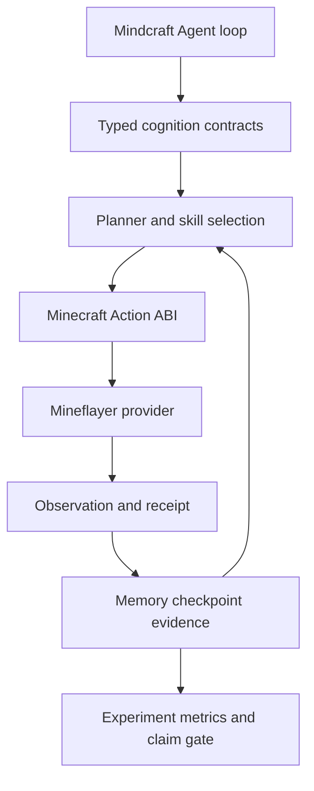

# Mindcraft 能力迁移清单

> 审计对象：用户上传的 Mindcraft 源码包 `00dcd35a-50c3-4dcc-8322-5972e30b20b4.zip`
>
> 归档 SHA-256：`241e8eb4ee23fa89b343bcc102ac7c39d5a028e7657cfc86155152ff554b6993`
>
> 源码版本标记：`mindcraft-develop/`，归档时间 `2026-06-09`

## 1. 结论

Mindcraft 中真正值得迁移的不是某几个 `mineflayer` 调用，而是六组相互配合的能力：

1. 事件驱动的 Agent 编排：输入、上下文、模型决策、命令/技能、结果、再规划。
2. 行动生命周期：串行执行、抢占、协作取消、恢复、超时、快速循环熔断。
3. 结构化 Minecraft 能力：世界查询、资源依赖、导航、采集、建造、容器、熔炼、农牧、村民交互。
4. 认知辅助：自提示、模式控制、空间记忆、历史摘要、技能文档检索、视觉观察。
5. 多 Agent 协作：对话会话、消息排队、忙闲感知、优先级、断线和重启恢复。
6. 可重复任务与评测：crafting、cooking、construction、techtree、Human-AI、蓝图差异评分和并行实验。

这些能力可以迁移到本项目，但必须改写成当前项目的 typed ABI、Evidence、Checkpoint、Evaluation 和 fail-closed claim gate。Mindcraft 的自由代码执行、作弊命令、进程退出、全局单例和字符串命令协议不能直接迁移。

## 2. 源码覆盖范围

上传包不是局部示例，而是一个完整 Mindcraft checkout：

| 范围 | 数量/内容 |
|---|---|
| 归档文件 | 230 |
| JavaScript 源文件 | 75 个，约 13,831 行 |
| Python 辅助/实验脚本 | 16 个 |
| JSON 文件 | 82 个，包括 profile、任务和蓝图 |
| Agent 核心 | `src/agent/agent.js`、`action_manager.js`、`self_prompter.js`、`modes.js` |
| Minecraft 能力 | `src/agent/library/skills.js`、`world.js`、`full_state.js`、`mcdata.js` |
| 目标/任务 | `src/agent/tasks/`、`src/agent/npc/`、`tasks/` |
| 服务与协作 | `src/mindcraft/`、`src/process/`、`src/agent/conversation.js` |
| 模型层 | `src/models/`，动态 Provider Map 和多模型职责分工 |
| 评测规模 | 649 个可递归解析的任务实例：258 techtree、369 cooking、13 construction、10 debug |
| Agent 数量 | 1–5 Agent 任务均存在 |

## 3. 优先级定义

| 标记 | 含义 |
|---|---|
| P0 | 直接决定完整 Agent cognition loop 能否成立；应先迁移 |
| P1 | 让 Minecraft Agent 具备 Mindcraft 级实用能力；紧接 P0 |
| P2 | 重要但可插拔，适合在主闭环稳定后接入 |
| EVAL | 主要迁移为实验协议、数据模型和评测器，不应倒灌运行时 |
| N0 | 明确不迁移原实现；只保留安全后的设计意图或审计记录 |

## 4. P0：Agent cognition loop

### 4.1 Agent 编排

| Mindcraft 文件 | 找到的价值 | 目标改写 |
|---|---|---|
| `src/agent/agent.js` | `start()` 组装 History、Prompter、ActionManager、NPC、Memory、SelfPrompter、Conversation；spawn 后恢复状态并启动事件循环 | 迁移为组合根注入的 `AgentRuntime`；所有依赖通过端口注入，避免 Agent 直接构造具体 Provider |
| `src/agent/agent.js` | `handleMessage()` 将外部消息/系统事件写入历史，调用模型，解析决策，执行动作，再把结果写回上下文 | 接入已有 `AgentCognitionLoop`，把消息变成 `AgentGoal`/`AgentObservation`/`AgentPlanningRequest`，把动作结果变成 typed receipt |
| `src/agent/agent.js` | 任务完成、死亡、健康下降、断线、重生、idle 等事件会触发重新规划 | 迁移为 `ObservationEvent` 和 `ReplanningTrigger`，由运行时统一记录到 trajectory/evidence |
| `src/agent/agent.js` | 新消息到达时丢弃过期模型回复；用户命令优先于自主提示 | 迁移为带 generation/operation id 的 stale-decision rejection，保留用户抢占语义 |
| `src/agent/agent.js` | 只对允许的聊天对象响应；过滤系统命令反馈；自动回复路由到用户或其他 Agent | 迁移为 typed message policy 和 recipient capability，不保留隐式聊天广播 |

### 4.2 ActionManager：必须迁移的执行语义

`src/agent/action_manager.js` 提供了一个很有价值的行动状态机：

- 单一当前动作：`executing`、`currentActionLabel`、`currentActionFn`。
- 新动作开始前停止旧动作，避免并发改变 Minecraft 世界。
- 合作式取消：设置 interrupt，停止挖掘、收集、寻路和 PvP。
- 继续执行：动作可以登记 `resume_func`，等待 bot idle 后继续。
- 每动作 timeout；超时会写入系统历史并触发停止。
- 快速重复动作计数；超过阈值时取消 continuation，严重时熔断死循环。
- 统一返回 `success/message/interrupted/timedout`，把执行输出转成下一轮规划反馈。
- 动作完成后 flush 输出并产生 idle 事件。

迁移到本项目的目标是 `AgentActionExecutorPort` + `ActionLifecycle`，并扩充：

1. `accepted → running → interrupted/completed/failed/timed_out` 状态。
2. `cancellation_token`、软取消 deadline、硬超时边界。
3. `resume_token` 与 checkpoint 绑定，不允许跨 goal/session 恢复。
4. 每个 action 的 before/after observation digest、provider receipt 和 failure code。
5. 快速循环、无进展、重复 action 三类独立 watchdog。

原实现的进程级 `cleanKill()`、错误对象字符串化后再访问 stack 等问题不应复制。

### 4.3 SelfPrompter：自主持续执行器

`src/agent/self_prompter.js` 的高价值不是“自动多问模型几次”，而是一个可恢复的小型状态机：

- `STOPPED / ACTIVE / PAUSED` 三态。
- 保存当前长期目标 prompt，并在重启后恢复。
- 只有 idle 时才自动恢复 loop；动作期间不重复启动。
- 每轮强制模型输出一个 action；连续三轮不产生 action 自动停止。
- 成功动作后 cooldown，降低模型请求和动作抖动。
- 用户动作会中止自提示；对话开始会 pause，对话结束后延迟 resume。
- `stop(stop_action)` 可以只停自主提示，也可以同时停当前动作。

本项目的 `AgentCognitionLoop` 已经有 max steps/time、replan、no-progress、same-action 和 completion claim gate；还应补齐 SelfPrompter 的显式暂停原因、cooldown、no-action watchdog、user-priority 和 session restore 语义。

### 4.4 Modes：高优先级反应行为

`src/agent/modes.js` 将 mode 定义为每 tick 检查世界、必要时抢占当前动作的反应式控制器。原始模式及迁移价值如下：

| Mode | 原始行为 | 迁移级别 |
|---|---|---|
| `self_preservation` | 水下跳跃、远离沙/沙砾坠落、着火时用水/找水、低血量逃离 | P0 safety/reactive mode |
| `unstuck` | 位置长期无变化时脱困；挖黑曜石时放宽阈值；失败可熔断 | P0 progress watchdog |
| `cowardice` | 发现敌对实体且路径清晰时逃离 | P0 survival policy |
| `self_defense` | 发现近距离敌对实体时战斗 | P0 survival policy |
| `hunting` | idle 时猎杀附近可猎动物 | P1 background behavior |
| `item_collecting` | 发现掉落物后等待短暂稳定，再自动拾取 | P1 background behavior |
| `torch_placing` | 无附近火把且有火把时限流放置 | P1 navigation support |
| `elbow_room` | 与附近玩家保持空间距离，并随机抖动避免多个 bot 同步移动 | P2 multi-agent behavior |
| `idle_staring` | idle 时看向附近实体或随机转头 | P2 embodiment/UI behavior |
| `cheat` | `/setblock` 和 teleport | N0；只能作为非论文 sandbox provider |

应迁移为 `AgentReactiveModePort`：

- mode 有稳定 id、priority、preconditions、interrupt policy、cooldown、state digest。
- mode 只能输出已经注册的 `AgentActionSequence`，不能返回代码或绕过 Action ABI。
- 反应 mode 的抢占、恢复、重规划原因和事件证据必须进入 checkpoint。
- mode 更新循环不能阻塞；长动作交给 executor，tick 只做 bounded review。

## 5. P0：记忆、上下文和技能检索

### 5.1 空间记忆

`src/agent/memory_bank.js` 提供命名地点记忆：

- `rememberPlace(name, x, y, z)`。
- `recallPlace(name)`。
- `getKeys()`、`getJson()`、`loadJson()`。
- Agent 死亡时保存 `last_death_position`，之后可以回到死亡地点。

应迁移为 typed `SpatialLandmarkMemory`，至少包含：

`landmark_id/name`、三维坐标、dimension、world/session、来源 observation、created/updated generation、置信度、TTL 和 digest。不能只保存无 provenance 的 `{name: {x,y,z}}`。

### 5.2 历史摘要和轨迹

`src/agent/history.js` 同时维护：

- 当前短上下文 turns。
- LLM 生成的自然语言 memory summary。
- 到达阈值后按 chunk 摘要，并把完整 chunk 追加到历史文件。
- 保存 self-prompt 状态、task start、last sender；重启可恢复。

值得迁移的抽象是“短上下文 + 可检索长期记忆 + 完整可审计轨迹”三层，而不是直接复制 JSON 文件布局。当前 SEM 项目已有 evidence/trajectory/checkpoint 基础，下一步应把 Agent cognition 的 episodic memory 也接到同一稳定 Memory ABI 中，并保持 `J = J^mem ⊕ J^audit` 的分离。

### 5.3 SkillLibrary：文档检索/RAG

`src/agent/library/skill_library.js` 和 `library/index.js` 实现了：

- 从技能函数 JSDoc 生成 skill docs。
- 可选 embedding 检索；失败时回退到词重叠。
- 固定注入安全关键 docs：`placeBlock`、`wait`、`breakBlockAt`。
- 返回带分隔符的相关技能上下文供 prompt 使用。

应改写为已有 `AgentSkillLibraryPort` 的结构化实现：

- 检索对象是 `AgentSkillRecord`/`AgentSkillDescription`，不是任意源码字符串。
- 支持 embedding、lexical、tag/category、成功率和适用条件的混合排序。
- 安全关键 skill 永远进入 planner context。
- 记录 query id、候选集、最终选择、recipe digest，保证可复现实验。
- 不把可执行 JS 源码暴露给模型。

## 6. P0/P1：世界观察和世界查询

### 6.1 Rich Observation

`src/agent/library/full_state.js` 已经形成一个实用的状态投影，包含：

- 位置、维度、游戏模式、生命、饥饿、生物群系、天气、昼夜。
- 脚下/腿部/头部/头顶第一实心方块。
- 附近人类玩家、其他 Agent、附近实体类型。
- 背包计数、已用槽位、总槽位、盔甲和主手装备。
- 当前 action、idle/chatting/thinking/stopped 等 activity kind。
- 当前 mode 简表。

迁移时需要把字符串活动状态扩成稳定枚举，并额外保留：

- visible entities 的 id/距离/位置/危险等级。
- 目标/当前 skill/sequence/action。
- 当前 mode snapshot 和暂停原因。
- 容器、熔炉、村民交易界面等 interaction state。
- observation generation、dimension/world id、state digest。

### 6.2 World query primitives

`src/agent/library/world.js` 提供了应落到 Minecraft observation/query provider 的完整查询族：

| 查询族 | 能力 |
|---|---|
| 空间几何 | nearest free space、相对坐标 block、周围三格、头顶阻挡 |
| 方块搜索 | nearest blocks、predicate search、nearest block、附近 block types |
| 实体搜索 | nearby entities、nearest entity predicate、nearby players、entity types |
| Minecraft 语义 | villager profession、biome、inventory counts、craftable items |
| 路径可达性 | 不挖、不放、不自动开门的 clear-path probe |
| 生存辅助 | 是否需要放火把、敌对/可猎实体分类 |

这些 helper 的价值在于把 planner precondition 做成确定性查询；不要让 LLM 自己猜坐标、方块可达性或配方。

### 6.3 Minecraft data/recipe graph

`src/utils/mcdata.js` 的高价值包括：

- item/block/entity/biome registry lookup 和名称规范化。
- item→crafting recipes、recipe ingredients、产出数量。
- item→smelting ingredient、fuel type、fuel output。
- item→block source、animal source、block tool。
- `calculateLimitingResource()` 计算动作可执行次数和限制资源。
- `getDetailedCraftingPlan()` 递归展开多步配方，记录 required/steps/leftovers。
- 循环 item set，避免配方图递归发散。
- 初始化 Mineflayer plugin：pathfinder、pvp、collectblock、autoEat、armor-manager。
- 连接层的 position packet throttling 和部分非关键 PartialReadError 抑制。

配方计划和资源限制计算应迁移为纯函数、可 digest、可测试的 `MinecraftRecipeGraph`；连接层修复则属于 provider/runtime，不应进入 Agent cognition API。

## 7. P1：Minecraft 原子技能全集

### 7.1 资源、制造和熔炼

来自 `src/agent/library/skills.js`：

| Skill | 原始关键语义 |
|---|---|
| `craftRecipe` | 先找无工作台配方；需要时查找/临时放置 crafting table；移动到工作台；按限制资源裁剪 craft 次数；完成后回收临时工作台并自动穿戴盔甲 |
| `smeltItem` | 找/临时放置 furnace；检查已有 input；检查原料和 fuel；根据燃料产能计算数量；轮询 output；超时/中断后取回 input/fuel；关闭窗口并回收临时炉子 |
| `clearNearestFurnace` | 打开最近 furnace，取出 output/input/fuel，关闭并返回摘要 |
| `collectBlock` | 支持矿石别名、deepslate、grass/dirt、stone/cobblestone；只收集液体 source block；检查安全破坏、工具、背包满、NoChests；循环收集并自动补火把 |
| `pickupNearbyItems` | 关闭挖掘和放置寻路，逐个跟随掉落物，检测拾取是否推进 |
| `autoLight` | 依据附近火把和当前空气位置决定是否放置火把 |
| `equipHighestAttack` | 按 attackDamage 选择剑/斧，退化到镐/铲 |
| `wait` | 可中断 sleep，最多以短片段等待，避免不可取消的长 timer |

### 7.2 方块、背包和容器

| Skill | 原始关键语义 |
|---|---|
| `breakBlockAt` | 检查坐标和空气/液体；按 cheat/生存分支；移动到 4.5 格内；装备正确工具并检查 harvest；挖掘后返回结果 |
| `placeBlock` | 目标已存在/有障碍/无可搭载邻块时拒绝；寻找邻接 build-off block；根据 top/bottom/方向选择 face；处理火把、按钮、拉杆、梯子、红石、门、床；太近/太远时调整位置；最终验证调用结果 |
| `equip` | hand、盔甲、盾牌、工具分类装备；creative 可补入物品，但生产实验不得默许 |
| `discard` | 支持跨多个 inventory stack 丢弃指定数量，并返回实际丢弃量 |
| `putInChest` | 找最近 chest、移动、打开 container、按 item type deposit、关闭 |
| `takeFromChest` | 多 slot 汇总 matching items，按剩余量逐 slot withdraw |
| `viewChest` | 打开/读取/关闭容器，返回物品清单 |
| `consume` | 找 item、装备到手、调用 consume、返回结果 |
| `giveToPlayer` | 找玩家、移动到合适距离、避免过近、丢物品、监听 `playerCollect` 确认对方真正收到 |

### 7.3 导航、跟随和空间控制

| Skill | 原始关键语义 |
|---|---|
| `goToGoal` | 统一 pathfinder.goto，周期性记录路径进度，支持 interrupt_code，结束时 stop |
| `goToPosition` | 坐标、最小距离、路径进度和最终距离验证；设置不挖/不放等 movement policy |
| `goToNearestBlock` | 液体优先 source block，距离上限 512，找不到时明确失败 |
| `goToNearestEntity` | 按 entity type 搜索并保持 min distance |
| `goToPlayer` | 找玩家、保持距离；cheat 模式可 teleport；移动期间暂停 self-defense/cowardice |
| `followPlayer` | 无限跟随直到 interrupt；远距离暂停拾取/狩猎/火把模式；太远 cheat teleport；接近时恢复模式；动态开门和脱困 |
| `moveAway` | 对当前位置构造 inverted goal，生存时正常寻路，cheat 时只在 sandbox 使用 teleport |
| `moveAwayFromEntity` | 对实体构造反向跟随目标 |
| `avoidEnemies` | 持续离开敌对实体；过近时允许短暂反击；中断后停止 pathfinder |
| `stay` | 暂停全部 background modes，持续到 timeout 或 interrupt |

### 7.4 交互、生存、农牧和村民

| Skill | 原始关键语义 |
|---|---|
| `useDoor` | 找门、移动到门边、检查 open 属性、开门、向前穿过、再次交互 |
| `goToBed` | 找最近床、寻路、sleep，等待醒来，临时暂停 unstuck |
| `tillAndSow` | 检查 farmland/grass/dirt、清理上方方块、装备 hoe、耕地、规范 seed/seeds、播种 |
| `activateNearestBlock` | 找最近 lever/button 等可激活方块、靠近、activate、记录坐标 |
| `showVillagerTrades` | 定位 villager、拒绝 baby/jobless、移动并打开交易界面，输出 trade uses/input/output |
| `tradeWithVillager` | 校验 trade index、disabled、剩余次数和资源，按 maxPossibleTrades 限制执行次数 |
| `digDown` | 逐层下挖；遇水/岩浆/大落差/世界边界停止；每层验证 break |
| `goToSurface` | 从高 Y 向下找非空气表面，再移动到表面 |
| `useToolOn` / `useToolOnBlock` | 支持 entity/block/nothing；液体只取 source；检查视线遮挡；移动、装备、activate/useOn |

这些技能都应改成 `Minecraft Action ABI → provider → postcondition verification`，返回 `applied/partial/rejected`、before/after observation 和 evidence refs。不能让 provider 通过 chat 字符串或 cheat 命令绕过验证。

## 8. P1：目标分解、配方规划和建造

### 8.1 ItemGoal 配方/资源依赖规划

`src/agent/npc/item_goal.js` 是值得重点迁移的 planner，而不是普通 helper：

- 每个 item 可以有 craft/block/smelt/hunt 多种获取方法。
- craft 节点递归创建 ingredient nodes；超过 4 个 ingredient 时自动加入 crafting table 前置。
- block 节点关联 source block 和工具前置。
- smelt 节点关联 furnace、原料和 coal。
- hunt 节点关联动物来源。
- `getNext()` 选择当前可执行的叶节点。
- `getDepth() + getFails()` 选择最便宜的 method，失败会提高该分支成本。
- 检测循环依赖并跳过黑名单（如 block-to-block 无限扩展、netherite、染料等高风险/高复杂度项）。
- 每次执行前后比较库存数量，验证是否真的增加目标物品。
- 附近没有资源时先等待/重试，重复失败后探索移动。

迁移目标是通用 `ResourceDependencyPlanner`：输入目标、数量、inventory、world availability、recipe graph，输出 typed plan DAG 和下一 action；计划中必须标记 deterministic source、失败次数、资源假设、预估深度和证据。

### 8.2 Blueprint 与 construction

`src/agent/tasks/construction_tasks.js` 和 `src/agent/npc/build_goal.js` 提供完整建造链：

- `Blueprint` 以 level/coordinate/placement 记录三维结构。
- `check()` 返回 matches/mismatches，逐坐标记录 expected/actual。
- `explainLevelDifference()` 将缺失、冗余和错误方块转换为可执行修复描述。
- `ConstructionTaskValidator` 计算 match ratio，并要求零 mismatch 才算成功。
- `worldToBlueprint()` 把现实世界区域采样成 blueprint，并统计材料。
- `blueprintToTask()` 将材料分配到多 Agent 初始 inventory。
- `proceduralGeneration()` 生成可控宽度、高度、深度、房间数、窗户、地毯、材料复杂度的房屋结构。
- `BuildGoal` 逐 level/row/column 检查当前 block；错误方块先 break，再按库存 place；缺材料形成临时 item goals；保存 position/orientation，后续可继续同一建筑。
- NPC controller 会在 idle 时继续未完成 goal，并按昼夜出屋/回家/睡觉。

必须迁移的设计是：`blueprint → diff → ordered placement plan → material subgoals → placement verification → retry/replan`。原始 `autoBuild()`/`autoDelete()` 通过 `/setblock` 生成命令，只能作为离线蓝图转换工具，不能作为真实论文运行时执行器。

`src/agent/tasks/cooking_tasks.js` 则是 benchmark world initializer：它清理受控区域，随机放置不重叠的 crop/animal/house 区域，设置 farmland、water、mushroom、sugar cane、furnace/smoker/crafting table，并重置附近实体。它的价值是可复现的 task fixture 生成器；必须改写为带 seed、world digest 和 setup evidence 的实验环境初始化器，不能把 `/fill`、`/setblock`、`/summon` 直接暴露给 Agent。

### 8.3 NPC Controller

`src/agent/npc/controller.js`、`data.js`、`utils.js` 提供：

- 持久 goals、当前 goal、已建建筑、home、routine、do_set_goal。
- 目标可以是 item 或 construction。
- 建造缺材料自动插入 temp_goals。
- 根据建筑 orientation 计算范围和门位置。
- 时间超过 13,000 时停止日间目标，回 home、开门、睡觉。
- 可让 LLM 根据历史、inventory 和已完成/失败 goals 选择下一目标。

迁移为 `AgentLongHorizonGoalPort`/`MinecraftRoutineController`，但所有 goal choice、day/night transition、home state 都必须进入 observation/evidence，不能靠隐藏对象状态。

## 9. P1：多 Agent 协作

### 9.1 Conversation Manager

`src/agent/conversation.js` 中值得迁移的机制：

- 每个伙伴独立 Conversation：active、ignore_until_start、blocked、incoming queue。
- 同一时刻只允许一个 active conversation。
- 收到多条消息先排队再批量合并。
- 根据双方 busy/action 状态决定 200ms 或 5s 响应延迟。
- 某些可被谈话覆盖的动作：stay、followPlayer、mode。
- 对话开始暂停 self-prompt，对话结束延迟恢复。
- 伙伴断线有超时清理，避免永久占用会话。
- 新消息会取消旧 response timer；对方 start/end 通过显式包标记。

迁移为 typed `AgentMessagePort` 和 `ConversationSession`，消息必须有 sender/recipient/session/generation/priority/kind，所有消息进入 trajectory。不能把 Socket.IO JSON 直接当平台契约。

### 9.2 MindServer / process layer

`src/mindcraft/mindserver.js`、`mindserver_proxy.js`、`mindcraft.js`、`src/process/` 提供：

- central hub 管理 Agent 注册、在线状态、viewer port、settings。
- Agent 进程独立，异常退出后有限条件重启。
- socket 传输聊天、bot output、settings、full state、start/stop/restart/destroy。
- 状态 listener 每秒拉取所有 Agent 的 full state。
- `mcserver.js` 探测 LAN server、解析版本、拒绝不支持版本。
- Python bridge 可启动 Node server 并通过 Socket.IO 创建 Agent。

迁移方向：保留“中央控制面 + Agent worker + typed status stream”的拓扑；将 Socket.IO payload 替换为命名 port/contract，加入 operation id、backpressure、断线重连、lease 和 evidence receipt。Mindserver 的 UI、texture proxy、open browser 是 P2 product surface，不是 Agent cognition 的前置条件。

## 10. P1/P2：模型、提示词、示例和视觉

### 10.1 Prompter / profile system

`src/models/prompter.js` 和 `profiles/` 的价值：

- 三层配置合并：default → base profile → individual/task profile。
- 职责分离：chat model、code model、vision model、embedding model、speak model。
- prompt placeholder 注入：`$STATS`、`$INVENTORY`、`$ACTION`、`$COMMAND_DOCS`、`$CODE_DOCS`、`$EXAMPLES`、`$MEMORY`、`$CONVO`、`$SELF_PROMPT`、`$LAST_GOALS`、`$BLUEPRINTS`。
- prompt cooldown，避免 API 速率和自提示抖动。
- generation 重试、过期消息丢弃、伪装成其他 bot 的回复拒绝。
- memory saving、bot responder、goal setting、vision analysis 是不同 prompt contract。
- conversation/coding examples 通过 embedding 选择相关 few-shot。
- prompt/response 可按 task id 记录，支持审计和调试。

迁移为平台级 `ModelRoleBinding` 和 typed `PromptContext`，每次 planner call 都记录模型角色、profile digest、retrieved examples/skills digest、prompt digest、response parse result。不能复制 Mindcraft 的自由文本 `!command` 作为新 ABI。

### 10.2 动态 Provider Map

`src/models/_model_map.js` 动态扫描 provider，按静态 `prefix` 注册；当前包中有 Azure、Cerebras、Claude、DeepSeek、Gemini、GLHF、GPT/OpenAI、Grok、Groq、HuggingFace、Hyperbolic、LMStudio、Mercury、Mistral、Novita、Ollama、OpenRouter、Qwen、Replicate、vLLM。

值得迁移的是：

- provider discovery/selection 的显式机制。
- chat/vision/embedding/voice 的职责隔离。
- 本地模型和自托管 OpenAI-compatible endpoint 的统一接入。
- provider capability check 和 embedding 不可用时的 deterministic lexical fallback。

不应把每一个 Mindcraft API adapter 原样复制到项目；本项目已有 model qualification、closure、live evidence 和 experiment binding，Provider 必须通过这些边界进入。

### 10.3 Command/Query catalog 的可迁移部分

`src/agent/commands/actions.js`、`commands/queries.js`、`commands/index.js` 还有一层容易被忽略的价值：它们把每个能力的名称、描述、参数类型、数值域、timeout/resume policy 和是否为 action 集中登记。应迁移“registry metadata”，不迁移 `!foo(...)` 字符串协议。

有价值的 query 集合包括：

- `stats`：位置、维度/模式、健康、饥饿、生物群系、天气、时间、当前 action、附近人类/Agent、mode。
- `inventory`：物品计数、穿戴装备、creative/inventory 限制。
- `nearbyBlocks`：方块类型、水/岩浆 source/flowing、周围方块、头顶第一实心方块。
- `craftable`：基于当前 inventory 和附近 crafting table 的可制造物品。
- `entities`：人类/Agent、实体计数、村民 id、职业、baby villager 不可交易提示。
- `modes`：所有可用 mode 的开关和文档。
- `savedPlaces`：空间记忆索引。
- `checkBlueprint` / `checkBlueprintLevel` / `getBlueprint`：结构进度、差异和 blueprint 摘要。
- `getCraftingPlan`：目标物品、数量、当前库存扣除后的详细配方计划。

参数校验也值得保留：int/float/bool/string、数值 interval、Item/Block/Entity registry lookup、常见名称规范化（如 plank/seeds）。在本项目中这些规则应成为 `ActionSpec`/`ObservationQuerySpec` 的强类型字段，并由 ABI gate 校验。

### 10.4 Examples、语言和输出辅助

| 文件 | 价值 | 迁移边界 |
|---|---|---|
| `src/utils/examples.js` | 对话或 coding examples 的 embedding 选择，失败回退 word-overlap，深拷贝返回避免 prompt 修改原数据 | 迁移为带 dataset/version/digest 的 few-shot retriever；coding examples 不进入正式 typed-action planner |
| `src/utils/text.js` | strict role formatting、重复 role 合并、Anthropic 起始 user filler、单 prompt 序列化、词重叠评分 | 迁移为 Model Provider adapter 的 prompt normalization，不进入环境层 |
| `src/utils/translator.js` | 入站统一翻译成英文、出站翻译到用户语言；失败时保留原文 | 作为可选 message presentation provider；原始/翻译文本都要保留，避免证据失真 |
| `src/agent/speak.js` | TTS 队列、远程/系统 TTS、串行播放、失败跳过 | P2 presentation port；不阻塞 cognition loop，不写入科学 action success |
| `src/agent/connection_handler.js` | 将 kick/disconnect 文本映射为 name conflict/access/version/network/behavior 等稳定类型，统一 LoginGuard 输出 | 迁移为 typed connection failure taxonomy 和 retry policy，不能只按字符串匹配后 process exit |

### 10.5 Vision

`src/agent/vision/camera.js`、`vision_interpreter.js`、`browser_viewer.js` 提供：

- 基于 prismarine-viewer 的 first-person screenshot。
- `lookAtPlayer`、同向观察和 `lookAtPosition`。
- center cursor block 信息和图像分析组合。
- vision 可选，未启用时明确返回 disabled，而非静默伪造。
- 浏览器 viewer 以 agent-specific port 暴露实时视图。

迁移为 `VisualObservationPort`：图片、相机位姿、目标 block raycast、vision model response、artifact ref 和 digest 一并记录。视觉必须是 observation modality，不应绕过世界状态验证，也不能让截图分析直接执行 action。

## 11. EVAL：任务、协作和科学评测资产

Mindcraft 的 tasks 目录本身是非常有价值的 benchmark 资产，但它应进入项目的 experiment/evaluation 层。

### 11.1 任务类型

| 类型 | 任务结构 | 可迁移指标/能力 |
|---|---|---|
| `techtree` | 目标物品、初始 inventory、recipe depth、是否需要 crafting table、blocked actions | 资源依赖规划、协作信息共享、长程 craft success |
| `cooking` | 食材/烹饪配方、共享生产世界、多 Agent 交付 | 资源分工、容器/炉子/农牧、交付闭环 |
| `construction` | 多 level blueprint、坐标、placement、材料分配 | edit distance、placement ordering、材料子目标、建造验证 |
| `debug` | 受控开发/回归场景 | provider/action contract smoke |
| Human-AI | 一个或多个 human + Agent 的共同任务 | 人机协作、响应延迟、语言计划和任务结果 |

### 11.2 评测方法

可迁移的评测资产：

- crafting/cooking：inventory target predicate，成功为 0/1。
- construction：逐方块 `matches/mismatches`，报告 match ratio/edit score。
- blocked actions：任务级能力消融，检验 Agent 是否找到替代方案。
- initial inventory 分配：控制每个 Agent 的信息、资源和工具不对称。
- Hell's Kitchen：每个 Agent 只知道部分 recipe，必须通过对话共享信息。
- task timeout、缺失 Agent 超时、任务重启和 memory restore。
- 多任务文件生成器、train/test split、易难度过滤、multi-agent 数量 sweep。
- 平行 Minecraft world、tmux/server_data、实验结果汇总、S3 归档。

对应实现分布在 `tasks/evaluation_script.py`、`tasks/run_task_file.py`、`tasks/analyse_results.py` 以及各类 task generator/analyzer 脚本中。它们应迁移为当前项目的 fixture compiler、ExperimentPlan compiler、result reducer 和 evidence bundle builder，而不是作为新的运行时入口复制。

迁移时要把这些结果接到当前 SEM 的 Core-6、12 repetitions、statistics、claim gate 和 live evidence；不能把 Mindcraft 的 `memory.json` 或 `results.txt` 直接当论文证据。Core-6 仍然冻结，`CORE-E` 为主要 outcome，held-out ELCE 和其余科学证据继续按现有 fail-closed 规则执行。

### 11.3 任务数据模型字段

原任务 JSON 中值得保留的字段包括：

`task_id`、`type`、`goal`、`conversation`、`agent_count`、`human_count`、`initial_inventory`、`target`、`number_of_target`、`max_depth`、`depth`、`timeout`、`blocked_actions`、`missing_items`、`requires_ctable`、`blueprint`、`restrict_to_inventory`。

应转成 `ExperimentTaskSpec`/`MinecraftTaskSpec` 的强类型字段，并为每个 field 计算 plan/task digest；禁止通过缺字段静默推断实验条件。

## 12. N0：必须排除或隔离的能力

| 原始资产 | 原因 | 安全替代 |
|---|---|---|
| `src/agent/coder.js`、`bots/execTemplate.js`、`bots/lintTemplate.js` | LLM 生成并执行任意 JS；即便有 SES，原项目自己也警告存在 prompt injection 风险 | 只允许 typed skill/action selection；若未来研究代码生成，单独隔离 sandbox，不进入正式 Minecraft/SEM claim path |
| `src/agent/library/lockdown.js` | `evalTaming: unsafeEval` 是 Mineflayer 兼容妥协，不等于科学运行安全 | capability allowlist、无 eval 的 action registry；单独标注不受信任插件边界 |
| `cheat` mode、`/setblock`、`/tp`、`/fill`、`/summon`、`/kill` | 绕过真实 embodied execution，破坏 T2B qualification 和论文可比性 | 仅允许离线 world fixture/setup provider；运行时以 `setup` evidence 标记，不能混入 agent action evidence |
| `!command` 字符串 parser | 文本协议易产生注入、歧义和参数绕过；全局 command map 可被动态删改 | `AgentSkillSelection` + typed payload + ABI validation |
| `process.exit()` 作为失败恢复 | 进程级副作用不可组合，破坏 checkpoint/retry/evidence | structured failure、scope policy、可恢复 lifecycle |
| `searchWiki` 直接 fetch 外部网页 | 不可复现、网络变化、可能把外部文本直接带入 prompt | 明确的 versioned knowledge provider 或离线资料快照 |
| 全局 `_agent`、全局 `modes_map`、singleton conversation manager | 多实验/多 Agent/并行运行会互相污染 | per-session/per-agent instance，由 composition root 注入 |
| 以文件 `hells_kitchen_progress.json` 协调 Agent | 跨运行污染、竞态、缺少 digest/provenance | typed coordination state + checkpoint/evidence store |
| 原始 model adapter 的字符串/裸异常处理 | 不满足本项目 model qualification、live closure 和证据要求 | 统一 Model Provider port、capability manifest、retry budget、receipt |

## 13. 当前项目已迁移与尚未迁移

### 已经落地的迁移骨架

当前项目的暂存版本已经包含：

- `AgentGoal`、`AgentObservation`、`AgentMemoryContext`、`AgentSkillSelection`、`AgentActionSequence` 等 typed cognition contracts。
- `AgentCognitionLoop`：observe → recall → retrieve skills → plan → expand → safety/mode review → execute → observe → memory/evidence → checkpoint → replan。
- max steps/time、replan、no-progress、same-action、invalid completion claim、checkpoint/session/goal digest 校验。
- `AgentSkillLibraryPort` 和平台 `InMemorySkillLibrary`，记录 typed recipe 与成功/失败计数。
- `AgentReactiveModePort` 和 Minecraft provider mode 的 abort/replan/preempt 映射。
- Minecraft workload 对 cognition loop、observation、planner、executor、completion、evidence、progress 的适配。
- 运行结果中的 cognition termination、failure code、plan/checkpoint digest、selected skills 和 action receipts。
- `AgentActionManager`：串行 action lifecycle、拒绝重试、协作式中断、超时证明、状态快照。
- `AgentSelfPrompter`：持久目标、ACTIVE/PAUSED/STOPPED、cooldown、no-command watchdog、用户会话抢占。
- `InMemoryAgentMemory`：spatial landmark + episodic action memory，`J^mem`/`J^audit` plane 隔离，verified-only recall。
- `InMemorySkillLibrary`：只保存 typed recipe、成功/失败计数和检索排序，不保存可执行源码。
- `ReactiveModeController`、`AgentGoalGraph`、`AgentConversationManager`、`AgentPromptAssembler` 和 optional `VisionObservationProjector`。
- Minecraft rich observation、38 个原子动作 skill、8 个高层 skill（resource plan/build/explore/survive/farm/social/transport/utility）、安全监督、completion predicate、hostile preemption。
- Minecraft Action ABI/真实 Mineflayer bridge 已扩展到 38 个动作，覆盖 follow/stay、pickup/lighting、farming、fishing、door/bed、activation、villager trades、mount/dismount、tool use；全部经过 typed validation 和 applied/partial/rejected postcondition 语义。
- 新增 `MinecraftTaskSpec`/`MinecraftTaskKind`/蓝图评分与 `compile_mindcraft_task_manifest.py`，可将 Mindcraft techtree/cooking/construction/debug/Human-AI JSON 转为带 task/manifest digest 的实验 fixture。
- 当前上传归档已实际编译为 `projects/sem_paper/experiments/manifests/mindcraft_tasks_v1.json`：649 个有效任务，manifest digest 为 `5a3f6af5cb50bd1e78abf83c41fa231821f30a7cc5b7bb2e6d77ad4708779976`；1 个无蓝图 construction 模板被显式记录为 skipped。
- 新增 `AgentCoordinationHub`，提供 1–5 Agent 的 typed 注册、忙闲状态、优先级消息路由、断线状态和 checkpoint digest；Conversation 支持 generation、interrupt/task kind、队列 drain 与 resume。
- Minecraft resource dependency planner、cycle detection、blueprint diff/ordered placement、world queries、NPC-style day/night routines。
- `MinecraftCognitionRunner`、`MinecraftCognitionFactory` 与 `SemPaperCognitionPlannerAdapter`：旧 Paper planner 已通过 production root 注入 typed cognition loop，继续使用现有 evidence/progress 端口。
- 无服务器 fake provider 的端到端测试：goal → planner → skill selection → validated action → verified observation → memory/checkpoint → completion。

### 已完成的运行时迁移；仍需真实 provider/实验数据的部分

1. 已完成 runtime contract、production cognition injection 和 38-action Mineflayer provider；仍需在持久化真实世界中为每个动作生成 T2B postcondition evidence。
2. 已完成 resource/blueprint/world-query 规划和 task fixture compiler；仍需将用户上传的完整 649 任务资产实际编译并在真实世界运行。
3. 已完成 typed conversation、1–5 Agent coordination hub 和 vision seam；仍需 2–5 Agent 的真实 server branch 协作和实际相机/视觉 artifact 运行证据。
4. 已完成 Paper planner adapter；qualified model closure、持久化 Minecraft T2B PASS 和正式辅助科学证据仍只能由外部部署产生。
5. Core-6、12 repetitions、statistics、Holm 校正、Scientific Closure 和 claim gate 仍保持原有 fail-closed 约束，不因 runtime 迁移而自动放行论文结论。

当前真实外部阻断仍是 qualified model closure、持久化 Minecraft T2B PASS 和正式辅助科学证据；这些不能由 Mindcraft 文件、mock、replay 或代码声明替代。

## 14. 推荐迁移顺序

### 阶段 A：闭合 Cognition P0

1. 已将 `MinecraftCognitionRunner` 绑定到正式 branch composition 的 progress/evidence sink。
2. 在持久化 Mineflayer world 对每个已注册 skill 产生 action receipt 和 postcondition evidence。
3. 将高层 resource/build skills 用任务 fixture 驱动，接入 Core-6 每个 variant/repetition 的 branch identity。

验收：无 Minecraft 服务器的 fake provider 可运行多轮 observe/plan/act/replan/checkpoint，覆盖中断、超时、恢复、无进展和错误 completion claim。

### 阶段 B：闭合 Minecraft P1

1. query/world projection。
2. navigation and safety primitives。
3. inventory/container/consume/equip/give。
4. collect/break/place。
5. recipe/craft/smelt/resource planner。
6. farming/door/bed/activation/villager。
7. blueprint/build diff and material subgoals。

验收：每个动作都要有 ABI validation、provider receipt、postcondition observation、failure classification 和 replayable evidence。

### 阶段 C：协作与视觉 P1/P2

1. typed ConversationSession 和 coordination state。
2. multi-agent message scheduling、offline/reconnect、resume。
3. optional visual observation/camera artifact。
4. central status stream/UI adapter。

验收：2–5 Agent 的协作任务在独立 branch identity 下不互相污染，所有 message/action/state 都可追溯到 variant/repetition/agent。

### 阶段 D：Benchmark/EVAL

1. 转换 Mindcraft tasks 为强类型 experiment fixtures。
2. 建立 crafting/cooking/construction 三类 provider-backed benchmark。
3. 复现 blocked recipe、Hell's Kitchen、blueprint edit score、Human-AI 条件。
4. 接入 Core-6、12 repetitions、统计比较、Holm 校正、Scientific Closure 和 claim gate。
5. 最后在真实持久 Minecraft world 产生 T2B live evidence。

## 15. 最终映射

迁移的核心原则是：借 Mindcraft 的能力与失败恢复经验，不借它的架构边界。最终目标不是把当前项目变成 Mindcraft 的复制品，而是得到一个具备 Mindcraft cognition loop、同时保留本项目可审计、可复现、可评估和 fail-closed 科研能力的 Minecraft Agent Research Platform。
